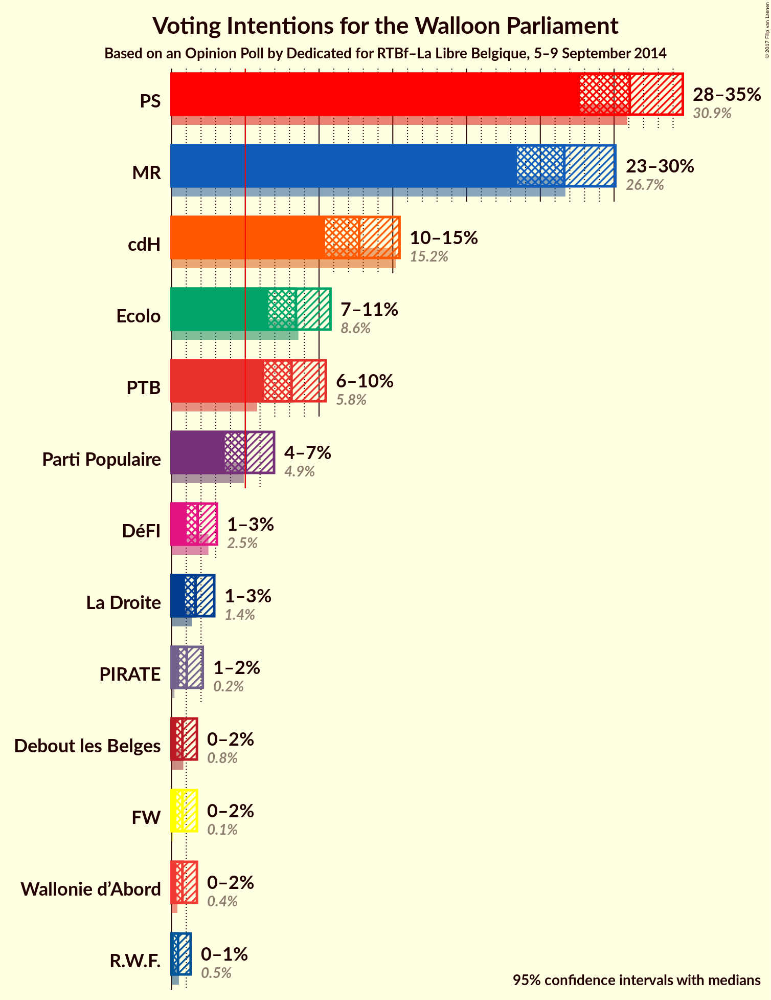
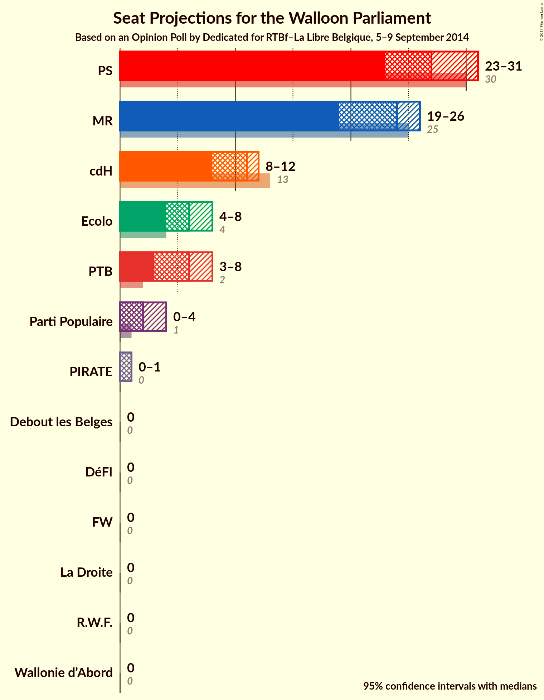
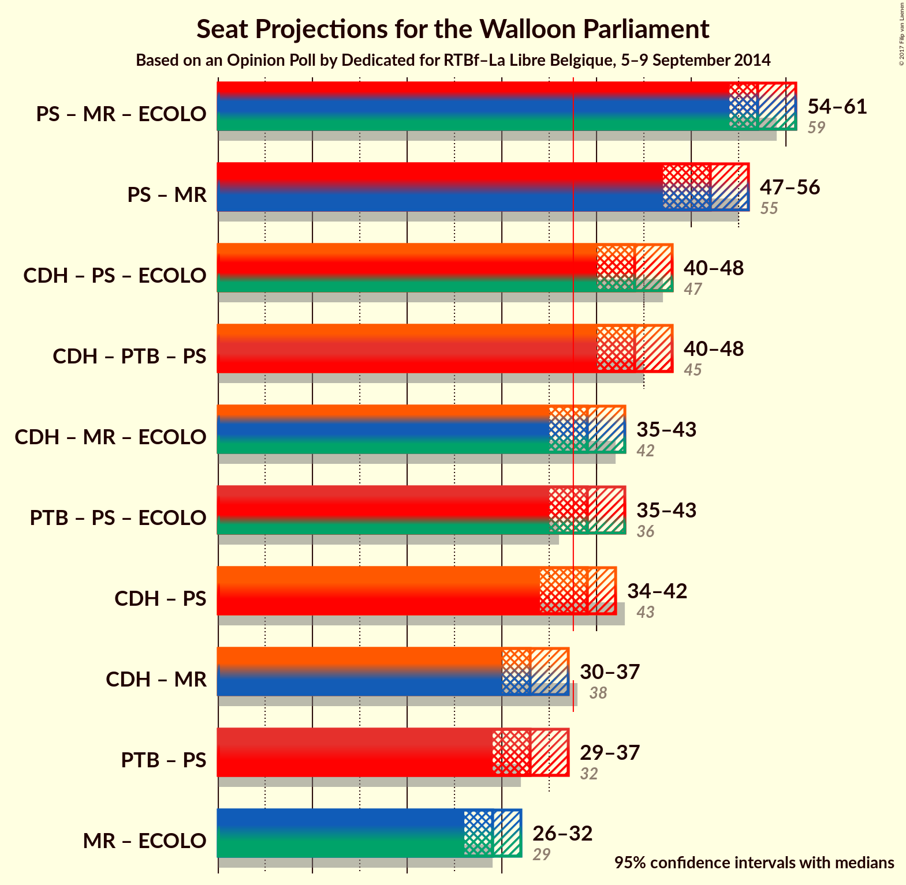

# Opinion Poll by Dedicated for RTBf–La Libre Belgique, 5–9 September 2014

<a href="#voting-intentions">Voting Intentions</a> | <a href="#seats">Seats</a> | <a href="#coalitions">Coalitions</a> | <a href="#technical-information">Technical Information</a>

## Voting Intentions

### Confidence Intervals

| Party | Last Result | Poll Result | 80% Confidence Interval | 90% Confidence Interval | 95% Confidence Interval | 99% Confidence Interval |
|:-----:|:-----------:|:-----------:|:-----------------------:|:-----------------------:|:-----------------------:|:-----------------------:|
| PS | 30.9% | 31.1% | 28.9–33.4% |28.2–34.1% |27.7–34.7% |26.6–35.8% |
| MR | 26.7% | 26.6% | 24.5–28.9% |23.9–29.5% |23.4–30.1% |22.5–31.2% |
| cdH | 15.2% | 12.7% | 11.2–14.5% |10.8–15.0% |10.4–15.5% |9.7–16.3% |
| Ecolo | 8.6% | 8.4% | 7.2–10.0% |6.9–10.4% |6.6–10.8% |6.0–11.6% |
| PTB | 5.8% | 8.1% | 6.9–9.6% |6.6–10.1% |6.3–10.5% |5.8–11.2% |
| Parti Populaire | 4.9% | 5.0% | 4.1–6.3% |3.8–6.6% |3.6–7.0% |3.2–7.6% |
| DéFI | 2.5% | 1.8% | 1.3–2.6% |1.1–2.9% |1.0–3.1% |0.8–3.5% |
| La Droite | 1.4% | 1.6% | 1.2–2.5% |1.0–2.7% |0.9–2.9% |0.7–3.3% |
| PIRATE | 0.2% | 1.0% | 0.7–1.7% |0.6–1.9% |0.5–2.1% |0.4–2.5% |
| Wallonie d’Abord | 0.4% | 0.7% | 0.5–1.4% |0.4–1.6% |0.3–1.7% |0.2–2.1% |
| Debout les Belges | 0.8% | 0.7% | 0.5–1.4% |0.4–1.6% |0.3–1.7% |0.2–2.1% |
| FW | 0.1% | 0.7% | 0.5–1.4% |0.4–1.6% |0.3–1.7% |0.2–2.1% |
| R.W.F. | 0.5% | 0.4% | 0.2–1.0% |0.2–1.1% |0.2–1.3% |0.1–1.6% |

*Note:* The poll result column reflects the actual value used in the calculations. Published results may vary slightly, and in addition be rounded to fewer digits.

## Seats

### Confidence Intervals

| Party | Last Result | Median | 80% Confidence Interval | 90% Confidence Interval | 95% Confidence Interval | 99% Confidence Interval |
|:-----:|:-----------:|:------:|:-----------------------:|:-----------------------:|:-----------------------:|:-----------------------:|
| <a href="#ps">PS</a> | 30 | 27 | 24–29 |24–31 |23–31 |23–34 |
| <a href="#mr">MR</a> | 25 | 24 | 20–25 |20–25 |20–26 |18–28 |
| <a href="#cdh">cdH</a> | 13 | 12 | 9–12 |9–12 |8–12 |6–13 |
| <a href="#ecolo">Ecolo</a> | 4 | 6 | 5–6 |5–7 |4–8 |2–9 |
| <a href="#ptb">PTB</a> | 2 | 6 | 4–7 |4–8 |4–8 |3–8 |
| <a href="#parti-populaire">Parti Populaire</a> | 1 | 1 | 0–3 |0–4 |0–5 |0–5 |
| <a href="#défi">DéFI</a> | 0 | 0 | 0 |0 |0 |0 |
| <a href="#la-droite">La Droite</a> | 0 | 0 | 0 |0 |0 |0 |
| <a href="#pirate">PIRATE</a> | 0 | 1 | 0–1 |0–1 |0–2 |0–2 |
| <a href="#wallonie-d’abord">Wallonie d’Abord</a> | 0 | 0 | 0 |0 |0 |0 |
| <a href="#debout-les-belges">Debout les Belges</a> | 0 | 0 | 0 |0 |0 |0–2 |
| <a href="#fw">FW</a> | 0 | 0 | 0 |0 |0 |0 |
| <a href="#r.w.f.">R.W.F.</a> | 0 | 0 | 0 |0 |0 |0 |

### PS

| Number of Seats | Probability | Accumulated | Special Marks |
|:---------------:|:-----------:|:-----------:|:-------------:|
| 22 | 0% | 100% |  |
| 23 | 4% | 99.9% |  |
| 24 | 10% | 96% |  |
| 25 | 6% | 86% |  |
| 26 | 0.5% | 80% |  |
| 27 | 47% | 80% | Median |
| 28 | 19% | 33% |  |
| 29 | 6% | 14% |  |
| 30 | 3% | 8% | Last Result |
| 31 | 4% | 5% |  |
| 32 | 0.5% | 1.3% |  |
| 33 | 0.1% | 0.8% |  |
| 34 | 0.8% | 0.8% |  |
| 35 | 0% | 0% |  |

### MR

| Number of Seats | Probability | Accumulated | Special Marks |
|:---------------:|:-----------:|:-----------:|:-------------:|
| 18 | 1.3% | 100% |  |
| 19 | 0.9% | 98.6% |  |
| 20 | 14% | 98% |  |
| 21 | 12% | 83% |  |
| 22 | 5% | 71% |  |
| 23 | 5% | 66% |  |
| 24 | 11% | 61% | Median |
| 25 | 46% | 49% | Last Result |
| 26 | 3% | 4% |  |
| 27 | 0.6% | 1.1% |  |
| 28 | 0.5% | 0.5% |  |
| 29 | 0% | 0% |  |

### cdH

| Number of Seats | Probability | Accumulated | Special Marks |
|:---------------:|:-----------:|:-----------:|:-------------:|
| 6 | 1.2% | 100% |  |
| 7 | 1.1% | 98.8% |  |
| 8 | 3% | 98% |  |
| 9 | 7% | 95% |  |
| 10 | 7% | 88% |  |
| 11 | 23% | 81% |  |
| 12 | 56% | 57% | Median |
| 13 | 0.8% | 1.0% | Last Result |
| 14 | 0.1% | 0.2% |  |
| 15 | 0.1% | 0.1% |  |
| 16 | 0% | 0% |  |

### Ecolo

| Number of Seats | Probability | Accumulated | Special Marks |
|:---------------:|:-----------:|:-----------:|:-------------:|
| 1 | 0.2% | 100% |  |
| 2 | 0.6% | 99.8% |  |
| 3 | 0.4% | 99.1% |  |
| 4 | 1.5% | 98.7% | Last Result |
| 5 | 33% | 97% |  |
| 6 | 56% | 64% | Median |
| 7 | 5% | 8% |  |
| 8 | 2% | 3% |  |
| 9 | 0.1% | 0.6% |  |
| 10 | 0.5% | 0.5% |  |
| 11 | 0% | 0% |  |

### PTB

| Number of Seats | Probability | Accumulated | Special Marks |
|:---------------:|:-----------:|:-----------:|:-------------:|
| 2 | 0% | 100% | Last Result |
| 3 | 2% | 100% |  |
| 4 | 36% | 98% |  |
| 5 | 7% | 62% |  |
| 6 | 27% | 55% | Median |
| 7 | 22% | 28% |  |
| 8 | 6% | 6% |  |
| 9 | 0.1% | 0.1% |  |
| 10 | 0% | 0% |  |

### Parti Populaire

| Number of Seats | Probability | Accumulated | Special Marks |
|:---------------:|:-----------:|:-----------:|:-------------:|
| 0 | 23% | 100% |  |
| 1 | 43% | 77% | Last Result, Median |
| 2 | 7% | 34% |  |
| 3 | 20% | 26% |  |
| 4 | 3% | 6% |  |
| 5 | 3% | 3% |  |
| 6 | 0% | 0% |  |

### DéFI

| Number of Seats | Probability | Accumulated | Special Marks |
|:---------------:|:-----------:|:-----------:|:-------------:|
| 0 | 100% | 100% | Last Result, Median |

### La Droite

| Number of Seats | Probability | Accumulated | Special Marks |
|:---------------:|:-----------:|:-----------:|:-------------:|
| 0 | 100% | 100% | Last Result, Median |

### PIRATE

| Number of Seats | Probability | Accumulated | Special Marks |
|:---------------:|:-----------:|:-----------:|:-------------:|
| 0 | 28% | 100% | Last Result |
| 1 | 69% | 72% | Median |
| 2 | 3% | 3% |  |
| 3 | 0% | 0% |  |

### Wallonie d’Abord

| Number of Seats | Probability | Accumulated | Special Marks |
|:---------------:|:-----------:|:-----------:|:-------------:|
| 0 | 99.7% | 100% | Last Result, Median |
| 1 | 0.3% | 0.3% |  |
| 2 | 0% | 0% |  |

### Debout les Belges

| Number of Seats | Probability | Accumulated | Special Marks |
|:---------------:|:-----------:|:-----------:|:-------------:|
| 0 | 98.6% | 100% | Last Result, Median |
| 1 | 0.8% | 1.4% |  |
| 2 | 0.6% | 0.6% |  |
| 3 | 0% | 0% |  |

### FW

| Number of Seats | Probability | Accumulated | Special Marks |
|:---------------:|:-----------:|:-----------:|:-------------:|
| 0 | 100% | 100% | Last Result, Median |

### R.W.F.

| Number of Seats | Probability | Accumulated | Special Marks |
|:---------------:|:-----------:|:-----------:|:-------------:|
| 0 | 100% | 100% | Last Result, Median |

## Coalitions

### Confidence Intervals

| Coalition | Last Result | Median | Majority? | 80% Confidence Interval | 90% Confidence Interval | 95% Confidence Interval | 99% Confidence Interval |
|:---------:|:-----------:|:------:|:---------:|:-----------------------:|:-----------------------:|:-----------------------:|:-----------------------:|
| PS – MR – Ecolo | 59 | 56 | 100% | 54–59 | 54–60 | 54–61 | 53–62 |
| PS – MR | 55 | 50 | 100% | 48–53 | 48–54 | 47–55 | 47–56 |
| PS – cdH – PTB | 45 | 43 | 100% | 41–47 | 40–48 | 40–48 | 38–49 |
| PS – cdH – Ecolo | 47 | 44 | 100% | 40–46 | 40–46 | 40–47 | 39–51 |
| MR – cdH – Ecolo | 42 | 41 | 91% | 38–42 | 37–42 | 36–43 | 34–44 |
| PS – Ecolo – PTB | 36 | 38 | 57% | 36–42 | 35–42 | 35–43 | 34–45 |
| PS – cdH | 43 | 39 | 75% | 35–40 | 34–40 | 34–42 | 33–44 |
| MR – cdH | 38 | 35 | 2% | 32–37 | 31–37 | 30–37 | 29–38 |
| PS – PTB | 32 | 32 | 2% | 30–36 | 30–36 | 29–37 | 28–38 |
| MR – Ecolo | 29 | 30 | 0% | 26–31 | 26–31 | 26–32 | 24–33 |

### PS – MR – Ecolo

| Number of Seats | Probability | Accumulated | Special Marks |
|:---------------:|:-----------:|:-----------:|:-------------:|
| 51 | 0% | 100% |  |
| 52 | 0.1% | 99.9% |  |
| 53 | 0.8% | 99.9% |  |
| 54 | 34% | 99.0% |  |
| 55 | 9% | 65% |  |
| 56 | 7% | 56% |  |
| 57 | 31% | 49% | Median |
| 58 | 7% | 18% |  |
| 59 | 6% | 11% | Last Result |
| 60 | 1.4% | 5% |  |
| 61 | 3% | 4% |  |
| 62 | 0.9% | 1.1% |  |
| 63 | 0.2% | 0.2% |  |
| 64 | 0% | 0% |  |

### PS – MR

| Number of Seats | Probability | Accumulated | Special Marks |
|:---------------:|:-----------:|:-----------:|:-------------:|
| 45 | 0% | 100% |  |
| 46 | 0.1% | 99.9% |  |
| 47 | 3% | 99.8% |  |
| 48 | 28% | 97% |  |
| 49 | 13% | 69% |  |
| 50 | 6% | 56% |  |
| 51 | 5% | 50% | Median |
| 52 | 34% | 45% |  |
| 53 | 6% | 11% |  |
| 54 | 1.0% | 5% |  |
| 55 | 3% | 4% | Last Result |
| 56 | 0.8% | 1.2% |  |
| 57 | 0.3% | 0.4% |  |
| 58 | 0% | 0% |  |

### PS – cdH – PTB

| Number of Seats | Probability | Accumulated | Special Marks |
|:---------------:|:-----------:|:-----------:|:-------------:|
| 38 | 0.5% | 100% | Majority |
| 39 | 2% | 99.5% |  |
| 40 | 5% | 98% |  |
| 41 | 7% | 93% |  |
| 42 | 5% | 86% |  |
| 43 | 38% | 81% |  |
| 44 | 9% | 42% |  |
| 45 | 16% | 34% | Last Result, Median |
| 46 | 4% | 18% |  |
| 47 | 7% | 14% |  |
| 48 | 6% | 7% |  |
| 49 | 1.1% | 1.2% |  |
| 50 | 0% | 0% |  |

### PS – cdH – Ecolo

| Number of Seats | Probability | Accumulated | Special Marks |
|:---------------:|:-----------:|:-----------:|:-------------:|
| 38 | 0.1% | 100% | Majority |
| 39 | 1.0% | 99.9% |  |
| 40 | 10% | 98.9% |  |
| 41 | 2% | 89% |  |
| 42 | 7% | 87% |  |
| 43 | 5% | 80% |  |
| 44 | 36% | 75% |  |
| 45 | 22% | 39% | Median |
| 46 | 14% | 18% |  |
| 47 | 1.3% | 4% | Last Result |
| 48 | 0.7% | 2% |  |
| 49 | 0.8% | 2% |  |
| 50 | 0% | 0.7% |  |
| 51 | 0.7% | 0.7% |  |
| 52 | 0% | 0% |  |

### MR – cdH – Ecolo

| Number of Seats | Probability | Accumulated | Special Marks |
|:---------------:|:-----------:|:-----------:|:-------------:|
| 33 | 0.1% | 100% |  |
| 34 | 0.4% | 99.8% |  |
| 35 | 1.2% | 99.4% |  |
| 36 | 3% | 98% |  |
| 37 | 4% | 95% |  |
| 38 | 16% | 91% | Majority |
| 39 | 16% | 76% |  |
| 40 | 6% | 60% |  |
| 41 | 12% | 54% |  |
| 42 | 39% | 43% | Last Result, Median |
| 43 | 2% | 4% |  |
| 44 | 1.5% | 2% |  |
| 45 | 0.2% | 0.2% |  |
| 46 | 0% | 0% |  |

### PS – Ecolo – PTB

| Number of Seats | Probability | Accumulated | Special Marks |
|:---------------:|:-----------:|:-----------:|:-------------:|
| 33 | 0.2% | 100% |  |
| 34 | 1.3% | 99.8% |  |
| 35 | 7% | 98% |  |
| 36 | 33% | 91% | Last Result |
| 37 | 2% | 59% |  |
| 38 | 10% | 57% | Majority |
| 39 | 17% | 46% | Median |
| 40 | 4% | 29% |  |
| 41 | 9% | 25% |  |
| 42 | 13% | 16% |  |
| 43 | 2% | 3% |  |
| 44 | 0.3% | 1.1% |  |
| 45 | 0.8% | 0.8% |  |
| 46 | 0% | 0% |  |

### PS – cdH

| Number of Seats | Probability | Accumulated | Special Marks |
|:---------------:|:-----------:|:-----------:|:-------------:|
| 33 | 0.7% | 100% |  |
| 34 | 6% | 99.3% |  |
| 35 | 8% | 93% |  |
| 36 | 7% | 85% |  |
| 37 | 3% | 78% |  |
| 38 | 9% | 75% | Majority |
| 39 | 48% | 66% | Median |
| 40 | 15% | 19% |  |
| 41 | 0.9% | 4% |  |
| 42 | 1.2% | 3% |  |
| 43 | 0.8% | 2% | Last Result |
| 44 | 0.8% | 0.8% |  |
| 45 | 0% | 0% |  |

### MR – cdH

| Number of Seats | Probability | Accumulated | Special Marks |
|:---------------:|:-----------:|:-----------:|:-------------:|
| 27 | 0.1% | 100% |  |
| 28 | 0.1% | 99.9% |  |
| 29 | 2% | 99.8% |  |
| 30 | 2% | 98% |  |
| 31 | 4% | 96% |  |
| 32 | 18% | 92% |  |
| 33 | 18% | 74% |  |
| 34 | 1.0% | 56% |  |
| 35 | 6% | 55% |  |
| 36 | 19% | 49% | Median |
| 37 | 27% | 30% |  |
| 38 | 2% | 2% | Last Result, Majority |
| 39 | 0.1% | 0.2% |  |
| 40 | 0% | 0% |  |

### PS – PTB

| Number of Seats | Probability | Accumulated | Special Marks |
|:---------------:|:-----------:|:-----------:|:-------------:|
| 27 | 0.2% | 100% |  |
| 28 | 2% | 99.8% |  |
| 29 | 3% | 98% |  |
| 30 | 10% | 96% |  |
| 31 | 30% | 86% |  |
| 32 | 11% | 56% | Last Result |
| 33 | 16% | 46% | Median |
| 34 | 6% | 29% |  |
| 35 | 9% | 24% |  |
| 36 | 10% | 14% |  |
| 37 | 2% | 4% |  |
| 38 | 2% | 2% | Majority |
| 39 | 0.1% | 0.1% |  |
| 40 | 0% | 0.1% |  |
| 41 | 0% | 0% |  |

### MR – Ecolo

| Number of Seats | Probability | Accumulated | Special Marks |
|:---------------:|:-----------:|:-----------:|:-------------:|
| 23 | 0.3% | 100% |  |
| 24 | 1.4% | 99.7% |  |
| 25 | 0.1% | 98% |  |
| 26 | 15% | 98% |  |
| 27 | 13% | 83% |  |
| 28 | 4% | 71% |  |
| 29 | 7% | 67% | Last Result |
| 30 | 40% | 60% | Median |
| 31 | 15% | 20% |  |
| 32 | 3% | 5% |  |
| 33 | 1.1% | 2% |  |
| 34 | 0.3% | 0.4% |  |
| 35 | 0% | 0% |  |

## Technical Information

### Opinion Poll

+ **Pollster:** Dedicated
+ **Media:** RTBf–La Libre Belgique
+ **Fieldwork period:** 5–9 September 2014

### Calculations

+ **Sample size:** 676
+ **Simulations done:** 2,097,152
+ **Error estimate:** 2.61%

