# Opinion Poll by Dedicated for RTBf–La Libre Belgique, 5–9 September 2014

<a href="#voting-intentions">Voting Intentions</a> | <a href="#seats">Seats</a> | <a href="#coalitions">Coalitions</a> | <a href="#technical-information">Technical Information</a>

## Voting Intentions

### Confidence Intervals

| Party | Last Result | Poll Result | 80% Confidence Interval | 90% Confidence Interval | 95% Confidence Interval | 99% Confidence Interval |
|:-----:|:-----------:|:-----------:|:-----------------------:|:-----------------------:|:-----------------------:|:-----------------------:|
| PS | 30.9% | 31.1% | 28.9–33.4% |28.2–34.1% |27.7–34.7% |26.6–35.8% |
| MR | 26.7% | 26.6% | 24.5–28.9% |23.9–29.5% |23.4–30.1% |22.5–31.2% |
| cdH | 15.2% | 12.7% | 11.2–14.5% |10.8–15.0% |10.4–15.5% |9.7–16.3% |
| Ecolo | 8.6% | 8.4% | 7.2–10.0% |6.9–10.4% |6.6–10.8% |6.0–11.6% |
| PTB | 5.8% | 8.1% | 6.9–9.6% |6.6–10.1% |6.3–10.5% |5.8–11.2% |
| Parti Populaire | 4.9% | 5.0% | 4.1–6.3% |3.8–6.6% |3.6–7.0% |3.2–7.6% |
| DéFI | 2.5% | 1.8% | 1.3–2.6% |1.1–2.9% |1.0–3.1% |0.8–3.5% |
| La Droite | 1.4% | 1.6% | 1.2–2.5% |1.0–2.7% |0.9–2.9% |0.7–3.3% |
| PIRATE | 0.2% | 1.0% | 0.7–1.7% |0.6–1.9% |0.5–2.1% |0.4–2.5% |
| Wallonie d’Abord | 0.4% | 0.7% | 0.5–1.4% |0.4–1.6% |0.3–1.7% |0.2–2.1% |
| Debout les Belges | 0.8% | 0.7% | 0.5–1.4% |0.4–1.6% |0.3–1.7% |0.2–2.1% |
| FW | 0.1% | 0.7% | 0.5–1.4% |0.4–1.6% |0.3–1.7% |0.2–2.1% |
| R.W.F. | 0.5% | 0.4% | 0.2–1.0% |0.2–1.1% |0.2–1.3% |0.1–1.6% |

*Note:* The poll result column reflects the actual value used in the calculations. Published results may vary slightly, and in addition be rounded to fewer digits.

## Seats

### Confidence Intervals

| Party | Last Result | Median | 80% Confidence Interval | 90% Confidence Interval | 95% Confidence Interval | 99% Confidence Interval |
|:-----:|:-----------:|:------:|:-----------------------:|:-----------------------:|:-----------------------:|:-----------------------:|
| <a href="#ps">PS</a> | 30 | 28 | 25–31 |24–31 |23–31 |23–34 |
| <a href="#mr">MR</a> | 25 | 24 | 20–25 |20–26 |20–26 |18–27 |
| <a href="#cdh">cdH</a> | 13 | 11 | 8–12 |8–12 |7–12 |6–13 |
| <a href="#ecolo">Ecolo</a> | 4 | 6 | 5–6 |4–7 |4–7 |2–9 |
| <a href="#ptb">PTB</a> | 2 | 6 | 4–7 |4–8 |4–8 |3–8 |
| <a href="#parti-populaire">Parti Populaire</a> | 1 | 1 | 0–3 |0–4 |0–4 |0–5 |
| <a href="#défi">DéFI</a> | 0 | 0 | 0 |0 |0 |0 |
| <a href="#la-droite">La Droite</a> | 0 | 0 | 0 |0 |0 |0 |
| <a href="#pirate">PIRATE</a> | 0 | 1 | 0–1 |0–1 |0–2 |0–2 |
| <a href="#wallonie-d’abord">Wallonie d’Abord</a> | 0 | 0 | 0 |0 |0 |0 |
| <a href="#debout-les-belges">Debout les Belges</a> | 0 | 0 | 0 |0 |0 |0–1 |
| <a href="#fw">FW</a> | 0 | 0 | 0 |0 |0 |0 |
| <a href="#r.w.f.">R.W.F.</a> | 0 | 0 | 0 |0 |0 |0 |

### PS

*For a full overview of the results for this party, see the [PS](party-ps.html) page.*

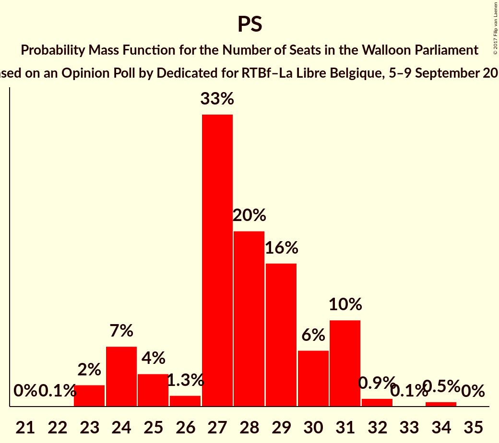

| Number of Seats | Probability | Accumulated | Special Marks |
|:---------------:|:-----------:|:-----------:|:-------------:|
| 22 | 0.1% | 100% |  |
| 23 | 2% | 99.9% |  |
| 24 | 7% | 97% |  |
| 25 | 4% | 91% |  |
| 26 | 1.3% | 87% |  |
| 27 | 33% | 86% |  |
| 28 | 20% | 53% | Median |
| 29 | 16% | 34% |  |
| 30 | 6% | 18% | Last Result |
| 31 | 10% | 11% |  |
| 32 | 0.9% | 2% |  |
| 33 | 0.1% | 0.6% |  |
| 34 | 0.5% | 0.6% |  |
| 35 | 0% | 0% |  |

### MR

*For a full overview of the results for this party, see the [MR](party-mr.html) page.*

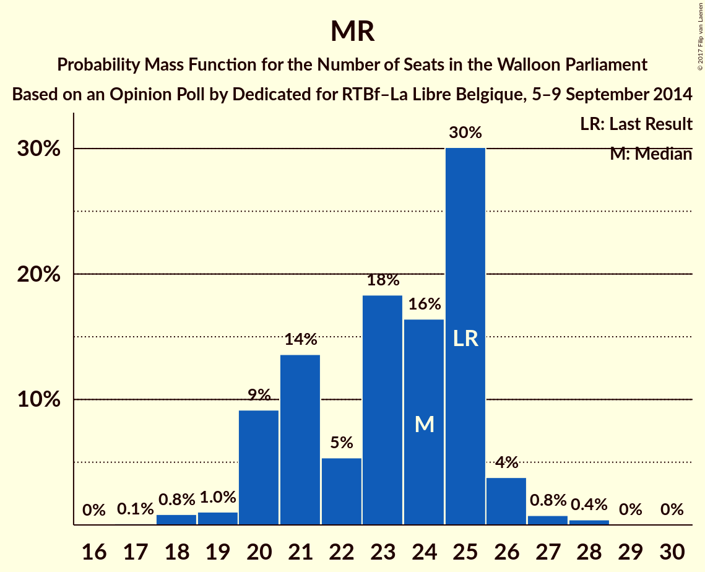

| Number of Seats | Probability | Accumulated | Special Marks |
|:---------------:|:-----------:|:-----------:|:-------------:|
| 17 | 0.1% | 100% |  |
| 18 | 0.8% | 99.9% |  |
| 19 | 1.0% | 99.0% |  |
| 20 | 9% | 98% |  |
| 21 | 14% | 89% |  |
| 22 | 5% | 75% |  |
| 23 | 18% | 70% |  |
| 24 | 16% | 52% | Median |
| 25 | 30% | 35% | Last Result |
| 26 | 4% | 5% |  |
| 27 | 0.8% | 1.3% |  |
| 28 | 0.4% | 0.5% |  |
| 29 | 0% | 0.1% |  |
| 30 | 0% | 0% |  |

### cdH

*For a full overview of the results for this party, see the [cdH](party-cdh.html) page.*

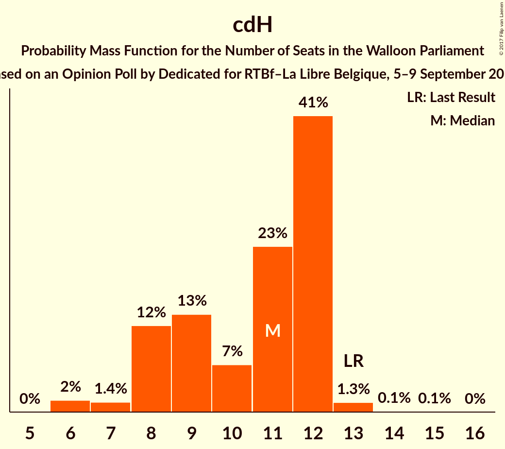

| Number of Seats | Probability | Accumulated | Special Marks |
|:---------------:|:-----------:|:-----------:|:-------------:|
| 6 | 2% | 100% |  |
| 7 | 1.4% | 98% |  |
| 8 | 12% | 97% |  |
| 9 | 13% | 85% |  |
| 10 | 7% | 72% |  |
| 11 | 23% | 65% | Median |
| 12 | 41% | 42% |  |
| 13 | 1.3% | 2% | Last Result |
| 14 | 0.1% | 0.2% |  |
| 15 | 0.1% | 0.1% |  |
| 16 | 0% | 0% |  |

### Ecolo

*For a full overview of the results for this party, see the [Ecolo](party-ecolo.html) page.*

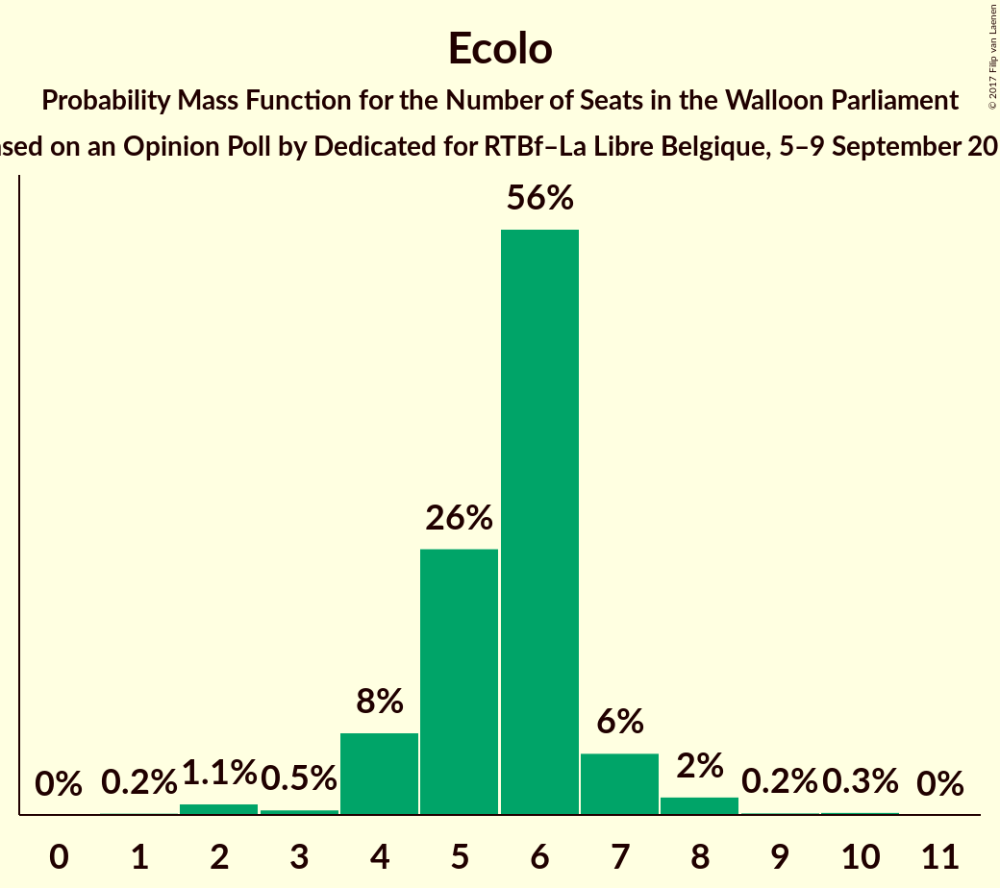

| Number of Seats | Probability | Accumulated | Special Marks |
|:---------------:|:-----------:|:-----------:|:-------------:|
| 1 | 0.2% | 100% |  |
| 2 | 1.1% | 99.8% |  |
| 3 | 0.5% | 98.7% |  |
| 4 | 8% | 98% | Last Result |
| 5 | 26% | 90% |  |
| 6 | 56% | 65% | Median |
| 7 | 6% | 8% |  |
| 8 | 2% | 2% |  |
| 9 | 0.2% | 0.6% |  |
| 10 | 0.3% | 0.3% |  |
| 11 | 0% | 0% |  |

### PTB

*For a full overview of the results for this party, see the [PTB](party-ptb.html) page.*

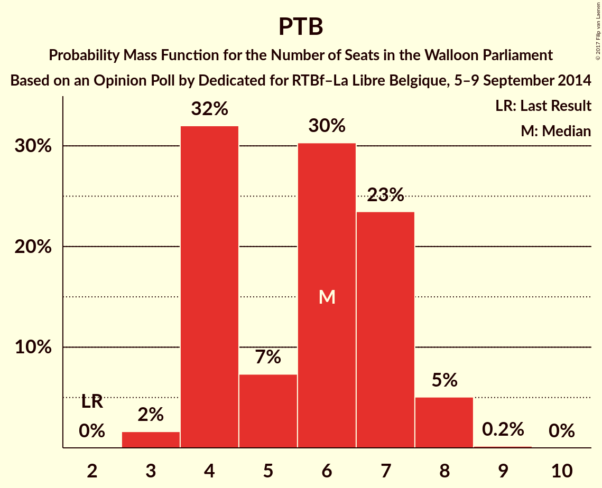

| Number of Seats | Probability | Accumulated | Special Marks |
|:---------------:|:-----------:|:-----------:|:-------------:|
| 2 | 0% | 100% | Last Result |
| 3 | 2% | 100% |  |
| 4 | 32% | 98% |  |
| 5 | 7% | 66% |  |
| 6 | 30% | 59% | Median |
| 7 | 23% | 29% |  |
| 8 | 5% | 5% |  |
| 9 | 0.2% | 0.2% |  |
| 10 | 0% | 0% |  |

### Parti Populaire

*For a full overview of the results for this party, see the [Parti Populaire](party-partipopulaire.html) page.*

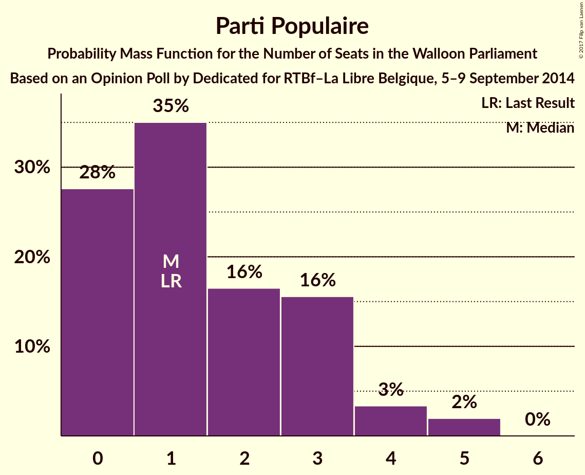

| Number of Seats | Probability | Accumulated | Special Marks |
|:---------------:|:-----------:|:-----------:|:-------------:|
| 0 | 28% | 100% |  |
| 1 | 35% | 72% | Last Result, Median |
| 2 | 16% | 37% |  |
| 3 | 16% | 21% |  |
| 4 | 3% | 5% |  |
| 5 | 2% | 2% |  |
| 6 | 0% | 0% |  |

### DéFI

*For a full overview of the results for this party, see the [DéFI](party-défi.html) page.*

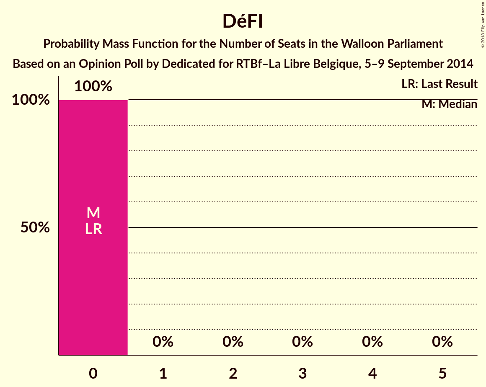

| Number of Seats | Probability | Accumulated | Special Marks |
|:---------------:|:-----------:|:-----------:|:-------------:|
| 0 | 100% | 100% | Last Result, Median |

### La Droite

*For a full overview of the results for this party, see the [La Droite](party-ladroite.html) page.*

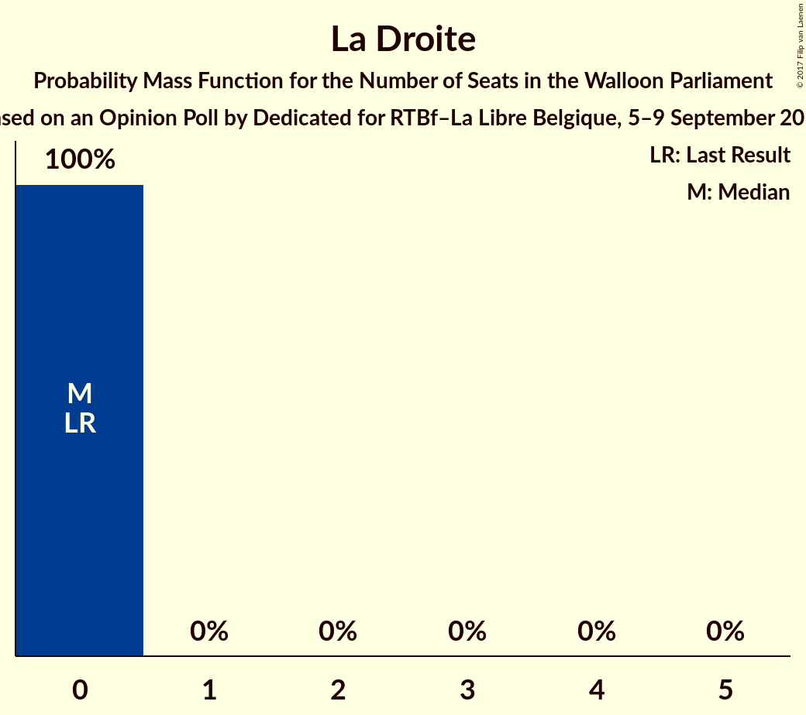

| Number of Seats | Probability | Accumulated | Special Marks |
|:---------------:|:-----------:|:-----------:|:-------------:|
| 0 | 100% | 100% | Last Result, Median |

### PIRATE

*For a full overview of the results for this party, see the [PIRATE](party-pirate.html) page.*

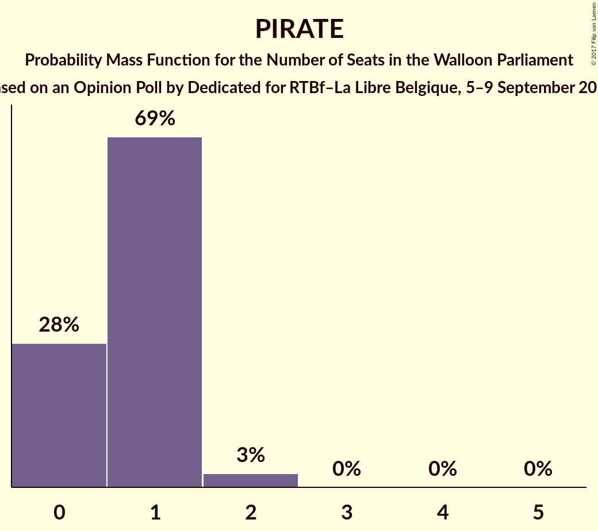

| Number of Seats | Probability | Accumulated | Special Marks |
|:---------------:|:-----------:|:-----------:|:-------------:|
| 0 | 28% | 100% | Last Result |
| 1 | 69% | 72% | Median |
| 2 | 3% | 3% |  |
| 3 | 0% | 0% |  |

### Wallonie d’Abord

*For a full overview of the results for this party, see the [Wallonie d’Abord](party-wallonied’abord.html) page.*

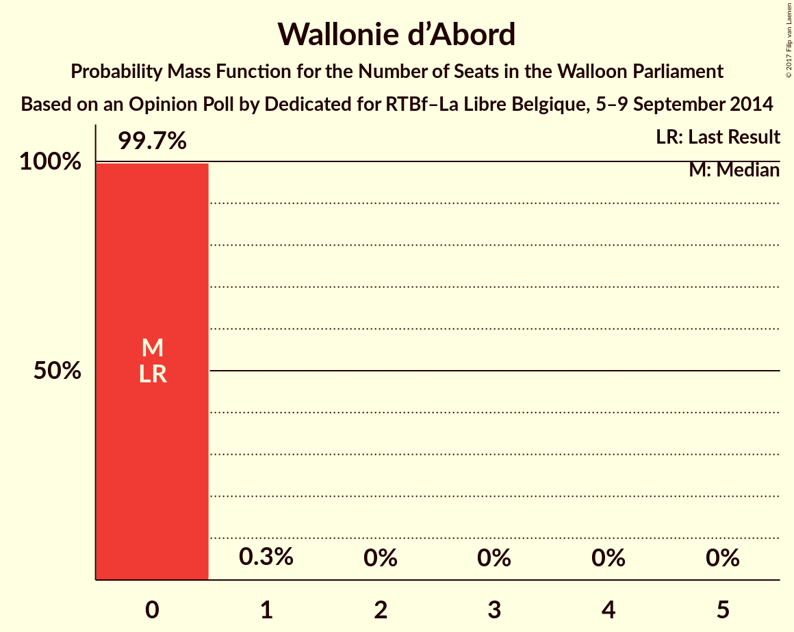

| Number of Seats | Probability | Accumulated | Special Marks |
|:---------------:|:-----------:|:-----------:|:-------------:|
| 0 | 99.7% | 100% | Last Result, Median |
| 1 | 0.3% | 0.3% |  |
| 2 | 0% | 0% |  |

### Debout les Belges

*For a full overview of the results for this party, see the [Debout les Belges](party-deboutlesbelges.html) page.*

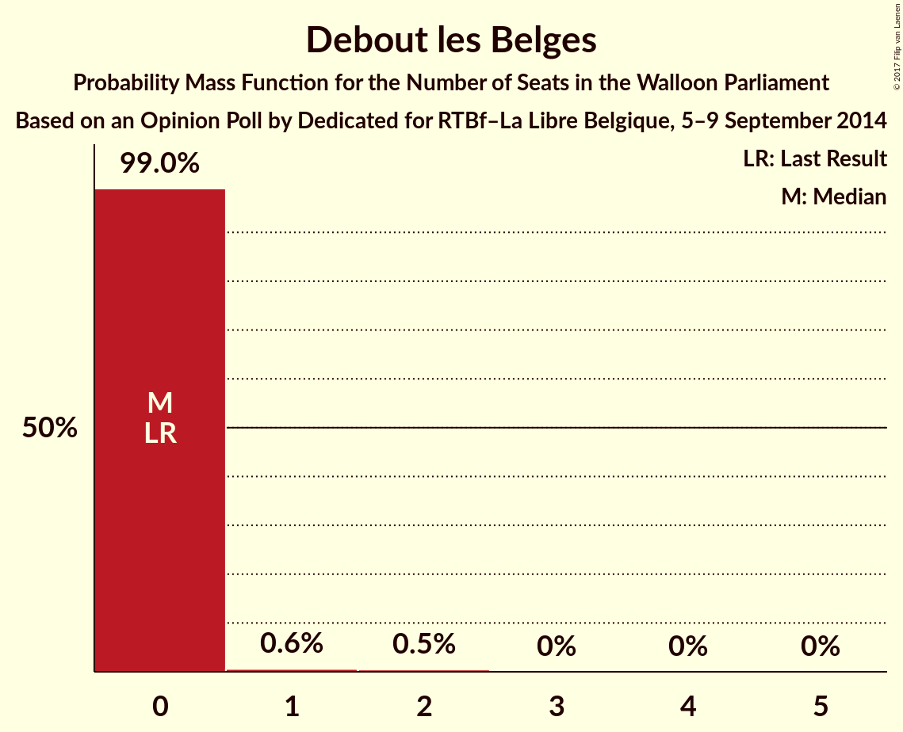

| Number of Seats | Probability | Accumulated | Special Marks |
|:---------------:|:-----------:|:-----------:|:-------------:|
| 0 | 99.0% | 100% | Last Result, Median |
| 1 | 0.6% | 1.0% |  |
| 2 | 0.5% | 0.5% |  |
| 3 | 0% | 0% |  |

### FW

*For a full overview of the results for this party, see the [FW](party-fw.html) page.*

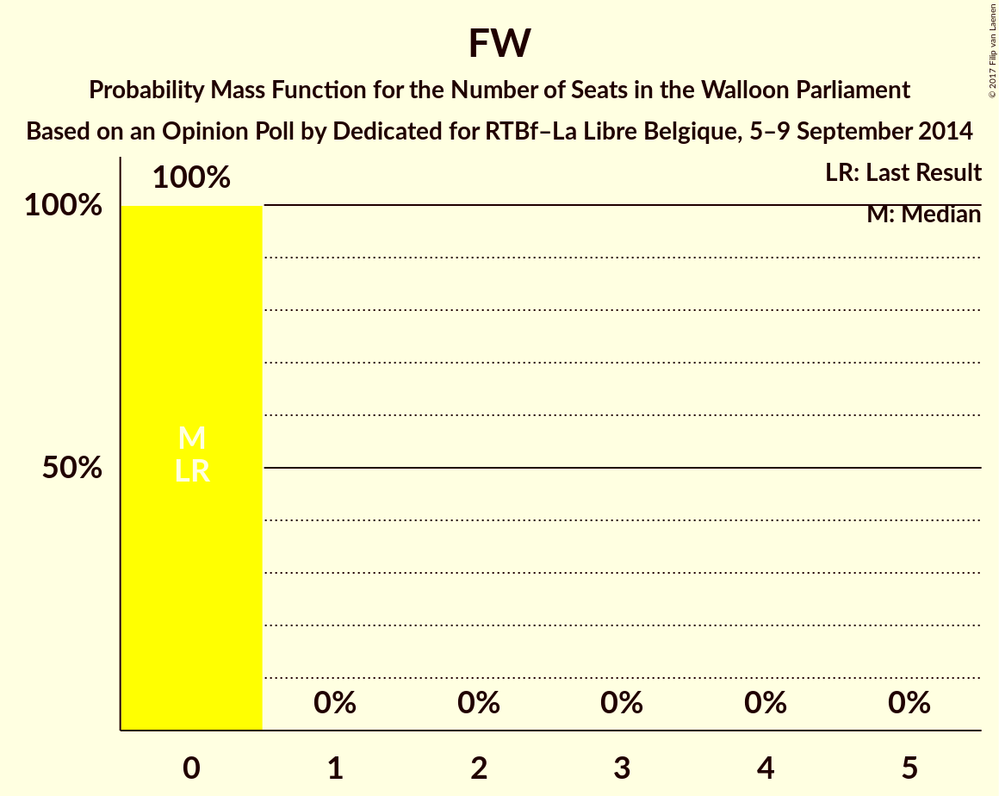

| Number of Seats | Probability | Accumulated | Special Marks |
|:---------------:|:-----------:|:-----------:|:-------------:|
| 0 | 100% | 100% | Last Result, Median |

### R.W.F.

*For a full overview of the results for this party, see the [R.W.F.](party-rwf.html) page.*

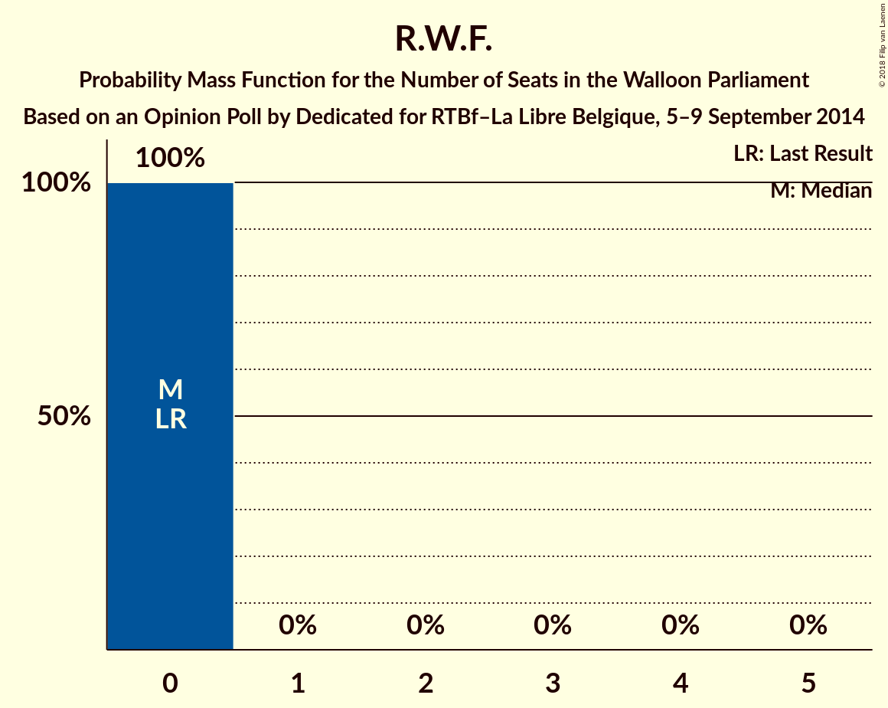

| Number of Seats | Probability | Accumulated | Special Marks |
|:---------------:|:-----------:|:-----------:|:-------------:|
| 0 | 100% | 100% | Last Result, Median |

## Coalitions

### Confidence Intervals

| Coalition | Last Result | Median | Majority? | 80% Confidence Interval | 90% Confidence Interval | 95% Confidence Interval | 99% Confidence Interval |
|:---------:|:-----------:|:------:|:---------:|:-----------------------:|:-----------------------:|:-----------------------:|:-----------------------:|
| PS – MR – Ecolo | 59 | 57 | 100% | 54–60 | 54–61 | 54–61 | 53–62 |
| PS – MR | 55 | 52 | 100% | 48–54 | 48–55 | 47–56 | 47–57 |
| PS – cdH – Ecolo | 47 | 44 | 99.9% | 41–46 | 40–46 | 40–48 | 39–50 |
| PS – cdH – PTB | 45 | 44 | 99.9% | 41–47 | 41–48 | 40–48 | 39–49 |
| MR – cdH – Ecolo | 42 | 39 | 77% | 36–42 | 36–42 | 35–43 | 34–44 |
| PS – Ecolo – PTB | 36 | 39 | 69% | 36–43 | 35–43 | 35–43 | 34–45 |
| PS – cdH | 43 | 39 | 80% | 35–40 | 35–41 | 34–42 | 33–44 |
| MR – cdH | 38 | 33 | 2% | 31–37 | 31–37 | 30–37 | 29–38 |
| PS – PTB | 32 | 33 | 2% | 31–37 | 30–37 | 29–37 | 28–38 |
| MR – Ecolo | 29 | 29 | 0% | 26–31 | 26–31 | 26–32 | 24–33 |

### PS – MR – Ecolo

| Number of Seats | Probability | Accumulated | Special Marks |
|:---------------:|:-----------:|:-----------:|:-------------:|
| 50 | 0.1% | 100% |  |
| 51 | 0.1% | 99.9% |  |
| 52 | 0.3% | 99.8% |  |
| 53 | 0.8% | 99.5% |  |
| 54 | 21% | 98.8% |  |
| 55 | 7% | 78% |  |
| 56 | 16% | 71% |  |
| 57 | 26% | 55% |  |
| 58 | 11% | 29% | Median |
| 59 | 5% | 18% | Last Result |
| 60 | 7% | 12% |  |
| 61 | 4% | 5% |  |
| 62 | 0.9% | 1.0% |  |
| 63 | 0.2% | 0.2% |  |
| 64 | 0% | 0% |  |

### PS – MR

| Number of Seats | Probability | Accumulated | Special Marks |
|:---------------:|:-----------:|:-----------:|:-------------:|
| 44 | 0.1% | 100% |  |
| 45 | 0.1% | 99.9% |  |
| 46 | 0.2% | 99.9% |  |
| 47 | 2% | 99.6% |  |
| 48 | 18% | 97% |  |
| 49 | 10% | 80% |  |
| 50 | 9% | 70% |  |
| 51 | 7% | 61% |  |
| 52 | 35% | 54% | Median |
| 53 | 6% | 19% |  |
| 54 | 7% | 13% |  |
| 55 | 3% | 6% | Last Result |
| 56 | 3% | 3% |  |
| 57 | 0.6% | 0.7% |  |
| 58 | 0% | 0% |  |

### PS – cdH – Ecolo

| Number of Seats | Probability | Accumulated | Special Marks |
|:---------------:|:-----------:|:-----------:|:-------------:|
| 37 | 0% | 100% |  |
| 38 | 0.1% | 99.9% | Majority |
| 39 | 0.9% | 99.8% |  |
| 40 | 7% | 99.0% |  |
| 41 | 2% | 92% |  |
| 42 | 13% | 90% |  |
| 43 | 7% | 76% |  |
| 44 | 26% | 70% |  |
| 45 | 21% | 44% | Median |
| 46 | 18% | 23% |  |
| 47 | 2% | 5% | Last Result |
| 48 | 1.3% | 3% |  |
| 49 | 0.7% | 1.3% |  |
| 50 | 0.2% | 0.7% |  |
| 51 | 0.5% | 0.5% |  |
| 52 | 0% | 0% |  |

### PS – cdH – PTB

| Number of Seats | Probability | Accumulated | Special Marks |
|:---------------:|:-----------:|:-----------:|:-------------:|
| 37 | 0.1% | 100% |  |
| 38 | 0.3% | 99.9% | Majority |
| 39 | 1.1% | 99.6% |  |
| 40 | 3% | 98.5% |  |
| 41 | 5% | 95% |  |
| 42 | 8% | 90% |  |
| 43 | 27% | 82% |  |
| 44 | 12% | 55% |  |
| 45 | 23% | 43% | Last Result, Median |
| 46 | 8% | 19% |  |
| 47 | 6% | 11% |  |
| 48 | 4% | 5% |  |
| 49 | 0.7% | 0.9% |  |
| 50 | 0.1% | 0.1% |  |
| 51 | 0% | 0% |  |

### MR – cdH – Ecolo

| Number of Seats | Probability | Accumulated | Special Marks |
|:---------------:|:-----------:|:-----------:|:-------------:|
| 33 | 0.1% | 100% |  |
| 34 | 0.9% | 99.9% |  |
| 35 | 2% | 99.0% |  |
| 36 | 10% | 97% |  |
| 37 | 11% | 87% |  |
| 38 | 14% | 77% | Majority |
| 39 | 15% | 62% |  |
| 40 | 6% | 48% |  |
| 41 | 9% | 42% | Median |
| 42 | 30% | 33% | Last Result |
| 43 | 1.4% | 3% |  |
| 44 | 1.1% | 1.3% |  |
| 45 | 0.2% | 0.2% |  |
| 46 | 0% | 0% |  |

### PS – Ecolo – PTB

| Number of Seats | Probability | Accumulated | Special Marks |
|:---------------:|:-----------:|:-----------:|:-------------:|
| 33 | 0.1% | 100% |  |
| 34 | 0.9% | 99.8% |  |
| 35 | 4% | 98.9% |  |
| 36 | 21% | 94% | Last Result |
| 37 | 5% | 74% |  |
| 38 | 11% | 69% | Majority |
| 39 | 17% | 58% |  |
| 40 | 9% | 41% | Median |
| 41 | 10% | 32% |  |
| 42 | 11% | 21% |  |
| 43 | 9% | 10% |  |
| 44 | 0.3% | 1.1% |  |
| 45 | 0.8% | 0.8% |  |
| 46 | 0% | 0% |  |

### PS – cdH

| Number of Seats | Probability | Accumulated | Special Marks |
|:---------------:|:-----------:|:-----------:|:-------------:|
| 32 | 0% | 100% |  |
| 33 | 0.6% | 99.9% |  |
| 34 | 4% | 99.4% |  |
| 35 | 6% | 95% |  |
| 36 | 7% | 90% |  |
| 37 | 3% | 82% |  |
| 38 | 17% | 80% | Majority |
| 39 | 40% | 62% | Median |
| 40 | 17% | 22% |  |
| 41 | 3% | 6% |  |
| 42 | 2% | 3% |  |
| 43 | 0.7% | 1.2% | Last Result |
| 44 | 0.5% | 0.6% |  |
| 45 | 0% | 0% |  |

### MR – cdH

| Number of Seats | Probability | Accumulated | Special Marks |
|:---------------:|:-----------:|:-----------:|:-------------:|
| 27 | 0.1% | 100% |  |
| 28 | 0.2% | 99.9% |  |
| 29 | 2% | 99.8% |  |
| 30 | 2% | 98% |  |
| 31 | 11% | 96% |  |
| 32 | 24% | 85% |  |
| 33 | 14% | 61% |  |
| 34 | 3% | 47% |  |
| 35 | 9% | 44% | Median |
| 36 | 16% | 35% |  |
| 37 | 17% | 19% |  |
| 38 | 2% | 2% | Last Result, Majority |
| 39 | 0.1% | 0.1% |  |
| 40 | 0% | 0% |  |

### PS – PTB

| Number of Seats | Probability | Accumulated | Special Marks |
|:---------------:|:-----------:|:-----------:|:-------------:|
| 27 | 0.1% | 100% |  |
| 28 | 1.1% | 99.8% |  |
| 29 | 2% | 98.8% |  |
| 30 | 6% | 97% |  |
| 31 | 19% | 91% |  |
| 32 | 14% | 71% | Last Result |
| 33 | 13% | 57% |  |
| 34 | 6% | 44% | Median |
| 35 | 12% | 38% |  |
| 36 | 14% | 26% |  |
| 37 | 9% | 11% |  |
| 38 | 2% | 2% | Majority |
| 39 | 0.2% | 0.2% |  |
| 40 | 0% | 0% |  |

### MR – Ecolo

| Number of Seats | Probability | Accumulated | Special Marks |
|:---------------:|:-----------:|:-----------:|:-------------:|
| 23 | 0.3% | 100% |  |
| 24 | 1.2% | 99.7% |  |
| 25 | 0.3% | 98.5% |  |
| 26 | 10% | 98% |  |
| 27 | 20% | 88% |  |
| 28 | 5% | 68% |  |
| 29 | 14% | 63% | Last Result |
| 30 | 33% | 50% | Median |
| 31 | 13% | 17% |  |
| 32 | 2% | 4% |  |
| 33 | 0.9% | 1.3% |  |
| 34 | 0.3% | 0.4% |  |
| 35 | 0% | 0.1% |  |
| 36 | 0% | 0% |  |

## Technical Information

### Opinion Poll

+ **Polling firm:** Dedicated
+ **Commissioner(s):** RTBf–La Libre Belgique
+ **Fieldwork period:** 5–9 September 2014

### Calculations

+ **Sample size:** 676
+ **Simulations done:** 4,194,304
+ **Error estimate:** 2.62%

