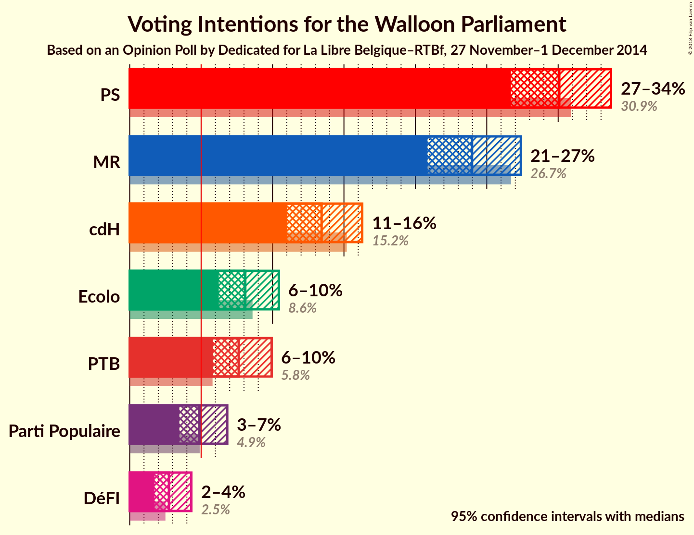
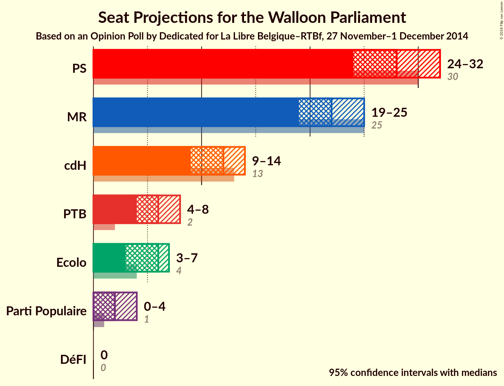
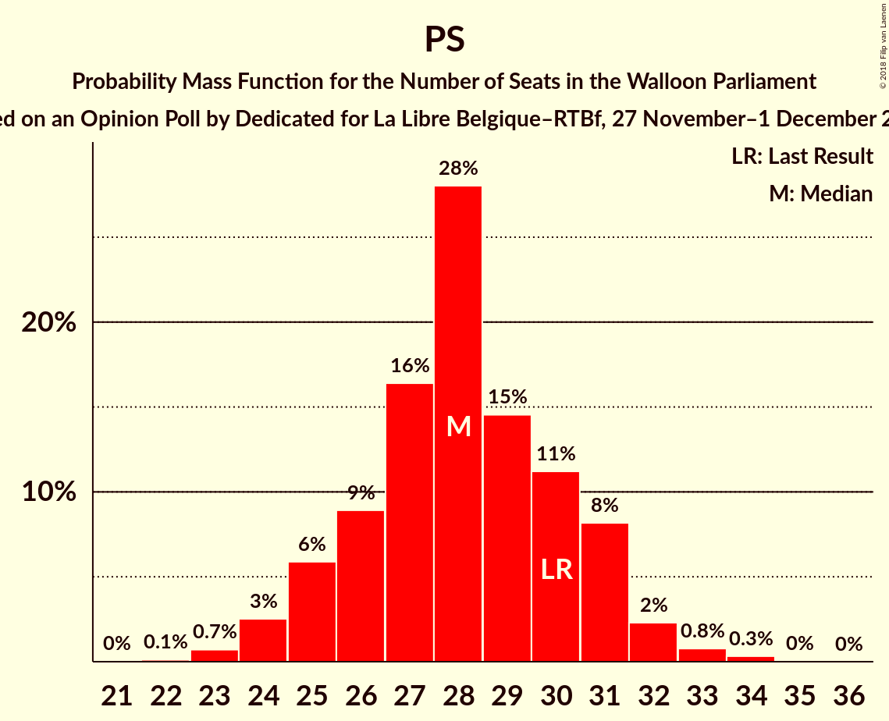
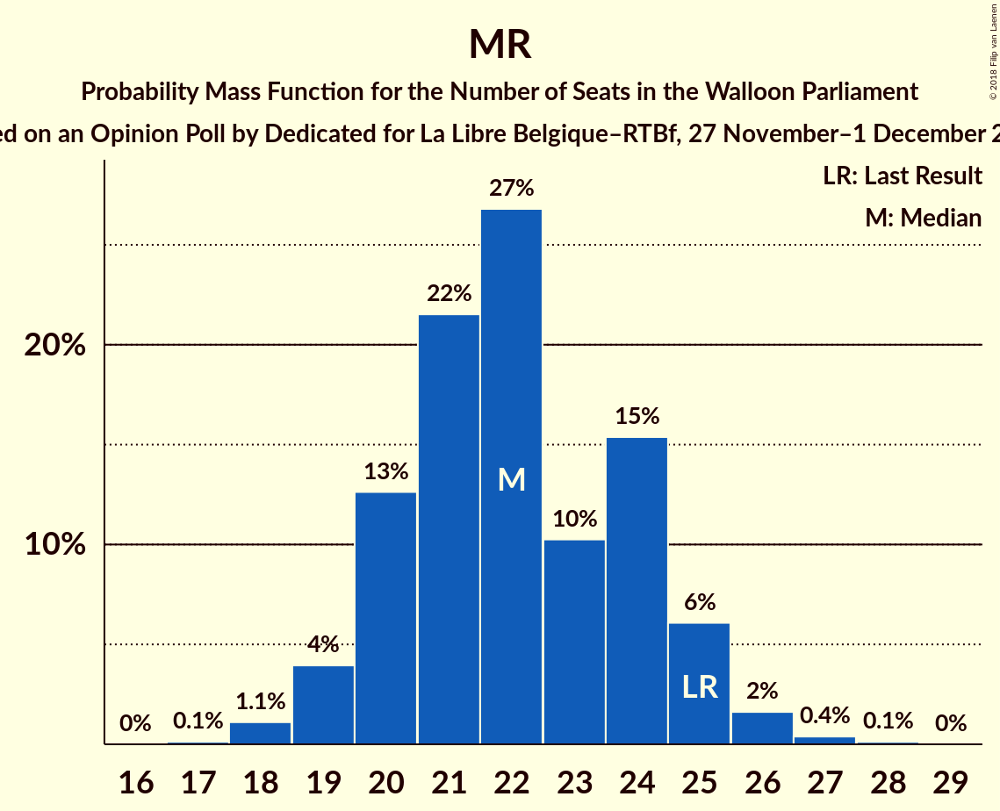
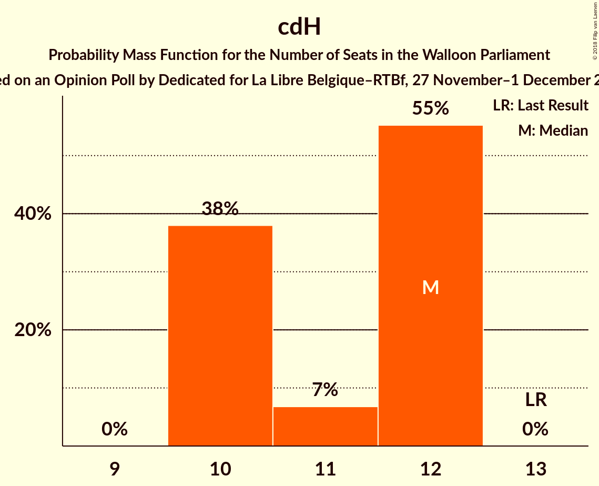
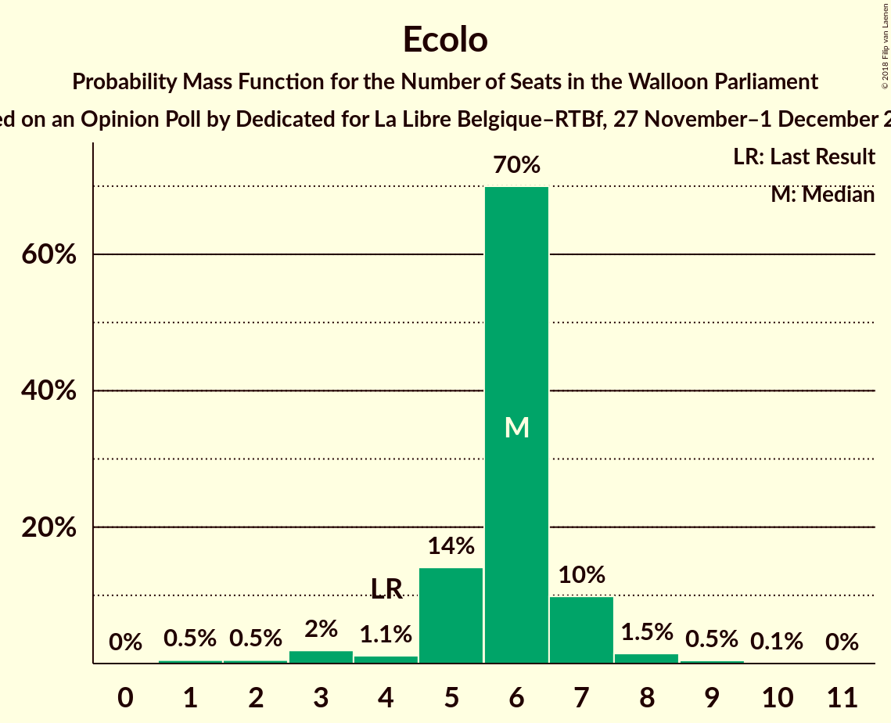
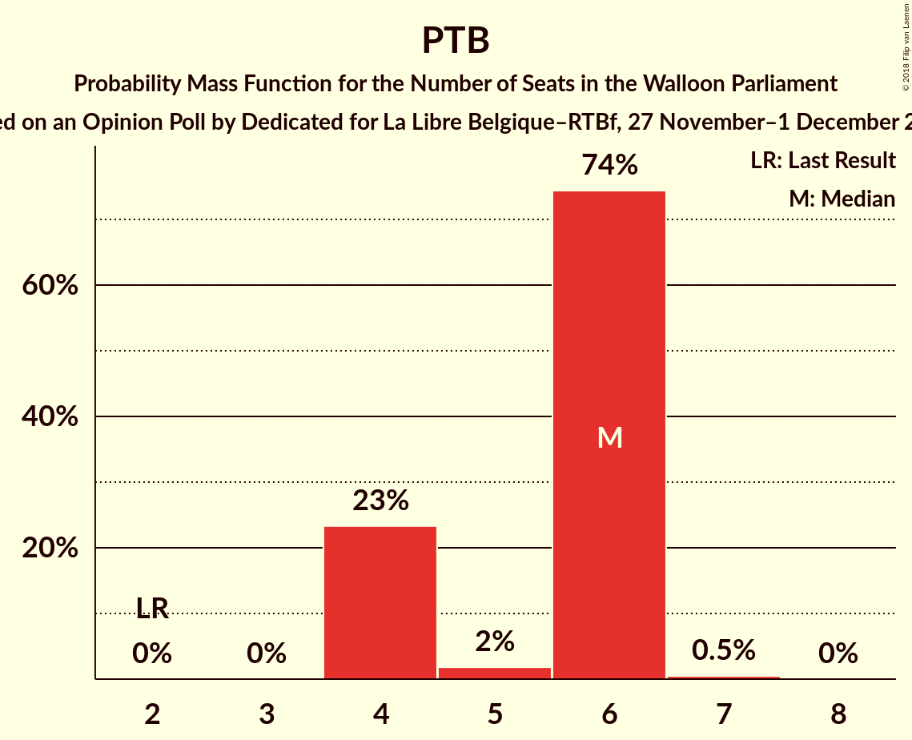
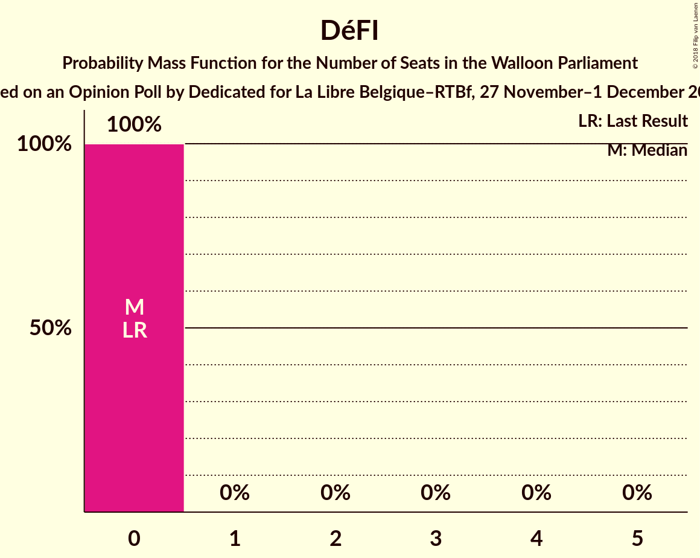
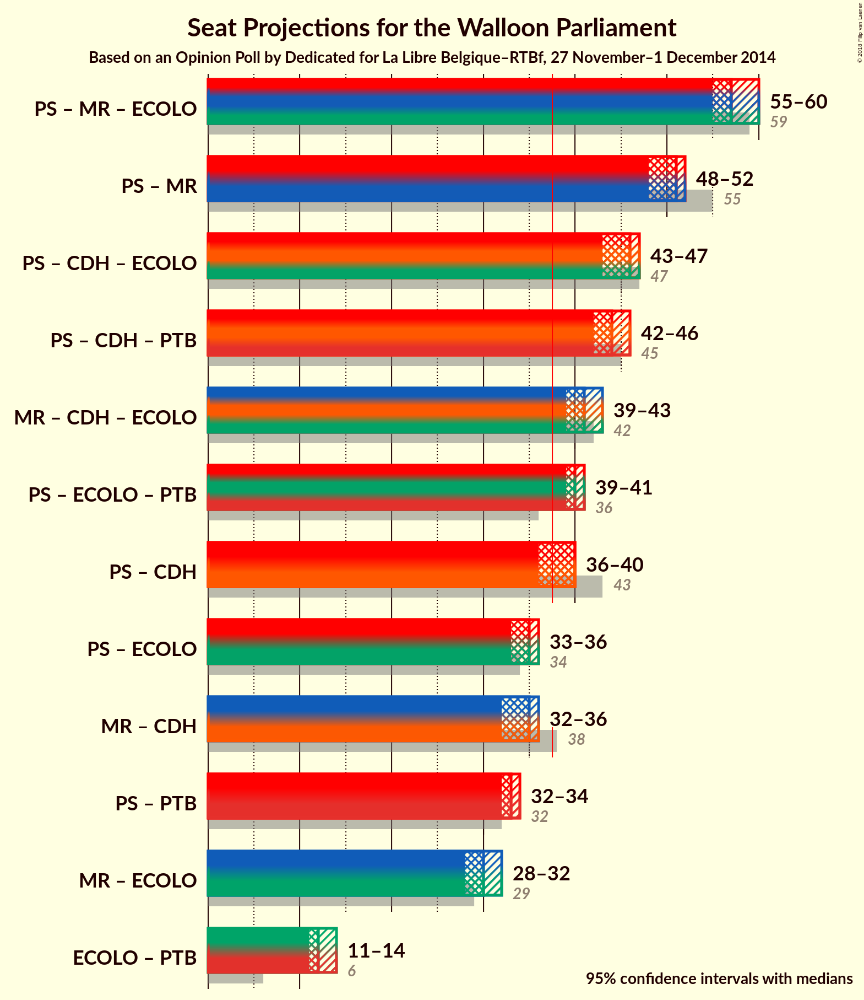

# Opinion Poll by Dedicated for La Libre Belgique–RTBf, 27 November–1 December 2014

<a href="#voting-intentions">Voting Intentions</a> | <a href="#seats">Seats</a> | <a href="#coalitions">Coalitions</a> | <a href="#technical-information">Technical Information</a>

## Voting Intentions

### Confidence Intervals

| Party | Last Result | Poll Result | 80% Confidence Interval | 90% Confidence Interval | 95% Confidence Interval | 99% Confidence Interval |
|:-----:|:-----------:|:-----------:|:-----------------------:|:-----------------------:|:-----------------------:|:-----------------------:|
| PS | 30.9% | 30.1% | 27.8–32.4% |27.2–33.1% |26.7–33.7% |25.6–34.9% |
| MR | 26.7% | 24.0% | 21.9–26.2% |21.4–26.8% |20.9–27.4% |19.9–28.5% |
| cdH | 15.2% | 13.4% | 11.9–15.3% |11.4–15.8% |11.0–16.3% |10.3–17.2% |
| Ecolo | 8.6% | 8.1% | 6.9–9.6% |6.5–10.1% |6.2–10.4% |5.7–11.2% |
| PTB | 5.8% | 7.6% | 6.4–9.1% |6.1–9.6% |5.8–9.9% |5.3–10.7% |
| Parti Populaire | 4.9% | 4.9% | 4.0–6.1% |3.7–6.5% |3.5–6.8% |3.1–7.5% |
| DéFI | 2.5% | 2.7% | 2.1–3.8% |1.9–4.1% |1.7–4.3% |1.5–4.8% |

*Note:* The poll result column reflects the actual value used in the calculations. Published results may vary slightly, and in addition be rounded to fewer digits.

## Seats

### Confidence Intervals

| Party | Last Result | Median | 80% Confidence Interval | 90% Confidence Interval | 95% Confidence Interval | 99% Confidence Interval |
|:-----:|:-----------:|:------:|:-----------------------:|:-----------------------:|:-----------------------:|:-----------------------:|
| <a href="#ps">PS</a> | 30 | 28 | 27–28 |27–28 |26–28 |26–28 |
| <a href="#mr">MR</a> | 25 | 23 | 22–24 |22–24 |22–24 |22–24 |
| <a href="#cdh">cdH</a> | 13 | 12 | 10–12 |10–12 |10–12 |10–12 |
| <a href="#ecolo">Ecolo</a> | 4 | 7 | 6–8 |6–8 |6–8 |6–8 |
| <a href="#ptb">PTB</a> | 2 | 6 | 4–6 |4–6 |4–6 |4–6 |
| <a href="#parti-populaire">Parti Populaire</a> | 1 | 0 | 0–3 |0–3 |0–4 |0–4 |
| <a href="#défi">DéFI</a> | 0 | 0 | 0 |0 |0 |0 |

### PS

*For a full overview of the results for this party, see the [PS](party-ps.html) page.*

| Number of Seats | Probability | Accumulated | Special Marks |
|:---------------:|:-----------:|:-----------:|:-------------:|
| 25 | 0.4% | 100% |  |
| 26 | 4% | 99.6% |  |
| 27 | 34% | 95% |  |
| 28 | 62% | 62% | Median |
| 29 | 0% | 0% |  |
| 30 | 0% | 0% | Last Result |

### MR

*For a full overview of the results for this party, see the [MR](party-mr.html) page.*

| Number of Seats | Probability | Accumulated | Special Marks |
|:---------------:|:-----------:|:-----------:|:-------------:|
| 21 | 0.5% | 100% |  |
| 22 | 48% | 99.5% |  |
| 23 | 29% | 52% | Median |
| 24 | 23% | 23% |  |
| 25 | 0% | 0% | Last Result |

### cdH

*For a full overview of the results for this party, see the [cdH](party-cdh.html) page.*

| Number of Seats | Probability | Accumulated | Special Marks |
|:---------------:|:-----------:|:-----------:|:-------------:|
| 10 | 38% | 100% |  |
| 11 | 7% | 62% |  |
| 12 | 55% | 55% | Median |
| 13 | 0% | 0% | Last Result |

### Ecolo

*For a full overview of the results for this party, see the [Ecolo](party-ecolo.html) page.*

| Number of Seats | Probability | Accumulated | Special Marks |
|:---------------:|:-----------:|:-----------:|:-------------:|
| 4 | 0% | 100% | Last Result |
| 5 | 0% | 100% |  |
| 6 | 37% | 100% |  |
| 7 | 30% | 63% | Median |
| 8 | 33% | 33% |  |
| 9 | 0.1% | 0.1% |  |
| 10 | 0% | 0% |  |

### PTB

*For a full overview of the results for this party, see the [PTB](party-ptb.html) page.*

| Number of Seats | Probability | Accumulated | Special Marks |
|:---------------:|:-----------:|:-----------:|:-------------:|
| 2 | 0% | 100% | Last Result |
| 3 | 0% | 100% |  |
| 4 | 23% | 100% |  |
| 5 | 2% | 77% |  |
| 6 | 74% | 75% | Median |
| 7 | 0.5% | 0.5% |  |
| 8 | 0% | 0% |  |

### Parti Populaire

*For a full overview of the results for this party, see the [Parti Populaire](party-partipopulaire.html) page.*

| Number of Seats | Probability | Accumulated | Special Marks |
|:---------------:|:-----------:|:-----------:|:-------------:|
| 0 | 52% | 100% | Median |
| 1 | 9% | 48% | Last Result |
| 2 | 27% | 39% |  |
| 3 | 7% | 11% |  |
| 4 | 4% | 5% |  |
| 5 | 0.4% | 0.4% |  |
| 6 | 0% | 0% |  |

### DéFI

*For a full overview of the results for this party, see the [DéFI](party-défi.html) page.*

| Number of Seats | Probability | Accumulated | Special Marks |
|:---------------:|:-----------:|:-----------:|:-------------:|
| 0 | 100% | 100% | Last Result, Median |

## Coalitions

### Confidence Intervals

| Coalition | Last Result | Median | Majority? | 80% Confidence Interval | 90% Confidence Interval | 95% Confidence Interval | 99% Confidence Interval |
|:---------:|:-----------:|:------:|:---------:|:-----------------------:|:-----------------------:|:-----------------------:|:-----------------------:|
| PS – MR – Ecolo | 59 | 57 | 100% | 56–59 | 55–60 | 55–60 | 55–60 |
| PS – MR | 55 | 51 | 100% | 49–52 | 49–52 | 48–52 | 48–52 |
| PS – cdH – Ecolo | 47 | 46 | 100% | 44–47 | 44–47 | 43–47 | 43–47 |
| PS – cdH – PTB | 45 | 44 | 100% | 43–46 | 43–46 | 42–46 | 42–46 |
| MR – cdH – Ecolo | 42 | 41 | 100% | 39–43 | 39–43 | 39–43 | 39–43 |
| PS – Ecolo – PTB | 36 | 40 | 100% | 39–41 | 39–41 | 39–41 | 39–41 |
| PS – cdH | 43 | 40 | 62% | 37–40 | 37–40 | 36–40 | 36–40 |
| PS – Ecolo | 34 | 35 | 0% | 34–35 | 33–36 | 33–36 | 33–36 |
| MR – cdH | 38 | 35 | 0% | 32–36 | 32–36 | 32–36 | 32–36 |
| PS – PTB | 32 | 33 | 0% | 32–34 | 32–34 | 32–34 | 32–34 |
| MR – Ecolo | 29 | 30 | 0% | 28–31 | 28–32 | 28–32 | 28–32 |
| Ecolo – PTB | 6 | 12 | 0% | 11–14 | 11–14 | 11–14 | 11–14 |

### PS – MR – Ecolo

| Number of Seats | Probability | Accumulated | Special Marks |
|:---------------:|:-----------:|:-----------:|:-------------:|
| 53 | 0.4% | 100% |  |
| 54 | 0.1% | 99.6% |  |
| 55 | 5% | 99.5% |  |
| 56 | 16% | 95% |  |
| 57 | 53% | 78% |  |
| 58 | 0.4% | 25% | Median |
| 59 | 19% | 25% | Last Result |
| 60 | 5% | 5% |  |
| 61 | 0% | 0% |  |

### PS – MR

| Number of Seats | Probability | Accumulated | Special Marks |
|:---------------:|:-----------:|:-----------:|:-------------:|
| 46 | 0.4% | 100% |  |
| 47 | 0.1% | 99.6% |  |
| 48 | 4% | 99.5% |  |
| 49 | 34% | 95% |  |
| 50 | 10% | 62% |  |
| 51 | 29% | 52% | Median |
| 52 | 23% | 23% |  |
| 53 | 0% | 0% |  |
| 54 | 0% | 0% |  |
| 55 | 0% | 0% | Last Result |

### PS – cdH – Ecolo

| Number of Seats | Probability | Accumulated | Special Marks |
|:---------------:|:-----------:|:-----------:|:-------------:|
| 42 | 0.4% | 100% |  |
| 43 | 4% | 99.6% |  |
| 44 | 7% | 95% |  |
| 45 | 27% | 89% |  |
| 46 | 36% | 61% |  |
| 47 | 25% | 25% | Last Result, Median |
| 48 | 0.1% | 0.1% |  |
| 49 | 0% | 0% |  |

### PS – cdH – PTB

| Number of Seats | Probability | Accumulated | Special Marks |
|:---------------:|:-----------:|:-----------:|:-------------:|
| 42 | 5% | 100% |  |
| 43 | 38% | 95% |  |
| 44 | 20% | 57% |  |
| 45 | 1.1% | 37% | Last Result |
| 46 | 36% | 36% | Median |
| 47 | 0% | 0% |  |

### MR – cdH – Ecolo

| Number of Seats | Probability | Accumulated | Special Marks |
|:---------------:|:-----------:|:-----------:|:-------------:|
| 38 | 0.5% | 100% | Majority |
| 39 | 11% | 99.5% |  |
| 40 | 36% | 88% |  |
| 41 | 27% | 52% |  |
| 42 | 2% | 25% | Last Result, Median |
| 43 | 23% | 23% |  |
| 44 | 0% | 0% |  |

### PS – Ecolo – PTB

| Number of Seats | Probability | Accumulated | Special Marks |
|:---------------:|:-----------:|:-----------:|:-------------:|
| 36 | 0% | 100% | Last Result |
| 37 | 0% | 100% |  |
| 38 | 0% | 100% | Majority |
| 39 | 23% | 100% |  |
| 40 | 49% | 77% |  |
| 41 | 28% | 28% | Median |
| 42 | 0% | 0% |  |

### PS – cdH

| Number of Seats | Probability | Accumulated | Special Marks |
|:---------------:|:-----------:|:-----------:|:-------------:|
| 35 | 0.4% | 100% |  |
| 36 | 4% | 99.6% |  |
| 37 | 33% | 95% |  |
| 38 | 0.3% | 62% | Majority |
| 39 | 7% | 62% |  |
| 40 | 55% | 55% | Median |
| 41 | 0% | 0% |  |
| 42 | 0% | 0% |  |
| 43 | 0% | 0% | Last Result |

### PS – Ecolo

| Number of Seats | Probability | Accumulated | Special Marks |
|:---------------:|:-----------:|:-----------:|:-------------:|
| 32 | 0.4% | 100% |  |
| 33 | 5% | 99.6% |  |
| 34 | 43% | 95% | Last Result |
| 35 | 45% | 52% | Median |
| 36 | 7% | 7% |  |
| 37 | 0.1% | 0.1% |  |
| 38 | 0% | 0% | Majority |

### MR – cdH

| Number of Seats | Probability | Accumulated | Special Marks |
|:---------------:|:-----------:|:-----------:|:-------------:|
| 31 | 0.5% | 100% |  |
| 32 | 38% | 99.5% |  |
| 33 | 0% | 62% |  |
| 34 | 12% | 62% |  |
| 35 | 32% | 50% | Median |
| 36 | 18% | 18% |  |
| 37 | 0% | 0% |  |
| 38 | 0% | 0% | Last Result, Majority |

### PS – PTB

| Number of Seats | Probability | Accumulated | Special Marks |
|:---------------:|:-----------:|:-----------:|:-------------:|
| 32 | 28% | 100% | Last Result |
| 33 | 36% | 72% |  |
| 34 | 37% | 37% | Median |
| 35 | 0% | 0% |  |

### MR – Ecolo

| Number of Seats | Probability | Accumulated | Special Marks |
|:---------------:|:-----------:|:-----------:|:-------------:|
| 28 | 11% | 100% |  |
| 29 | 38% | 89% | Last Result |
| 30 | 27% | 51% | Median |
| 31 | 19% | 25% |  |
| 32 | 5% | 5% |  |
| 33 | 0% | 0% |  |

### Ecolo – PTB

| Number of Seats | Probability | Accumulated | Special Marks |
|:---------------:|:-----------:|:-----------:|:-------------:|
| 6 | 0% | 100% | Last Result |
| 7 | 0% | 100% |  |
| 8 | 0% | 100% |  |
| 9 | 0% | 100% |  |
| 10 | 0% | 100% |  |
| 11 | 18% | 100% |  |
| 12 | 43% | 82% |  |
| 13 | 13% | 40% | Median |
| 14 | 27% | 27% |  |
| 15 | 0% | 0% |  |

## Technical Information

### Opinion Poll

+ **Polling firm:** Dedicated
+ **Commissioner(s):** La Libre Belgique–RTBf
+ **Fieldwork period:** 27 November–1 December 2014

### Calculations

+ **Sample size:** 655
+ **Simulations done:** 1,024
+ **Error estimate:** 4.71%

