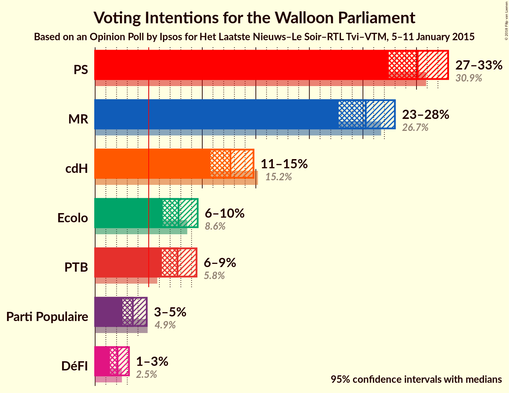
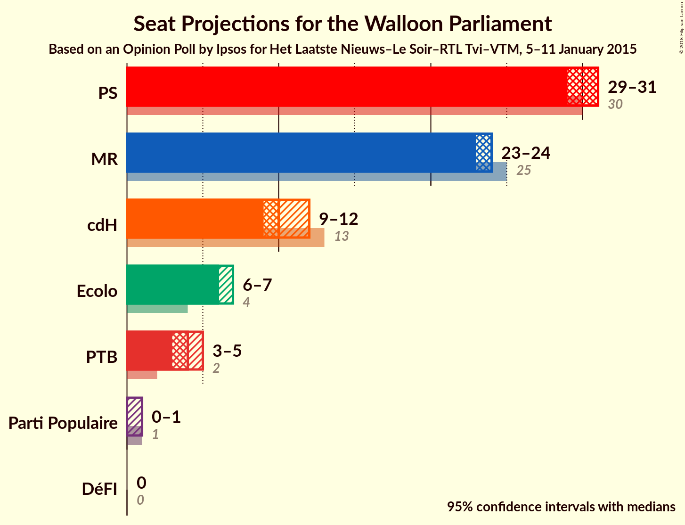
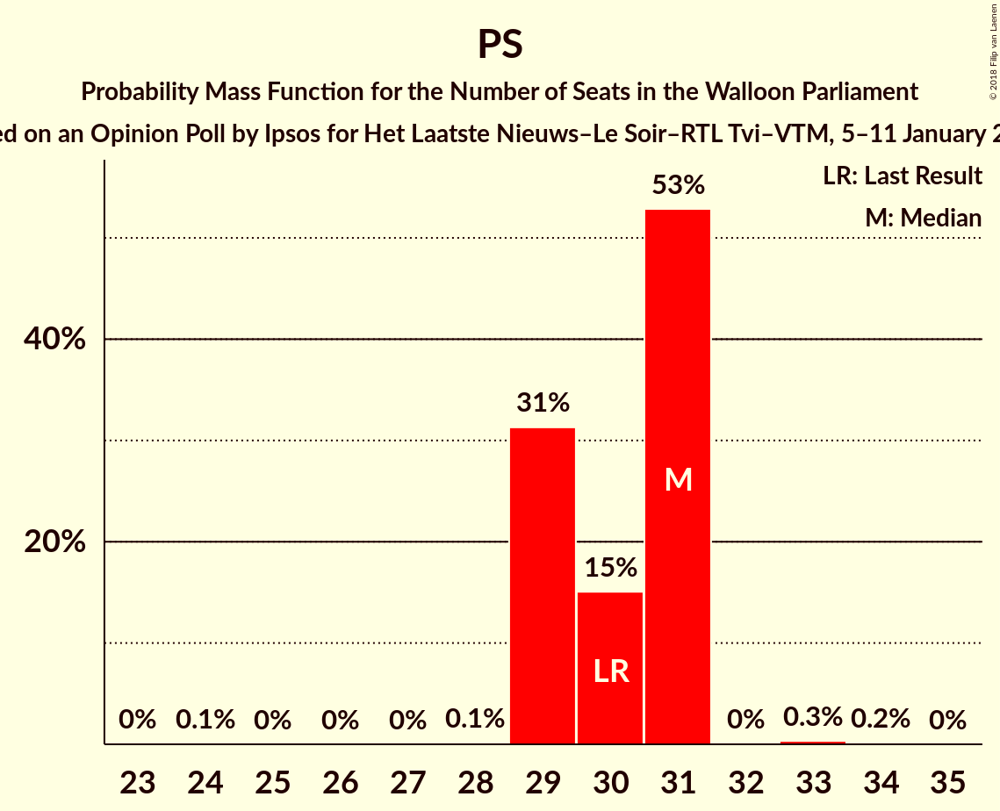
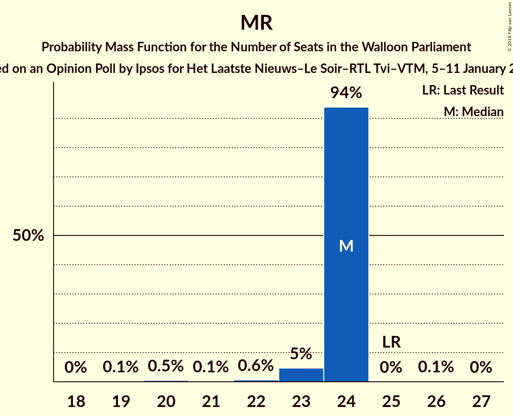
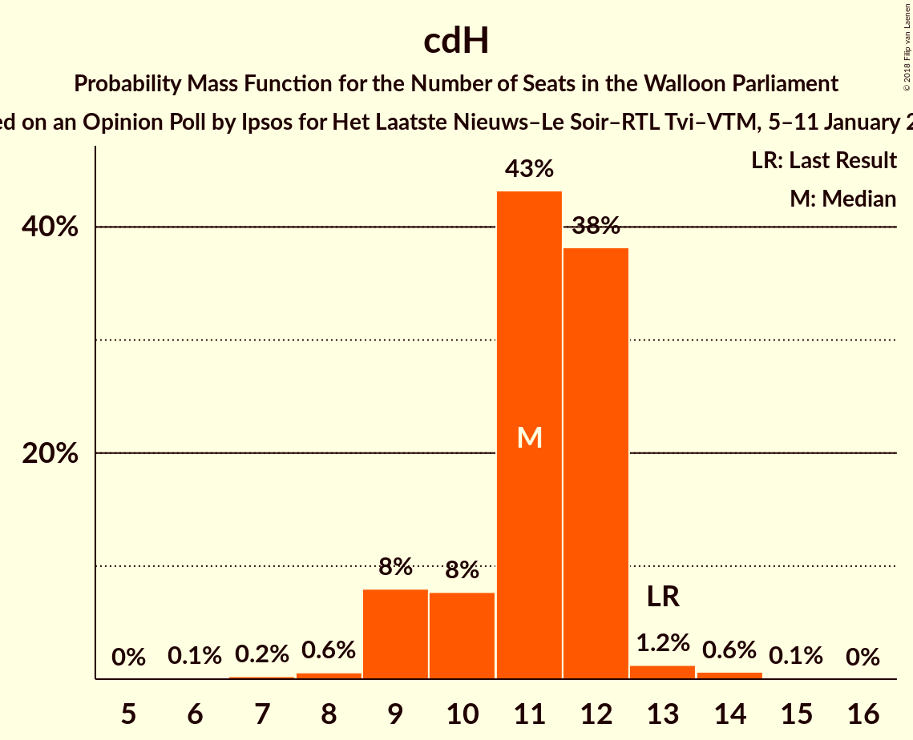
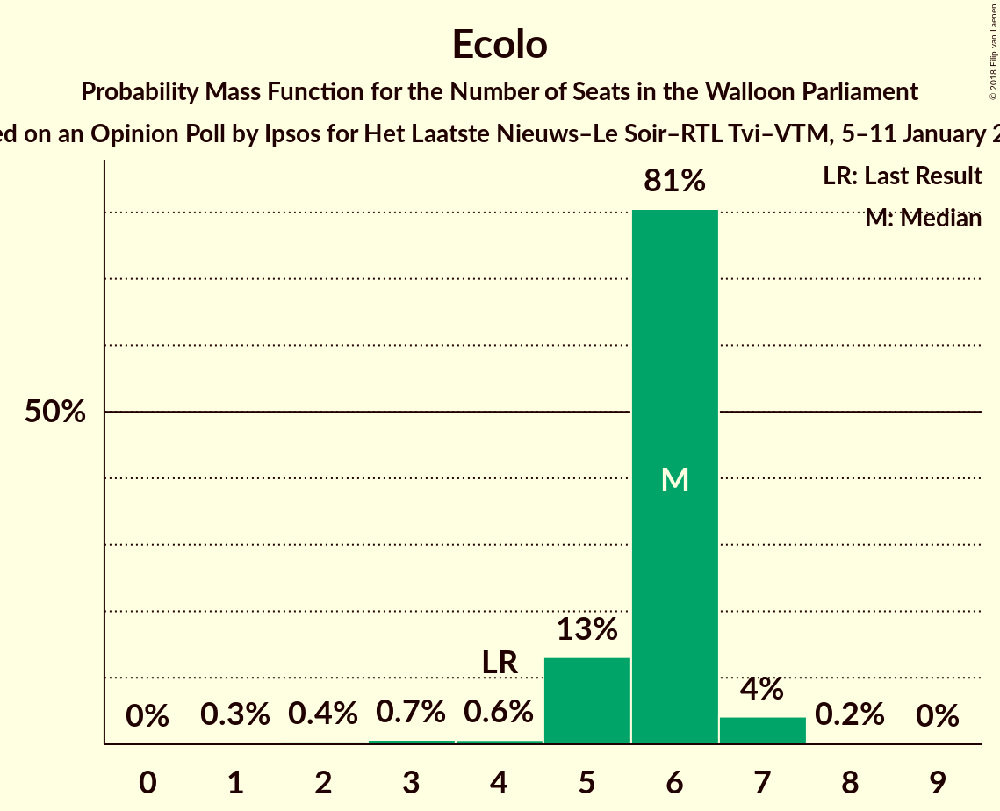
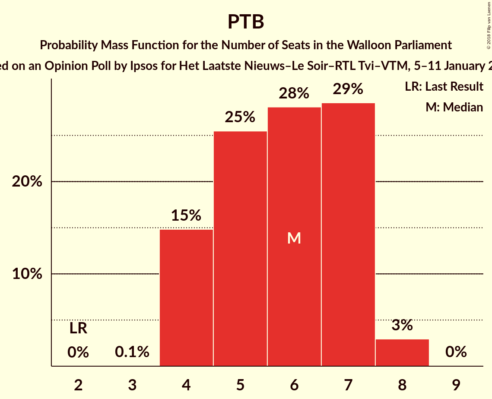
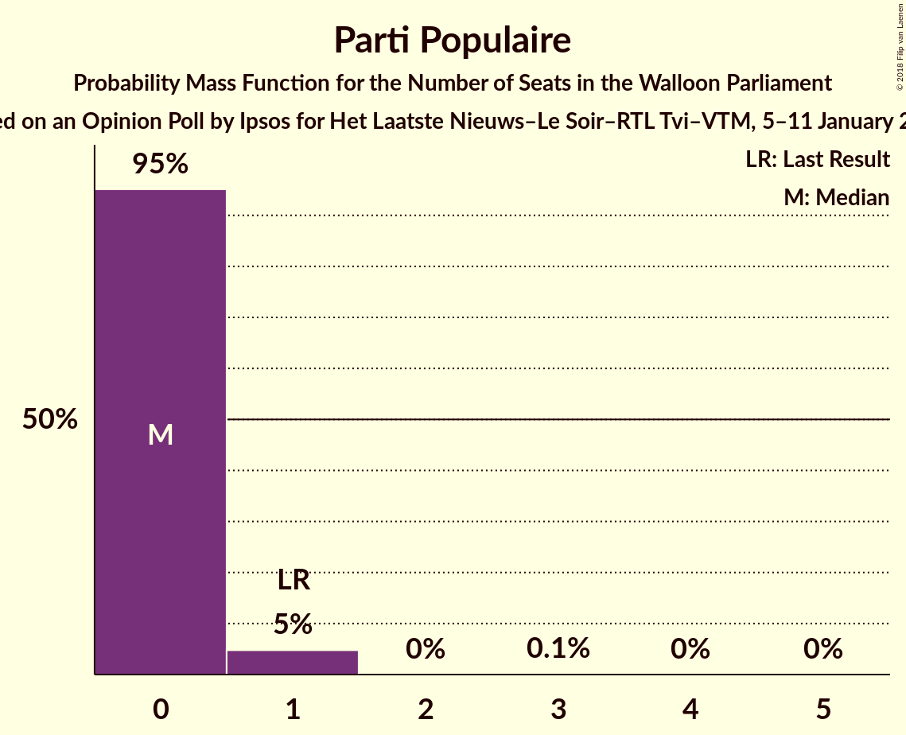
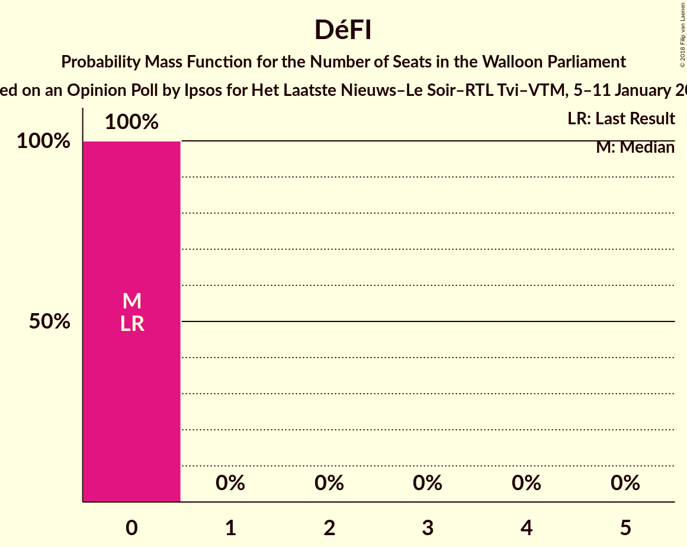
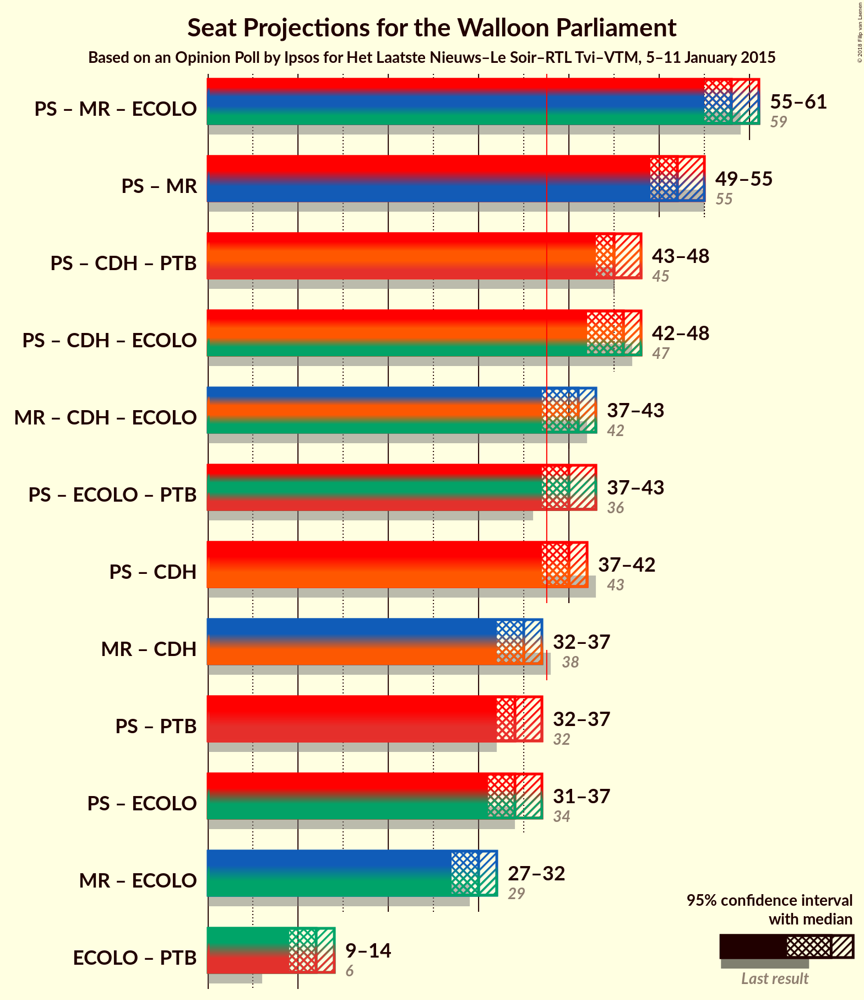

# Opinion Poll by Ipsos for Het Laatste Nieuws–Le Soir–RTL Tvi–VTM, 5–11 January 2015

<a href="#voting-intentions">Voting Intentions</a> | <a href="#seats">Seats</a> | <a href="#coalitions">Coalitions</a> | <a href="#technical-information">Technical Information</a>

## Voting Intentions

### Confidence Intervals

| Party | Last Result | Poll Result | 80% Confidence Interval | 90% Confidence Interval | 95% Confidence Interval | 99% Confidence Interval |
|:-----:|:-----------:|:-----------:|:-----------------------:|:-----------------------:|:-----------------------:|:-----------------------:|
| PS | 30.9% | 30.1% | 28.3–32.0% |27.8–32.5% |27.4–33.0% |26.6–33.9% |
| MR | 26.7% | 25.3% | 23.6–27.0% |23.1–27.5% |22.7–28.0% |21.9–28.9% |
| cdH | 15.2% | 12.6% | 11.4–14.0% |11.1–14.4% |10.8–14.8% |10.2–15.5% |
| Ecolo | 8.6% | 7.8% | 6.8–8.9% |6.5–9.3% |6.3–9.6% |5.9–10.2% |
| PTB | 5.8% | 7.7% | 6.7–8.9% |6.5–9.2% |6.2–9.5% |5.8–10.0% |
| Parti Populaire | 4.9% | 3.5% | 2.9–4.4% |2.7–4.6% |2.6–4.8% |2.3–5.2% |
| DéFI | 2.5% | 2.1% | 1.6–2.8% |1.5–3.0% |1.4–3.2% |1.2–3.5% |

*Note:* The poll result column reflects the actual value used in the calculations. Published results may vary slightly, and in addition be rounded to fewer digits.

## Seats

### Confidence Intervals

| Party | Last Result | Median | 80% Confidence Interval | 90% Confidence Interval | 95% Confidence Interval | 99% Confidence Interval |
|:-----:|:-----------:|:------:|:-----------------------:|:-----------------------:|:-----------------------:|:-----------------------:|
| <a href="#ps">PS</a> | 30 | 31 | 29–31 |29–31 |29–31 |29–32 |
| <a href="#mr">MR</a> | 25 | 24 | 24 |23–24 |23–24 |20–24 |
| <a href="#cdh">cdH</a> | 13 | 10 | 9–12 |9–12 |9–12 |9–12 |
| <a href="#ecolo">Ecolo</a> | 4 | 6 | 6–7 |6–7 |6–7 |5–7 |
| <a href="#ptb">PTB</a> | 2 | 4 | 3–4 |3–5 |3–5 |3–7 |
| <a href="#parti-populaire">Parti Populaire</a> | 1 | 0 | 0 |0 |0–1 |0–1 |
| <a href="#défi">DéFI</a> | 0 | 0 | 0 |0 |0 |0 |

### PS

*For a full overview of the results for this party, see the [PS](party-ps.html) page.*

| Number of Seats | Probability | Accumulated | Special Marks |
|:---------------:|:-----------:|:-----------:|:-------------:|
| 24 | 0.1% | 100% |  |
| 25 | 0% | 99.9% |  |
| 26 | 0% | 99.9% |  |
| 27 | 0% | 99.9% |  |
| 28 | 0.1% | 99.9% |  |
| 29 | 31% | 99.7% |  |
| 30 | 15% | 68% | Last Result |
| 31 | 53% | 53% | Median |
| 32 | 0% | 0.5% |  |
| 33 | 0.3% | 0.5% |  |
| 34 | 0.2% | 0.2% |  |
| 35 | 0% | 0% |  |

### MR

*For a full overview of the results for this party, see the [MR](party-mr.html) page.*

| Number of Seats | Probability | Accumulated | Special Marks |
|:---------------:|:-----------:|:-----------:|:-------------:|
| 19 | 0.1% | 100% |  |
| 20 | 0.5% | 99.9% |  |
| 21 | 0.1% | 99.4% |  |
| 22 | 0.6% | 99.3% |  |
| 23 | 5% | 98.6% |  |
| 24 | 94% | 94% | Median |
| 25 | 0% | 0.1% | Last Result |
| 26 | 0.1% | 0.1% |  |
| 27 | 0% | 0% |  |

### cdH

*For a full overview of the results for this party, see the [cdH](party-cdh.html) page.*

| Number of Seats | Probability | Accumulated | Special Marks |
|:---------------:|:-----------:|:-----------:|:-------------:|
| 9 | 48% | 100% |  |
| 10 | 5% | 52% | Median |
| 11 | 10% | 47% |  |
| 12 | 37% | 37% |  |
| 13 | 0% | 0.2% | Last Result |
| 14 | 0.2% | 0.2% |  |
| 15 | 0% | 0% |  |

### Ecolo

*For a full overview of the results for this party, see the [Ecolo](party-ecolo.html) page.*

| Number of Seats | Probability | Accumulated | Special Marks |
|:---------------:|:-----------:|:-----------:|:-------------:|
| 1 | 0.2% | 100% |  |
| 2 | 0% | 99.8% |  |
| 3 | 0.1% | 99.8% |  |
| 4 | 0% | 99.7% | Last Result |
| 5 | 0.5% | 99.7% |  |
| 6 | 51% | 99.2% | Median |
| 7 | 48% | 48% |  |
| 8 | 0% | 0% |  |

### PTB

*For a full overview of the results for this party, see the [PTB](party-ptb.html) page.*

| Number of Seats | Probability | Accumulated | Special Marks |
|:---------------:|:-----------:|:-----------:|:-------------:|
| 2 | 0% | 100% | Last Result |
| 3 | 12% | 100% |  |
| 4 | 80% | 88% | Median |
| 5 | 6% | 7% |  |
| 6 | 0.1% | 1.0% |  |
| 7 | 0.5% | 0.9% |  |
| 8 | 0.2% | 0.4% |  |
| 9 | 0.1% | 0.1% |  |
| 10 | 0% | 0% |  |

### Parti Populaire

*For a full overview of the results for this party, see the [Parti Populaire](party-partipopulaire.html) page.*

| Number of Seats | Probability | Accumulated | Special Marks |
|:---------------:|:-----------:|:-----------:|:-------------:|
| 0 | 95% | 100% | Median |
| 1 | 5% | 5% | Last Result |
| 2 | 0% | 0.1% |  |
| 3 | 0.1% | 0.1% |  |
| 4 | 0% | 0% |  |

### DéFI

*For a full overview of the results for this party, see the [DéFI](party-défi.html) page.*

| Number of Seats | Probability | Accumulated | Special Marks |
|:---------------:|:-----------:|:-----------:|:-------------:|
| 0 | 100% | 100% | Last Result, Median |

## Coalitions

### Confidence Intervals

| Coalition | Last Result | Median | Majority? | 80% Confidence Interval | 90% Confidence Interval | 95% Confidence Interval | 99% Confidence Interval |
|:---------:|:-----------:|:------:|:---------:|:-----------------------:|:-----------------------:|:-----------------------:|:-----------------------:|
| PS – MR – Ecolo | 59 | 60 | 100% | 59–62 | 59–62 | 59–62 | 57–62 |
| PS – MR | 55 | 54 | 100% | 53–55 | 53–55 | 53–55 | 50–55 |
| PS – cdH – Ecolo | 47 | 47 | 100% | 47–48 | 46–48 | 46–48 | 46–50 |
| PS – cdH – PTB | 45 | 45 | 100% | 44–45 | 44–45 | 44–45 | 44–48 |
| PS – cdH | 43 | 40 | 99.9% | 40–42 | 40–42 | 40–42 | 40–44 |
| MR – cdH – Ecolo | 42 | 40 | 99.3% | 40–42 | 39–42 | 39–42 | 37–42 |
| PS – Ecolo – PTB | 36 | 41 | 99.9% | 39–42 | 39–42 | 39–42 | 39–43 |
| PS – Ecolo | 34 | 37 | 48% | 35–38 | 35–38 | 35–38 | 35–38 |
| MR – cdH | 38 | 33 | 0.1% | 33–36 | 33–36 | 33–36 | 32–36 |
| PS – PTB | 32 | 35 | 0.6% | 33–35 | 33–35 | 33–35 | 33–38 |
| MR – Ecolo | 29 | 30 | 0% | 30–31 | 29–31 | 29–31 | 27–31 |
| Ecolo – PTB | 6 | 11 | 0% | 9–11 | 9–11 | 9–11 | 9–12 |

### PS – MR – Ecolo

| Number of Seats | Probability | Accumulated | Special Marks |
|:---------------:|:-----------:|:-----------:|:-------------:|
| 53 | 0.1% | 100% |  |
| 54 | 0.1% | 99.9% |  |
| 55 | 0.1% | 99.7% |  |
| 56 | 0% | 99.6% |  |
| 57 | 0.4% | 99.6% |  |
| 58 | 0.4% | 99.2% |  |
| 59 | 31% | 98.8% | Last Result |
| 60 | 20% | 68% |  |
| 61 | 0% | 48% | Median |
| 62 | 48% | 48% |  |
| 63 | 0% | 0% |  |

### PS – MR

| Number of Seats | Probability | Accumulated | Special Marks |
|:---------------:|:-----------:|:-----------:|:-------------:|
| 48 | 0.1% | 100% |  |
| 49 | 0% | 99.9% |  |
| 50 | 0.4% | 99.8% |  |
| 51 | 0.1% | 99.5% |  |
| 52 | 0% | 99.4% |  |
| 53 | 32% | 99.4% |  |
| 54 | 20% | 68% |  |
| 55 | 48% | 48% | Last Result, Median |
| 56 | 0.2% | 0.2% |  |
| 57 | 0% | 0% |  |

### PS – cdH – Ecolo

| Number of Seats | Probability | Accumulated | Special Marks |
|:---------------:|:-----------:|:-----------:|:-------------:|
| 41 | 0.1% | 100% |  |
| 42 | 0.1% | 99.9% |  |
| 43 | 0% | 99.7% |  |
| 44 | 0% | 99.7% |  |
| 45 | 0% | 99.7% |  |
| 46 | 7% | 99.7% |  |
| 47 | 80% | 93% | Last Result, Median |
| 48 | 12% | 13% |  |
| 49 | 0.1% | 0.6% |  |
| 50 | 0.1% | 0.5% |  |
| 51 | 0.4% | 0.4% |  |
| 52 | 0% | 0% |  |

### PS – cdH – PTB

| Number of Seats | Probability | Accumulated | Special Marks |
|:---------------:|:-----------:|:-----------:|:-------------:|
| 44 | 48% | 100% |  |
| 45 | 51% | 52% | Last Result, Median |
| 46 | 0% | 1.4% |  |
| 47 | 0.3% | 1.4% |  |
| 48 | 0.7% | 1.1% |  |
| 49 | 0.2% | 0.4% |  |
| 50 | 0% | 0.2% |  |
| 51 | 0% | 0.2% |  |
| 52 | 0.2% | 0.2% |  |
| 53 | 0% | 0% |  |

### PS – cdH

| Number of Seats | Probability | Accumulated | Special Marks |
|:---------------:|:-----------:|:-----------:|:-------------:|
| 36 | 0.1% | 100% |  |
| 37 | 0% | 99.9% |  |
| 38 | 0% | 99.9% | Majority |
| 39 | 0.1% | 99.9% |  |
| 40 | 54% | 99.7% |  |
| 41 | 32% | 45% | Median |
| 42 | 12% | 13% |  |
| 43 | 0.2% | 0.8% | Last Result |
| 44 | 0.4% | 0.6% |  |
| 45 | 0.2% | 0.2% |  |
| 46 | 0% | 0% |  |

### MR – cdH – Ecolo

| Number of Seats | Probability | Accumulated | Special Marks |
|:---------------:|:-----------:|:-----------:|:-------------:|
| 34 | 0.2% | 100% |  |
| 35 | 0% | 99.8% |  |
| 36 | 0.2% | 99.8% |  |
| 37 | 0.4% | 99.6% |  |
| 38 | 0.4% | 99.3% | Majority |
| 39 | 5% | 98.8% |  |
| 40 | 48% | 94% | Median |
| 41 | 9% | 46% |  |
| 42 | 37% | 37% | Last Result |
| 43 | 0.1% | 0.1% |  |
| 44 | 0% | 0% |  |

### PS – Ecolo – PTB

| Number of Seats | Probability | Accumulated | Special Marks |
|:---------------:|:-----------:|:-----------:|:-------------:|
| 36 | 0% | 100% | Last Result |
| 37 | 0.1% | 100% |  |
| 38 | 0% | 99.9% | Majority |
| 39 | 37% | 99.9% |  |
| 40 | 9% | 63% |  |
| 41 | 5% | 54% | Median |
| 42 | 48% | 49% |  |
| 43 | 0.4% | 0.9% |  |
| 44 | 0.4% | 0.4% |  |
| 45 | 0% | 0% |  |

### PS – Ecolo

| Number of Seats | Probability | Accumulated | Special Marks |
|:---------------:|:-----------:|:-----------:|:-------------:|
| 29 | 0.1% | 100% |  |
| 30 | 0% | 99.9% |  |
| 31 | 0.1% | 99.9% |  |
| 32 | 0% | 99.7% |  |
| 33 | 0% | 99.7% |  |
| 34 | 0% | 99.7% | Last Result |
| 35 | 31% | 99.7% |  |
| 36 | 15% | 68% |  |
| 37 | 5% | 53% | Median |
| 38 | 48% | 48% | Majority |
| 39 | 0% | 0.3% |  |
| 40 | 0.3% | 0.3% |  |
| 41 | 0% | 0% |  |

### MR – cdH

| Number of Seats | Probability | Accumulated | Special Marks |
|:---------------:|:-----------:|:-----------:|:-------------:|
| 30 | 0.1% | 100% |  |
| 31 | 0.3% | 99.9% |  |
| 32 | 0.4% | 99.6% |  |
| 33 | 53% | 99.1% |  |
| 34 | 0.1% | 46% | Median |
| 35 | 9% | 46% |  |
| 36 | 37% | 37% |  |
| 37 | 0% | 0.1% |  |
| 38 | 0.1% | 0.1% | Last Result, Majority |
| 39 | 0% | 0% |  |

### PS – PTB

| Number of Seats | Probability | Accumulated | Special Marks |
|:---------------:|:-----------:|:-----------:|:-------------:|
| 32 | 0.1% | 100% | Last Result |
| 33 | 37% | 99.9% |  |
| 34 | 9% | 63% |  |
| 35 | 52% | 54% | Median |
| 36 | 0.1% | 1.2% |  |
| 37 | 0.4% | 1.0% |  |
| 38 | 0.5% | 0.6% | Majority |
| 39 | 0% | 0.2% |  |
| 40 | 0% | 0.2% |  |
| 41 | 0.2% | 0.2% |  |
| 42 | 0% | 0% |  |

### MR – Ecolo

| Number of Seats | Probability | Accumulated | Special Marks |
|:---------------:|:-----------:|:-----------:|:-------------:|
| 23 | 0.2% | 100% |  |
| 24 | 0% | 99.8% |  |
| 25 | 0.2% | 99.8% |  |
| 26 | 0.1% | 99.6% |  |
| 27 | 0.7% | 99.5% |  |
| 28 | 0.1% | 98.8% |  |
| 29 | 5% | 98.6% | Last Result |
| 30 | 46% | 94% | Median |
| 31 | 48% | 48% |  |
| 32 | 0% | 0% |  |

### Ecolo – PTB

| Number of Seats | Probability | Accumulated | Special Marks |
|:---------------:|:-----------:|:-----------:|:-------------:|
| 6 | 0% | 100% | Last Result |
| 7 | 0% | 100% |  |
| 8 | 0.2% | 100% |  |
| 9 | 12% | 99.8% |  |
| 10 | 32% | 88% | Median |
| 11 | 55% | 56% |  |
| 12 | 0.4% | 0.7% |  |
| 13 | 0.1% | 0.2% |  |
| 14 | 0% | 0.1% |  |
| 15 | 0.1% | 0.1% |  |
| 16 | 0% | 0% |  |

## Technical Information

### Opinion Poll

+ **Polling firm:** Ipsos
+ **Commissioner(s):** Het Laatste Nieuws–Le Soir–RTL Tvi–VTM
+ **Fieldwork period:** 5–11 January 2015

### Calculations

+ **Sample size:** 1053
+ **Simulations done:** 1,024
+ **Error estimate:** 3.23%

