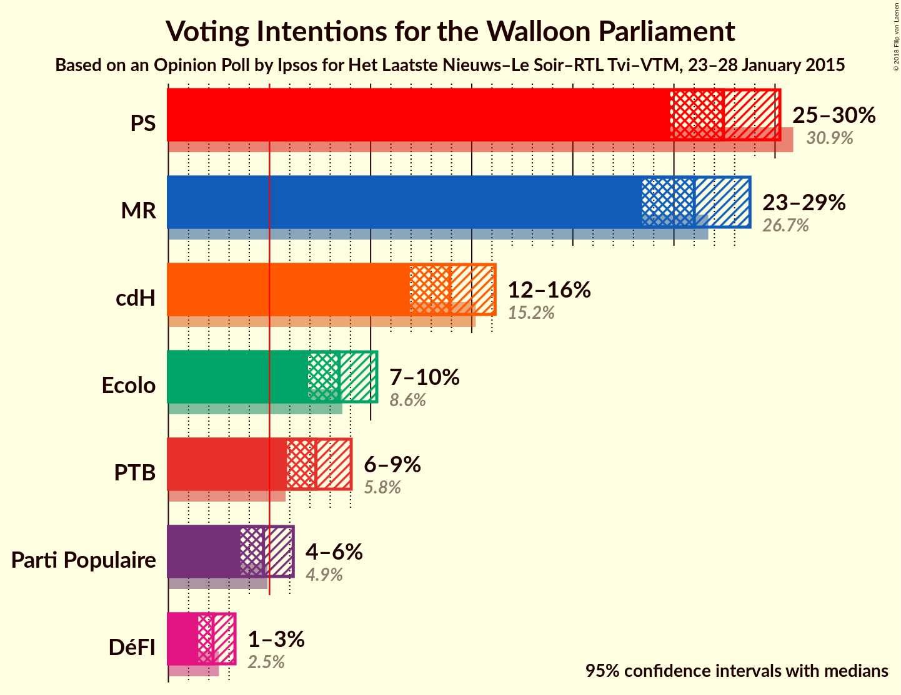
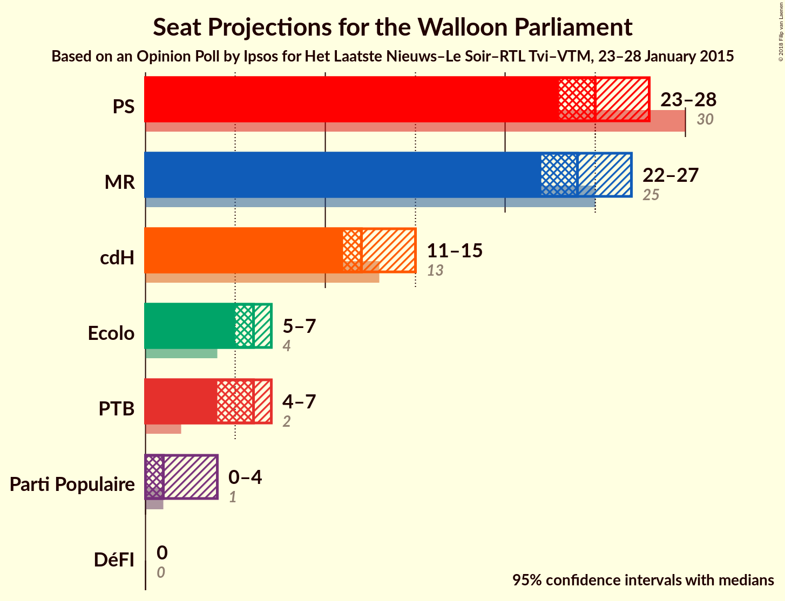
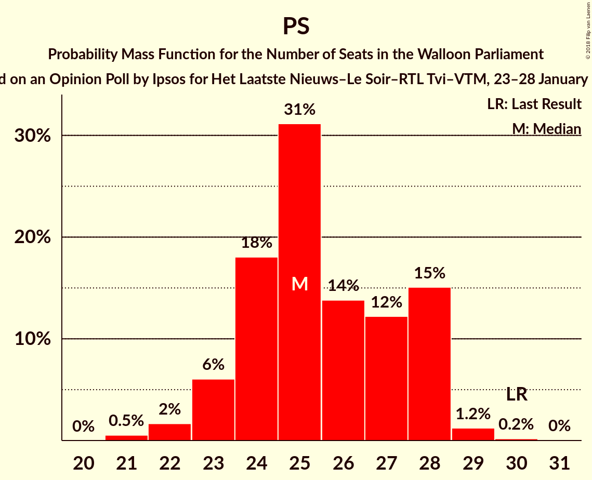
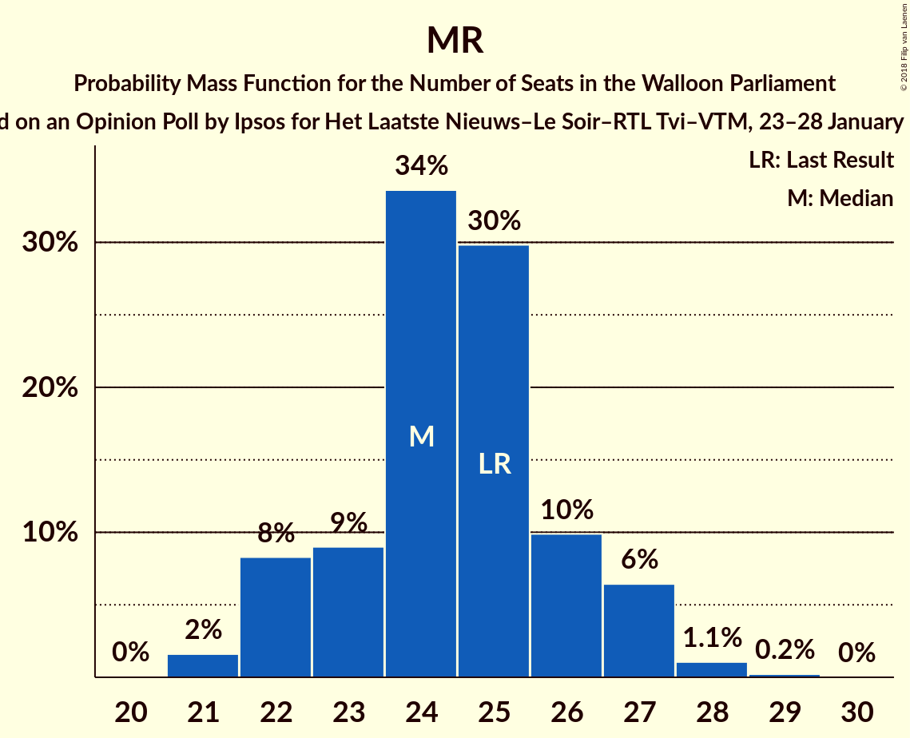
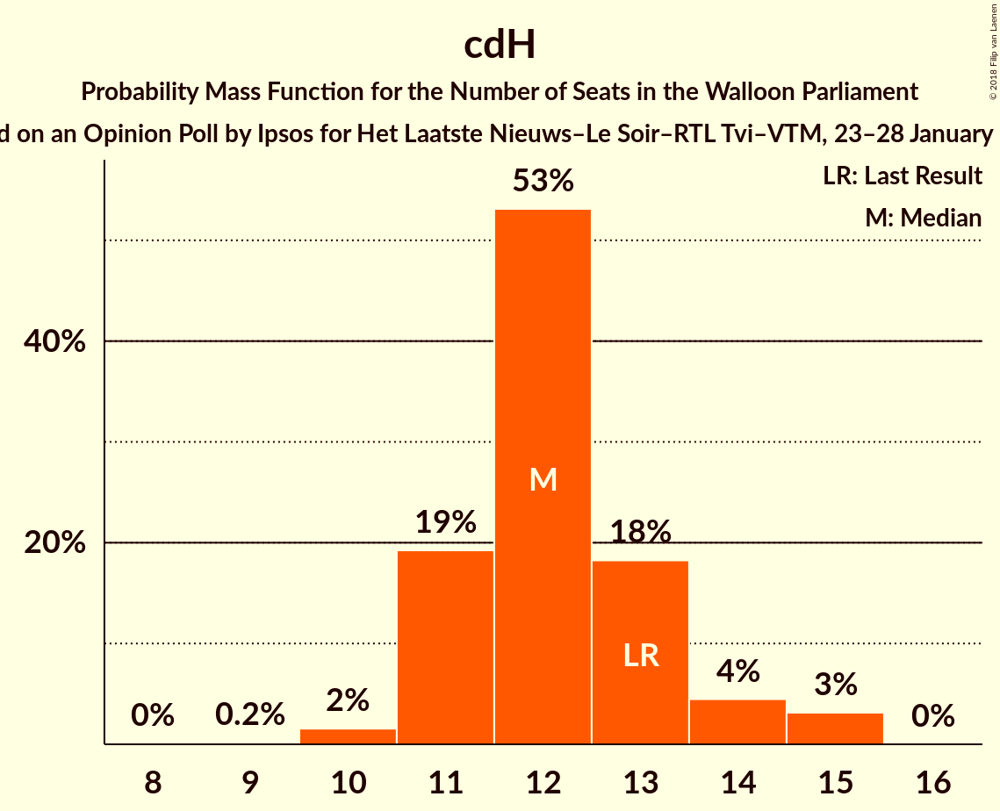
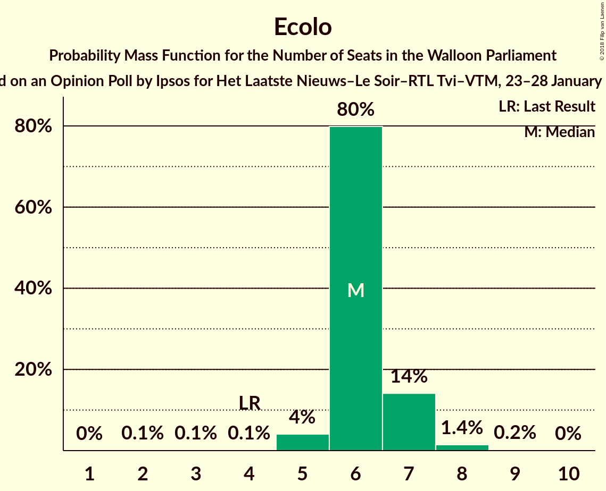
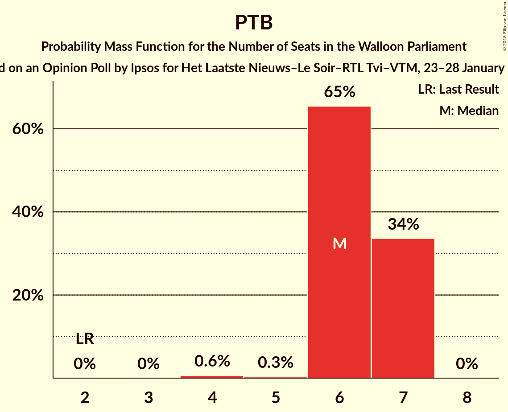
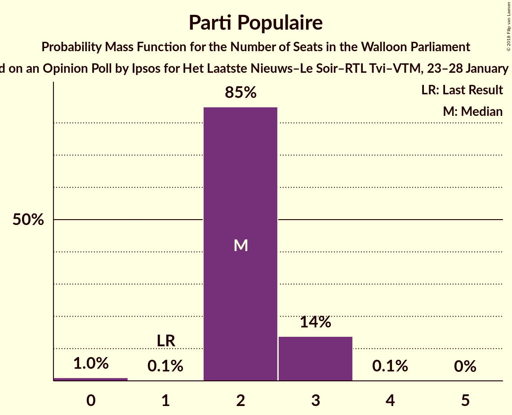
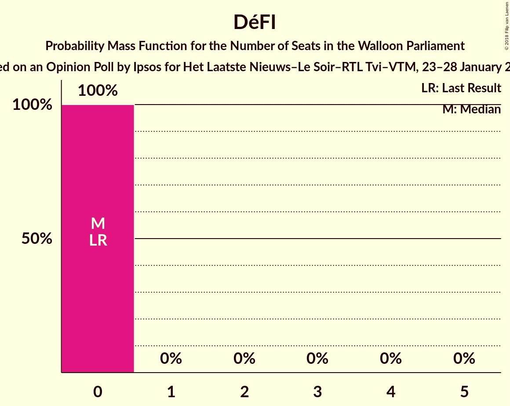
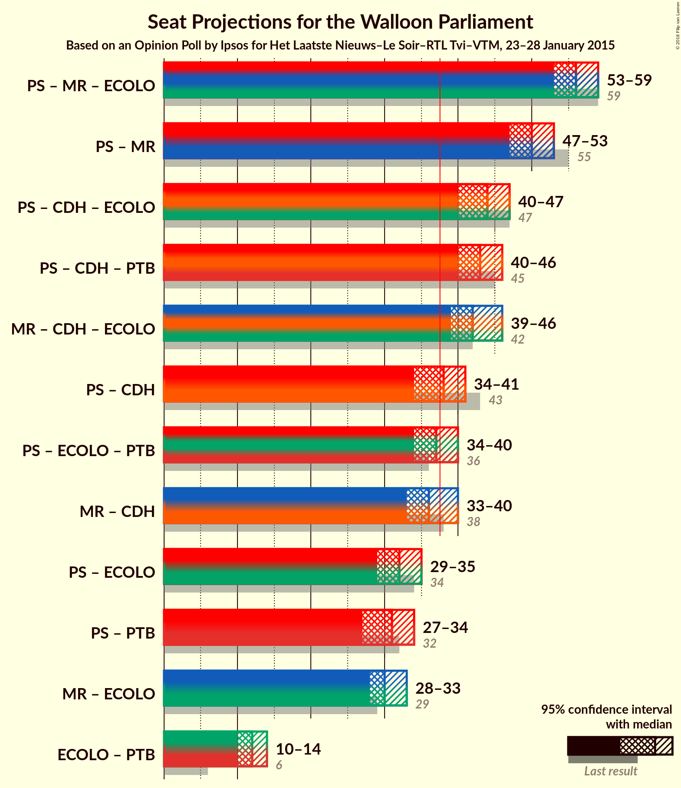

# Opinion Poll by Ipsos for Het Laatste Nieuws–Le Soir–RTL Tvi–VTM, 23–28 January 2015

<a href="#voting-intentions">Voting Intentions</a> | <a href="#seats">Seats</a> | <a href="#coalitions">Coalitions</a> | <a href="#technical-information">Technical Information</a>

## Voting Intentions

### Confidence Intervals

| Party | Last Result | Poll Result | 80% Confidence Interval | 90% Confidence Interval | 95% Confidence Interval | 99% Confidence Interval |
|:-----:|:-----------:|:-----------:|:-----------------------:|:-----------------------:|:-----------------------:|:-----------------------:|
| PS | 30.9% | 27.4% | 25.7–29.3% |25.2–29.8% |24.8–30.2% |24.0–31.1% |
| MR | 26.7% | 26.0% | 24.3–27.8% |23.8–28.3% |23.4–28.8% |22.6–29.6% |
| cdH | 15.2% | 13.9% | 12.6–15.4% |12.3–15.8% |11.9–16.2% |11.3–16.9% |
| Ecolo | 8.6% | 8.4% | 7.4–9.6% |7.1–10.0% |6.9–10.3% |6.4–10.9% |
| PTB | 5.8% | 7.3% | 6.4–8.4% |6.1–8.8% |5.9–9.0% |5.4–9.6% |
| Parti Populaire | 4.9% | 4.7% | 4.0–5.7% |3.7–5.9% |3.6–6.2% |3.2–6.7% |
| DéFI | 2.5% | 2.2% | 1.7–2.9% |1.6–3.1% |1.5–3.3% |1.3–3.7% |

*Note:* The poll result column reflects the actual value used in the calculations. Published results may vary slightly, and in addition be rounded to fewer digits.

## Seats

### Confidence Intervals

| Party | Last Result | Median | 80% Confidence Interval | 90% Confidence Interval | 95% Confidence Interval | 99% Confidence Interval |
|:-----:|:-----------:|:------:|:-----------------------:|:-----------------------:|:-----------------------:|:-----------------------:|
| <a href="#ps">PS</a> | 30 | 28 | 24–28 |24–28 |24–28 |24–28 |
| <a href="#mr">MR</a> | 25 | 22 | 22–24 |22–24 |22–24 |22–25 |
| <a href="#cdh">cdH</a> | 13 | 12 | 10–12 |10–12 |10–12 |10–12 |
| <a href="#ecolo">Ecolo</a> | 4 | 5 | 5–6 |5–6 |5–6 |5–6 |
| <a href="#ptb">PTB</a> | 2 | 6 | 6–7 |6–7 |6–7 |4–7 |
| <a href="#parti-populaire">Parti Populaire</a> | 1 | 2 | 2–3 |2–3 |2–3 |0–3 |
| <a href="#défi">DéFI</a> | 0 | 0 | 0 |0 |0 |0 |

### PS

*For a full overview of the results for this party, see the [PS](party-ps.html) page.*

| Number of Seats | Probability | Accumulated | Special Marks |
|:---------------:|:-----------:|:-----------:|:-------------:|
| 22 | 0.1% | 100% |  |
| 23 | 0% | 99.8% |  |
| 24 | 14% | 99.8% |  |
| 25 | 0.1% | 86% |  |
| 26 | 34% | 86% |  |
| 27 | 0.6% | 52% |  |
| 28 | 51% | 51% | Median |
| 29 | 0.3% | 0.4% |  |
| 30 | 0% | 0.1% | Last Result |
| 31 | 0.1% | 0.1% |  |
| 32 | 0% | 0% |  |

### MR

*For a full overview of the results for this party, see the [MR](party-mr.html) page.*

| Number of Seats | Probability | Accumulated | Special Marks |
|:---------------:|:-----------:|:-----------:|:-------------:|
| 19 | 0.1% | 100% |  |
| 20 | 0% | 99.9% |  |
| 21 | 0% | 99.9% |  |
| 22 | 51% | 99.9% | Median |
| 23 | 0% | 49% |  |
| 24 | 48% | 49% |  |
| 25 | 0.6% | 0.9% | Last Result |
| 26 | 0% | 0.3% |  |
| 27 | 0% | 0.3% |  |
| 28 | 0.2% | 0.3% |  |
| 29 | 0.1% | 0.1% |  |
| 30 | 0% | 0% |  |

### cdH

*For a full overview of the results for this party, see the [cdH](party-cdh.html) page.*

| Number of Seats | Probability | Accumulated | Special Marks |
|:---------------:|:-----------:|:-----------:|:-------------:|
| 10 | 34% | 100% |  |
| 11 | 0.2% | 66% |  |
| 12 | 66% | 66% | Median |
| 13 | 0.1% | 0.1% | Last Result |
| 14 | 0% | 0% |  |

### Ecolo

*For a full overview of the results for this party, see the [Ecolo](party-ecolo.html) page.*

| Number of Seats | Probability | Accumulated | Special Marks |
|:---------------:|:-----------:|:-----------:|:-------------:|
| 4 | 0% | 100% | Last Result |
| 5 | 51% | 100% | Median |
| 6 | 49% | 49% |  |
| 7 | 0.1% | 0.4% |  |
| 8 | 0.3% | 0.3% |  |
| 9 | 0% | 0% |  |

### PTB

*For a full overview of the results for this party, see the [PTB](party-ptb.html) page.*

| Number of Seats | Probability | Accumulated | Special Marks |
|:---------------:|:-----------:|:-----------:|:-------------:|
| 2 | 0% | 100% | Last Result |
| 3 | 0% | 100% |  |
| 4 | 0.6% | 100% |  |
| 5 | 0.3% | 99.4% |  |
| 6 | 65% | 99.1% | Median |
| 7 | 34% | 34% |  |
| 8 | 0% | 0% |  |

### Parti Populaire

*For a full overview of the results for this party, see the [Parti Populaire](party-partipopulaire.html) page.*

| Number of Seats | Probability | Accumulated | Special Marks |
|:---------------:|:-----------:|:-----------:|:-------------:|
| 0 | 1.0% | 100% |  |
| 1 | 0.1% | 99.0% | Last Result |
| 2 | 85% | 98.9% | Median |
| 3 | 14% | 14% |  |
| 4 | 0.1% | 0.1% |  |
| 5 | 0% | 0% |  |

### DéFI

*For a full overview of the results for this party, see the [DéFI](party-défi.html) page.*

| Number of Seats | Probability | Accumulated | Special Marks |
|:---------------:|:-----------:|:-----------:|:-------------:|
| 0 | 100% | 100% | Last Result, Median |

## Coalitions

### Confidence Intervals

| Coalition | Last Result | Median | Majority? | 80% Confidence Interval | 90% Confidence Interval | 95% Confidence Interval | 99% Confidence Interval |
|:---------:|:-----------:|:------:|:---------:|:-----------------------:|:-----------------------:|:-----------------------:|:-----------------------:|
| PS – MR – Ecolo | 59 | 55 | 100% | 54–56 | 54–56 | 54–56 | 54–59 |
| PS – MR | 55 | 50 | 100% | 48–50 | 48–50 | 48–50 | 48–52 |
| PS – cdH – PTB | 45 | 46 | 99.9% | 42–46 | 42–46 | 42–46 | 42–46 |
| PS – cdH – Ecolo | 47 | 45 | 100% | 42–45 | 42–45 | 42–45 | 42–45 |
| MR – cdH – Ecolo | 42 | 39 | 100% | 39–42 | 39–42 | 39–42 | 39–43 |
| PS – cdH | 43 | 40 | 52% | 36–40 | 36–40 | 36–40 | 36–40 |
| PS – Ecolo – PTB | 36 | 39 | 86% | 36–39 | 36–39 | 36–39 | 36–39 |
| MR – cdH | 38 | 34 | 0.3% | 34–36 | 34–36 | 34–36 | 34–37 |
| PS – PTB | 32 | 34 | 0% | 30–34 | 30–34 | 30–34 | 30–34 |
| PS – Ecolo | 34 | 33 | 0.1% | 30–33 | 30–33 | 30–33 | 30–34 |
| MR – Ecolo | 29 | 27 | 0% | 27–30 | 27–30 | 27–30 | 27–33 |
| Ecolo – PTB | 6 | 11 | 0% | 11–13 | 11–13 | 11–13 | 10–13 |

### PS – MR – Ecolo

| Number of Seats | Probability | Accumulated | Special Marks |
|:---------------:|:-----------:|:-----------:|:-------------:|
| 54 | 14% | 100% |  |
| 55 | 51% | 86% | Median |
| 56 | 34% | 35% |  |
| 57 | 0.1% | 1.1% |  |
| 58 | 0.3% | 1.0% |  |
| 59 | 0.6% | 0.7% | Last Result |
| 60 | 0.1% | 0.1% |  |
| 61 | 0% | 0% |  |

### PS – MR

| Number of Seats | Probability | Accumulated | Special Marks |
|:---------------:|:-----------:|:-----------:|:-------------:|
| 48 | 14% | 100% |  |
| 49 | 0.3% | 86% |  |
| 50 | 85% | 86% | Median |
| 51 | 0.3% | 1.0% |  |
| 52 | 0.3% | 0.7% |  |
| 53 | 0.3% | 0.4% |  |
| 54 | 0.1% | 0.1% |  |
| 55 | 0% | 0% | Last Result |

### PS – cdH – PTB

| Number of Seats | Probability | Accumulated | Special Marks |
|:---------------:|:-----------:|:-----------:|:-------------:|
| 37 | 0.1% | 100% |  |
| 38 | 0% | 99.9% | Majority |
| 39 | 0% | 99.8% |  |
| 40 | 0.1% | 99.8% |  |
| 41 | 0% | 99.7% |  |
| 42 | 14% | 99.7% |  |
| 43 | 34% | 86% |  |
| 44 | 0.3% | 52% |  |
| 45 | 0.6% | 52% | Last Result |
| 46 | 51% | 51% | Median |
| 47 | 0% | 0.1% |  |
| 48 | 0.1% | 0.1% |  |
| 49 | 0% | 0% |  |

### PS – cdH – Ecolo

| Number of Seats | Probability | Accumulated | Special Marks |
|:---------------:|:-----------:|:-----------:|:-------------:|
| 39 | 0.1% | 100% |  |
| 40 | 0% | 99.9% |  |
| 41 | 0% | 99.8% |  |
| 42 | 47% | 99.8% |  |
| 43 | 0% | 52% |  |
| 44 | 0.3% | 52% |  |
| 45 | 52% | 52% | Median |
| 46 | 0% | 0.4% |  |
| 47 | 0.3% | 0.4% | Last Result |
| 48 | 0% | 0.1% |  |
| 49 | 0% | 0.1% |  |
| 50 | 0% | 0.1% |  |
| 51 | 0.1% | 0.1% |  |
| 52 | 0% | 0% |  |

### MR – cdH – Ecolo

| Number of Seats | Probability | Accumulated | Special Marks |
|:---------------:|:-----------:|:-----------:|:-------------:|
| 39 | 51% | 100% | Median |
| 40 | 34% | 49% |  |
| 41 | 0% | 15% |  |
| 42 | 14% | 15% | Last Result |
| 43 | 0.6% | 0.9% |  |
| 44 | 0% | 0.3% |  |
| 45 | 0.1% | 0.3% |  |
| 46 | 0.1% | 0.1% |  |
| 47 | 0% | 0% |  |

### PS – cdH

| Number of Seats | Probability | Accumulated | Special Marks |
|:---------------:|:-----------:|:-----------:|:-------------:|
| 33 | 0.1% | 100% |  |
| 34 | 0% | 99.9% |  |
| 35 | 0% | 99.8% |  |
| 36 | 48% | 99.8% |  |
| 37 | 0% | 52% |  |
| 38 | 0% | 52% | Majority |
| 39 | 0.6% | 52% |  |
| 40 | 51% | 51% | Median |
| 41 | 0.3% | 0.4% |  |
| 42 | 0% | 0.1% |  |
| 43 | 0% | 0.1% | Last Result |
| 44 | 0.1% | 0.1% |  |
| 45 | 0% | 0% |  |

### PS – Ecolo – PTB

| Number of Seats | Probability | Accumulated | Special Marks |
|:---------------:|:-----------:|:-----------:|:-------------:|
| 32 | 0.1% | 100% |  |
| 33 | 0% | 99.8% |  |
| 34 | 0% | 99.8% |  |
| 35 | 0.1% | 99.8% |  |
| 36 | 14% | 99.7% | Last Result |
| 37 | 0% | 86% |  |
| 38 | 0.3% | 86% | Majority |
| 39 | 85% | 86% | Median |
| 40 | 0.3% | 0.4% |  |
| 41 | 0% | 0.1% |  |
| 42 | 0.1% | 0.1% |  |
| 43 | 0% | 0% |  |

### MR – cdH

| Number of Seats | Probability | Accumulated | Special Marks |
|:---------------:|:-----------:|:-----------:|:-------------:|
| 32 | 0.1% | 100% |  |
| 33 | 0% | 99.9% |  |
| 34 | 85% | 99.9% | Median |
| 35 | 0.3% | 15% |  |
| 36 | 14% | 15% |  |
| 37 | 0.3% | 0.5% |  |
| 38 | 0% | 0.3% | Last Result, Majority |
| 39 | 0.1% | 0.3% |  |
| 40 | 0.1% | 0.1% |  |
| 41 | 0% | 0% |  |

### PS – PTB

| Number of Seats | Probability | Accumulated | Special Marks |
|:---------------:|:-----------:|:-----------:|:-------------:|
| 26 | 0.1% | 100% |  |
| 27 | 0% | 99.8% |  |
| 28 | 0% | 99.8% |  |
| 29 | 0.1% | 99.8% |  |
| 30 | 14% | 99.7% |  |
| 31 | 0% | 86% |  |
| 32 | 0.6% | 86% | Last Result |
| 33 | 34% | 85% |  |
| 34 | 51% | 51% | Median |
| 35 | 0.1% | 0.1% |  |
| 36 | 0% | 0% |  |

### PS – Ecolo

| Number of Seats | Probability | Accumulated | Special Marks |
|:---------------:|:-----------:|:-----------:|:-------------:|
| 28 | 0.1% | 100% |  |
| 29 | 0% | 99.8% |  |
| 30 | 14% | 99.8% |  |
| 31 | 0.1% | 86% |  |
| 32 | 34% | 86% |  |
| 33 | 52% | 52% | Median |
| 34 | 0.3% | 0.7% | Last Result |
| 35 | 0.3% | 0.4% |  |
| 36 | 0% | 0.1% |  |
| 37 | 0% | 0.1% |  |
| 38 | 0.1% | 0.1% | Majority |
| 39 | 0% | 0% |  |

### MR – Ecolo

| Number of Seats | Probability | Accumulated | Special Marks |
|:---------------:|:-----------:|:-----------:|:-------------:|
| 26 | 0.1% | 100% |  |
| 27 | 51% | 99.9% | Median |
| 28 | 0.3% | 49% |  |
| 29 | 0% | 49% | Last Result |
| 30 | 48% | 49% |  |
| 31 | 0.3% | 0.9% |  |
| 32 | 0% | 0.6% |  |
| 33 | 0.3% | 0.6% |  |
| 34 | 0.2% | 0.3% |  |
| 35 | 0.1% | 0.1% |  |
| 36 | 0% | 0% |  |

### Ecolo – PTB

| Number of Seats | Probability | Accumulated | Special Marks |
|:---------------:|:-----------:|:-----------:|:-------------:|
| 6 | 0% | 100% | Last Result |
| 7 | 0% | 100% |  |
| 8 | 0% | 100% |  |
| 9 | 0% | 100% |  |
| 10 | 0.5% | 100% |  |
| 11 | 51% | 99.4% | Median |
| 12 | 14% | 48% |  |
| 13 | 34% | 34% |  |
| 14 | 0.3% | 0.3% |  |
| 15 | 0% | 0% |  |

## Technical Information

### Opinion Poll

+ **Polling firm:** Ipsos
+ **Commissioner(s):** Het Laatste Nieuws–Le Soir–RTL Tvi–VTM
+ **Fieldwork period:** 23–28 January 2015

### Calculations

+ **Sample size:** 1042
+ **Simulations done:** 1,024
+ **Error estimate:** 3.22%

