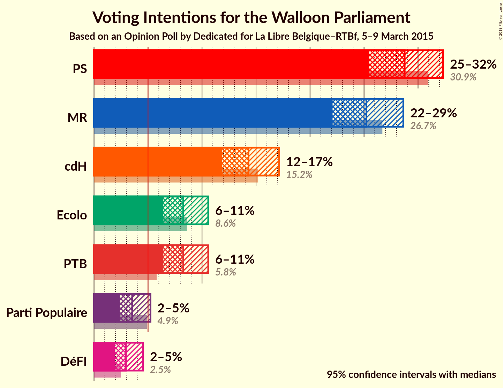
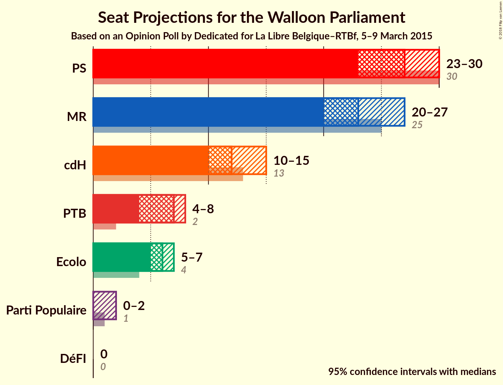
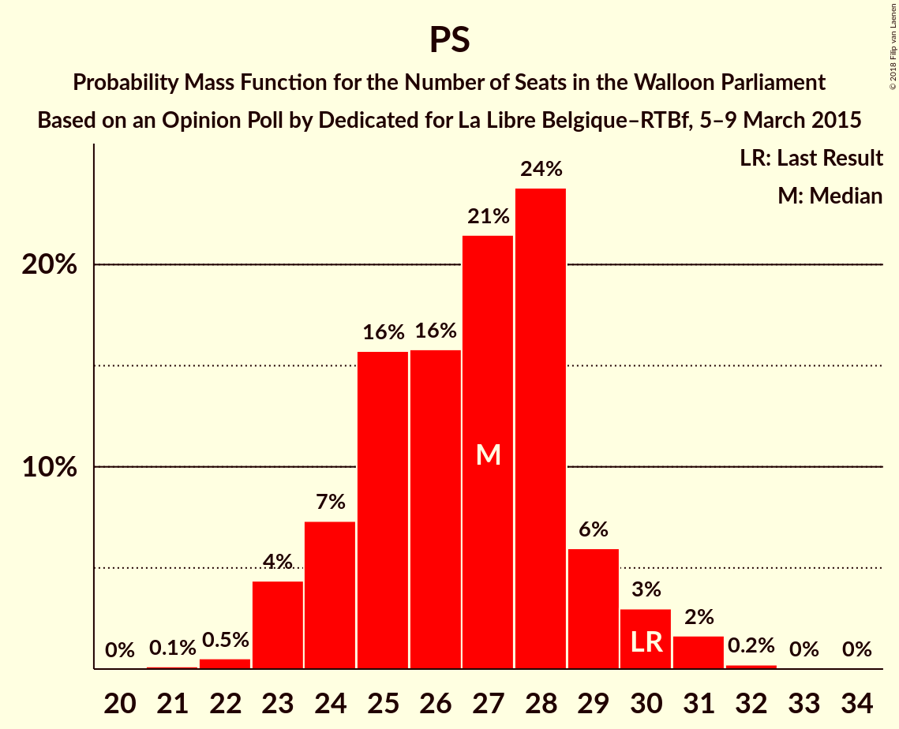
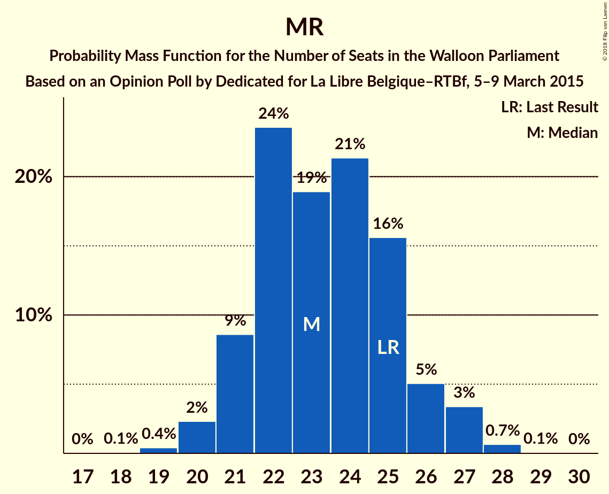
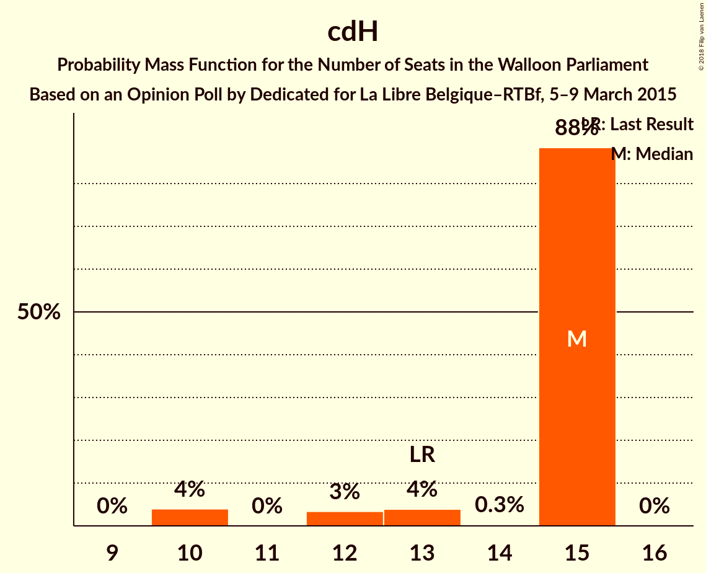
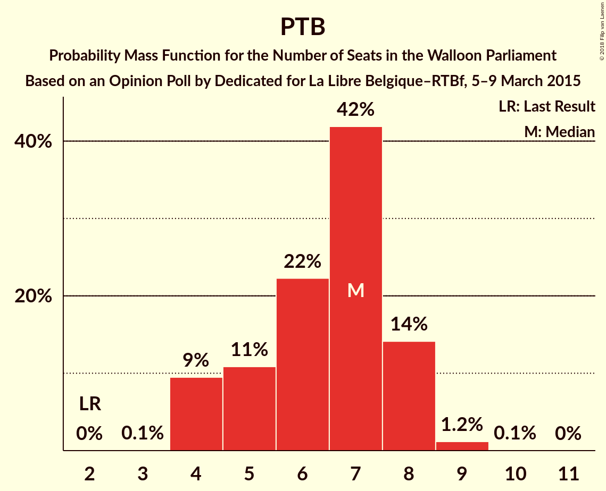
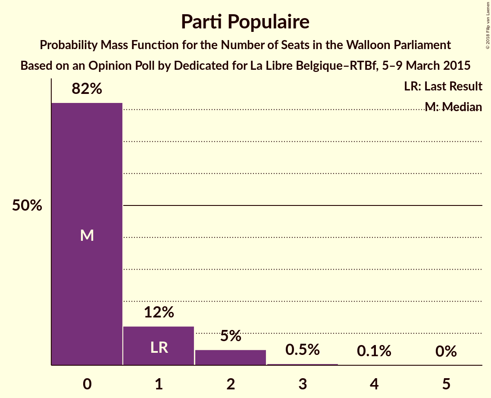
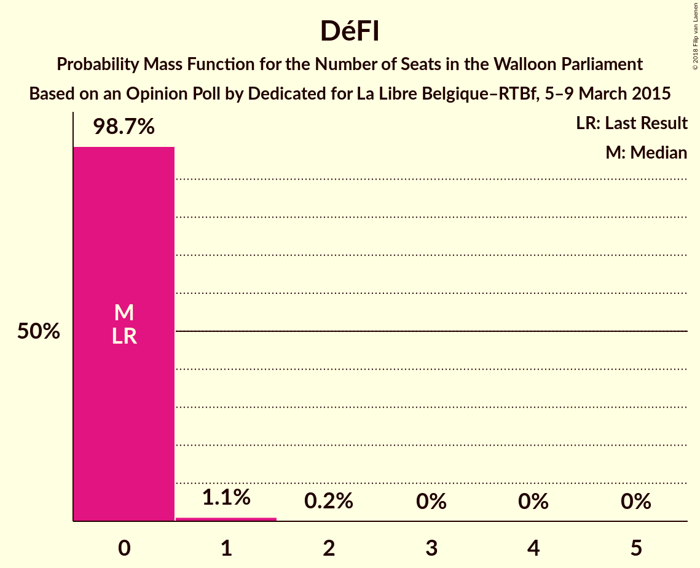
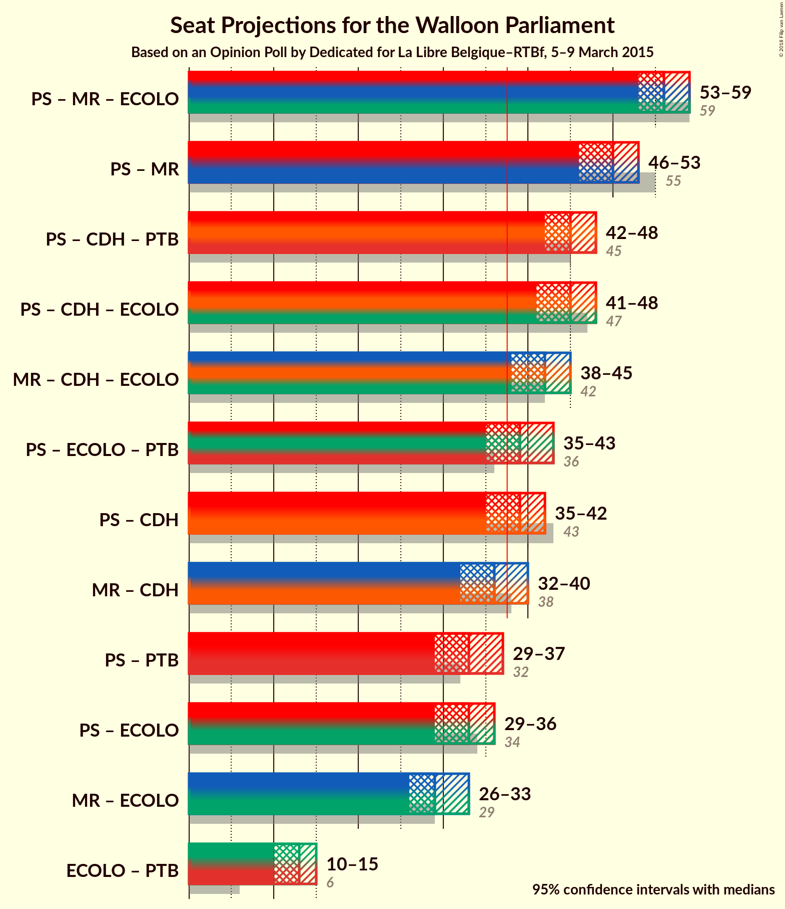

# Opinion Poll by Dedicated for La Libre Belgique–RTBf, 5–9 March 2015

<a href="#voting-intentions">Voting Intentions</a> | <a href="#seats">Seats</a> | <a href="#coalitions">Coalitions</a> | <a href="#technical-information">Technical Information</a>

## Voting Intentions

### Confidence Intervals

| Party | Last Result | Poll Result | 80% Confidence Interval | 90% Confidence Interval | 95% Confidence Interval | 99% Confidence Interval |
|:-----:|:-----------:|:-----------:|:-----------------------:|:-----------------------:|:-----------------------:|:-----------------------:|
| PS | 30.9% | 28.8% | 26.6–31.1% |26.0–31.7% |25.5–32.3% |24.5–33.4% |
| MR | 26.7% | 25.2% | 23.2–27.5% |22.6–28.1% |22.1–28.6% |21.1–29.7% |
| cdH | 15.2% | 14.3% | 12.7–16.2% |12.3–16.7% |11.9–17.1% |11.1–18.1% |
| Ecolo | 8.6% | 8.3% | 7.0–9.8% |6.7–10.2% |6.4–10.6% |5.9–11.4% |
| PTB | 5.8% | 8.3% | 7.0–9.8% |6.7–10.2% |6.4–10.6% |5.9–11.4% |
| Parti Populaire | 4.9% | 3.5% | 2.8–4.6% |2.6–4.9% |2.4–5.2% |2.1–5.8% |
| DéFI | 2.5% | 2.9% | 2.3–4.0% |2.1–4.3% |1.9–4.5% |1.6–5.1% |

*Note:* The poll result column reflects the actual value used in the calculations. Published results may vary slightly, and in addition be rounded to fewer digits.

## Seats

### Confidence Intervals

| Party | Last Result | Median | 80% Confidence Interval | 90% Confidence Interval | 95% Confidence Interval | 99% Confidence Interval |
|:-----:|:-----------:|:------:|:-----------------------:|:-----------------------:|:-----------------------:|:-----------------------:|
| <a href="#ps">PS</a> | 30 | 26 | 26 |26–27 |23–27 |22–27 |
| <a href="#mr">MR</a> | 25 | 24 | 24 |22–25 |19–26 |19–26 |
| <a href="#cdh">cdH</a> | 13 | 15 | 13–15 |12–15 |10–15 |10–15 |
| <a href="#ecolo">Ecolo</a> | 4 | 6 | 6 |6 |6–7 |6–7 |
| <a href="#ptb">PTB</a> | 2 | 4 | 4–7 |4–8 |4–8 |4–8 |
| <a href="#parti-populaire">Parti Populaire</a> | 1 | 0 | 0 |0–1 |0–2 |0–2 |
| <a href="#défi">DéFI</a> | 0 | 0 | 0 |0 |0–1 |0–1 |

### PS

*For a full overview of the results for this party, see the [PS](party-ps.html) page.*

| Number of Seats | Probability | Accumulated | Special Marks |
|:---------------:|:-----------:|:-----------:|:-------------:|
| 22 | 1.5% | 100% |  |
| 23 | 3% | 98.5% |  |
| 24 | 0% | 96% |  |
| 25 | 0.1% | 96% |  |
| 26 | 88% | 95% | Median |
| 27 | 7% | 8% |  |
| 28 | 0.3% | 0.4% |  |
| 29 | 0% | 0.1% |  |
| 30 | 0% | 0.1% | Last Result |
| 31 | 0% | 0% |  |

### MR

*For a full overview of the results for this party, see the [MR](party-mr.html) page.*

| Number of Seats | Probability | Accumulated | Special Marks |
|:---------------:|:-----------:|:-----------:|:-------------:|
| 17 | 0.3% | 100% |  |
| 18 | 0% | 99.7% |  |
| 19 | 4% | 99.7% |  |
| 20 | 0% | 96% |  |
| 21 | 0.3% | 96% |  |
| 22 | 0.8% | 95% |  |
| 23 | 3% | 95% |  |
| 24 | 87% | 92% | Median |
| 25 | 2% | 5% | Last Result |
| 26 | 3% | 3% |  |
| 27 | 0% | 0% |  |

### cdH

*For a full overview of the results for this party, see the [cdH](party-cdh.html) page.*

| Number of Seats | Probability | Accumulated | Special Marks |
|:---------------:|:-----------:|:-----------:|:-------------:|
| 10 | 4% | 100% |  |
| 11 | 0% | 96% |  |
| 12 | 3% | 96% |  |
| 13 | 4% | 93% | Last Result |
| 14 | 0.3% | 89% |  |
| 15 | 88% | 88% | Median |
| 16 | 0% | 0% |  |

### Ecolo

*For a full overview of the results for this party, see the [Ecolo](party-ecolo.html) page.*

| Number of Seats | Probability | Accumulated | Special Marks |
|:---------------:|:-----------:|:-----------:|:-------------:|
| 4 | 0% | 100% | Last Result |
| 5 | 0% | 100% |  |
| 6 | 97% | 100% | Median |
| 7 | 3% | 3% |  |
| 8 | 0% | 0.3% |  |
| 9 | 0% | 0.3% |  |
| 10 | 0.1% | 0.3% |  |
| 11 | 0.2% | 0.2% |  |
| 12 | 0% | 0% |  |

### PTB

*For a full overview of the results for this party, see the [PTB](party-ptb.html) page.*

| Number of Seats | Probability | Accumulated | Special Marks |
|:---------------:|:-----------:|:-----------:|:-------------:|
| 2 | 0% | 100% | Last Result |
| 3 | 0% | 100% |  |
| 4 | 87% | 100% | Median |
| 5 | 0.3% | 13% |  |
| 6 | 0.2% | 13% |  |
| 7 | 7% | 13% |  |
| 8 | 6% | 6% |  |
| 9 | 0% | 0% |  |

### Parti Populaire

*For a full overview of the results for this party, see the [Parti Populaire](party-partipopulaire.html) page.*

| Number of Seats | Probability | Accumulated | Special Marks |
|:---------------:|:-----------:|:-----------:|:-------------:|
| 0 | 93% | 100% | Median |
| 1 | 4% | 7% | Last Result |
| 2 | 3% | 3% |  |
| 3 | 0% | 0% |  |

### DéFI

*For a full overview of the results for this party, see the [DéFI](party-défi.html) page.*

| Number of Seats | Probability | Accumulated | Special Marks |
|:---------------:|:-----------:|:-----------:|:-------------:|
| 0 | 96% | 100% | Last Result, Median |
| 1 | 4% | 4% |  |
| 2 | 0% | 0% |  |

## Coalitions

### Confidence Intervals

| Coalition | Last Result | Median | Majority? | 80% Confidence Interval | 90% Confidence Interval | 95% Confidence Interval | 99% Confidence Interval |
|:---------:|:-----------:|:------:|:---------:|:-----------------------:|:-----------------------:|:-----------------------:|:-----------------------:|
| PS – MR – Ecolo | 59 | 56 | 100% | 56 | 53–56 | 52–56 | 52–57 |
| PS – MR | 55 | 50 | 100% | 50 | 47–50 | 46–50 | 46–51 |
| PS – cdH – PTB | 45 | 45 | 100% | 45 | 44–47 | 40–48 | 40–48 |
| PS – cdH – Ecolo | 47 | 47 | 100% | 46–47 | 43–47 | 40–47 | 40–47 |
| MR – cdH – Ecolo | 42 | 45 | 99.9% | 43–45 | 41–45 | 38–45 | 38–46 |
| PS – Ecolo – PTB | 36 | 36 | 9% | 36–37 | 36–41 | 36–41 | 35–41 |
| PS – cdH | 43 | 41 | 95% | 40–41 | 37–41 | 33–41 | 33–41 |
| MR – cdH | 38 | 39 | 88% | 36–39 | 34–39 | 32–39 | 32–40 |
| PS – PTB | 32 | 30 | 0% | 30 | 30–34 | 30–35 | 29–35 |
| PS – Ecolo | 34 | 32 | 0.3% | 32 | 32–33 | 30–33 | 28–33 |
| MR – Ecolo | 29 | 30 | 0% | 30 | 28–31 | 25–33 | 25–33 |
| Ecolo – PTB | 6 | 10 | 0% | 10–13 | 10–14 | 10–14 | 10–14 |

### PS – MR – Ecolo

| Number of Seats | Probability | Accumulated | Special Marks |
|:---------------:|:-----------:|:-----------:|:-------------:|
| 52 | 4% | 100% |  |
| 53 | 2% | 96% |  |
| 54 | 0% | 94% |  |
| 55 | 0.9% | 94% |  |
| 56 | 92% | 93% | Median |
| 57 | 1.0% | 1.0% |  |
| 58 | 0% | 0% |  |
| 59 | 0% | 0% | Last Result |

### PS – MR

| Number of Seats | Probability | Accumulated | Special Marks |
|:---------------:|:-----------:|:-----------:|:-------------:|
| 45 | 0.3% | 100% |  |
| 46 | 4% | 99.7% |  |
| 47 | 2% | 96% |  |
| 48 | 0% | 94% |  |
| 49 | 4% | 94% |  |
| 50 | 89% | 90% | Median |
| 51 | 1.0% | 1.0% |  |
| 52 | 0% | 0% |  |
| 53 | 0% | 0% |  |
| 54 | 0% | 0% |  |
| 55 | 0% | 0% | Last Result |

### PS – cdH – PTB

| Number of Seats | Probability | Accumulated | Special Marks |
|:---------------:|:-----------:|:-----------:|:-------------:|
| 40 | 3% | 100% |  |
| 41 | 0% | 97% |  |
| 42 | 0% | 97% |  |
| 43 | 0% | 97% |  |
| 44 | 2% | 97% |  |
| 45 | 87% | 95% | Last Result, Median |
| 46 | 3% | 8% |  |
| 47 | 1.0% | 5% |  |
| 48 | 4% | 4% |  |
| 49 | 0% | 0.1% |  |
| 50 | 0% | 0% |  |

### PS – cdH – Ecolo

| Number of Seats | Probability | Accumulated | Special Marks |
|:---------------:|:-----------:|:-----------:|:-------------:|
| 40 | 3% | 100% |  |
| 41 | 0% | 97% |  |
| 42 | 1.0% | 97% |  |
| 43 | 1.5% | 96% |  |
| 44 | 0% | 95% |  |
| 45 | 3% | 95% |  |
| 46 | 4% | 91% |  |
| 47 | 87% | 87% | Last Result, Median |
| 48 | 0.1% | 0.4% |  |
| 49 | 0% | 0.3% |  |
| 50 | 0% | 0.3% |  |
| 51 | 0% | 0.3% |  |
| 52 | 0.1% | 0.3% |  |
| 53 | 0.2% | 0.2% |  |
| 54 | 0% | 0% |  |

### MR – cdH – Ecolo

| Number of Seats | Probability | Accumulated | Special Marks |
|:---------------:|:-----------:|:-----------:|:-------------:|
| 37 | 0% | 100% |  |
| 38 | 4% | 99.9% | Majority |
| 39 | 0% | 96% |  |
| 40 | 0.8% | 96% |  |
| 41 | 4% | 95% |  |
| 42 | 0.4% | 92% | Last Result |
| 43 | 3% | 91% |  |
| 44 | 0% | 88% |  |
| 45 | 87% | 88% | Median |
| 46 | 1.5% | 2% |  |
| 47 | 0% | 0% |  |

### PS – Ecolo – PTB

| Number of Seats | Probability | Accumulated | Special Marks |
|:---------------:|:-----------:|:-----------:|:-------------:|
| 35 | 1.5% | 100% |  |
| 36 | 87% | 98% | Last Result, Median |
| 37 | 3% | 12% |  |
| 38 | 0% | 9% | Majority |
| 39 | 0% | 9% |  |
| 40 | 4% | 9% |  |
| 41 | 5% | 5% |  |
| 42 | 0% | 0.4% |  |
| 43 | 0% | 0.3% |  |
| 44 | 0.3% | 0.3% |  |
| 45 | 0% | 0% |  |

### PS – cdH

| Number of Seats | Probability | Accumulated | Special Marks |
|:---------------:|:-----------:|:-----------:|:-------------:|
| 33 | 3% | 100% |  |
| 34 | 0% | 97% |  |
| 35 | 0% | 97% |  |
| 36 | 1.0% | 97% |  |
| 37 | 1.5% | 96% |  |
| 38 | 0% | 95% | Majority |
| 39 | 3% | 95% |  |
| 40 | 4% | 91% |  |
| 41 | 87% | 87% | Median |
| 42 | 0.3% | 0.3% |  |
| 43 | 0% | 0% | Last Result |

### MR – cdH

| Number of Seats | Probability | Accumulated | Special Marks |
|:---------------:|:-----------:|:-----------:|:-------------:|
| 30 | 0% | 100% |  |
| 31 | 0.3% | 99.9% |  |
| 32 | 4% | 99.6% |  |
| 33 | 0% | 96% |  |
| 34 | 0.8% | 96% |  |
| 35 | 4% | 95% |  |
| 36 | 3% | 91% |  |
| 37 | 0% | 88% |  |
| 38 | 0% | 88% | Last Result, Majority |
| 39 | 87% | 88% | Median |
| 40 | 1.5% | 2% |  |
| 41 | 0% | 0% |  |

### PS – PTB

| Number of Seats | Probability | Accumulated | Special Marks |
|:---------------:|:-----------:|:-----------:|:-------------:|
| 29 | 1.5% | 100% |  |
| 30 | 90% | 98% | Median |
| 31 | 0.2% | 9% |  |
| 32 | 0% | 9% | Last Result |
| 33 | 0.2% | 9% |  |
| 34 | 4% | 8% |  |
| 35 | 5% | 5% |  |
| 36 | 0% | 0.1% |  |
| 37 | 0% | 0.1% |  |
| 38 | 0% | 0% | Majority |

### PS – Ecolo

| Number of Seats | Probability | Accumulated | Special Marks |
|:---------------:|:-----------:|:-----------:|:-------------:|
| 28 | 1.5% | 100% |  |
| 29 | 0% | 98.5% |  |
| 30 | 3% | 98% |  |
| 31 | 0.1% | 96% |  |
| 32 | 88% | 95% | Median |
| 33 | 7% | 8% |  |
| 34 | 0% | 0.4% | Last Result |
| 35 | 0% | 0.4% |  |
| 36 | 0% | 0.4% |  |
| 37 | 0% | 0.4% |  |
| 38 | 0.1% | 0.3% | Majority |
| 39 | 0.2% | 0.2% |  |
| 40 | 0% | 0% |  |

### MR – Ecolo

| Number of Seats | Probability | Accumulated | Special Marks |
|:---------------:|:-----------:|:-----------:|:-------------:|
| 25 | 4% | 100% |  |
| 26 | 0% | 96% |  |
| 27 | 0.3% | 96% |  |
| 28 | 0.9% | 96% |  |
| 29 | 3% | 95% | Last Result |
| 30 | 87% | 92% | Median |
| 31 | 2% | 5% |  |
| 32 | 0% | 3% |  |
| 33 | 3% | 3% |  |
| 34 | 0% | 0% |  |

### Ecolo – PTB

| Number of Seats | Probability | Accumulated | Special Marks |
|:---------------:|:-----------:|:-----------:|:-------------:|
| 6 | 0% | 100% | Last Result |
| 7 | 0% | 100% |  |
| 8 | 0% | 100% |  |
| 9 | 0% | 100% |  |
| 10 | 87% | 100% | Median |
| 11 | 0.1% | 13% |  |
| 12 | 0.1% | 13% |  |
| 13 | 4% | 13% |  |
| 14 | 9% | 9% |  |
| 15 | 0% | 0.3% |  |
| 16 | 0.3% | 0.3% |  |
| 17 | 0% | 0% |  |

## Technical Information

### Opinion Poll

+ **Polling firm:** Dedicated
+ **Commissioner(s):** La Libre Belgique–RTBf
+ **Fieldwork period:** 5–9 March 2015

### Calculations

+ **Sample size:** 678
+ **Simulations done:** 1,024
+ **Error estimate:** 4.88%

