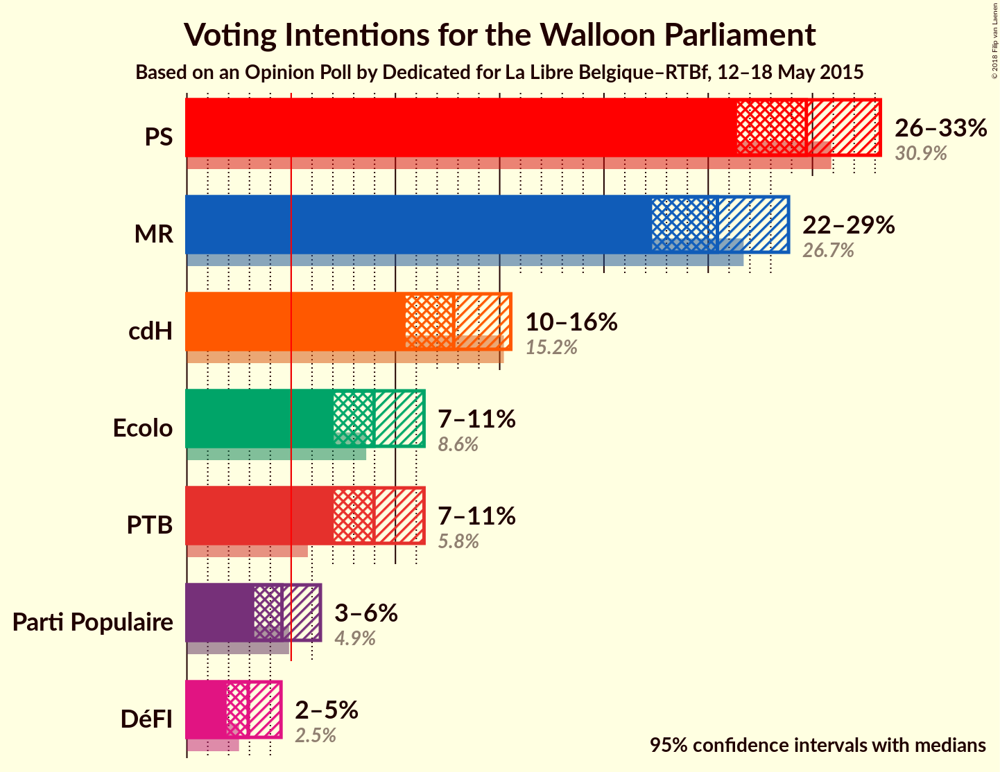
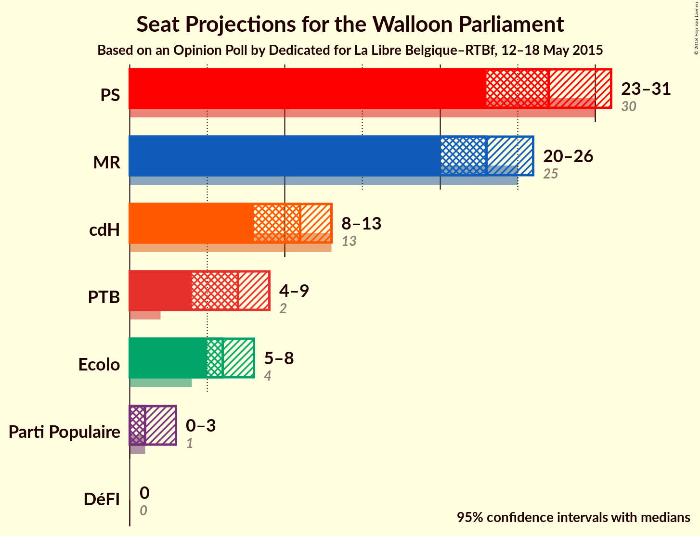
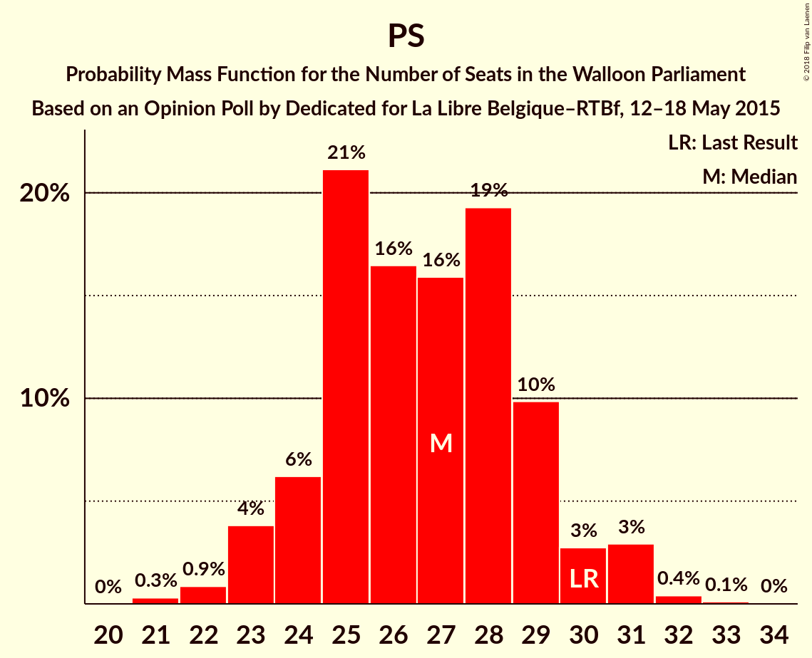
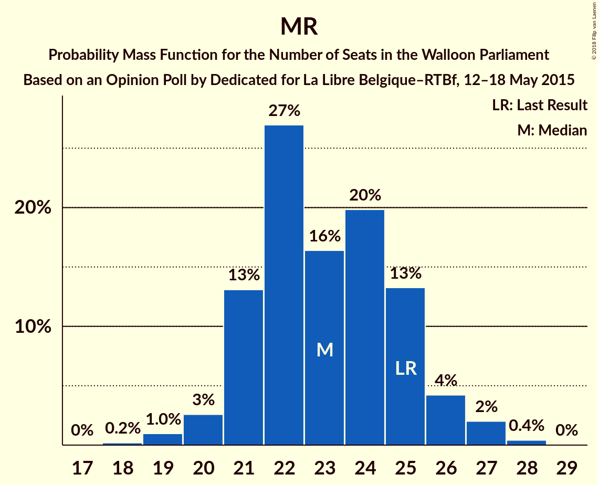
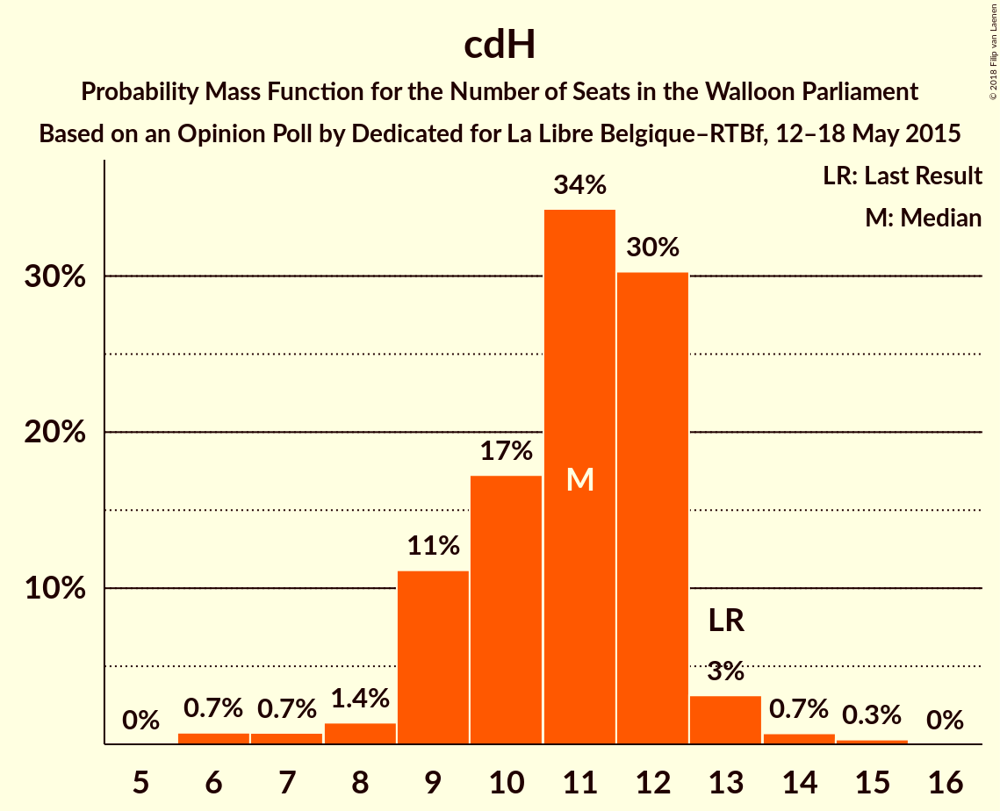
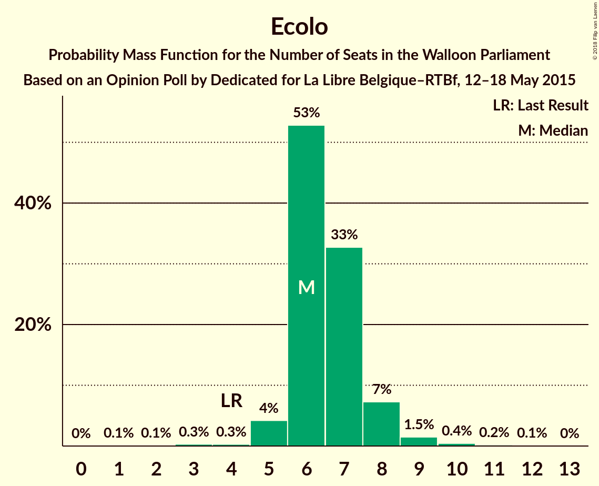
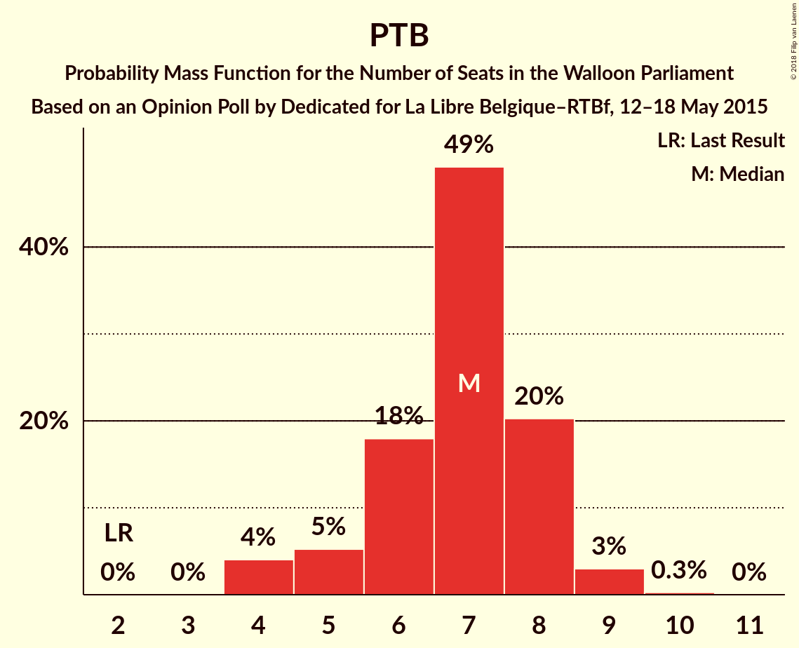
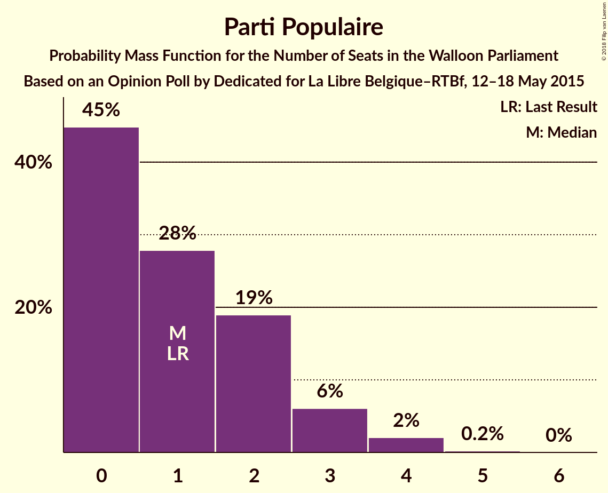
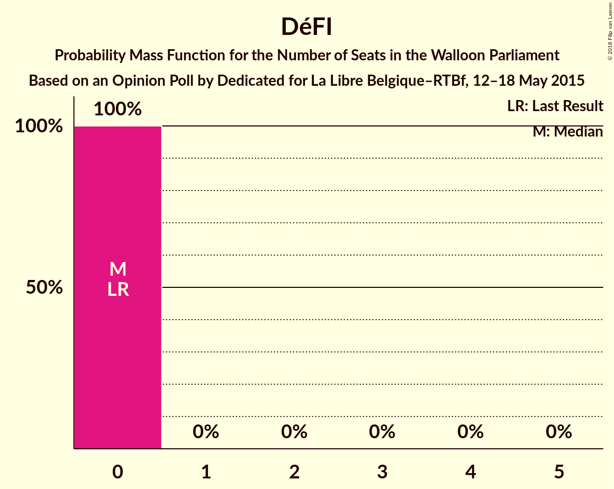
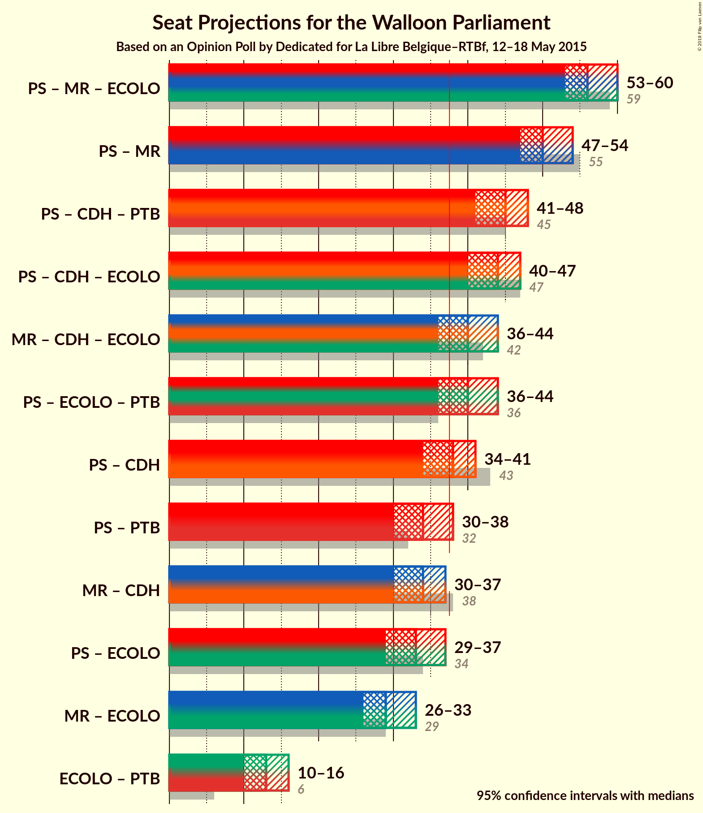

# Opinion Poll by Dedicated for La Libre Belgique–RTBf, 12–18 May 2015

<a href="#voting-intentions">Voting Intentions</a> | <a href="#seats">Seats</a> | <a href="#coalitions">Coalitions</a> | <a href="#technical-information">Technical Information</a>

## Voting Intentions

### Confidence Intervals

| Party | Last Result | Poll Result | 80% Confidence Interval | 90% Confidence Interval | 95% Confidence Interval | 99% Confidence Interval |
|:-----:|:-----------:|:-----------:|:-----------------------:|:-----------------------:|:-----------------------:|:-----------------------:|
| PS | 30.9% | 29.7% | 27.5–32.0% |26.9–32.7% |26.4–33.3% |25.4–34.4% |
| MR | 26.7% | 25.4% | 23.4–27.7% |22.8–28.3% |22.3–28.9% |21.4–29.9% |
| cdH | 15.2% | 12.8% | 11.3–14.6% |10.9–15.1% |10.5–15.5% |9.8–16.4% |
| Ecolo | 8.6% | 9.0% | 7.7–10.5% |7.3–11.0% |7.0–11.4% |6.5–12.1% |
| PTB | 5.8% | 9.0% | 7.7–10.5% |7.3–11.0% |7.0–11.4% |6.5–12.1% |
| Parti Populaire | 4.9% | 4.6% | 3.7–5.8% |3.4–6.1% |3.2–6.4% |2.9–7.0% |
| DéFI | 2.5% | 2.9% | 2.3–4.0% |2.1–4.3% |1.9–4.5% |1.6–5.0% |

*Note:* The poll result column reflects the actual value used in the calculations. Published results may vary slightly, and in addition be rounded to fewer digits.

## Seats

### Confidence Intervals

| Party | Last Result | Median | 80% Confidence Interval | 90% Confidence Interval | 95% Confidence Interval | 99% Confidence Interval |
|:-----:|:-----------:|:------:|:-----------------------:|:-----------------------:|:-----------------------:|:-----------------------:|
| <a href="#ps">PS</a> | 30 | 27 | 24–29 |24–30 |23–31 |22–32 |
| <a href="#mr">MR</a> | 25 | 23 | 21–25 |21–26 |20–27 |19–27 |
| <a href="#cdh">cdH</a> | 13 | 11 | 9–12 |9–12 |8–13 |6–14 |
| <a href="#ecolo">Ecolo</a> | 4 | 6 | 6–7 |6–8 |5–8 |4–10 |
| <a href="#ptb">PTB</a> | 2 | 7 | 6–8 |5–8 |4–9 |4–9 |
| <a href="#parti-populaire">Parti Populaire</a> | 1 | 0 | 0–2 |0–3 |0–4 |0–4 |
| <a href="#défi">DéFI</a> | 0 | 0 | 0 |0 |0 |0–1 |

### PS

*For a full overview of the results for this party, see the [PS](party-ps.html) page.*

| Number of Seats | Probability | Accumulated | Special Marks |
|:---------------:|:-----------:|:-----------:|:-------------:|
| 21 | 0.3% | 100% |  |
| 22 | 0.9% | 99.7% |  |
| 23 | 4% | 98.8% |  |
| 24 | 6% | 95% |  |
| 25 | 21% | 89% |  |
| 26 | 16% | 68% |  |
| 27 | 16% | 51% | Median |
| 28 | 19% | 35% |  |
| 29 | 10% | 16% |  |
| 30 | 3% | 6% | Last Result |
| 31 | 3% | 3% |  |
| 32 | 0.4% | 0.5% |  |
| 33 | 0.1% | 0.1% |  |
| 34 | 0% | 0% |  |

### MR

*For a full overview of the results for this party, see the [MR](party-mr.html) page.*

| Number of Seats | Probability | Accumulated | Special Marks |
|:---------------:|:-----------:|:-----------:|:-------------:|
| 18 | 0.2% | 100% |  |
| 19 | 1.0% | 99.7% |  |
| 20 | 2% | 98.8% |  |
| 21 | 13% | 97% |  |
| 22 | 25% | 83% |  |
| 23 | 15% | 58% | Median |
| 24 | 24% | 43% |  |
| 25 | 11% | 19% | Last Result |
| 26 | 5% | 7% |  |
| 27 | 2% | 3% |  |
| 28 | 0.4% | 0.5% |  |
| 29 | 0% | 0% |  |

### cdH

*For a full overview of the results for this party, see the [cdH](party-cdh.html) page.*

| Number of Seats | Probability | Accumulated | Special Marks |
|:---------------:|:-----------:|:-----------:|:-------------:|
| 6 | 0.6% | 100% |  |
| 7 | 0.5% | 99.4% |  |
| 8 | 2% | 98.9% |  |
| 9 | 11% | 97% |  |
| 10 | 18% | 87% |  |
| 11 | 34% | 69% | Median |
| 12 | 31% | 35% |  |
| 13 | 3% | 4% | Last Result |
| 14 | 0.9% | 1.3% |  |
| 15 | 0.3% | 0.3% |  |
| 16 | 0% | 0% |  |

### Ecolo

*For a full overview of the results for this party, see the [Ecolo](party-ecolo.html) page.*

| Number of Seats | Probability | Accumulated | Special Marks |
|:---------------:|:-----------:|:-----------:|:-------------:|
| 1 | 0.1% | 100% |  |
| 2 | 0.1% | 99.9% |  |
| 3 | 0.3% | 99.8% |  |
| 4 | 0.3% | 99.5% | Last Result |
| 5 | 4% | 99.2% |  |
| 6 | 53% | 95% | Median |
| 7 | 33% | 42% |  |
| 8 | 7% | 9% |  |
| 9 | 1.5% | 2% |  |
| 10 | 0.4% | 0.7% |  |
| 11 | 0.2% | 0.3% |  |
| 12 | 0.1% | 0.1% |  |
| 13 | 0% | 0% |  |

### PTB

*For a full overview of the results for this party, see the [PTB](party-ptb.html) page.*

| Number of Seats | Probability | Accumulated | Special Marks |
|:---------------:|:-----------:|:-----------:|:-------------:|
| 2 | 0% | 100% | Last Result |
| 3 | 0% | 100% |  |
| 4 | 5% | 100% |  |
| 5 | 5% | 95% |  |
| 6 | 12% | 91% |  |
| 7 | 46% | 79% | Median |
| 8 | 28% | 32% |  |
| 9 | 4% | 5% |  |
| 10 | 0.4% | 0.4% |  |
| 11 | 0% | 0% |  |

### Parti Populaire

*For a full overview of the results for this party, see the [Parti Populaire](party-partipopulaire.html) page.*

| Number of Seats | Probability | Accumulated | Special Marks |
|:---------------:|:-----------:|:-----------:|:-------------:|
| 0 | 52% | 100% | Median |
| 1 | 21% | 48% | Last Result |
| 2 | 20% | 27% |  |
| 3 | 5% | 7% |  |
| 4 | 2% | 3% |  |
| 5 | 0.2% | 0.2% |  |
| 6 | 0% | 0% |  |

### DéFI

*For a full overview of the results for this party, see the [DéFI](party-défi.html) page.*

| Number of Seats | Probability | Accumulated | Special Marks |
|:---------------:|:-----------:|:-----------:|:-------------:|
| 0 | 98.8% | 100% | Last Result, Median |
| 1 | 1.1% | 1.2% |  |
| 2 | 0.1% | 0.1% |  |
| 3 | 0% | 0% |  |

## Coalitions

### Confidence Intervals

| Coalition | Last Result | Median | Majority? | 80% Confidence Interval | 90% Confidence Interval | 95% Confidence Interval | 99% Confidence Interval |
|:---------:|:-----------:|:------:|:---------:|:-----------------------:|:-----------------------:|:-----------------------:|:-----------------------:|
| PS – MR – Ecolo | 59 | 56 | 100% | 54–58 | 54–59 | 53–60 | 52–61 |
| PS – MR | 55 | 50 | 100% | 48–52 | 47–53 | 46–54 | 45–55 |
| PS – cdH – PTB | 45 | 44 | 100% | 42–47 | 41–47 | 41–48 | 40–49 |
| PS – cdH – Ecolo | 47 | 44 | 100% | 42–46 | 41–47 | 40–47 | 39–49 |
| MR – cdH – Ecolo | 42 | 40 | 93% | 38–43 | 37–43 | 36–44 | 36–45 |
| PS – Ecolo – PTB | 36 | 40 | 92% | 38–43 | 37–43 | 36–44 | 35–45 |
| PS – cdH | 43 | 37 | 49% | 35–40 | 34–40 | 34–41 | 33–43 |
| MR – cdH | 38 | 34 | 3% | 32–36 | 31–37 | 30–38 | 29–39 |
| PS – PTB | 32 | 34 | 3% | 31–36 | 31–37 | 30–38 | 29–38 |
| PS – Ecolo | 34 | 33 | 0.7% | 31–36 | 30–36 | 29–37 | 28–38 |
| MR – Ecolo | 29 | 29 | 0% | 27–32 | 27–33 | 26–33 | 25–34 |
| Ecolo – PTB | 6 | 14 | 0% | 12–15 | 11–15 | 10–16 | 10–17 |

### PS – MR – Ecolo

| Number of Seats | Probability | Accumulated | Special Marks |
|:---------------:|:-----------:|:-----------:|:-------------:|
| 51 | 0.2% | 100% |  |
| 52 | 0.9% | 99.8% |  |
| 53 | 3% | 98.8% |  |
| 54 | 9% | 96% |  |
| 55 | 24% | 87% |  |
| 56 | 21% | 63% | Median |
| 57 | 23% | 42% |  |
| 58 | 10% | 19% |  |
| 59 | 5% | 9% | Last Result |
| 60 | 2% | 4% |  |
| 61 | 2% | 2% |  |
| 62 | 0.3% | 0.4% |  |
| 63 | 0% | 0.1% |  |
| 64 | 0% | 0% |  |

### PS – MR

| Number of Seats | Probability | Accumulated | Special Marks |
|:---------------:|:-----------:|:-----------:|:-------------:|
| 44 | 0.1% | 100% |  |
| 45 | 0.5% | 99.8% |  |
| 46 | 2% | 99.3% |  |
| 47 | 5% | 97% |  |
| 48 | 15% | 92% |  |
| 49 | 24% | 77% |  |
| 50 | 25% | 53% | Median |
| 51 | 15% | 28% |  |
| 52 | 6% | 13% |  |
| 53 | 3% | 7% |  |
| 54 | 2% | 3% |  |
| 55 | 1.3% | 2% | Last Result |
| 56 | 0.2% | 0.3% |  |
| 57 | 0.1% | 0.1% |  |
| 58 | 0% | 0% |  |

### PS – cdH – PTB

| Number of Seats | Probability | Accumulated | Special Marks |
|:---------------:|:-----------:|:-----------:|:-------------:|
| 38 | 0.1% | 100% | Majority |
| 39 | 0.3% | 99.9% |  |
| 40 | 2% | 99.5% |  |
| 41 | 3% | 98% |  |
| 42 | 6% | 94% |  |
| 43 | 14% | 88% |  |
| 44 | 26% | 75% |  |
| 45 | 15% | 49% | Last Result, Median |
| 46 | 20% | 34% |  |
| 47 | 9% | 14% |  |
| 48 | 3% | 4% |  |
| 49 | 1.1% | 1.3% |  |
| 50 | 0.1% | 0.2% |  |
| 51 | 0% | 0% |  |

### PS – cdH – Ecolo

| Number of Seats | Probability | Accumulated | Special Marks |
|:---------------:|:-----------:|:-----------:|:-------------:|
| 38 | 0.1% | 100% | Majority |
| 39 | 1.0% | 99.8% |  |
| 40 | 2% | 98.9% |  |
| 41 | 6% | 96% |  |
| 42 | 11% | 90% |  |
| 43 | 17% | 80% |  |
| 44 | 21% | 62% | Median |
| 45 | 18% | 42% |  |
| 46 | 17% | 24% |  |
| 47 | 5% | 7% | Last Result |
| 48 | 1.2% | 2% |  |
| 49 | 0.4% | 0.6% |  |
| 50 | 0.1% | 0.1% |  |
| 51 | 0% | 0% |  |

### MR – cdH – Ecolo

| Number of Seats | Probability | Accumulated | Special Marks |
|:---------------:|:-----------:|:-----------:|:-------------:|
| 34 | 0.1% | 100% |  |
| 35 | 0.4% | 99.9% |  |
| 36 | 2% | 99.5% |  |
| 37 | 4% | 97% |  |
| 38 | 8% | 93% | Majority |
| 39 | 14% | 85% |  |
| 40 | 22% | 71% | Median |
| 41 | 17% | 49% |  |
| 42 | 18% | 32% | Last Result |
| 43 | 10% | 15% |  |
| 44 | 3% | 5% |  |
| 45 | 2% | 2% |  |
| 46 | 0.2% | 0.3% |  |
| 47 | 0.1% | 0.1% |  |
| 48 | 0% | 0% |  |

### PS – Ecolo – PTB

| Number of Seats | Probability | Accumulated | Special Marks |
|:---------------:|:-----------:|:-----------:|:-------------:|
| 34 | 0.2% | 100% |  |
| 35 | 0.8% | 99.8% |  |
| 36 | 3% | 99.1% | Last Result |
| 37 | 5% | 97% |  |
| 38 | 8% | 92% | Majority |
| 39 | 23% | 84% |  |
| 40 | 20% | 61% | Median |
| 41 | 17% | 41% |  |
| 42 | 14% | 25% |  |
| 43 | 7% | 11% |  |
| 44 | 3% | 4% |  |
| 45 | 0.7% | 0.8% |  |
| 46 | 0.1% | 0.1% |  |
| 47 | 0% | 0% |  |

### PS – cdH

| Number of Seats | Probability | Accumulated | Special Marks |
|:---------------:|:-----------:|:-----------:|:-------------:|
| 31 | 0.1% | 100% |  |
| 32 | 0.3% | 99.9% |  |
| 33 | 2% | 99.6% |  |
| 34 | 3% | 98% |  |
| 35 | 8% | 95% |  |
| 36 | 13% | 87% |  |
| 37 | 25% | 74% |  |
| 38 | 15% | 49% | Median, Majority |
| 39 | 19% | 33% |  |
| 40 | 11% | 14% |  |
| 41 | 2% | 3% |  |
| 42 | 0.8% | 1.4% |  |
| 43 | 0.5% | 0.6% | Last Result |
| 44 | 0.1% | 0.1% |  |
| 45 | 0% | 0% |  |

### MR – cdH

| Number of Seats | Probability | Accumulated | Special Marks |
|:---------------:|:-----------:|:-----------:|:-------------:|
| 28 | 0.1% | 100% |  |
| 29 | 0.4% | 99.9% |  |
| 30 | 4% | 99.5% |  |
| 31 | 5% | 96% |  |
| 32 | 11% | 91% |  |
| 33 | 21% | 80% |  |
| 34 | 21% | 60% | Median |
| 35 | 14% | 39% |  |
| 36 | 18% | 25% |  |
| 37 | 3% | 6% |  |
| 38 | 2% | 3% | Last Result, Majority |
| 39 | 1.0% | 1.2% |  |
| 40 | 0.2% | 0.2% |  |
| 41 | 0% | 0% |  |

### PS – PTB

| Number of Seats | Probability | Accumulated | Special Marks |
|:---------------:|:-----------:|:-----------:|:-------------:|
| 27 | 0.1% | 100% |  |
| 28 | 0.4% | 99.9% |  |
| 29 | 0.8% | 99.5% |  |
| 30 | 4% | 98.8% |  |
| 31 | 9% | 95% |  |
| 32 | 11% | 87% | Last Result |
| 33 | 23% | 75% |  |
| 34 | 20% | 52% | Median |
| 35 | 14% | 31% |  |
| 36 | 11% | 17% |  |
| 37 | 4% | 7% |  |
| 38 | 2% | 3% | Majority |
| 39 | 0.3% | 0.4% |  |
| 40 | 0% | 0.1% |  |
| 41 | 0% | 0% |  |

### PS – Ecolo

| Number of Seats | Probability | Accumulated | Special Marks |
|:---------------:|:-----------:|:-----------:|:-------------:|
| 27 | 0.2% | 100% |  |
| 28 | 0.5% | 99.8% |  |
| 29 | 3% | 99.3% |  |
| 30 | 4% | 96% |  |
| 31 | 15% | 92% |  |
| 32 | 14% | 76% |  |
| 33 | 17% | 62% | Median |
| 34 | 20% | 45% | Last Result |
| 35 | 13% | 25% |  |
| 36 | 7% | 11% |  |
| 37 | 4% | 4% |  |
| 38 | 0.5% | 0.7% | Majority |
| 39 | 0.1% | 0.2% |  |
| 40 | 0% | 0.1% |  |
| 41 | 0% | 0% |  |

### MR – Ecolo

| Number of Seats | Probability | Accumulated | Special Marks |
|:---------------:|:-----------:|:-----------:|:-------------:|
| 24 | 0.2% | 100% |  |
| 25 | 0.6% | 99.7% |  |
| 26 | 3% | 99.1% |  |
| 27 | 9% | 97% |  |
| 28 | 14% | 88% |  |
| 29 | 26% | 74% | Last Result, Median |
| 30 | 19% | 48% |  |
| 31 | 15% | 29% |  |
| 32 | 9% | 14% |  |
| 33 | 5% | 6% |  |
| 34 | 0.9% | 1.3% |  |
| 35 | 0.4% | 0.4% |  |
| 36 | 0.1% | 0.1% |  |
| 37 | 0% | 0% |  |

### Ecolo – PTB

| Number of Seats | Probability | Accumulated | Special Marks |
|:---------------:|:-----------:|:-----------:|:-------------:|
| 6 | 0% | 100% | Last Result |
| 7 | 0% | 100% |  |
| 8 | 0.1% | 100% |  |
| 9 | 0.4% | 99.9% |  |
| 10 | 4% | 99.5% |  |
| 11 | 5% | 96% |  |
| 12 | 10% | 91% |  |
| 13 | 19% | 82% | Median |
| 14 | 48% | 63% |  |
| 15 | 10% | 14% |  |
| 16 | 3% | 4% |  |
| 17 | 0.6% | 0.9% |  |
| 18 | 0.3% | 0.3% |  |
| 19 | 0.1% | 0.1% |  |
| 20 | 0% | 0% |  |

## Technical Information

### Opinion Poll

+ **Polling firm:** Dedicated
+ **Commissioner(s):** La Libre Belgique–RTBf
+ **Fieldwork period:** 12–18 May 2015

### Calculations

+ **Sample size:** 680
+ **Simulations done:** 524,288
+ **Error estimate:** 1.36%

