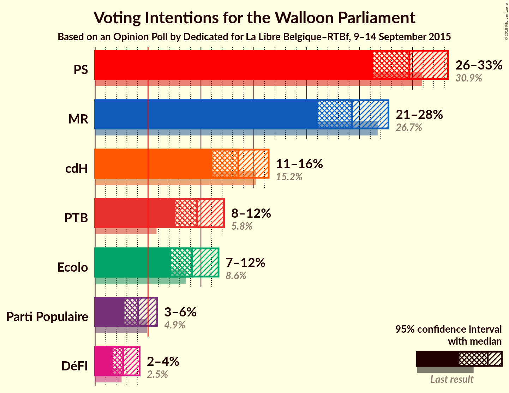
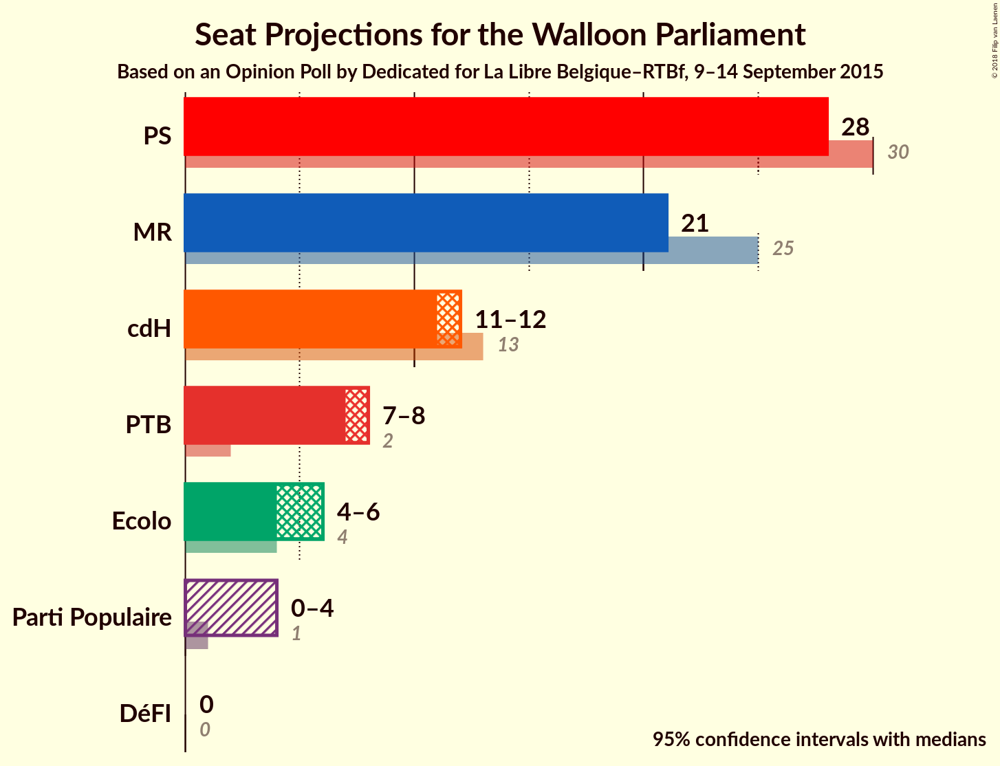
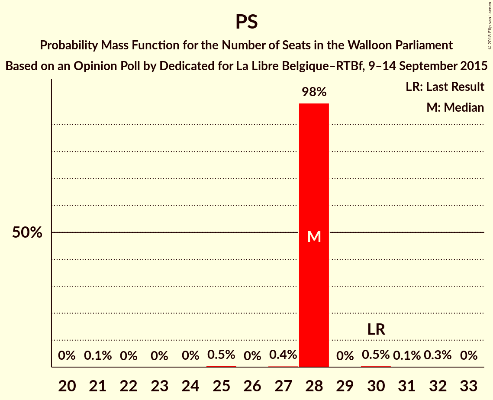
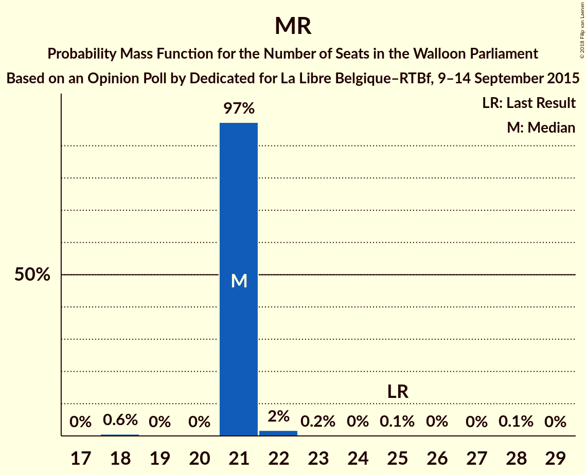
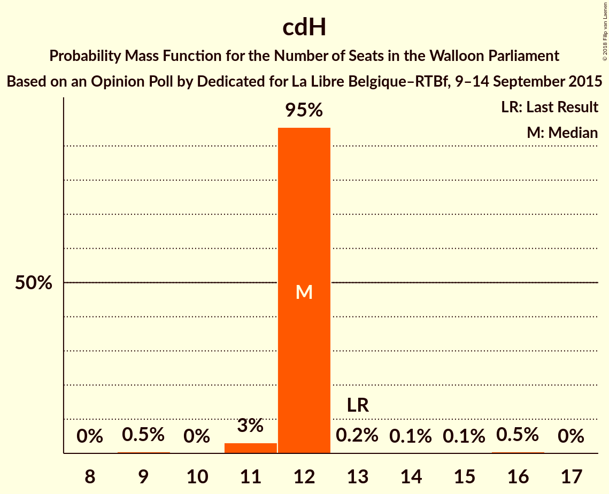
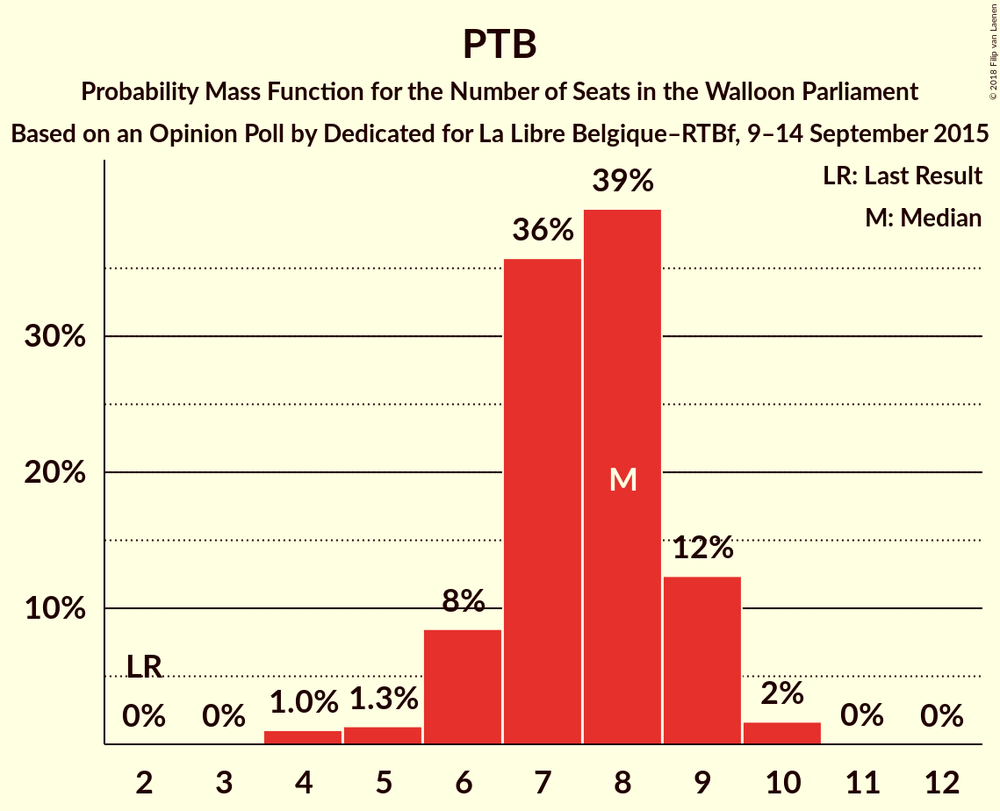
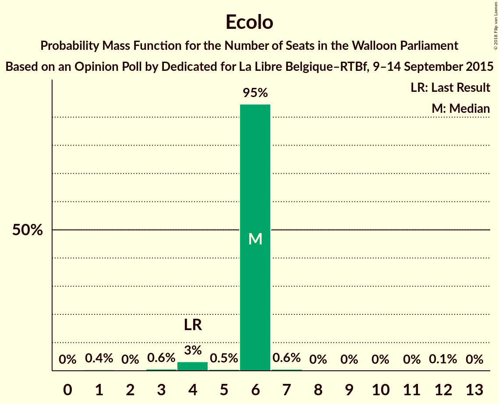
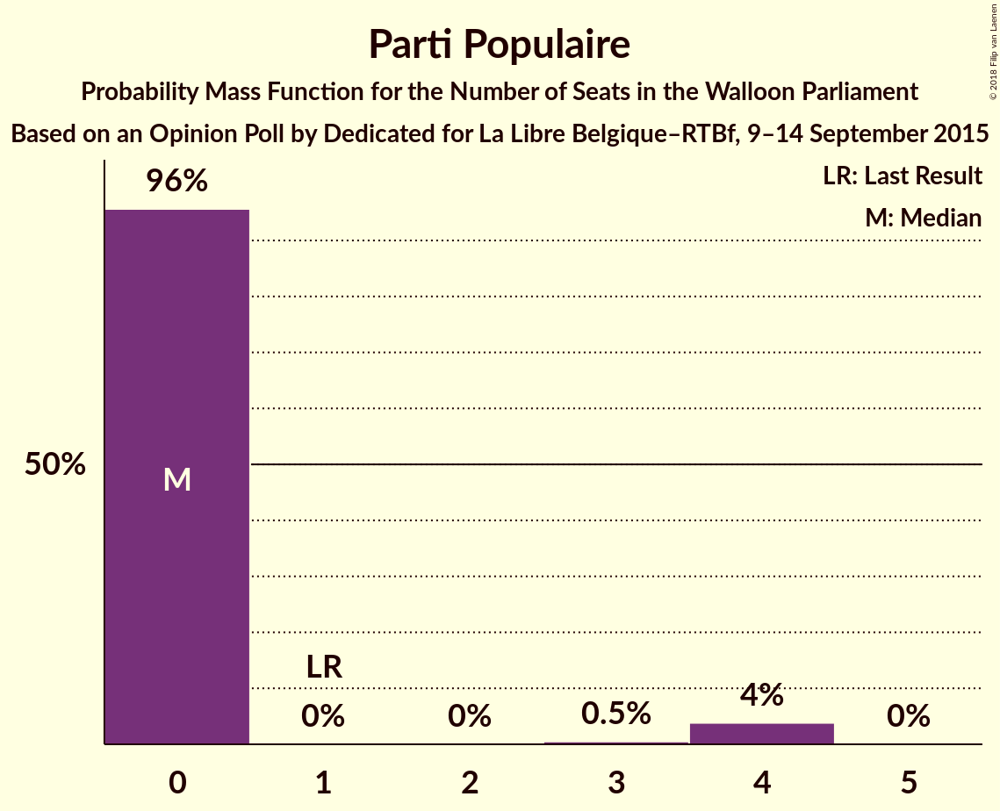
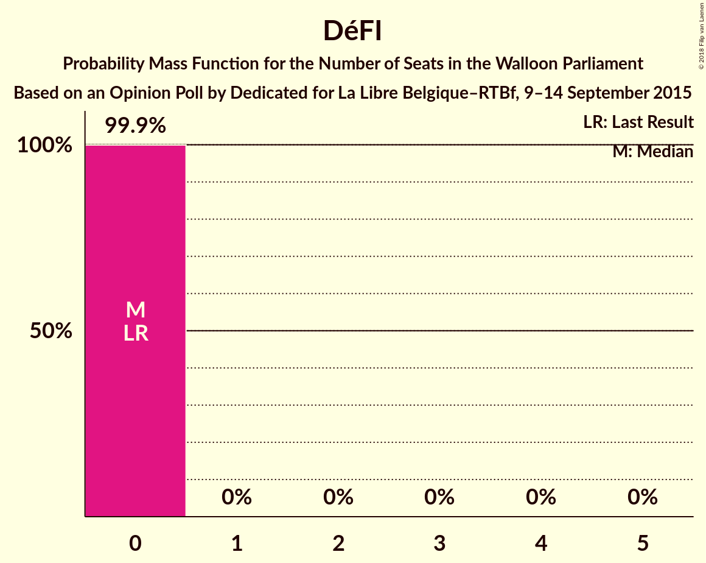
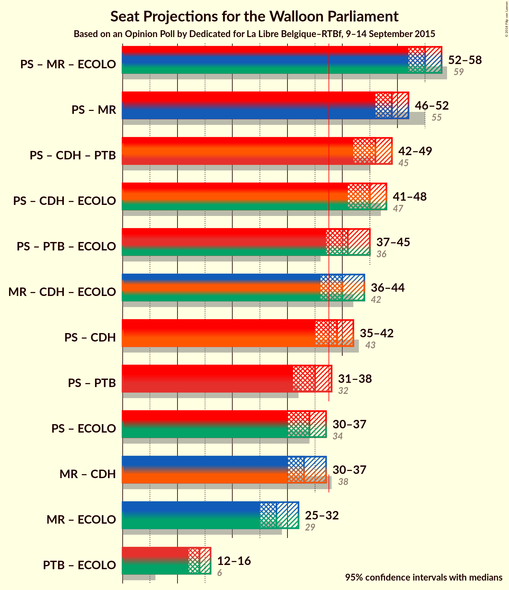

# Opinion Poll by Dedicated for La Libre Belgique–RTBf, 9–14 September 2015

<a href="#voting-intentions">Voting Intentions</a> | <a href="#seats">Seats</a> | <a href="#coalitions">Coalitions</a> | <a href="#technical-information">Technical Information</a>

## Voting Intentions

### Confidence Intervals

| Party | Last Result | Poll Result | 80% Confidence Interval | 90% Confidence Interval | 95% Confidence Interval | 99% Confidence Interval |
|:-----:|:-----------:|:-----------:|:-----------------------:|:-----------------------:|:-----------------------:|:-----------------------:|
| PS | 30.9% | 29.7% | 27.5–32.1% |26.8–32.8% |26.3–33.4% |25.3–34.5% |
| MR | 26.7% | 24.3% | 22.2–26.5% |21.6–27.2% |21.1–27.7% |20.1–28.8% |
| cdH | 15.2% | 13.5% | 11.9–15.4% |11.5–15.9% |11.1–16.4% |10.4–17.3% |
| PTB | 5.8% | 9.6% | 8.3–11.3% |7.9–11.8% |7.6–12.2% |7.0–13.0% |
| Ecolo | 8.6% | 9.2% | 7.9–10.8% |7.5–11.3% |7.2–11.7% |6.6–12.5% |
| Parti Populaire | 4.9% | 4.0% | 3.2–5.2% |3.0–5.6% |2.8–5.9% |2.4–6.5% |
| DéFI | 2.5% | 2.6% | 2.0–3.7% |1.8–3.9% |1.7–4.2% |1.4–4.7% |

*Note:* The poll result column reflects the actual value used in the calculations. Published results may vary slightly, and in addition be rounded to fewer digits.

## Seats

### Confidence Intervals

| Party | Last Result | Median | 80% Confidence Interval | 90% Confidence Interval | 95% Confidence Interval | 99% Confidence Interval |
|:-----:|:-----------:|:------:|:-----------------------:|:-----------------------:|:-----------------------:|:-----------------------:|
| <a href="#ps">PS</a> | 30 | 28 | 28 |28 |28 |25–30 |
| <a href="#mr">MR</a> | 25 | 21 | 21 |21 |21 |18–22 |
| <a href="#cdh">cdH</a> | 13 | 12 | 12 |12 |11–12 |9–15 |
| <a href="#ptb">PTB</a> | 2 | 8 | 8 |7–8 |7–8 |6–8 |
| <a href="#ecolo">Ecolo</a> | 4 | 6 | 6 |6 |4–6 |3–7 |
| <a href="#parti-populaire">Parti Populaire</a> | 1 | 0 | 0 |0 |0–4 |0–4 |
| <a href="#défi">DéFI</a> | 0 | 0 | 0 |0 |0 |0 |

### PS

*For a full overview of the results for this party, see the [PS](party-ps.html) page.*

| Number of Seats | Probability | Accumulated | Special Marks |
|:---------------:|:-----------:|:-----------:|:-------------:|
| 21 | 0.1% | 100% |  |
| 22 | 0% | 99.9% |  |
| 23 | 0% | 99.8% |  |
| 24 | 0% | 99.8% |  |
| 25 | 0.5% | 99.8% |  |
| 26 | 0% | 99.3% |  |
| 27 | 0.4% | 99.3% |  |
| 28 | 98% | 98.9% | Median |
| 29 | 0% | 0.9% |  |
| 30 | 0.5% | 0.8% | Last Result |
| 31 | 0.1% | 0.4% |  |
| 32 | 0.3% | 0.3% |  |
| 33 | 0% | 0% |  |

### MR

*For a full overview of the results for this party, see the [MR](party-mr.html) page.*

| Number of Seats | Probability | Accumulated | Special Marks |
|:---------------:|:-----------:|:-----------:|:-------------:|
| 18 | 0.6% | 100% |  |
| 19 | 0% | 99.4% |  |
| 20 | 0% | 99.4% |  |
| 21 | 97% | 99.4% | Median |
| 22 | 2% | 2% |  |
| 23 | 0.2% | 0.4% |  |
| 24 | 0% | 0.3% |  |
| 25 | 0.1% | 0.2% | Last Result |
| 26 | 0% | 0.1% |  |
| 27 | 0% | 0.1% |  |
| 28 | 0.1% | 0.1% |  |
| 29 | 0% | 0% |  |

### cdH

*For a full overview of the results for this party, see the [cdH](party-cdh.html) page.*

| Number of Seats | Probability | Accumulated | Special Marks |
|:---------------:|:-----------:|:-----------:|:-------------:|
| 9 | 0.5% | 100% |  |
| 10 | 0% | 99.5% |  |
| 11 | 3% | 99.5% |  |
| 12 | 95% | 96% | Median |
| 13 | 0.2% | 0.9% | Last Result |
| 14 | 0.1% | 0.6% |  |
| 15 | 0.1% | 0.6% |  |
| 16 | 0.5% | 0.5% |  |
| 17 | 0% | 0% |  |

### PTB

*For a full overview of the results for this party, see the [PTB](party-ptb.html) page.*

| Number of Seats | Probability | Accumulated | Special Marks |
|:---------------:|:-----------:|:-----------:|:-------------:|
| 2 | 0% | 100% | Last Result |
| 3 | 0% | 100% |  |
| 4 | 0% | 100% |  |
| 5 | 0.1% | 100% |  |
| 6 | 1.4% | 99.8% |  |
| 7 | 3% | 98% |  |
| 8 | 94% | 95% | Median |
| 9 | 0.5% | 0.5% |  |
| 10 | 0% | 0% |  |

### Ecolo

*For a full overview of the results for this party, see the [Ecolo](party-ecolo.html) page.*

| Number of Seats | Probability | Accumulated | Special Marks |
|:---------------:|:-----------:|:-----------:|:-------------:|
| 1 | 0.4% | 100% |  |
| 2 | 0% | 99.6% |  |
| 3 | 0.6% | 99.6% |  |
| 4 | 3% | 99.0% | Last Result |
| 5 | 0.5% | 96% |  |
| 6 | 95% | 95% | Median |
| 7 | 0.6% | 0.7% |  |
| 8 | 0% | 0.1% |  |
| 9 | 0% | 0.1% |  |
| 10 | 0% | 0.1% |  |
| 11 | 0% | 0.1% |  |
| 12 | 0.1% | 0.1% |  |
| 13 | 0% | 0% |  |

### Parti Populaire

*For a full overview of the results for this party, see the [Parti Populaire](party-partipopulaire.html) page.*

| Number of Seats | Probability | Accumulated | Special Marks |
|:---------------:|:-----------:|:-----------:|:-------------:|
| 0 | 96% | 100% | Median |
| 1 | 0% | 4% | Last Result |
| 2 | 0% | 4% |  |
| 3 | 0.5% | 4% |  |
| 4 | 4% | 4% |  |
| 5 | 0% | 0% |  |

### DéFI

*For a full overview of the results for this party, see the [DéFI](party-défi.html) page.*

| Number of Seats | Probability | Accumulated | Special Marks |
|:---------------:|:-----------:|:-----------:|:-------------:|
| 0 | 99.9% | 100% | Last Result, Median |
| 1 | 0% | 0.1% |  |
| 2 | 0% | 0% |  |

## Coalitions

### Confidence Intervals

| Coalition | Last Result | Median | Majority? | 80% Confidence Interval | 90% Confidence Interval | 95% Confidence Interval | 99% Confidence Interval |
|:---------:|:-----------:|:------:|:---------:|:-----------------------:|:-----------------------:|:-----------------------:|:-----------------------:|
| PS – MR – Ecolo | 59 | 55 | 100% | 55 | 55 | 53–55 | 52–57 |
| PS – MR | 55 | 49 | 100% | 49 | 49 | 49 | 45–52 |
| PS – cdH – PTB | 45 | 48 | 100% | 48 | 48 | 46–48 | 45–50 |
| PS – cdH – Ecolo | 47 | 46 | 100% | 46 | 46 | 43–46 | 43–48 |
| PS – PTB – Ecolo | 36 | 42 | 99.8% | 42 | 41–42 | 39–42 | 38–42 |
| PS – cdH | 43 | 40 | 99.8% | 40 | 40 | 39–40 | 39–41 |
| MR – cdH – Ecolo | 42 | 39 | 95% | 39 | 39 | 36–39 | 36–41 |
| PS – PTB | 32 | 36 | 0.3% | 36 | 36 | 35–36 | 34–36 |
| PS – Ecolo | 34 | 34 | 0.1% | 34 | 34 | 32–34 | 31–35 |
| MR – cdH | 38 | 33 | 0.2% | 33 | 33 | 32–33 | 31–35 |
| MR – Ecolo | 29 | 27 | 0% | 27 | 27 | 25–27 | 24–28 |
| PTB – Ecolo | 6 | 14 | 0% | 14 | 14 | 11–14 | 10–16 |

### PS – MR – Ecolo

| Number of Seats | Probability | Accumulated | Special Marks |
|:---------------:|:-----------:|:-----------:|:-------------:|
| 50 | 0.5% | 100% |  |
| 51 | 0% | 99.5% |  |
| 52 | 1.1% | 99.5% |  |
| 53 | 2% | 98% |  |
| 54 | 0.9% | 96% |  |
| 55 | 95% | 96% | Median |
| 56 | 0.2% | 1.0% |  |
| 57 | 0.7% | 0.8% |  |
| 58 | 0.1% | 0.1% |  |
| 59 | 0% | 0% | Last Result |

### PS – MR

| Number of Seats | Probability | Accumulated | Special Marks |
|:---------------:|:-----------:|:-----------:|:-------------:|
| 43 | 0.5% | 100% |  |
| 44 | 0% | 99.5% |  |
| 45 | 0% | 99.5% |  |
| 46 | 0.2% | 99.5% |  |
| 47 | 0% | 99.3% |  |
| 48 | 0.4% | 99.3% |  |
| 49 | 97% | 98.9% | Median |
| 50 | 1.0% | 2% |  |
| 51 | 0.2% | 1.0% |  |
| 52 | 0.5% | 0.8% |  |
| 53 | 0.1% | 0.4% |  |
| 54 | 0.2% | 0.3% |  |
| 55 | 0% | 0.1% | Last Result |
| 56 | 0.1% | 0.1% |  |
| 57 | 0% | 0% |  |

### PS – cdH – PTB

| Number of Seats | Probability | Accumulated | Special Marks |
|:---------------:|:-----------:|:-----------:|:-------------:|
| 40 | 0% | 100% |  |
| 41 | 0.1% | 99.9% |  |
| 42 | 0% | 99.8% |  |
| 43 | 0.1% | 99.8% |  |
| 44 | 0% | 99.8% |  |
| 45 | 1.4% | 99.8% | Last Result |
| 46 | 3% | 98% |  |
| 47 | 0.8% | 96% |  |
| 48 | 94% | 95% | Median |
| 49 | 0.1% | 0.9% |  |
| 50 | 0.5% | 0.8% |  |
| 51 | 0% | 0.3% |  |
| 52 | 0.2% | 0.3% |  |
| 53 | 0.1% | 0.1% |  |
| 54 | 0% | 0% |  |

### PS – cdH – Ecolo

| Number of Seats | Probability | Accumulated | Special Marks |
|:---------------:|:-----------:|:-----------:|:-------------:|
| 39 | 0.1% | 100% |  |
| 40 | 0% | 99.9% |  |
| 41 | 0% | 99.9% |  |
| 42 | 0% | 99.8% |  |
| 43 | 4% | 99.8% |  |
| 44 | 0.5% | 96% |  |
| 45 | 0.3% | 95% |  |
| 46 | 94% | 95% | Median |
| 47 | 0.1% | 0.7% | Last Result |
| 48 | 0.5% | 0.6% |  |
| 49 | 0% | 0.1% |  |
| 50 | 0% | 0.1% |  |
| 51 | 0% | 0.1% |  |
| 52 | 0.1% | 0.1% |  |
| 53 | 0% | 0% |  |

### PS – PTB – Ecolo

| Number of Seats | Probability | Accumulated | Special Marks |
|:---------------:|:-----------:|:-----------:|:-------------:|
| 35 | 0.1% | 100% |  |
| 36 | 0% | 99.8% | Last Result |
| 37 | 0% | 99.8% |  |
| 38 | 2% | 99.8% | Majority |
| 39 | 2% | 98% |  |
| 40 | 0.3% | 96% |  |
| 41 | 1.1% | 96% |  |
| 42 | 94% | 94% | Median |
| 43 | 0% | 0.1% |  |
| 44 | 0% | 0.1% |  |
| 45 | 0.1% | 0.1% |  |
| 46 | 0% | 0% |  |

### PS – cdH

| Number of Seats | Probability | Accumulated | Special Marks |
|:---------------:|:-----------:|:-----------:|:-------------:|
| 33 | 0.1% | 100% |  |
| 34 | 0% | 99.9% |  |
| 35 | 0% | 99.8% |  |
| 36 | 0% | 99.8% |  |
| 37 | 0% | 99.8% |  |
| 38 | 0% | 99.8% | Majority |
| 39 | 4% | 99.8% |  |
| 40 | 95% | 96% | Median |
| 41 | 0.5% | 0.9% |  |
| 42 | 0% | 0.4% |  |
| 43 | 0.1% | 0.4% | Last Result |
| 44 | 0% | 0.3% |  |
| 45 | 0.2% | 0.3% |  |
| 46 | 0.1% | 0.1% |  |
| 47 | 0% | 0% |  |

### MR – cdH – Ecolo

| Number of Seats | Probability | Accumulated | Special Marks |
|:---------------:|:-----------:|:-----------:|:-------------:|
| 36 | 3% | 100% |  |
| 37 | 1.3% | 97% |  |
| 38 | 0.1% | 95% | Majority |
| 39 | 94% | 95% | Median |
| 40 | 0.1% | 0.9% |  |
| 41 | 0.5% | 0.8% |  |
| 42 | 0.1% | 0.3% | Last Result |
| 43 | 0% | 0.2% |  |
| 44 | 0% | 0.2% |  |
| 45 | 0% | 0.2% |  |
| 46 | 0.1% | 0.2% |  |
| 47 | 0% | 0.1% |  |
| 48 | 0% | 0% |  |

### PS – PTB

| Number of Seats | Probability | Accumulated | Special Marks |
|:---------------:|:-----------:|:-----------:|:-------------:|
| 28 | 0.1% | 100% |  |
| 29 | 0.1% | 99.9% |  |
| 30 | 0% | 99.8% |  |
| 31 | 0% | 99.8% |  |
| 32 | 0% | 99.8% | Last Result |
| 33 | 0.1% | 99.8% |  |
| 34 | 2% | 99.7% |  |
| 35 | 3% | 98% |  |
| 36 | 95% | 95% | Median |
| 37 | 0.1% | 0.4% |  |
| 38 | 0% | 0.3% | Majority |
| 39 | 0.3% | 0.3% |  |
| 40 | 0% | 0% |  |

### PS – Ecolo

| Number of Seats | Probability | Accumulated | Special Marks |
|:---------------:|:-----------:|:-----------:|:-------------:|
| 27 | 0.1% | 100% |  |
| 28 | 0% | 99.9% |  |
| 29 | 0% | 99.9% |  |
| 30 | 0% | 99.9% |  |
| 31 | 1.1% | 99.9% |  |
| 32 | 3% | 98.8% |  |
| 33 | 0.3% | 95% |  |
| 34 | 95% | 95% | Last Result, Median |
| 35 | 0.5% | 0.6% |  |
| 36 | 0% | 0.1% |  |
| 37 | 0% | 0.1% |  |
| 38 | 0% | 0.1% | Majority |
| 39 | 0% | 0.1% |  |
| 40 | 0.1% | 0.1% |  |
| 41 | 0% | 0% |  |

### MR – cdH

| Number of Seats | Probability | Accumulated | Special Marks |
|:---------------:|:-----------:|:-----------:|:-------------:|
| 30 | 0.1% | 100% |  |
| 31 | 0.5% | 99.9% |  |
| 32 | 2% | 99.4% |  |
| 33 | 96% | 97% | Median |
| 34 | 0.6% | 1.2% |  |
| 35 | 0.3% | 0.6% |  |
| 36 | 0% | 0.3% |  |
| 37 | 0.1% | 0.2% |  |
| 38 | 0% | 0.2% | Last Result, Majority |
| 39 | 0% | 0.2% |  |
| 40 | 0.1% | 0.1% |  |
| 41 | 0% | 0% |  |

### MR – Ecolo

| Number of Seats | Probability | Accumulated | Special Marks |
|:---------------:|:-----------:|:-----------:|:-------------:|
| 22 | 0.1% | 100% |  |
| 23 | 0.2% | 99.9% |  |
| 24 | 0.6% | 99.7% |  |
| 25 | 3% | 99.1% |  |
| 26 | 0.9% | 96% |  |
| 27 | 95% | 95% | Median |
| 28 | 0.2% | 0.6% |  |
| 29 | 0.2% | 0.5% | Last Result |
| 30 | 0.1% | 0.3% |  |
| 31 | 0% | 0.2% |  |
| 32 | 0.1% | 0.2% |  |
| 33 | 0% | 0.1% |  |
| 34 | 0.1% | 0.1% |  |
| 35 | 0% | 0% |  |

### PTB – Ecolo

| Number of Seats | Probability | Accumulated | Special Marks |
|:---------------:|:-----------:|:-----------:|:-------------:|
| 6 | 0% | 100% | Last Result |
| 7 | 0.1% | 100% |  |
| 8 | 0.3% | 99.9% |  |
| 9 | 0% | 99.6% |  |
| 10 | 1.4% | 99.6% |  |
| 11 | 3% | 98% |  |
| 12 | 0% | 95% |  |
| 13 | 0.2% | 95% |  |
| 14 | 95% | 95% | Median |
| 15 | 0% | 0.6% |  |
| 16 | 0.5% | 0.6% |  |
| 17 | 0.1% | 0.1% |  |
| 18 | 0% | 0% |  |

## Technical Information

### Opinion Poll

+ **Polling firm:** Dedicated
+ **Commissioner(s):** La Libre Belgique–RTBf
+ **Fieldwork period:** 9–14 September 2015

### Calculations

+ **Sample size:** 643
+ **Simulations done:** 1,024
+ **Error estimate:** 5.27%

