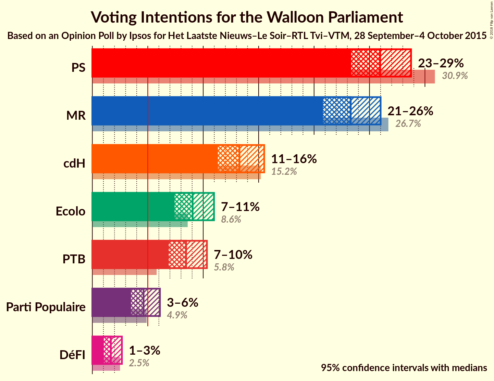
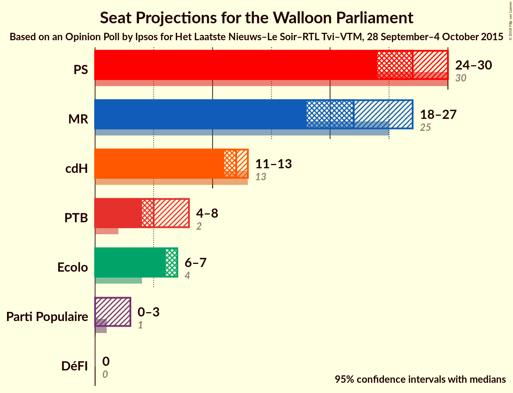
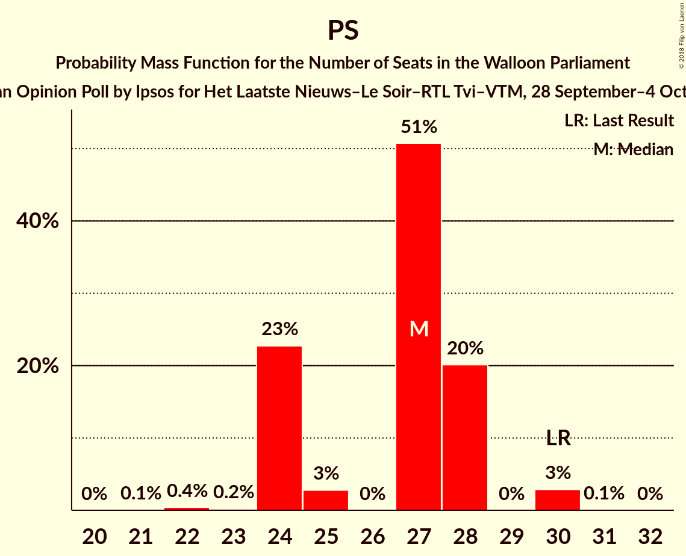
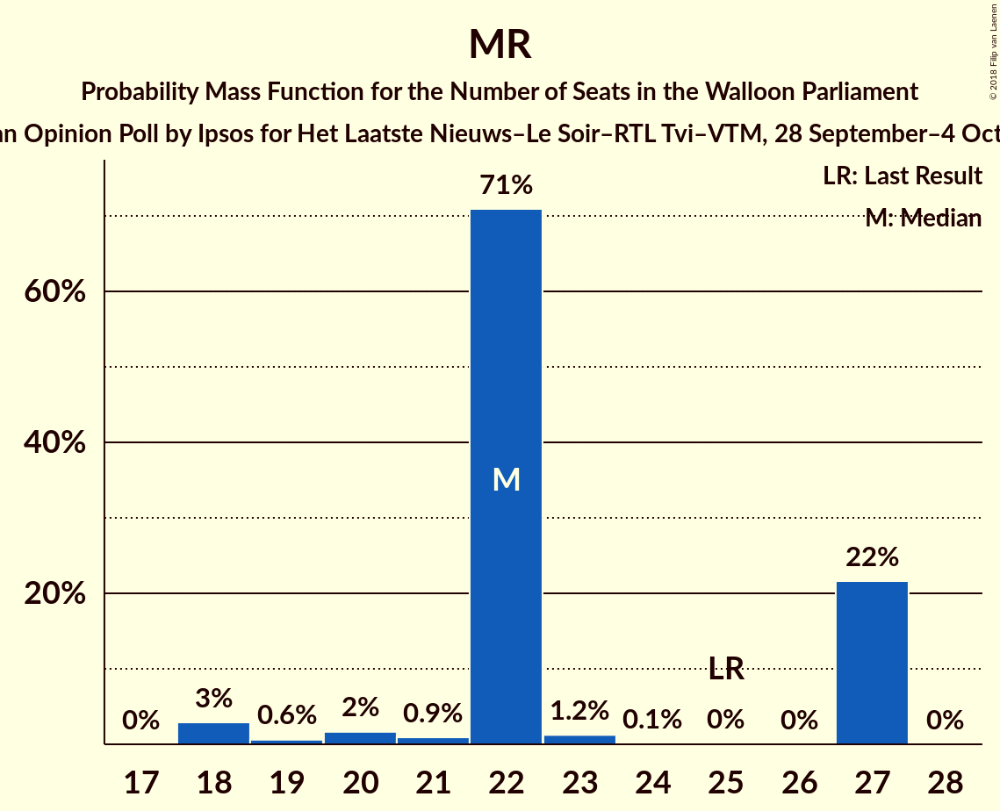
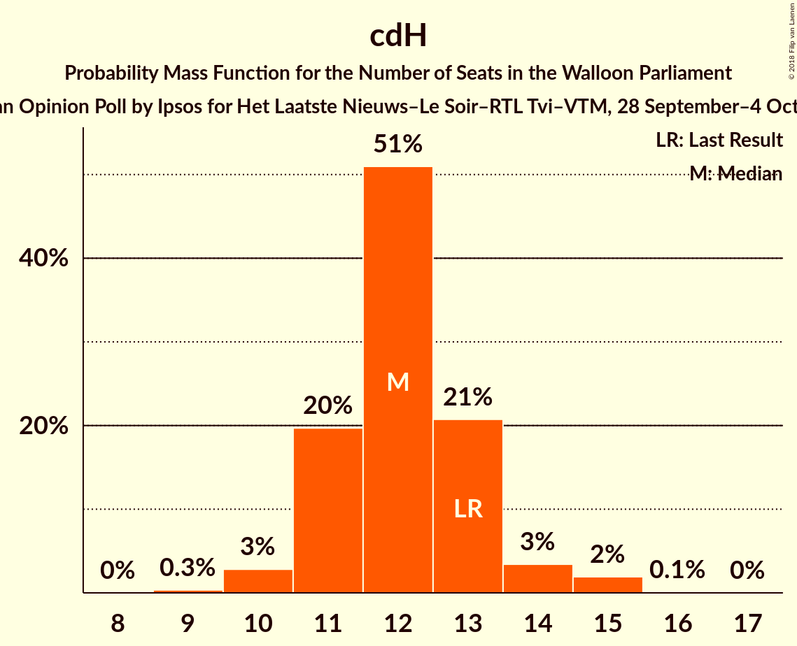
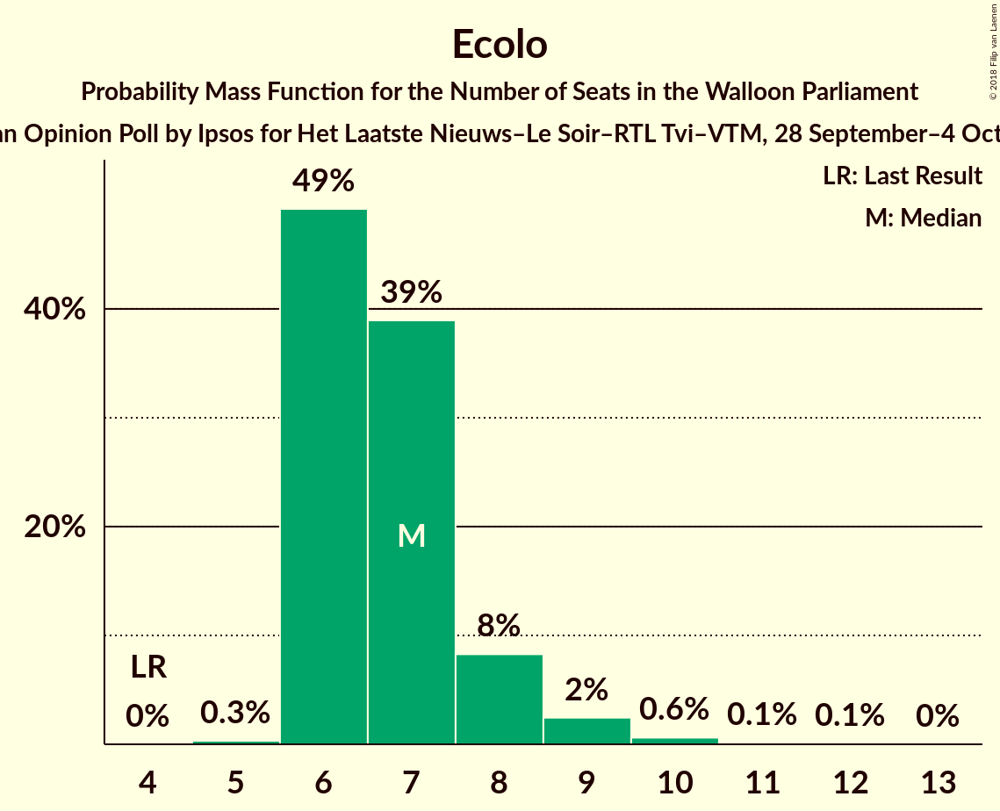
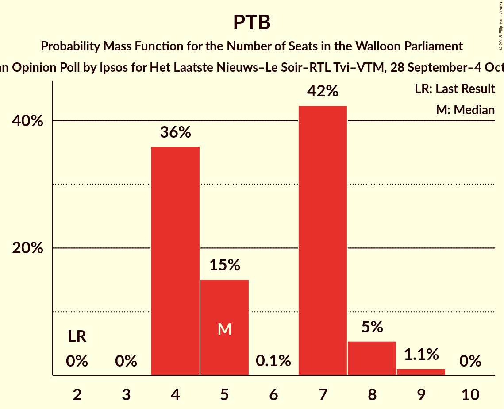
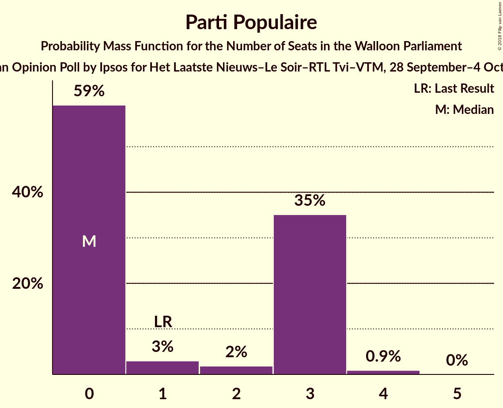
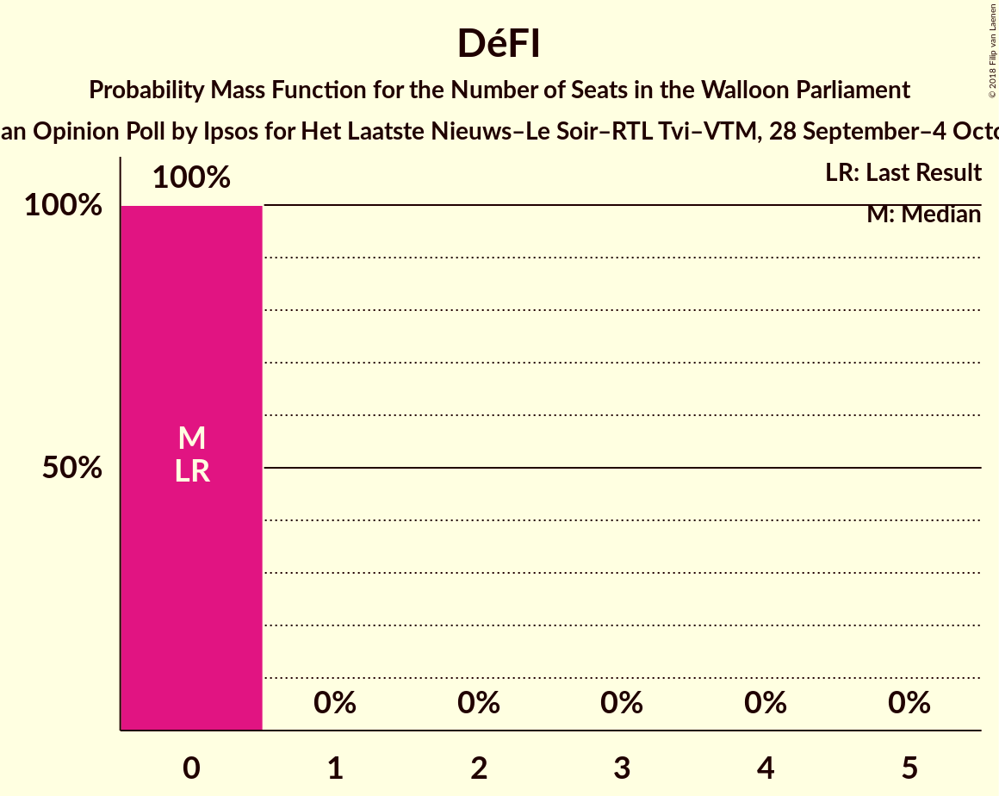
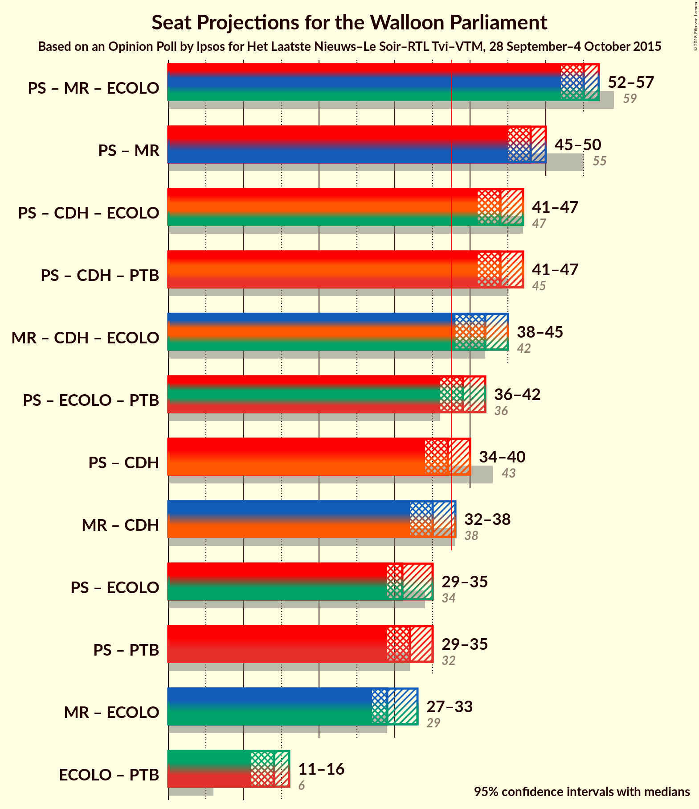

# Opinion Poll by Ipsos for Het Laatste Nieuws–Le Soir–RTL Tvi–VTM, 28 September–4 October 2015

<a href="#voting-intentions">Voting Intentions</a> | <a href="#seats">Seats</a> | <a href="#coalitions">Coalitions</a> | <a href="#technical-information">Technical Information</a>

## Voting Intentions

### Confidence Intervals

| Party | Last Result | Poll Result | 80% Confidence Interval | 90% Confidence Interval | 95% Confidence Interval | 99% Confidence Interval |
|:-----:|:-----------:|:-----------:|:-----------------------:|:-----------------------:|:-----------------------:|:-----------------------:|
| PS | 30.9% | 26.0% | 24.2–27.8% |23.8–28.3% |23.4–28.7% |22.6–29.6% |
| MR | 26.7% | 23.3% | 21.7–25.1% |21.2–25.6% |20.8–26.0% |20.0–26.9% |
| cdH | 15.2% | 13.3% | 12.0–14.7% |11.6–15.2% |11.3–15.5% |10.7–16.2% |
| Ecolo | 8.6% | 9.0% | 8.0–10.3% |7.7–10.7% |7.4–11.0% |7.0–11.6% |
| PTB | 5.8% | 8.5% | 7.4–9.7% |7.1–10.0% |6.9–10.3% |6.4–10.9% |
| Parti Populaire | 4.9% | 4.6% | 3.9–5.6% |3.7–5.9% |3.5–6.1% |3.2–6.6% |
| DéFI | 2.5% | 1.7% | 1.2–2.3% |1.1–2.5% |1.0–2.7% |0.9–3.0% |

*Note:* The poll result column reflects the actual value used in the calculations. Published results may vary slightly, and in addition be rounded to fewer digits.

## Seats

### Confidence Intervals

| Party | Last Result | Median | 80% Confidence Interval | 90% Confidence Interval | 95% Confidence Interval | 99% Confidence Interval |
|:-----:|:-----------:|:------:|:-----------------------:|:-----------------------:|:-----------------------:|:-----------------------:|
| <a href="#ps">PS</a> | 30 | 25 | 24–27 |23–28 |22–28 |21–29 |
| <a href="#mr">MR</a> | 25 | 23 | 21–25 |21–25 |20–26 |19–26 |
| <a href="#cdh">cdH</a> | 13 | 12 | 11–13 |11–14 |10–14 |10–15 |
| <a href="#ecolo">Ecolo</a> | 4 | 6 | 6–8 |6–8 |6–9 |6–10 |
| <a href="#ptb">PTB</a> | 2 | 7 | 6–8 |6–8 |5–8 |4–9 |
| <a href="#parti-populaire">Parti Populaire</a> | 1 | 2 | 0–3 |0–3 |0–4 |0–4 |
| <a href="#défi">DéFI</a> | 0 | 0 | 0 |0 |0 |0 |

### PS

*For a full overview of the results for this party, see the [PS](party-ps.html) page.*

| Number of Seats | Probability | Accumulated | Special Marks |
|:---------------:|:-----------:|:-----------:|:-------------:|
| 21 | 1.5% | 100% |  |
| 22 | 2% | 98% |  |
| 23 | 4% | 96% |  |
| 24 | 27% | 92% |  |
| 25 | 40% | 65% | Median |
| 26 | 11% | 25% |  |
| 27 | 5% | 14% |  |
| 28 | 8% | 9% |  |
| 29 | 0.9% | 1.0% |  |
| 30 | 0.1% | 0.1% | Last Result |
| 31 | 0% | 0% |  |

### MR

*For a full overview of the results for this party, see the [MR](party-mr.html) page.*

| Number of Seats | Probability | Accumulated | Special Marks |
|:---------------:|:-----------:|:-----------:|:-------------:|
| 18 | 0.1% | 100% |  |
| 19 | 0.4% | 99.9% |  |
| 20 | 2% | 99.5% |  |
| 21 | 17% | 97% |  |
| 22 | 27% | 80% |  |
| 23 | 21% | 53% | Median |
| 24 | 21% | 31% |  |
| 25 | 6% | 10% | Last Result |
| 26 | 4% | 4% |  |
| 27 | 0.3% | 0.3% |  |
| 28 | 0% | 0% |  |

### cdH

*For a full overview of the results for this party, see the [cdH](party-cdh.html) page.*

| Number of Seats | Probability | Accumulated | Special Marks |
|:---------------:|:-----------:|:-----------:|:-------------:|
| 9 | 0.3% | 100% |  |
| 10 | 3% | 99.6% |  |
| 11 | 20% | 97% |  |
| 12 | 51% | 77% | Median |
| 13 | 21% | 26% | Last Result |
| 14 | 3% | 5% |  |
| 15 | 2% | 2% |  |
| 16 | 0.1% | 0.1% |  |
| 17 | 0% | 0% |  |

### Ecolo

*For a full overview of the results for this party, see the [Ecolo](party-ecolo.html) page.*

| Number of Seats | Probability | Accumulated | Special Marks |
|:---------------:|:-----------:|:-----------:|:-------------:|
| 4 | 0% | 100% | Last Result |
| 5 | 0.4% | 100% |  |
| 6 | 51% | 99.6% | Median |
| 7 | 37% | 49% |  |
| 8 | 8% | 12% |  |
| 9 | 3% | 4% |  |
| 10 | 0.6% | 0.8% |  |
| 11 | 0.1% | 0.2% |  |
| 12 | 0.1% | 0.1% |  |
| 13 | 0% | 0% |  |

### PTB

*For a full overview of the results for this party, see the [PTB](party-ptb.html) page.*

| Number of Seats | Probability | Accumulated | Special Marks |
|:---------------:|:-----------:|:-----------:|:-------------:|
| 2 | 0% | 100% | Last Result |
| 3 | 0% | 100% |  |
| 4 | 2% | 100% |  |
| 5 | 2% | 98% |  |
| 6 | 15% | 96% |  |
| 7 | 59% | 81% | Median |
| 8 | 20% | 22% |  |
| 9 | 2% | 2% |  |
| 10 | 0.1% | 0.1% |  |
| 11 | 0% | 0% |  |

### Parti Populaire

*For a full overview of the results for this party, see the [Parti Populaire](party-partipopulaire.html) page.*

| Number of Seats | Probability | Accumulated | Special Marks |
|:---------------:|:-----------:|:-----------:|:-------------:|
| 0 | 20% | 100% |  |
| 1 | 29% | 80% | Last Result |
| 2 | 34% | 50% | Median |
| 3 | 11% | 16% |  |
| 4 | 5% | 5% |  |
| 5 | 0.4% | 0.4% |  |
| 6 | 0% | 0% |  |

### DéFI

*For a full overview of the results for this party, see the [DéFI](party-défi.html) page.*

| Number of Seats | Probability | Accumulated | Special Marks |
|:---------------:|:-----------:|:-----------:|:-------------:|
| 0 | 100% | 100% | Last Result, Median |

## Coalitions

### Confidence Intervals

| Coalition | Last Result | Median | Majority? | 80% Confidence Interval | 90% Confidence Interval | 95% Confidence Interval | 99% Confidence Interval |
|:---------:|:-----------:|:------:|:---------:|:-----------------------:|:-----------------------:|:-----------------------:|:-----------------------:|
| PS – MR – Ecolo | 59 | 55 | 100% | 53–56 | 52–57 | 52–57 | 51–58 |
| PS – MR | 55 | 48 | 100% | 46–49 | 45–50 | 45–50 | 44–52 |
| PS – cdH – Ecolo | 47 | 44 | 100% | 42–46 | 41–46 | 41–47 | 39–48 |
| PS – cdH – PTB | 45 | 44 | 100% | 42–46 | 42–46 | 41–47 | 40–48 |
| MR – cdH – Ecolo | 42 | 42 | 99.6% | 39–43 | 39–44 | 38–45 | 38–46 |
| PS – Ecolo – PTB | 36 | 39 | 80% | 37–41 | 36–41 | 36–42 | 34–43 |
| PS – cdH | 43 | 37 | 34% | 35–39 | 35–40 | 34–40 | 33–41 |
| MR – cdH | 38 | 35 | 4% | 33–36 | 32–37 | 32–38 | 31–39 |
| PS – Ecolo | 34 | 31 | 0% | 30–34 | 29–34 | 29–35 | 27–36 |
| PS – PTB | 32 | 32 | 0% | 30–34 | 30–35 | 29–35 | 28–36 |
| MR – Ecolo | 29 | 29 | 0% | 27–31 | 27–32 | 27–33 | 26–34 |
| Ecolo – PTB | 6 | 14 | 0% | 12–15 | 12–15 | 11–16 | 10–17 |

### PS – MR – Ecolo

| Number of Seats | Probability | Accumulated | Special Marks |
|:---------------:|:-----------:|:-----------:|:-------------:|
| 50 | 0.2% | 100% |  |
| 51 | 2% | 99.8% |  |
| 52 | 7% | 98% |  |
| 53 | 17% | 91% |  |
| 54 | 22% | 74% | Median |
| 55 | 32% | 52% |  |
| 56 | 13% | 20% |  |
| 57 | 5% | 7% |  |
| 58 | 0.9% | 1.2% |  |
| 59 | 0.2% | 0.3% | Last Result |
| 60 | 0% | 0% |  |

### PS – MR

| Number of Seats | Probability | Accumulated | Special Marks |
|:---------------:|:-----------:|:-----------:|:-------------:|
| 42 | 0% | 100% |  |
| 43 | 0.3% | 99.9% |  |
| 44 | 1.0% | 99.7% |  |
| 45 | 6% | 98.7% |  |
| 46 | 12% | 93% |  |
| 47 | 21% | 80% |  |
| 48 | 25% | 59% | Median |
| 49 | 25% | 34% |  |
| 50 | 7% | 9% |  |
| 51 | 2% | 2% |  |
| 52 | 0.4% | 0.6% |  |
| 53 | 0.1% | 0.1% |  |
| 54 | 0% | 0% |  |
| 55 | 0% | 0% | Last Result |

### PS – cdH – Ecolo

| Number of Seats | Probability | Accumulated | Special Marks |
|:---------------:|:-----------:|:-----------:|:-------------:|
| 38 | 0.1% | 100% | Majority |
| 39 | 0.6% | 99.9% |  |
| 40 | 1.5% | 99.3% |  |
| 41 | 6% | 98% |  |
| 42 | 14% | 92% |  |
| 43 | 22% | 78% | Median |
| 44 | 26% | 57% |  |
| 45 | 18% | 31% |  |
| 46 | 9% | 13% |  |
| 47 | 3% | 4% | Last Result |
| 48 | 0.7% | 0.9% |  |
| 49 | 0.2% | 0.2% |  |
| 50 | 0% | 0% |  |

### PS – cdH – PTB

| Number of Seats | Probability | Accumulated | Special Marks |
|:---------------:|:-----------:|:-----------:|:-------------:|
| 39 | 0.3% | 100% |  |
| 40 | 1.4% | 99.7% |  |
| 41 | 3% | 98% |  |
| 42 | 11% | 95% |  |
| 43 | 19% | 84% |  |
| 44 | 27% | 66% | Median |
| 45 | 19% | 39% | Last Result |
| 46 | 15% | 20% |  |
| 47 | 4% | 5% |  |
| 48 | 0.8% | 0.9% |  |
| 49 | 0.1% | 0.1% |  |
| 50 | 0% | 0% |  |

### MR – cdH – Ecolo

| Number of Seats | Probability | Accumulated | Special Marks |
|:---------------:|:-----------:|:-----------:|:-------------:|
| 36 | 0.1% | 100% |  |
| 37 | 0.3% | 99.9% |  |
| 38 | 2% | 99.6% | Majority |
| 39 | 9% | 97% |  |
| 40 | 13% | 89% |  |
| 41 | 20% | 75% | Median |
| 42 | 34% | 55% | Last Result |
| 43 | 14% | 21% |  |
| 44 | 4% | 7% |  |
| 45 | 2% | 3% |  |
| 46 | 0.5% | 0.7% |  |
| 47 | 0.1% | 0.2% |  |
| 48 | 0% | 0% |  |

### PS – Ecolo – PTB

| Number of Seats | Probability | Accumulated | Special Marks |
|:---------------:|:-----------:|:-----------:|:-------------:|
| 33 | 0.1% | 100% |  |
| 34 | 0.4% | 99.9% |  |
| 35 | 2% | 99.5% |  |
| 36 | 6% | 98% | Last Result |
| 37 | 11% | 92% |  |
| 38 | 26% | 80% | Median, Majority |
| 39 | 28% | 54% |  |
| 40 | 15% | 26% |  |
| 41 | 8% | 11% |  |
| 42 | 3% | 4% |  |
| 43 | 0.6% | 0.7% |  |
| 44 | 0.1% | 0.1% |  |
| 45 | 0% | 0% |  |

### PS – cdH

| Number of Seats | Probability | Accumulated | Special Marks |
|:---------------:|:-----------:|:-----------:|:-------------:|
| 32 | 0.3% | 100% |  |
| 33 | 1.5% | 99.7% |  |
| 34 | 3% | 98% |  |
| 35 | 7% | 96% |  |
| 36 | 21% | 88% |  |
| 37 | 32% | 67% | Median |
| 38 | 18% | 34% | Majority |
| 39 | 9% | 17% |  |
| 40 | 6% | 7% |  |
| 41 | 1.2% | 1.4% |  |
| 42 | 0.2% | 0.2% |  |
| 43 | 0% | 0% | Last Result |

### MR – cdH

| Number of Seats | Probability | Accumulated | Special Marks |
|:---------------:|:-----------:|:-----------:|:-------------:|
| 30 | 0.3% | 100% |  |
| 31 | 1.0% | 99.7% |  |
| 32 | 4% | 98.7% |  |
| 33 | 14% | 95% |  |
| 34 | 21% | 81% |  |
| 35 | 25% | 60% | Median |
| 36 | 25% | 35% |  |
| 37 | 6% | 9% |  |
| 38 | 3% | 4% | Last Result, Majority |
| 39 | 0.7% | 0.9% |  |
| 40 | 0.2% | 0.2% |  |
| 41 | 0% | 0% |  |

### PS – Ecolo

| Number of Seats | Probability | Accumulated | Special Marks |
|:---------------:|:-----------:|:-----------:|:-------------:|
| 27 | 0.5% | 100% |  |
| 28 | 1.1% | 99.5% |  |
| 29 | 4% | 98% |  |
| 30 | 15% | 95% |  |
| 31 | 29% | 79% | Median |
| 32 | 24% | 50% |  |
| 33 | 13% | 26% |  |
| 34 | 9% | 13% | Last Result |
| 35 | 3% | 4% |  |
| 36 | 0.7% | 0.9% |  |
| 37 | 0.2% | 0.2% |  |
| 38 | 0% | 0% | Majority |

### PS – PTB

| Number of Seats | Probability | Accumulated | Special Marks |
|:---------------:|:-----------:|:-----------:|:-------------:|
| 27 | 0.3% | 100% |  |
| 28 | 1.3% | 99.6% |  |
| 29 | 2% | 98% |  |
| 30 | 9% | 96% |  |
| 31 | 24% | 87% |  |
| 32 | 31% | 63% | Last Result, Median |
| 33 | 16% | 33% |  |
| 34 | 11% | 16% |  |
| 35 | 4% | 6% |  |
| 36 | 1.0% | 1.2% |  |
| 37 | 0.2% | 0.2% |  |
| 38 | 0% | 0% | Majority |

### MR – Ecolo

| Number of Seats | Probability | Accumulated | Special Marks |
|:---------------:|:-----------:|:-----------:|:-------------:|
| 25 | 0.1% | 100% |  |
| 26 | 0.7% | 99.8% |  |
| 27 | 9% | 99.2% |  |
| 28 | 19% | 90% |  |
| 29 | 20% | 70% | Last Result, Median |
| 30 | 30% | 50% |  |
| 31 | 11% | 20% |  |
| 32 | 6% | 9% |  |
| 33 | 2% | 3% |  |
| 34 | 0.5% | 0.6% |  |
| 35 | 0.1% | 0.1% |  |
| 36 | 0% | 0% |  |

### Ecolo – PTB

| Number of Seats | Probability | Accumulated | Special Marks |
|:---------------:|:-----------:|:-----------:|:-------------:|
| 6 | 0% | 100% | Last Result |
| 7 | 0% | 100% |  |
| 8 | 0% | 100% |  |
| 9 | 0% | 100% |  |
| 10 | 0.6% | 100% |  |
| 11 | 2% | 99.4% |  |
| 12 | 9% | 97% |  |
| 13 | 29% | 89% | Median |
| 14 | 46% | 60% |  |
| 15 | 9% | 13% |  |
| 16 | 4% | 5% |  |
| 17 | 0.6% | 1.0% |  |
| 18 | 0.3% | 0.4% |  |
| 19 | 0.1% | 0.1% |  |
| 20 | 0% | 0% |  |

## Technical Information

### Opinion Poll

+ **Polling firm:** Ipsos
+ **Commissioner(s):** Het Laatste Nieuws–Le Soir–RTL Tvi–VTM
+ **Fieldwork period:** 28 September–4 October 2015

### Calculations

+ **Sample size:** 1017
+ **Simulations done:** 2,097,152
+ **Error estimate:** 1.13%

