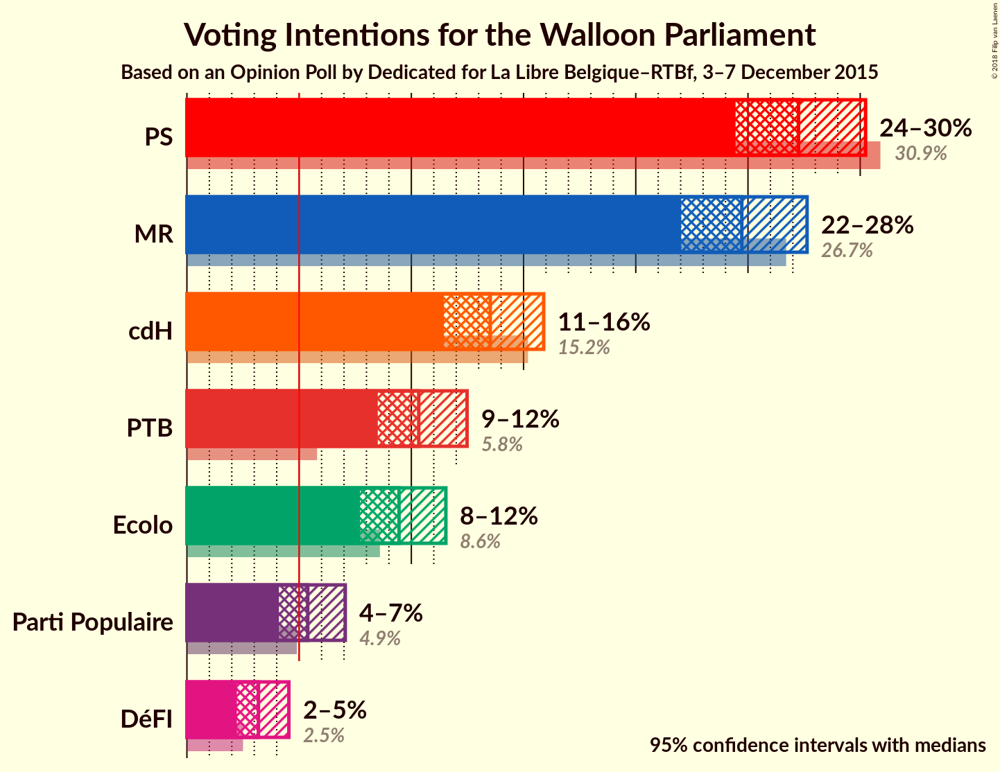
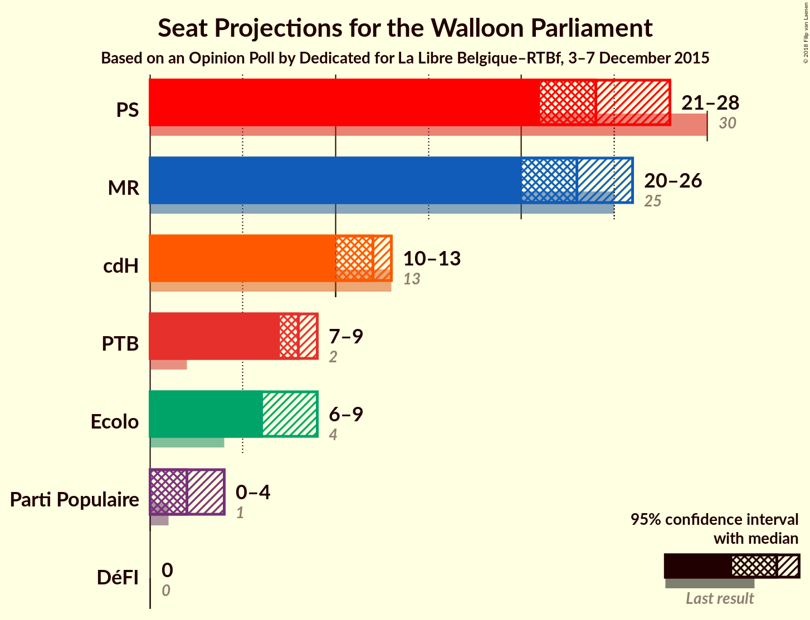
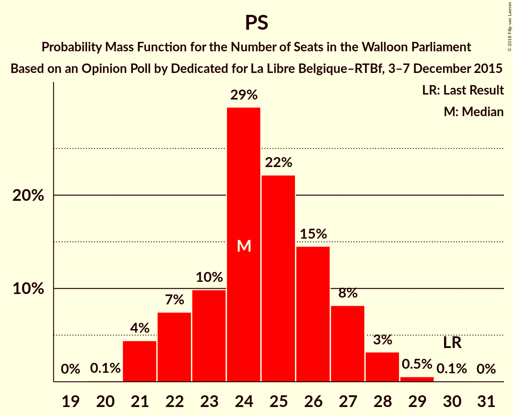
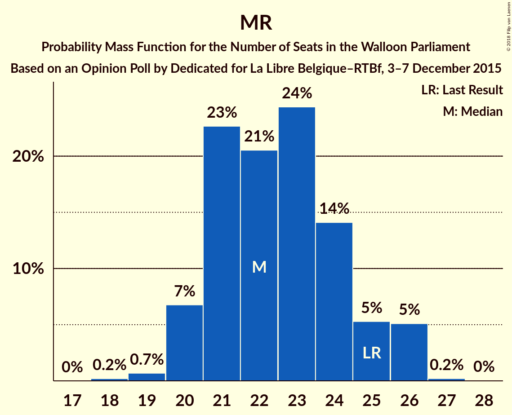
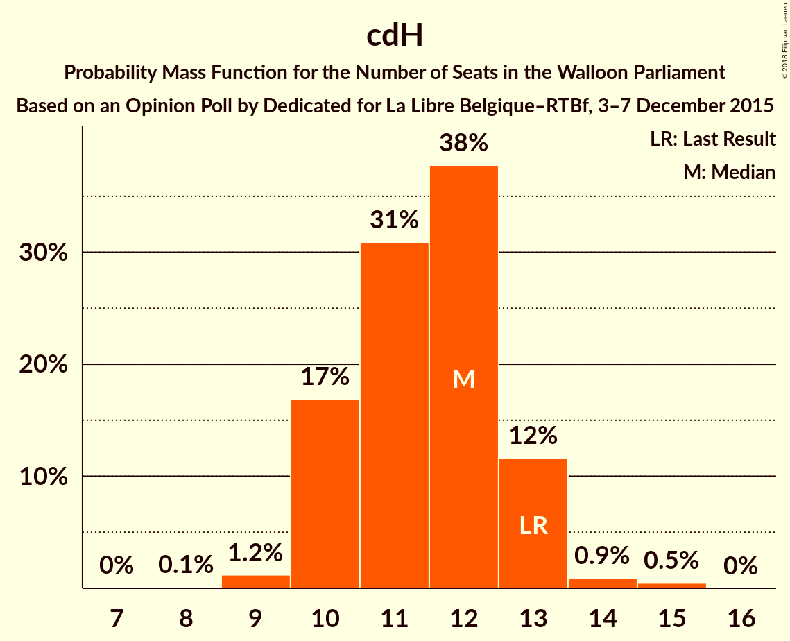
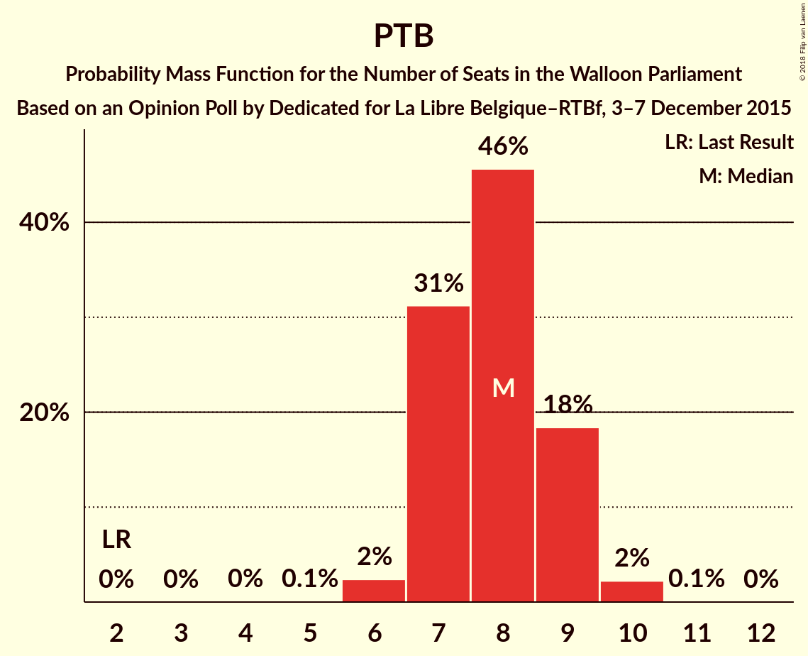
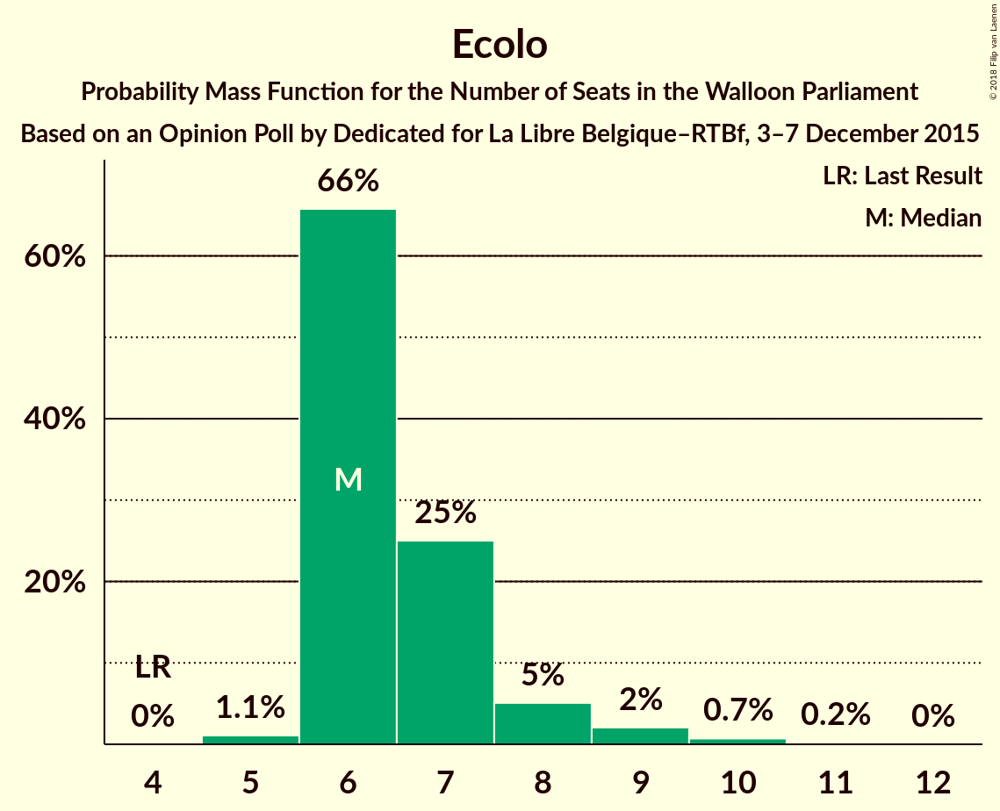
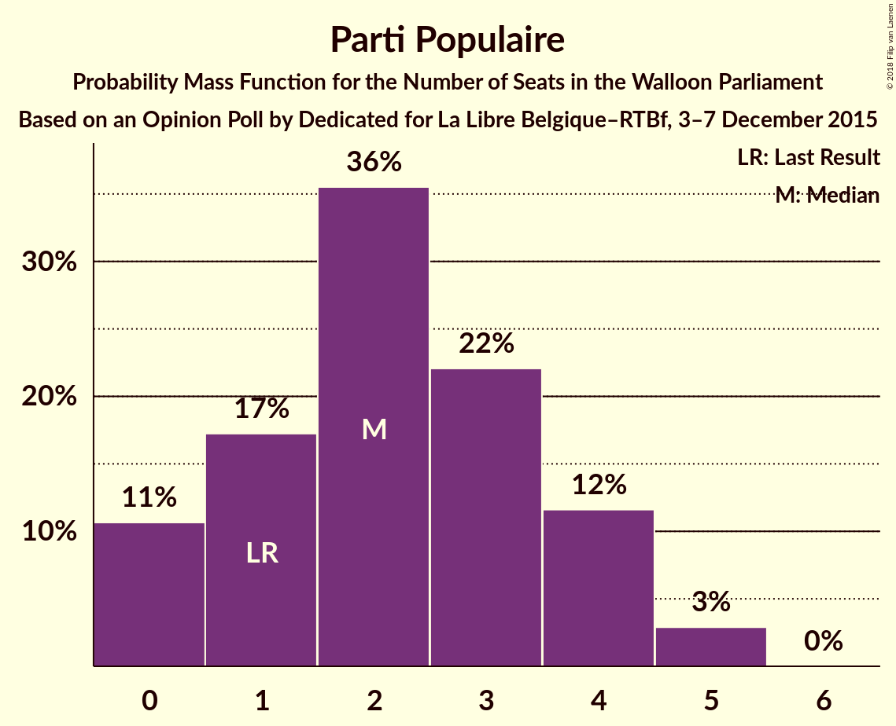
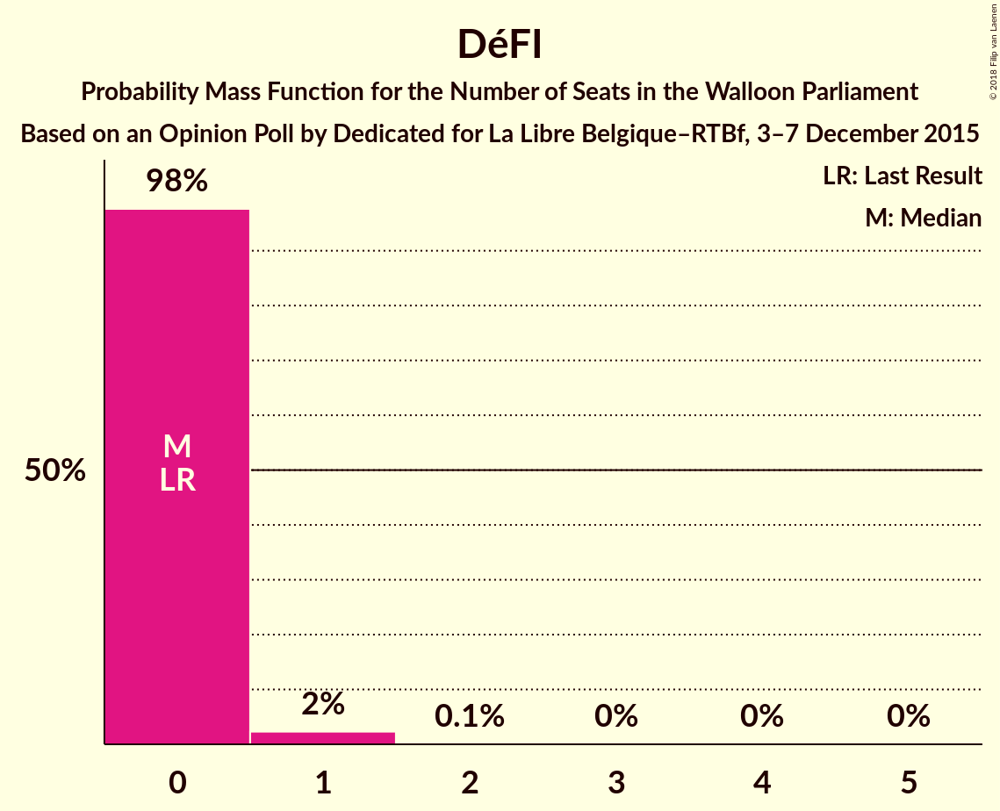
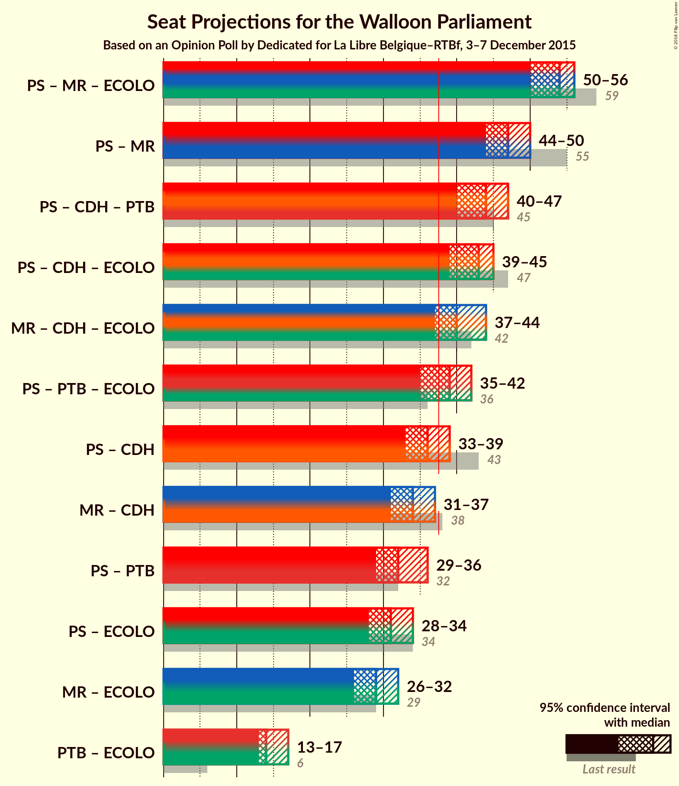

# Opinion Poll by Dedicated for La Libre Belgique–RTBf, 3–7 December 2015

<a href="#voting-intentions">Voting Intentions</a> | <a href="#seats">Seats</a> | <a href="#coalitions">Coalitions</a> | <a href="#technical-information">Technical Information</a>

## Voting Intentions

### Confidence Intervals

| Party | Last Result | Poll Result | 80% Confidence Interval | 90% Confidence Interval | 95% Confidence Interval | 99% Confidence Interval |
|:-----:|:-----------:|:-----------:|:-----------------------:|:-----------------------:|:-----------------------:|:-----------------------:|
| PS | 30.9% | 27.3% | 25.4–29.2% |24.9–29.8% |24.4–30.2% |23.6–31.2% |
| MR | 26.7% | 24.7% | 23.0–26.6% |22.5–27.2% |22.0–27.6% |21.2–28.6% |
| cdH | 15.2% | 13.5% | 12.1–15.1% |11.8–15.5% |11.4–15.9% |10.8–16.7% |
| PTB | 5.8% | 10.3% | 9.1–11.7% |8.8–12.1% |8.5–12.5% |8.0–13.2% |
| Ecolo | 8.6% | 9.5% | 8.3–10.8% |8.0–11.2% |7.7–11.5% |7.2–12.2% |
| Parti Populaire | 4.9% | 5.4% | 4.5–6.5% |4.3–6.8% |4.1–7.1% |3.7–7.6% |
| DéFI | 2.5% | 3.2% | 2.5–4.1% |2.4–4.3% |2.2–4.5% |2.0–5.0% |

*Note:* The poll result column reflects the actual value used in the calculations. Published results may vary slightly, and in addition be rounded to fewer digits.

## Seats

### Confidence Intervals

| Party | Last Result | Median | 80% Confidence Interval | 90% Confidence Interval | 95% Confidence Interval | 99% Confidence Interval |
|:-----:|:-----------:|:------:|:-----------------------:|:-----------------------:|:-----------------------:|:-----------------------:|
| <a href="#ps">PS</a> | 30 | 24 | 22–27 |22–27 |21–28 |21–29 |
| <a href="#mr">MR</a> | 25 | 22 | 21–25 |20–26 |20–26 |19–26 |
| <a href="#cdh">cdH</a> | 13 | 12 | 10–13 |10–13 |10–13 |9–14 |
| <a href="#ptb">PTB</a> | 2 | 8 | 7–9 |7–9 |7–9 |6–10 |
| <a href="#ecolo">Ecolo</a> | 4 | 6 | 6–7 |6–8 |6–9 |5–10 |
| <a href="#parti-populaire">Parti Populaire</a> | 1 | 2 | 0–4 |0–4 |0–5 |0–5 |
| <a href="#défi">DéFI</a> | 0 | 0 | 0 |0 |0 |0–1 |

### PS

*For a full overview of the results for this party, see the [PS](party-ps.html) page.*

| Number of Seats | Probability | Accumulated | Special Marks |
|:---------------:|:-----------:|:-----------:|:-------------:|
| 20 | 0.1% | 100% |  |
| 21 | 4% | 99.9% |  |
| 22 | 7% | 95% |  |
| 23 | 10% | 88% |  |
| 24 | 29% | 78% | Median |
| 25 | 22% | 49% |  |
| 26 | 15% | 27% |  |
| 27 | 8% | 12% |  |
| 28 | 3% | 4% |  |
| 29 | 0.5% | 0.7% |  |
| 30 | 0.1% | 0.1% | Last Result |
| 31 | 0% | 0% |  |

### MR

*For a full overview of the results for this party, see the [MR](party-mr.html) page.*

| Number of Seats | Probability | Accumulated | Special Marks |
|:---------------:|:-----------:|:-----------:|:-------------:|
| 18 | 0.2% | 100% |  |
| 19 | 0.7% | 99.8% |  |
| 20 | 7% | 99.1% |  |
| 21 | 23% | 92% |  |
| 22 | 21% | 70% | Median |
| 23 | 24% | 49% |  |
| 24 | 14% | 25% |  |
| 25 | 5% | 11% | Last Result |
| 26 | 5% | 5% |  |
| 27 | 0.2% | 0.2% |  |
| 28 | 0% | 0% |  |

### cdH

*For a full overview of the results for this party, see the [cdH](party-cdh.html) page.*

| Number of Seats | Probability | Accumulated | Special Marks |
|:---------------:|:-----------:|:-----------:|:-------------:|
| 7 | 0% | 100% |  |
| 8 | 0.1% | 99.9% |  |
| 9 | 1.2% | 99.8% |  |
| 10 | 17% | 98.6% |  |
| 11 | 31% | 82% |  |
| 12 | 38% | 51% | Median |
| 13 | 12% | 13% | Last Result |
| 14 | 0.9% | 1.4% |  |
| 15 | 0.5% | 0.5% |  |
| 16 | 0% | 0% |  |

### PTB

*For a full overview of the results for this party, see the [PTB](party-ptb.html) page.*

| Number of Seats | Probability | Accumulated | Special Marks |
|:---------------:|:-----------:|:-----------:|:-------------:|
| 2 | 0% | 100% | Last Result |
| 3 | 0% | 100% |  |
| 4 | 0% | 100% |  |
| 5 | 0.1% | 100% |  |
| 6 | 2% | 99.9% |  |
| 7 | 31% | 98% |  |
| 8 | 46% | 66% | Median |
| 9 | 18% | 21% |  |
| 10 | 2% | 2% |  |
| 11 | 0.1% | 0.1% |  |
| 12 | 0% | 0% |  |

### Ecolo

*For a full overview of the results for this party, see the [Ecolo](party-ecolo.html) page.*

| Number of Seats | Probability | Accumulated | Special Marks |
|:---------------:|:-----------:|:-----------:|:-------------:|
| 4 | 0% | 100% | Last Result |
| 5 | 1.0% | 99.9% |  |
| 6 | 65% | 98.9% | Median |
| 7 | 26% | 34% |  |
| 8 | 5% | 8% |  |
| 9 | 2% | 3% |  |
| 10 | 0.7% | 1.0% |  |
| 11 | 0.2% | 0.2% |  |
| 12 | 0% | 0% |  |

### Parti Populaire

*For a full overview of the results for this party, see the [Parti Populaire](party-partipopulaire.html) page.*

| Number of Seats | Probability | Accumulated | Special Marks |
|:---------------:|:-----------:|:-----------:|:-------------:|
| 0 | 11% | 100% |  |
| 1 | 17% | 89% | Last Result |
| 2 | 36% | 72% | Median |
| 3 | 22% | 37% |  |
| 4 | 12% | 15% |  |
| 5 | 3% | 3% |  |
| 6 | 0% | 0% |  |

### DéFI

*For a full overview of the results for this party, see the [DéFI](party-défi.html) page.*

| Number of Seats | Probability | Accumulated | Special Marks |
|:---------------:|:-----------:|:-----------:|:-------------:|
| 0 | 98% | 100% | Last Result, Median |
| 1 | 2% | 2% |  |
| 2 | 0.1% | 0.1% |  |
| 3 | 0% | 0% |  |

## Coalitions

### Confidence Intervals

| Coalition | Last Result | Median | Majority? | 80% Confidence Interval | 90% Confidence Interval | 95% Confidence Interval | 99% Confidence Interval |
|:---------:|:-----------:|:------:|:---------:|:-----------------------:|:-----------------------:|:-----------------------:|:-----------------------:|
| PS – MR – Ecolo | 59 | 54 | 100% | 52–55 | 51–56 | 50–56 | 50–57 |
| PS – MR | 55 | 47 | 100% | 45–49 | 44–49 | 44–50 | 43–51 |
| PS – cdH – PTB | 45 | 44 | 100% | 42–46 | 41–46 | 40–47 | 39–48 |
| PS – cdH – Ecolo | 47 | 43 | 99.9% | 40–45 | 39–45 | 39–45 | 38–47 |
| MR – cdH – Ecolo | 42 | 40 | 96% | 38–43 | 38–43 | 37–44 | 36–45 |
| PS – PTB – Ecolo | 36 | 39 | 78% | 37–41 | 36–42 | 35–42 | 35–43 |
| PS – cdH | 43 | 36 | 18% | 34–38 | 33–39 | 33–39 | 32–40 |
| MR – cdH | 38 | 34 | 3% | 32–36 | 31–37 | 31–38 | 30–38 |
| PS – PTB | 32 | 32 | 0.2% | 30–34 | 30–35 | 29–36 | 28–37 |
| PS – Ecolo | 34 | 31 | 0% | 29–33 | 28–34 | 28–34 | 27–35 |
| MR – Ecolo | 29 | 29 | 0% | 27–31 | 27–32 | 26–32 | 25–33 |
| PTB – Ecolo | 6 | 14 | 0% | 13–16 | 13–16 | 13–17 | 12–18 |

### PS – MR – Ecolo

| Number of Seats | Probability | Accumulated | Special Marks |
|:---------------:|:-----------:|:-----------:|:-------------:|
| 49 | 0.4% | 100% |  |
| 50 | 3% | 99.6% |  |
| 51 | 6% | 97% |  |
| 52 | 14% | 91% | Median |
| 53 | 25% | 77% |  |
| 54 | 27% | 52% |  |
| 55 | 18% | 25% |  |
| 56 | 6% | 7% |  |
| 57 | 1.2% | 1.5% |  |
| 58 | 0.2% | 0.3% |  |
| 59 | 0% | 0% | Last Result |

### PS – MR

| Number of Seats | Probability | Accumulated | Special Marks |
|:---------------:|:-----------:|:-----------:|:-------------:|
| 41 | 0.1% | 100% |  |
| 42 | 0.2% | 99.9% |  |
| 43 | 1.3% | 99.7% |  |
| 44 | 4% | 98% |  |
| 45 | 10% | 94% |  |
| 46 | 17% | 84% | Median |
| 47 | 27% | 68% |  |
| 48 | 25% | 40% |  |
| 49 | 12% | 15% |  |
| 50 | 3% | 4% |  |
| 51 | 0.4% | 0.5% |  |
| 52 | 0.1% | 0.1% |  |
| 53 | 0% | 0% |  |
| 54 | 0% | 0% |  |
| 55 | 0% | 0% | Last Result |

### PS – cdH – PTB

| Number of Seats | Probability | Accumulated | Special Marks |
|:---------------:|:-----------:|:-----------:|:-------------:|
| 38 | 0.1% | 100% | Majority |
| 39 | 0.5% | 99.9% |  |
| 40 | 2% | 99.5% |  |
| 41 | 6% | 97% |  |
| 42 | 15% | 91% |  |
| 43 | 17% | 76% |  |
| 44 | 19% | 59% | Median |
| 45 | 23% | 40% | Last Result |
| 46 | 13% | 18% |  |
| 47 | 4% | 5% |  |
| 48 | 0.7% | 0.9% |  |
| 49 | 0.2% | 0.2% |  |
| 50 | 0% | 0% |  |

### PS – cdH – Ecolo

| Number of Seats | Probability | Accumulated | Special Marks |
|:---------------:|:-----------:|:-----------:|:-------------:|
| 37 | 0.1% | 100% |  |
| 38 | 0.9% | 99.9% | Majority |
| 39 | 4% | 99.0% |  |
| 40 | 10% | 94% |  |
| 41 | 13% | 85% |  |
| 42 | 20% | 72% | Median |
| 43 | 24% | 52% |  |
| 44 | 16% | 28% |  |
| 45 | 10% | 12% |  |
| 46 | 2% | 2% |  |
| 47 | 0.5% | 0.6% | Last Result |
| 48 | 0.1% | 0.1% |  |
| 49 | 0% | 0% |  |

### MR – cdH – Ecolo

| Number of Seats | Probability | Accumulated | Special Marks |
|:---------------:|:-----------:|:-----------:|:-------------:|
| 35 | 0.1% | 100% |  |
| 36 | 0.5% | 99.9% |  |
| 37 | 4% | 99.4% |  |
| 38 | 11% | 96% | Majority |
| 39 | 16% | 85% |  |
| 40 | 21% | 69% | Median |
| 41 | 21% | 48% |  |
| 42 | 14% | 27% | Last Result |
| 43 | 9% | 13% |  |
| 44 | 3% | 4% |  |
| 45 | 1.3% | 1.4% |  |
| 46 | 0.1% | 0.1% |  |
| 47 | 0% | 0% |  |

### PS – PTB – Ecolo

| Number of Seats | Probability | Accumulated | Special Marks |
|:---------------:|:-----------:|:-----------:|:-------------:|
| 34 | 0.4% | 100% |  |
| 35 | 2% | 99.6% |  |
| 36 | 6% | 97% | Last Result |
| 37 | 13% | 91% |  |
| 38 | 21% | 78% | Median, Majority |
| 39 | 22% | 58% |  |
| 40 | 19% | 36% |  |
| 41 | 10% | 17% |  |
| 42 | 5% | 7% |  |
| 43 | 1.1% | 1.5% |  |
| 44 | 0.3% | 0.3% |  |
| 45 | 0.1% | 0.1% |  |
| 46 | 0% | 0% |  |

### PS – cdH

| Number of Seats | Probability | Accumulated | Special Marks |
|:---------------:|:-----------:|:-----------:|:-------------:|
| 31 | 0.4% | 100% |  |
| 32 | 2% | 99.5% |  |
| 33 | 7% | 98% |  |
| 34 | 12% | 91% |  |
| 35 | 15% | 79% |  |
| 36 | 22% | 64% | Median |
| 37 | 23% | 42% |  |
| 38 | 12% | 18% | Majority |
| 39 | 5% | 6% |  |
| 40 | 0.8% | 1.0% |  |
| 41 | 0.2% | 0.2% |  |
| 42 | 0% | 0% |  |
| 43 | 0% | 0% | Last Result |

### MR – cdH

| Number of Seats | Probability | Accumulated | Special Marks |
|:---------------:|:-----------:|:-----------:|:-------------:|
| 29 | 0.2% | 100% |  |
| 30 | 1.1% | 99.8% |  |
| 31 | 7% | 98.7% |  |
| 32 | 13% | 92% |  |
| 33 | 17% | 79% |  |
| 34 | 23% | 61% | Median |
| 35 | 23% | 39% |  |
| 36 | 7% | 16% |  |
| 37 | 6% | 9% |  |
| 38 | 2% | 3% | Last Result, Majority |
| 39 | 0.2% | 0.2% |  |
| 40 | 0% | 0% |  |

### PS – PTB

| Number of Seats | Probability | Accumulated | Special Marks |
|:---------------:|:-----------:|:-----------:|:-------------:|
| 27 | 0% | 100% |  |
| 28 | 1.2% | 99.9% |  |
| 29 | 3% | 98.7% |  |
| 30 | 8% | 96% |  |
| 31 | 20% | 87% |  |
| 32 | 19% | 68% | Last Result, Median |
| 33 | 21% | 49% |  |
| 34 | 18% | 27% |  |
| 35 | 6% | 10% |  |
| 36 | 3% | 3% |  |
| 37 | 0.6% | 0.7% |  |
| 38 | 0.1% | 0.2% | Majority |
| 39 | 0% | 0% |  |

### PS – Ecolo

| Number of Seats | Probability | Accumulated | Special Marks |
|:---------------:|:-----------:|:-----------:|:-------------:|
| 26 | 0.1% | 100% |  |
| 27 | 2% | 99.9% |  |
| 28 | 6% | 98% |  |
| 29 | 8% | 92% |  |
| 30 | 25% | 84% | Median |
| 31 | 22% | 59% |  |
| 32 | 16% | 37% |  |
| 33 | 14% | 21% |  |
| 34 | 5% | 7% | Last Result |
| 35 | 1.3% | 2% |  |
| 36 | 0.4% | 0.5% |  |
| 37 | 0.1% | 0.1% |  |
| 38 | 0% | 0% | Majority |

### MR – Ecolo

| Number of Seats | Probability | Accumulated | Special Marks |
|:---------------:|:-----------:|:-----------:|:-------------:|
| 24 | 0.1% | 100% |  |
| 25 | 0.4% | 99.9% |  |
| 26 | 3% | 99.5% |  |
| 27 | 21% | 97% |  |
| 28 | 15% | 76% | Median |
| 29 | 24% | 61% | Last Result |
| 30 | 20% | 37% |  |
| 31 | 9% | 17% |  |
| 32 | 5% | 8% |  |
| 33 | 2% | 2% |  |
| 34 | 0.4% | 0.4% |  |
| 35 | 0% | 0% |  |

### PTB – Ecolo

| Number of Seats | Probability | Accumulated | Special Marks |
|:---------------:|:-----------:|:-----------:|:-------------:|
| 6 | 0% | 100% | Last Result |
| 7 | 0% | 100% |  |
| 8 | 0% | 100% |  |
| 9 | 0% | 100% |  |
| 10 | 0% | 100% |  |
| 11 | 0.1% | 100% |  |
| 12 | 2% | 99.9% |  |
| 13 | 18% | 98% |  |
| 14 | 44% | 80% | Median |
| 15 | 23% | 36% |  |
| 16 | 10% | 13% |  |
| 17 | 2% | 3% |  |
| 18 | 0.9% | 1.2% |  |
| 19 | 0.3% | 0.4% |  |
| 20 | 0.1% | 0.1% |  |
| 21 | 0% | 0% |  |

## Technical Information

### Opinion Poll

+ **Polling firm:** Dedicated
+ **Commissioner(s):** La Libre Belgique–RTBf
+ **Fieldwork period:** 3–7 December 2015

### Calculations

+ **Sample size:** 910
+ **Simulations done:** 1,048,576
+ **Error estimate:** 1.69%

