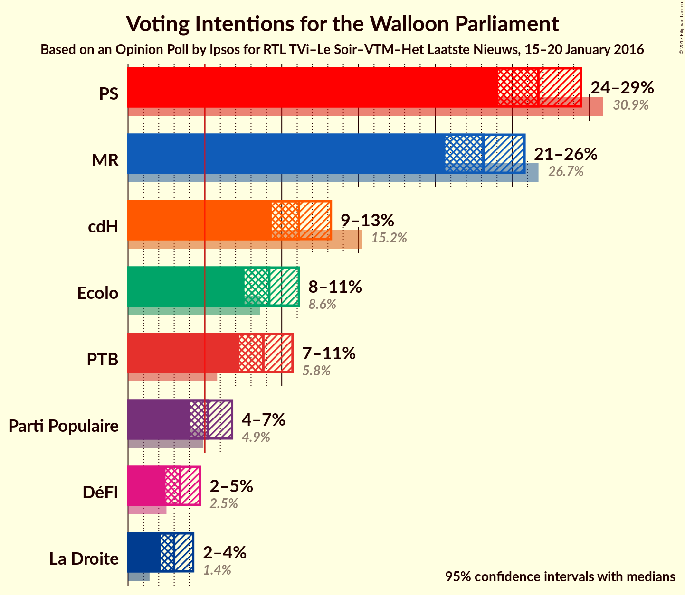
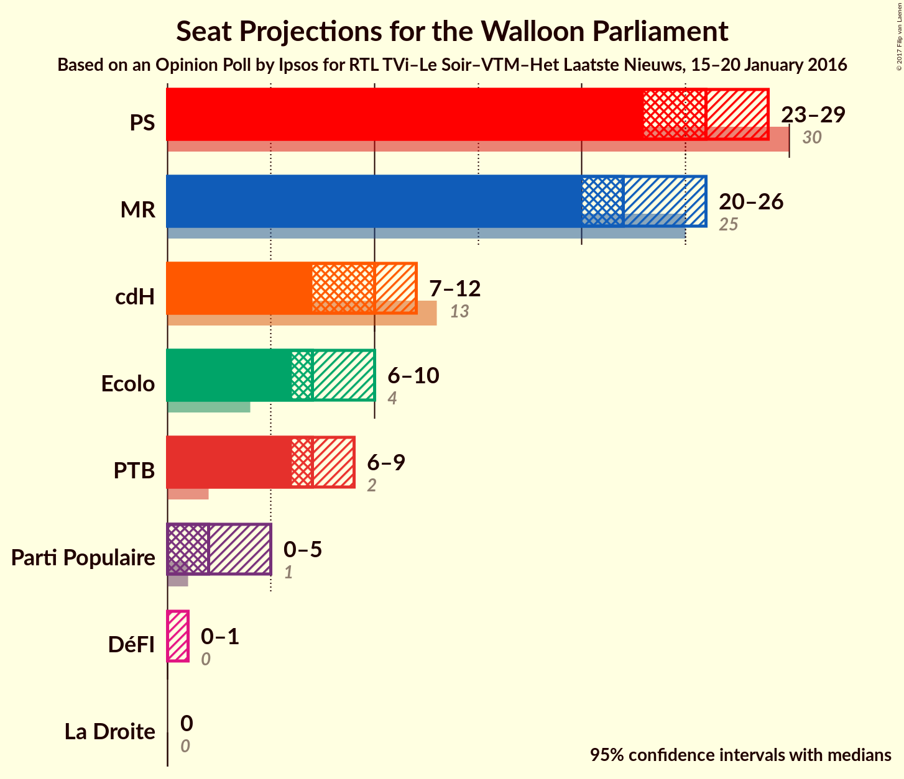
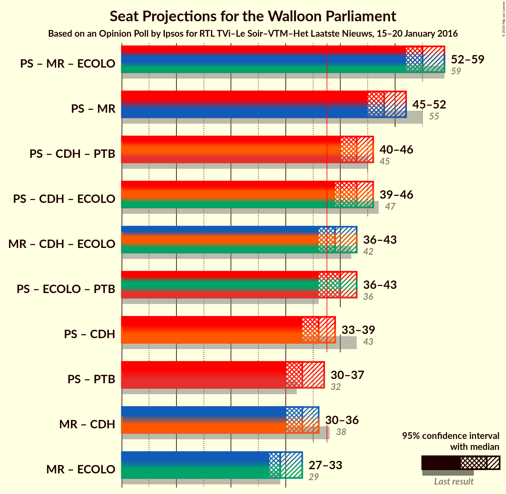

# Opinion Poll by Ipsos for RTL TVi–Le Soir–VTM–Het Laatste Nieuws, 15–20 January 2016

<a href="#voting-intentions">Voting Intentions</a> | <a href="#seats">Seats</a> | <a href="#coalitions">Coalitions</a> | <a href="#technical-information">Technical Information</a>

## Voting Intentions

### Confidence Intervals

| Party | Last Result | Poll Result | 80% Confidence Interval | 90% Confidence Interval | 95% Confidence Interval | 99% Confidence Interval |
|:-----:|:-----------:|:-----------:|:-----------------------:|:-----------------------:|:-----------------------:|:-----------------------:|
| PS | 30.9% | 26.7% | 25.0–28.5% |24.5–29.0% |24.1–29.5% |23.3–30.4% |
| MR | 26.7% | 23.1% | 21.5–24.9% |21.0–25.4% |20.6–25.8% |19.9–26.6% |
| cdH | 15.2% | 11.1% | 10.0–12.5% |9.6–12.9% |9.3–13.2% |8.8–13.9% |
| Ecolo | 8.6% | 9.2% | 8.1–10.4% |7.8–10.8% |7.6–11.1% |7.1–11.7% |
| PTB | 5.8% | 8.8% | 7.8–10.0% |7.5–10.4% |7.2–10.7% |6.8–11.3% |
| Parti Populaire | 4.9% | 5.2% | 4.4–6.2% |4.2–6.5% |4.0–6.8% |3.7–7.3% |
| DéFI | 2.5% | 3.4% | 2.8–4.2% |2.6–4.5% |2.4–4.7% |2.2–5.1% |
| La Droite | 1.4% | 3.0% | 2.4–3.8% |2.3–4.0% |2.1–4.2% |1.9–4.6% |

*Note:* The poll result column reflects the actual value used in the calculations. Published results may vary slightly, and in addition be rounded to fewer digits.

## Seats

### Confidence Intervals

| Party | Last Result | Median | 80% Confidence Interval | 90% Confidence Interval | 95% Confidence Interval | 99% Confidence Interval |
|:-----:|:-----------:|:------:|:-----------------------:|:-----------------------:|:-----------------------:|:-----------------------:|
| <a href="#ps">PS</a> | 30 | 26 | 24–28 |23–29 |23–29 |22–30 |
| <a href="#mr">MR</a> | 25 | 22 | 21–24 |21–25 |20–26 |19–26 |
| <a href="#cdh">cdH</a> | 13 | 10 | 9–12 |8–12 |7–12 |6–13 |
| <a href="#ecolo">Ecolo</a> | 4 | 7 | 6–8 |6–9 |6–10 |6–11 |
| <a href="#ptb">PTB</a> | 2 | 7 | 6–8 |6–8 |6–9 |5–9 |
| <a href="#parti-populaire">Parti Populaire</a> | 1 | 2 | 1–4 |0–4 |0–5 |0–5 |
| <a href="#défi">DéFI</a> | 0 | 0 | 0 |0–1 |0–1 |0–1 |
| <a href="#la-droite">La Droite</a> | 0 | 0 | 0 |0 |0 |0–2 |

### PS

*For a full overview of the results for this party, see the [PS](party-ps.html) page.*

| Number of Seats | Probability | Accumulated | Special Marks |
|:---------------:|:-----------:|:-----------:|:-------------:|
| 21 | 0.4% | 100% |  |
| 22 | 1.3% | 99.6% |  |
| 23 | 5% | 98% |  |
| 24 | 20% | 93% |  |
| 25 | 16% | 73% |  |
| 26 | 17% | 57% | Median |
| 27 | 15% | 40% |  |
| 28 | 18% | 24% |  |
| 29 | 6% | 7% |  |
| 30 | 0.7% | 1.0% | Last Result |
| 31 | 0.3% | 0.3% |  |
| 32 | 0% | 0% |  |

### MR

*For a full overview of the results for this party, see the [MR](party-mr.html) page.*

| Number of Seats | Probability | Accumulated | Special Marks |
|:---------------:|:-----------:|:-----------:|:-------------:|
| 18 | 0.2% | 100% |  |
| 19 | 0.9% | 99.8% |  |
| 20 | 3% | 98.9% |  |
| 21 | 23% | 96% |  |
| 22 | 30% | 73% | Median |
| 23 | 21% | 43% |  |
| 24 | 13% | 22% |  |
| 25 | 5% | 8% | Last Result |
| 26 | 2% | 3% |  |
| 27 | 0.3% | 0.3% |  |
| 28 | 0.1% | 0.1% |  |
| 29 | 0% | 0% |  |

### cdH

*For a full overview of the results for this party, see the [cdH](party-cdh.html) page.*

| Number of Seats | Probability | Accumulated | Special Marks |
|:---------------:|:-----------:|:-----------:|:-------------:|
| 6 | 2% | 100% |  |
| 7 | 1.2% | 98% |  |
| 8 | 3% | 97% |  |
| 9 | 18% | 94% |  |
| 10 | 38% | 76% | Median |
| 11 | 28% | 38% |  |
| 12 | 10% | 10% |  |
| 13 | 0.6% | 0.6% | Last Result |
| 14 | 0% | 0% |  |

### Ecolo

*For a full overview of the results for this party, see the [Ecolo](party-ecolo.html) page.*

| Number of Seats | Probability | Accumulated | Special Marks |
|:---------------:|:-----------:|:-----------:|:-------------:|
| 4 | 0% | 100% | Last Result |
| 5 | 0.3% | 100% |  |
| 6 | 48% | 99.7% |  |
| 7 | 38% | 52% | Median |
| 8 | 7% | 15% |  |
| 9 | 5% | 7% |  |
| 10 | 2% | 3% |  |
| 11 | 0.5% | 0.7% |  |
| 12 | 0.1% | 0.1% |  |
| 13 | 0% | 0% |  |

### PTB

*For a full overview of the results for this party, see the [PTB](party-ptb.html) page.*

| Number of Seats | Probability | Accumulated | Special Marks |
|:---------------:|:-----------:|:-----------:|:-------------:|
| 2 | 0% | 100% | Last Result |
| 3 | 0% | 100% |  |
| 4 | 0.5% | 100% |  |
| 5 | 1.3% | 99.5% |  |
| 6 | 9% | 98% |  |
| 7 | 53% | 90% | Median |
| 8 | 33% | 37% |  |
| 9 | 4% | 4% |  |
| 10 | 0.2% | 0.2% |  |
| 11 | 0% | 0% |  |

### Parti Populaire

*For a full overview of the results for this party, see the [Parti Populaire](party-partipopulaire.html) page.*

| Number of Seats | Probability | Accumulated | Special Marks |
|:---------------:|:-----------:|:-----------:|:-------------:|
| 0 | 7% | 100% |  |
| 1 | 19% | 93% | Last Result |
| 2 | 33% | 74% | Median |
| 3 | 18% | 40% |  |
| 4 | 20% | 23% |  |
| 5 | 3% | 3% |  |
| 6 | 0% | 0% |  |

### DéFI

*For a full overview of the results for this party, see the [DéFI](party-dfi.html) page.*

| Number of Seats | Probability | Accumulated | Special Marks |
|:---------------:|:-----------:|:-----------:|:-------------:|
| 0 | 93% | 100% | Last Result, Median |
| 1 | 7% | 7% |  |
| 2 | 0.2% | 0.3% |  |
| 3 | 0% | 0% |  |

### La Droite

*For a full overview of the results for this party, see the [La Droite](party-ladroite.html) page.*

| Number of Seats | Probability | Accumulated | Special Marks |
|:---------------:|:-----------:|:-----------:|:-------------:|
| 0 | 98% | 100% | Last Result, Median |
| 1 | 0.6% | 2% |  |
| 2 | 1.1% | 1.3% |  |
| 3 | 0.1% | 0.2% |  |
| 4 | 0.1% | 0.1% |  |
| 5 | 0% | 0% |  |

## Coalitions

### Confidence Intervals

| Coalition | Last Result | Median | Majority? | 80% Confidence Interval | 90% Confidence Interval | 95% Confidence Interval | 99% Confidence Interval |
|:---------:|:-----------:|:------:|:---------:|:-----------------------:|:-----------------------:|:-----------------------:|:-----------------------:|
| PS – MR – Ecolo | 59 | 55 | 100% | 53–57 | 53–58 | 52–59 | 51–60 |
| PS – MR | 55 | 48 | 100% | 46–50 | 46–51 | 45–52 | 44–54 |
| PS – cdH – PTB | 45 | 43 | 99.9% | 41–46 | 40–46 | 40–46 | 39–47 |
| PS – cdH – Ecolo | 47 | 43 | 99.9% | 40–45 | 40–45 | 39–46 | 39–47 |
| MR – cdH – Ecolo | 42 | 39 | 86% | 37–42 | 37–42 | 36–43 | 35–44 |
| PS – Ecolo – PTB | 36 | 40 | 89% | 37–42 | 37–43 | 36–43 | 36–44 |
| PS – cdH | 43 | 36 | 25% | 34–38 | 33–39 | 33–39 | 31–40 |
| PS – PTB | 32 | 33 | 0.5% | 31–36 | 30–36 | 30–37 | 29–38 |
| MR – cdH | 38 | 33 | 0.2% | 30–35 | 30–35 | 30–36 | 28–37 |
| MR – Ecolo | 29 | 29 | 0% | 27–31 | 27–32 | 27–33 | 26–34 |

### PS – MR – Ecolo

| Number of Seats | Probability | Accumulated | Special Marks |
|:---------------:|:-----------:|:-----------:|:-------------:|
| 50 | 0.2% | 100% |  |
| 51 | 0.6% | 99.8% |  |
| 52 | 3% | 99.2% |  |
| 53 | 13% | 96% |  |
| 54 | 19% | 83% |  |
| 55 | 27% | 64% | Median |
| 56 | 14% | 37% |  |
| 57 | 16% | 23% |  |
| 58 | 4% | 7% |  |
| 59 | 1.4% | 3% | Last Result |
| 60 | 0.9% | 1.3% |  |
| 61 | 0.3% | 0.3% |  |
| 62 | 0% | 0% |  |

### PS – MR

| Number of Seats | Probability | Accumulated | Special Marks |
|:---------------:|:-----------:|:-----------:|:-------------:|
| 43 | 0.2% | 100% |  |
| 44 | 0.6% | 99.7% |  |
| 45 | 3% | 99.1% |  |
| 46 | 7% | 96% |  |
| 47 | 23% | 89% |  |
| 48 | 20% | 66% | Median |
| 49 | 21% | 46% |  |
| 50 | 15% | 25% |  |
| 51 | 6% | 10% |  |
| 52 | 2% | 3% |  |
| 53 | 0.7% | 1.3% |  |
| 54 | 0.6% | 0.7% |  |
| 55 | 0.1% | 0.1% | Last Result |
| 56 | 0% | 0% |  |

### PS – cdH – PTB

| Number of Seats | Probability | Accumulated | Special Marks |
|:---------------:|:-----------:|:-----------:|:-------------:|
| 37 | 0.1% | 100% |  |
| 38 | 0.3% | 99.9% | Majority |
| 39 | 1.1% | 99.5% |  |
| 40 | 4% | 98% |  |
| 41 | 10% | 94% |  |
| 42 | 18% | 84% |  |
| 43 | 16% | 66% | Median |
| 44 | 21% | 50% |  |
| 45 | 16% | 29% | Last Result |
| 46 | 10% | 13% |  |
| 47 | 2% | 2% |  |
| 48 | 0.3% | 0.4% |  |
| 49 | 0.1% | 0.1% |  |
| 50 | 0% | 0% |  |

### PS – cdH – Ecolo

| Number of Seats | Probability | Accumulated | Special Marks |
|:---------------:|:-----------:|:-----------:|:-------------:|
| 37 | 0.1% | 100% |  |
| 38 | 0.3% | 99.9% | Majority |
| 39 | 2% | 99.6% |  |
| 40 | 8% | 97% |  |
| 41 | 14% | 90% |  |
| 42 | 18% | 76% |  |
| 43 | 18% | 58% | Median |
| 44 | 20% | 39% |  |
| 45 | 15% | 20% |  |
| 46 | 4% | 4% |  |
| 47 | 0.8% | 0.9% | Last Result |
| 48 | 0.1% | 0.2% |  |
| 49 | 0% | 0% |  |

### MR – cdH – Ecolo

| Number of Seats | Probability | Accumulated | Special Marks |
|:---------------:|:-----------:|:-----------:|:-------------:|
| 34 | 0.2% | 100% |  |
| 35 | 0.7% | 99.8% |  |
| 36 | 4% | 99.1% |  |
| 37 | 9% | 95% |  |
| 38 | 19% | 86% | Majority |
| 39 | 20% | 67% | Median |
| 40 | 21% | 47% |  |
| 41 | 14% | 26% |  |
| 42 | 8% | 11% | Last Result |
| 43 | 3% | 4% |  |
| 44 | 0.8% | 0.9% |  |
| 45 | 0.1% | 0.1% |  |
| 46 | 0% | 0% |  |

### PS – Ecolo – PTB

| Number of Seats | Probability | Accumulated | Special Marks |
|:---------------:|:-----------:|:-----------:|:-------------:|
| 34 | 0.1% | 100% |  |
| 35 | 0.4% | 99.9% |  |
| 36 | 2% | 99.5% | Last Result |
| 37 | 9% | 97% |  |
| 38 | 14% | 89% | Majority |
| 39 | 13% | 75% |  |
| 40 | 22% | 62% | Median |
| 41 | 17% | 40% |  |
| 42 | 16% | 24% |  |
| 43 | 6% | 8% |  |
| 44 | 2% | 2% |  |
| 45 | 0.4% | 0.5% |  |
| 46 | 0.1% | 0.1% |  |
| 47 | 0% | 0% |  |

### PS – cdH

| Number of Seats | Probability | Accumulated | Special Marks |
|:---------------:|:-----------:|:-----------:|:-------------:|
| 30 | 0.1% | 100% |  |
| 31 | 0.4% | 99.8% |  |
| 32 | 2% | 99.4% |  |
| 33 | 5% | 98% |  |
| 34 | 15% | 93% |  |
| 35 | 18% | 78% |  |
| 36 | 16% | 61% | Median |
| 37 | 19% | 44% |  |
| 38 | 18% | 25% | Majority |
| 39 | 6% | 8% |  |
| 40 | 1.3% | 1.5% |  |
| 41 | 0.1% | 0.2% |  |
| 42 | 0% | 0% |  |
| 43 | 0% | 0% | Last Result |

### PS – PTB

| Number of Seats | Probability | Accumulated | Special Marks |
|:---------------:|:-----------:|:-----------:|:-------------:|
| 28 | 0.3% | 100% |  |
| 29 | 1.1% | 99.7% |  |
| 30 | 4% | 98.6% |  |
| 31 | 16% | 95% |  |
| 32 | 15% | 78% | Last Result |
| 33 | 20% | 63% | Median |
| 34 | 16% | 44% |  |
| 35 | 17% | 28% |  |
| 36 | 7% | 11% |  |
| 37 | 3% | 4% |  |
| 38 | 0.5% | 0.5% | Majority |
| 39 | 0.1% | 0.1% |  |
| 40 | 0% | 0% |  |

### MR – cdH

| Number of Seats | Probability | Accumulated | Special Marks |
|:---------------:|:-----------:|:-----------:|:-------------:|
| 27 | 0.1% | 100% |  |
| 28 | 0.5% | 99.8% |  |
| 29 | 2% | 99.3% |  |
| 30 | 8% | 98% |  |
| 31 | 17% | 89% |  |
| 32 | 20% | 72% | Median |
| 33 | 22% | 52% |  |
| 34 | 17% | 30% |  |
| 35 | 8% | 12% |  |
| 36 | 4% | 5% |  |
| 37 | 0.9% | 1.1% |  |
| 38 | 0.2% | 0.2% | Last Result, Majority |
| 39 | 0% | 0% |  |

### MR – Ecolo

| Number of Seats | Probability | Accumulated | Special Marks |
|:---------------:|:-----------:|:-----------:|:-------------:|
| 24 | 0.1% | 100% |  |
| 25 | 0.3% | 99.9% |  |
| 26 | 1.4% | 99.6% |  |
| 27 | 14% | 98% |  |
| 28 | 20% | 85% |  |
| 29 | 24% | 65% | Last Result, Median |
| 30 | 22% | 41% |  |
| 31 | 10% | 19% |  |
| 32 | 5% | 9% |  |
| 33 | 3% | 3% |  |
| 34 | 0.6% | 0.8% |  |
| 35 | 0.1% | 0.2% |  |
| 36 | 0% | 0% |  |

## Technical Information

### Opinion Poll

+ **Polling firm:** Ipsos
+ **Commissioner(s):** RTL TVi–Le Soir–VTM–Het Laatste Nieuws
+ **Fieldwork period:** 15–20 January 2016

### Calculations

+ **Sample size:** 1034
+ **Simulations done:** 2,097,152
+ **Error estimate:** 1.68%

