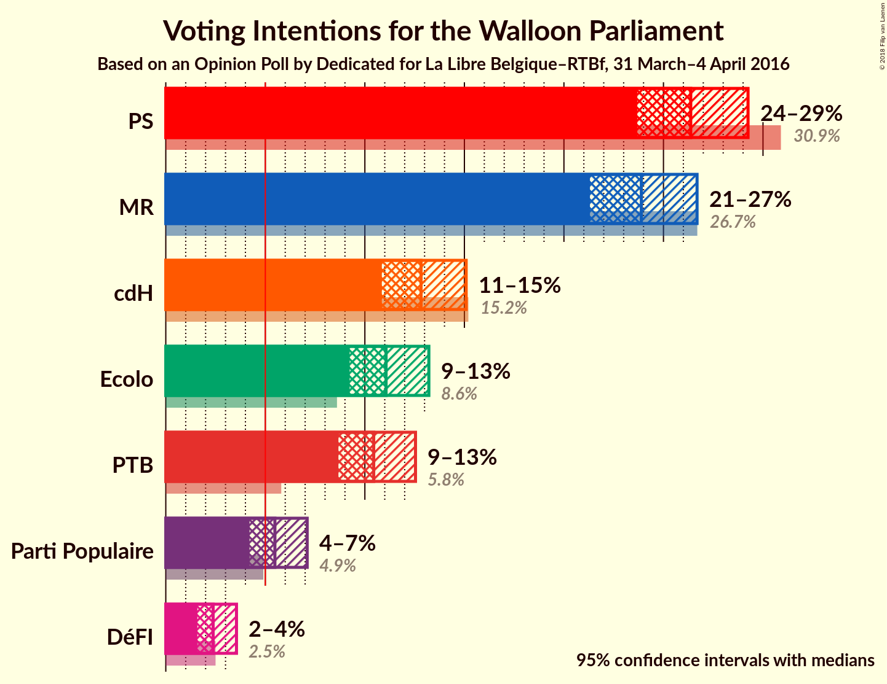
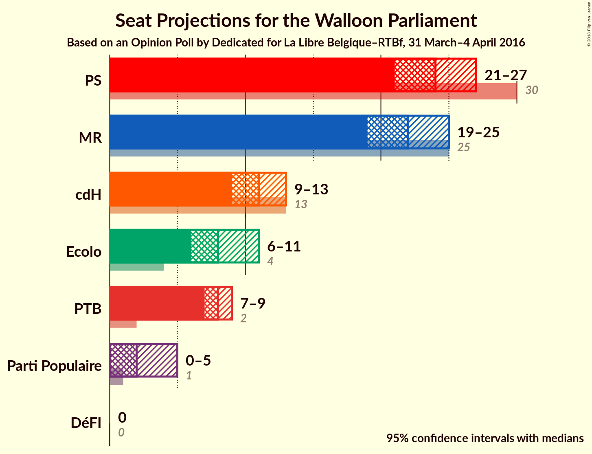
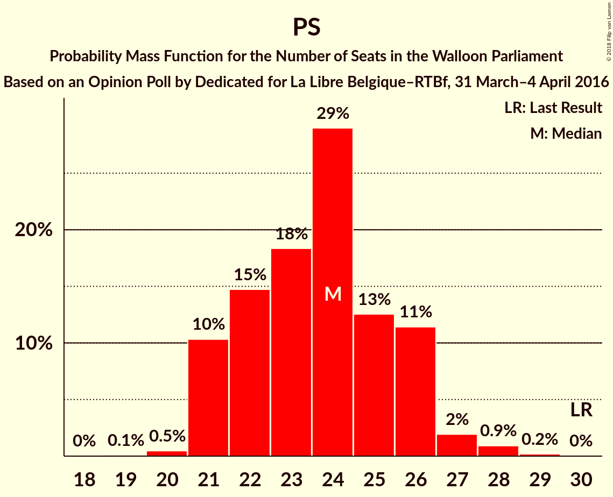
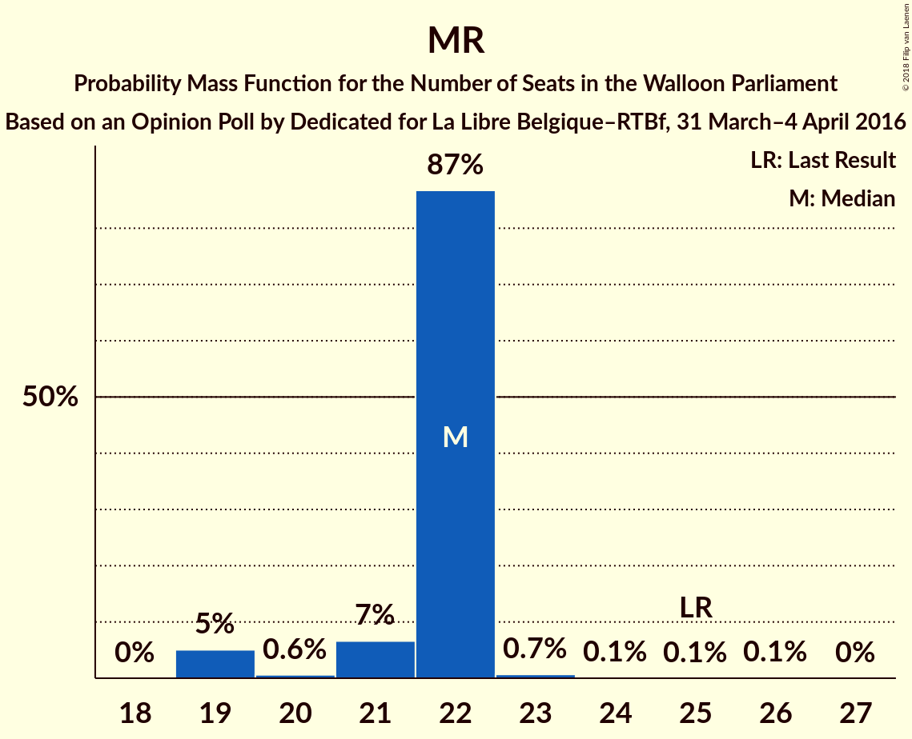
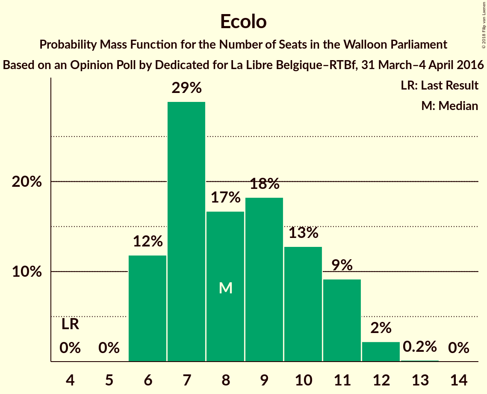
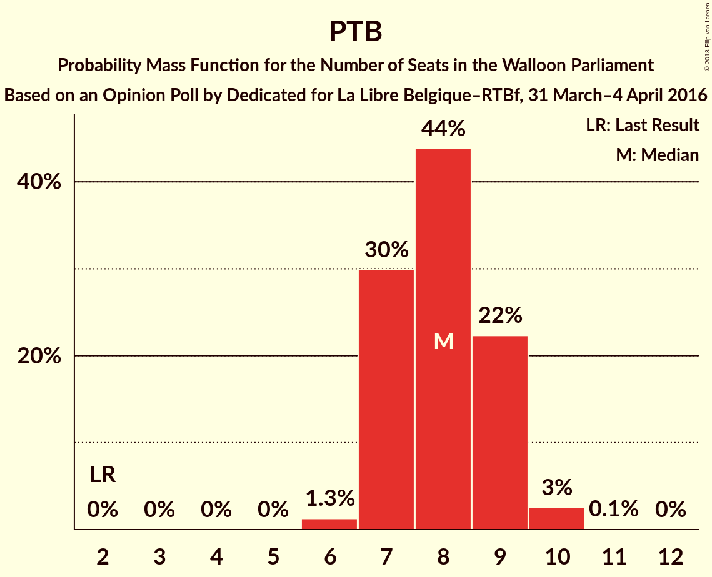
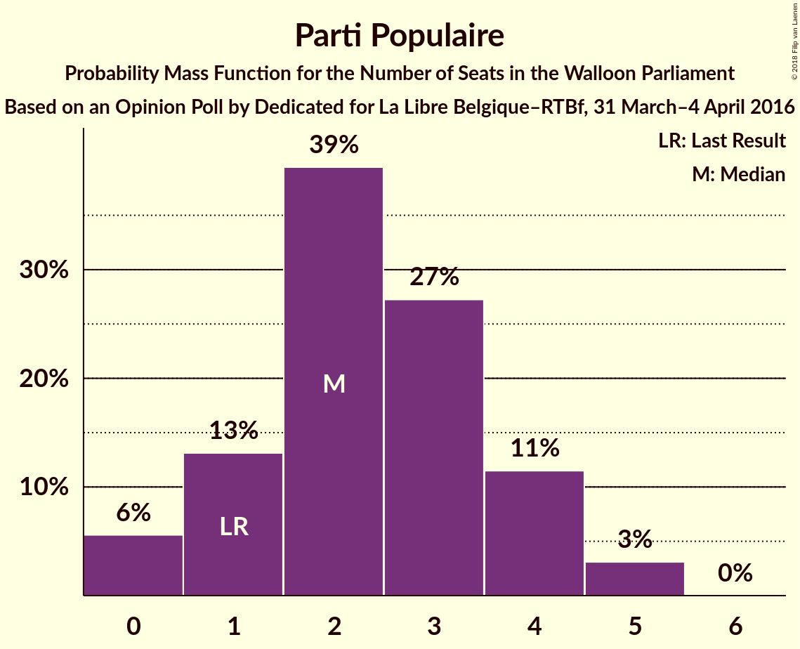
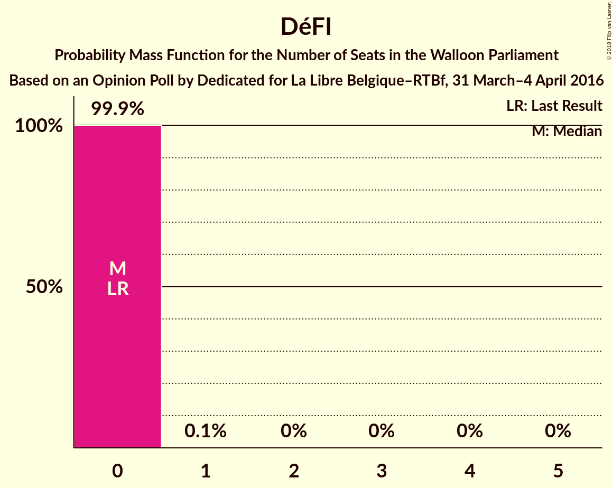
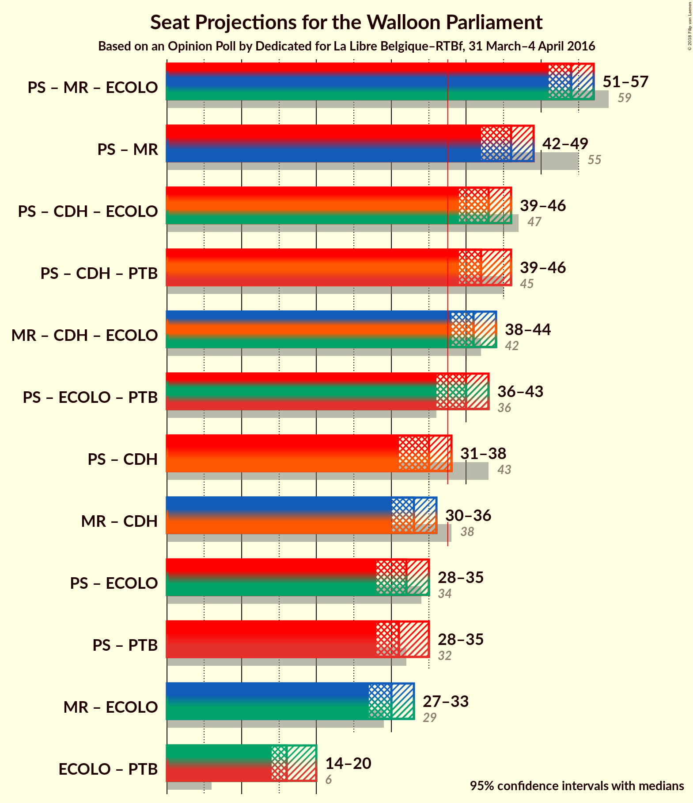

# Opinion Poll by Dedicated for La Libre Belgique–RTBf, 31 March–4 April 2016

<a href="#voting-intentions">Voting Intentions</a> | <a href="#seats">Seats</a> | <a href="#coalitions">Coalitions</a> | <a href="#technical-information">Technical Information</a>

## Voting Intentions

### Confidence Intervals

| Party | Last Result | Poll Result | 80% Confidence Interval | 90% Confidence Interval | 95% Confidence Interval | 99% Confidence Interval |
|:-----:|:-----------:|:-----------:|:-----------------------:|:-----------------------:|:-----------------------:|:-----------------------:|
| PS | 30.9% | 26.4% | 24.6–28.3% |24.1–28.8% |23.7–29.2% |22.9–30.2% |
| MR | 26.7% | 23.9% | 22.2–25.7% |21.7–26.2% |21.3–26.7% |20.5–27.6% |
| cdH | 15.2% | 12.8% | 11.5–14.3% |11.2–14.7% |10.9–15.1% |10.3–15.8% |
| Ecolo | 8.6% | 11.1% | 9.9–12.5% |9.5–12.9% |9.2–13.2% |8.7–13.9% |
| PTB | 5.8% | 10.4% | 9.3–11.8% |8.9–12.2% |8.7–12.5% |8.1–13.2% |
| Parti Populaire | 4.9% | 5.5% | 4.6–6.5% |4.4–6.8% |4.2–7.1% |3.8–7.7% |
| DéFI | 2.5% | 2.4% | 1.9–3.1% |1.7–3.4% |1.6–3.6% |1.4–3.9% |

*Note:* The poll result column reflects the actual value used in the calculations. Published results may vary slightly, and in addition be rounded to fewer digits.

## Seats

### Confidence Intervals

| Party | Last Result | Median | 80% Confidence Interval | 90% Confidence Interval | 95% Confidence Interval | 99% Confidence Interval |
|:-----:|:-----------:|:------:|:-----------------------:|:-----------------------:|:-----------------------:|:-----------------------:|
| <a href="#ps">PS</a> | 30 | 24 | 21–26 |21–26 |21–27 |20–28 |
| <a href="#mr">MR</a> | 25 | 22 | 20–24 |20–25 |19–25 |18–26 |
| <a href="#cdh">cdH</a> | 13 | 11 | 9–12 |9–13 |9–13 |8–13 |
| <a href="#ecolo">Ecolo</a> | 4 | 8 | 6–11 |6–11 |6–11 |6–12 |
| <a href="#ptb">PTB</a> | 2 | 8 | 7–9 |7–9 |7–9 |6–10 |
| <a href="#parti-populaire">Parti Populaire</a> | 1 | 2 | 1–4 |0–4 |0–5 |0–5 |
| <a href="#défi">DéFI</a> | 0 | 0 | 0 |0 |0 |0 |

### PS

*For a full overview of the results for this party, see the [PS](party-ps.html) page.*

| Number of Seats | Probability | Accumulated | Special Marks |
|:---------------:|:-----------:|:-----------:|:-------------:|
| 19 | 0.1% | 100% |  |
| 20 | 0.5% | 99.9% |  |
| 21 | 10% | 99.4% |  |
| 22 | 14% | 89% |  |
| 23 | 18% | 75% |  |
| 24 | 31% | 58% | Median |
| 25 | 13% | 27% |  |
| 26 | 11% | 14% |  |
| 27 | 2% | 3% |  |
| 28 | 0.9% | 1.1% |  |
| 29 | 0.2% | 0.2% |  |
| 30 | 0% | 0% | Last Result |

### MR

*For a full overview of the results for this party, see the [MR](party-mr.html) page.*

| Number of Seats | Probability | Accumulated | Special Marks |
|:---------------:|:-----------:|:-----------:|:-------------:|
| 17 | 0.4% | 100% |  |
| 18 | 1.0% | 99.6% |  |
| 19 | 3% | 98.6% |  |
| 20 | 14% | 95% |  |
| 21 | 24% | 81% |  |
| 22 | 24% | 57% | Median |
| 23 | 23% | 33% |  |
| 24 | 5% | 11% |  |
| 25 | 4% | 5% | Last Result |
| 26 | 2% | 2% |  |
| 27 | 0% | 0% |  |

### cdH

*For a full overview of the results for this party, see the [cdH](party-cdh.html) page.*

| Number of Seats | Probability | Accumulated | Special Marks |
|:---------------:|:-----------:|:-----------:|:-------------:|
| 6 | 0.1% | 100% |  |
| 7 | 0.2% | 99.9% |  |
| 8 | 0.4% | 99.7% |  |
| 9 | 9% | 99.3% |  |
| 10 | 22% | 90% |  |
| 11 | 36% | 68% | Median |
| 12 | 26% | 31% |  |
| 13 | 5% | 6% | Last Result |
| 14 | 0.2% | 0.2% |  |
| 15 | 0% | 0% |  |

### Ecolo

*For a full overview of the results for this party, see the [Ecolo](party-ecolo.html) page.*

| Number of Seats | Probability | Accumulated | Special Marks |
|:---------------:|:-----------:|:-----------:|:-------------:|
| 4 | 0% | 100% | Last Result |
| 5 | 0% | 100% |  |
| 6 | 12% | 100% |  |
| 7 | 29% | 88% |  |
| 8 | 17% | 59% | Median |
| 9 | 18% | 43% |  |
| 10 | 13% | 24% |  |
| 11 | 9% | 12% |  |
| 12 | 2% | 2% |  |
| 13 | 0.2% | 0.2% |  |
| 14 | 0% | 0% |  |

### PTB

*For a full overview of the results for this party, see the [PTB](party-ptb.html) page.*

| Number of Seats | Probability | Accumulated | Special Marks |
|:---------------:|:-----------:|:-----------:|:-------------:|
| 2 | 0% | 100% | Last Result |
| 3 | 0% | 100% |  |
| 4 | 0% | 100% |  |
| 5 | 0% | 100% |  |
| 6 | 1.2% | 100% |  |
| 7 | 29% | 98.7% |  |
| 8 | 45% | 70% | Median |
| 9 | 23% | 25% |  |
| 10 | 2% | 2% |  |
| 11 | 0.1% | 0.1% |  |
| 12 | 0% | 0% |  |

### Parti Populaire

*For a full overview of the results for this party, see the [Parti Populaire](party-partipopulaire.html) page.*

| Number of Seats | Probability | Accumulated | Special Marks |
|:---------------:|:-----------:|:-----------:|:-------------:|
| 0 | 6% | 100% |  |
| 1 | 13% | 94% | Last Result |
| 2 | 40% | 81% | Median |
| 3 | 27% | 41% |  |
| 4 | 11% | 14% |  |
| 5 | 3% | 3% |  |
| 6 | 0% | 0% |  |

### DéFI

*For a full overview of the results for this party, see the [DéFI](party-défi.html) page.*

| Number of Seats | Probability | Accumulated | Special Marks |
|:---------------:|:-----------:|:-----------:|:-------------:|
| 0 | 99.9% | 100% | Last Result, Median |
| 1 | 0.1% | 0.1% |  |
| 2 | 0% | 0% |  |

## Coalitions

### Confidence Intervals

| Coalition | Last Result | Median | Majority? | 80% Confidence Interval | 90% Confidence Interval | 95% Confidence Interval | 99% Confidence Interval |
|:---------:|:-----------:|:------:|:---------:|:-----------------------:|:-----------------------:|:-----------------------:|:-----------------------:|
| PS – MR – Ecolo | 59 | 54 | 100% | 52–56 | 51–56 | 51–57 | 50–58 |
| PS – MR | 55 | 46 | 100% | 43–48 | 42–48 | 42–49 | 41–50 |
| PS – cdH – Ecolo | 47 | 43 | 99.9% | 41–45 | 40–46 | 39–46 | 38–47 |
| PS – cdH – PTB | 45 | 42 | 99.8% | 40–45 | 40–46 | 39–46 | 38–47 |
| MR – cdH – Ecolo | 42 | 41 | 98% | 39–43 | 38–44 | 38–44 | 37–45 |
| PS – Ecolo – PTB | 36 | 40 | 91% | 38–42 | 37–43 | 36–43 | 35–45 |
| PS – cdH | 43 | 35 | 5% | 32–37 | 32–38 | 31–38 | 30–39 |
| MR – cdH | 38 | 33 | 0.4% | 31–35 | 30–36 | 30–36 | 28–37 |
| PS – PTB | 32 | 31 | 0% | 30–34 | 29–34 | 29–35 | 28–36 |
| PS – Ecolo | 34 | 32 | 0.1% | 30–34 | 29–35 | 28–35 | 27–37 |
| MR – Ecolo | 29 | 30 | 0% | 28–32 | 27–33 | 27–33 | 26–34 |
| Ecolo – PTB | 6 | 16 | 0% | 14–19 | 14–19 | 14–20 | 13–21 |

### PS – MR – Ecolo

| Number of Seats | Probability | Accumulated | Special Marks |
|:---------------:|:-----------:|:-----------:|:-------------:|
| 49 | 0.2% | 100% |  |
| 50 | 1.3% | 99.8% |  |
| 51 | 5% | 98% |  |
| 52 | 12% | 94% |  |
| 53 | 26% | 82% |  |
| 54 | 25% | 57% | Median |
| 55 | 21% | 32% |  |
| 56 | 8% | 11% |  |
| 57 | 2% | 3% |  |
| 58 | 0.7% | 0.9% |  |
| 59 | 0.1% | 0.1% | Last Result |
| 60 | 0% | 0% |  |

### PS – MR

| Number of Seats | Probability | Accumulated | Special Marks |
|:---------------:|:-----------:|:-----------:|:-------------:|
| 40 | 0.4% | 100% |  |
| 41 | 1.4% | 99.6% |  |
| 42 | 5% | 98% |  |
| 43 | 8% | 94% |  |
| 44 | 13% | 85% |  |
| 45 | 20% | 72% |  |
| 46 | 20% | 52% | Median |
| 47 | 20% | 32% |  |
| 48 | 9% | 12% |  |
| 49 | 3% | 3% |  |
| 50 | 0.5% | 0.6% |  |
| 51 | 0.1% | 0.1% |  |
| 52 | 0% | 0% |  |
| 53 | 0% | 0% |  |
| 54 | 0% | 0% |  |
| 55 | 0% | 0% | Last Result |

### PS – cdH – Ecolo

| Number of Seats | Probability | Accumulated | Special Marks |
|:---------------:|:-----------:|:-----------:|:-------------:|
| 37 | 0.1% | 100% |  |
| 38 | 0.7% | 99.9% | Majority |
| 39 | 3% | 99.2% |  |
| 40 | 6% | 96% |  |
| 41 | 13% | 91% |  |
| 42 | 16% | 78% |  |
| 43 | 25% | 61% | Median |
| 44 | 18% | 37% |  |
| 45 | 13% | 19% |  |
| 46 | 4% | 6% |  |
| 47 | 1.2% | 2% | Last Result |
| 48 | 0.4% | 0.5% |  |
| 49 | 0.1% | 0.1% |  |
| 50 | 0% | 0% |  |

### PS – cdH – PTB

| Number of Seats | Probability | Accumulated | Special Marks |
|:---------------:|:-----------:|:-----------:|:-------------:|
| 37 | 0.1% | 100% |  |
| 38 | 0.9% | 99.8% | Majority |
| 39 | 3% | 98.9% |  |
| 40 | 9% | 96% |  |
| 41 | 14% | 87% |  |
| 42 | 24% | 73% |  |
| 43 | 18% | 49% | Median |
| 44 | 16% | 31% |  |
| 45 | 9% | 15% | Last Result |
| 46 | 5% | 6% |  |
| 47 | 0.9% | 1.1% |  |
| 48 | 0.1% | 0.2% |  |
| 49 | 0% | 0% |  |

### MR – cdH – Ecolo

| Number of Seats | Probability | Accumulated | Special Marks |
|:---------------:|:-----------:|:-----------:|:-------------:|
| 36 | 0.2% | 100% |  |
| 37 | 2% | 99.8% |  |
| 38 | 6% | 98% | Majority |
| 39 | 10% | 92% |  |
| 40 | 19% | 83% |  |
| 41 | 23% | 64% | Median |
| 42 | 21% | 41% | Last Result |
| 43 | 13% | 19% |  |
| 44 | 5% | 6% |  |
| 45 | 1.1% | 1.3% |  |
| 46 | 0.1% | 0.1% |  |
| 47 | 0% | 0% |  |

### PS – Ecolo – PTB

| Number of Seats | Probability | Accumulated | Special Marks |
|:---------------:|:-----------:|:-----------:|:-------------:|
| 34 | 0.1% | 100% |  |
| 35 | 0.7% | 99.9% |  |
| 36 | 2% | 99.2% | Last Result |
| 37 | 6% | 97% |  |
| 38 | 14% | 91% | Majority |
| 39 | 16% | 77% |  |
| 40 | 23% | 61% | Median |
| 41 | 18% | 37% |  |
| 42 | 13% | 20% |  |
| 43 | 5% | 7% |  |
| 44 | 2% | 2% |  |
| 45 | 0.5% | 0.6% |  |
| 46 | 0.1% | 0.1% |  |
| 47 | 0% | 0% |  |

### PS – cdH

| Number of Seats | Probability | Accumulated | Special Marks |
|:---------------:|:-----------:|:-----------:|:-------------:|
| 29 | 0.1% | 100% |  |
| 30 | 1.2% | 99.9% |  |
| 31 | 3% | 98.7% |  |
| 32 | 8% | 96% |  |
| 33 | 15% | 87% |  |
| 34 | 21% | 72% |  |
| 35 | 17% | 51% | Median |
| 36 | 17% | 33% |  |
| 37 | 11% | 16% |  |
| 38 | 4% | 5% | Majority |
| 39 | 0.8% | 1.0% |  |
| 40 | 0.1% | 0.1% |  |
| 41 | 0% | 0% |  |
| 42 | 0% | 0% |  |
| 43 | 0% | 0% | Last Result |

### MR – cdH

| Number of Seats | Probability | Accumulated | Special Marks |
|:---------------:|:-----------:|:-----------:|:-------------:|
| 27 | 0.1% | 100% |  |
| 28 | 0.4% | 99.9% |  |
| 29 | 2% | 99.4% |  |
| 30 | 7% | 98% |  |
| 31 | 16% | 90% |  |
| 32 | 17% | 74% |  |
| 33 | 24% | 57% | Median |
| 34 | 18% | 34% |  |
| 35 | 11% | 16% |  |
| 36 | 3% | 5% |  |
| 37 | 1.5% | 2% |  |
| 38 | 0.4% | 0.4% | Last Result, Majority |
| 39 | 0% | 0% |  |

### PS – PTB

| Number of Seats | Probability | Accumulated | Special Marks |
|:---------------:|:-----------:|:-----------:|:-------------:|
| 27 | 0.2% | 100% |  |
| 28 | 2% | 99.8% |  |
| 29 | 8% | 98% |  |
| 30 | 13% | 90% |  |
| 31 | 27% | 77% |  |
| 32 | 21% | 50% | Last Result, Median |
| 33 | 15% | 29% |  |
| 34 | 9% | 13% |  |
| 35 | 3% | 5% |  |
| 36 | 0.9% | 1.2% |  |
| 37 | 0.2% | 0.2% |  |
| 38 | 0% | 0% | Majority |

### PS – Ecolo

| Number of Seats | Probability | Accumulated | Special Marks |
|:---------------:|:-----------:|:-----------:|:-------------:|
| 27 | 0.6% | 100% |  |
| 28 | 2% | 99.4% |  |
| 29 | 7% | 97% |  |
| 30 | 13% | 90% |  |
| 31 | 15% | 77% |  |
| 32 | 20% | 62% | Median |
| 33 | 23% | 42% |  |
| 34 | 13% | 19% | Last Result |
| 35 | 4% | 6% |  |
| 36 | 2% | 2% |  |
| 37 | 0.5% | 0.6% |  |
| 38 | 0.1% | 0.1% | Majority |
| 39 | 0% | 0% |  |

### MR – Ecolo

| Number of Seats | Probability | Accumulated | Special Marks |
|:---------------:|:-----------:|:-----------:|:-------------:|
| 25 | 0.1% | 100% |  |
| 26 | 0.8% | 99.9% |  |
| 27 | 8% | 99.1% |  |
| 28 | 10% | 92% |  |
| 29 | 16% | 81% | Last Result |
| 30 | 23% | 65% | Median |
| 31 | 22% | 42% |  |
| 32 | 12% | 21% |  |
| 33 | 6% | 8% |  |
| 34 | 2% | 2% |  |
| 35 | 0.3% | 0.4% |  |
| 36 | 0.1% | 0.1% |  |
| 37 | 0% | 0% |  |

### Ecolo – PTB

| Number of Seats | Probability | Accumulated | Special Marks |
|:---------------:|:-----------:|:-----------:|:-------------:|
| 6 | 0% | 100% | Last Result |
| 7 | 0% | 100% |  |
| 8 | 0% | 100% |  |
| 9 | 0% | 100% |  |
| 10 | 0% | 100% |  |
| 11 | 0% | 100% |  |
| 12 | 0.1% | 100% |  |
| 13 | 2% | 99.9% |  |
| 14 | 17% | 98% |  |
| 15 | 19% | 82% |  |
| 16 | 23% | 62% | Median |
| 17 | 14% | 39% |  |
| 18 | 13% | 25% |  |
| 19 | 9% | 13% |  |
| 20 | 3% | 4% |  |
| 21 | 0.9% | 1.0% |  |
| 22 | 0% | 0% |  |

## Technical Information

### Opinion Poll

+ **Polling firm:** Dedicated
+ **Commissioner(s):** La Libre Belgique–RTBf
+ **Fieldwork period:** 31 March–4 April 2016

### Calculations

+ **Sample size:** 967
+ **Simulations done:** 2,097,152
+ **Error estimate:** 0.76%

