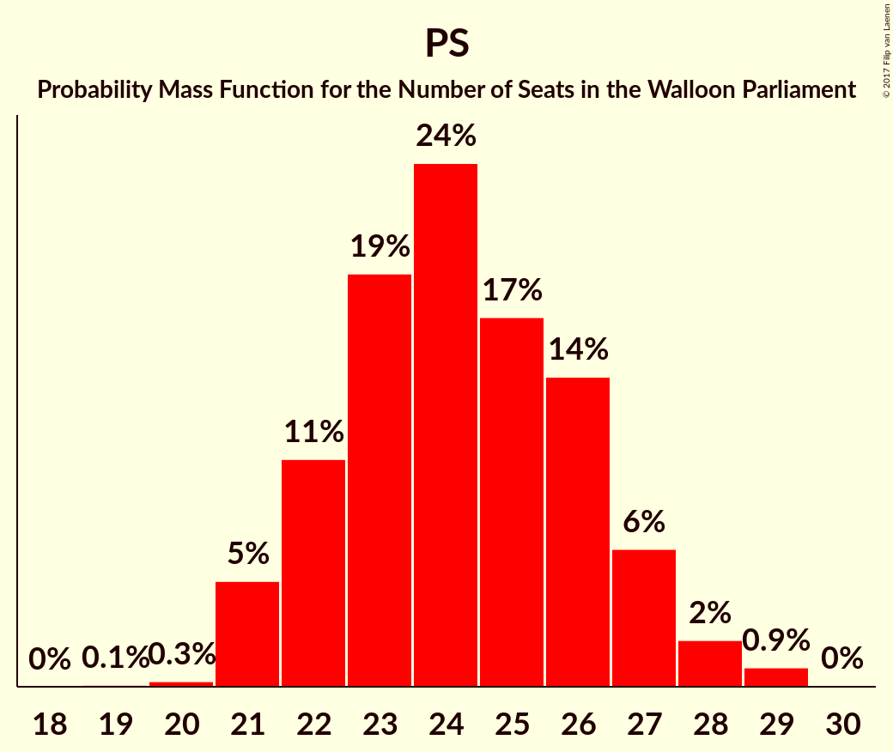
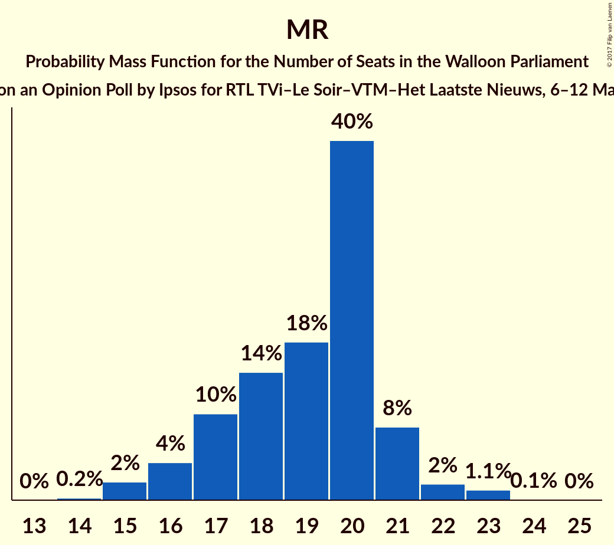
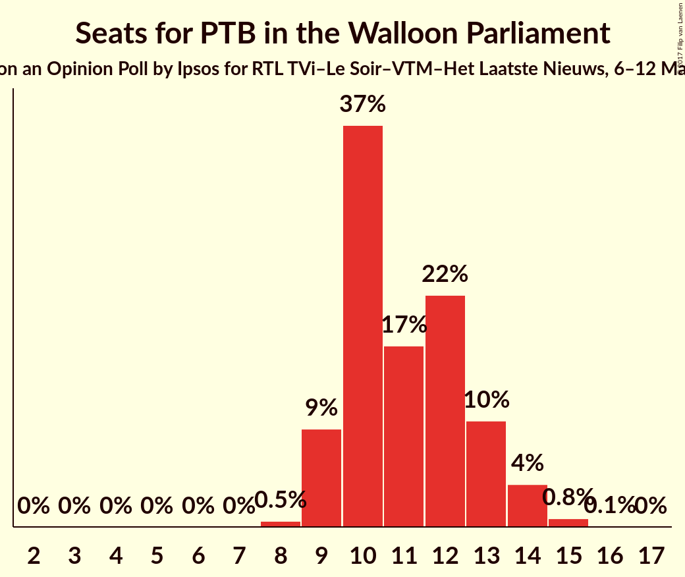
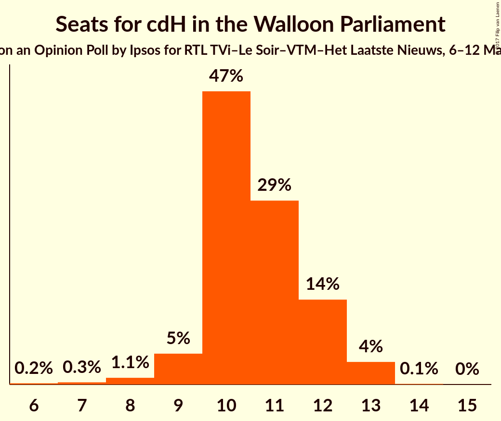
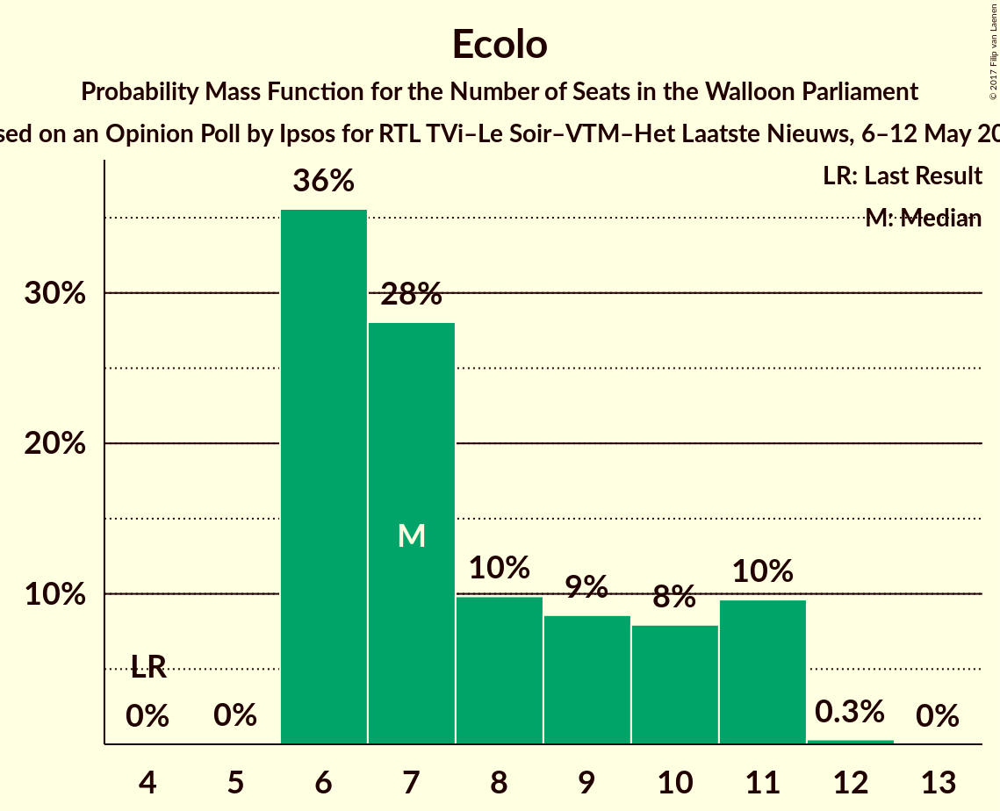
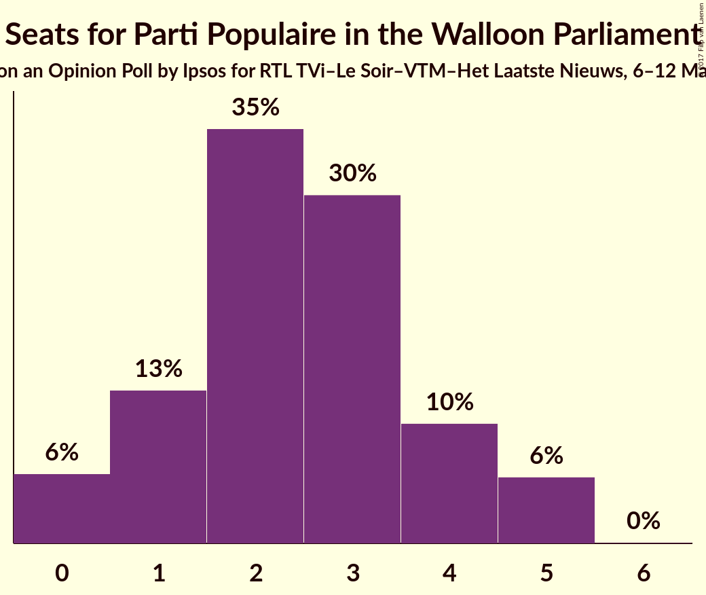
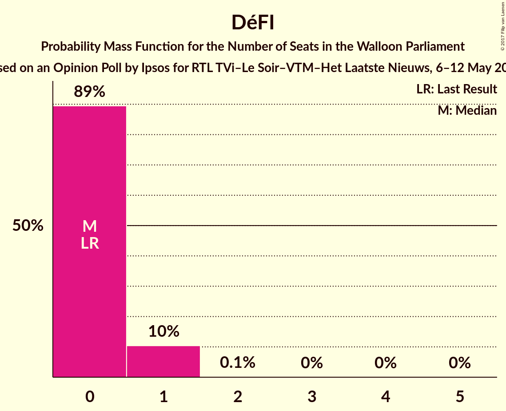
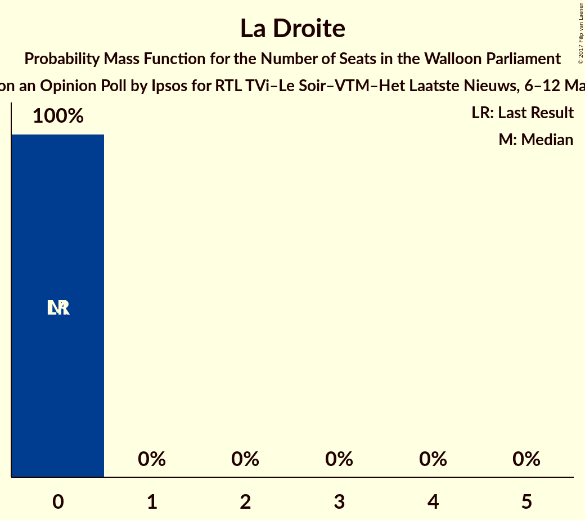

# Opinion Poll by Ipsos for RTL TVi–Le Soir–VTM–Het Laatste Nieuws, 6–12 May 2016

<a href="#voting-intentions">Voting Intentions</a> | <a href="#seats">Seats</a> | <a href="#coalitions">Coalitions</a> | <a href="#technical-information">Technical Information</a>

## Voting Intentions

### Confidence Intervals

| Party | Last Result | Poll Result | 80% Confidence Interval | 90% Confidence Interval | 95% Confidence Interval | 99% Confidence Interval |
|:-----:|:-----------:|:-----------:|:-----------------------:|:-----------------------:|:-----------------------:|:-----------------------:|
| PS | 30.9% | 25.8% | 24.1–27.7% |23.6–28.2% |23.2–28.6% |22.4–29.5% |
| MR | 26.7% | 20.1% | 18.6–21.8% |18.1–22.3% |17.8–22.7% |17.0–23.6% |
| PTB | 5.8% | 13.5% | 12.2–14.9% |11.8–15.3% |11.5–15.7% |10.9–16.4% |
| cdH | 15.2% | 12.0% | 10.7–13.4% |10.4–13.8% |10.1–14.1% |9.5–14.8% |
| Ecolo | 8.6% | 10.1% | 8.9–11.4% |8.6–11.8% |8.4–12.1% |7.8–12.8% |
| Parti Populaire | 4.9% | 5.5% | 4.7–6.5% |4.4–6.8% |4.2–7.1% |3.9–7.6% |
| DéFI | 2.5% | 3.3% | 2.7–4.1% |2.5–4.4% |2.3–4.6% |2.1–5.0% |
| La Droite | 1.4% | 1.9% | 1.4–2.6% |1.3–2.8% |1.2–2.9% |1.0–3.3% |

*Note:* The poll result column reflects the actual value used in the calculations. Published results may vary slightly, and in addition be rounded to fewer digits.

## Seats

### Confidence Intervals

| Party | Last Result | Median | 80% Confidence Interval | 90% Confidence Interval | 95% Confidence Interval | 99% Confidence Interval |
|:-----:|:-----------:|:------:|:-----------------------:|:-----------------------:|:-----------------------:|:-----------------------:|
| <a href="#ps">PS</a> | 30 | 24 | 22–26 |21–27 |21–28 |21–29 |
| <a href="#mr">MR</a> | 25 | 20 | 17–21 |16–21 |16–22 |15–23 |
| <a href="#ptb">PTB</a> | 2 | 11 | 10–13 |9–13 |9–14 |8–15 |
| <a href="#cdh">cdH</a> | 13 | 10 | 10–12 |9–12 |9–13 |7–13 |
| <a href="#ecolo">Ecolo</a> | 4 | 7 | 6–10 |6–11 |6–11 |6–11 |
| <a href="#parti-populaire">Parti Populaire</a> | 1 | 2 | 1–4 |0–5 |0–5 |0–5 |
| <a href="#défi">DéFI</a> | 0 | 0 | 0–1 |0–1 |0–1 |0–1 |
| <a href="#la-droite">La Droite</a> | 0 | 0 | 0 |0 |0 |0 |

### PS

*For a full overview of the results for this party, see the [PS](party-ps.html) page.*

| Number of Seats | Probability | Accumulated | Special Marks |
|:---------------:|:-----------:|:-----------:|:-------------:|
| 19 | 0.1% | 100% |  |
| 20 | 0.3% | 99.9% |  |
| 21 | 5% | 99.7% |  |
| 22 | 11% | 95% |  |
| 23 | 19% | 84% |  |
| 24 | 24% | 65% | Median |
| 25 | 17% | 41% |  |
| 26 | 14% | 24% |  |
| 27 | 6% | 9% |  |
| 28 | 2% | 3% |  |
| 29 | 0.9% | 0.9% |  |
| 30 | 0% | 0% | Last Result |

### MR

*For a full overview of the results for this party, see the [MR](party-mr.html) page.*

| Number of Seats | Probability | Accumulated | Special Marks |
|:---------------:|:-----------:|:-----------:|:-------------:|
| 14 | 0.2% | 100% |  |
| 15 | 2% | 99.8% |  |
| 16 | 4% | 98% |  |
| 17 | 10% | 93% |  |
| 18 | 14% | 84% |  |
| 19 | 18% | 69% |  |
| 20 | 40% | 52% | Median |
| 21 | 8% | 11% |  |
| 22 | 2% | 3% |  |
| 23 | 1.1% | 1.2% |  |
| 24 | 0.1% | 0.1% |  |
| 25 | 0% | 0% | Last Result |

### PTB

*For a full overview of the results for this party, see the [PTB](party-ptb.html) page.*

| Number of Seats | Probability | Accumulated | Special Marks |
|:---------------:|:-----------:|:-----------:|:-------------:|
| 2 | 0% | 100% | Last Result |
| 3 | 0% | 100% |  |
| 4 | 0% | 100% |  |
| 5 | 0% | 100% |  |
| 6 | 0% | 100% |  |
| 7 | 0% | 100% |  |
| 8 | 0.5% | 100% |  |
| 9 | 9% | 99.4% |  |
| 10 | 37% | 90% |  |
| 11 | 17% | 53% | Median |
| 12 | 22% | 36% |  |
| 13 | 10% | 15% |  |
| 14 | 4% | 5% |  |
| 15 | 0.8% | 0.9% |  |
| 16 | 0.1% | 0.1% |  |
| 17 | 0% | 0% |  |

### cdH

*For a full overview of the results for this party, see the [cdH](party-cdh.html) page.*

| Number of Seats | Probability | Accumulated | Special Marks |
|:---------------:|:-----------:|:-----------:|:-------------:|
| 6 | 0.2% | 100% |  |
| 7 | 0.3% | 99.8% |  |
| 8 | 1.1% | 99.5% |  |
| 9 | 5% | 98% |  |
| 10 | 47% | 93% | Median |
| 11 | 29% | 47% |  |
| 12 | 14% | 17% |  |
| 13 | 4% | 4% | Last Result |
| 14 | 0.1% | 0.1% |  |
| 15 | 0% | 0% |  |

### Ecolo

*For a full overview of the results for this party, see the [Ecolo](party-ecolo.html) page.*

| Number of Seats | Probability | Accumulated | Special Marks |
|:---------------:|:-----------:|:-----------:|:-------------:|
| 4 | 0% | 100% | Last Result |
| 5 | 0% | 100% |  |
| 6 | 36% | 100% |  |
| 7 | 28% | 64% | Median |
| 8 | 10% | 36% |  |
| 9 | 9% | 26% |  |
| 10 | 8% | 18% |  |
| 11 | 10% | 10% |  |
| 12 | 0.3% | 0.3% |  |
| 13 | 0% | 0% |  |

### Parti Populaire

*For a full overview of the results for this party, see the [Parti Populaire](party-partipopulaire.html) page.*

| Number of Seats | Probability | Accumulated | Special Marks |
|:---------------:|:-----------:|:-----------:|:-------------:|
| 0 | 6% | 100% |  |
| 1 | 13% | 94% | Last Result |
| 2 | 35% | 81% | Median |
| 3 | 30% | 46% |  |
| 4 | 10% | 16% |  |
| 5 | 6% | 6% |  |
| 6 | 0% | 0% |  |

### DéFI

*For a full overview of the results for this party, see the [DéFI](party-défi.html) page.*

| Number of Seats | Probability | Accumulated | Special Marks |
|:---------------:|:-----------:|:-----------:|:-------------:|
| 0 | 89% | 100% | Last Result, Median |
| 1 | 10% | 11% |  |
| 2 | 0.1% | 0.1% |  |
| 3 | 0% | 0% |  |

### La Droite

*For a full overview of the results for this party, see the [La Droite](party-ladroite.html) page.*

| Number of Seats | Probability | Accumulated | Special Marks |
|:---------------:|:-----------:|:-----------:|:-------------:|
| 0 | 100% | 100% | Last Result, Median |

## Coalitions

### Confidence Intervals

| Coalition | Last Result | Median | Majority? | 80% Confidence Interval | 90% Confidence Interval | 95% Confidence Interval | 99% Confidence Interval |
|:---------:|:-----------:|:------:|:---------:|:-----------------------:|:-----------------------:|:-----------------------:|:-----------------------:|
| PS – MR – Ecolo | 59 | 51 | 100% | 49–53 | 48–54 | 47–54 | 46–55 |
| PS – PTB – cdH | 45 | 46 | 100% | 43–48 | 43–49 | 42–49 | 41–51 |
| PS – PTB – Ecolo | 36 | 43 | 99.8% | 40–45 | 40–46 | 39–47 | 38–48 |
| PS – MR | 55 | 43 | 99.7% | 41–46 | 40–46 | 39–47 | 38–48 |
| PS – cdH – Ecolo | 47 | 42 | 99.6% | 40–45 | 39–46 | 39–46 | 38–48 |
| MR – cdH – Ecolo | 42 | 37 | 41% | 35–40 | 34–40 | 34–41 | 32–42 |
| PS – PTB | 32 | 35 | 9% | 33–37 | 32–38 | 32–39 | 31–40 |
| PS – cdH | 43 | 35 | 7% | 33–37 | 32–38 | 31–38 | 30–39 |
| MR – cdH | 38 | 30 | 0% | 27–32 | 27–32 | 26–33 | 25–34 |
| MR – Ecolo | 29 | 27 | 0% | 25–29 | 24–30 | 23–30 | 22–31 |

### PS – MR – Ecolo

| Number of Seats | Probability | Accumulated | Special Marks |
|:---------------:|:-----------:|:-----------:|:-------------:|
| 45 | 0.1% | 100% |  |
| 46 | 0.5% | 99.9% |  |
| 47 | 3% | 99.4% |  |
| 48 | 6% | 97% |  |
| 49 | 14% | 91% |  |
| 50 | 16% | 77% |  |
| 51 | 23% | 61% | Median |
| 52 | 19% | 38% |  |
| 53 | 12% | 18% |  |
| 54 | 5% | 6% |  |
| 55 | 1.2% | 2% |  |
| 56 | 0.2% | 0.3% |  |
| 57 | 0% | 0% |  |
| 58 | 0% | 0% |  |
| 59 | 0% | 0% | Last Result |

### PS – PTB – cdH

| Number of Seats | Probability | Accumulated | Special Marks |
|:---------------:|:-----------:|:-----------:|:-------------:|
| 40 | 0.3% | 100% |  |
| 41 | 1.2% | 99.6% |  |
| 42 | 3% | 98% |  |
| 43 | 6% | 96% |  |
| 44 | 13% | 90% |  |
| 45 | 18% | 77% | Last Result, Median |
| 46 | 24% | 59% |  |
| 47 | 19% | 35% |  |
| 48 | 10% | 16% |  |
| 49 | 4% | 6% |  |
| 50 | 1.2% | 2% |  |
| 51 | 0.6% | 0.9% |  |
| 52 | 0.2% | 0.3% |  |
| 53 | 0.1% | 0.1% |  |
| 54 | 0% | 0% |  |

### PS – PTB – Ecolo

| Number of Seats | Probability | Accumulated | Special Marks |
|:---------------:|:-----------:|:-----------:|:-------------:|
| 36 | 0% | 100% | Last Result |
| 37 | 0.2% | 100% |  |
| 38 | 0.8% | 99.8% | Majority |
| 39 | 3% | 99.0% |  |
| 40 | 6% | 96% |  |
| 41 | 14% | 90% |  |
| 42 | 22% | 75% | Median |
| 43 | 19% | 53% |  |
| 44 | 16% | 34% |  |
| 45 | 10% | 18% |  |
| 46 | 5% | 8% |  |
| 47 | 2% | 3% |  |
| 48 | 0.9% | 1.1% |  |
| 49 | 0.2% | 0.3% |  |
| 50 | 0% | 0% |  |

### PS – MR

| Number of Seats | Probability | Accumulated | Special Marks |
|:---------------:|:-----------:|:-----------:|:-------------:|
| 36 | 0% | 100% |  |
| 37 | 0.2% | 99.9% |  |
| 38 | 0.6% | 99.7% | Majority |
| 39 | 3% | 99.1% |  |
| 40 | 6% | 97% |  |
| 41 | 10% | 91% |  |
| 42 | 15% | 81% |  |
| 43 | 16% | 66% |  |
| 44 | 19% | 50% | Median |
| 45 | 16% | 31% |  |
| 46 | 10% | 14% |  |
| 47 | 3% | 5% |  |
| 48 | 1.1% | 1.2% |  |
| 49 | 0.1% | 0.2% |  |
| 50 | 0% | 0% |  |
| 51 | 0% | 0% |  |
| 52 | 0% | 0% |  |
| 53 | 0% | 0% |  |
| 54 | 0% | 0% |  |
| 55 | 0% | 0% | Last Result |

### PS – cdH – Ecolo

| Number of Seats | Probability | Accumulated | Special Marks |
|:---------------:|:-----------:|:-----------:|:-------------:|
| 37 | 0.4% | 100% |  |
| 38 | 2% | 99.6% | Majority |
| 39 | 5% | 98% |  |
| 40 | 12% | 93% |  |
| 41 | 16% | 81% | Median |
| 42 | 19% | 66% |  |
| 43 | 18% | 47% |  |
| 44 | 14% | 28% |  |
| 45 | 8% | 15% |  |
| 46 | 4% | 6% |  |
| 47 | 1.5% | 2% | Last Result |
| 48 | 0.5% | 0.6% |  |
| 49 | 0.1% | 0.1% |  |
| 50 | 0% | 0% |  |

### MR – cdH – Ecolo

| Number of Seats | Probability | Accumulated | Special Marks |
|:---------------:|:-----------:|:-----------:|:-------------:|
| 31 | 0.1% | 100% |  |
| 32 | 0.6% | 99.8% |  |
| 33 | 1.3% | 99.2% |  |
| 34 | 5% | 98% |  |
| 35 | 8% | 93% |  |
| 36 | 15% | 85% |  |
| 37 | 30% | 70% | Median |
| 38 | 17% | 41% | Majority |
| 39 | 12% | 23% |  |
| 40 | 8% | 11% |  |
| 41 | 3% | 4% |  |
| 42 | 0.7% | 0.8% | Last Result |
| 43 | 0.1% | 0.1% |  |
| 44 | 0% | 0% |  |

### PS – PTB

| Number of Seats | Probability | Accumulated | Special Marks |
|:---------------:|:-----------:|:-----------:|:-------------:|
| 30 | 0.3% | 100% |  |
| 31 | 2% | 99.6% |  |
| 32 | 4% | 98% | Last Result |
| 33 | 12% | 93% |  |
| 34 | 14% | 81% |  |
| 35 | 22% | 67% | Median |
| 36 | 22% | 45% |  |
| 37 | 13% | 23% |  |
| 38 | 6% | 9% | Majority |
| 39 | 2% | 4% |  |
| 40 | 0.9% | 1.3% |  |
| 41 | 0.3% | 0.4% |  |
| 42 | 0.1% | 0.1% |  |
| 43 | 0% | 0% |  |

### PS – cdH

| Number of Seats | Probability | Accumulated | Special Marks |
|:---------------:|:-----------:|:-----------:|:-------------:|
| 29 | 0.1% | 100% |  |
| 30 | 0.7% | 99.9% |  |
| 31 | 3% | 99.2% |  |
| 32 | 6% | 96% |  |
| 33 | 12% | 90% |  |
| 34 | 25% | 78% | Median |
| 35 | 18% | 53% |  |
| 36 | 16% | 35% |  |
| 37 | 12% | 19% |  |
| 38 | 5% | 7% | Majority |
| 39 | 2% | 2% |  |
| 40 | 0.4% | 0.4% |  |
| 41 | 0.1% | 0.1% |  |
| 42 | 0% | 0% |  |
| 43 | 0% | 0% | Last Result |

### MR – cdH

| Number of Seats | Probability | Accumulated | Special Marks |
|:---------------:|:-----------:|:-----------:|:-------------:|
| 24 | 0.2% | 100% |  |
| 25 | 1.0% | 99.8% |  |
| 26 | 3% | 98.7% |  |
| 27 | 8% | 96% |  |
| 28 | 13% | 88% |  |
| 29 | 15% | 75% |  |
| 30 | 27% | 61% | Median |
| 31 | 22% | 34% |  |
| 32 | 7% | 12% |  |
| 33 | 4% | 5% |  |
| 34 | 0.8% | 1.1% |  |
| 35 | 0.2% | 0.2% |  |
| 36 | 0% | 0% |  |
| 37 | 0% | 0% |  |
| 38 | 0% | 0% | Last Result, Majority |

### MR – Ecolo

| Number of Seats | Probability | Accumulated | Special Marks |
|:---------------:|:-----------:|:-----------:|:-------------:|
| 20 | 0.1% | 100% |  |
| 21 | 0.3% | 99.9% |  |
| 22 | 1.0% | 99.6% |  |
| 23 | 2% | 98.6% |  |
| 24 | 7% | 97% |  |
| 25 | 12% | 90% |  |
| 26 | 24% | 78% |  |
| 27 | 27% | 54% | Median |
| 28 | 14% | 27% |  |
| 29 | 8% | 14% | Last Result |
| 30 | 4% | 6% |  |
| 31 | 1.5% | 2% |  |
| 32 | 0.4% | 0.5% |  |
| 33 | 0.1% | 0.1% |  |
| 34 | 0% | 0% |  |

## Technical Information

### Opinion Poll

+ **Polling firm:** Ipsos
+ **Commissioner(s):** RTL TVi–Le Soir–VTM–Het Laatste Nieuws
+ **Fieldwork period:** 6–12 May 2016

### Calculations

+ **Sample size:** 1003
+ **Simulations done:** 2,097,152
+ **Error estimate:** 0.69%

