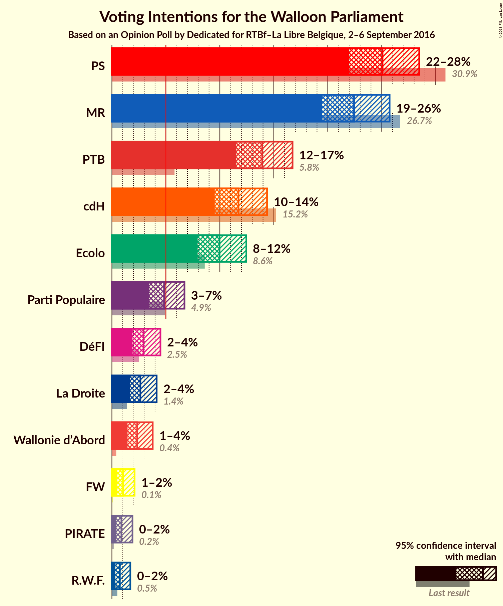
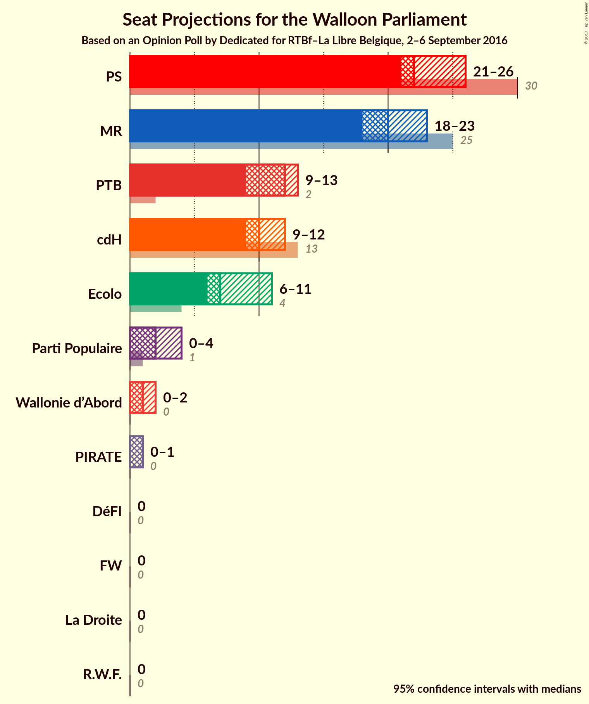
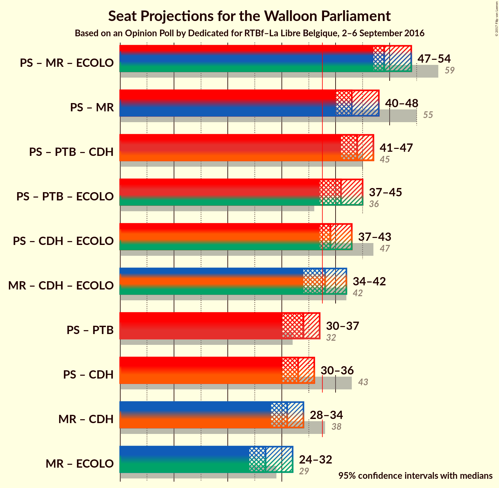

# Opinion Poll by Dedicated for RTBf–La Libre Belgique, 2–6 September 2016

<a href="#voting-intentions">Voting Intentions</a> | <a href="#seats">Seats</a> | <a href="#coalitions">Coalitions</a> | <a href="#technical-information">Technical Information</a>

## Voting Intentions

### Confidence Intervals

| Party | Last Result | Poll Result | 80% Confidence Interval | 90% Confidence Interval | 95% Confidence Interval | 99% Confidence Interval |
|:-----:|:-----------:|:-----------:|:-----------------------:|:-----------------------:|:-----------------------:|:-----------------------:|
| PS | 30.9% | 25.1% | 23.0–27.3% |22.5–27.9% |22.0–28.5% |21.0–29.6% |
| MR | 26.7% | 22.4% | 20.5–24.6% |19.9–25.2% |19.5–25.7% |18.5–26.8% |
| PTB | 5.8% | 13.9% | 12.3–15.8% |11.9–16.3% |11.5–16.7% |10.8–17.6% |
| cdH | 15.2% | 11.7% | 10.3–13.5% |9.9–13.9% |9.5–14.4% |8.9–15.2% |
| Ecolo | 8.6% | 10.0% | 8.6–11.6% |8.3–12.1% |7.9–12.5% |7.3–13.3% |
| Parti Populaire | 4.9% | 4.8% | 3.9–6.1% |3.7–6.4% |3.5–6.7% |3.1–7.4% |
| DéFI | 2.5% | 2.9% | 2.3–3.9% |2.1–4.2% |1.9–4.5% |1.6–5.0% |
| La Droite | 1.4% | 2.6% | 2.0–3.6% |1.8–3.9% |1.7–4.1% |1.4–4.7% |
| Wallonie d’Abord | 0.4% | 2.3% | 1.8–3.3% |1.6–3.6% |1.4–3.8% |1.2–4.3% |
| FW | 0.1% | 1.0% | 0.7–1.7% |0.6–1.9% |0.5–2.1% |0.4–2.5% |
| PIRATE | 0.2% | 0.9% | 0.6–1.5% |0.5–1.7% |0.4–1.9% |0.3–2.3% |
| R.W.F. | 0.5% | 0.7% | 0.5–1.4% |0.4–1.5% |0.3–1.7% |0.2–2.1% |

*Note:* The poll result column reflects the actual value used in the calculations. Published results may vary slightly, and in addition be rounded to fewer digits.

## Seats

### Confidence Intervals

| Party | Last Result | Median | 80% Confidence Interval | 90% Confidence Interval | 95% Confidence Interval | 99% Confidence Interval |
|:-----:|:-----------:|:------:|:-----------------------:|:-----------------------:|:-----------------------:|:-----------------------:|
| <a href="#ps">PS</a> | 30 | 24 | 23–24 |21–24 |21–24 |19–26 |
| <a href="#mr">MR</a> | 25 | 18 | 18–20 |18–21 |18–23 |18–24 |
| <a href="#ptb">PTB</a> | 2 | 12 | 12 |11–12 |10–13 |9–14 |
| <a href="#cdh">cdH</a> | 13 | 10 | 10 |10 |9–11 |7–12 |
| <a href="#ecolo">Ecolo</a> | 4 | 7 | 7 |6–8 |6–9 |6–11 |
| <a href="#parti-populaire">Parti Populaire</a> | 1 | 3 | 2–3 |0–3 |0–4 |0–5 |
| <a href="#défi">DéFI</a> | 0 | 0 | 0 |0 |0 |0 |
| <a href="#la-droite">La Droite</a> | 0 | 0 | 0 |0 |0 |0 |
| <a href="#wallonie-d’abord">Wallonie d’Abord</a> | 0 | 0 | 0–1 |0–1 |0–1 |0–2 |
| <a href="#fw">FW</a> | 0 | 0 | 0 |0 |0 |0 |
| <a href="#pirate">PIRATE</a> | 0 | 1 | 1 |1 |1 |0–1 |
| <a href="#r.w.f.">R.W.F.</a> | 0 | 0 | 0 |0 |0 |0 |

### PS

*For a full overview of the results for this party, see the [PS](party-ps.html) page.*

| Number of Seats | Probability | Accumulated | Special Marks |
|:---------------:|:-----------:|:-----------:|:-------------:|
| 18 | 0.1% | 100% |  |
| 19 | 0.5% | 99.9% |  |
| 20 | 0.6% | 99.5% |  |
| 21 | 5% | 98.9% |  |
| 22 | 0.7% | 94% |  |
| 23 | 4% | 94% |  |
| 24 | 87% | 89% | Median |
| 25 | 0.2% | 2% |  |
| 26 | 2% | 2% |  |
| 27 | 0.2% | 0.3% |  |
| 28 | 0% | 0% |  |
| 29 | 0% | 0% |  |
| 30 | 0% | 0% | Last Result |

### MR

*For a full overview of the results for this party, see the [MR](party-mr.html) page.*

| Number of Seats | Probability | Accumulated | Special Marks |
|:---------------:|:-----------:|:-----------:|:-------------:|
| 16 | 0% | 100% |  |
| 17 | 0.3% | 99.9% |  |
| 18 | 89% | 99.7% | Median |
| 19 | 0.5% | 11% |  |
| 20 | 5% | 11% |  |
| 21 | 0.9% | 5% |  |
| 22 | 2% | 5% |  |
| 23 | 2% | 3% |  |
| 24 | 1.2% | 1.3% |  |
| 25 | 0% | 0.1% | Last Result |
| 26 | 0.1% | 0.1% |  |
| 27 | 0% | 0% |  |

### PTB

*For a full overview of the results for this party, see the [PTB](party-ptb.html) page.*

| Number of Seats | Probability | Accumulated | Special Marks |
|:---------------:|:-----------:|:-----------:|:-------------:|
| 2 | 0% | 100% | Last Result |
| 3 | 0% | 100% |  |
| 4 | 0% | 100% |  |
| 5 | 0% | 100% |  |
| 6 | 0% | 100% |  |
| 7 | 0% | 100% |  |
| 8 | 0.1% | 100% |  |
| 9 | 2% | 99.9% |  |
| 10 | 2% | 98% |  |
| 11 | 2% | 96% |  |
| 12 | 90% | 94% | Median |
| 13 | 3% | 4% |  |
| 14 | 0.4% | 0.5% |  |
| 15 | 0.1% | 0.1% |  |
| 16 | 0% | 0% |  |

### cdH

*For a full overview of the results for this party, see the [cdH](party-cdh.html) page.*

| Number of Seats | Probability | Accumulated | Special Marks |
|:---------------:|:-----------:|:-----------:|:-------------:|
| 6 | 0.2% | 100% |  |
| 7 | 0.4% | 99.7% |  |
| 8 | 0.2% | 99.4% |  |
| 9 | 2% | 99.1% |  |
| 10 | 93% | 97% | Median |
| 11 | 3% | 4% |  |
| 12 | 0.9% | 1.1% |  |
| 13 | 0.1% | 0.2% | Last Result |
| 14 | 0% | 0% |  |

### Ecolo

*For a full overview of the results for this party, see the [Ecolo](party-ecolo.html) page.*

| Number of Seats | Probability | Accumulated | Special Marks |
|:---------------:|:-----------:|:-----------:|:-------------:|
| 4 | 0% | 100% | Last Result |
| 5 | 0% | 100% |  |
| 6 | 7% | 99.9% |  |
| 7 | 87% | 92% | Median |
| 8 | 1.0% | 5% |  |
| 9 | 3% | 4% |  |
| 10 | 0.5% | 1.1% |  |
| 11 | 0.5% | 0.6% |  |
| 12 | 0% | 0% |  |

### Parti Populaire

*For a full overview of the results for this party, see the [Parti Populaire](party-partipopulaire.html) page.*

| Number of Seats | Probability | Accumulated | Special Marks |
|:---------------:|:-----------:|:-----------:|:-------------:|
| 0 | 6% | 100% |  |
| 1 | 4% | 94% | Last Result |
| 2 | 0.6% | 90% |  |
| 3 | 86% | 89% | Median |
| 4 | 3% | 3% |  |
| 5 | 0.5% | 0.5% |  |
| 6 | 0% | 0% |  |

### DéFI

*For a full overview of the results for this party, see the [DéFI](party-dfi.html) page.*

| Number of Seats | Probability | Accumulated | Special Marks |
|:---------------:|:-----------:|:-----------:|:-------------:|
| 0 | 99.7% | 100% | Last Result, Median |
| 1 | 0.3% | 0.3% |  |
| 2 | 0% | 0% |  |

### La Droite

*For a full overview of the results for this party, see the [La Droite](party-ladroite.html) page.*

| Number of Seats | Probability | Accumulated | Special Marks |
|:---------------:|:-----------:|:-----------:|:-------------:|
| 0 | 100% | 100% | Last Result, Median |

### Wallonie d’Abord

*For a full overview of the results for this party, see the [Wallonie d’Abord](party-walloniedabord.html) page.*

| Number of Seats | Probability | Accumulated | Special Marks |
|:---------------:|:-----------:|:-----------:|:-------------:|
| 0 | 90% | 100% | Last Result, Median |
| 1 | 8% | 10% |  |
| 2 | 2% | 2% |  |
| 3 | 0% | 0% |  |

### FW

*For a full overview of the results for this party, see the [FW](party-fw.html) page.*

| Number of Seats | Probability | Accumulated | Special Marks |
|:---------------:|:-----------:|:-----------:|:-------------:|
| 0 | 100% | 100% | Last Result, Median |

### PIRATE

*For a full overview of the results for this party, see the [PIRATE](party-pirate.html) page.*

| Number of Seats | Probability | Accumulated | Special Marks |
|:---------------:|:-----------:|:-----------:|:-------------:|
| 0 | 2% | 100% | Last Result |
| 1 | 98% | 98% | Median |
| 2 | 0.3% | 0.3% |  |
| 3 | 0% | 0% |  |

### R.W.F.

*For a full overview of the results for this party, see the [R.W.F.](party-rwf.html) page.*

| Number of Seats | Probability | Accumulated | Special Marks |
|:---------------:|:-----------:|:-----------:|:-------------:|
| 0 | 100% | 100% | Last Result, Median |

## Coalitions

### Confidence Intervals

| Coalition | Last Result | Median | Majority? | 80% Confidence Interval | 90% Confidence Interval | 95% Confidence Interval | 99% Confidence Interval |
|:---------:|:-----------:|:------:|:---------:|:-----------------------:|:-----------------------:|:-----------------------:|:-----------------------:|
| PS – MR – Ecolo | 59 | 49 | 100% | 49–50 | 49–51 | 47–53 | 47–54 |
| PS – PTB – cdH | 45 | 46 | 100% | 45–46 | 44–46 | 42–46 | 41–46 |
| PS – MR | 55 | 42 | 100% | 42 | 41–45 | 41–46 | 40–47 |
| PS – PTB – Ecolo | 36 | 43 | 98.6% | 43 | 40–44 | 39–44 | 37–45 |
| PS – cdH – Ecolo | 47 | 41 | 96% | 41 | 38–42 | 37–42 | 37–43 |
| MR – cdH – Ecolo | 42 | 35 | 6% | 35–36 | 35–38 | 35–40 | 34–42 |
| PS – PTB | 32 | 36 | 0.3% | 35–36 | 34–36 | 32–36 | 30–37 |
| PS – cdH | 43 | 34 | 0% | 33–34 | 32–34 | 31–35 | 30–35 |
| MR – cdH | 38 | 28 | 0% | 28–29 | 28–31 | 28–34 | 27–35 |
| MR – Ecolo | 29 | 25 | 0% | 25–27 | 25–28 | 25–30 | 25–31 |

### PS – MR – Ecolo

| Number of Seats | Probability | Accumulated | Special Marks |
|:---------------:|:-----------:|:-----------:|:-------------:|
| 46 | 0% | 100% |  |
| 47 | 3% | 99.9% |  |
| 48 | 0.5% | 97% |  |
| 49 | 86% | 96% | Median |
| 50 | 4% | 10% |  |
| 51 | 3% | 7% |  |
| 52 | 0.2% | 4% |  |
| 53 | 3% | 4% |  |
| 54 | 0.3% | 0.6% |  |
| 55 | 0.1% | 0.3% |  |
| 56 | 0% | 0.2% |  |
| 57 | 0.2% | 0.2% |  |
| 58 | 0% | 0% |  |
| 59 | 0% | 0% | Last Result |

### PS – PTB – cdH

| Number of Seats | Probability | Accumulated | Special Marks |
|:---------------:|:-----------:|:-----------:|:-------------:|
| 40 | 0.4% | 100% |  |
| 41 | 0.5% | 99.6% |  |
| 42 | 2% | 99.1% |  |
| 43 | 0.6% | 97% |  |
| 44 | 5% | 97% |  |
| 45 | 4% | 92% | Last Result |
| 46 | 87% | 88% | Median |
| 47 | 0.3% | 0.4% |  |
| 48 | 0.1% | 0.1% |  |
| 49 | 0% | 0% |  |

### PS – MR

| Number of Seats | Probability | Accumulated | Special Marks |
|:---------------:|:-----------:|:-----------:|:-------------:|
| 39 | 0.3% | 100% |  |
| 40 | 0.6% | 99.7% |  |
| 41 | 7% | 99.1% |  |
| 42 | 86% | 93% | Median |
| 43 | 0.9% | 7% |  |
| 44 | 0.4% | 6% |  |
| 45 | 2% | 6% |  |
| 46 | 2% | 4% |  |
| 47 | 1.5% | 2% |  |
| 48 | 0.3% | 0.3% |  |
| 49 | 0.1% | 0.1% |  |
| 50 | 0% | 0% |  |
| 51 | 0% | 0% |  |
| 52 | 0% | 0% |  |
| 53 | 0% | 0% |  |
| 54 | 0% | 0% |  |
| 55 | 0% | 0% | Last Result |

### PS – PTB – Ecolo

| Number of Seats | Probability | Accumulated | Special Marks |
|:---------------:|:-----------:|:-----------:|:-------------:|
| 36 | 0% | 100% | Last Result |
| 37 | 1.3% | 99.9% |  |
| 38 | 0.2% | 98.6% | Majority |
| 39 | 2% | 98% |  |
| 40 | 4% | 97% |  |
| 41 | 2% | 93% |  |
| 42 | 0.5% | 92% |  |
| 43 | 86% | 91% | Median |
| 44 | 5% | 5% |  |
| 45 | 0.6% | 0.7% |  |
| 46 | 0% | 0% |  |

### PS – cdH – Ecolo

| Number of Seats | Probability | Accumulated | Special Marks |
|:---------------:|:-----------:|:-----------:|:-------------:|
| 35 | 0.2% | 100% |  |
| 36 | 0.1% | 99.8% |  |
| 37 | 3% | 99.7% |  |
| 38 | 1.4% | 96% | Majority |
| 39 | 2% | 95% |  |
| 40 | 0.8% | 93% |  |
| 41 | 87% | 93% | Median |
| 42 | 5% | 6% |  |
| 43 | 0.3% | 0.7% |  |
| 44 | 0.2% | 0.4% |  |
| 45 | 0.2% | 0.2% |  |
| 46 | 0% | 0% |  |
| 47 | 0% | 0% | Last Result |

### MR – cdH – Ecolo

| Number of Seats | Probability | Accumulated | Special Marks |
|:---------------:|:-----------:|:-----------:|:-------------:|
| 33 | 0.3% | 100% |  |
| 34 | 0.3% | 99.6% |  |
| 35 | 85% | 99.4% | Median |
| 36 | 5% | 14% |  |
| 37 | 3% | 9% |  |
| 38 | 1.3% | 6% | Majority |
| 39 | 0.5% | 5% |  |
| 40 | 2% | 4% |  |
| 41 | 1.4% | 2% |  |
| 42 | 0.6% | 0.7% | Last Result |
| 43 | 0.1% | 0.1% |  |
| 44 | 0% | 0% |  |

### PS – PTB

| Number of Seats | Probability | Accumulated | Special Marks |
|:---------------:|:-----------:|:-----------:|:-------------:|
| 30 | 0.5% | 100% |  |
| 31 | 2% | 99.5% |  |
| 32 | 0.8% | 98% | Last Result |
| 33 | 2% | 97% |  |
| 34 | 4% | 96% |  |
| 35 | 5% | 92% |  |
| 36 | 85% | 87% | Median |
| 37 | 2% | 2% |  |
| 38 | 0.3% | 0.3% | Majority |
| 39 | 0% | 0% |  |

### PS – cdH

| Number of Seats | Probability | Accumulated | Special Marks |
|:---------------:|:-----------:|:-----------:|:-------------:|
| 28 | 0% | 100% |  |
| 29 | 0.4% | 99.9% |  |
| 30 | 0.3% | 99.6% |  |
| 31 | 4% | 99.3% |  |
| 32 | 2% | 95% |  |
| 33 | 4% | 93% |  |
| 34 | 86% | 89% | Median |
| 35 | 3% | 3% |  |
| 36 | 0.3% | 0.4% |  |
| 37 | 0% | 0.1% |  |
| 38 | 0% | 0% | Majority |
| 39 | 0% | 0% |  |
| 40 | 0% | 0% |  |
| 41 | 0% | 0% |  |
| 42 | 0% | 0% |  |
| 43 | 0% | 0% | Last Result |

### MR – cdH

| Number of Seats | Probability | Accumulated | Special Marks |
|:---------------:|:-----------:|:-----------:|:-------------:|
| 26 | 0.2% | 100% |  |
| 27 | 0.6% | 99.8% |  |
| 28 | 89% | 99.2% | Median |
| 29 | 2% | 11% |  |
| 30 | 3% | 9% |  |
| 31 | 0.4% | 5% |  |
| 32 | 1.3% | 5% |  |
| 33 | 0.4% | 4% |  |
| 34 | 2% | 3% |  |
| 35 | 1.2% | 1.4% |  |
| 36 | 0.2% | 0.2% |  |
| 37 | 0% | 0% |  |
| 38 | 0% | 0% | Last Result, Majority |

### MR – Ecolo

| Number of Seats | Probability | Accumulated | Special Marks |
|:---------------:|:-----------:|:-----------:|:-------------:|
| 23 | 0% | 100% |  |
| 24 | 0% | 99.9% |  |
| 25 | 85% | 99.9% | Median |
| 26 | 3% | 15% |  |
| 27 | 5% | 11% |  |
| 28 | 2% | 6% |  |
| 29 | 2% | 4% | Last Result |
| 30 | 2% | 3% |  |
| 31 | 0.3% | 0.6% |  |
| 32 | 0.2% | 0.2% |  |
| 33 | 0% | 0% |  |

## Technical Information

### Opinion Poll

+ **Pollster:** Dedicated
+ **Media:** RTBf–La Libre Belgique
+ **Fieldwork period:** 2–6 September 2016

### Calculations

+ **Sample size:** 682
+ **Simulations done:** 524,288
+ **Error estimate:** 2.41%

