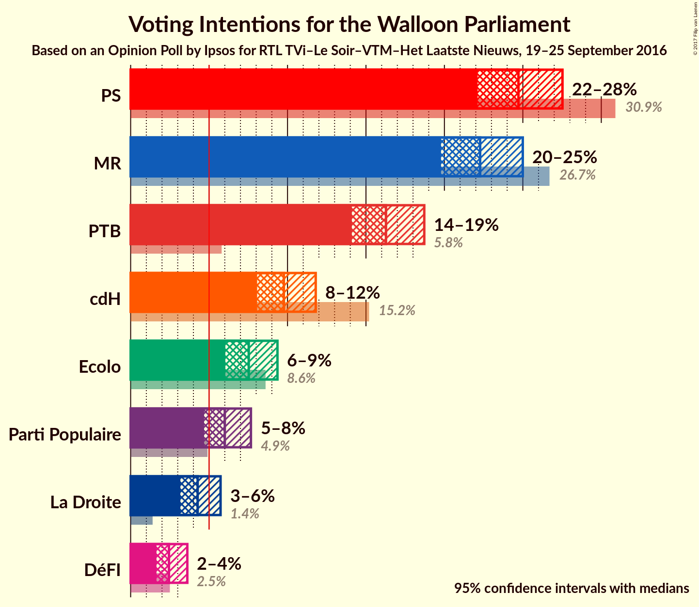
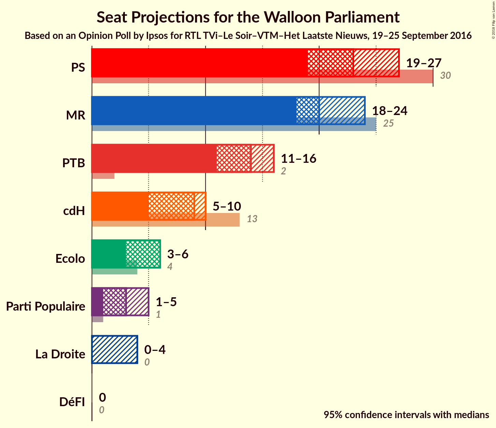
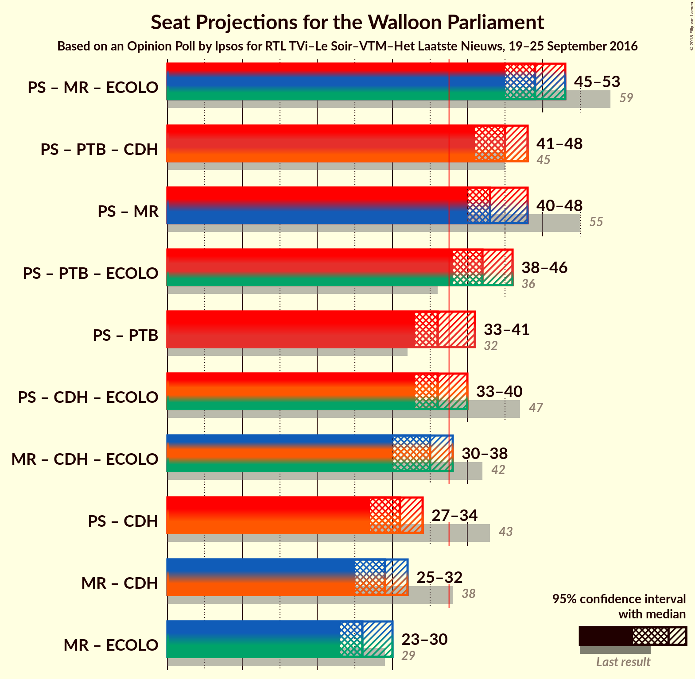

# Opinion Poll by Ipsos for RTL TVi–Le Soir–VTM–Het Laatste Nieuws, 19–25 September 2016

<a href="#voting-intentions">Voting Intentions</a> | <a href="#seats">Seats</a> | <a href="#coalitions">Coalitions</a> | <a href="#technical-information">Technical Information</a>

## Voting Intentions

### Confidence Intervals

| Party | Last Result | Poll Result | 80% Confidence Interval | 90% Confidence Interval | 95% Confidence Interval | 99% Confidence Interval |
|:-----:|:-----------:|:-----------:|:-----------------------:|:-----------------------:|:-----------------------:|:-----------------------:|
| PS | 30.9% | 24.7% | 23.0–26.6% |22.5–27.1% |22.1–27.5% |21.3–28.4% |
| MR | 26.7% | 22.3% | 20.6–24.1% |20.2–24.6% |19.8–25.0% |19.0–25.9% |
| PTB | 5.8% | 16.3% | 14.8–17.9% |14.4–18.3% |14.1–18.7% |13.4–19.5% |
| cdH | 15.2% | 9.8% | 8.6–11.1% |8.3–11.5% |8.1–11.8% |7.5–12.5% |
| Ecolo | 8.6% | 7.5% | 6.5–8.7% |6.3–9.1% |6.0–9.4% |5.6–10.0% |
| Parti Populaire | 4.9% | 6.0% | 5.1–7.1% |4.9–7.4% |4.7–7.7% |4.3–8.2% |
| La Droite | 1.4% | 4.3% | 3.6–5.2% |3.3–5.5% |3.2–5.7% |2.9–6.2% |
| DéFI | 2.5% | 2.4% | 1.9–3.2% |1.8–3.4% |1.6–3.6% |1.4–4.0% |

*Note:* The poll result column reflects the actual value used in the calculations. Published results may vary slightly, and in addition be rounded to fewer digits.

## Seats

### Confidence Intervals

| Party | Last Result | Median | 80% Confidence Interval | 90% Confidence Interval | 95% Confidence Interval | 99% Confidence Interval |
|:-----:|:-----------:|:------:|:-----------------------:|:-----------------------:|:-----------------------:|:-----------------------:|
| <a href="#ps">PS</a> | 30 | 23 | 21–25 |20–26 |19–27 |19–27 |
| <a href="#mr">MR</a> | 25 | 20 | 20–23 |19–23 |18–24 |17–25 |
| <a href="#ptb">PTB</a> | 2 | 14 | 12–16 |12–16 |11–16 |10–17 |
| <a href="#cdh">cdH</a> | 13 | 9 | 6–10 |5–10 |5–10 |5–11 |
| <a href="#ecolo">Ecolo</a> | 4 | 6 | 4–6 |3–6 |3–6 |2–7 |
| <a href="#parti-populaire">Parti Populaire</a> | 1 | 3 | 2–5 |1–5 |1–5 |0–5 |
| <a href="#la-droite">La Droite</a> | 0 | 0 | 0–3 |0–4 |0–4 |0–4 |
| <a href="#défi">DéFI</a> | 0 | 0 | 0 |0 |0 |0 |

### PS

*For a full overview of the results for this party, see the [PS](party-ps.html) page.*

| Number of Seats | Probability | Accumulated | Special Marks |
|:---------------:|:-----------:|:-----------:|:-------------:|
| 17 | 0.1% | 100% |  |
| 18 | 0.3% | 99.9% |  |
| 19 | 3% | 99.6% |  |
| 20 | 4% | 96% |  |
| 21 | 26% | 92% |  |
| 22 | 16% | 66% |  |
| 23 | 20% | 50% | Median |
| 24 | 15% | 30% |  |
| 25 | 8% | 15% |  |
| 26 | 4% | 7% |  |
| 27 | 2% | 3% |  |
| 28 | 0.1% | 0.2% |  |
| 29 | 0% | 0% |  |
| 30 | 0% | 0% | Last Result |

### MR

*For a full overview of the results for this party, see the [MR](party-mr.html) page.*

| Number of Seats | Probability | Accumulated | Special Marks |
|:---------------:|:-----------:|:-----------:|:-------------:|
| 16 | 0.1% | 100% |  |
| 17 | 0.6% | 99.8% |  |
| 18 | 2% | 99.3% |  |
| 19 | 6% | 97% |  |
| 20 | 47% | 91% | Median |
| 21 | 19% | 44% |  |
| 22 | 15% | 25% |  |
| 23 | 6% | 11% |  |
| 24 | 4% | 5% |  |
| 25 | 0.6% | 0.8% | Last Result |
| 26 | 0.2% | 0.2% |  |
| 27 | 0.1% | 0.1% |  |
| 28 | 0% | 0% |  |

### PTB

*For a full overview of the results for this party, see the [PTB](party-ptb.html) page.*

| Number of Seats | Probability | Accumulated | Special Marks |
|:---------------:|:-----------:|:-----------:|:-------------:|
| 2 | 0% | 100% | Last Result |
| 3 | 0% | 100% |  |
| 4 | 0% | 100% |  |
| 5 | 0% | 100% |  |
| 6 | 0% | 100% |  |
| 7 | 0% | 100% |  |
| 8 | 0% | 100% |  |
| 9 | 0% | 100% |  |
| 10 | 2% | 100% |  |
| 11 | 3% | 98% |  |
| 12 | 8% | 95% |  |
| 13 | 17% | 87% |  |
| 14 | 30% | 70% | Median |
| 15 | 27% | 40% |  |
| 16 | 12% | 13% |  |
| 17 | 1.0% | 1.2% |  |
| 18 | 0.1% | 0.1% |  |
| 19 | 0% | 0% |  |

### cdH

*For a full overview of the results for this party, see the [cdH](party-cdh.html) page.*

| Number of Seats | Probability | Accumulated | Special Marks |
|:---------------:|:-----------:|:-----------:|:-------------:|
| 5 | 6% | 100% |  |
| 6 | 20% | 94% |  |
| 7 | 11% | 74% |  |
| 8 | 12% | 63% |  |
| 9 | 14% | 51% | Median |
| 10 | 36% | 37% |  |
| 11 | 0.6% | 0.7% |  |
| 12 | 0.1% | 0.1% |  |
| 13 | 0% | 0% | Last Result |

### Ecolo

*For a full overview of the results for this party, see the [Ecolo](party-ecolo.html) page.*

| Number of Seats | Probability | Accumulated | Special Marks |
|:---------------:|:-----------:|:-----------:|:-------------:|
| 1 | 0.3% | 100% |  |
| 2 | 0.5% | 99.7% |  |
| 3 | 6% | 99.2% |  |
| 4 | 7% | 93% | Last Result |
| 5 | 22% | 86% |  |
| 6 | 63% | 65% | Median |
| 7 | 1.3% | 2% |  |
| 8 | 0.2% | 0.3% |  |
| 9 | 0% | 0.1% |  |
| 10 | 0% | 0% |  |

### Parti Populaire

*For a full overview of the results for this party, see the [Parti Populaire](party-partipopulaire.html) page.*

| Number of Seats | Probability | Accumulated | Special Marks |
|:---------------:|:-----------:|:-----------:|:-------------:|
| 0 | 2% | 100% |  |
| 1 | 5% | 98% | Last Result |
| 2 | 24% | 93% |  |
| 3 | 36% | 69% | Median |
| 4 | 19% | 33% |  |
| 5 | 14% | 14% |  |
| 6 | 0.2% | 0.2% |  |
| 7 | 0% | 0% |  |

### La Droite

*For a full overview of the results for this party, see the [La Droite](party-ladroite.html) page.*

| Number of Seats | Probability | Accumulated | Special Marks |
|:---------------:|:-----------:|:-----------:|:-------------:|
| 0 | 64% | 100% | Last Result, Median |
| 1 | 2% | 36% |  |
| 2 | 19% | 33% |  |
| 3 | 6% | 14% |  |
| 4 | 8% | 8% |  |
| 5 | 0.2% | 0.2% |  |
| 6 | 0% | 0% |  |

### DéFI

*For a full overview of the results for this party, see the [DéFI](party-dfi.html) page.*

| Number of Seats | Probability | Accumulated | Special Marks |
|:---------------:|:-----------:|:-----------:|:-------------:|
| 0 | 99.7% | 100% | Last Result, Median |
| 1 | 0.3% | 0.3% |  |
| 2 | 0% | 0% |  |

## Coalitions

### Confidence Intervals

| Coalition | Last Result | Median | Majority? | 80% Confidence Interval | 90% Confidence Interval | 95% Confidence Interval | 99% Confidence Interval |
|:---------:|:-----------:|:------:|:---------:|:-----------------------:|:-----------------------:|:-----------------------:|:-----------------------:|
| PS – MR – Ecolo | 59 | 49 | 100% | 46–52 | 46–52 | 45–53 | 44–54 |
| PS – PTB – cdH | 45 | 45 | 100% | 42–47 | 42–48 | 41–48 | 40–49 |
| PS – MR | 55 | 43 | 99.9% | 41–46 | 40–47 | 40–48 | 39–49 |
| PS – PTB – Ecolo | 36 | 42 | 98.9% | 40–45 | 39–46 | 38–46 | 37–47 |
| PS – PTB | 32 | 36 | 32% | 34–39 | 34–40 | 33–41 | 32–42 |
| PS – cdH – Ecolo | 47 | 36 | 23% | 34–38 | 33–39 | 33–40 | 31–41 |
| MR – cdH – Ecolo | 42 | 35 | 4% | 31–37 | 31–37 | 30–38 | 29–39 |
| PS – cdH | 43 | 31 | 0% | 29–33 | 28–34 | 27–34 | 26–35 |
| MR – cdH | 38 | 29 | 0% | 26–31 | 26–32 | 25–32 | 24–33 |
| MR – Ecolo | 29 | 26 | 0% | 25–28 | 24–29 | 23–30 | 22–31 |

### PS – MR – Ecolo

| Number of Seats | Probability | Accumulated | Special Marks |
|:---------------:|:-----------:|:-----------:|:-------------:|
| 42 | 0% | 100% |  |
| 43 | 0.2% | 99.9% |  |
| 44 | 1.4% | 99.7% |  |
| 45 | 3% | 98% |  |
| 46 | 9% | 95% |  |
| 47 | 15% | 86% |  |
| 48 | 18% | 71% |  |
| 49 | 20% | 53% | Median |
| 50 | 11% | 33% |  |
| 51 | 11% | 22% |  |
| 52 | 7% | 11% |  |
| 53 | 3% | 4% |  |
| 54 | 0.9% | 1.3% |  |
| 55 | 0.2% | 0.3% |  |
| 56 | 0.1% | 0.1% |  |
| 57 | 0% | 0% |  |
| 58 | 0% | 0% |  |
| 59 | 0% | 0% | Last Result |

### PS – PTB – cdH

| Number of Seats | Probability | Accumulated | Special Marks |
|:---------------:|:-----------:|:-----------:|:-------------:|
| 38 | 0.1% | 100% | Majority |
| 39 | 0.3% | 99.9% |  |
| 40 | 0.8% | 99.6% |  |
| 41 | 3% | 98.7% |  |
| 42 | 8% | 96% |  |
| 43 | 11% | 88% |  |
| 44 | 16% | 77% |  |
| 45 | 27% | 62% | Last Result |
| 46 | 17% | 34% | Median |
| 47 | 11% | 17% |  |
| 48 | 4% | 6% |  |
| 49 | 2% | 2% |  |
| 50 | 0.3% | 0.5% |  |
| 51 | 0.1% | 0.2% |  |
| 52 | 0% | 0% |  |

### PS – MR

| Number of Seats | Probability | Accumulated | Special Marks |
|:---------------:|:-----------:|:-----------:|:-------------:|
| 37 | 0.1% | 100% |  |
| 38 | 0.3% | 99.9% | Majority |
| 39 | 2% | 99.6% |  |
| 40 | 4% | 98% |  |
| 41 | 14% | 93% |  |
| 42 | 17% | 79% |  |
| 43 | 20% | 62% | Median |
| 44 | 13% | 42% |  |
| 45 | 13% | 29% |  |
| 46 | 9% | 16% |  |
| 47 | 5% | 8% |  |
| 48 | 2% | 3% |  |
| 49 | 0.6% | 0.8% |  |
| 50 | 0.2% | 0.2% |  |
| 51 | 0% | 0% |  |
| 52 | 0% | 0% |  |
| 53 | 0% | 0% |  |
| 54 | 0% | 0% |  |
| 55 | 0% | 0% | Last Result |

### PS – PTB – Ecolo

| Number of Seats | Probability | Accumulated | Special Marks |
|:---------------:|:-----------:|:-----------:|:-------------:|
| 35 | 0.1% | 100% |  |
| 36 | 0.3% | 99.9% | Last Result |
| 37 | 0.7% | 99.6% |  |
| 38 | 3% | 98.9% | Majority |
| 39 | 6% | 96% |  |
| 40 | 10% | 90% |  |
| 41 | 23% | 80% |  |
| 42 | 16% | 56% |  |
| 43 | 16% | 40% | Median |
| 44 | 11% | 24% |  |
| 45 | 7% | 13% |  |
| 46 | 4% | 6% |  |
| 47 | 2% | 2% |  |
| 48 | 0.3% | 0.4% |  |
| 49 | 0.1% | 0.1% |  |
| 50 | 0% | 0% |  |

### PS – PTB

| Number of Seats | Probability | Accumulated | Special Marks |
|:---------------:|:-----------:|:-----------:|:-------------:|
| 30 | 0.1% | 100% |  |
| 31 | 0.4% | 99.9% |  |
| 32 | 2% | 99.5% | Last Result |
| 33 | 3% | 98% |  |
| 34 | 8% | 95% |  |
| 35 | 19% | 87% |  |
| 36 | 19% | 68% |  |
| 37 | 17% | 49% | Median |
| 38 | 13% | 32% | Majority |
| 39 | 9% | 19% |  |
| 40 | 5% | 10% |  |
| 41 | 3% | 4% |  |
| 42 | 0.8% | 1.0% |  |
| 43 | 0.2% | 0.2% |  |
| 44 | 0% | 0% |  |

### PS – cdH – Ecolo

| Number of Seats | Probability | Accumulated | Special Marks |
|:---------------:|:-----------:|:-----------:|:-------------:|
| 30 | 0.1% | 100% |  |
| 31 | 0.8% | 99.8% |  |
| 32 | 1.4% | 99.1% |  |
| 33 | 5% | 98% |  |
| 34 | 10% | 93% |  |
| 35 | 16% | 83% |  |
| 36 | 23% | 67% |  |
| 37 | 21% | 45% |  |
| 38 | 13% | 23% | Median, Majority |
| 39 | 6% | 10% |  |
| 40 | 3% | 4% |  |
| 41 | 0.7% | 0.8% |  |
| 42 | 0.1% | 0.1% |  |
| 43 | 0% | 0% |  |
| 44 | 0% | 0% |  |
| 45 | 0% | 0% |  |
| 46 | 0% | 0% |  |
| 47 | 0% | 0% | Last Result |

### MR – cdH – Ecolo

| Number of Seats | Probability | Accumulated | Special Marks |
|:---------------:|:-----------:|:-----------:|:-------------:|
| 28 | 0.1% | 100% |  |
| 29 | 0.8% | 99.8% |  |
| 30 | 2% | 99.0% |  |
| 31 | 7% | 97% |  |
| 32 | 12% | 89% |  |
| 33 | 11% | 77% |  |
| 34 | 13% | 67% |  |
| 35 | 20% | 53% | Median |
| 36 | 17% | 34% |  |
| 37 | 13% | 17% |  |
| 38 | 3% | 4% | Majority |
| 39 | 0.8% | 1.0% |  |
| 40 | 0.2% | 0.2% |  |
| 41 | 0.1% | 0.1% |  |
| 42 | 0% | 0% | Last Result |

### PS – cdH

| Number of Seats | Probability | Accumulated | Special Marks |
|:---------------:|:-----------:|:-----------:|:-------------:|
| 24 | 0.1% | 100% |  |
| 25 | 0.2% | 99.9% |  |
| 26 | 0.8% | 99.7% |  |
| 27 | 2% | 98.9% |  |
| 28 | 5% | 97% |  |
| 29 | 14% | 92% |  |
| 30 | 22% | 78% |  |
| 31 | 24% | 56% |  |
| 32 | 15% | 32% | Median |
| 33 | 9% | 16% |  |
| 34 | 5% | 7% |  |
| 35 | 1.5% | 2% |  |
| 36 | 0.2% | 0.3% |  |
| 37 | 0.1% | 0.1% |  |
| 38 | 0% | 0% | Majority |
| 39 | 0% | 0% |  |
| 40 | 0% | 0% |  |
| 41 | 0% | 0% |  |
| 42 | 0% | 0% |  |
| 43 | 0% | 0% | Last Result |

### MR – cdH

| Number of Seats | Probability | Accumulated | Special Marks |
|:---------------:|:-----------:|:-----------:|:-------------:|
| 24 | 0.7% | 100% |  |
| 25 | 3% | 99.3% |  |
| 26 | 12% | 96% |  |
| 27 | 10% | 84% |  |
| 28 | 12% | 74% |  |
| 29 | 16% | 62% | Median |
| 30 | 22% | 46% |  |
| 31 | 16% | 24% |  |
| 32 | 5% | 7% |  |
| 33 | 1.1% | 2% |  |
| 34 | 0.3% | 0.5% |  |
| 35 | 0.1% | 0.1% |  |
| 36 | 0% | 0% |  |
| 37 | 0% | 0% |  |
| 38 | 0% | 0% | Last Result, Majority |

### MR – Ecolo

| Number of Seats | Probability | Accumulated | Special Marks |
|:---------------:|:-----------:|:-----------:|:-------------:|
| 20 | 0% | 100% |  |
| 21 | 0.3% | 99.9% |  |
| 22 | 0.7% | 99.7% |  |
| 23 | 3% | 99.0% |  |
| 24 | 5% | 96% |  |
| 25 | 21% | 90% |  |
| 26 | 34% | 69% | Median |
| 27 | 17% | 35% |  |
| 28 | 10% | 18% |  |
| 29 | 5% | 8% | Last Result |
| 30 | 2% | 3% |  |
| 31 | 0.5% | 0.7% |  |
| 32 | 0.1% | 0.2% |  |
| 33 | 0% | 0% |  |

## Technical Information

### Opinion Poll

+ **Pollster:** Ipsos
+ **Media:** RTL TVi–Le Soir–VTM–Het Laatste Nieuws
+ **Fieldwork period:** 19–25 September 2016

### Calculations

+ **Sample size:** 983
+ **Simulations done:** 4,194,304
+ **Error estimate:** 1.83%

