# Opinion Poll by Dedicated for RTBf–La Libre Belgique, 28–24 November 2016

<a href="#voting-intentions">Voting Intentions</a> | <a href="#seats">Seats</a> | <a href="#coalitions">Coalitions</a> | <a href="#technical-information">Technical Information</a>

## Voting Intentions

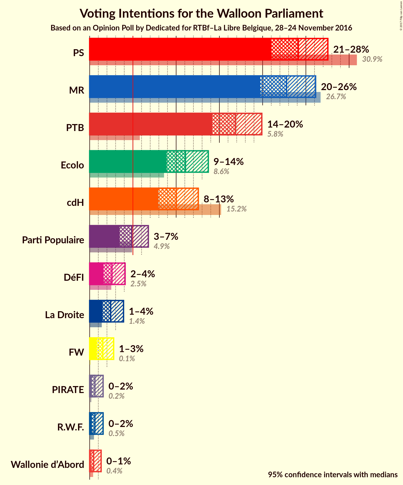

### Confidence Intervals

| Party | Last Result | Poll Result | 80% Confidence Interval | 90% Confidence Interval | 95% Confidence Interval | 99% Confidence Interval |
|:-----:|:-----------:|:-----------:|:-----------------------:|:-----------------------:|:-----------------------:|:-----------------------:|
| PS | 30.9% | 24.1% | 22.1–26.4% |21.5–27.0% |21.0–27.5% |20.1–28.6% |
| MR | 26.7% | 22.8% | 20.8–25.0% |20.2–25.6% |19.7–26.1% |18.8–27.2% |
| PTB | 5.8% | 16.8% | 15.1–18.8% |14.6–19.4% |14.2–19.9% |13.4–20.9% |
| Ecolo | 8.6% | 11.1% | 9.6–12.8% |9.2–13.3% |8.9–13.7% |8.3–14.6% |
| cdH | 15.2% | 10.0% | 8.7–11.7% |8.3–12.1% |7.9–12.6% |7.3–13.4% |
| Parti Populaire | 4.9% | 4.9% | 3.9–6.1% |3.7–6.5% |3.5–6.8% |3.1–7.4% |
| DéFI | 2.5% | 2.6% | 1.9–3.6% |1.8–3.8% |1.6–4.1% |1.4–4.6% |
| La Droite | 1.4% | 2.4% | 1.8–3.4% |1.6–3.7% |1.5–3.9% |1.2–4.4% |
| FW | 0.1% | 1.5% | 1.1–2.3% |0.9–2.6% |0.8–2.8% |0.7–3.2% |
| R.W.F. | 0.5% | 0.6% | 0.4–1.2% |0.3–1.4% |0.2–1.6% |0.2–1.9% |
| PIRATE | 0.2% | 0.6% | 0.4–1.2% |0.3–1.4% |0.2–1.6% |0.2–1.9% |
| Wallonie d’Abord | 0.4% | 0.5% | 0.3–1.0% |0.2–1.2% |0.2–1.3% |0.1–1.7% |

*Note:* The poll result column reflects the actual value used in the calculations. Published results may vary slightly, and in addition be rounded to fewer digits.

## Seats

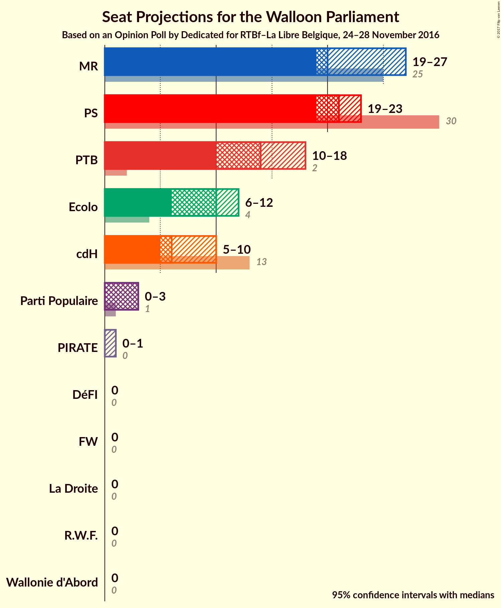

### Confidence Intervals

| Party | Last Result | Median | 80% Confidence Interval | 90% Confidence Interval | 95% Confidence Interval | 99% Confidence Interval |
|:-----:|:-----------:|:------:|:-----------------------:|:-----------------------:|:-----------------------:|:-----------------------:|
| <a href="#ps">PS</a> | 30 | 21 | 19–23 |19–24 |19–25 |17–27 |
| <a href="#mr">MR</a> | 25 | 21 | 20–24 |19–26 |17–26 |16–27 |
| <a href="#ptb">PTB</a> | 2 | 15 | 12–17 |12–17 |10–17 |10–18 |
| <a href="#ecolo">Ecolo</a> | 4 | 8 | 6–11 |6–11 |6–11 |6–13 |
| <a href="#cdh">cdH</a> | 13 | 6 | 5–10 |5–11 |5–11 |5–12 |
| <a href="#parti-populaire">Parti Populaire</a> | 1 | 1 | 0–3 |0–4 |0–4 |0–5 |
| <a href="#défi">DéFI</a> | 0 | 0 | 0 |0 |0 |0–1 |
| <a href="#la-droite">La Droite</a> | 0 | 0 | 0 |0 |0 |0 |
| <a href="#fw">FW</a> | 0 | 0 | 0 |0 |0 |0 |
| <a href="#r.w.f.">R.W.F.</a> | 0 | 0 | 0 |0 |0 |0 |
| <a href="#pirate">PIRATE</a> | 0 | 0 | 0–1 |0–1 |0–1 |0–1 |
| <a href="#wallonie-d’abord">Wallonie d’Abord</a> | 0 | 0 | 0 |0 |0 |0 |

### PS

*For a full overview of the results for this party, see the [PS](party-ps.html) page.*

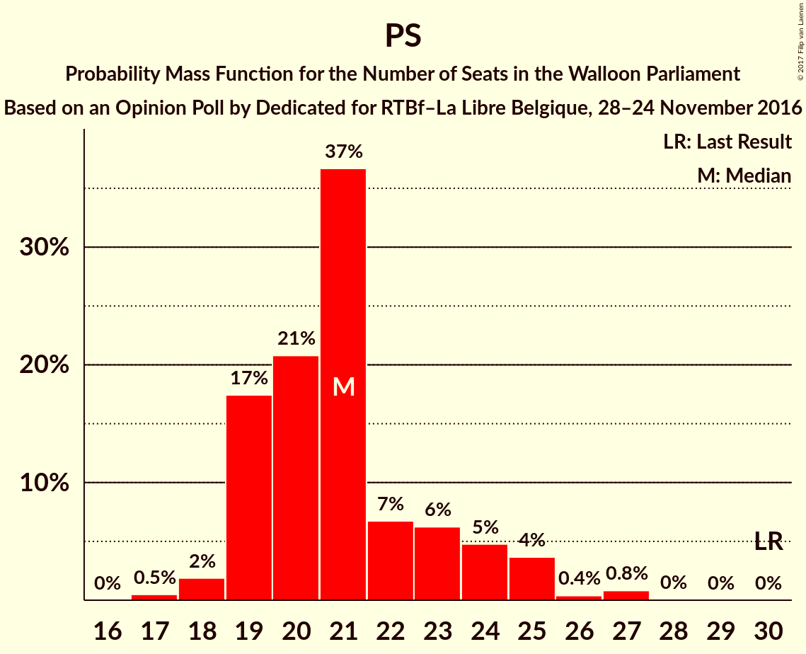

| Number of Seats | Probability | Accumulated | Special Marks |
|:---------------:|:-----------:|:-----------:|:-------------:|
| 17 | 0.5% | 100% |  |
| 18 | 2% | 99.5% |  |
| 19 | 17% | 98% |  |
| 20 | 21% | 80% |  |
| 21 | 37% | 59% | Median |
| 22 | 7% | 23% |  |
| 23 | 6% | 16% |  |
| 24 | 5% | 10% |  |
| 25 | 4% | 5% |  |
| 26 | 0.4% | 1.3% |  |
| 27 | 0.8% | 0.9% |  |
| 28 | 0% | 0.1% |  |
| 29 | 0% | 0% |  |
| 30 | 0% | 0% | Last Result |

### MR

*For a full overview of the results for this party, see the [MR](party-mr.html) page.*

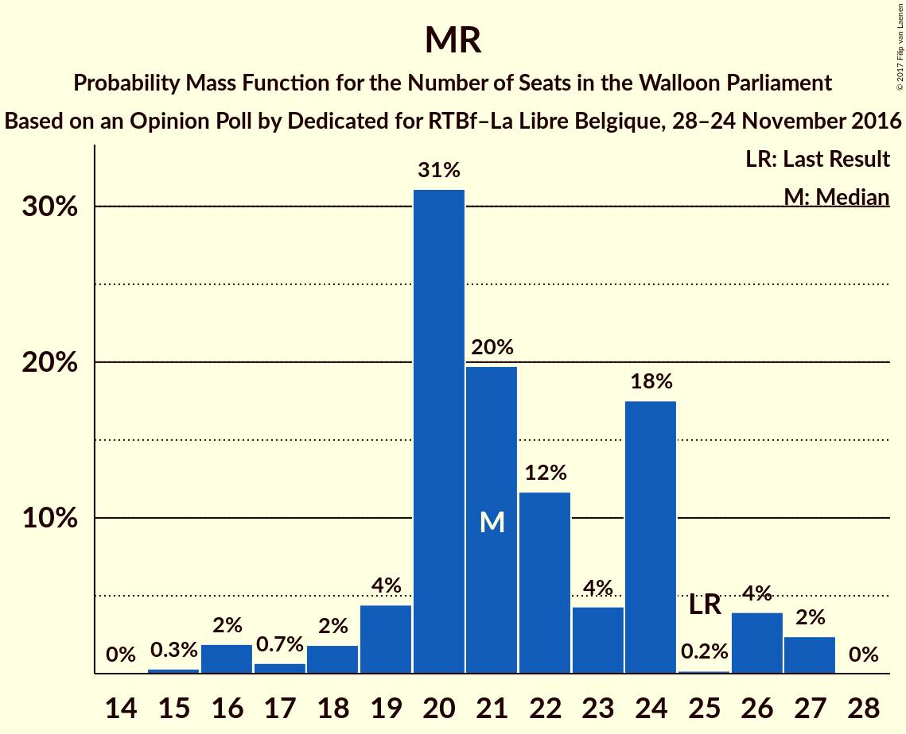

| Number of Seats | Probability | Accumulated | Special Marks |
|:---------------:|:-----------:|:-----------:|:-------------:|
| 15 | 0.3% | 100% |  |
| 16 | 2% | 99.7% |  |
| 17 | 0.7% | 98% |  |
| 18 | 2% | 97% |  |
| 19 | 4% | 95% |  |
| 20 | 31% | 91% |  |
| 21 | 20% | 60% | Median |
| 22 | 12% | 40% |  |
| 23 | 4% | 28% |  |
| 24 | 18% | 24% |  |
| 25 | 0.2% | 7% | Last Result |
| 26 | 4% | 6% |  |
| 27 | 2% | 2% |  |
| 28 | 0% | 0% |  |

### PTB

*For a full overview of the results for this party, see the [PTB](party-ptb.html) page.*

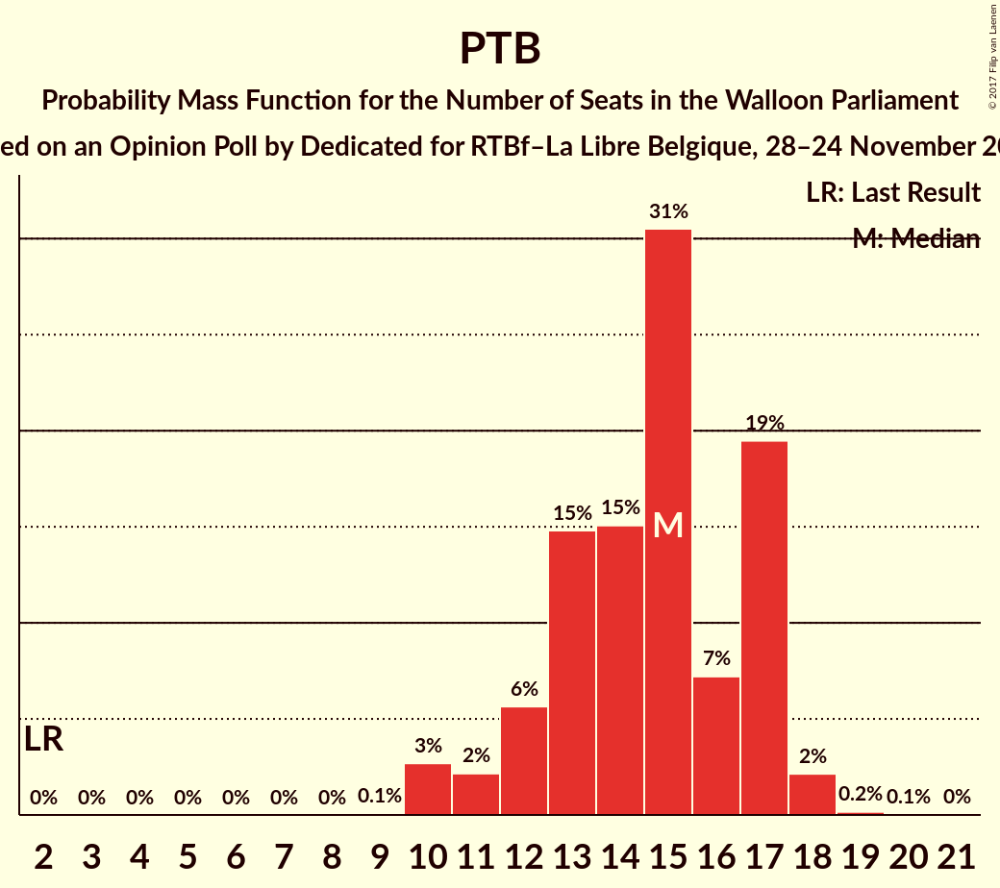

| Number of Seats | Probability | Accumulated | Special Marks |
|:---------------:|:-----------:|:-----------:|:-------------:|
| 2 | 0% | 100% | Last Result |
| 3 | 0% | 100% |  |
| 4 | 0% | 100% |  |
| 5 | 0% | 100% |  |
| 6 | 0% | 100% |  |
| 7 | 0% | 100% |  |
| 8 | 0% | 100% |  |
| 9 | 0.1% | 100% |  |
| 10 | 3% | 99.9% |  |
| 11 | 2% | 97% |  |
| 12 | 6% | 95% |  |
| 13 | 15% | 89% |  |
| 14 | 15% | 75% |  |
| 15 | 31% | 60% | Median |
| 16 | 7% | 29% |  |
| 17 | 19% | 22% |  |
| 18 | 2% | 2% |  |
| 19 | 0.2% | 0.2% |  |
| 20 | 0.1% | 0.1% |  |
| 21 | 0% | 0% |  |

### Ecolo

*For a full overview of the results for this party, see the [Ecolo](party-ecolo.html) page.*

| Number of Seats | Probability | Accumulated | Special Marks |
|:---------------:|:-----------:|:-----------:|:-------------:|
| 4 | 0% | 100% | Last Result |
| 5 | 0% | 100% |  |
| 6 | 16% | 100% |  |
| 7 | 27% | 84% |  |
| 8 | 8% | 57% | Median |
| 9 | 6% | 49% |  |
| 10 | 10% | 43% |  |
| 11 | 31% | 33% |  |
| 12 | 1.4% | 2% |  |
| 13 | 0.8% | 0.8% |  |
| 14 | 0% | 0% |  |

### cdH

*For a full overview of the results for this party, see the [cdH](party-cdh.html) page.*

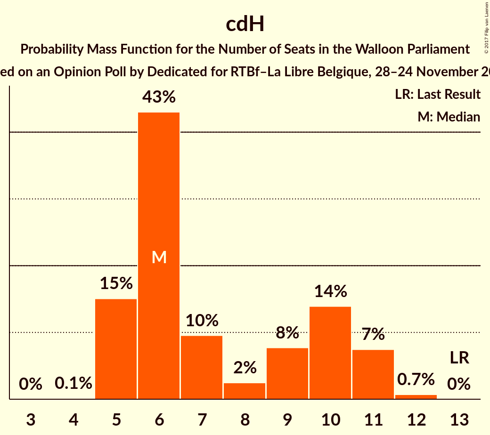

| Number of Seats | Probability | Accumulated | Special Marks |
|:---------------:|:-----------:|:-----------:|:-------------:|
| 4 | 0.1% | 100% |  |
| 5 | 15% | 99.9% |  |
| 6 | 43% | 85% | Median |
| 7 | 10% | 42% |  |
| 8 | 2% | 32% |  |
| 9 | 8% | 30% |  |
| 10 | 14% | 22% |  |
| 11 | 7% | 8% |  |
| 12 | 0.7% | 0.7% |  |
| 13 | 0% | 0% | Last Result |

### Parti Populaire

*For a full overview of the results for this party, see the [Parti Populaire](party-partipopulaire.html) page.*

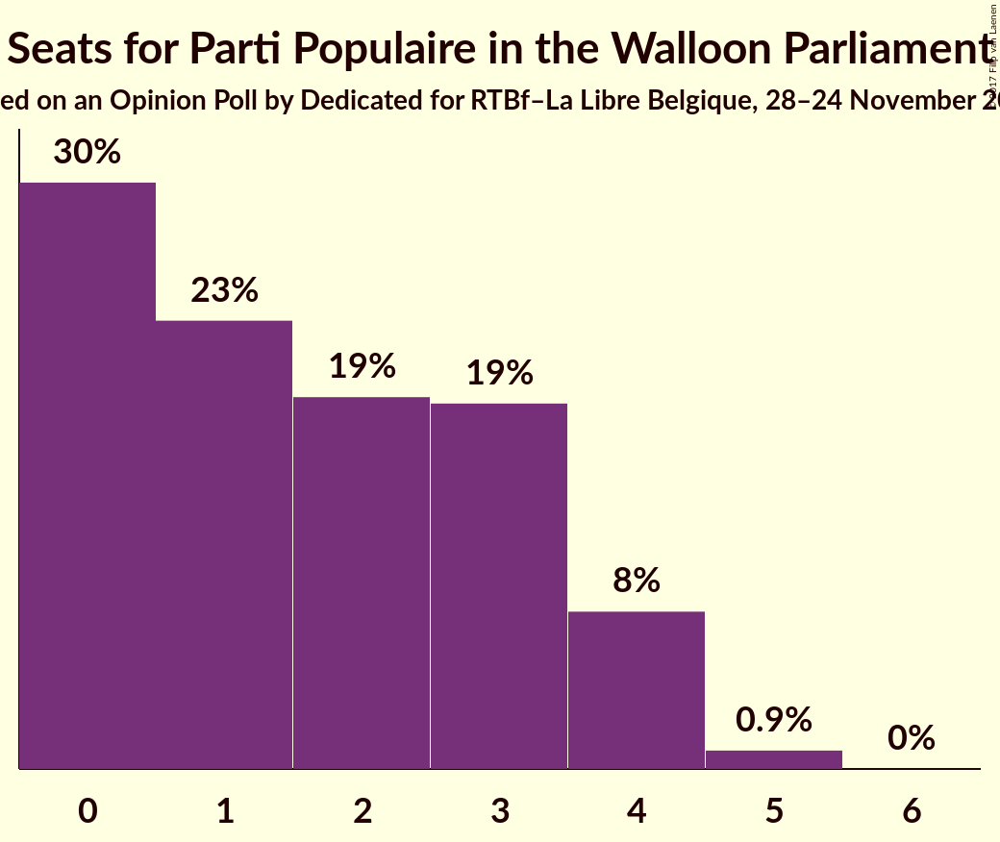

| Number of Seats | Probability | Accumulated | Special Marks |
|:---------------:|:-----------:|:-----------:|:-------------:|
| 0 | 30% | 100% |  |
| 1 | 23% | 70% | Last Result, Median |
| 2 | 19% | 47% |  |
| 3 | 19% | 28% |  |
| 4 | 8% | 9% |  |
| 5 | 0.9% | 1.0% |  |
| 6 | 0% | 0% |  |

### DéFI

*For a full overview of the results for this party, see the [DéFI](party-défi.html) page.*

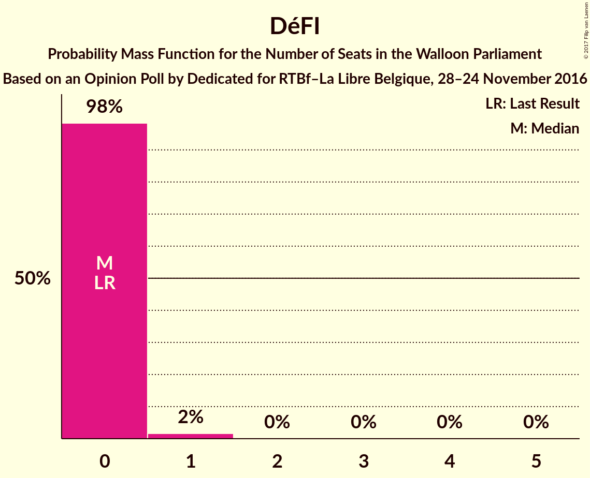

| Number of Seats | Probability | Accumulated | Special Marks |
|:---------------:|:-----------:|:-----------:|:-------------:|
| 0 | 98% | 100% | Last Result, Median |
| 1 | 2% | 2% |  |
| 2 | 0% | 0% |  |

### La Droite

*For a full overview of the results for this party, see the [La Droite](party-ladroite.html) page.*

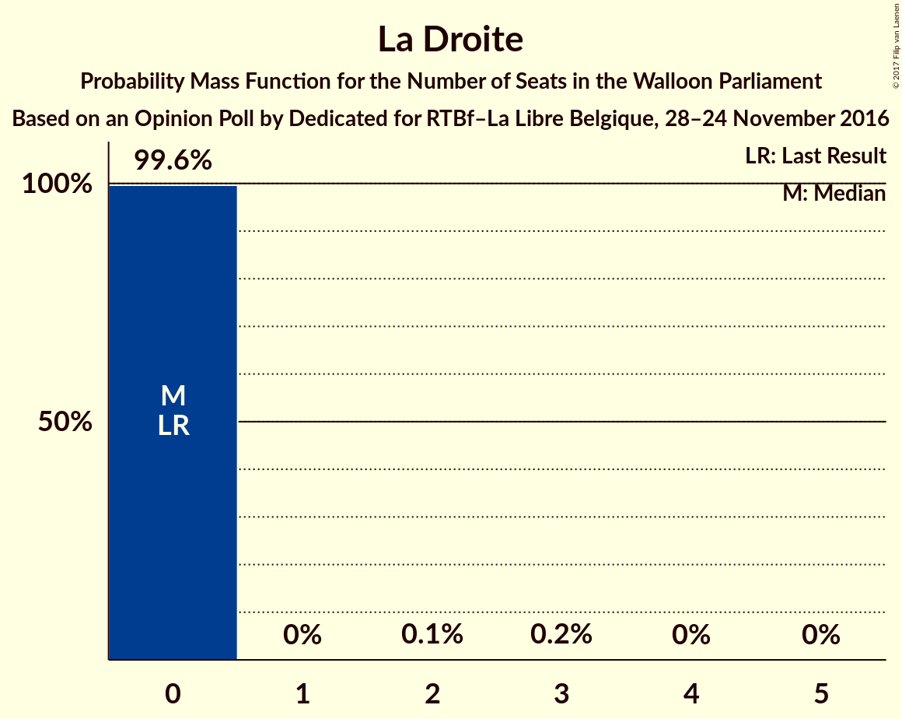

| Number of Seats | Probability | Accumulated | Special Marks |
|:---------------:|:-----------:|:-----------:|:-------------:|
| 0 | 99.6% | 100% | Last Result, Median |
| 1 | 0% | 0.4% |  |
| 2 | 0.1% | 0.3% |  |
| 3 | 0.2% | 0.2% |  |
| 4 | 0% | 0% |  |

### FW

*For a full overview of the results for this party, see the [FW](party-fw.html) page.*

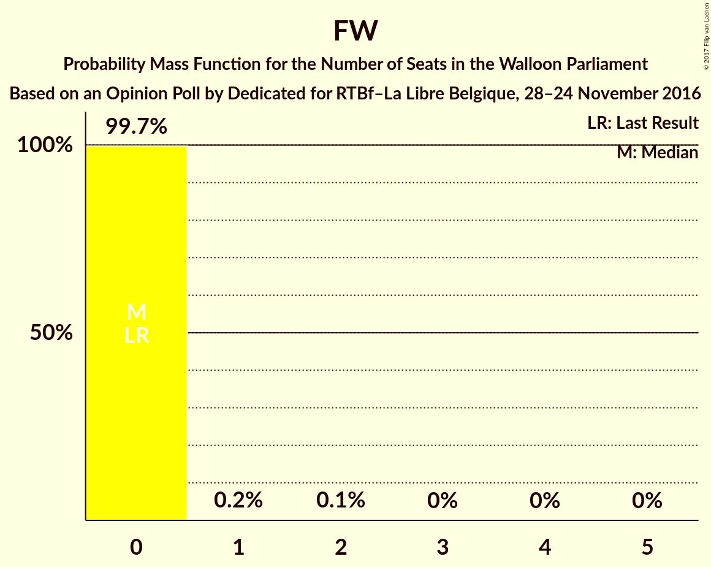

| Number of Seats | Probability | Accumulated | Special Marks |
|:---------------:|:-----------:|:-----------:|:-------------:|
| 0 | 99.7% | 100% | Last Result, Median |
| 1 | 0.2% | 0.3% |  |
| 2 | 0.1% | 0.1% |  |
| 3 | 0% | 0% |  |

### R.W.F.

*For a full overview of the results for this party, see the [R.W.F.](party-rwf.html) page.*

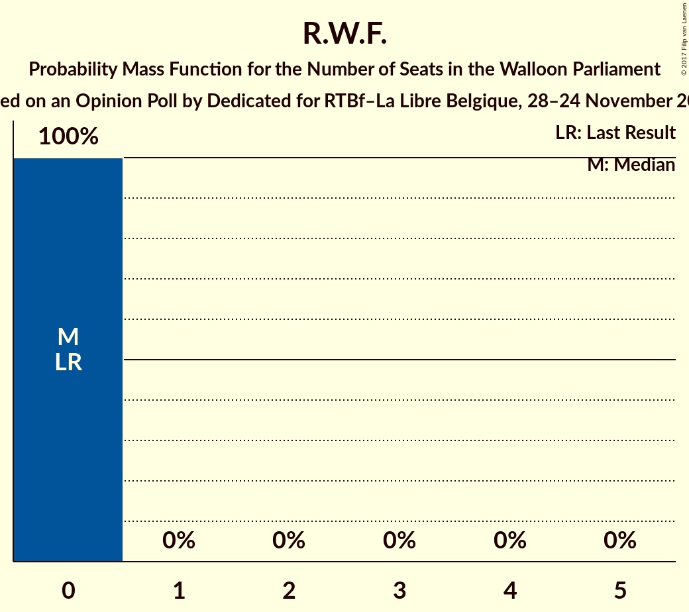

| Number of Seats | Probability | Accumulated | Special Marks |
|:---------------:|:-----------:|:-----------:|:-------------:|
| 0 | 100% | 100% | Last Result, Median |

### PIRATE

*For a full overview of the results for this party, see the [PIRATE](party-pirate.html) page.*

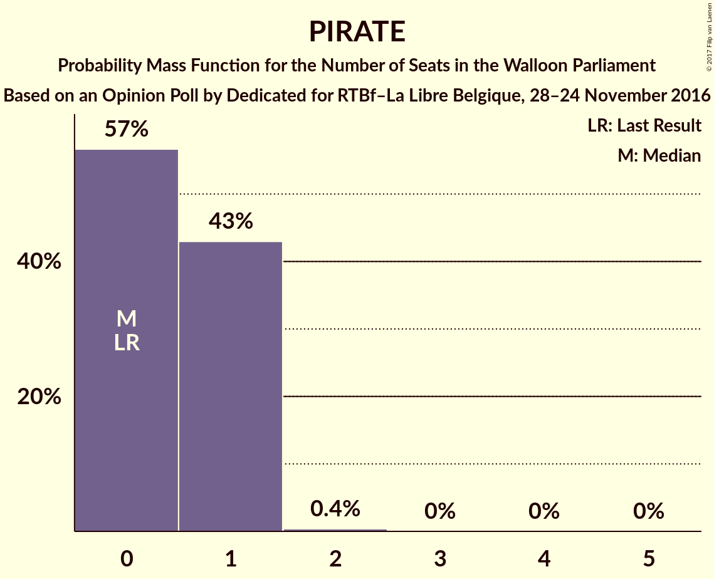

| Number of Seats | Probability | Accumulated | Special Marks |
|:---------------:|:-----------:|:-----------:|:-------------:|
| 0 | 57% | 100% | Last Result, Median |
| 1 | 43% | 43% |  |
| 2 | 0.4% | 0.4% |  |
| 3 | 0% | 0% |  |

### Wallonie d’Abord

*For a full overview of the results for this party, see the [Wallonie d’Abord](party-wallonied’abord.html) page.*

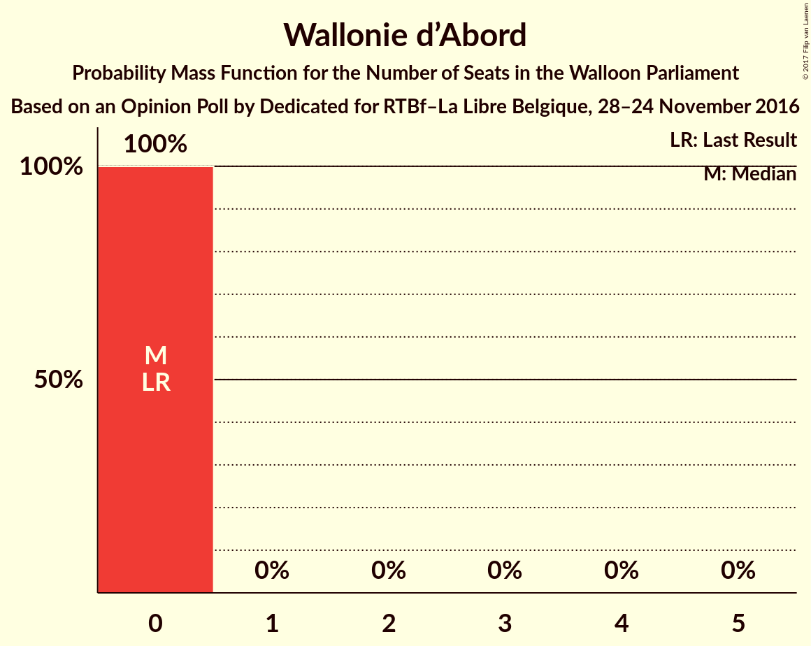

| Number of Seats | Probability | Accumulated | Special Marks |
|:---------------:|:-----------:|:-----------:|:-------------:|
| 0 | 100% | 100% | Last Result, Median |

## Coalitions

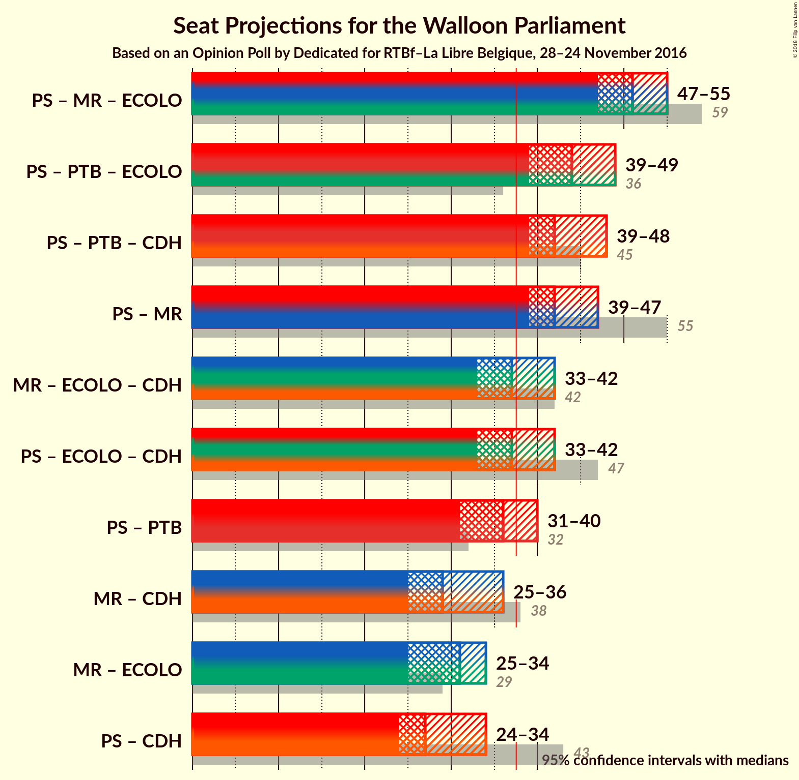

### Confidence Intervals

| Coalition | Last Result | Median | Majority? | 80% Confidence Interval | 90% Confidence Interval | 95% Confidence Interval | 99% Confidence Interval |
|:---------:|:-----------:|:------:|:---------:|:-----------------------:|:-----------------------:|:-----------------------:|:-----------------------:|
| PS – MR – Ecolo | 59 | 51 | 100% | 48–53 | 47–54 | 47–55 | 46–58 |
| PS – PTB – Ecolo | 36 | 44 | 100% | 42–47 | 39–47 | 39–49 | 39–50 |
| PS – PTB – cdH | 45 | 42 | 99.1% | 39–48 | 39–48 | 39–48 | 37–49 |
| PS – MR | 55 | 42 | 99.3% | 40–46 | 39–47 | 39–47 | 37–50 |
| MR – Ecolo – cdH | 42 | 37 | 33% | 36–40 | 34–42 | 33–42 | 32–44 |
| PS – Ecolo – cdH | 47 | 37 | 35% | 34–40 | 34–41 | 33–42 | 31–44 |
| PS – PTB | 32 | 36 | 13% | 33–38 | 32–39 | 31–40 | 31–41 |
| MR – cdH | 38 | 29 | 0% | 26–31 | 26–33 | 25–36 | 23–36 |
| MR – Ecolo | 29 | 31 | 0% | 27–33 | 27–33 | 25–34 | 24–35 |
| PS – cdH | 43 | 27 | 0% | 24–32 | 24–33 | 24–34 | 24–35 |

### PS – MR – Ecolo

| Number of Seats | Probability | Accumulated | Special Marks |
|:---------------:|:-----------:|:-----------:|:-------------:|
| 44 | 0.1% | 100% |  |
| 45 | 0.1% | 99.9% |  |
| 46 | 0.7% | 99.8% |  |
| 47 | 9% | 99.1% |  |
| 48 | 5% | 90% |  |
| 49 | 4% | 85% |  |
| 50 | 6% | 81% | Median |
| 51 | 30% | 76% |  |
| 52 | 27% | 45% |  |
| 53 | 11% | 18% |  |
| 54 | 3% | 7% |  |
| 55 | 1.5% | 4% |  |
| 56 | 2% | 2% |  |
| 57 | 0.2% | 0.8% |  |
| 58 | 0.6% | 0.6% |  |
| 59 | 0% | 0% | Last Result |

### PS – PTB – Ecolo

| Number of Seats | Probability | Accumulated | Special Marks |
|:---------------:|:-----------:|:-----------:|:-------------:|
| 36 | 0% | 100% | Last Result |
| 37 | 0% | 100% |  |
| 38 | 0.2% | 100% | Majority |
| 39 | 6% | 99.7% |  |
| 40 | 0.8% | 93% |  |
| 41 | 2% | 93% |  |
| 42 | 5% | 90% |  |
| 43 | 23% | 86% |  |
| 44 | 19% | 63% | Median |
| 45 | 12% | 44% |  |
| 46 | 12% | 32% |  |
| 47 | 15% | 20% |  |
| 48 | 1.1% | 5% |  |
| 49 | 3% | 4% |  |
| 50 | 0.4% | 0.8% |  |
| 51 | 0.3% | 0.4% |  |
| 52 | 0.1% | 0.1% |  |
| 53 | 0% | 0% |  |

### PS – PTB – cdH

| Number of Seats | Probability | Accumulated | Special Marks |
|:---------------:|:-----------:|:-----------:|:-------------:|
| 36 | 0.3% | 100% |  |
| 37 | 0.6% | 99.7% |  |
| 38 | 0.5% | 99.1% | Majority |
| 39 | 11% | 98.6% |  |
| 40 | 1.2% | 88% |  |
| 41 | 21% | 87% |  |
| 42 | 25% | 65% | Median |
| 43 | 9% | 40% |  |
| 44 | 4% | 31% |  |
| 45 | 7% | 27% | Last Result |
| 46 | 5% | 20% |  |
| 47 | 4% | 15% |  |
| 48 | 10% | 11% |  |
| 49 | 0.6% | 0.8% |  |
| 50 | 0.1% | 0.2% |  |
| 51 | 0% | 0.1% |  |
| 52 | 0.1% | 0.1% |  |
| 53 | 0% | 0% |  |

### PS – MR

| Number of Seats | Probability | Accumulated | Special Marks |
|:---------------:|:-----------:|:-----------:|:-------------:|
| 35 | 0% | 100% |  |
| 36 | 0.1% | 99.9% |  |
| 37 | 0.6% | 99.8% |  |
| 38 | 2% | 99.3% | Majority |
| 39 | 3% | 98% |  |
| 40 | 30% | 94% |  |
| 41 | 10% | 65% |  |
| 42 | 11% | 54% | Median |
| 43 | 8% | 43% |  |
| 44 | 2% | 35% |  |
| 45 | 21% | 33% |  |
| 46 | 6% | 12% |  |
| 47 | 5% | 6% |  |
| 48 | 0.1% | 0.8% |  |
| 49 | 0.1% | 0.7% |  |
| 50 | 0.6% | 0.6% |  |
| 51 | 0% | 0% |  |
| 52 | 0% | 0% |  |
| 53 | 0% | 0% |  |
| 54 | 0% | 0% |  |
| 55 | 0% | 0% | Last Result |

### MR – Ecolo – cdH

| Number of Seats | Probability | Accumulated | Special Marks |
|:---------------:|:-----------:|:-----------:|:-------------:|
| 31 | 0.2% | 100% |  |
| 32 | 0.3% | 99.8% |  |
| 33 | 3% | 99.5% |  |
| 34 | 5% | 97% |  |
| 35 | 1.4% | 92% | Median |
| 36 | 14% | 91% |  |
| 37 | 43% | 77% |  |
| 38 | 12% | 33% | Majority |
| 39 | 8% | 21% |  |
| 40 | 7% | 13% |  |
| 41 | 0.8% | 6% |  |
| 42 | 5% | 6% | Last Result |
| 43 | 0.3% | 1.0% |  |
| 44 | 0.7% | 0.7% |  |
| 45 | 0% | 0% |  |

### PS – Ecolo – cdH

| Number of Seats | Probability | Accumulated | Special Marks |
|:---------------:|:-----------:|:-----------:|:-------------:|
| 31 | 2% | 100% |  |
| 32 | 0.1% | 98% |  |
| 33 | 0.3% | 98% |  |
| 34 | 18% | 97% |  |
| 35 | 14% | 80% | Median |
| 36 | 5% | 65% |  |
| 37 | 26% | 60% |  |
| 38 | 15% | 35% | Majority |
| 39 | 6% | 19% |  |
| 40 | 5% | 14% |  |
| 41 | 4% | 8% |  |
| 42 | 3% | 4% |  |
| 43 | 0.8% | 2% |  |
| 44 | 0.6% | 1.0% |  |
| 45 | 0.3% | 0.3% |  |
| 46 | 0% | 0% |  |
| 47 | 0% | 0% | Last Result |

### PS – PTB

| Number of Seats | Probability | Accumulated | Special Marks |
|:---------------:|:-----------:|:-----------:|:-------------:|
| 30 | 0.4% | 100% |  |
| 31 | 2% | 99.6% |  |
| 32 | 2% | 97% | Last Result |
| 33 | 15% | 95% |  |
| 34 | 3% | 80% |  |
| 35 | 16% | 78% |  |
| 36 | 38% | 62% | Median |
| 37 | 11% | 23% |  |
| 38 | 6% | 13% | Majority |
| 39 | 2% | 7% |  |
| 40 | 3% | 5% |  |
| 41 | 2% | 2% |  |
| 42 | 0.3% | 0.4% |  |
| 43 | 0.1% | 0.1% |  |
| 44 | 0% | 0% |  |

### MR – cdH

| Number of Seats | Probability | Accumulated | Special Marks |
|:---------------:|:-----------:|:-----------:|:-------------:|
| 23 | 0.5% | 100% |  |
| 24 | 0.7% | 99.5% |  |
| 25 | 2% | 98.8% |  |
| 26 | 30% | 97% |  |
| 27 | 4% | 67% | Median |
| 28 | 9% | 62% |  |
| 29 | 11% | 53% |  |
| 30 | 22% | 42% |  |
| 31 | 10% | 20% |  |
| 32 | 2% | 10% |  |
| 33 | 3% | 7% |  |
| 34 | 0.1% | 4% |  |
| 35 | 0.1% | 4% |  |
| 36 | 4% | 4% |  |
| 37 | 0% | 0% |  |
| 38 | 0% | 0% | Last Result, Majority |

### MR – Ecolo

| Number of Seats | Probability | Accumulated | Special Marks |
|:---------------:|:-----------:|:-----------:|:-------------:|
| 23 | 0.2% | 100% |  |
| 24 | 2% | 99.8% |  |
| 25 | 0.5% | 98% |  |
| 26 | 2% | 97% |  |
| 27 | 14% | 95% |  |
| 28 | 7% | 81% |  |
| 29 | 5% | 74% | Last Result, Median |
| 30 | 11% | 69% |  |
| 31 | 29% | 58% |  |
| 32 | 17% | 29% |  |
| 33 | 9% | 12% |  |
| 34 | 2% | 3% |  |
| 35 | 0.5% | 0.7% |  |
| 36 | 0.1% | 0.2% |  |
| 37 | 0.1% | 0.1% |  |
| 38 | 0% | 0% | Majority |

### PS – cdH

| Number of Seats | Probability | Accumulated | Special Marks |
|:---------------:|:-----------:|:-----------:|:-------------:|
| 23 | 0.3% | 100% |  |
| 24 | 12% | 99.7% |  |
| 25 | 3% | 88% |  |
| 26 | 10% | 84% |  |
| 27 | 31% | 75% | Median |
| 28 | 7% | 44% |  |
| 29 | 5% | 38% |  |
| 30 | 5% | 32% |  |
| 31 | 16% | 27% |  |
| 32 | 3% | 11% |  |
| 33 | 2% | 7% |  |
| 34 | 4% | 5% |  |
| 35 | 0.8% | 0.9% |  |
| 36 | 0.1% | 0.2% |  |
| 37 | 0% | 0% |  |
| 38 | 0% | 0% | Majority |
| 39 | 0% | 0% |  |
| 40 | 0% | 0% |  |
| 41 | 0% | 0% |  |
| 42 | 0% | 0% |  |
| 43 | 0% | 0% | Last Result |

## Technical Information

### Opinion Poll

+ **Polling firm:** Dedicated
+ **Commissioner(s):** RTBf–La Libre Belgique
+ **Fieldwork period:** 28–24 November 2016

### Calculations

+ **Sample size:** 659
+ **Simulations done:** 4,194,304
+ **Error estimate:** 2.61%

