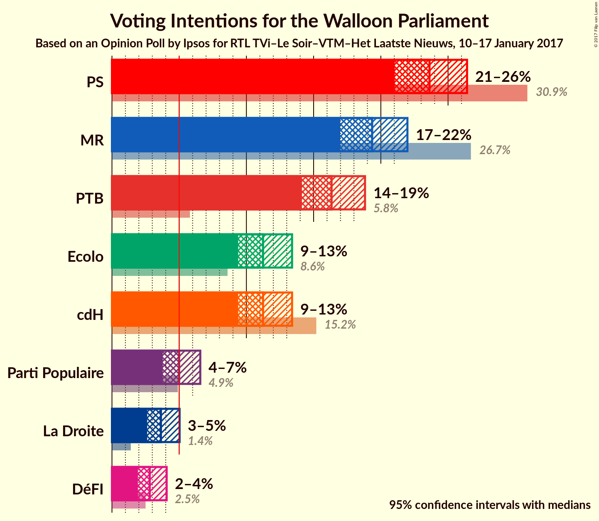
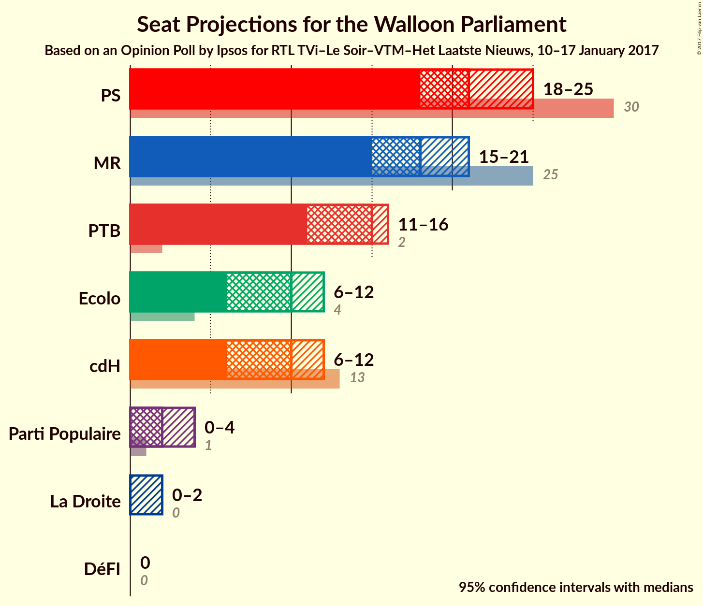
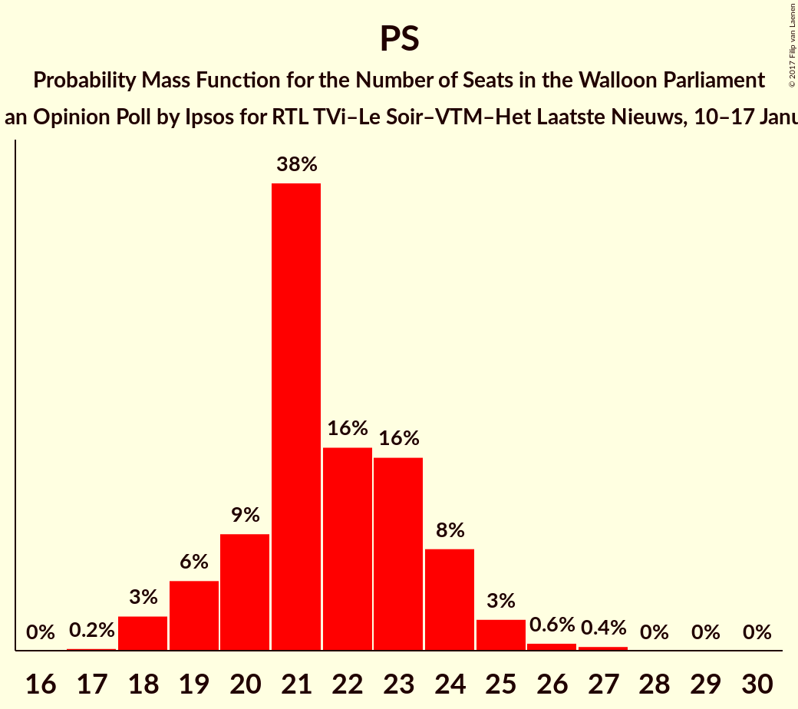
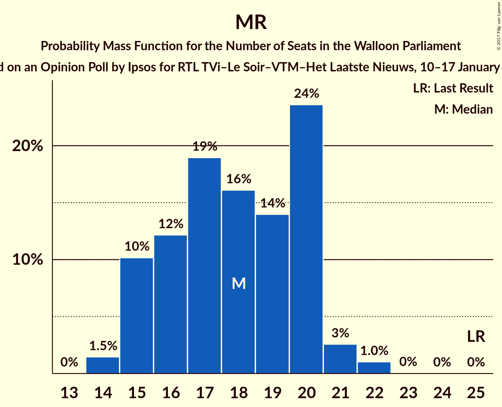
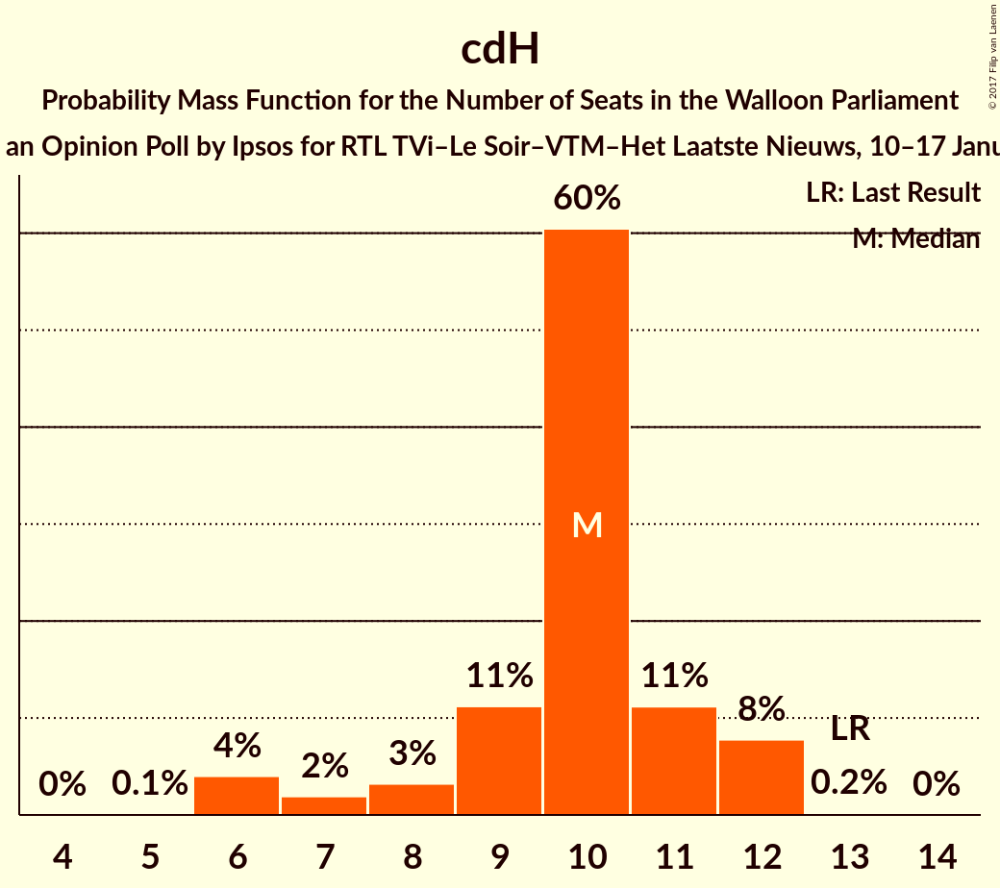
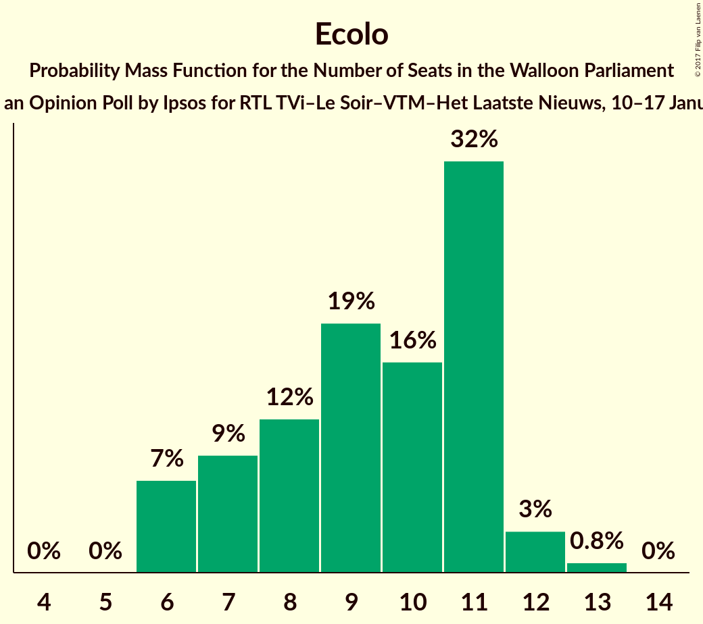
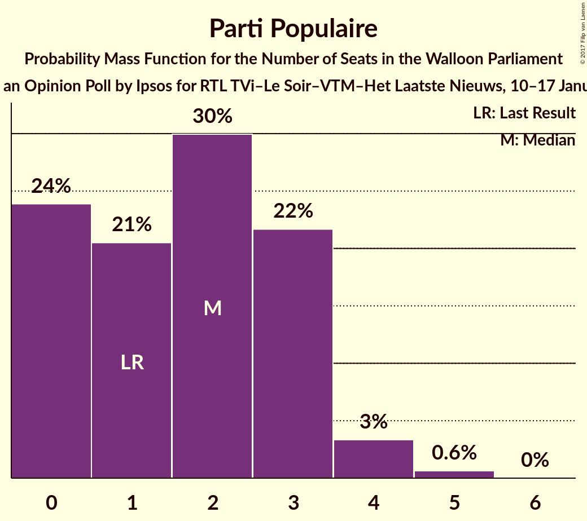
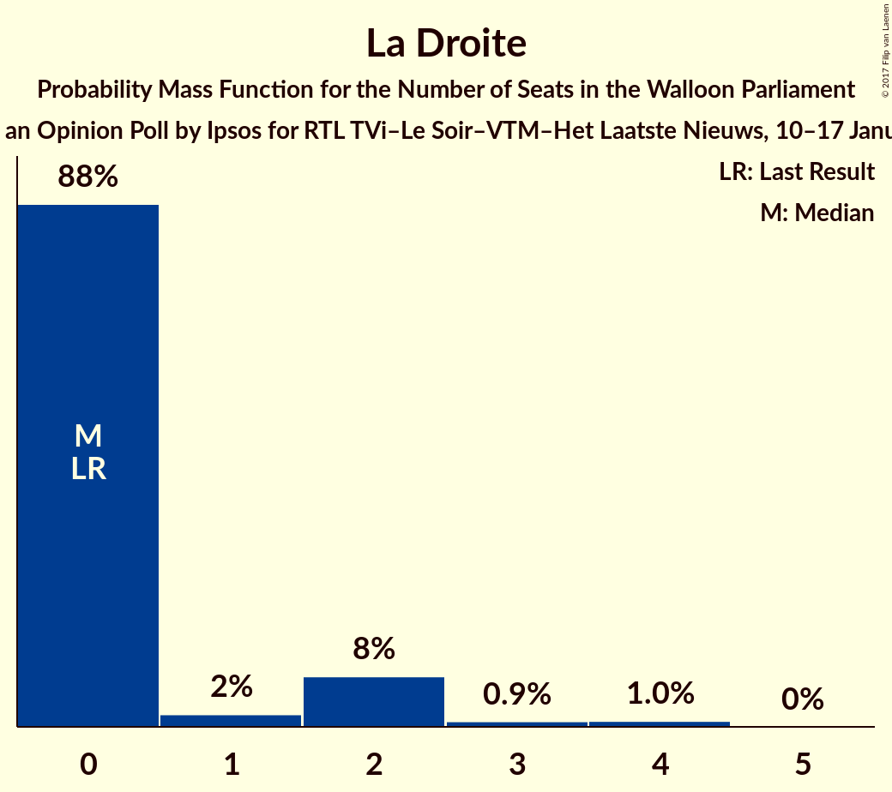
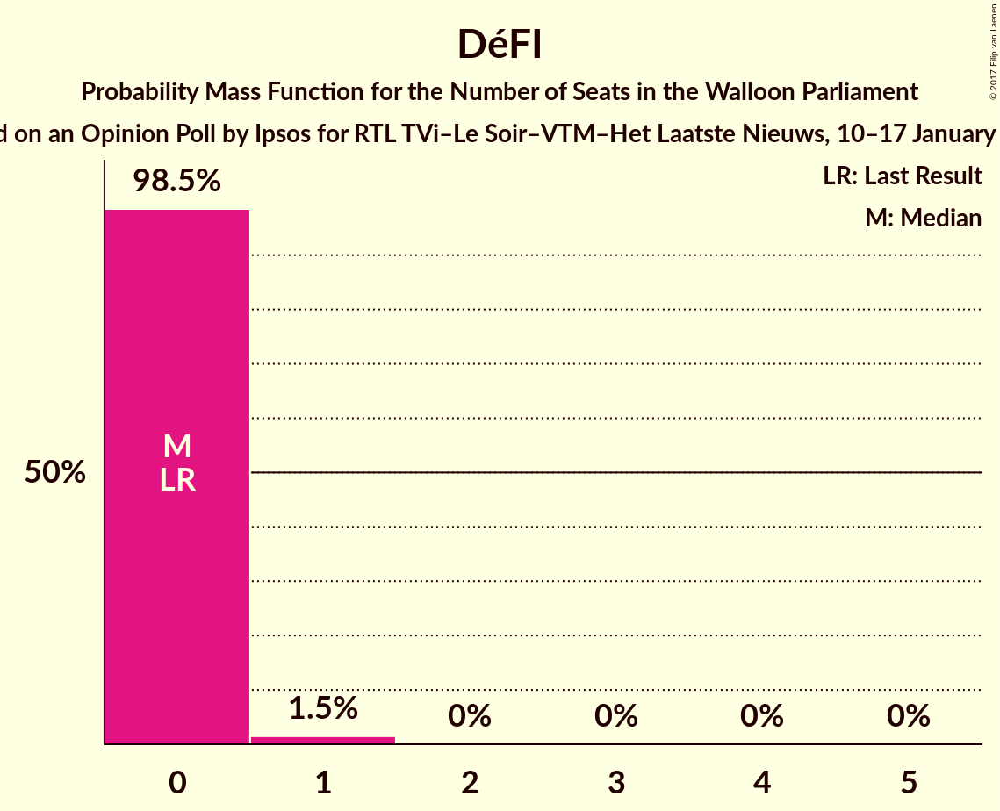
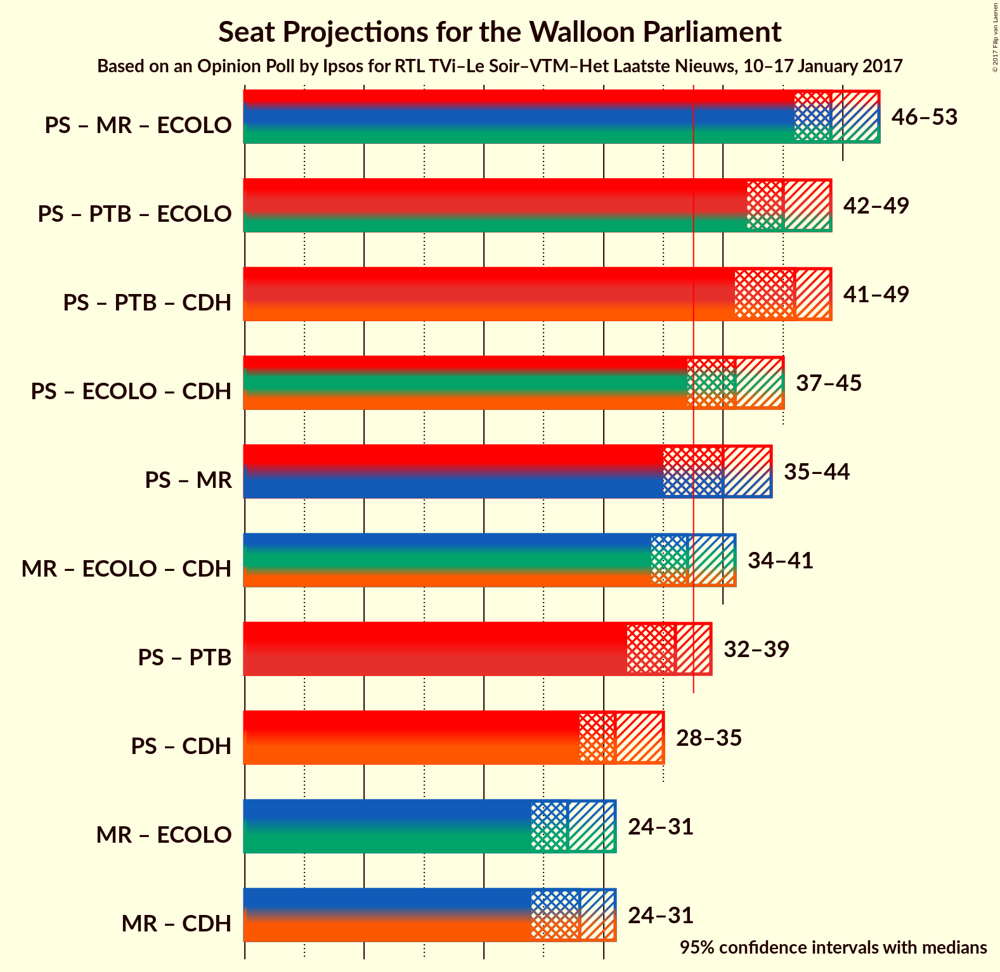

# Opinion Poll by Ipsos for RTL TVi–Le Soir–VTM–Het Laatste Nieuws, 10–17 January 2017

<a href="#voting-intentions">Voting Intentions</a> | <a href="#seats">Seats</a> | <a href="#coalitions">Coalitions</a> | <a href="#technical-information">Technical Information</a>

## Voting Intentions

### Confidence Intervals

| Party | Last Result | Poll Result | 80% Confidence Interval | 90% Confidence Interval | 95% Confidence Interval | 99% Confidence Interval |
|:-----:|:-----------:|:-----------:|:-----------------------:|:-----------------------:|:-----------------------:|:-----------------------:|
| PS | 30.9% | 23.6% | 21.9–25.5% |21.4–26.0% |21.0–26.4% |20.3–27.3% |
| MR | 26.7% | 19.4% | 17.8–21.1% |17.3–21.6% |17.0–22.0% |16.2–22.8% |
| PTB | 5.8% | 16.3% | 14.9–18.0% |14.5–18.4% |14.1–18.8% |13.5–19.6% |
| cdH | 15.2% | 11.2% | 10.0–12.7% |9.7–13.0% |9.4–13.4% |8.8–14.1% |
| Ecolo | 8.6% | 11.2% | 10.0–12.7% |9.7–13.0% |9.4–13.4% |8.8–14.1% |
| Parti Populaire | 4.9% | 5.0% | 4.2–6.0% |4.0–6.3% |3.8–6.6% |3.4–7.1% |
| La Droite | 1.4% | 3.6% | 3.0–4.5% |2.8–4.8% |2.6–5.0% |2.3–5.5% |
| DéFI | 2.5% | 2.8% | 2.2–3.6% |2.1–3.9% |1.9–4.1% |1.7–4.5% |

*Note:* The poll result column reflects the actual value used in the calculations. Published results may vary slightly, and in addition be rounded to fewer digits.

## Seats

### Confidence Intervals

| Party | Last Result | Median | 80% Confidence Interval | 90% Confidence Interval | 95% Confidence Interval | 99% Confidence Interval |
|:-----:|:-----------:|:------:|:-----------------------:|:-----------------------:|:-----------------------:|:-----------------------:|
| <a href="#ps">PS</a> | 30 | 21 | 20–24 |19–24 |18–25 |18–26 |
| <a href="#mr">MR</a> | 25 | 18 | 15–20 |15–20 |15–21 |14–22 |
| <a href="#ptb">PTB</a> | 2 | 15 | 12–16 |12–16 |11–16 |10–17 |
| <a href="#cdh">cdH</a> | 13 | 10 | 9–11 |7–12 |6–12 |6–12 |
| <a href="#ecolo">Ecolo</a> | 4 | 10 | 7–11 |6–11 |6–12 |6–13 |
| <a href="#parti-populaire">Parti Populaire</a> | 1 | 2 | 0–3 |0–3 |0–4 |0–5 |
| <a href="#la-droite">La Droite</a> | 0 | 0 | 0–2 |0–2 |0–2 |0–4 |
| <a href="#défi">DéFI</a> | 0 | 0 | 0 |0 |0 |0–1 |

### PS

*For a full overview of the results for this party, see the [PS](party-ps.html) page.*

| Number of Seats | Probability | Accumulated | Special Marks |
|:---------------:|:-----------:|:-----------:|:-------------:|
| 17 | 0.2% | 100% |  |
| 18 | 3% | 99.8% |  |
| 19 | 6% | 97% |  |
| 20 | 9% | 91% |  |
| 21 | 38% | 82% | Median |
| 22 | 16% | 44% |  |
| 23 | 16% | 27% |  |
| 24 | 8% | 12% |  |
| 25 | 3% | 4% |  |
| 26 | 0.6% | 1.0% |  |
| 27 | 0.4% | 0.4% |  |
| 28 | 0% | 0% |  |
| 29 | 0% | 0% |  |
| 30 | 0% | 0% | Last Result |

### MR

*For a full overview of the results for this party, see the [MR](party-mr.html) page.*

| Number of Seats | Probability | Accumulated | Special Marks |
|:---------------:|:-----------:|:-----------:|:-------------:|
| 14 | 1.5% | 100% |  |
| 15 | 10% | 98.5% |  |
| 16 | 12% | 88% |  |
| 17 | 19% | 76% |  |
| 18 | 16% | 57% | Median |
| 19 | 14% | 41% |  |
| 20 | 24% | 27% |  |
| 21 | 3% | 4% |  |
| 22 | 1.0% | 1.1% |  |
| 23 | 0% | 0% |  |
| 24 | 0% | 0% |  |
| 25 | 0% | 0% | Last Result |

### PTB

*For a full overview of the results for this party, see the [PTB](party-ptb.html) page.*

| Number of Seats | Probability | Accumulated | Special Marks |
|:---------------:|:-----------:|:-----------:|:-------------:|
| 2 | 0% | 100% | Last Result |
| 3 | 0% | 100% |  |
| 4 | 0% | 100% |  |
| 5 | 0% | 100% |  |
| 6 | 0% | 100% |  |
| 7 | 0% | 100% |  |
| 8 | 0% | 100% |  |
| 9 | 0% | 100% |  |
| 10 | 0.6% | 100% |  |
| 11 | 4% | 99.4% |  |
| 12 | 10% | 96% |  |
| 13 | 15% | 86% |  |
| 14 | 17% | 71% |  |
| 15 | 34% | 54% | Median |
| 16 | 18% | 20% |  |
| 17 | 2% | 2% |  |
| 18 | 0.3% | 0.3% |  |
| 19 | 0% | 0% |  |

### cdH

*For a full overview of the results for this party, see the [cdH](party-cdh.html) page.*

| Number of Seats | Probability | Accumulated | Special Marks |
|:---------------:|:-----------:|:-----------:|:-------------:|
| 5 | 0.1% | 100% |  |
| 6 | 4% | 99.9% |  |
| 7 | 2% | 96% |  |
| 8 | 3% | 94% |  |
| 9 | 11% | 91% |  |
| 10 | 60% | 80% | Median |
| 11 | 11% | 19% |  |
| 12 | 8% | 8% |  |
| 13 | 0.2% | 0.2% | Last Result |
| 14 | 0% | 0% |  |

### Ecolo

*For a full overview of the results for this party, see the [Ecolo](party-ecolo.html) page.*

| Number of Seats | Probability | Accumulated | Special Marks |
|:---------------:|:-----------:|:-----------:|:-------------:|
| 4 | 0% | 100% | Last Result |
| 5 | 0% | 100% |  |
| 6 | 7% | 100% |  |
| 7 | 9% | 93% |  |
| 8 | 12% | 84% |  |
| 9 | 19% | 72% |  |
| 10 | 16% | 52% | Median |
| 11 | 32% | 36% |  |
| 12 | 3% | 4% |  |
| 13 | 0.8% | 0.8% |  |
| 14 | 0% | 0% |  |

### Parti Populaire

*For a full overview of the results for this party, see the [Parti Populaire](party-partipopulaire.html) page.*

| Number of Seats | Probability | Accumulated | Special Marks |
|:---------------:|:-----------:|:-----------:|:-------------:|
| 0 | 24% | 100% |  |
| 1 | 21% | 76% | Last Result |
| 2 | 30% | 56% | Median |
| 3 | 22% | 26% |  |
| 4 | 3% | 4% |  |
| 5 | 0.6% | 0.6% |  |
| 6 | 0% | 0% |  |

### La Droite

*For a full overview of the results for this party, see the [La Droite](party-ladroite.html) page.*

| Number of Seats | Probability | Accumulated | Special Marks |
|:---------------:|:-----------:|:-----------:|:-------------:|
| 0 | 88% | 100% | Last Result, Median |
| 1 | 2% | 12% |  |
| 2 | 8% | 10% |  |
| 3 | 0.9% | 2% |  |
| 4 | 1.0% | 1.0% |  |
| 5 | 0% | 0% |  |

### DéFI

*For a full overview of the results for this party, see the [DéFI](party-défi.html) page.*

| Number of Seats | Probability | Accumulated | Special Marks |
|:---------------:|:-----------:|:-----------:|:-------------:|
| 0 | 98.5% | 100% | Last Result, Median |
| 1 | 1.5% | 1.5% |  |
| 2 | 0% | 0% |  |

## Coalitions

### Confidence Intervals

| Coalition | Last Result | Median | Majority? | 80% Confidence Interval | 90% Confidence Interval | 95% Confidence Interval | 99% Confidence Interval |
|:---------:|:-----------:|:------:|:---------:|:-----------------------:|:-----------------------:|:-----------------------:|:-----------------------:|
| PS – MR – Ecolo | 59 | 49 | 100% | 46–52 | 46–53 | 46–53 | 45–54 |
| PS – PTB – Ecolo | 36 | 45 | 100% | 43–48 | 42–48 | 42–49 | 41–50 |
| PS – PTB – cdH | 45 | 46 | 100% | 43–48 | 42–49 | 41–49 | 40–51 |
| PS – Ecolo – cdH | 47 | 41 | 95% | 38–44 | 38–44 | 37–45 | 36–46 |
| PS – MR | 55 | 40 | 81% | 37–42 | 36–43 | 35–44 | 34–45 |
| MR – Ecolo – cdH | 42 | 37 | 42% | 35–40 | 34–40 | 34–41 | 32–42 |
| PS – PTB | 32 | 36 | 18% | 33–38 | 33–39 | 32–39 | 31–41 |
| PS – cdH | 43 | 31 | 0.2% | 29–34 | 28–34 | 28–35 | 27–36 |
| MR – Ecolo | 29 | 27 | 0% | 25–30 | 24–31 | 24–31 | 22–32 |
| MR – cdH | 38 | 28 | 0% | 25–30 | 25–31 | 24–31 | 23–32 |

### PS – MR – Ecolo

| Number of Seats | Probability | Accumulated | Special Marks |
|:---------------:|:-----------:|:-----------:|:-------------:|
| 43 | 0.1% | 100% |  |
| 44 | 0.3% | 99.9% |  |
| 45 | 2% | 99.5% |  |
| 46 | 8% | 98% |  |
| 47 | 14% | 90% |  |
| 48 | 21% | 76% |  |
| 49 | 20% | 54% | Median |
| 50 | 13% | 35% |  |
| 51 | 9% | 22% |  |
| 52 | 7% | 12% |  |
| 53 | 4% | 6% |  |
| 54 | 1.1% | 1.3% |  |
| 55 | 0.2% | 0.3% |  |
| 56 | 0% | 0.1% |  |
| 57 | 0% | 0% |  |
| 58 | 0% | 0% |  |
| 59 | 0% | 0% | Last Result |

### PS – PTB – Ecolo

| Number of Seats | Probability | Accumulated | Special Marks |
|:---------------:|:-----------:|:-----------:|:-------------:|
| 36 | 0% | 100% | Last Result |
| 37 | 0% | 100% |  |
| 38 | 0% | 100% | Majority |
| 39 | 0.1% | 100% |  |
| 40 | 0.4% | 99.9% |  |
| 41 | 2% | 99.5% |  |
| 42 | 6% | 98% |  |
| 43 | 12% | 91% |  |
| 44 | 15% | 80% |  |
| 45 | 18% | 64% |  |
| 46 | 17% | 46% | Median |
| 47 | 13% | 29% |  |
| 48 | 12% | 16% |  |
| 49 | 3% | 4% |  |
| 50 | 1.1% | 1.4% |  |
| 51 | 0.3% | 0.4% |  |
| 52 | 0.1% | 0.1% |  |
| 53 | 0% | 0% |  |

### PS – PTB – cdH

| Number of Seats | Probability | Accumulated | Special Marks |
|:---------------:|:-----------:|:-----------:|:-------------:|
| 39 | 0.1% | 100% |  |
| 40 | 0.6% | 99.9% |  |
| 41 | 3% | 99.3% |  |
| 42 | 3% | 97% |  |
| 43 | 10% | 94% |  |
| 44 | 9% | 84% |  |
| 45 | 18% | 75% | Last Result |
| 46 | 18% | 56% | Median |
| 47 | 17% | 38% |  |
| 48 | 12% | 21% |  |
| 49 | 6% | 9% |  |
| 50 | 2% | 2% |  |
| 51 | 0.7% | 0.9% |  |
| 52 | 0.1% | 0.3% |  |
| 53 | 0.1% | 0.2% |  |
| 54 | 0% | 0% |  |

### PS – Ecolo – cdH

| Number of Seats | Probability | Accumulated | Special Marks |
|:---------------:|:-----------:|:-----------:|:-------------:|
| 34 | 0.1% | 100% |  |
| 35 | 0.2% | 99.9% |  |
| 36 | 1.1% | 99.7% |  |
| 37 | 3% | 98.6% |  |
| 38 | 10% | 95% | Majority |
| 39 | 15% | 85% |  |
| 40 | 14% | 70% |  |
| 41 | 15% | 56% | Median |
| 42 | 17% | 41% |  |
| 43 | 12% | 24% |  |
| 44 | 8% | 12% |  |
| 45 | 2% | 4% |  |
| 46 | 1.4% | 2% |  |
| 47 | 0.3% | 0.3% | Last Result |
| 48 | 0% | 0% |  |

### PS – MR

| Number of Seats | Probability | Accumulated | Special Marks |
|:---------------:|:-----------:|:-----------:|:-------------:|
| 33 | 0.1% | 100% |  |
| 34 | 0.6% | 99.9% |  |
| 35 | 3% | 99.3% |  |
| 36 | 6% | 96% |  |
| 37 | 9% | 90% |  |
| 38 | 13% | 81% | Majority |
| 39 | 15% | 69% | Median |
| 40 | 20% | 54% |  |
| 41 | 17% | 34% |  |
| 42 | 10% | 17% |  |
| 43 | 5% | 7% |  |
| 44 | 2% | 3% |  |
| 45 | 0.7% | 0.8% |  |
| 46 | 0.1% | 0.1% |  |
| 47 | 0% | 0% |  |
| 48 | 0% | 0% |  |
| 49 | 0% | 0% |  |
| 50 | 0% | 0% |  |
| 51 | 0% | 0% |  |
| 52 | 0% | 0% |  |
| 53 | 0% | 0% |  |
| 54 | 0% | 0% |  |
| 55 | 0% | 0% | Last Result |

### MR – Ecolo – cdH

| Number of Seats | Probability | Accumulated | Special Marks |
|:---------------:|:-----------:|:-----------:|:-------------:|
| 31 | 0.1% | 100% |  |
| 32 | 0.5% | 99.8% |  |
| 33 | 1.2% | 99.4% |  |
| 34 | 5% | 98% |  |
| 35 | 8% | 93% |  |
| 36 | 17% | 85% |  |
| 37 | 26% | 68% |  |
| 38 | 21% | 42% | Median, Majority |
| 39 | 10% | 21% |  |
| 40 | 7% | 11% |  |
| 41 | 3% | 4% |  |
| 42 | 1.0% | 1.1% | Last Result |
| 43 | 0.1% | 0.1% |  |
| 44 | 0% | 0% |  |

### PS – PTB

| Number of Seats | Probability | Accumulated | Special Marks |
|:---------------:|:-----------:|:-----------:|:-------------:|
| 30 | 0.1% | 100% |  |
| 31 | 0.8% | 99.9% |  |
| 32 | 4% | 99.0% | Last Result |
| 33 | 6% | 95% |  |
| 34 | 10% | 89% |  |
| 35 | 19% | 79% |  |
| 36 | 22% | 60% | Median |
| 37 | 20% | 38% |  |
| 38 | 11% | 18% | Majority |
| 39 | 5% | 8% |  |
| 40 | 2% | 2% |  |
| 41 | 0.4% | 0.8% |  |
| 42 | 0.2% | 0.3% |  |
| 43 | 0.1% | 0.1% |  |
| 44 | 0% | 0% |  |

### PS – cdH

| Number of Seats | Probability | Accumulated | Special Marks |
|:---------------:|:-----------:|:-----------:|:-------------:|
| 25 | 0.2% | 100% |  |
| 26 | 0.3% | 99.8% |  |
| 27 | 2% | 99.6% |  |
| 28 | 6% | 98% |  |
| 29 | 7% | 92% |  |
| 30 | 12% | 85% |  |
| 31 | 29% | 73% | Median |
| 32 | 12% | 45% |  |
| 33 | 18% | 33% |  |
| 34 | 10% | 15% |  |
| 35 | 3% | 5% |  |
| 36 | 0.7% | 1.1% |  |
| 37 | 0.3% | 0.4% |  |
| 38 | 0.1% | 0.2% | Majority |
| 39 | 0% | 0% |  |
| 40 | 0% | 0% |  |
| 41 | 0% | 0% |  |
| 42 | 0% | 0% |  |
| 43 | 0% | 0% | Last Result |

### MR – Ecolo

| Number of Seats | Probability | Accumulated | Special Marks |
|:---------------:|:-----------:|:-----------:|:-------------:|
| 21 | 0.1% | 100% |  |
| 22 | 0.4% | 99.8% |  |
| 23 | 1.0% | 99.5% |  |
| 24 | 6% | 98.5% |  |
| 25 | 8% | 93% |  |
| 26 | 18% | 85% |  |
| 27 | 24% | 67% |  |
| 28 | 18% | 43% | Median |
| 29 | 10% | 25% | Last Result |
| 30 | 8% | 15% |  |
| 31 | 5% | 7% |  |
| 32 | 2% | 2% |  |
| 33 | 0.4% | 0.5% |  |
| 34 | 0% | 0% |  |

### MR – cdH

| Number of Seats | Probability | Accumulated | Special Marks |
|:---------------:|:-----------:|:-----------:|:-------------:|
| 22 | 0.3% | 100% |  |
| 23 | 0.5% | 99.7% |  |
| 24 | 2% | 99.3% |  |
| 25 | 8% | 97% |  |
| 26 | 11% | 89% |  |
| 27 | 23% | 78% |  |
| 28 | 20% | 55% | Median |
| 29 | 16% | 35% |  |
| 30 | 13% | 20% |  |
| 31 | 5% | 7% |  |
| 32 | 1.4% | 2% |  |
| 33 | 0.2% | 0.2% |  |
| 34 | 0% | 0% |  |
| 35 | 0% | 0% |  |
| 36 | 0% | 0% |  |
| 37 | 0% | 0% |  |
| 38 | 0% | 0% | Last Result, Majority |

## Technical Information

### Opinion Poll

+ **Polling firm:** Ipsos
+ **Commissioner(s):** RTL TVi–Le Soir–VTM–Het Laatste Nieuws
+ **Fieldwork period:** 10–17 January 2017

### Calculations

+ **Sample size:** 961
+ **Simulations done:** 2,097,152
+ **Error estimate:** 1.14%

