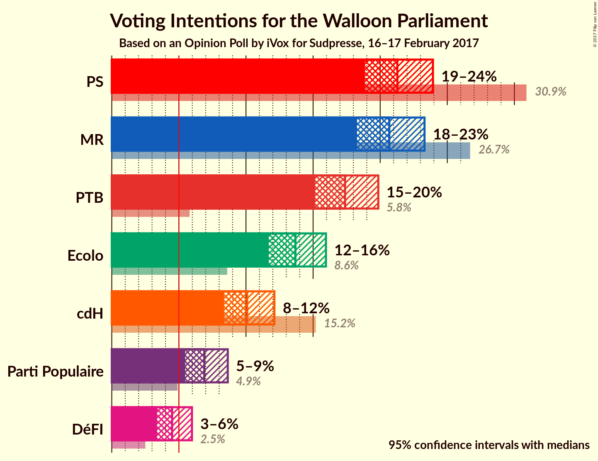
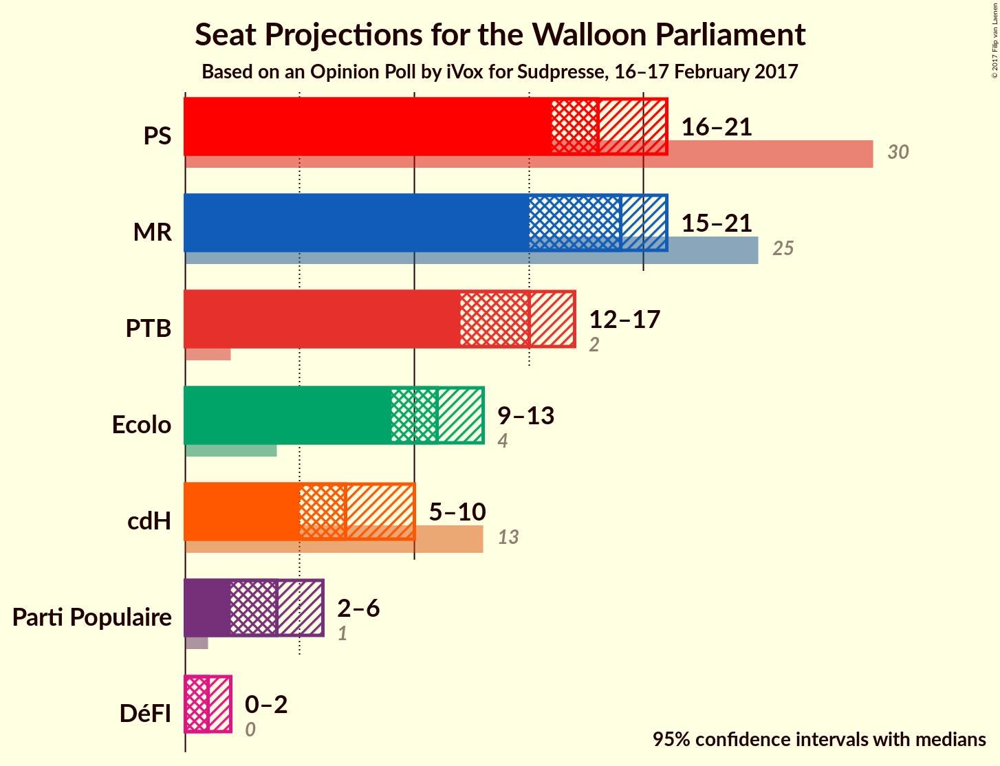
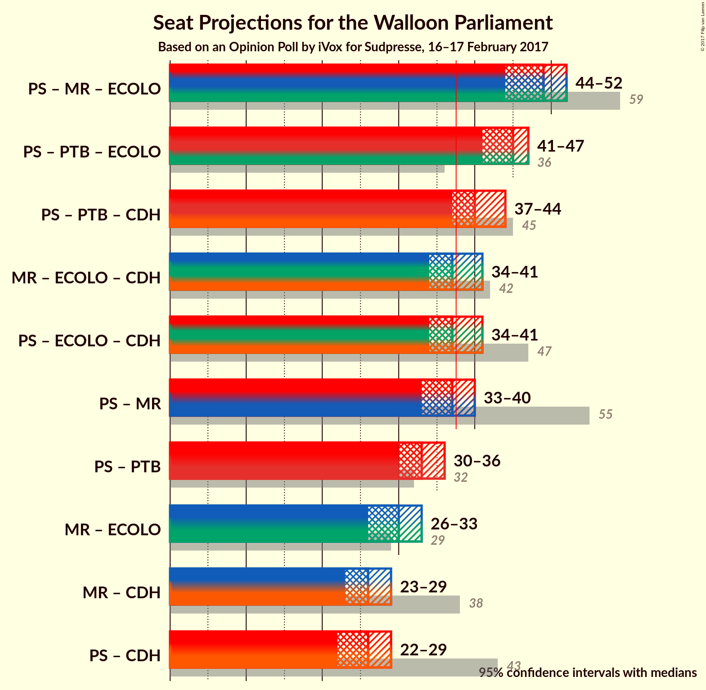

# Opinion Poll by iVox for Sudpresse, 16–17 February 2017

<a href="#voting-intentions">Voting Intentions</a> | <a href="#seats">Seats</a> | <a href="#coalitions">Coalitions</a> | <a href="#technical-information">Technical Information</a>

## Voting Intentions

### Confidence Intervals

| Party | Last Result | Poll Result | 80% Confidence Interval | 90% Confidence Interval | 95% Confidence Interval | 99% Confidence Interval |
|:-----:|:-----------:|:-----------:|:-----------------------:|:-----------------------:|:-----------------------:|:-----------------------:|
| PS | 30.9% | 21.3% | 19.7–23.0% |19.2–23.5% |18.9–23.9% |18.1–24.8% |
| MR | 26.7% | 20.7% | 19.1–22.4% |18.7–22.9% |18.3–23.3% |17.5–24.1% |
| PTB | 5.8% | 17.4% | 15.9–19.0% |15.5–19.5% |15.2–19.9% |14.5–20.7% |
| Ecolo | 8.6% | 13.7% | 12.4–15.2% |12.0–15.6% |11.7–16.0% |11.1–16.7% |
| cdH | 15.2% | 10.1% | 9.0–11.4% |8.6–11.8% |8.4–12.1% |7.8–12.8% |
| Parti Populaire | 4.9% | 6.9% | 6.0–8.0% |5.7–8.4% |5.5–8.6% |5.1–9.2% |
| DéFI | 2.5% | 4.5% | 3.7–5.5% |3.6–5.7% |3.4–6.0% |3.0–6.5% |

*Note:* The poll result column reflects the actual value used in the calculations. Published results may vary slightly, and in addition be rounded to fewer digits.

## Seats

### Confidence Intervals

| Party | Last Result | Median | 80% Confidence Interval | 90% Confidence Interval | 95% Confidence Interval | 99% Confidence Interval |
|:-----:|:-----------:|:------:|:-----------------------:|:-----------------------:|:-----------------------:|:-----------------------:|
| <a href="#ps">PS</a> | 30 | 18 | 17–20 |16–21 |16–21 |15–21 |
| <a href="#mr">MR</a> | 25 | 19 | 16–20 |15–20 |15–21 |15–22 |
| <a href="#ptb">PTB</a> | 2 | 15 | 13–16 |12–17 |12–17 |11–17 |
| <a href="#ecolo">Ecolo</a> | 4 | 11 | 11–13 |10–13 |9–13 |8–13 |
| <a href="#cdh">cdH</a> | 13 | 7 | 6–10 |5–10 |5–10 |5–10 |
| <a href="#parti-populaire">Parti Populaire</a> | 1 | 4 | 3–5 |2–5 |2–6 |2–6 |
| <a href="#défi">DéFI</a> | 0 | 1 | 0–1 |0–2 |0–2 |0–4 |

### PS

*For a full overview of the results for this party, see the [PS](party-ps.html) page.*

| Number of Seats | Probability | Accumulated | Special Marks |
|:---------------:|:-----------:|:-----------:|:-------------:|
| 15 | 0.6% | 100% |  |
| 16 | 6% | 99.4% |  |
| 17 | 18% | 94% |  |
| 18 | 31% | 75% | Median |
| 19 | 31% | 44% |  |
| 20 | 7% | 14% |  |
| 21 | 6% | 6% |  |
| 22 | 0.3% | 0.4% |  |
| 23 | 0.1% | 0.1% |  |
| 24 | 0% | 0% |  |
| 25 | 0% | 0% |  |
| 26 | 0% | 0% |  |
| 27 | 0% | 0% |  |
| 28 | 0% | 0% |  |
| 29 | 0% | 0% |  |
| 30 | 0% | 0% | Last Result |

### MR

*For a full overview of the results for this party, see the [MR](party-mr.html) page.*

| Number of Seats | Probability | Accumulated | Special Marks |
|:---------------:|:-----------:|:-----------:|:-------------:|
| 14 | 0.2% | 100% |  |
| 15 | 7% | 99.8% |  |
| 16 | 8% | 93% |  |
| 17 | 15% | 85% |  |
| 18 | 16% | 70% |  |
| 19 | 20% | 54% | Median |
| 20 | 31% | 34% |  |
| 21 | 2% | 3% |  |
| 22 | 0.8% | 0.9% |  |
| 23 | 0.1% | 0.1% |  |
| 24 | 0% | 0% |  |
| 25 | 0% | 0% | Last Result |

### PTB

*For a full overview of the results for this party, see the [PTB](party-ptb.html) page.*

| Number of Seats | Probability | Accumulated | Special Marks |
|:---------------:|:-----------:|:-----------:|:-------------:|
| 2 | 0% | 100% | Last Result |
| 3 | 0% | 100% |  |
| 4 | 0% | 100% |  |
| 5 | 0% | 100% |  |
| 6 | 0% | 100% |  |
| 7 | 0% | 100% |  |
| 8 | 0% | 100% |  |
| 9 | 0% | 100% |  |
| 10 | 0.1% | 100% |  |
| 11 | 2% | 99.9% |  |
| 12 | 5% | 98% |  |
| 13 | 11% | 93% |  |
| 14 | 16% | 81% |  |
| 15 | 47% | 66% | Median |
| 16 | 13% | 19% |  |
| 17 | 6% | 6% |  |
| 18 | 0.1% | 0.2% |  |
| 19 | 0% | 0% |  |

### Ecolo

*For a full overview of the results for this party, see the [Ecolo](party-ecolo.html) page.*

| Number of Seats | Probability | Accumulated | Special Marks |
|:---------------:|:-----------:|:-----------:|:-------------:|
| 4 | 0% | 100% | Last Result |
| 5 | 0% | 100% |  |
| 6 | 0% | 100% |  |
| 7 | 0.1% | 100% |  |
| 8 | 0.3% | 99.8% |  |
| 9 | 2% | 99.5% |  |
| 10 | 4% | 97% |  |
| 11 | 52% | 94% | Median |
| 12 | 19% | 42% |  |
| 13 | 22% | 22% |  |
| 14 | 0.3% | 0.3% |  |
| 15 | 0% | 0.1% |  |
| 16 | 0% | 0% |  |

### cdH

*For a full overview of the results for this party, see the [cdH](party-cdh.html) page.*

| Number of Seats | Probability | Accumulated | Special Marks |
|:---------------:|:-----------:|:-----------:|:-------------:|
| 5 | 6% | 100% |  |
| 6 | 34% | 94% |  |
| 7 | 12% | 60% | Median |
| 8 | 10% | 48% |  |
| 9 | 17% | 38% |  |
| 10 | 20% | 20% |  |
| 11 | 0.3% | 0.4% |  |
| 12 | 0.1% | 0.1% |  |
| 13 | 0% | 0% | Last Result |

### Parti Populaire

*For a full overview of the results for this party, see the [Parti Populaire](party-partipopulaire.html) page.*

| Number of Seats | Probability | Accumulated | Special Marks |
|:---------------:|:-----------:|:-----------:|:-------------:|
| 1 | 0.1% | 100% | Last Result |
| 2 | 9% | 99.9% |  |
| 3 | 19% | 91% |  |
| 4 | 49% | 71% | Median |
| 5 | 19% | 23% |  |
| 6 | 3% | 4% |  |
| 7 | 0.1% | 0.2% |  |
| 8 | 0% | 0% |  |

### DéFI

*For a full overview of the results for this party, see the [DéFI](party-dfi.html) page.*

| Number of Seats | Probability | Accumulated | Special Marks |
|:---------------:|:-----------:|:-----------:|:-------------:|
| 0 | 49% | 100% | Last Result |
| 1 | 42% | 51% | Median |
| 2 | 7% | 9% |  |
| 3 | 0.5% | 1.3% |  |
| 4 | 0.6% | 0.8% |  |
| 5 | 0.2% | 0.2% |  |
| 6 | 0% | 0% |  |

## Coalitions

### Confidence Intervals

| Coalition | Last Result | Median | Majority? | 80% Confidence Interval | 90% Confidence Interval | 95% Confidence Interval | 99% Confidence Interval |
|:---------:|:-----------:|:------:|:---------:|:-----------------------:|:-----------------------:|:-----------------------:|:-----------------------:|
| PS – MR – Ecolo | 59 | 48 | 100% | 46–51 | 45–51 | 44–52 | 43–53 |
| PS – PTB – Ecolo | 36 | 45 | 100% | 42–47 | 42–47 | 41–47 | 40–48 |
| PS – PTB – cdH | 45 | 40 | 94% | 38–43 | 37–44 | 37–44 | 36–45 |
| PS – Ecolo – cdH | 47 | 37 | 50% | 35–40 | 35–41 | 34–42 | 33–43 |
| MR – Ecolo – cdH | 42 | 38 | 51% | 35–40 | 34–40 | 34–41 | 33–42 |
| PS – MR | 55 | 37 | 38% | 34–39 | 33–40 | 33–40 | 32–41 |
| PS – PTB | 32 | 33 | 0.1% | 31–35 | 30–36 | 30–36 | 28–36 |
| MR – Ecolo | 29 | 30 | 0% | 27–32 | 27–33 | 26–33 | 25–33 |
| PS – cdH | 43 | 26 | 0% | 24–28 | 23–29 | 22–30 | 22–31 |
| MR – cdH | 38 | 26 | 0% | 24–28 | 23–29 | 23–29 | 22–30 |

### PS – MR – Ecolo

| Number of Seats | Probability | Accumulated | Special Marks |
|:---------------:|:-----------:|:-----------:|:-------------:|
| 42 | 0.1% | 100% |  |
| 43 | 0.7% | 99.9% |  |
| 44 | 2% | 99.2% |  |
| 45 | 5% | 97% |  |
| 46 | 13% | 93% |  |
| 47 | 14% | 79% |  |
| 48 | 17% | 65% | Median |
| 49 | 20% | 48% |  |
| 50 | 14% | 28% |  |
| 51 | 9% | 14% |  |
| 52 | 4% | 5% |  |
| 53 | 0.5% | 0.6% |  |
| 54 | 0.1% | 0.1% |  |
| 55 | 0% | 0% |  |
| 56 | 0% | 0% |  |
| 57 | 0% | 0% |  |
| 58 | 0% | 0% |  |
| 59 | 0% | 0% | Last Result |

### PS – PTB – Ecolo

| Number of Seats | Probability | Accumulated | Special Marks |
|:---------------:|:-----------:|:-----------:|:-------------:|
| 36 | 0% | 100% | Last Result |
| 37 | 0% | 100% |  |
| 38 | 0% | 100% | Majority |
| 39 | 0.2% | 100% |  |
| 40 | 1.0% | 99.7% |  |
| 41 | 3% | 98.7% |  |
| 42 | 8% | 95% |  |
| 43 | 12% | 87% |  |
| 44 | 22% | 76% | Median |
| 45 | 26% | 54% |  |
| 46 | 16% | 27% |  |
| 47 | 10% | 11% |  |
| 48 | 1.3% | 2% |  |
| 49 | 0.2% | 0.2% |  |
| 50 | 0% | 0% |  |

### PS – PTB – cdH

| Number of Seats | Probability | Accumulated | Special Marks |
|:---------------:|:-----------:|:-----------:|:-------------:|
| 34 | 0.1% | 100% |  |
| 35 | 0.4% | 99.9% |  |
| 36 | 1.4% | 99.6% |  |
| 37 | 4% | 98% |  |
| 38 | 7% | 94% | Majority |
| 39 | 13% | 87% |  |
| 40 | 25% | 74% | Median |
| 41 | 19% | 49% |  |
| 42 | 16% | 30% |  |
| 43 | 9% | 15% |  |
| 44 | 4% | 6% |  |
| 45 | 1.1% | 1.4% | Last Result |
| 46 | 0.2% | 0.3% |  |
| 47 | 0% | 0% |  |

### PS – Ecolo – cdH

| Number of Seats | Probability | Accumulated | Special Marks |
|:---------------:|:-----------:|:-----------:|:-------------:|
| 32 | 0.2% | 100% |  |
| 33 | 1.3% | 99.7% |  |
| 34 | 3% | 98% |  |
| 35 | 9% | 96% |  |
| 36 | 20% | 87% | Median |
| 37 | 17% | 67% |  |
| 38 | 22% | 50% | Majority |
| 39 | 14% | 28% |  |
| 40 | 8% | 14% |  |
| 41 | 3% | 5% |  |
| 42 | 2% | 3% |  |
| 43 | 0.6% | 0.7% |  |
| 44 | 0.1% | 0.1% |  |
| 45 | 0% | 0% |  |
| 46 | 0% | 0% |  |
| 47 | 0% | 0% | Last Result |

### MR – Ecolo – cdH

| Number of Seats | Probability | Accumulated | Special Marks |
|:---------------:|:-----------:|:-----------:|:-------------:|
| 32 | 0.1% | 100% |  |
| 33 | 1.1% | 99.9% |  |
| 34 | 4% | 98.8% |  |
| 35 | 6% | 95% |  |
| 36 | 17% | 89% |  |
| 37 | 22% | 72% | Median |
| 38 | 21% | 51% | Majority |
| 39 | 15% | 30% |  |
| 40 | 11% | 15% |  |
| 41 | 3% | 4% |  |
| 42 | 1.2% | 1.2% | Last Result |
| 43 | 0% | 0.1% |  |
| 44 | 0% | 0% |  |

### PS – MR

| Number of Seats | Probability | Accumulated | Special Marks |
|:---------------:|:-----------:|:-----------:|:-------------:|
| 31 | 0.1% | 100% |  |
| 32 | 1.3% | 99.8% |  |
| 33 | 4% | 98.5% |  |
| 34 | 9% | 95% |  |
| 35 | 13% | 86% |  |
| 36 | 19% | 74% |  |
| 37 | 17% | 54% | Median |
| 38 | 17% | 38% | Majority |
| 39 | 16% | 21% |  |
| 40 | 4% | 5% |  |
| 41 | 1.4% | 2% |  |
| 42 | 0.2% | 0.2% |  |
| 43 | 0% | 0% |  |
| 44 | 0% | 0% |  |
| 45 | 0% | 0% |  |
| 46 | 0% | 0% |  |
| 47 | 0% | 0% |  |
| 48 | 0% | 0% |  |
| 49 | 0% | 0% |  |
| 50 | 0% | 0% |  |
| 51 | 0% | 0% |  |
| 52 | 0% | 0% |  |
| 53 | 0% | 0% |  |
| 54 | 0% | 0% |  |
| 55 | 0% | 0% | Last Result |

### PS – PTB

| Number of Seats | Probability | Accumulated | Special Marks |
|:---------------:|:-----------:|:-----------:|:-------------:|
| 28 | 0.5% | 100% |  |
| 29 | 2% | 99.5% |  |
| 30 | 5% | 98% |  |
| 31 | 11% | 93% |  |
| 32 | 20% | 82% | Last Result |
| 33 | 22% | 62% | Median |
| 34 | 25% | 40% |  |
| 35 | 9% | 15% |  |
| 36 | 6% | 6% |  |
| 37 | 0.3% | 0.4% |  |
| 38 | 0.1% | 0.1% | Majority |
| 39 | 0% | 0% |  |

### MR – Ecolo

| Number of Seats | Probability | Accumulated | Special Marks |
|:---------------:|:-----------:|:-----------:|:-------------:|
| 24 | 0.1% | 100% |  |
| 25 | 0.6% | 99.9% |  |
| 26 | 3% | 99.3% |  |
| 27 | 6% | 96% |  |
| 28 | 12% | 90% |  |
| 29 | 16% | 78% | Last Result |
| 30 | 20% | 62% | Median |
| 31 | 23% | 42% |  |
| 32 | 11% | 19% |  |
| 33 | 7% | 8% |  |
| 34 | 0.4% | 0.5% |  |
| 35 | 0.1% | 0.1% |  |
| 36 | 0% | 0% |  |

### PS – cdH

| Number of Seats | Probability | Accumulated | Special Marks |
|:---------------:|:-----------:|:-----------:|:-------------:|
| 21 | 0.2% | 100% |  |
| 22 | 2% | 99.8% |  |
| 23 | 4% | 97% |  |
| 24 | 13% | 93% |  |
| 25 | 26% | 80% | Median |
| 26 | 17% | 54% |  |
| 27 | 17% | 37% |  |
| 28 | 13% | 20% |  |
| 29 | 4% | 7% |  |
| 30 | 1.2% | 3% |  |
| 31 | 2% | 2% |  |
| 32 | 0% | 0% |  |
| 33 | 0% | 0% |  |
| 34 | 0% | 0% |  |
| 35 | 0% | 0% |  |
| 36 | 0% | 0% |  |
| 37 | 0% | 0% |  |
| 38 | 0% | 0% | Majority |
| 39 | 0% | 0% |  |
| 40 | 0% | 0% |  |
| 41 | 0% | 0% |  |
| 42 | 0% | 0% |  |
| 43 | 0% | 0% | Last Result |

### MR – cdH

| Number of Seats | Probability | Accumulated | Special Marks |
|:---------------:|:-----------:|:-----------:|:-------------:|
| 21 | 0.1% | 100% |  |
| 22 | 2% | 99.8% |  |
| 23 | 7% | 98% |  |
| 24 | 8% | 91% |  |
| 25 | 19% | 82% |  |
| 26 | 26% | 63% | Median |
| 27 | 16% | 37% |  |
| 28 | 15% | 21% |  |
| 29 | 5% | 6% |  |
| 30 | 0.6% | 0.8% |  |
| 31 | 0.2% | 0.2% |  |
| 32 | 0% | 0% |  |
| 33 | 0% | 0% |  |
| 34 | 0% | 0% |  |
| 35 | 0% | 0% |  |
| 36 | 0% | 0% |  |
| 37 | 0% | 0% |  |
| 38 | 0% | 0% | Last Result, Majority |

## Technical Information

### Opinion Poll

+ **Pollster:** iVox
+ **Media:** Sudpresse
+ **Fieldwork period:** 16–17 February 2017

### Calculations

+ **Sample size:** 1001
+ **Simulations done:** 2,097,152
+ **Error estimate:** 1.13%

