# Opinion Poll by Dedicated for RTBf–La Libre Belgique, 16–20 March 2017

<a href="#voting-intentions">Voting Intentions</a> | <a href="#seats">Seats</a> | <a href="#coalitions">Coalitions</a> | <a href="#technical-information">Technical Information</a>

## Voting Intentions

### Confidence Intervals

| Party | Last Result | Poll Result | 80% Confidence Interval | 90% Confidence Interval | 95% Confidence Interval | 99% Confidence Interval |
|:-----:|:-----------:|:-----------:|:-----------------------:|:-----------------------:|:-----------------------:|:-----------------------:|
| MR | 26.7% | 22.4% | 20.4–24.5% |19.9–25.1% |19.4–25.7% |18.5–26.7% |
| PS | 30.9% | 21.4% | 19.4–23.5% |18.9–24.1% |18.4–24.6% |17.5–25.7% |
| PTB | 5.8% | 20.0% | 18.2–22.1% |17.6–22.7% |17.2–23.2% |16.3–24.2% |
| cdH | 15.2% | 11.9% | 10.5–13.7% |10.0–14.2% |9.7–14.6% |9.0–15.5% |
| Ecolo | 8.6% | 11.3% | 9.9–13.0% |9.5–13.5% |9.2–14.0% |8.5–14.8% |
| La Droite | 1.4% | 2.5% | 1.9–3.5% |1.7–3.7% |1.6–4.0% |1.3–4.5% |
| DéFI | 2.5% | 2.4% | 1.8–3.3% |1.6–3.6% |1.4–3.8% |1.2–4.3% |
| Parti Populaire | 4.9% | 2.2% | 1.6–3.1% |1.5–3.4% |1.3–3.6% |1.1–4.1% |
| Wallonie d’Abord | 0.4% | 1.5% | 1.0–2.3% |0.9–2.5% |0.8–2.7% |0.6–3.1% |
| FW | 0.1% | 1.5% | 1.0–2.3% |0.9–2.5% |0.8–2.7% |0.6–3.1% |
| R.W.F. | 0.5% | 0.4% | 0.2–1.0% |0.2–1.1% |0.2–1.3% |0.1–1.6% |
| PIRATE | 0.2% | 0.1% | 0.1–0.6% |0.0–0.7% |0.0–0.8% |0.0–1.1% |

*Note:* The poll result column reflects the actual value used in the calculations. Published results may vary slightly, and in addition be rounded to fewer digits.

## Seats

### Confidence Intervals

| Party | Last Result | Median | 80% Confidence Interval | 90% Confidence Interval | 95% Confidence Interval | 99% Confidence Interval |
|:-----:|:-----------:|:------:|:-----------------------:|:-----------------------:|:-----------------------:|:-----------------------:|
| <a href="#mr">MR</a> | 25 | 20 | 18–22 |18–22 |17–22 |16–25 |
| <a href="#ps">PS</a> | 30 | 19 | 18–20 |17–21 |16–21 |16–23 |
| <a href="#ptb">PTB</a> | 2 | 18 | 16–19 |16–20 |15–20 |14–21 |
| <a href="#cdh">cdH</a> | 13 | 10 | 9–12 |8–12 |7–12 |6–13 |
| <a href="#ecolo">Ecolo</a> | 4 | 8 | 6–11 |6–11 |6–12 |6–13 |
| <a href="#la-droite">La Droite</a> | 0 | 0 | 0 |0 |0 |0 |
| <a href="#défi">DéFI</a> | 0 | 0 | 0 |0 |0 |0 |
| <a href="#parti-populaire">Parti Populaire</a> | 1 | 0 | 0 |0 |0 |0 |
| <a href="#wallonie-d’abord">Wallonie d’Abord</a> | 0 | 0 | 0 |0–1 |0–1 |0–1 |
| <a href="#fw">FW</a> | 0 | 0 | 0 |0 |0 |0 |
| <a href="#r.w.f.">R.W.F.</a> | 0 | 0 | 0 |0 |0 |0 |
| <a href="#pirate">PIRATE</a> | 0 | 0 | 0 |0 |0 |0–1 |

### MR

*For a full overview of the results for this party, see the [MR](party-mr.html) page.*

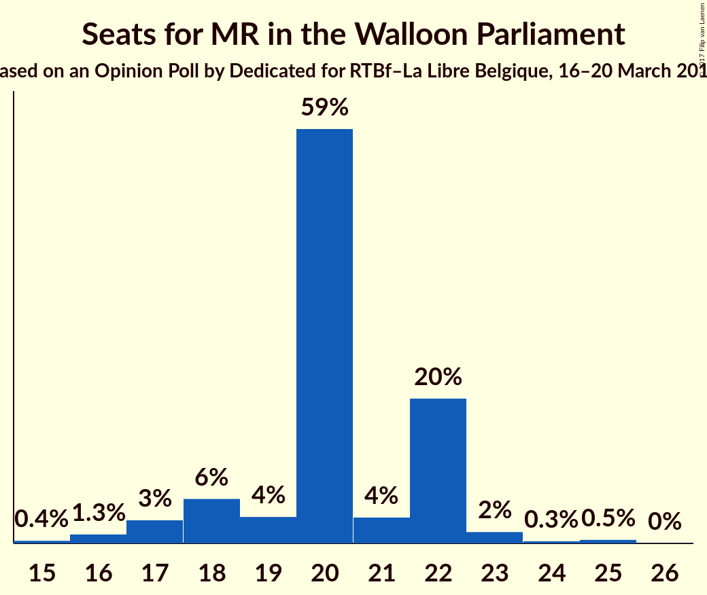

| Number of Seats | Probability | Accumulated | Special Marks |
|:---------------:|:-----------:|:-----------:|:-------------:|
| 15 | 0.4% | 100% |  |
| 16 | 1.3% | 99.6% |  |
| 17 | 3% | 98% |  |
| 18 | 6% | 95% |  |
| 19 | 4% | 89% |  |
| 20 | 59% | 85% | Median |
| 21 | 4% | 27% |  |
| 22 | 20% | 23% |  |
| 23 | 2% | 2% |  |
| 24 | 0.3% | 0.8% |  |
| 25 | 0.5% | 0.5% | Last Result |
| 26 | 0% | 0% |  |

### PS

*For a full overview of the results for this party, see the [PS](party-ps.html) page.*

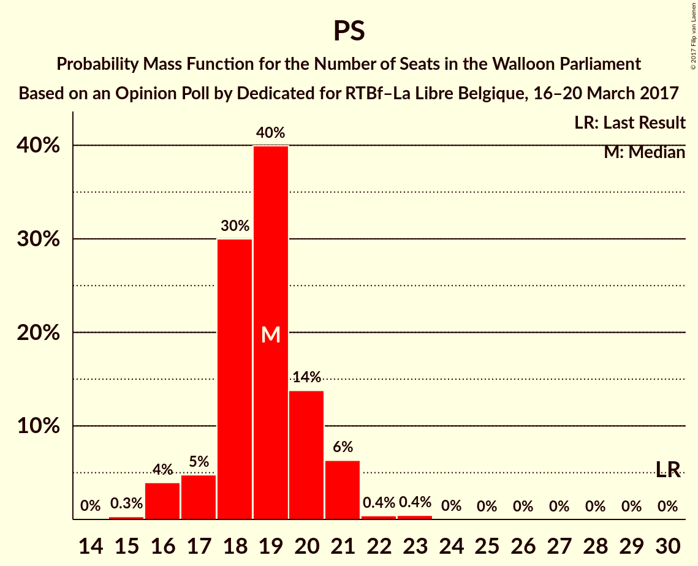

| Number of Seats | Probability | Accumulated | Special Marks |
|:---------------:|:-----------:|:-----------:|:-------------:|
| 15 | 0.3% | 100% |  |
| 16 | 4% | 99.7% |  |
| 17 | 5% | 96% |  |
| 18 | 30% | 91% |  |
| 19 | 40% | 61% | Median |
| 20 | 14% | 21% |  |
| 21 | 6% | 7% |  |
| 22 | 0.4% | 0.9% |  |
| 23 | 0.4% | 0.5% |  |
| 24 | 0% | 0.1% |  |
| 25 | 0% | 0% |  |
| 26 | 0% | 0% |  |
| 27 | 0% | 0% |  |
| 28 | 0% | 0% |  |
| 29 | 0% | 0% |  |
| 30 | 0% | 0% | Last Result |

### PTB

*For a full overview of the results for this party, see the [PTB](party-ptb.html) page.*

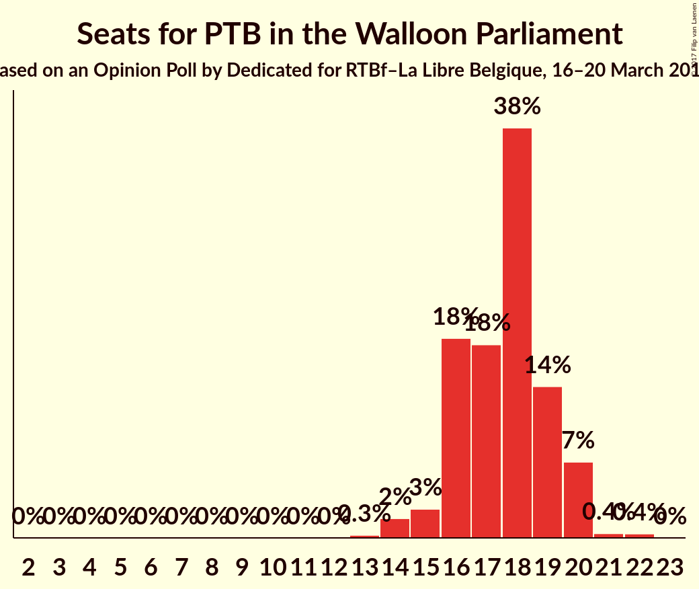

| Number of Seats | Probability | Accumulated | Special Marks |
|:---------------:|:-----------:|:-----------:|:-------------:|
| 2 | 0% | 100% | Last Result |
| 3 | 0% | 100% |  |
| 4 | 0% | 100% |  |
| 5 | 0% | 100% |  |
| 6 | 0% | 100% |  |
| 7 | 0% | 100% |  |
| 8 | 0% | 100% |  |
| 9 | 0% | 100% |  |
| 10 | 0% | 100% |  |
| 11 | 0% | 100% |  |
| 12 | 0% | 100% |  |
| 13 | 0.3% | 100% |  |
| 14 | 2% | 99.7% |  |
| 15 | 3% | 98% |  |
| 16 | 18% | 95% |  |
| 17 | 18% | 77% |  |
| 18 | 38% | 59% | Median |
| 19 | 14% | 22% |  |
| 20 | 7% | 8% |  |
| 21 | 0.4% | 0.8% |  |
| 22 | 0.4% | 0.4% |  |
| 23 | 0% | 0% |  |

### cdH

*For a full overview of the results for this party, see the [cdH](party-cdh.html) page.*

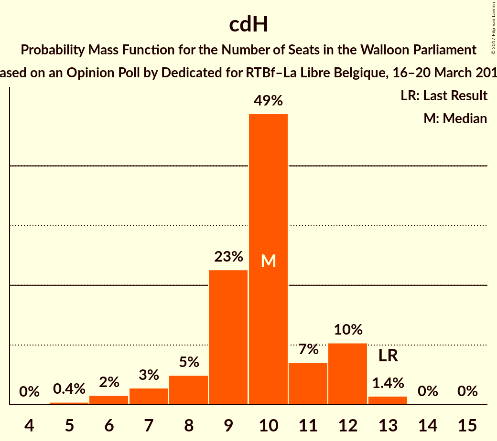

| Number of Seats | Probability | Accumulated | Special Marks |
|:---------------:|:-----------:|:-----------:|:-------------:|
| 5 | 0.4% | 100% |  |
| 6 | 2% | 99.6% |  |
| 7 | 3% | 98% |  |
| 8 | 5% | 95% |  |
| 9 | 23% | 90% |  |
| 10 | 49% | 68% | Median |
| 11 | 7% | 19% |  |
| 12 | 10% | 12% |  |
| 13 | 1.4% | 2% | Last Result |
| 14 | 0% | 0.1% |  |
| 15 | 0% | 0% |  |

### Ecolo

*For a full overview of the results for this party, see the [Ecolo](party-ecolo.html) page.*

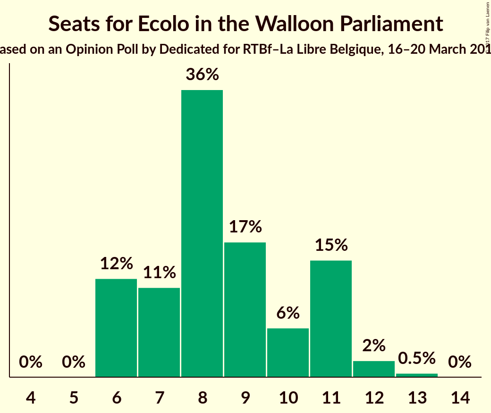

| Number of Seats | Probability | Accumulated | Special Marks |
|:---------------:|:-----------:|:-----------:|:-------------:|
| 4 | 0% | 100% | Last Result |
| 5 | 0% | 100% |  |
| 6 | 12% | 100% |  |
| 7 | 11% | 88% |  |
| 8 | 36% | 76% | Median |
| 9 | 17% | 40% |  |
| 10 | 6% | 23% |  |
| 11 | 15% | 17% |  |
| 12 | 2% | 3% |  |
| 13 | 0.5% | 0.5% |  |
| 14 | 0% | 0% |  |

### La Droite

*For a full overview of the results for this party, see the [La Droite](party-ladroite.html) page.*

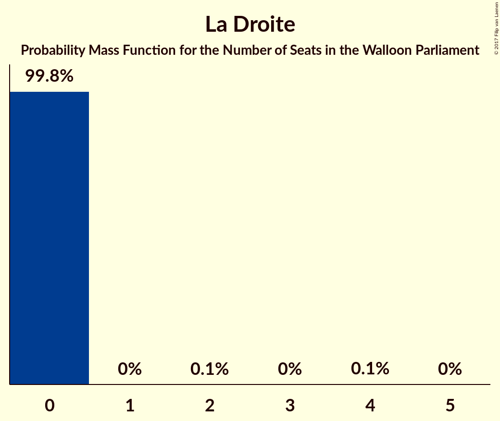

| Number of Seats | Probability | Accumulated | Special Marks |
|:---------------:|:-----------:|:-----------:|:-------------:|
| 0 | 99.8% | 100% | Last Result, Median |
| 1 | 0% | 0.2% |  |
| 2 | 0.1% | 0.2% |  |
| 3 | 0% | 0.1% |  |
| 4 | 0.1% | 0.1% |  |
| 5 | 0% | 0% |  |

### DéFI

*For a full overview of the results for this party, see the [DéFI](party-défi.html) page.*

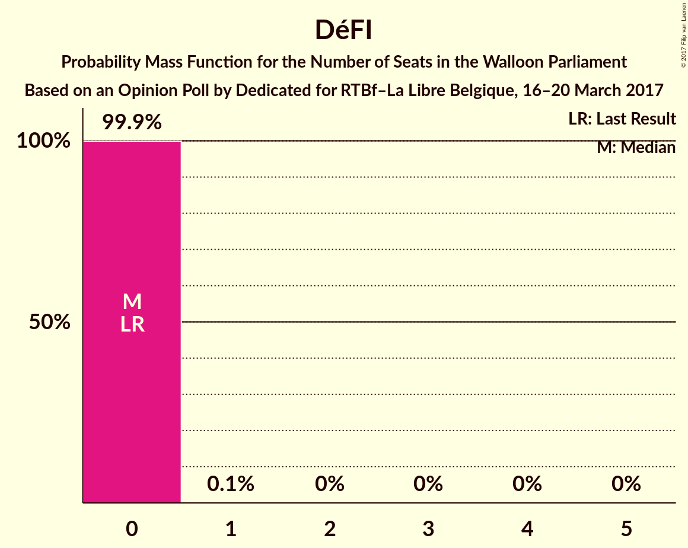

| Number of Seats | Probability | Accumulated | Special Marks |
|:---------------:|:-----------:|:-----------:|:-------------:|
| 0 | 99.9% | 100% | Last Result, Median |
| 1 | 0.1% | 0.1% |  |
| 2 | 0% | 0% |  |

### Parti Populaire

*For a full overview of the results for this party, see the [Parti Populaire](party-partipopulaire.html) page.*

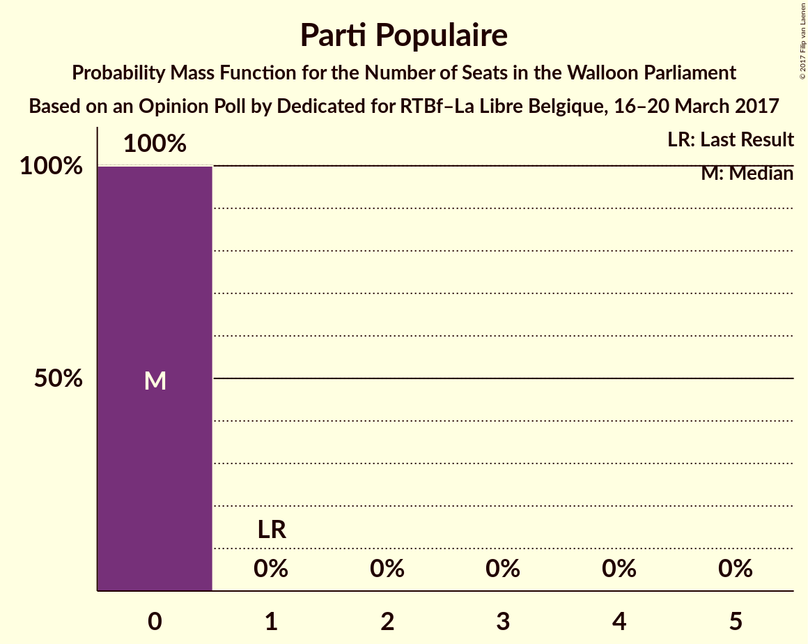

| Number of Seats | Probability | Accumulated | Special Marks |
|:---------------:|:-----------:|:-----------:|:-------------:|
| 0 | 100% | 100% | Median |
| 1 | 0% | 0% | Last Result |

### Wallonie d’Abord

*For a full overview of the results for this party, see the [Wallonie d’Abord](party-wallonied’abord.html) page.*

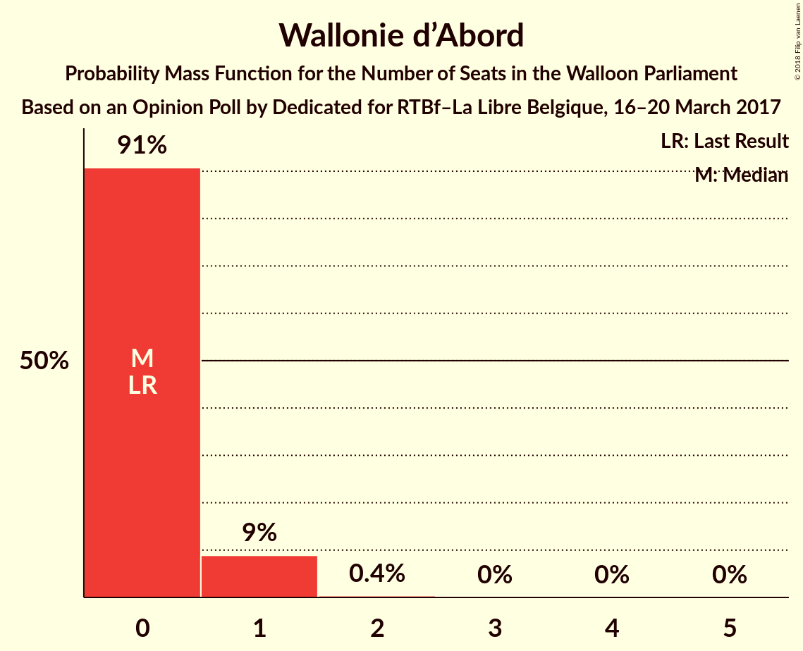

| Number of Seats | Probability | Accumulated | Special Marks |
|:---------------:|:-----------:|:-----------:|:-------------:|
| 0 | 91% | 100% | Last Result, Median |
| 1 | 9% | 9% |  |
| 2 | 0.4% | 0.4% |  |
| 3 | 0% | 0% |  |

### FW

*For a full overview of the results for this party, see the [FW](party-fw.html) page.*

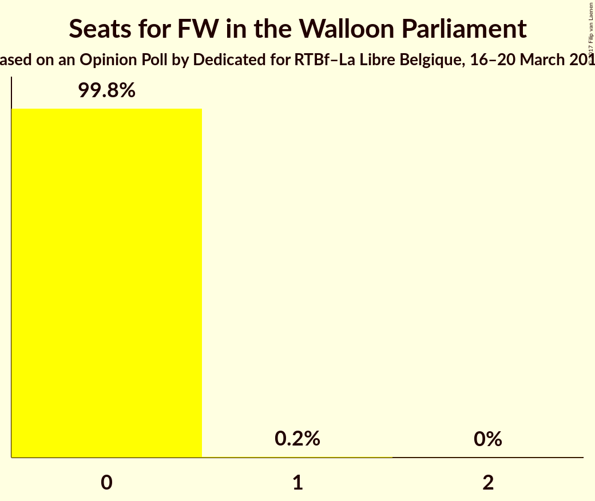

| Number of Seats | Probability | Accumulated | Special Marks |
|:---------------:|:-----------:|:-----------:|:-------------:|
| 0 | 99.8% | 100% | Last Result, Median |
| 1 | 0.2% | 0.2% |  |
| 2 | 0% | 0% |  |

### R.W.F.

*For a full overview of the results for this party, see the [R.W.F.](party-rwf.html) page.*

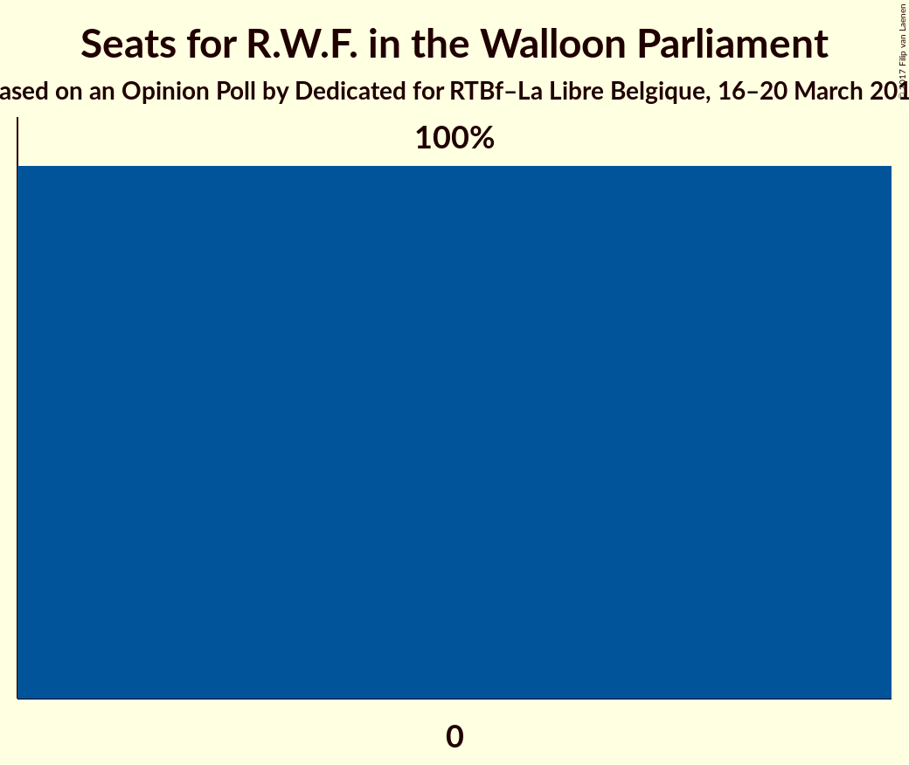

| Number of Seats | Probability | Accumulated | Special Marks |
|:---------------:|:-----------:|:-----------:|:-------------:|
| 0 | 100% | 100% | Last Result, Median |

### PIRATE

*For a full overview of the results for this party, see the [PIRATE](party-pirate.html) page.*

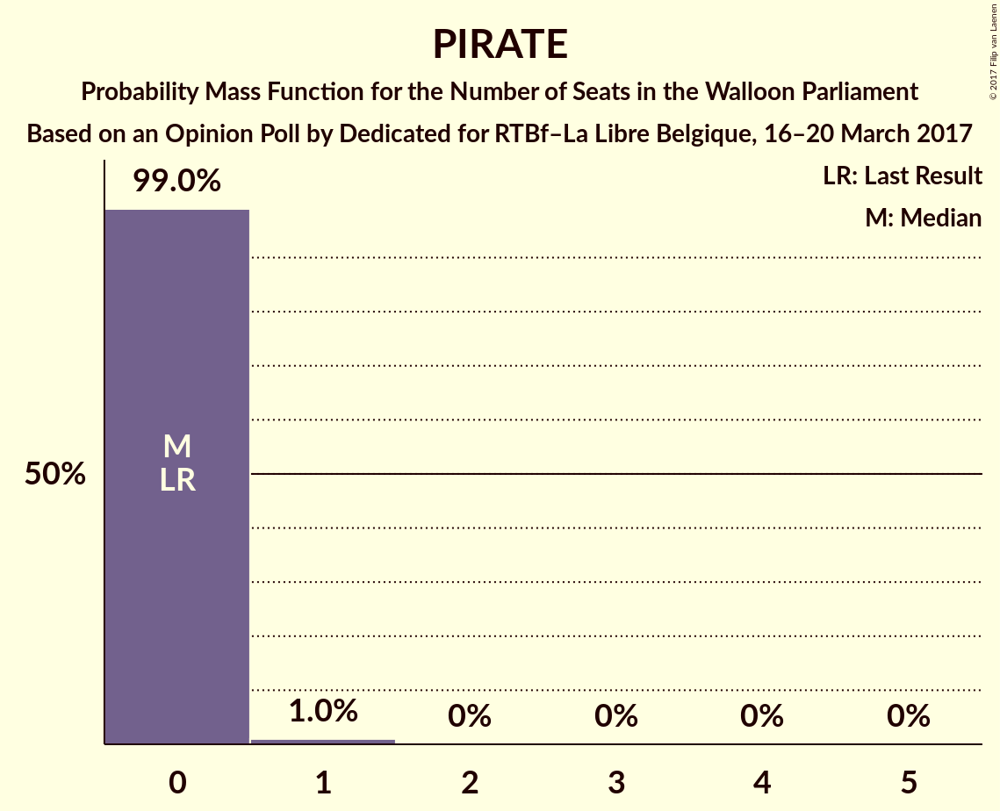

| Number of Seats | Probability | Accumulated | Special Marks |
|:---------------:|:-----------:|:-----------:|:-------------:|
| 0 | 99.0% | 100% | Last Result, Median |
| 1 | 1.0% | 1.0% |  |
| 2 | 0% | 0% |  |

## Coalitions

### Confidence Intervals

| Coalition | Last Result | Median | Majority? | 80% Confidence Interval | 90% Confidence Interval | 95% Confidence Interval | 99% Confidence Interval |
|:---------:|:-----------:|:------:|:---------:|:-----------------------:|:-----------------------:|:-----------------------:|:-----------------------:|
| MR – PS – Ecolo | 59 | 47 | 100% | 45–49 | 45–52 | 44–52 | 43–53 |
| PS – PTB – cdH | 45 | 46 | 100% | 44–48 | 43–49 | 42–49 | 41–50 |
| PS – PTB – Ecolo | 36 | 45 | 100% | 43–47 | 42–48 | 41–48 | 41–49 |
| MR – cdH – Ecolo | 42 | 38 | 86% | 37–40 | 36–41 | 36–42 | 35–43 |
| MR – PS | 55 | 39 | 85% | 36–41 | 35–42 | 35–42 | 34–43 |
| PS – cdH – Ecolo | 47 | 37 | 24% | 36–39 | 35–41 | 34–41 | 33–43 |
| PS – PTB | 32 | 37 | 13% | 34–38 | 34–38 | 33–39 | 32–40 |
| MR – cdH | 38 | 30 | 0% | 28–32 | 27–33 | 27–34 | 26–34 |
| MR – Ecolo | 29 | 28 | 0% | 27–31 | 26–31 | 26–33 | 24–34 |
| PS – cdH | 43 | 29 | 0% | 27–31 | 26–31 | 25–31 | 24–33 |

### MR – PS – Ecolo

| Number of Seats | Probability | Accumulated | Special Marks |
|:---------------:|:-----------:|:-----------:|:-------------:|
| 42 | 0.1% | 100% |  |
| 43 | 0.8% | 99.9% |  |
| 44 | 3% | 99.1% |  |
| 45 | 7% | 96% |  |
| 46 | 6% | 89% |  |
| 47 | 50% | 83% | Median |
| 48 | 6% | 32% |  |
| 49 | 19% | 27% |  |
| 50 | 1.3% | 8% |  |
| 51 | 1.5% | 7% |  |
| 52 | 5% | 5% |  |
| 53 | 0.4% | 0.5% |  |
| 54 | 0.1% | 0.1% |  |
| 55 | 0% | 0% |  |
| 56 | 0% | 0% |  |
| 57 | 0% | 0% |  |
| 58 | 0% | 0% |  |
| 59 | 0% | 0% | Last Result |

### PS – PTB – cdH

| Number of Seats | Probability | Accumulated | Special Marks |
|:---------------:|:-----------:|:-----------:|:-------------:|
| 39 | 0.1% | 100% |  |
| 40 | 0.1% | 99.9% |  |
| 41 | 2% | 99.9% |  |
| 42 | 2% | 98% |  |
| 43 | 0.9% | 96% |  |
| 44 | 9% | 95% |  |
| 45 | 12% | 86% | Last Result |
| 46 | 24% | 73% |  |
| 47 | 33% | 49% | Median |
| 48 | 10% | 16% |  |
| 49 | 5% | 6% |  |
| 50 | 0.8% | 1.1% |  |
| 51 | 0.3% | 0.3% |  |
| 52 | 0% | 0.1% |  |
| 53 | 0% | 0% |  |

### PS – PTB – Ecolo

| Number of Seats | Probability | Accumulated | Special Marks |
|:---------------:|:-----------:|:-----------:|:-------------:|
| 36 | 0% | 100% | Last Result |
| 37 | 0% | 100% |  |
| 38 | 0% | 100% | Majority |
| 39 | 0.1% | 100% |  |
| 40 | 0.4% | 99.9% |  |
| 41 | 4% | 99.5% |  |
| 42 | 3% | 96% |  |
| 43 | 12% | 93% |  |
| 44 | 17% | 81% |  |
| 45 | 34% | 64% | Median |
| 46 | 16% | 30% |  |
| 47 | 7% | 14% |  |
| 48 | 6% | 7% |  |
| 49 | 1.0% | 1.2% |  |
| 50 | 0.2% | 0.2% |  |
| 51 | 0% | 0% |  |

### MR – cdH – Ecolo

| Number of Seats | Probability | Accumulated | Special Marks |
|:---------------:|:-----------:|:-----------:|:-------------:|
| 32 | 0.1% | 100% |  |
| 33 | 0% | 99.9% |  |
| 34 | 0.2% | 99.9% |  |
| 35 | 0.6% | 99.7% |  |
| 36 | 6% | 99.1% |  |
| 37 | 7% | 94% |  |
| 38 | 45% | 86% | Median, Majority |
| 39 | 24% | 42% |  |
| 40 | 9% | 18% |  |
| 41 | 5% | 9% |  |
| 42 | 2% | 3% | Last Result |
| 43 | 1.5% | 2% |  |
| 44 | 0.2% | 0.2% |  |
| 45 | 0% | 0% |  |

### MR – PS

| Number of Seats | Probability | Accumulated | Special Marks |
|:---------------:|:-----------:|:-----------:|:-------------:|
| 32 | 0% | 100% |  |
| 33 | 0.2% | 99.9% |  |
| 34 | 1.5% | 99.8% |  |
| 35 | 3% | 98% |  |
| 36 | 6% | 95% |  |
| 37 | 4% | 89% |  |
| 38 | 21% | 85% | Majority |
| 39 | 31% | 64% | Median |
| 40 | 9% | 33% |  |
| 41 | 15% | 23% |  |
| 42 | 8% | 8% |  |
| 43 | 0.5% | 0.8% |  |
| 44 | 0.2% | 0.3% |  |
| 45 | 0% | 0.1% |  |
| 46 | 0% | 0% |  |
| 47 | 0% | 0% |  |
| 48 | 0% | 0% |  |
| 49 | 0% | 0% |  |
| 50 | 0% | 0% |  |
| 51 | 0% | 0% |  |
| 52 | 0% | 0% |  |
| 53 | 0% | 0% |  |
| 54 | 0% | 0% |  |
| 55 | 0% | 0% | Last Result |

### PS – cdH – Ecolo

| Number of Seats | Probability | Accumulated | Special Marks |
|:---------------:|:-----------:|:-----------:|:-------------:|
| 32 | 0.4% | 100% |  |
| 33 | 0.4% | 99.6% |  |
| 34 | 3% | 99.2% |  |
| 35 | 5% | 96% |  |
| 36 | 24% | 91% |  |
| 37 | 43% | 67% | Median |
| 38 | 8% | 24% | Majority |
| 39 | 8% | 16% |  |
| 40 | 3% | 8% |  |
| 41 | 4% | 5% |  |
| 42 | 0.6% | 1.2% |  |
| 43 | 0.5% | 0.5% |  |
| 44 | 0% | 0% |  |
| 45 | 0% | 0% |  |
| 46 | 0% | 0% |  |
| 47 | 0% | 0% | Last Result |

### PS – PTB

| Number of Seats | Probability | Accumulated | Special Marks |
|:---------------:|:-----------:|:-----------:|:-------------:|
| 30 | 0.1% | 100% |  |
| 31 | 0.1% | 99.9% |  |
| 32 | 2% | 99.7% | Last Result |
| 33 | 3% | 98% |  |
| 34 | 6% | 95% |  |
| 35 | 9% | 90% |  |
| 36 | 24% | 80% |  |
| 37 | 43% | 57% | Median |
| 38 | 11% | 13% | Majority |
| 39 | 2% | 3% |  |
| 40 | 0.6% | 0.9% |  |
| 41 | 0.1% | 0.2% |  |
| 42 | 0% | 0.1% |  |
| 43 | 0.1% | 0.1% |  |
| 44 | 0% | 0% |  |

### MR – cdH

| Number of Seats | Probability | Accumulated | Special Marks |
|:---------------:|:-----------:|:-----------:|:-------------:|
| 25 | 0.3% | 100% |  |
| 26 | 0.9% | 99.6% |  |
| 27 | 6% | 98.7% |  |
| 28 | 9% | 93% |  |
| 29 | 15% | 84% |  |
| 30 | 37% | 69% | Median |
| 31 | 14% | 32% |  |
| 32 | 12% | 18% |  |
| 33 | 2% | 6% |  |
| 34 | 3% | 3% |  |
| 35 | 0.3% | 0.3% |  |
| 36 | 0% | 0% |  |
| 37 | 0% | 0% |  |
| 38 | 0% | 0% | Last Result, Majority |

### MR – Ecolo

| Number of Seats | Probability | Accumulated | Special Marks |
|:---------------:|:-----------:|:-----------:|:-------------:|
| 23 | 0.1% | 100% |  |
| 24 | 0.4% | 99.9% |  |
| 25 | 0.7% | 99.5% |  |
| 26 | 8% | 98.8% |  |
| 27 | 7% | 90% |  |
| 28 | 34% | 83% | Median |
| 29 | 26% | 50% | Last Result |
| 30 | 11% | 24% |  |
| 31 | 9% | 13% |  |
| 32 | 1.1% | 5% |  |
| 33 | 2% | 3% |  |
| 34 | 2% | 2% |  |
| 35 | 0% | 0.1% |  |
| 36 | 0.1% | 0.1% |  |
| 37 | 0% | 0% |  |

### PS – cdH

| Number of Seats | Probability | Accumulated | Special Marks |
|:---------------:|:-----------:|:-----------:|:-------------:|
| 22 | 0.1% | 100% |  |
| 23 | 0.2% | 99.9% |  |
| 24 | 0.6% | 99.6% |  |
| 25 | 2% | 99.0% |  |
| 26 | 6% | 97% |  |
| 27 | 15% | 90% |  |
| 28 | 16% | 75% |  |
| 29 | 33% | 59% | Median |
| 30 | 16% | 26% |  |
| 31 | 9% | 11% |  |
| 32 | 1.2% | 2% |  |
| 33 | 0.4% | 0.8% |  |
| 34 | 0.2% | 0.4% |  |
| 35 | 0.1% | 0.1% |  |
| 36 | 0% | 0% |  |
| 37 | 0% | 0% |  |
| 38 | 0% | 0% | Majority |
| 39 | 0% | 0% |  |
| 40 | 0% | 0% |  |
| 41 | 0% | 0% |  |
| 42 | 0% | 0% |  |
| 43 | 0% | 0% | Last Result |

## Technical Information

### Opinion Poll

+ **Polling firm:** Dedicated
+ **Commissioner(s):** RTBf–La Libre Belgique
+ **Fieldwork period:** 16–20 March 2017

### Calculations

+ **Sample size:** 679
+ **Simulations done:** 4,194,304
+ **Error estimate:** 1.55%

