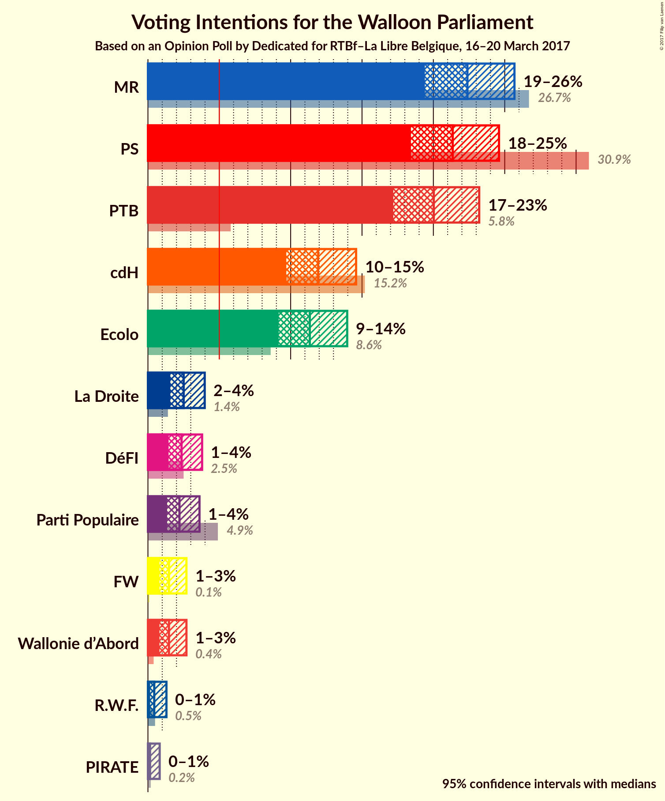
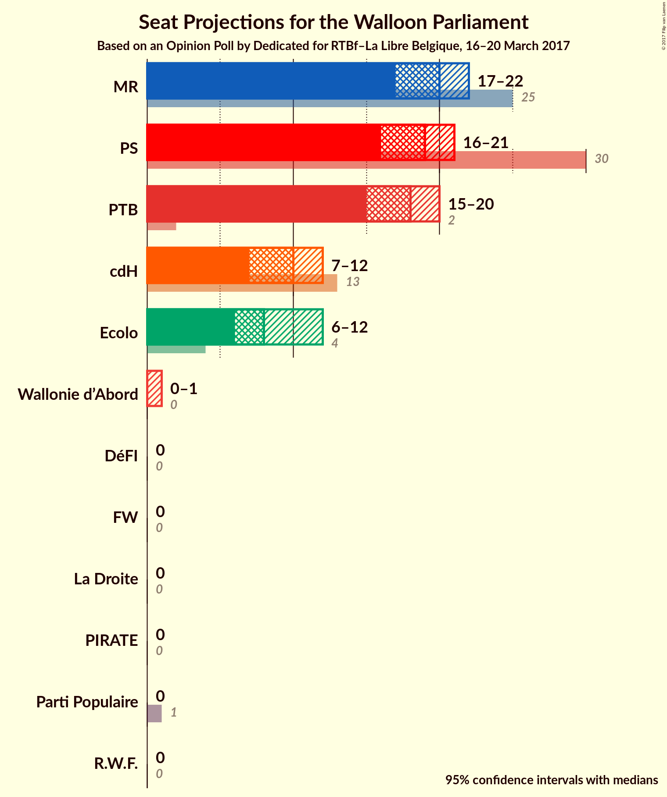
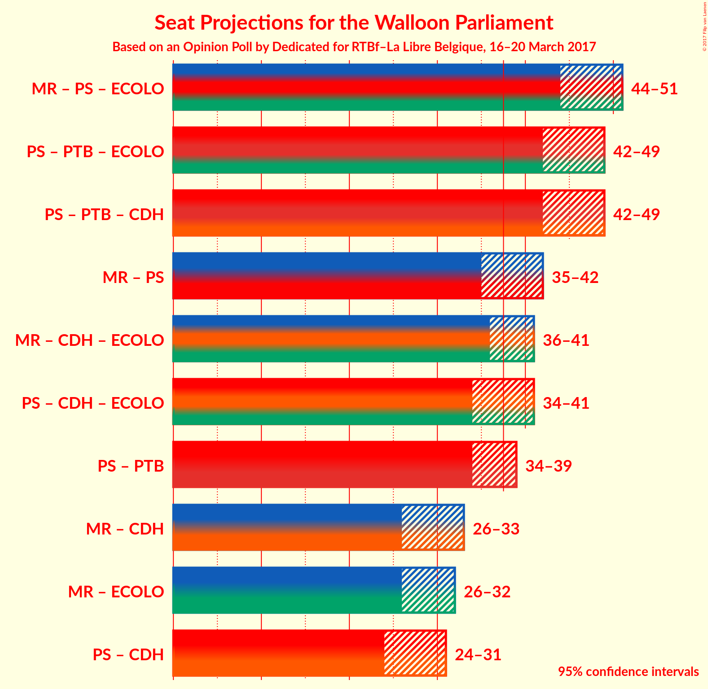

# Opinion Poll by Dedicated for RTBf–La Libre Belgique, 16–20 March 2017

<a href="#voting-intentions">Voting Intentions</a> | <a href="#seats">Seats</a> | <a href="#coalitions">Coalitions</a> | <a href="#technical-information">Technical Information</a>

## Voting Intentions

### Confidence Intervals

| Party | Last Result | Poll Result | 80% Confidence Interval | 90% Confidence Interval | 95% Confidence Interval | 99% Confidence Interval |
|:-----:|:-----------:|:-----------:|:-----------------------:|:-----------------------:|:-----------------------:|:-----------------------:|
| MR | 26.7% | 22.4% | N/A |N/A |N/A |N/A |
| PS | 30.9% | 21.4% | N/A |N/A |N/A |N/A |
| PTB | 5.8% | 20.0% | N/A |N/A |N/A |N/A |
| cdH | 15.2% | 11.9% | N/A |N/A |N/A |N/A |
| Ecolo | 8.6% | 11.3% | N/A |N/A |N/A |N/A |
| La Droite | 1.4% | 2.5% | N/A |N/A |N/A |N/A |
| DéFI | 2.5% | 2.4% | N/A |N/A |N/A |N/A |
| Parti Populaire | 4.9% | 2.2% | N/A |N/A |N/A |N/A |
| Wallonie d'Abord | 0.4% | 1.5% | N/A |N/A |N/A |N/A |
| FW | 0.1% | 1.5% | N/A |N/A |N/A |N/A |
| R.W.F. | 0.5% | 0.4% | N/A |N/A |N/A |N/A |
| PIRATE | 0.2% | 0.1% | N/A |N/A |N/A |N/A |

*Note:* The poll result column reflects the actual value used in the calculations. Published results may vary slightly, and in addition be rounded to fewer digits.

## Seats

### Confidence Intervals

| Party | Last Result | Median | 80% Confidence Interval | 90% Confidence Interval | 95% Confidence Interval | 99% Confidence Interval |
|:-----:|:-----------:|:------:|:-----------------------:|:-----------------------:|:-----------------------:|:-----------------------:|
| <a href="#mr">MR</a> | 25 | N/A | N/A |N/A |N/A |N/A |
| <a href="#ps">PS</a> | 30 | N/A | N/A |N/A |N/A |N/A |
| <a href="#ptb">PTB</a> | 2 | N/A | N/A |N/A |N/A |N/A |
| <a href="#cdh">cdH</a> | 13 | N/A | N/A |N/A |N/A |N/A |
| <a href="#ecolo">Ecolo</a> | 4 | N/A | N/A |N/A |N/A |N/A |
| <a href="#la-droite">La Droite</a> | 0 | N/A | N/A |N/A |N/A |N/A |
| <a href="#défi">DéFI</a> | 0 | N/A | N/A |N/A |N/A |N/A |
| <a href="#parti-populaire">Parti Populaire</a> | 1 | N/A | N/A |N/A |N/A |N/A |
| <a href="#wallonie-d'abord">Wallonie d'Abord</a> | 0 | N/A | N/A |N/A |N/A |N/A |
| <a href="#fw">FW</a> | 0 | N/A | N/A |N/A |N/A |N/A |
| <a href="#r.w.f.">R.W.F.</a> | 0 | N/A | N/A |N/A |N/A |N/A |
| <a href="#pirate">PIRATE</a> | 0 | N/A | N/A |N/A |N/A |N/A |

## Coalitions

## Technical Information

### Opinion Poll

+ **Pollster:** Dedicated
+ **Media:** RTBf–La Libre Belgique
+ **Fieldwork period:** 16–20 March 2017

### Calculations

+ **Sample size:** 679
+ **Simulations done:** 0
+ **Error estimate:** 100.00%

