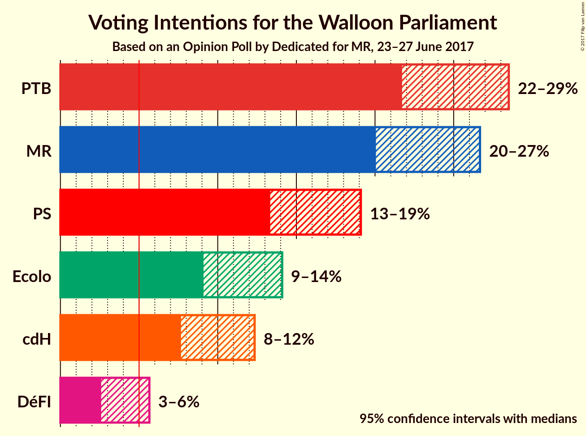
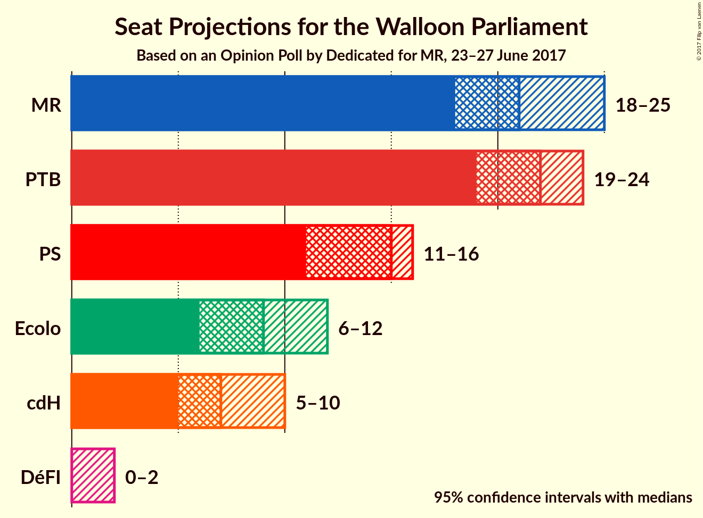
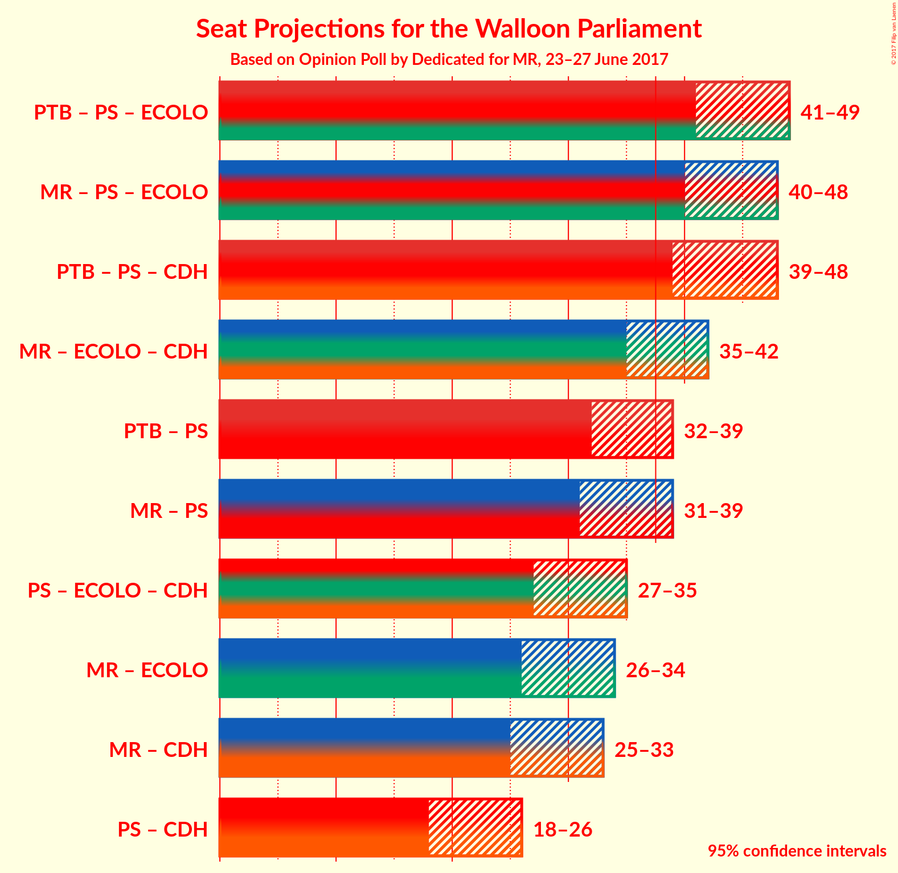

# Opinion Poll by Dedicated for MR, 23–27 June 2017

<a href="#voting-intentions">Voting Intentions</a> | <a href="#seats">Seats</a> | <a href="#coalitions">Coalitions</a> | <a href="#technical-information">Technical Information</a>

## Voting Intentions

### Confidence Intervals

| Party | Last Result | Poll Result | 80% Confidence Interval | 90% Confidence Interval | 95% Confidence Interval | 99% Confidence Interval |
|:-----:|:-----------:|:-----------:|:-----------------------:|:-----------------------:|:-----------------------:|:-----------------------:|
| PTB | 5.8% | 25.0% | 22.8–27.3% |22.2–27.9% |21.7–28.5% |20.7–29.6% |
| MR | 26.7% | 23.2% | 21.1–25.5% |20.5–26.1% |20.1–26.7% |19.1–27.8% |
| PS | 30.9% | 16.0% | 14.3–18.0% |13.7–18.6% |13.3–19.1% |12.5–20.1% |
| Ecolo | 8.6% | 11.4% | 9.9–13.2% |9.4–13.7% |9.1–14.1% |8.4–15.0% |
| cdH | 15.2% | 9.8% | 8.4–11.4% |8.0–11.9% |7.7–12.3% |7.1–13.2% |
| DéFI | 2.5% | 3.8% | 3.0–5.0% |2.8–5.3% |2.6–5.7% |2.2–6.3% |

*Note:* The poll result column reflects the actual value used in the calculations. Published results may vary slightly, and in addition be rounded to fewer digits.

## Seats

### Confidence Intervals

| Party | Last Result | Median | 80% Confidence Interval | 90% Confidence Interval | 95% Confidence Interval | 99% Confidence Interval |
|:-----:|:-----------:|:------:|:-----------------------:|:-----------------------:|:-----------------------:|:-----------------------:|
| <a href="#ptb">PTB</a> | 2 | 22 | 20–24 |19–24 |19–24 |17–26 |
| <a href="#mr">MR</a> | 25 | 21 | 19–23 |19–24 |18–25 |16–26 |
| <a href="#ps">PS</a> | 30 | 15 | 12–16 |12–16 |11–16 |9–18 |
| <a href="#ecolo">Ecolo</a> | 4 | 9 | 6–11 |6–11 |6–12 |6–13 |
| <a href="#cdh">cdH</a> | 13 | 7 | 5–10 |5–10 |5–10 |5–11 |
| <a href="#défi">DéFI</a> | 0 | 0 | 0–1 |0–1 |0–2 |0–3 |

### PTB

| Number of Seats | Probability | Accumulated |
|:---------------:|:-----------:|:-----------:|
| 17 | 1.0% | 100% |
| 18 | 1.3% | 99.0% |
| 19 | 5% | 98% |
| 20 | 19% | 92% |
| 21 | 11% | 73% |
| 22 | 42% | 61% |
| 23 | 8% | 20% |
| 24 | 10% | 12% |
| 25 | 2% | 2% |
| 26 | 0.4% | 0.8% |
| 27 | 0.3% | 0.4% |
| 28 | 0.1% | 0.1% |
| 29 | 0% | 0% |

### MR

| Number of Seats | Probability | Accumulated |
|:---------------:|:-----------:|:-----------:|
| 15 | 0.3% | 100% |
| 16 | 0.4% | 99.7% |
| 17 | 0.8% | 99.3% |
| 18 | 2% | 98% |
| 19 | 7% | 97% |
| 20 | 31% | 90% |
| 21 | 24% | 59% |
| 22 | 16% | 34% |
| 23 | 8% | 18% |
| 24 | 7% | 10% |
| 25 | 3% | 3% |
| 26 | 0.5% | 0.6% |
| 27 | 0.1% | 0.1% |
| 28 | 0% | 0% |

### PS

| Number of Seats | Probability | Accumulated |
|:---------------:|:-----------:|:-----------:|
| 8 | 0.1% | 100% |
| 9 | 0.7% | 99.9% |
| 10 | 1.2% | 99.2% |
| 11 | 3% | 98% |
| 12 | 6% | 95% |
| 13 | 21% | 89% |
| 14 | 13% | 68% |
| 15 | 39% | 55% |
| 16 | 15% | 16% |
| 17 | 0.6% | 1.2% |
| 18 | 0.5% | 0.6% |
| 19 | 0.2% | 0.2% |
| 20 | 0% | 0% |

### Ecolo

| Number of Seats | Probability | Accumulated |
|:---------------:|:-----------:|:-----------:|
| 6 | 12% | 100% |
| 7 | 11% | 88% |
| 8 | 9% | 77% |
| 9 | 19% | 68% |
| 10 | 14% | 49% |
| 11 | 31% | 35% |
| 12 | 1.4% | 3% |
| 13 | 2% | 2% |
| 14 | 0% | 0% |

### cdH

| Number of Seats | Probability | Accumulated |
|:---------------:|:-----------:|:-----------:|
| 4 | 0% | 100% |
| 5 | 20% | 99.9% |
| 6 | 21% | 80% |
| 7 | 12% | 59% |
| 8 | 10% | 48% |
| 9 | 16% | 38% |
| 10 | 20% | 21% |
| 11 | 0.5% | 1.0% |
| 12 | 0.5% | 0.5% |
| 13 | 0% | 0% |

### DéFI

| Number of Seats | Probability | Accumulated |
|:---------------:|:-----------:|:-----------:|
| 0 | 73% | 100% |
| 1 | 22% | 27% |
| 2 | 4% | 5% |
| 3 | 0.4% | 0.8% |
| 4 | 0.2% | 0.4% |
| 5 | 0.2% | 0.2% |
| 6 | 0% | 0% |

## Coalitions

### Confidence Intervals

| Coalition | Last Result | Median | 80% Confidence Interval | 90% Confidence Interval | 95% Confidence Interval | 99% Confidence Interval |
|:---------:|:-----------:|:------:|:-----------------------:|:-----------------------:|:-----------------------:|:-----------------------:|
| PTB – PS – Ecolo | 36 | 45 | 42–48 | 41–49 | 41–49 | 39–50 |
| MR – PS – Ecolo | 59 | 45 | 41–47 | 41–48 | 40–49 | 39–50 |
| PTB – PS – cdH | 45 | 43 | 41–47 | 40–47 | 39–48 | 38–49 |
| MR – Ecolo – cdH | 42 | 38 | 36–40 | 35–41 | 35–42 | 33–43 |
| PTB – PS | 32 | 36 | 33–38 | 32–39 | 32–39 | 30–41 |
| MR – PS | 55 | 35 | 33–38 | 32–39 | 31–39 | 30–40 |
| PS – Ecolo – cdH | 47 | 31 | 28–33 | 27–34 | 27–35 | 25–36 |
| MR – Ecolo | 29 | 31 | 27–33 | 26–33 | 26–34 | 25–35 |
| MR – cdH | 38 | 29 | 26–31 | 25–32 | 25–33 | 24–34 |
| PS – cdH | 43 | 21 | 19–25 | 18–25 | 18–26 | 17–26 |

### PTB – PS – Ecolo

| Number of Seats | Probability | Accumulated |
|:---------------:|:-----------:|:-----------:|
| 38 | 0.2% | 100% |
| 39 | 0.4% | 99.8% |
| 40 | 1.4% | 99.4% |
| 41 | 4% | 98% |
| 42 | 7% | 94% |
| 43 | 13% | 87% |
| 44 | 18% | 74% |
| 45 | 16% | 57% |
| 46 | 14% | 41% |
| 47 | 11% | 27% |
| 48 | 10% | 16% |
| 49 | 4% | 6% |
| 50 | 2% | 2% |
| 51 | 0.1% | 0.1% |
| 52 | 0% | 0% |

### MR – PS – Ecolo

| Number of Seats | Probability | Accumulated |
|:---------------:|:-----------:|:-----------:|
| 38 | 0.2% | 100% |
| 39 | 0.7% | 99.8% |
| 40 | 2% | 99.1% |
| 41 | 7% | 97% |
| 42 | 11% | 90% |
| 43 | 13% | 79% |
| 44 | 13% | 66% |
| 45 | 16% | 53% |
| 46 | 16% | 37% |
| 47 | 14% | 21% |
| 48 | 5% | 7% |
| 49 | 2% | 3% |
| 50 | 0.5% | 0.6% |
| 51 | 0.1% | 0.1% |
| 52 | 0% | 0% |

### PTB – PS – cdH

| Number of Seats | Probability | Accumulated |
|:---------------:|:-----------:|:-----------:|
| 36 | 0% | 100% |
| 37 | 0.2% | 99.9% |
| 38 | 0.7% | 99.7% |
| 39 | 2% | 99.0% |
| 40 | 6% | 97% |
| 41 | 11% | 90% |
| 42 | 21% | 80% |
| 43 | 16% | 59% |
| 44 | 15% | 43% |
| 45 | 10% | 28% |
| 46 | 8% | 18% |
| 47 | 7% | 10% |
| 48 | 2% | 4% |
| 49 | 1.0% | 1.1% |
| 50 | 0.1% | 0.1% |
| 51 | 0% | 0% |

### MR – Ecolo – cdH

| Number of Seats | Probability | Accumulated |
|:---------------:|:-----------:|:-----------:|
| 32 | 0.3% | 100% |
| 33 | 0.6% | 99.7% |
| 34 | 1.4% | 99.1% |
| 35 | 6% | 98% |
| 36 | 14% | 92% |
| 37 | 21% | 78% |
| 38 | 27% | 57% |
| 39 | 14% | 29% |
| 40 | 8% | 15% |
| 41 | 5% | 7% |
| 42 | 2% | 3% |
| 43 | 0.6% | 0.8% |
| 44 | 0.2% | 0.2% |
| 45 | 0% | 0% |

### PTB – PS

| Number of Seats | Probability | Accumulated |
|:---------------:|:-----------:|:-----------:|
| 29 | 0.2% | 100% |
| 30 | 0.5% | 99.8% |
| 31 | 1.4% | 99.3% |
| 32 | 3% | 98% |
| 33 | 5% | 95% |
| 34 | 9% | 89% |
| 35 | 22% | 80% |
| 36 | 19% | 58% |
| 37 | 23% | 39% |
| 38 | 10% | 16% |
| 39 | 4% | 6% |
| 40 | 1.1% | 2% |
| 41 | 0.5% | 0.7% |
| 42 | 0.1% | 0.2% |
| 43 | 0.1% | 0.1% |
| 44 | 0% | 0% |

### MR – PS

| Number of Seats | Probability | Accumulated |
|:---------------:|:-----------:|:-----------:|
| 28 | 0.1% | 100% |
| 29 | 0.3% | 99.9% |
| 30 | 1.3% | 99.6% |
| 31 | 2% | 98% |
| 32 | 4% | 96% |
| 33 | 9% | 93% |
| 34 | 15% | 84% |
| 35 | 22% | 69% |
| 36 | 25% | 47% |
| 37 | 10% | 23% |
| 38 | 7% | 13% |
| 39 | 4% | 6% |
| 40 | 2% | 2% |
| 41 | 0.4% | 0.5% |
| 42 | 0.1% | 0.1% |
| 43 | 0% | 0% |

### PS – Ecolo – cdH

| Number of Seats | Probability | Accumulated |
|:---------------:|:-----------:|:-----------:|
| 24 | 0.1% | 100% |
| 25 | 0.4% | 99.9% |
| 26 | 1.2% | 99.5% |
| 27 | 4% | 98% |
| 28 | 6% | 94% |
| 29 | 11% | 88% |
| 30 | 14% | 77% |
| 31 | 27% | 64% |
| 32 | 16% | 37% |
| 33 | 12% | 20% |
| 34 | 5% | 8% |
| 35 | 2% | 3% |
| 36 | 0.9% | 1.3% |
| 37 | 0.3% | 0.4% |
| 38 | 0.1% | 0.1% |
| 39 | 0% | 0% |

### MR – Ecolo

| Number of Seats | Probability | Accumulated |
|:---------------:|:-----------:|:-----------:|
| 24 | 0.1% | 100% |
| 25 | 0.8% | 99.9% |
| 26 | 4% | 99.1% |
| 27 | 6% | 95% |
| 28 | 10% | 89% |
| 29 | 12% | 78% |
| 30 | 15% | 66% |
| 31 | 19% | 51% |
| 32 | 17% | 31% |
| 33 | 9% | 14% |
| 34 | 3% | 5% |
| 35 | 1.2% | 1.5% |
| 36 | 0.2% | 0.3% |
| 37 | 0.1% | 0.1% |
| 38 | 0% | 0% |

### MR – cdH

| Number of Seats | Probability | Accumulated |
|:---------------:|:-----------:|:-----------:|
| 23 | 0.2% | 100% |
| 24 | 0.9% | 99.8% |
| 25 | 7% | 98.8% |
| 26 | 9% | 92% |
| 27 | 17% | 82% |
| 28 | 14% | 66% |
| 29 | 17% | 52% |
| 30 | 16% | 35% |
| 31 | 10% | 19% |
| 32 | 6% | 9% |
| 33 | 2% | 3% |
| 34 | 0.7% | 0.9% |
| 35 | 0.2% | 0.2% |
| 36 | 0% | 0% |

### PS – cdH

| Number of Seats | Probability | Accumulated |
|:---------------:|:-----------:|:-----------:|
| 15 | 0.1% | 100% |
| 16 | 0.2% | 99.9% |
| 17 | 0.9% | 99.6% |
| 18 | 4% | 98.8% |
| 19 | 8% | 94% |
| 20 | 21% | 87% |
| 21 | 16% | 66% |
| 22 | 15% | 50% |
| 23 | 11% | 34% |
| 24 | 10% | 24% |
| 25 | 10% | 13% |
| 26 | 3% | 3% |
| 27 | 0.3% | 0.4% |
| 28 | 0.1% | 0.2% |
| 29 | 0% | 0% |

## Technical Information

### Opinion Poll

+ **Pollster:** Dedicated
+ **Media:** MR
+ **Fieldwork period:** 23–27 June 2017

### Calculations

+ **Sample size:** 625
+ **Simulations done:** 4,194,304
+ **Error estimate:** 0.43%

