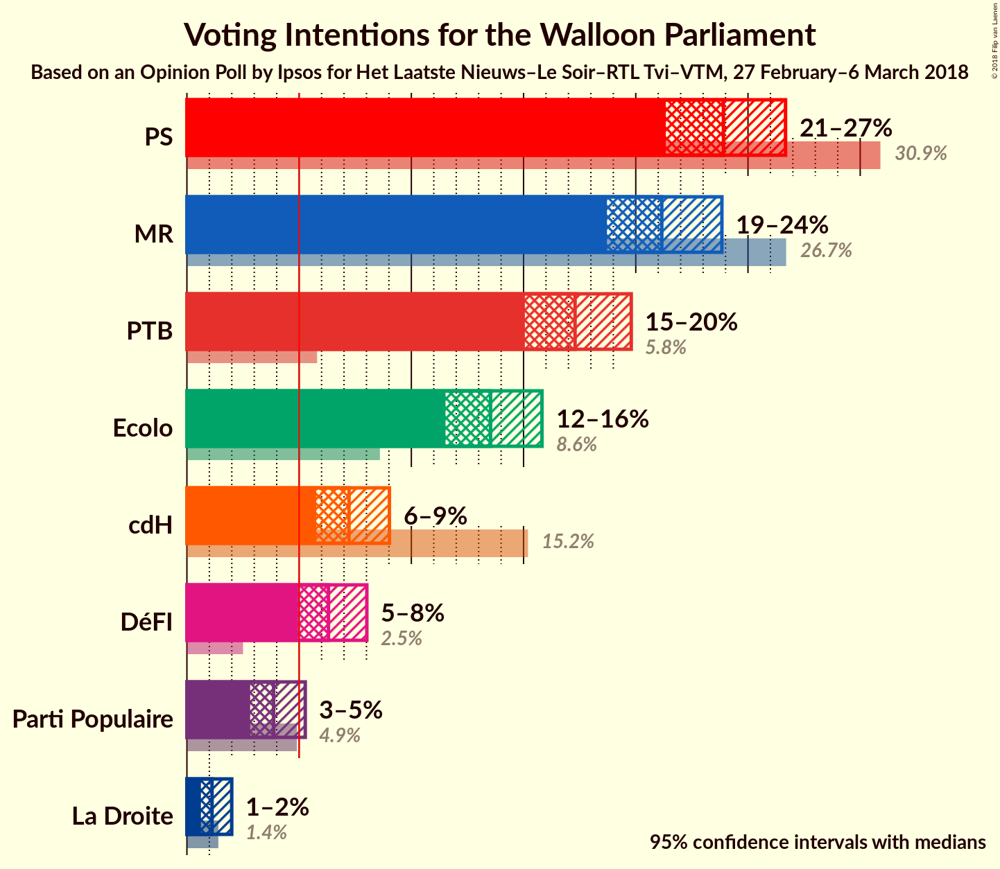
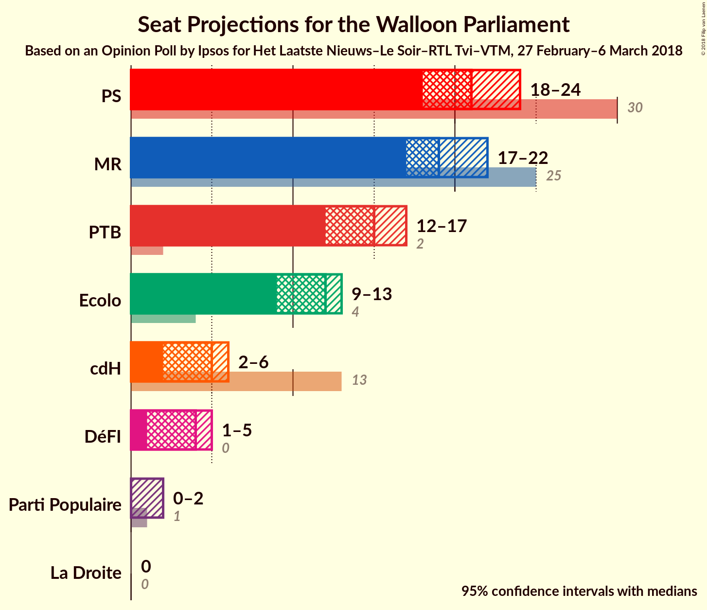
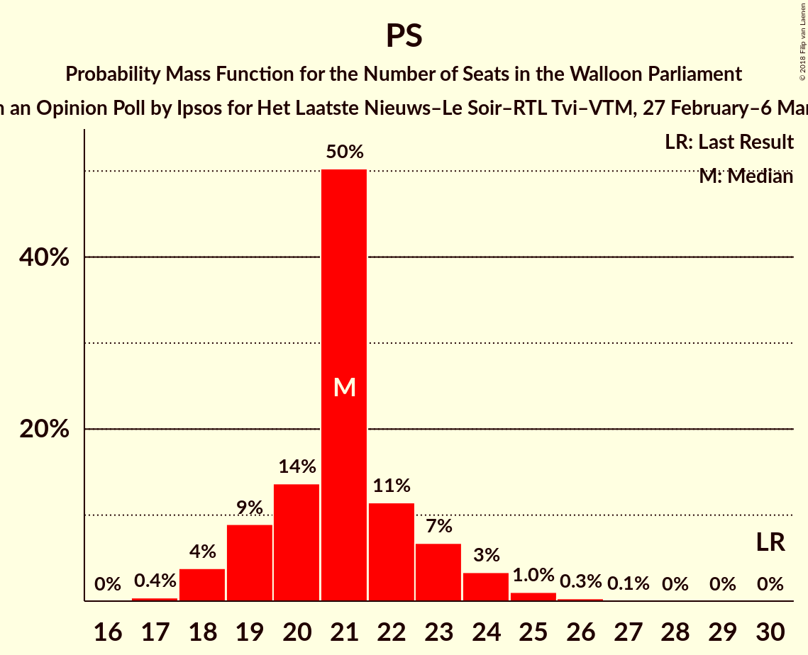
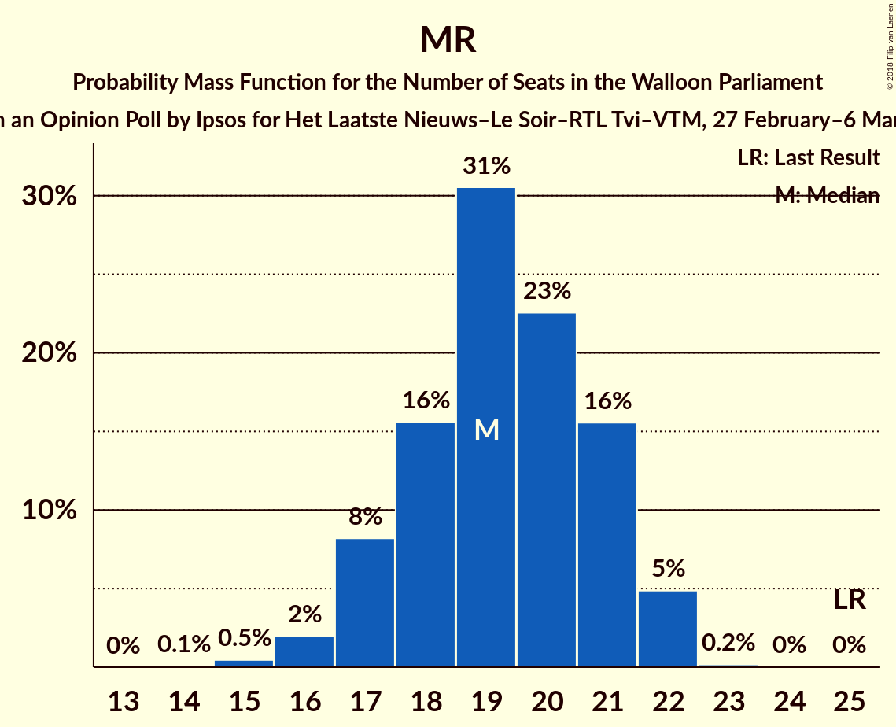
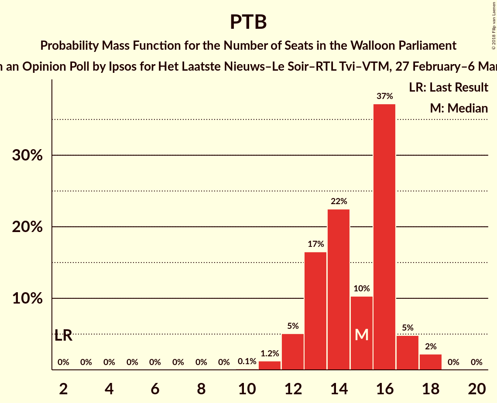
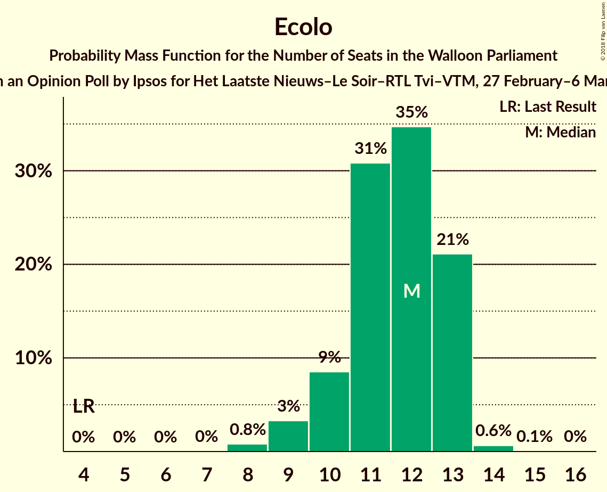
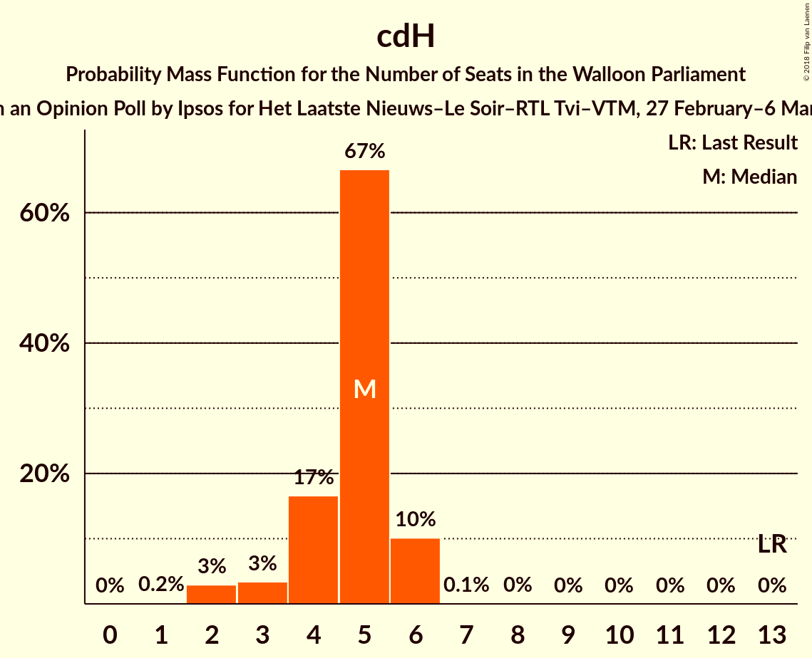
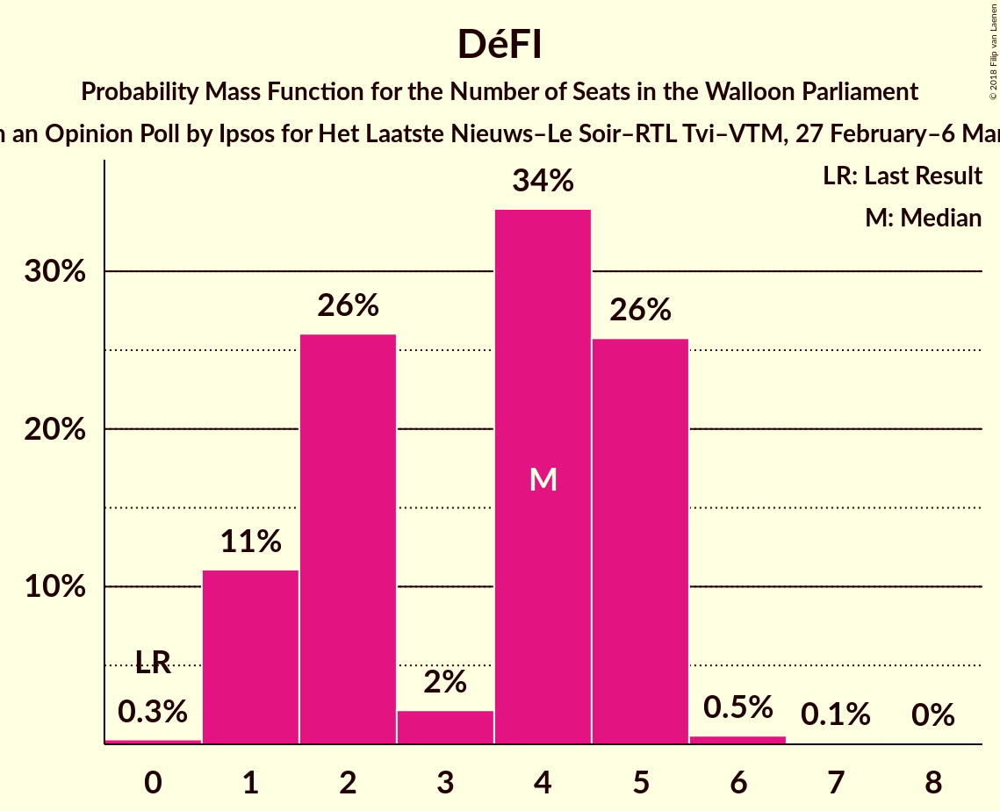
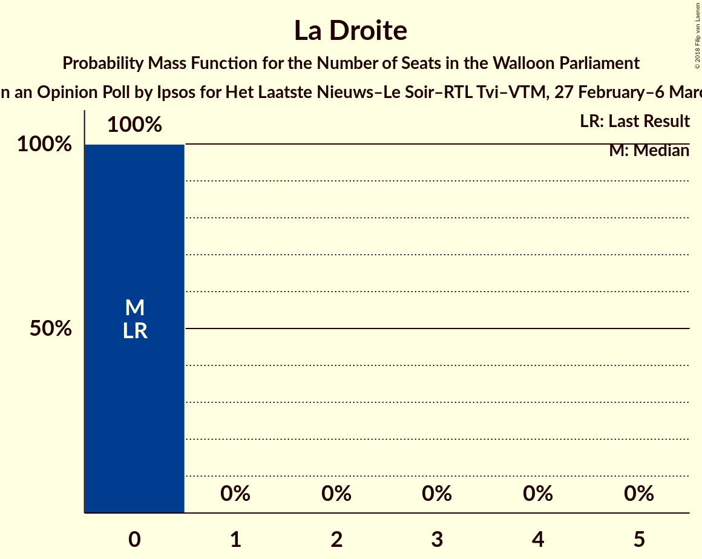
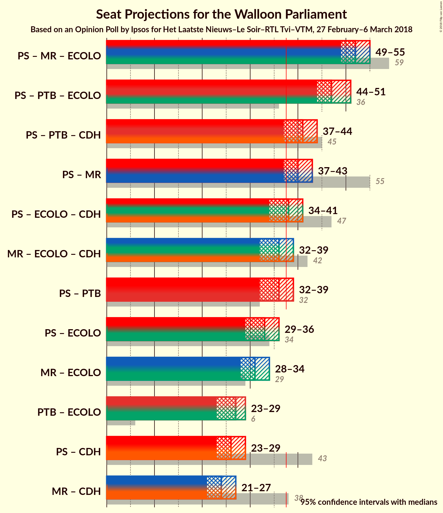

# Opinion Poll by Ipsos for Het Laatste Nieuws–Le Soir–RTL Tvi–VTM, 27 February–6 March 2018

<a href="#voting-intentions">Voting Intentions</a> | <a href="#seats">Seats</a> | <a href="#coalitions">Coalitions</a> | <a href="#technical-information">Technical Information</a>

## Voting Intentions

### Confidence Intervals

| Party | Last Result | Poll Result | 80% Confidence Interval | 90% Confidence Interval | 95% Confidence Interval | 99% Confidence Interval |
|:-----:|:-----------:|:-----------:|:-----------------------:|:-----------------------:|:-----------------------:|:-----------------------:|
| PS | 30.9% | 23.9% | 22.2–25.7% |21.7–26.2% |21.3–26.7% |20.6–27.6% |
| MR | 26.7% | 21.2% | 19.6–22.9% |19.1–23.4% |18.7–23.8% |18.0–24.7% |
| PTB | 5.8% | 17.3% | 15.8–18.9% |15.4–19.4% |15.1–19.8% |14.4–20.6% |
| Ecolo | 8.6% | 13.5% | 12.2–15.0% |11.8–15.5% |11.5–15.8% |10.9–16.6% |
| cdH | 15.2% | 7.2% | 6.3–8.4% |6.0–8.7% |5.8–9.0% |5.3–9.6% |
| DéFI | 2.5% | 6.3% | 5.4–7.4% |5.2–7.7% |5.0–8.0% |4.5–8.6% |
| Parti Populaire | 4.9% | 3.9% | 3.2–4.8% |3.0–5.0% |2.8–5.3% |2.5–5.7% |
| La Droite | 1.4% | 1.1% | 0.8–1.7% |0.7–1.8% |0.6–2.0% |0.5–2.3% |

*Note:* The poll result column reflects the actual value used in the calculations. Published results may vary slightly, and in addition be rounded to fewer digits.

## Seats

### Confidence Intervals

| Party | Last Result | Median | 80% Confidence Interval | 90% Confidence Interval | 95% Confidence Interval | 99% Confidence Interval |
|:-----:|:-----------:|:------:|:-----------------------:|:-----------------------:|:-----------------------:|:-----------------------:|
| <a href="#ps">PS</a> | 30 | 21 | 19–23 |19–23 |18–24 |18–25 |
| <a href="#mr">MR</a> | 25 | 19 | 17–21 |17–22 |17–22 |15–22 |
| <a href="#ptb">PTB</a> | 2 | 15 | 13–16 |12–17 |12–17 |11–18 |
| <a href="#ecolo">Ecolo</a> | 4 | 12 | 10–13 |10–13 |9–13 |8–14 |
| <a href="#cdh">cdH</a> | 13 | 5 | 4–6 |3–6 |2–6 |2–6 |
| <a href="#défi">DéFI</a> | 0 | 4 | 1–5 |1–5 |1–5 |1–6 |
| <a href="#parti-populaire">Parti Populaire</a> | 1 | 0 | 0–1 |0–2 |0–2 |0–3 |
| <a href="#la-droite">La Droite</a> | 0 | 0 | 0 |0 |0 |0 |

### PS

*For a full overview of the results for this party, see the [PS](party-ps.html) page.*

| Number of Seats | Probability | Accumulated | Special Marks |
|:---------------:|:-----------:|:-----------:|:-------------:|
| 17 | 0.2% | 100% |  |
| 18 | 4% | 99.8% |  |
| 19 | 6% | 95% |  |
| 20 | 20% | 89% |  |
| 21 | 45% | 69% | Median |
| 22 | 13% | 24% |  |
| 23 | 6% | 11% |  |
| 24 | 3% | 5% |  |
| 25 | 2% | 2% |  |
| 26 | 0.2% | 0.2% |  |
| 27 | 0% | 0.1% |  |
| 28 | 0% | 0% |  |
| 29 | 0% | 0% |  |
| 30 | 0% | 0% | Last Result |

### MR

*For a full overview of the results for this party, see the [MR](party-mr.html) page.*

| Number of Seats | Probability | Accumulated | Special Marks |
|:---------------:|:-----------:|:-----------:|:-------------:|
| 14 | 0.1% | 100% |  |
| 15 | 0.5% | 99.9% |  |
| 16 | 2% | 99.5% |  |
| 17 | 8% | 98% |  |
| 18 | 16% | 89% |  |
| 19 | 31% | 74% | Median |
| 20 | 23% | 43% |  |
| 21 | 16% | 21% |  |
| 22 | 5% | 5% |  |
| 23 | 0.2% | 0.2% |  |
| 24 | 0% | 0% |  |
| 25 | 0% | 0% | Last Result |

### PTB

*For a full overview of the results for this party, see the [PTB](party-ptb.html) page.*

| Number of Seats | Probability | Accumulated | Special Marks |
|:---------------:|:-----------:|:-----------:|:-------------:|
| 2 | 0% | 100% | Last Result |
| 3 | 0% | 100% |  |
| 4 | 0% | 100% |  |
| 5 | 0% | 100% |  |
| 6 | 0% | 100% |  |
| 7 | 0% | 100% |  |
| 8 | 0% | 100% |  |
| 9 | 0% | 100% |  |
| 10 | 0.1% | 100% |  |
| 11 | 1.2% | 99.9% |  |
| 12 | 5% | 98.6% |  |
| 13 | 17% | 94% |  |
| 14 | 22% | 77% |  |
| 15 | 10% | 55% | Median |
| 16 | 37% | 44% |  |
| 17 | 5% | 7% |  |
| 18 | 2% | 2% |  |
| 19 | 0% | 0% |  |

### Ecolo

*For a full overview of the results for this party, see the [Ecolo](party-ecolo.html) page.*

| Number of Seats | Probability | Accumulated | Special Marks |
|:---------------:|:-----------:|:-----------:|:-------------:|
| 4 | 0% | 100% | Last Result |
| 5 | 0% | 100% |  |
| 6 | 0% | 100% |  |
| 7 | 0% | 100% |  |
| 8 | 0.8% | 100% |  |
| 9 | 3% | 99.2% |  |
| 10 | 8% | 97% |  |
| 11 | 33% | 89% |  |
| 12 | 35% | 56% | Median |
| 13 | 21% | 21% |  |
| 14 | 0.8% | 0.9% |  |
| 15 | 0.1% | 0.1% |  |
| 16 | 0% | 0% |  |

### cdH

*For a full overview of the results for this party, see the [cdH](party-cdh.html) page.*

| Number of Seats | Probability | Accumulated | Special Marks |
|:---------------:|:-----------:|:-----------:|:-------------:|
| 1 | 0.2% | 100% |  |
| 2 | 3% | 99.8% |  |
| 3 | 3% | 97% |  |
| 4 | 17% | 94% |  |
| 5 | 67% | 77% | Median |
| 6 | 10% | 10% |  |
| 7 | 0.1% | 0.2% |  |
| 8 | 0% | 0.1% |  |
| 9 | 0% | 0% |  |
| 10 | 0% | 0% |  |
| 11 | 0% | 0% |  |
| 12 | 0% | 0% |  |
| 13 | 0% | 0% | Last Result |

### DéFI

*For a full overview of the results for this party, see the [DéFI](party-défi.html) page.*

| Number of Seats | Probability | Accumulated | Special Marks |
|:---------------:|:-----------:|:-----------:|:-------------:|
| 0 | 0.3% | 100% | Last Result |
| 1 | 11% | 99.7% |  |
| 2 | 26% | 89% |  |
| 3 | 2% | 63% |  |
| 4 | 34% | 60% | Median |
| 5 | 26% | 26% |  |
| 6 | 0.5% | 0.7% |  |
| 7 | 0.1% | 0.2% |  |
| 8 | 0% | 0% |  |

### Parti Populaire

*For a full overview of the results for this party, see the [Parti Populaire](party-partipopulaire.html) page.*

| Number of Seats | Probability | Accumulated | Special Marks |
|:---------------:|:-----------:|:-----------:|:-------------:|
| 0 | 88% | 100% | Median |
| 1 | 6% | 12% | Last Result |
| 2 | 6% | 6% |  |
| 3 | 0.5% | 0.5% |  |
| 4 | 0% | 0% |  |

### La Droite

*For a full overview of the results for this party, see the [La Droite](party-ladroite.html) page.*

| Number of Seats | Probability | Accumulated | Special Marks |
|:---------------:|:-----------:|:-----------:|:-------------:|
| 0 | 100% | 100% | Last Result, Median |

## Coalitions

### Confidence Intervals

| Coalition | Last Result | Median | Majority? | 80% Confidence Interval | 90% Confidence Interval | 95% Confidence Interval | 99% Confidence Interval |
|:---------:|:-----------:|:------:|:---------:|:-----------------------:|:-----------------------:|:-----------------------:|:-----------------------:|
| PS – MR – Ecolo | 59 | 52 | 100% | 50–54 | 49–55 | 49–56 | 48–56 |
| PS – PTB – Ecolo | 36 | 47 | 100% | 45–50 | 44–50 | 44–51 | 43–52 |
| PS – PTB – cdH | 45 | 41 | 95% | 38–43 | 38–43 | 37–44 | 36–45 |
| PS – MR | 55 | 40 | 95% | 38–42 | 37–43 | 37–43 | 36–45 |
| PS – Ecolo – cdH | 47 | 37 | 49% | 35–39 | 35–40 | 34–41 | 33–42 |
| MR – Ecolo – cdH | 42 | 36 | 18% | 33–38 | 32–38 | 32–39 | 31–39 |
| PS – PTB | 32 | 36 | 17% | 33–38 | 33–39 | 32–39 | 31–40 |
| PS – Ecolo | 34 | 33 | 0.1% | 31–35 | 30–35 | 30–36 | 28–37 |
| MR – Ecolo | 29 | 31 | 0% | 29–33 | 28–34 | 28–34 | 26–35 |
| PTB – Ecolo | 6 | 27 | 0% | 24–29 | 24–29 | 23–29 | 22–30 |
| PS – cdH | 43 | 26 | 0% | 24–28 | 23–29 | 23–29 | 22–30 |
| MR – cdH | 38 | 24 | 0% | 22–26 | 21–26 | 21–27 | 20–28 |

### PS – MR – Ecolo

| Number of Seats | Probability | Accumulated | Special Marks |
|:---------------:|:-----------:|:-----------:|:-------------:|
| 47 | 0.3% | 100% |  |
| 48 | 1.3% | 99.7% |  |
| 49 | 7% | 98% |  |
| 50 | 19% | 91% |  |
| 51 | 16% | 73% |  |
| 52 | 19% | 57% | Median |
| 53 | 20% | 38% |  |
| 54 | 9% | 18% |  |
| 55 | 6% | 9% |  |
| 56 | 3% | 3% |  |
| 57 | 0.2% | 0.3% |  |
| 58 | 0.1% | 0.1% |  |
| 59 | 0% | 0% | Last Result |

### PS – PTB – Ecolo

| Number of Seats | Probability | Accumulated | Special Marks |
|:---------------:|:-----------:|:-----------:|:-------------:|
| 36 | 0% | 100% | Last Result |
| 37 | 0% | 100% |  |
| 38 | 0% | 100% | Majority |
| 39 | 0% | 100% |  |
| 40 | 0% | 100% |  |
| 41 | 0% | 100% |  |
| 42 | 0.1% | 100% |  |
| 43 | 2% | 99.9% |  |
| 44 | 5% | 98% |  |
| 45 | 9% | 92% |  |
| 46 | 14% | 84% |  |
| 47 | 24% | 70% |  |
| 48 | 21% | 46% | Median |
| 49 | 11% | 25% |  |
| 50 | 10% | 15% |  |
| 51 | 3% | 4% |  |
| 52 | 0.6% | 0.8% |  |
| 53 | 0.2% | 0.2% |  |
| 54 | 0% | 0% |  |

### PS – PTB – cdH

| Number of Seats | Probability | Accumulated | Special Marks |
|:---------------:|:-----------:|:-----------:|:-------------:|
| 35 | 0.1% | 100% |  |
| 36 | 2% | 99.8% |  |
| 37 | 3% | 98% |  |
| 38 | 8% | 95% | Majority |
| 39 | 16% | 87% |  |
| 40 | 18% | 72% |  |
| 41 | 26% | 54% | Median |
| 42 | 16% | 28% |  |
| 43 | 9% | 12% |  |
| 44 | 2% | 3% |  |
| 45 | 1.1% | 1.3% | Last Result |
| 46 | 0.2% | 0.2% |  |
| 47 | 0% | 0% |  |

### PS – MR

| Number of Seats | Probability | Accumulated | Special Marks |
|:---------------:|:-----------:|:-----------:|:-------------:|
| 35 | 0.1% | 100% |  |
| 36 | 1.3% | 99.9% |  |
| 37 | 4% | 98.6% |  |
| 38 | 9% | 95% | Majority |
| 39 | 19% | 86% |  |
| 40 | 25% | 67% | Median |
| 41 | 17% | 41% |  |
| 42 | 14% | 24% |  |
| 43 | 8% | 10% |  |
| 44 | 1.1% | 2% |  |
| 45 | 0.6% | 1.0% |  |
| 46 | 0.4% | 0.5% |  |
| 47 | 0% | 0% |  |
| 48 | 0% | 0% |  |
| 49 | 0% | 0% |  |
| 50 | 0% | 0% |  |
| 51 | 0% | 0% |  |
| 52 | 0% | 0% |  |
| 53 | 0% | 0% |  |
| 54 | 0% | 0% |  |
| 55 | 0% | 0% | Last Result |

### PS – Ecolo – cdH

| Number of Seats | Probability | Accumulated | Special Marks |
|:---------------:|:-----------:|:-----------:|:-------------:|
| 32 | 0.2% | 100% |  |
| 33 | 0.7% | 99.7% |  |
| 34 | 2% | 99.0% |  |
| 35 | 9% | 97% |  |
| 36 | 22% | 88% |  |
| 37 | 17% | 66% |  |
| 38 | 23% | 49% | Median, Majority |
| 39 | 16% | 25% |  |
| 40 | 6% | 9% |  |
| 41 | 2% | 3% |  |
| 42 | 1.0% | 1.1% |  |
| 43 | 0.1% | 0.1% |  |
| 44 | 0% | 0% |  |
| 45 | 0% | 0% |  |
| 46 | 0% | 0% |  |
| 47 | 0% | 0% | Last Result |

### MR – Ecolo – cdH

| Number of Seats | Probability | Accumulated | Special Marks |
|:---------------:|:-----------:|:-----------:|:-------------:|
| 29 | 0.1% | 100% |  |
| 30 | 0.1% | 99.9% |  |
| 31 | 0.7% | 99.8% |  |
| 32 | 4% | 99.2% |  |
| 33 | 7% | 95% |  |
| 34 | 12% | 88% |  |
| 35 | 24% | 76% |  |
| 36 | 15% | 52% | Median |
| 37 | 19% | 37% |  |
| 38 | 13% | 18% | Majority |
| 39 | 5% | 5% |  |
| 40 | 0.3% | 0.3% |  |
| 41 | 0.1% | 0.1% |  |
| 42 | 0% | 0% | Last Result |

### PS – PTB

| Number of Seats | Probability | Accumulated | Special Marks |
|:---------------:|:-----------:|:-----------:|:-------------:|
| 30 | 0% | 100% |  |
| 31 | 1.4% | 99.9% |  |
| 32 | 2% | 98.5% | Last Result |
| 33 | 8% | 96% |  |
| 34 | 14% | 89% |  |
| 35 | 19% | 74% |  |
| 36 | 20% | 55% | Median |
| 37 | 18% | 35% |  |
| 38 | 11% | 17% | Majority |
| 39 | 4% | 6% |  |
| 40 | 1.2% | 2% |  |
| 41 | 0.3% | 0.3% |  |
| 42 | 0% | 0% |  |

### PS – Ecolo

| Number of Seats | Probability | Accumulated | Special Marks |
|:---------------:|:-----------:|:-----------:|:-------------:|
| 27 | 0.1% | 100% |  |
| 28 | 0.6% | 99.9% |  |
| 29 | 2% | 99.3% |  |
| 30 | 7% | 98% |  |
| 31 | 17% | 91% |  |
| 32 | 22% | 74% |  |
| 33 | 23% | 52% | Median |
| 34 | 18% | 28% | Last Result |
| 35 | 6% | 10% |  |
| 36 | 2% | 4% |  |
| 37 | 2% | 2% |  |
| 38 | 0.1% | 0.1% | Majority |
| 39 | 0% | 0.1% |  |
| 40 | 0% | 0% |  |

### MR – Ecolo

| Number of Seats | Probability | Accumulated | Special Marks |
|:---------------:|:-----------:|:-----------:|:-------------:|
| 25 | 0.1% | 100% |  |
| 26 | 0.4% | 99.9% |  |
| 27 | 0.9% | 99.5% |  |
| 28 | 6% | 98.6% |  |
| 29 | 10% | 93% | Last Result |
| 30 | 28% | 83% |  |
| 31 | 16% | 55% | Median |
| 32 | 23% | 39% |  |
| 33 | 10% | 17% |  |
| 34 | 6% | 7% |  |
| 35 | 0.4% | 0.5% |  |
| 36 | 0.1% | 0.1% |  |
| 37 | 0% | 0% |  |

### PTB – Ecolo

| Number of Seats | Probability | Accumulated | Special Marks |
|:---------------:|:-----------:|:-----------:|:-------------:|
| 6 | 0% | 100% | Last Result |
| 7 | 0% | 100% |  |
| 8 | 0% | 100% |  |
| 9 | 0% | 100% |  |
| 10 | 0% | 100% |  |
| 11 | 0% | 100% |  |
| 12 | 0% | 100% |  |
| 13 | 0% | 100% |  |
| 14 | 0% | 100% |  |
| 15 | 0% | 100% |  |
| 16 | 0% | 100% |  |
| 17 | 0% | 100% |  |
| 18 | 0% | 100% |  |
| 19 | 0% | 100% |  |
| 20 | 0% | 100% |  |
| 21 | 0.1% | 100% |  |
| 22 | 0.9% | 99.8% |  |
| 23 | 4% | 99.0% |  |
| 24 | 9% | 95% |  |
| 25 | 13% | 86% |  |
| 26 | 22% | 73% |  |
| 27 | 29% | 51% | Median |
| 28 | 11% | 23% |  |
| 29 | 11% | 12% |  |
| 30 | 0.7% | 1.0% |  |
| 31 | 0.3% | 0.3% |  |
| 32 | 0% | 0% |  |

### PS – cdH

| Number of Seats | Probability | Accumulated | Special Marks |
|:---------------:|:-----------:|:-----------:|:-------------:|
| 20 | 0.1% | 100% |  |
| 21 | 0.1% | 99.9% |  |
| 22 | 1.1% | 99.8% |  |
| 23 | 4% | 98.7% |  |
| 24 | 8% | 95% |  |
| 25 | 32% | 86% |  |
| 26 | 31% | 55% | Median |
| 27 | 13% | 23% |  |
| 28 | 5% | 10% |  |
| 29 | 4% | 5% |  |
| 30 | 0.7% | 0.9% |  |
| 31 | 0.1% | 0.2% |  |
| 32 | 0% | 0.1% |  |
| 33 | 0% | 0% |  |
| 34 | 0% | 0% |  |
| 35 | 0% | 0% |  |
| 36 | 0% | 0% |  |
| 37 | 0% | 0% |  |
| 38 | 0% | 0% | Majority |
| 39 | 0% | 0% |  |
| 40 | 0% | 0% |  |
| 41 | 0% | 0% |  |
| 42 | 0% | 0% |  |
| 43 | 0% | 0% | Last Result |

### MR – cdH

| Number of Seats | Probability | Accumulated | Special Marks |
|:---------------:|:-----------:|:-----------:|:-------------:|
| 18 | 0.1% | 100% |  |
| 19 | 0.2% | 99.9% |  |
| 20 | 2% | 99.7% |  |
| 21 | 3% | 98% |  |
| 22 | 12% | 95% |  |
| 23 | 17% | 83% |  |
| 24 | 25% | 66% | Median |
| 25 | 20% | 41% |  |
| 26 | 17% | 21% |  |
| 27 | 3% | 4% |  |
| 28 | 0.7% | 0.7% |  |
| 29 | 0% | 0% |  |
| 30 | 0% | 0% |  |
| 31 | 0% | 0% |  |
| 32 | 0% | 0% |  |
| 33 | 0% | 0% |  |
| 34 | 0% | 0% |  |
| 35 | 0% | 0% |  |
| 36 | 0% | 0% |  |
| 37 | 0% | 0% |  |
| 38 | 0% | 0% | Last Result, Majority |

## Technical Information

### Opinion Poll

+ **Polling firm:** Ipsos
+ **Commissioner(s):** Het Laatste Nieuws–Le Soir–RTL Tvi–VTM
+ **Fieldwork period:** 27 February–6 March 2018

### Calculations

+ **Sample size:** 983
+ **Simulations done:** 262,144
+ **Error estimate:** 0.93%

