# Opinion Poll by Ipsos for Het Laatste Nieuws, Le Soir, RTL TVi and VTM, 20–27 September 2018

<a href="#voting-intentions">Voting Intentions</a> | <a href="#seats">Seats</a> | <a href="#coalitions">Coalitions</a> | <a href="#technical-information">Technical Information</a>

## Voting Intentions

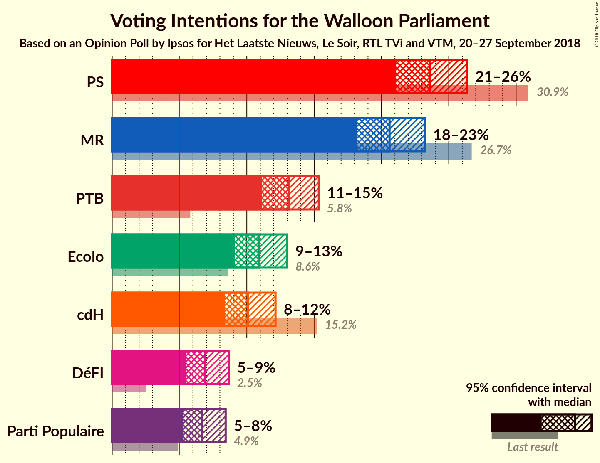

### Confidence Intervals

| Party | Last Result | Poll Result | 80% Confidence Interval | 90% Confidence Interval | 95% Confidence Interval | 99% Confidence Interval |
|:-----:|:-----------:|:-----------:|:-----------------------:|:-----------------------:|:-----------------------:|:-----------------------:|
| PS | 30.9% | 23.6% | 21.9–25.4% |21.5–25.9% |21.1–26.3% |20.3–27.2% |
| MR | 26.7% | 20.6% | 19.0–22.3% |18.6–22.8% |18.2–23.2% |17.5–24.1% |
| PTB | 5.8% | 13.1% | 11.8–14.6% |11.4–15.0% |11.1–15.3% |10.6–16.1% |
| Ecolo | 8.6% | 10.9% | 9.7–12.3% |9.4–12.7% |9.1–13.0% |8.6–13.7% |
| cdH | 15.2% | 10.1% | 9.0–11.4% |8.6–11.8% |8.4–12.1% |7.9–12.8% |
| DéFI | 2.5% | 6.9% | 6.0–8.0% |5.7–8.4% |5.5–8.7% |5.1–9.2% |
| Parti Populaire | 4.9% | 6.7% | 5.8–7.8% |5.5–8.2% |5.3–8.4% |4.9–9.0% |
| La Droite | 1.4% | 2.1% | 1.6–2.8% |1.5–3.0% |1.4–3.2% |1.2–3.6% |

*Note:* The poll result column reflects the actual value used in the calculations. Published results may vary slightly, and in addition be rounded to fewer digits.

## Seats

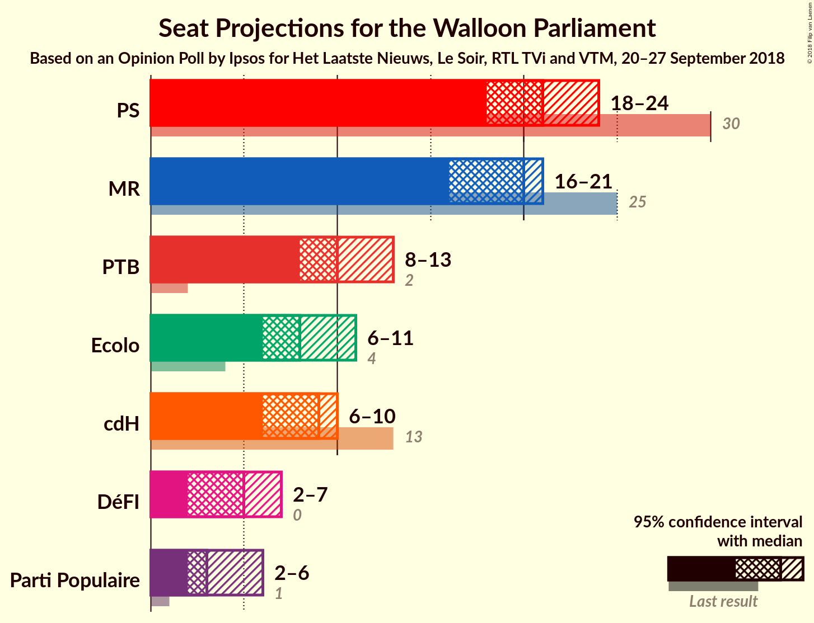

### Confidence Intervals

| Party | Last Result | Median | 80% Confidence Interval | 90% Confidence Interval | 95% Confidence Interval | 99% Confidence Interval |
|:-----:|:-----------:|:------:|:-----------------------:|:-----------------------:|:-----------------------:|:-----------------------:|
| <a href="#ps">PS</a> | 30 | 21 | 19–23 |19–23 |18–24 |17–25 |
| <a href="#mr">MR</a> | 25 | 20 | 17–20 |16–21 |15–21 |14–22 |
| <a href="#ptb">PTB</a> | 2 | 10 | 9–11 |9–12 |8–13 |8–14 |
| <a href="#ecolo">Ecolo</a> | 4 | 8 | 6–11 |6–11 |6–11 |6–12 |
| <a href="#cdh">cdH</a> | 13 | 8 | 6–10 |6–10 |6–10 |5–11 |
| <a href="#défi">DéFI</a> | 0 | 5 | 3–5 |2–6 |2–7 |1–7 |
| <a href="#parti-populaire">Parti Populaire</a> | 1 | 4 | 2–5 |2–5 |2–5 |1–6 |
| <a href="#la-droite">La Droite</a> | 0 | 0 | 0 |0 |0 |0 |

### PS

*For a full overview of the results for this party, see the [PS](party-ps.html) page.*

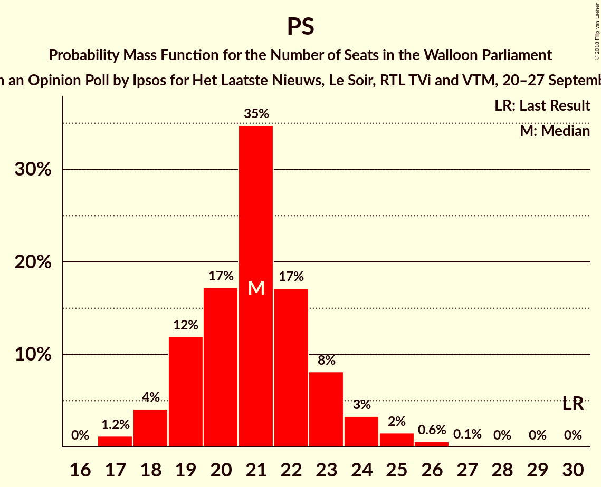

| Number of Seats | Probability | Accumulated | Special Marks |
|:---------------:|:-----------:|:-----------:|:-------------:|
| 17 | 1.1% | 100% |  |
| 18 | 4% | 98.9% |  |
| 19 | 13% | 95% |  |
| 20 | 18% | 82% |  |
| 21 | 34% | 63% | Median |
| 22 | 19% | 29% |  |
| 23 | 6% | 11% |  |
| 24 | 3% | 4% |  |
| 25 | 0.8% | 1.2% |  |
| 26 | 0.3% | 0.4% |  |
| 27 | 0.1% | 0.1% |  |
| 28 | 0% | 0% |  |
| 29 | 0% | 0% |  |
| 30 | 0% | 0% | Last Result |

### MR

*For a full overview of the results for this party, see the [MR](party-mr.html) page.*

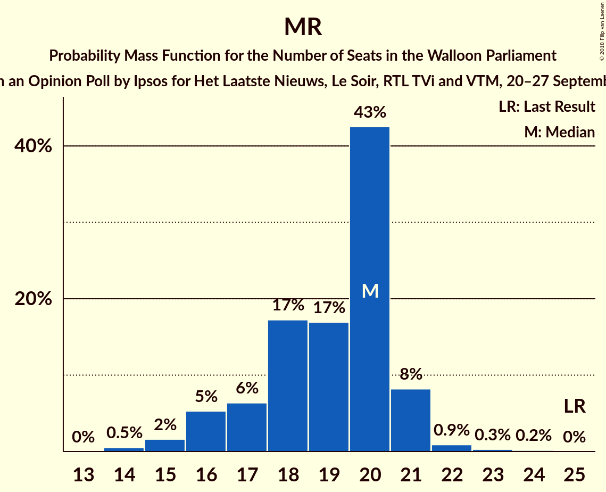

| Number of Seats | Probability | Accumulated | Special Marks |
|:---------------:|:-----------:|:-----------:|:-------------:|
| 14 | 0.6% | 100% |  |
| 15 | 3% | 99.4% |  |
| 16 | 4% | 97% |  |
| 17 | 11% | 92% |  |
| 18 | 15% | 81% |  |
| 19 | 15% | 66% |  |
| 20 | 42% | 52% | Median |
| 21 | 8% | 10% |  |
| 22 | 0.6% | 1.1% |  |
| 23 | 0.3% | 0.5% |  |
| 24 | 0.2% | 0.2% |  |
| 25 | 0% | 0% | Last Result |

### PTB

*For a full overview of the results for this party, see the [PTB](party-ptb.html) page.*

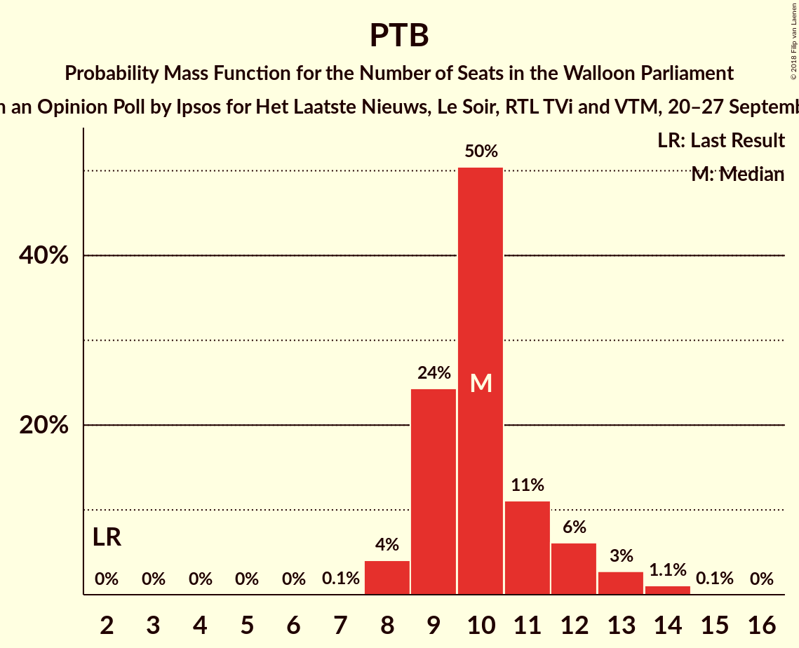

| Number of Seats | Probability | Accumulated | Special Marks |
|:---------------:|:-----------:|:-----------:|:-------------:|
| 2 | 0% | 100% | Last Result |
| 3 | 0% | 100% |  |
| 4 | 0% | 100% |  |
| 5 | 0% | 100% |  |
| 6 | 0% | 100% |  |
| 7 | 0.1% | 100% |  |
| 8 | 4% | 99.9% |  |
| 9 | 30% | 96% |  |
| 10 | 46% | 66% | Median |
| 11 | 12% | 20% |  |
| 12 | 5% | 8% |  |
| 13 | 2% | 3% |  |
| 14 | 0.9% | 1.0% |  |
| 15 | 0% | 0% |  |

### Ecolo

*For a full overview of the results for this party, see the [Ecolo](party-ecolo.html) page.*

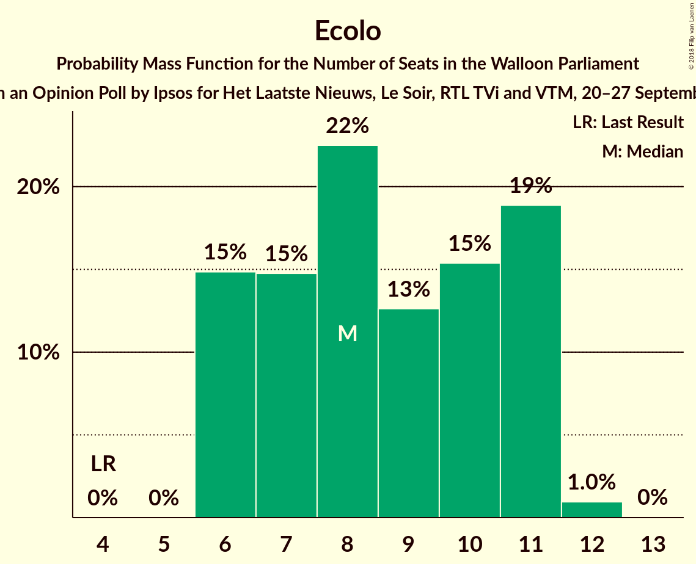

| Number of Seats | Probability | Accumulated | Special Marks |
|:---------------:|:-----------:|:-----------:|:-------------:|
| 4 | 0% | 100% | Last Result |
| 5 | 0% | 100% |  |
| 6 | 13% | 100% |  |
| 7 | 16% | 87% |  |
| 8 | 22% | 71% | Median |
| 9 | 17% | 48% |  |
| 10 | 8% | 31% |  |
| 11 | 22% | 23% |  |
| 12 | 1.2% | 1.3% |  |
| 13 | 0% | 0% |  |

### cdH

*For a full overview of the results for this party, see the [cdH](party-cdh.html) page.*

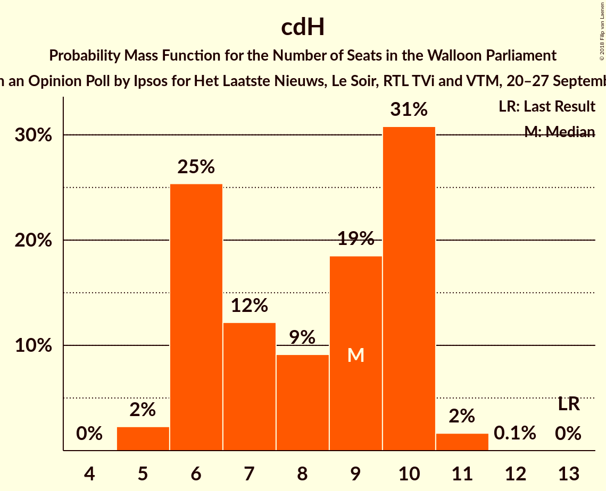

| Number of Seats | Probability | Accumulated | Special Marks |
|:---------------:|:-----------:|:-----------:|:-------------:|
| 5 | 2% | 100% |  |
| 6 | 26% | 98% |  |
| 7 | 13% | 71% |  |
| 8 | 11% | 58% | Median |
| 9 | 13% | 47% |  |
| 10 | 32% | 34% |  |
| 11 | 1.4% | 2% |  |
| 12 | 0.1% | 0.1% |  |
| 13 | 0% | 0% | Last Result |

### DéFI

*For a full overview of the results for this party, see the [DéFI](party-défi.html) page.*

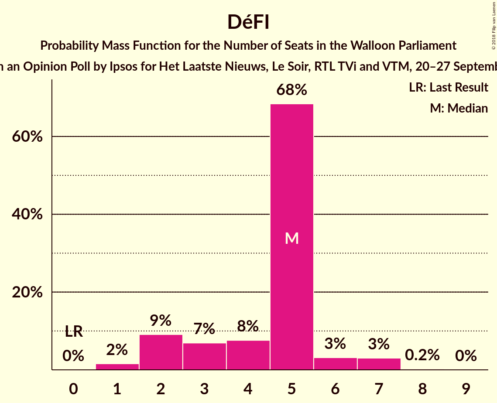

| Number of Seats | Probability | Accumulated | Special Marks |
|:---------------:|:-----------:|:-----------:|:-------------:|
| 0 | 0% | 100% | Last Result |
| 1 | 2% | 100% |  |
| 2 | 8% | 98% |  |
| 3 | 7% | 90% |  |
| 4 | 8% | 83% |  |
| 5 | 69% | 74% | Median |
| 6 | 3% | 6% |  |
| 7 | 2% | 3% |  |
| 8 | 0.4% | 0.4% |  |
| 9 | 0% | 0% |  |

### Parti Populaire

*For a full overview of the results for this party, see the [Parti Populaire](party-partipopulaire.html) page.*

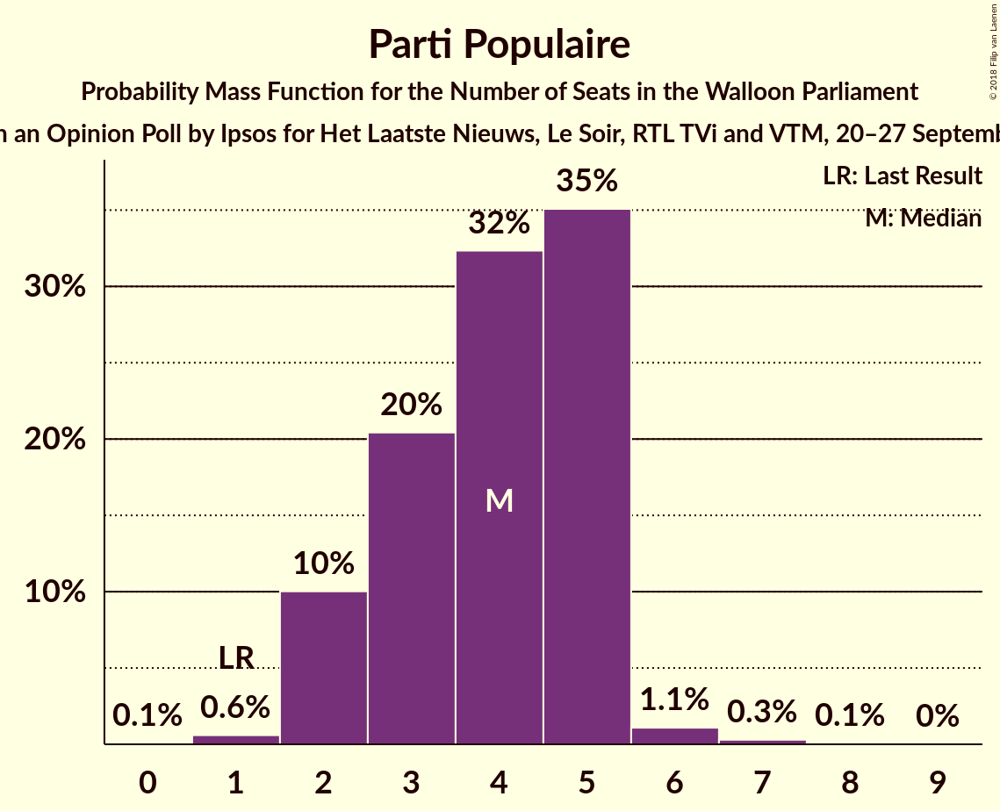

| Number of Seats | Probability | Accumulated | Special Marks |
|:---------------:|:-----------:|:-----------:|:-------------:|
| 0 | 0.1% | 100% |  |
| 1 | 0.6% | 99.9% | Last Result |
| 2 | 10% | 99.3% |  |
| 3 | 20% | 89% |  |
| 4 | 32% | 69% | Median |
| 5 | 35% | 37% |  |
| 6 | 1.1% | 1.4% |  |
| 7 | 0.3% | 0.4% |  |
| 8 | 0.1% | 0.1% |  |
| 9 | 0% | 0% |  |

### La Droite

*For a full overview of the results for this party, see the [La Droite](party-ladroite.html) page.*

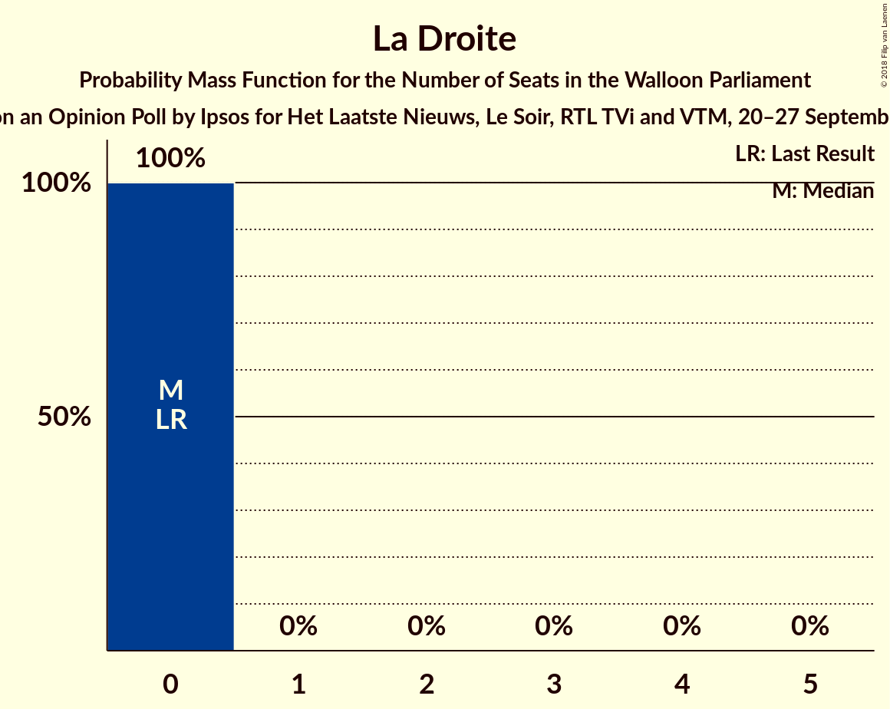

| Number of Seats | Probability | Accumulated | Special Marks |
|:---------------:|:-----------:|:-----------:|:-------------:|
| 0 | 100% | 100% | Last Result, Median |

## Coalitions

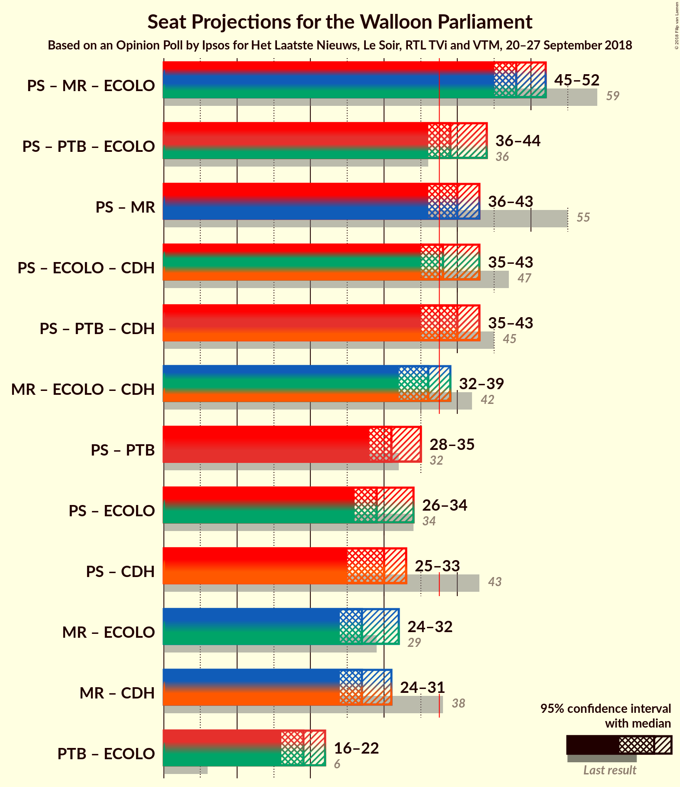

### Confidence Intervals

| Coalition | Last Result | Median | Majority? | 80% Confidence Interval | 90% Confidence Interval | 95% Confidence Interval | 99% Confidence Interval |
|:---------:|:-----------:|:------:|:---------:|:-----------------------:|:-----------------------:|:-----------------------:|:-----------------------:|
| PS – MR – Ecolo | 59 | 48 | 100% | 46–51 | 45–52 | 45–53 | 43–53 |
| PS – PTB – Ecolo | 36 | 39 | 83% | 37–42 | 36–43 | 36–43 | 35–45 |
| PS – MR | 55 | 40 | 88% | 37–42 | 36–43 | 36–43 | 35–45 |
| PS – PTB – cdH | 45 | 39 | 74% | 36–42 | 35–42 | 35–43 | 34–44 |
| PS – Ecolo – cdH | 47 | 37 | 50% | 35–40 | 35–41 | 34–42 | 33–43 |
| MR – Ecolo – cdH | 42 | 36 | 13% | 33–38 | 33–38 | 32–39 | 31–40 |
| PS – PTB | 32 | 31 | 0.1% | 29–33 | 28–34 | 28–34 | 27–36 |
| PS – Ecolo | 34 | 29 | 0% | 27–32 | 26–33 | 26–33 | 25–34 |
| PS – cdH | 43 | 29 | 0% | 26–31 | 25–32 | 25–33 | 24–34 |
| MR – Ecolo | 29 | 27 | 0% | 25–31 | 24–31 | 23–32 | 22–32 |
| MR – cdH | 38 | 27 | 0% | 25–30 | 24–30 | 23–31 | 22–31 |
| PTB – Ecolo | 6 | 18 | 0% | 16–21 | 16–22 | 15–22 | 14–24 |

### PS – MR – Ecolo

| Number of Seats | Probability | Accumulated | Special Marks |
|:---------------:|:-----------:|:-----------:|:-------------:|
| 42 | 0.1% | 100% |  |
| 43 | 0.5% | 99.9% |  |
| 44 | 1.2% | 99.4% |  |
| 45 | 5% | 98% |  |
| 46 | 10% | 93% |  |
| 47 | 17% | 83% |  |
| 48 | 17% | 65% |  |
| 49 | 17% | 48% | Median |
| 50 | 13% | 31% |  |
| 51 | 12% | 18% |  |
| 52 | 4% | 7% |  |
| 53 | 2% | 3% |  |
| 54 | 0.4% | 0.5% |  |
| 55 | 0.1% | 0.1% |  |
| 56 | 0% | 0% |  |
| 57 | 0% | 0% |  |
| 58 | 0% | 0% |  |
| 59 | 0% | 0% | Last Result |

### PS – PTB – Ecolo

| Number of Seats | Probability | Accumulated | Special Marks |
|:---------------:|:-----------:|:-----------:|:-------------:|
| 34 | 0.3% | 100% |  |
| 35 | 2% | 99.7% |  |
| 36 | 5% | 98% | Last Result |
| 37 | 10% | 93% |  |
| 38 | 19% | 83% | Majority |
| 39 | 18% | 64% | Median |
| 40 | 17% | 46% |  |
| 41 | 13% | 29% |  |
| 42 | 9% | 17% |  |
| 43 | 6% | 7% |  |
| 44 | 1.1% | 2% |  |
| 45 | 0.6% | 0.8% |  |
| 46 | 0.2% | 0.2% |  |
| 47 | 0% | 0% |  |

### PS – MR

| Number of Seats | Probability | Accumulated | Special Marks |
|:---------------:|:-----------:|:-----------:|:-------------:|
| 33 | 0.1% | 100% |  |
| 34 | 0.3% | 99.9% |  |
| 35 | 2% | 99.7% |  |
| 36 | 3% | 98% |  |
| 37 | 7% | 95% |  |
| 38 | 9% | 88% | Majority |
| 39 | 17% | 78% |  |
| 40 | 25% | 62% |  |
| 41 | 18% | 37% | Median |
| 42 | 14% | 19% |  |
| 43 | 3% | 5% |  |
| 44 | 1.4% | 2% |  |
| 45 | 0.4% | 0.6% |  |
| 46 | 0.1% | 0.2% |  |
| 47 | 0.1% | 0.1% |  |
| 48 | 0% | 0% |  |
| 49 | 0% | 0% |  |
| 50 | 0% | 0% |  |
| 51 | 0% | 0% |  |
| 52 | 0% | 0% |  |
| 53 | 0% | 0% |  |
| 54 | 0% | 0% |  |
| 55 | 0% | 0% | Last Result |

### PS – PTB – cdH

| Number of Seats | Probability | Accumulated | Special Marks |
|:---------------:|:-----------:|:-----------:|:-------------:|
| 33 | 0.2% | 100% |  |
| 34 | 2% | 99.8% |  |
| 35 | 6% | 98% |  |
| 36 | 7% | 92% |  |
| 37 | 11% | 85% |  |
| 38 | 15% | 74% | Majority |
| 39 | 17% | 59% | Median |
| 40 | 19% | 42% |  |
| 41 | 13% | 23% |  |
| 42 | 6% | 10% |  |
| 43 | 2% | 4% |  |
| 44 | 1.3% | 2% |  |
| 45 | 0.2% | 0.3% | Last Result |
| 46 | 0.1% | 0.1% |  |
| 47 | 0% | 0% |  |

### PS – Ecolo – cdH

| Number of Seats | Probability | Accumulated | Special Marks |
|:---------------:|:-----------:|:-----------:|:-------------:|
| 32 | 0.3% | 100% |  |
| 33 | 0.4% | 99.7% |  |
| 34 | 4% | 99.3% |  |
| 35 | 10% | 96% |  |
| 36 | 14% | 85% |  |
| 37 | 22% | 72% | Median |
| 38 | 22% | 50% | Majority |
| 39 | 12% | 28% |  |
| 40 | 7% | 15% |  |
| 41 | 5% | 8% |  |
| 42 | 2% | 3% |  |
| 43 | 1.0% | 1.1% |  |
| 44 | 0.1% | 0.1% |  |
| 45 | 0% | 0% |  |
| 46 | 0% | 0% |  |
| 47 | 0% | 0% | Last Result |

### MR – Ecolo – cdH

| Number of Seats | Probability | Accumulated | Special Marks |
|:---------------:|:-----------:|:-----------:|:-------------:|
| 29 | 0.1% | 100% |  |
| 30 | 0.2% | 99.9% |  |
| 31 | 1.0% | 99.7% |  |
| 32 | 3% | 98.7% |  |
| 33 | 7% | 95% |  |
| 34 | 15% | 89% |  |
| 35 | 16% | 74% |  |
| 36 | 19% | 57% | Median |
| 37 | 25% | 38% |  |
| 38 | 8% | 13% | Majority |
| 39 | 4% | 5% |  |
| 40 | 1.1% | 1.2% |  |
| 41 | 0.1% | 0.1% |  |
| 42 | 0% | 0% | Last Result |

### PS – PTB

| Number of Seats | Probability | Accumulated | Special Marks |
|:---------------:|:-----------:|:-----------:|:-------------:|
| 26 | 0.3% | 100% |  |
| 27 | 1.0% | 99.7% |  |
| 28 | 5% | 98.7% |  |
| 29 | 16% | 94% |  |
| 30 | 23% | 78% |  |
| 31 | 25% | 55% | Median |
| 32 | 15% | 30% | Last Result |
| 33 | 9% | 15% |  |
| 34 | 4% | 6% |  |
| 35 | 1.4% | 2% |  |
| 36 | 0.6% | 0.8% |  |
| 37 | 0.1% | 0.2% |  |
| 38 | 0% | 0.1% | Majority |
| 39 | 0% | 0% |  |

### PS – Ecolo

| Number of Seats | Probability | Accumulated | Special Marks |
|:---------------:|:-----------:|:-----------:|:-------------:|
| 24 | 0.4% | 100% |  |
| 25 | 1.1% | 99.6% |  |
| 26 | 4% | 98% |  |
| 27 | 12% | 94% |  |
| 28 | 17% | 83% |  |
| 29 | 17% | 66% | Median |
| 30 | 16% | 49% |  |
| 31 | 17% | 33% |  |
| 32 | 10% | 16% |  |
| 33 | 4% | 6% |  |
| 34 | 1.3% | 2% | Last Result |
| 35 | 0.2% | 0.4% |  |
| 36 | 0.1% | 0.2% |  |
| 37 | 0% | 0% |  |

### PS – cdH

| Number of Seats | Probability | Accumulated | Special Marks |
|:---------------:|:-----------:|:-----------:|:-------------:|
| 23 | 0.1% | 100% |  |
| 24 | 1.5% | 99.9% |  |
| 25 | 4% | 98% |  |
| 26 | 8% | 94% |  |
| 27 | 10% | 86% |  |
| 28 | 17% | 77% |  |
| 29 | 16% | 60% | Median |
| 30 | 20% | 44% |  |
| 31 | 16% | 24% |  |
| 32 | 5% | 8% |  |
| 33 | 2% | 3% |  |
| 34 | 1.1% | 1.2% |  |
| 35 | 0.1% | 0.2% |  |
| 36 | 0% | 0% |  |
| 37 | 0% | 0% |  |
| 38 | 0% | 0% | Majority |
| 39 | 0% | 0% |  |
| 40 | 0% | 0% |  |
| 41 | 0% | 0% |  |
| 42 | 0% | 0% |  |
| 43 | 0% | 0% | Last Result |

### MR – Ecolo

| Number of Seats | Probability | Accumulated | Special Marks |
|:---------------:|:-----------:|:-----------:|:-------------:|
| 21 | 0% | 100% |  |
| 22 | 0.5% | 99.9% |  |
| 23 | 2% | 99.5% |  |
| 24 | 4% | 97% |  |
| 25 | 6% | 93% |  |
| 26 | 16% | 87% |  |
| 27 | 21% | 70% |  |
| 28 | 20% | 50% | Median |
| 29 | 12% | 30% | Last Result |
| 30 | 7% | 18% |  |
| 31 | 9% | 12% |  |
| 32 | 2% | 3% |  |
| 33 | 0.1% | 0.2% |  |
| 34 | 0% | 0% |  |

### MR – cdH

| Number of Seats | Probability | Accumulated | Special Marks |
|:---------------:|:-----------:|:-----------:|:-------------:|
| 21 | 0.1% | 100% |  |
| 22 | 0.6% | 99.9% |  |
| 23 | 2% | 99.3% |  |
| 24 | 6% | 97% |  |
| 25 | 10% | 91% |  |
| 26 | 23% | 82% |  |
| 27 | 20% | 59% |  |
| 28 | 14% | 39% | Median |
| 29 | 11% | 25% |  |
| 30 | 10% | 14% |  |
| 31 | 3% | 4% |  |
| 32 | 0.2% | 0.3% |  |
| 33 | 0.1% | 0.1% |  |
| 34 | 0% | 0% |  |
| 35 | 0% | 0% |  |
| 36 | 0% | 0% |  |
| 37 | 0% | 0% |  |
| 38 | 0% | 0% | Last Result, Majority |

### PTB – Ecolo

| Number of Seats | Probability | Accumulated | Special Marks |
|:---------------:|:-----------:|:-----------:|:-------------:|
| 6 | 0% | 100% | Last Result |
| 7 | 0% | 100% |  |
| 8 | 0% | 100% |  |
| 9 | 0% | 100% |  |
| 10 | 0% | 100% |  |
| 11 | 0% | 100% |  |
| 12 | 0% | 100% |  |
| 13 | 0% | 100% |  |
| 14 | 0.5% | 100% |  |
| 15 | 2% | 99.5% |  |
| 16 | 14% | 97% |  |
| 17 | 18% | 84% |  |
| 18 | 17% | 66% | Median |
| 19 | 16% | 49% |  |
| 20 | 14% | 33% |  |
| 21 | 13% | 19% |  |
| 22 | 4% | 6% |  |
| 23 | 1.3% | 2% |  |
| 24 | 0.5% | 0.5% |  |
| 25 | 0% | 0.1% |  |
| 26 | 0% | 0% |  |

## Technical Information

### Opinion Poll

+ **Polling firm:** Ipsos
+ **Commissioner(s):** Het Laatste Nieuws, Le Soir, RTL TVi and VTM
+ **Fieldwork period:** 20–27 September 2018

### Calculations

+ **Sample size:** 1000
+ **Simulations done:** 1,048,576
+ **Error estimate:** 1.02%

