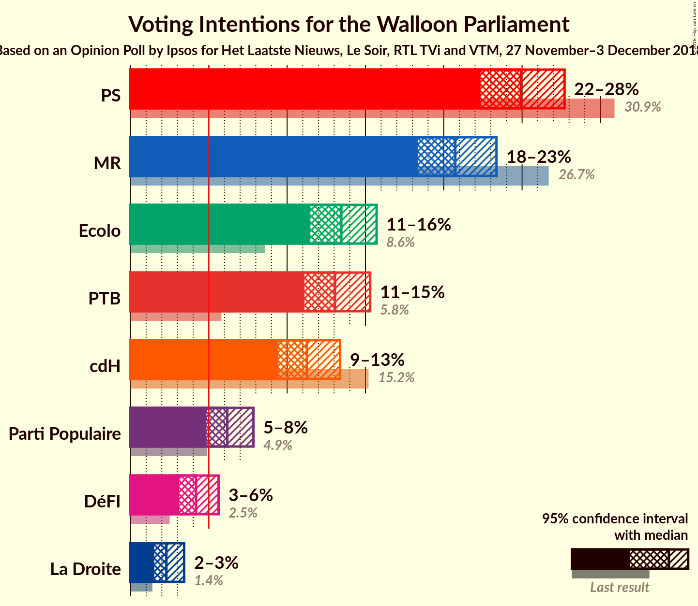
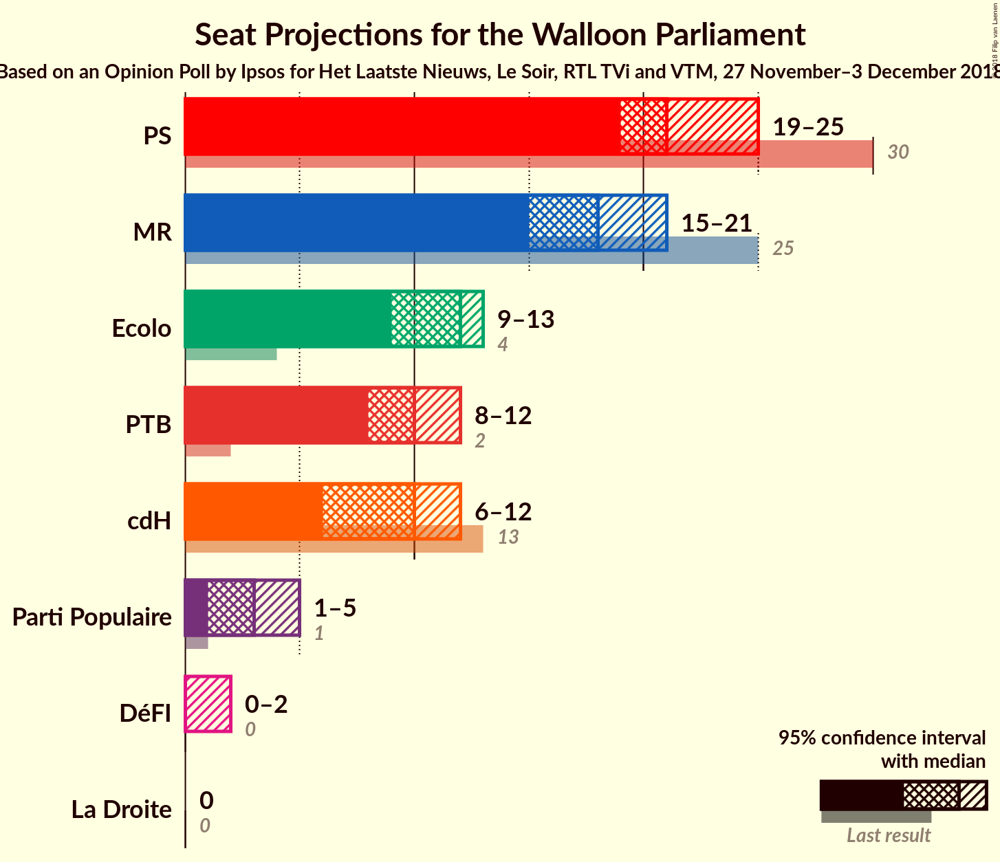
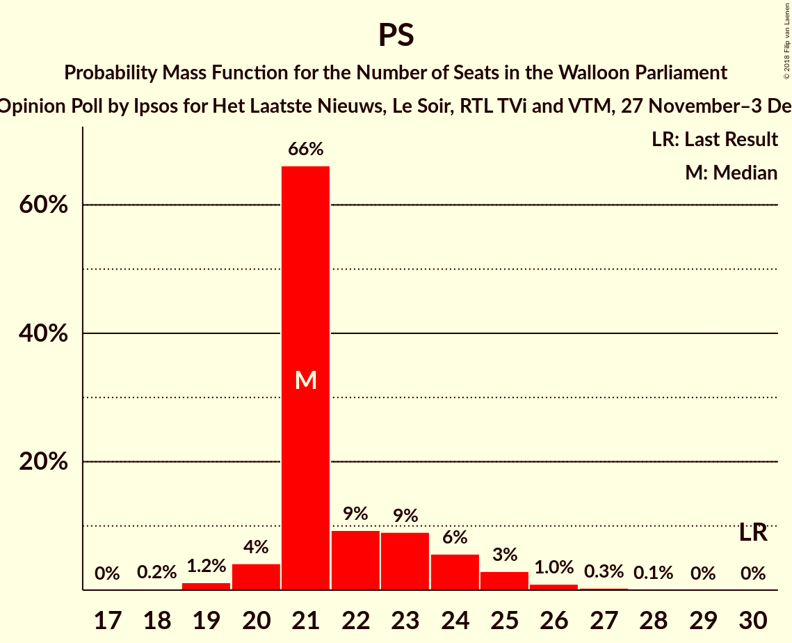
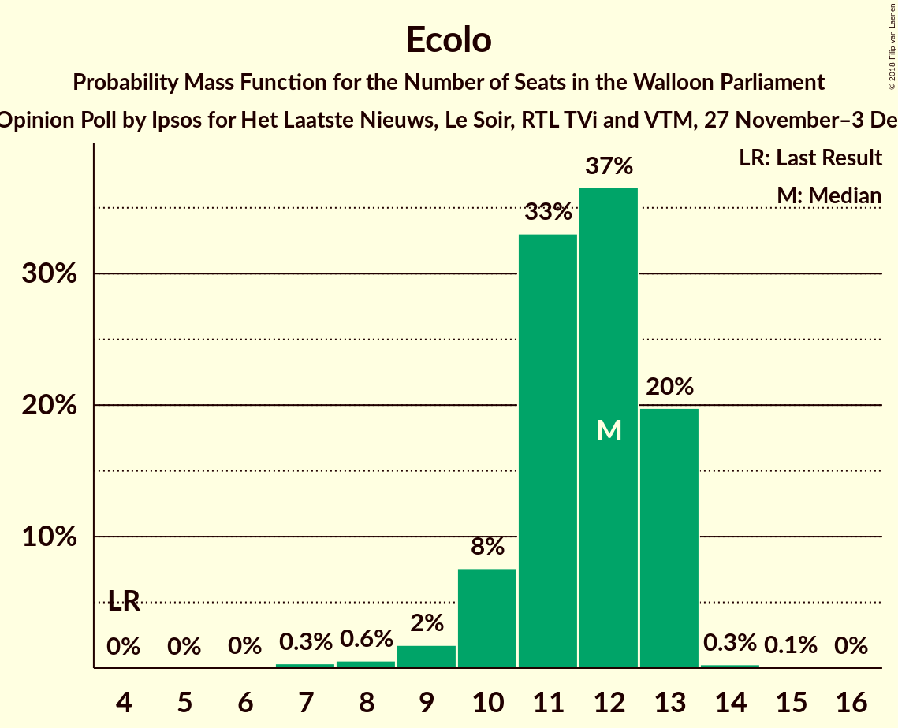
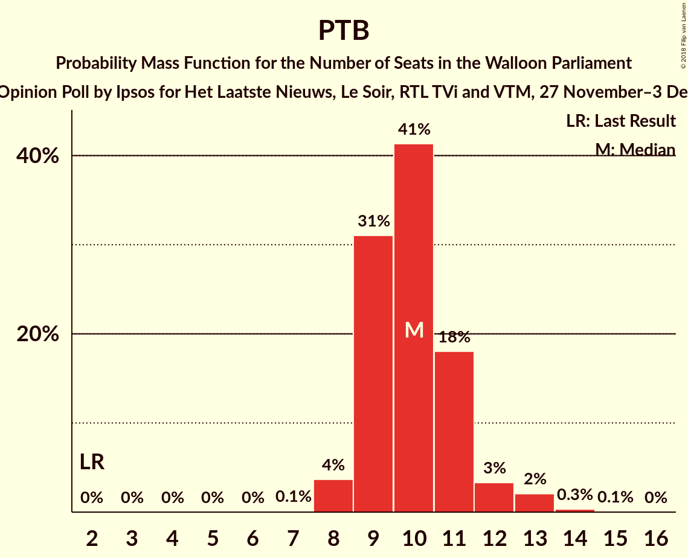
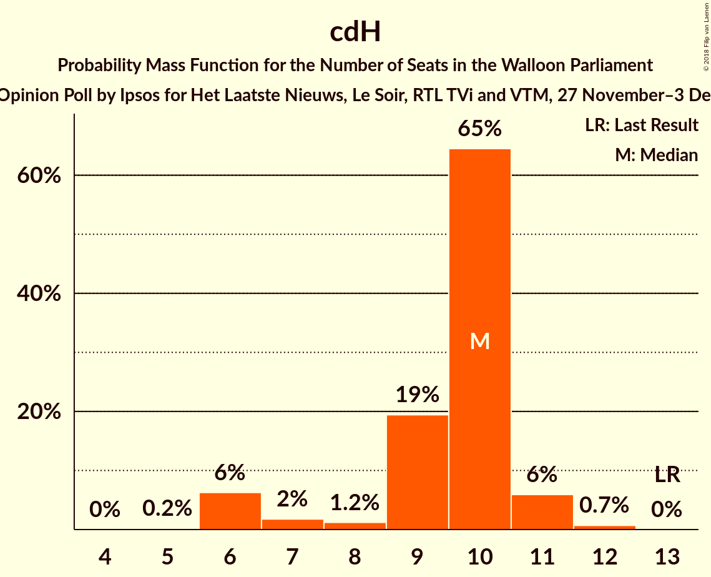
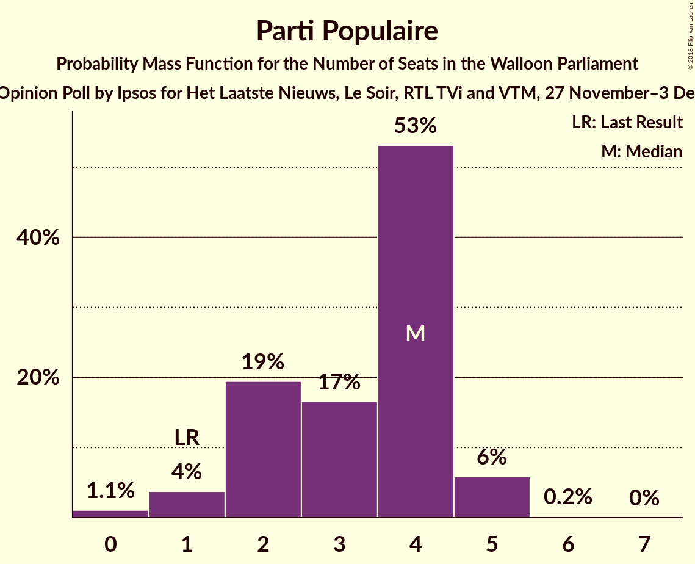
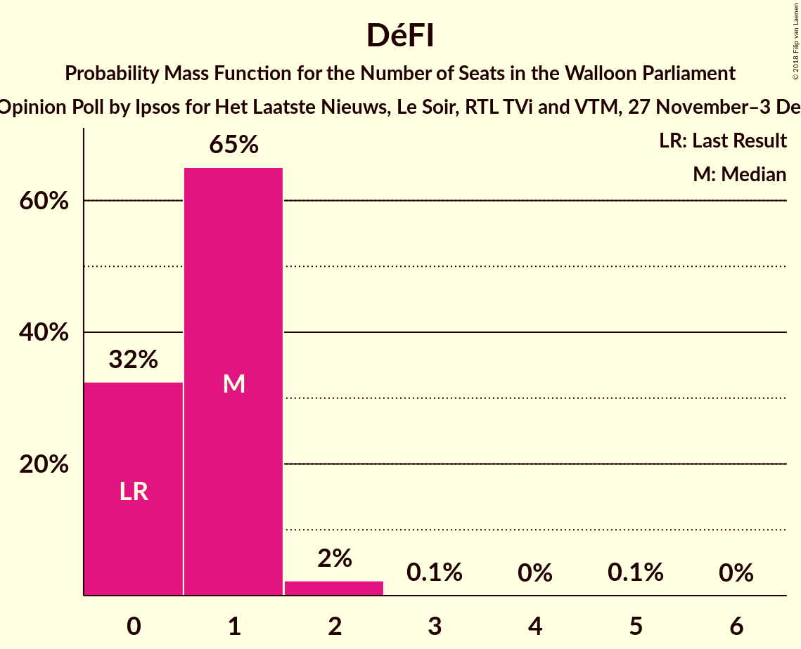
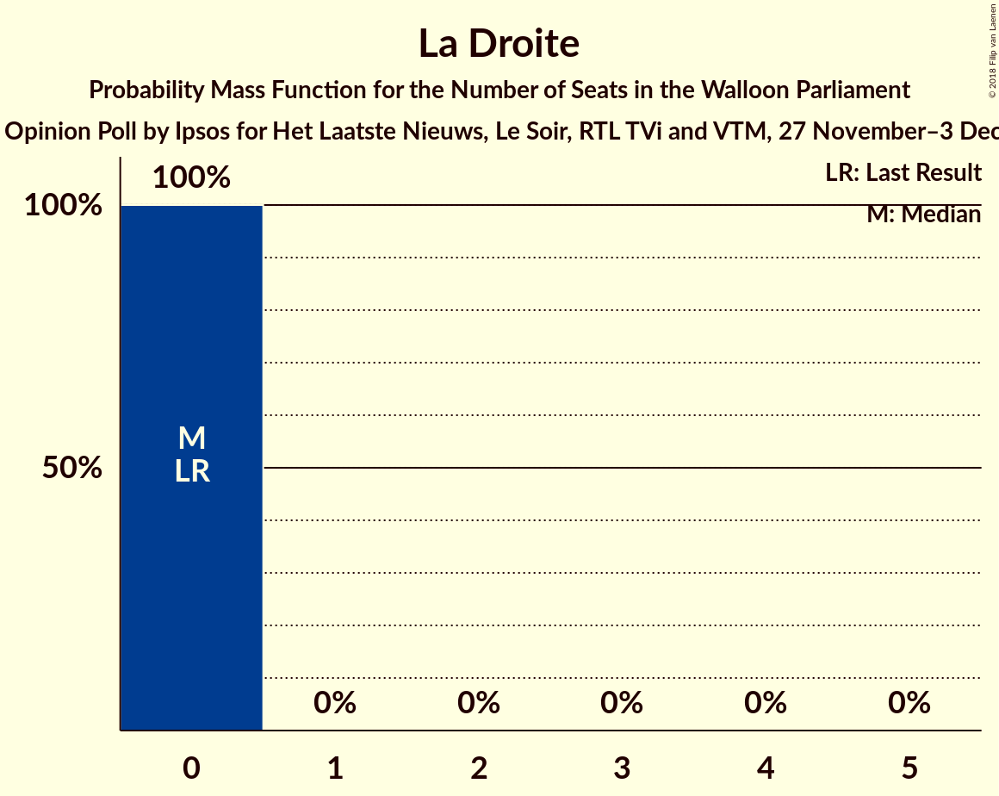
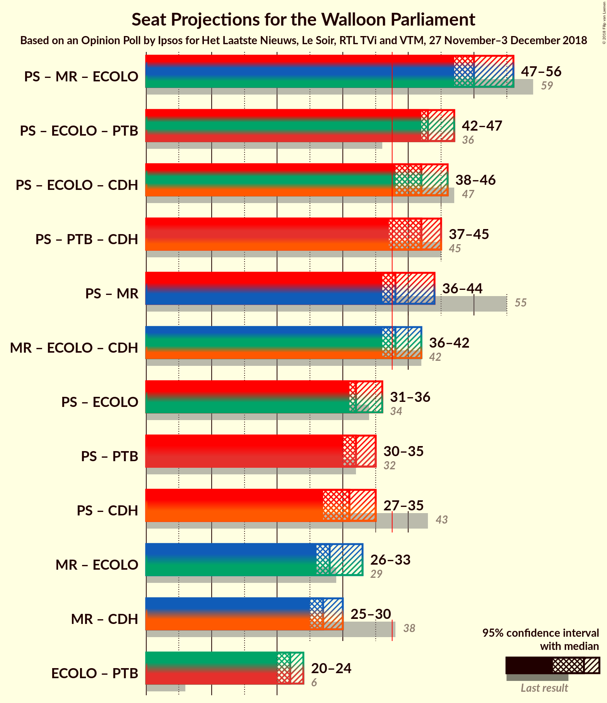

# Opinion Poll by Ipsos for Het Laatste Nieuws, Le Soir, RTL TVi and VTM, 27 November–3 December 2018

<a href="#voting-intentions">Voting Intentions</a> | <a href="#seats">Seats</a> | <a href="#coalitions">Coalitions</a> | <a href="#technical-information">Technical Information</a>

## Voting Intentions

### Confidence Intervals

| Party | Last Result | Poll Result | 80% Confidence Interval | 90% Confidence Interval | 95% Confidence Interval | 99% Confidence Interval |
|:-----:|:-----------:|:-----------:|:-----------------------:|:-----------------------:|:-----------------------:|:-----------------------:|
| PS | 30.9% | 24.9% | 23.2–26.7% |22.8–27.3% |22.3–27.7% |21.6–28.6% |
| MR | 26.7% | 20.7% | 19.2–22.5% |18.7–22.9% |18.3–23.4% |17.6–24.2% |
| Ecolo | 8.6% | 13.5% | 12.2–14.9% |11.8–15.3% |11.5–15.7% |10.9–16.4% |
| PTB | 5.8% | 13.1% | 11.8–14.5% |11.4–14.9% |11.1–15.3% |10.5–16.0% |
| cdH | 15.2% | 11.3% | 10.1–12.7% |9.7–13.0% |9.4–13.4% |8.9–14.1% |
| Parti Populaire | 4.9% | 6.2% | 5.3–7.3% |5.1–7.6% |4.8–7.8% |4.5–8.4% |
| DéFI | 2.5% | 4.2% | 3.5–5.1% |3.3–5.4% |3.1–5.6% |2.8–6.1% |
| La Droite | 1.4% | 2.3% | 1.8–3.0% |1.6–3.2% |1.5–3.4% |1.3–3.8% |

*Note:* The poll result column reflects the actual value used in the calculations. Published results may vary slightly, and in addition be rounded to fewer digits.

## Seats

### Confidence Intervals

| Party | Last Result | Median | 80% Confidence Interval | 90% Confidence Interval | 95% Confidence Interval | 99% Confidence Interval |
|:-----:|:-----------:|:------:|:-----------------------:|:-----------------------:|:-----------------------:|:-----------------------:|
| <a href="#ps">PS</a> | 30 | 21 | 21–23 |20–24 |20–25 |19–26 |
| <a href="#mr">MR</a> | 25 | 17 | 17–20 |15–20 |15–21 |15–22 |
| <a href="#ecolo">Ecolo</a> | 4 | 11 | 10–12 |10–13 |10–13 |9–13 |
| <a href="#ptb">PTB</a> | 2 | 11 | 10–11 |9–12 |8–13 |7–13 |
| <a href="#cdh">cdH</a> | 13 | 10 | 9–10 |6–11 |6–11 |6–12 |
| <a href="#parti-populaire">Parti Populaire</a> | 1 | 4 | 2–4 |2–5 |1–5 |0–5 |
| <a href="#défi">DéFI</a> | 0 | 1 | 0–1 |0–1 |0–1 |0–2 |
| <a href="#la-droite">La Droite</a> | 0 | 0 | 0 |0 |0 |0 |

### PS

*For a full overview of the results for this party, see the [PS](party-ps.html) page.*

| Number of Seats | Probability | Accumulated | Special Marks |
|:---------------:|:-----------:|:-----------:|:-------------:|
| 18 | 0.2% | 100% |  |
| 19 | 1.2% | 99.8% |  |
| 20 | 4% | 98.6% |  |
| 21 | 66% | 94% | Median |
| 22 | 9% | 28% |  |
| 23 | 9% | 19% |  |
| 24 | 6% | 10% |  |
| 25 | 3% | 4% |  |
| 26 | 1.0% | 1.4% |  |
| 27 | 0.3% | 0.4% |  |
| 28 | 0.1% | 0.1% |  |
| 29 | 0% | 0% |  |
| 30 | 0% | 0% | Last Result |

### MR

*For a full overview of the results for this party, see the [MR](party-mr.html) page.*

| Number of Seats | Probability | Accumulated | Special Marks |
|:---------------:|:-----------:|:-----------:|:-------------:|
| 14 | 0.1% | 100% |  |
| 15 | 6% | 99.9% |  |
| 16 | 1.2% | 94% |  |
| 17 | 53% | 93% | Median |
| 18 | 8% | 40% |  |
| 19 | 8% | 32% |  |
| 20 | 20% | 24% |  |
| 21 | 3% | 4% |  |
| 22 | 1.1% | 1.5% |  |
| 23 | 0% | 0.3% |  |
| 24 | 0.3% | 0.3% |  |
| 25 | 0% | 0% | Last Result |

### Ecolo

*For a full overview of the results for this party, see the [Ecolo](party-ecolo.html) page.*

| Number of Seats | Probability | Accumulated | Special Marks |
|:---------------:|:-----------:|:-----------:|:-------------:|
| 4 | 0% | 100% | Last Result |
| 5 | 0% | 100% |  |
| 6 | 0% | 100% |  |
| 7 | 0.1% | 100% |  |
| 8 | 0.2% | 99.8% |  |
| 9 | 0.3% | 99.7% |  |
| 10 | 12% | 99.4% |  |
| 11 | 57% | 87% | Median |
| 12 | 20% | 30% |  |
| 13 | 9% | 9% |  |
| 14 | 0.4% | 0.5% |  |
| 15 | 0% | 0.1% |  |
| 16 | 0% | 0% |  |

### PTB

*For a full overview of the results for this party, see the [PTB](party-ptb.html) page.*

| Number of Seats | Probability | Accumulated | Special Marks |
|:---------------:|:-----------:|:-----------:|:-------------:|
| 2 | 0% | 100% | Last Result |
| 3 | 0% | 100% |  |
| 4 | 0% | 100% |  |
| 5 | 0% | 100% |  |
| 6 | 0% | 100% |  |
| 7 | 0.5% | 100% |  |
| 8 | 3% | 99.5% |  |
| 9 | 5% | 97% |  |
| 10 | 22% | 92% |  |
| 11 | 64% | 70% | Median |
| 12 | 2% | 6% |  |
| 13 | 4% | 4% |  |
| 14 | 0.1% | 0.1% |  |
| 15 | 0% | 0% |  |

### cdH

*For a full overview of the results for this party, see the [cdH](party-cdh.html) page.*

| Number of Seats | Probability | Accumulated | Special Marks |
|:---------------:|:-----------:|:-----------:|:-------------:|
| 5 | 0.2% | 100% |  |
| 6 | 6% | 99.8% |  |
| 7 | 2% | 94% |  |
| 8 | 1.2% | 92% |  |
| 9 | 19% | 91% |  |
| 10 | 65% | 71% | Median |
| 11 | 6% | 7% |  |
| 12 | 0.7% | 0.7% |  |
| 13 | 0% | 0% | Last Result |

### Parti Populaire

*For a full overview of the results for this party, see the [Parti Populaire](party-partipopulaire.html) page.*

| Number of Seats | Probability | Accumulated | Special Marks |
|:---------------:|:-----------:|:-----------:|:-------------:|
| 0 | 1.1% | 100% |  |
| 1 | 4% | 98.9% | Last Result |
| 2 | 19% | 95% |  |
| 3 | 17% | 76% |  |
| 4 | 53% | 59% | Median |
| 5 | 6% | 6% |  |
| 6 | 0.2% | 0.2% |  |
| 7 | 0% | 0% |  |

### DéFI

*For a full overview of the results for this party, see the [DéFI](party-défi.html) page.*

| Number of Seats | Probability | Accumulated | Special Marks |
|:---------------:|:-----------:|:-----------:|:-------------:|
| 0 | 32% | 100% | Last Result |
| 1 | 65% | 68% | Median |
| 2 | 2% | 2% |  |
| 3 | 0.1% | 0.2% |  |
| 4 | 0% | 0.1% |  |
| 5 | 0.1% | 0.1% |  |
| 6 | 0% | 0% |  |

### La Droite

*For a full overview of the results for this party, see the [La Droite](party-ladroite.html) page.*

| Number of Seats | Probability | Accumulated | Special Marks |
|:---------------:|:-----------:|:-----------:|:-------------:|
| 0 | 100% | 100% | Last Result, Median |

## Coalitions

### Confidence Intervals

| Coalition | Last Result | Median | Majority? | 80% Confidence Interval | 90% Confidence Interval | 95% Confidence Interval | 99% Confidence Interval |
|:---------:|:-----------:|:------:|:---------:|:-----------------------:|:-----------------------:|:-----------------------:|:-----------------------:|
| PS – MR – Ecolo | 59 | 50 | 100% | 49–54 | 48–54 | 47–56 | 47–56 |
| PS – Ecolo – PTB | 36 | 43 | 100% | 42–45 | 42–46 | 42–47 | 40–48 |
| PS – Ecolo – cdH | 47 | 42 | 99.9% | 41–44 | 40–45 | 38–46 | 38–47 |
| PS – PTB – cdH | 45 | 42 | 97% | 40–44 | 38–45 | 37–45 | 36–46 |
| PS – MR | 55 | 38 | 94% | 38–43 | 37–43 | 36–44 | 36–45 |
| MR – Ecolo – cdH | 42 | 38 | 85% | 37–41 | 36–41 | 36–42 | 35–43 |
| PS – Ecolo | 34 | 32 | 1.4% | 32–34 | 32–36 | 31–36 | 30–39 |
| PS – PTB | 32 | 32 | 0.1% | 31–34 | 30–35 | 30–35 | 29–37 |
| PS – cdH | 43 | 31 | 0% | 30–33 | 28–34 | 27–35 | 26–35 |
| MR – Ecolo | 29 | 28 | 0% | 27–32 | 27–33 | 26–33 | 26–34 |
| MR – cdH | 38 | 27 | 0% | 26–29 | 25–29 | 25–30 | 23–31 |
| Ecolo – PTB | 6 | 22 | 0% | 20–23 | 20–24 | 20–24 | 19–25 |

### PS – MR – Ecolo

| Number of Seats | Probability | Accumulated | Special Marks |
|:---------------:|:-----------:|:-----------:|:-------------:|
| 47 | 4% | 100% |  |
| 48 | 1.0% | 96% |  |
| 49 | 42% | 95% | Median |
| 50 | 6% | 53% |  |
| 51 | 8% | 46% |  |
| 52 | 15% | 39% |  |
| 53 | 13% | 23% |  |
| 54 | 6% | 11% |  |
| 55 | 2% | 5% |  |
| 56 | 2% | 3% |  |
| 57 | 0.2% | 0.4% |  |
| 58 | 0% | 0.2% |  |
| 59 | 0.1% | 0.1% | Last Result |
| 60 | 0% | 0% |  |

### PS – Ecolo – PTB

| Number of Seats | Probability | Accumulated | Special Marks |
|:---------------:|:-----------:|:-----------:|:-------------:|
| 36 | 0% | 100% | Last Result |
| 37 | 0% | 100% |  |
| 38 | 0.1% | 100% | Majority |
| 39 | 0.1% | 99.9% |  |
| 40 | 0.5% | 99.8% |  |
| 41 | 2% | 99.3% |  |
| 42 | 8% | 98% |  |
| 43 | 55% | 89% | Median |
| 44 | 16% | 34% |  |
| 45 | 11% | 19% |  |
| 46 | 5% | 8% |  |
| 47 | 1.3% | 3% |  |
| 48 | 1.0% | 2% |  |
| 49 | 0.4% | 0.5% |  |
| 50 | 0% | 0% |  |

### PS – Ecolo – cdH

| Number of Seats | Probability | Accumulated | Special Marks |
|:---------------:|:-----------:|:-----------:|:-------------:|
| 37 | 0.1% | 100% |  |
| 38 | 4% | 99.9% | Majority |
| 39 | 0.6% | 96% |  |
| 40 | 2% | 96% |  |
| 41 | 5% | 93% |  |
| 42 | 57% | 88% | Median |
| 43 | 11% | 31% |  |
| 44 | 12% | 20% |  |
| 45 | 5% | 8% |  |
| 46 | 2% | 3% |  |
| 47 | 0.7% | 0.9% | Last Result |
| 48 | 0.1% | 0.1% |  |
| 49 | 0% | 0% |  |

### PS – PTB – cdH

| Number of Seats | Probability | Accumulated | Special Marks |
|:---------------:|:-----------:|:-----------:|:-------------:|
| 36 | 0.5% | 100% |  |
| 37 | 2% | 99.5% |  |
| 38 | 3% | 97% | Majority |
| 39 | 1.2% | 95% |  |
| 40 | 7% | 93% |  |
| 41 | 18% | 87% |  |
| 42 | 52% | 68% | Median |
| 43 | 2% | 17% |  |
| 44 | 7% | 15% |  |
| 45 | 6% | 7% | Last Result |
| 46 | 0.8% | 1.0% |  |
| 47 | 0.3% | 0.3% |  |
| 48 | 0% | 0% |  |

### PS – MR

| Number of Seats | Probability | Accumulated | Special Marks |
|:---------------:|:-----------:|:-----------:|:-------------:|
| 35 | 0.3% | 100% |  |
| 36 | 4% | 99.7% |  |
| 37 | 1.4% | 96% |  |
| 38 | 45% | 94% | Median, Majority |
| 39 | 5% | 49% |  |
| 40 | 12% | 43% |  |
| 41 | 17% | 32% |  |
| 42 | 5% | 15% |  |
| 43 | 8% | 11% |  |
| 44 | 1.1% | 3% |  |
| 45 | 1.5% | 2% |  |
| 46 | 0.3% | 0.3% |  |
| 47 | 0% | 0% |  |
| 48 | 0% | 0% |  |
| 49 | 0% | 0% |  |
| 50 | 0% | 0% |  |
| 51 | 0% | 0% |  |
| 52 | 0% | 0% |  |
| 53 | 0% | 0% |  |
| 54 | 0% | 0% |  |
| 55 | 0% | 0% | Last Result |

### MR – Ecolo – cdH

| Number of Seats | Probability | Accumulated | Special Marks |
|:---------------:|:-----------:|:-----------:|:-------------:|
| 33 | 0.1% | 100% |  |
| 34 | 0.2% | 99.9% |  |
| 35 | 0.8% | 99.7% |  |
| 36 | 5% | 98.8% |  |
| 37 | 9% | 94% |  |
| 38 | 45% | 85% | Median, Majority |
| 39 | 14% | 41% |  |
| 40 | 8% | 26% |  |
| 41 | 14% | 18% |  |
| 42 | 3% | 4% | Last Result |
| 43 | 0.8% | 0.8% |  |
| 44 | 0% | 0% |  |

### PS – Ecolo

| Number of Seats | Probability | Accumulated | Special Marks |
|:---------------:|:-----------:|:-----------:|:-------------:|
| 28 | 0.1% | 100% |  |
| 29 | 0.2% | 99.9% |  |
| 30 | 0.8% | 99.7% |  |
| 31 | 2% | 98.9% |  |
| 32 | 53% | 97% | Median |
| 33 | 22% | 44% |  |
| 34 | 13% | 22% | Last Result |
| 35 | 2% | 9% |  |
| 36 | 5% | 7% |  |
| 37 | 0.9% | 2% |  |
| 38 | 0.8% | 1.4% | Majority |
| 39 | 0.6% | 0.7% |  |
| 40 | 0% | 0% |  |

### PS – PTB

| Number of Seats | Probability | Accumulated | Special Marks |
|:---------------:|:-----------:|:-----------:|:-------------:|
| 27 | 0.1% | 100% |  |
| 28 | 0.2% | 99.9% |  |
| 29 | 1.0% | 99.7% |  |
| 30 | 5% | 98.7% |  |
| 31 | 11% | 94% |  |
| 32 | 57% | 82% | Last Result, Median |
| 33 | 10% | 25% |  |
| 34 | 6% | 15% |  |
| 35 | 7% | 9% |  |
| 36 | 1.3% | 2% |  |
| 37 | 0.4% | 0.5% |  |
| 38 | 0.1% | 0.1% | Majority |
| 39 | 0% | 0% |  |

### PS – cdH

| Number of Seats | Probability | Accumulated | Special Marks |
|:---------------:|:-----------:|:-----------:|:-------------:|
| 25 | 0.1% | 100% |  |
| 26 | 2% | 99.9% |  |
| 27 | 3% | 98% |  |
| 28 | 0.6% | 96% |  |
| 29 | 3% | 95% |  |
| 30 | 10% | 92% |  |
| 31 | 60% | 83% | Median |
| 32 | 9% | 22% |  |
| 33 | 5% | 13% |  |
| 34 | 5% | 8% |  |
| 35 | 3% | 3% |  |
| 36 | 0.2% | 0.2% |  |
| 37 | 0% | 0% |  |
| 38 | 0% | 0% | Majority |
| 39 | 0% | 0% |  |
| 40 | 0% | 0% |  |
| 41 | 0% | 0% |  |
| 42 | 0% | 0% |  |
| 43 | 0% | 0% | Last Result |

### MR – Ecolo

| Number of Seats | Probability | Accumulated | Special Marks |
|:---------------:|:-----------:|:-----------:|:-------------:|
| 25 | 0.3% | 100% |  |
| 26 | 5% | 99.6% |  |
| 27 | 6% | 95% |  |
| 28 | 45% | 89% | Median |
| 29 | 5% | 44% | Last Result |
| 30 | 12% | 39% |  |
| 31 | 14% | 27% |  |
| 32 | 8% | 14% |  |
| 33 | 4% | 5% |  |
| 34 | 0.5% | 0.9% |  |
| 35 | 0.2% | 0.4% |  |
| 36 | 0.1% | 0.1% |  |
| 37 | 0% | 0% |  |

### MR – cdH

| Number of Seats | Probability | Accumulated | Special Marks |
|:---------------:|:-----------:|:-----------:|:-------------:|
| 22 | 0.4% | 100% |  |
| 23 | 0.4% | 99.6% |  |
| 24 | 1.0% | 99.2% |  |
| 25 | 5% | 98% |  |
| 26 | 7% | 93% |  |
| 27 | 53% | 87% | Median |
| 28 | 9% | 34% |  |
| 29 | 20% | 25% |  |
| 30 | 4% | 5% |  |
| 31 | 1.1% | 1.3% |  |
| 32 | 0.1% | 0.1% |  |
| 33 | 0% | 0% |  |
| 34 | 0% | 0% |  |
| 35 | 0% | 0% |  |
| 36 | 0% | 0% |  |
| 37 | 0% | 0% |  |
| 38 | 0% | 0% | Last Result, Majority |

### Ecolo – PTB

| Number of Seats | Probability | Accumulated | Special Marks |
|:---------------:|:-----------:|:-----------:|:-------------:|
| 6 | 0% | 100% | Last Result |
| 7 | 0% | 100% |  |
| 8 | 0% | 100% |  |
| 9 | 0% | 100% |  |
| 10 | 0% | 100% |  |
| 11 | 0% | 100% |  |
| 12 | 0% | 100% |  |
| 13 | 0% | 100% |  |
| 14 | 0% | 100% |  |
| 15 | 0% | 100% |  |
| 16 | 0% | 100% |  |
| 17 | 0.2% | 100% |  |
| 18 | 0.2% | 99.8% |  |
| 19 | 1.0% | 99.6% |  |
| 20 | 10% | 98.6% |  |
| 21 | 12% | 89% |  |
| 22 | 53% | 77% | Median |
| 23 | 16% | 24% |  |
| 24 | 7% | 8% |  |
| 25 | 0.4% | 0.6% |  |
| 26 | 0.2% | 0.2% |  |
| 27 | 0% | 0% |  |

## Technical Information

### Opinion Poll

+ **Polling firm:** Ipsos
+ **Commissioner(s):** Het Laatste Nieuws, Le Soir, RTL TVi and VTM
+ **Fieldwork period:** 27 November–3 December 2018

### Calculations

+ **Sample size:** 1003
+ **Simulations done:** 65,536
+ **Error estimate:** 1.14%

