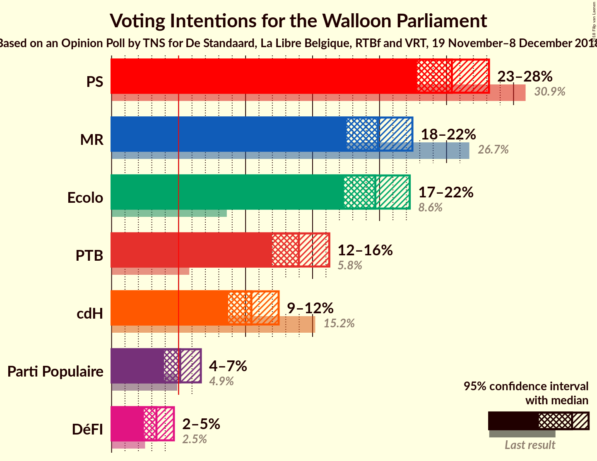
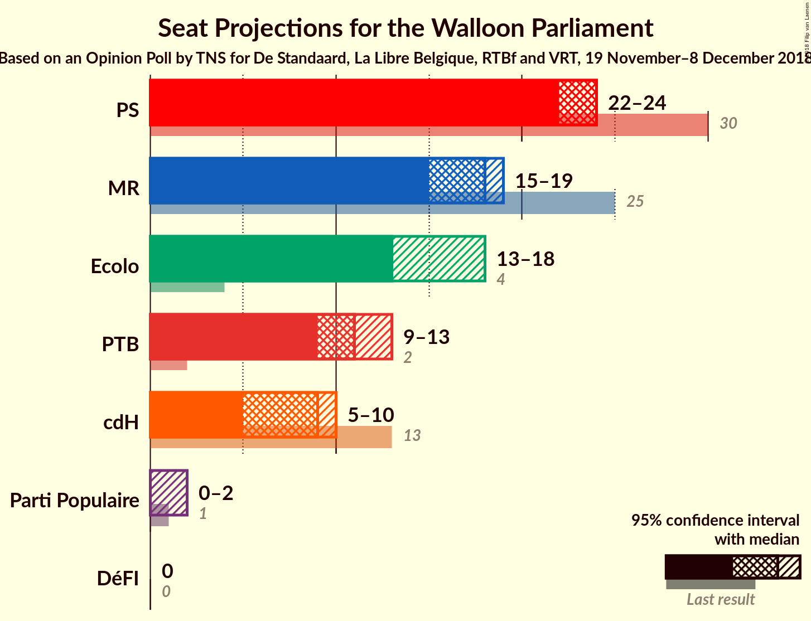
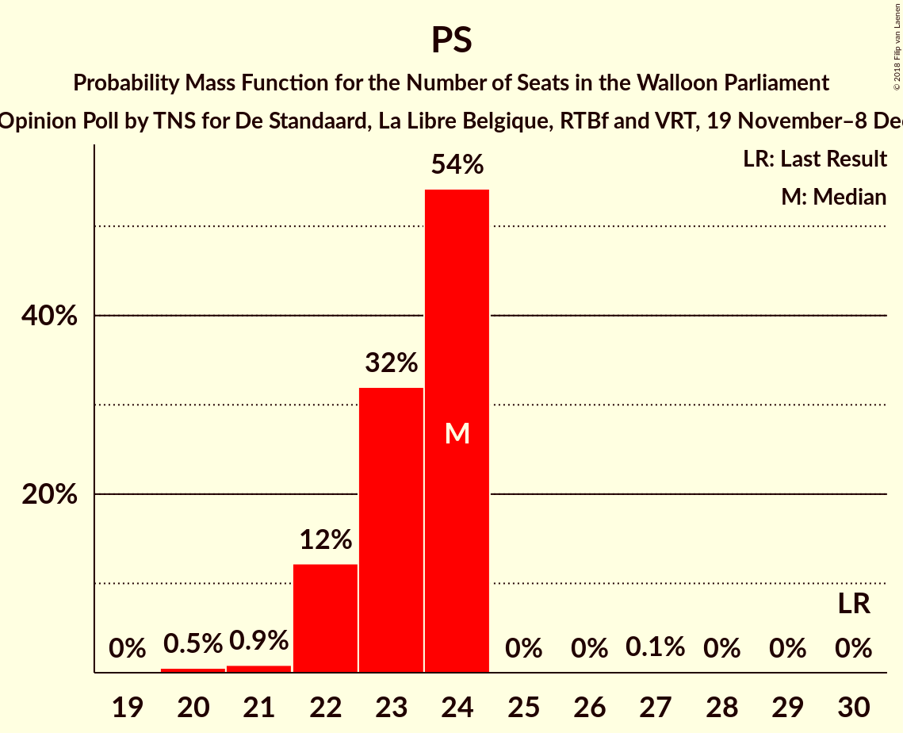
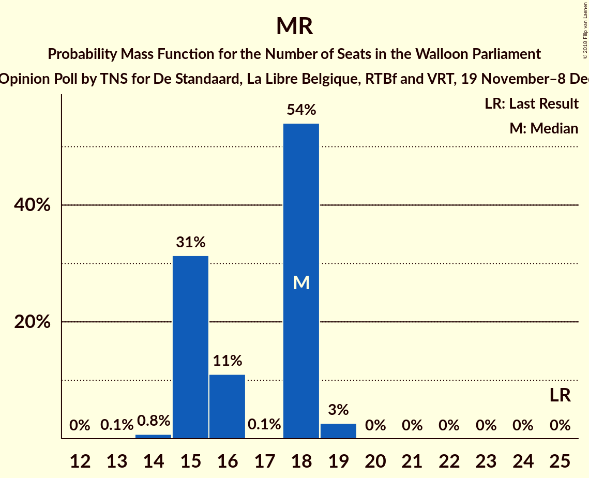
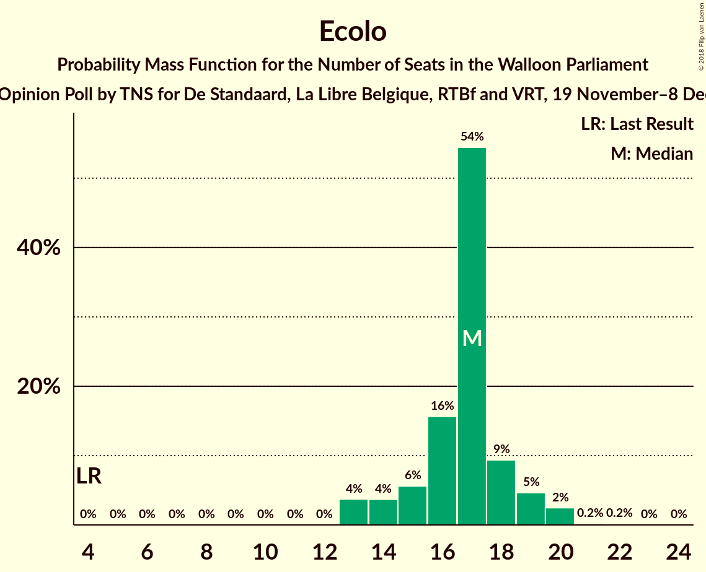
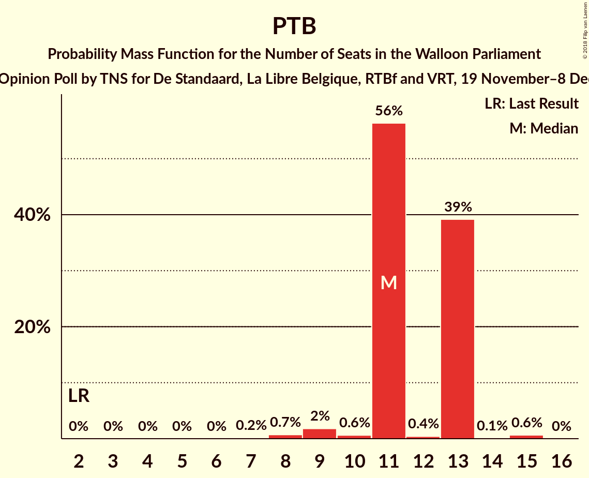
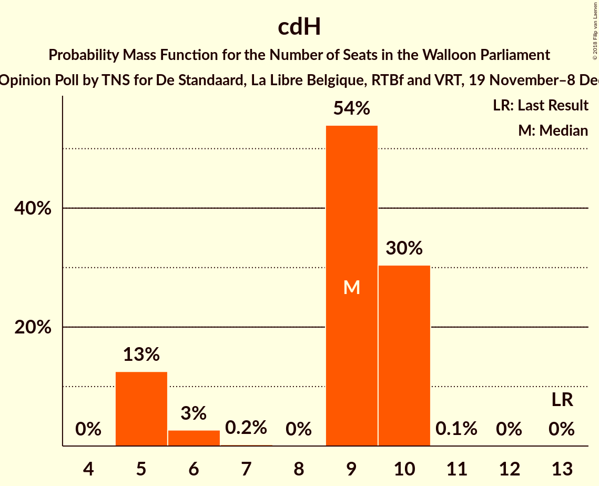
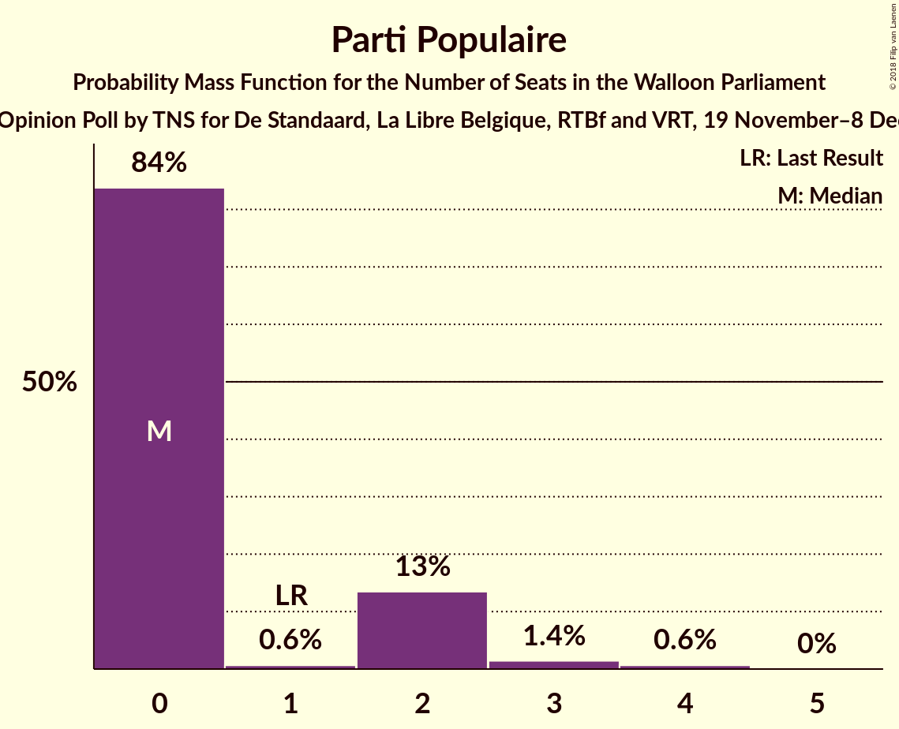
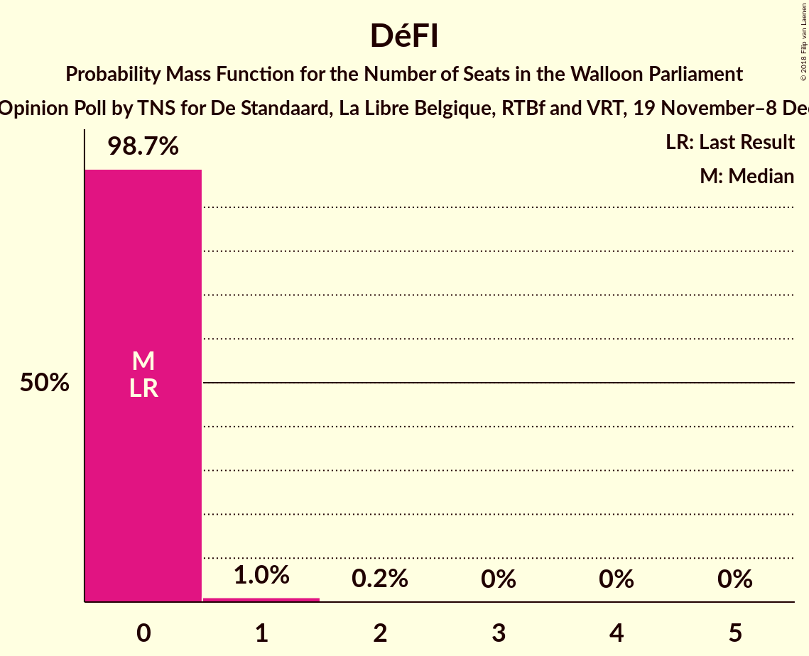
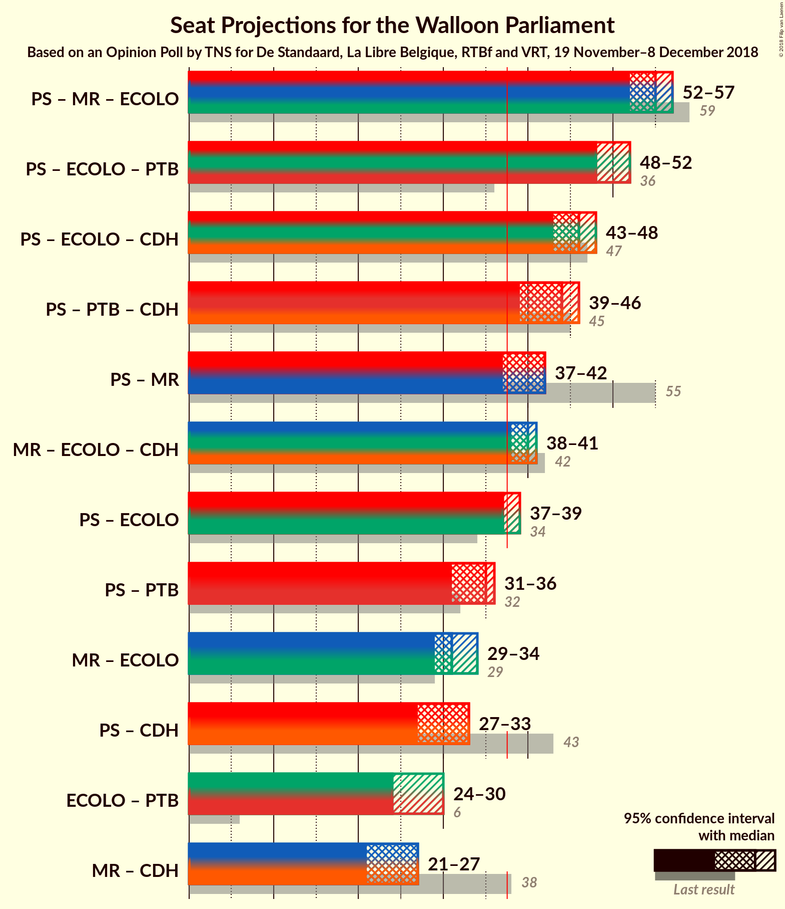

# Opinion Poll by TNS for De Standaard, La Libre Belgique, RTBf and VRT, 19 November–8 December 2018

<a href="#voting-intentions">Voting Intentions</a> | <a href="#seats">Seats</a> | <a href="#coalitions">Coalitions</a> | <a href="#technical-information">Technical Information</a>

## Voting Intentions

### Confidence Intervals

| Party | Last Result | Poll Result | 80% Confidence Interval | 90% Confidence Interval | 95% Confidence Interval | 99% Confidence Interval |
|:-----:|:-----------:|:-----------:|:-----------------------:|:-----------------------:|:-----------------------:|:-----------------------:|
| PS | 30.9% | 25.4% | 23.7–27.2% |23.2–27.7% |22.8–28.2% |22.0–29.1% |
| MR | 26.7% | 19.9% | 18.3–21.6% |17.9–22.0% |17.5–22.5% |16.8–23.3% |
| Ecolo | 8.6% | 19.7% | 18.2–21.4% |17.7–21.8% |17.3–22.3% |16.6–23.1% |
| PTB | 5.8% | 14.0% | 12.7–15.5% |12.3–15.9% |12.0–16.2% |11.4–17.0% |
| cdH | 15.2% | 10.4% | 9.3–11.8% |9.0–12.1% |8.7–12.5% |8.2–13.1% |
| Parti Populaire | 4.9% | 5.1% | 4.3–6.1% |4.1–6.4% |3.9–6.7% |3.6–7.2% |
| DéFI | 2.5% | 3.3% | 2.7–4.2% |2.5–4.4% |2.4–4.6% |2.1–5.1% |

*Note:* The poll result column reflects the actual value used in the calculations. Published results may vary slightly, and in addition be rounded to fewer digits.

## Seats

### Confidence Intervals

| Party | Last Result | Median | 80% Confidence Interval | 90% Confidence Interval | 95% Confidence Interval | 99% Confidence Interval |
|:-----:|:-----------:|:------:|:-----------------------:|:-----------------------:|:-----------------------:|:-----------------------:|
| <a href="#ps">PS</a> | 30 | 24 | 22–24 |22–24 |22–24 |20–24 |
| <a href="#mr">MR</a> | 25 | 18 | 15–18 |15–18 |15–19 |14–19 |
| <a href="#ecolo">Ecolo</a> | 4 | 13 | 13–17 |13–17 |13–18 |13–20 |
| <a href="#ptb">PTB</a> | 2 | 11 | 11–13 |11–13 |9–13 |8–15 |
| <a href="#cdh">cdH</a> | 13 | 9 | 5–10 |5–10 |5–10 |5–10 |
| <a href="#parti-populaire">Parti Populaire</a> | 1 | 0 | 0–2 |0–2 |0–2 |0–4 |
| <a href="#défi">DéFI</a> | 0 | 0 | 0 |0 |0 |0–1 |

### PS

*For a full overview of the results for this party, see the [PS](party-ps.html) page.*

| Number of Seats | Probability | Accumulated | Special Marks |
|:---------------:|:-----------:|:-----------:|:-------------:|
| 20 | 0.5% | 100% |  |
| 21 | 0.9% | 99.4% |  |
| 22 | 12% | 98.6% |  |
| 23 | 32% | 86% |  |
| 24 | 54% | 54% | Median |
| 25 | 0% | 0.2% |  |
| 26 | 0% | 0.2% |  |
| 27 | 0.1% | 0.1% |  |
| 28 | 0% | 0% |  |
| 29 | 0% | 0% |  |
| 30 | 0% | 0% | Last Result |

### MR

*For a full overview of the results for this party, see the [MR](party-mr.html) page.*

| Number of Seats | Probability | Accumulated | Special Marks |
|:---------------:|:-----------:|:-----------:|:-------------:|
| 13 | 0.1% | 100% |  |
| 14 | 0.8% | 99.9% |  |
| 15 | 31% | 99.2% |  |
| 16 | 11% | 68% |  |
| 17 | 0.1% | 57% |  |
| 18 | 54% | 57% | Median |
| 19 | 3% | 3% |  |
| 20 | 0% | 0% |  |
| 21 | 0% | 0% |  |
| 22 | 0% | 0% |  |
| 23 | 0% | 0% |  |
| 24 | 0% | 0% |  |
| 25 | 0% | 0% | Last Result |

### Ecolo

*For a full overview of the results for this party, see the [Ecolo](party-ecolo.html) page.*

| Number of Seats | Probability | Accumulated | Special Marks |
|:---------------:|:-----------:|:-----------:|:-------------:|
| 4 | 0% | 100% | Last Result |
| 5 | 0% | 100% |  |
| 6 | 0% | 100% |  |
| 7 | 0% | 100% |  |
| 8 | 0% | 100% |  |
| 9 | 0% | 100% |  |
| 10 | 0% | 100% |  |
| 11 | 0% | 100% |  |
| 12 | 0% | 100% |  |
| 13 | 54% | 100% | Median |
| 14 | 30% | 46% |  |
| 15 | 2% | 16% |  |
| 16 | 0.7% | 14% |  |
| 17 | 10% | 13% |  |
| 18 | 0.9% | 3% |  |
| 19 | 0.1% | 2% |  |
| 20 | 2% | 2% |  |
| 21 | 0.1% | 0.1% |  |
| 22 | 0% | 0% |  |

### PTB

*For a full overview of the results for this party, see the [PTB](party-ptb.html) page.*

| Number of Seats | Probability | Accumulated | Special Marks |
|:---------------:|:-----------:|:-----------:|:-------------:|
| 2 | 0% | 100% | Last Result |
| 3 | 0% | 100% |  |
| 4 | 0% | 100% |  |
| 5 | 0% | 100% |  |
| 6 | 0% | 100% |  |
| 7 | 0.2% | 100% |  |
| 8 | 0.7% | 99.8% |  |
| 9 | 2% | 99.1% |  |
| 10 | 0.6% | 97% |  |
| 11 | 56% | 97% | Median |
| 12 | 0.4% | 40% |  |
| 13 | 39% | 40% |  |
| 14 | 0.1% | 0.8% |  |
| 15 | 0.6% | 0.6% |  |
| 16 | 0% | 0% |  |

### cdH

*For a full overview of the results for this party, see the [cdH](party-cdh.html) page.*

| Number of Seats | Probability | Accumulated | Special Marks |
|:---------------:|:-----------:|:-----------:|:-------------:|
| 5 | 13% | 100% |  |
| 6 | 3% | 87% |  |
| 7 | 0.2% | 85% |  |
| 8 | 0% | 85% |  |
| 9 | 54% | 85% | Median |
| 10 | 30% | 31% |  |
| 11 | 0.1% | 0.1% |  |
| 12 | 0% | 0% |  |
| 13 | 0% | 0% | Last Result |

### Parti Populaire

*For a full overview of the results for this party, see the [Parti Populaire](party-partipopulaire.html) page.*

| Number of Seats | Probability | Accumulated | Special Marks |
|:---------------:|:-----------:|:-----------:|:-------------:|
| 0 | 84% | 100% | Median |
| 1 | 0.6% | 16% | Last Result |
| 2 | 13% | 16% |  |
| 3 | 1.4% | 2% |  |
| 4 | 0.6% | 0.7% |  |
| 5 | 0% | 0% |  |

### DéFI

*For a full overview of the results for this party, see the [DéFI](party-défi.html) page.*

| Number of Seats | Probability | Accumulated | Special Marks |
|:---------------:|:-----------:|:-----------:|:-------------:|
| 0 | 98.7% | 100% | Last Result, Median |
| 1 | 1.0% | 1.3% |  |
| 2 | 0.2% | 0.2% |  |
| 3 | 0% | 0% |  |

## Coalitions

### Confidence Intervals

| Coalition | Last Result | Median | Majority? | 80% Confidence Interval | 90% Confidence Interval | 95% Confidence Interval | 99% Confidence Interval |
|:---------:|:-----------:|:------:|:---------:|:-----------------------:|:-----------------------:|:-----------------------:|:-----------------------:|
| PS – MR – Ecolo | 59 | 55 | 100% | 52–55 | 52–55 | 52–57 | 52–58 |
| PS – Ecolo – PTB | 36 | 48 | 100% | 48–52 | 48–52 | 48–52 | 46–53 |
| PS – Ecolo – cdH | 47 | 46 | 100% | 44–47 | 44–47 | 43–48 | 43–48 |
| PS – PTB – cdH | 45 | 44 | 98% | 40–46 | 40–46 | 39–46 | 37–46 |
| PS – MR | 55 | 42 | 97% | 38–42 | 38–42 | 37–42 | 35–42 |
| MR – Ecolo – cdH | 42 | 40 | 99.8% | 38–40 | 38–40 | 38–41 | 38–42 |
| PS – Ecolo | 34 | 37 | 16% | 37–39 | 37–39 | 37–39 | 37–42 |
| PS – PTB | 32 | 35 | 0.2% | 35–36 | 34–36 | 31–36 | 30–36 |
| MR – Ecolo | 29 | 31 | 0% | 29–33 | 29–33 | 29–34 | 29–36 |
| PS – cdH | 43 | 33 | 0% | 27–33 | 27–33 | 27–33 | 26–33 |
| Ecolo – PTB | 6 | 24 | 0% | 24–30 | 24–30 | 24–30 | 24–33 |
| MR – cdH | 38 | 27 | 0% | 21–27 | 21–27 | 21–27 | 21–27 |

### PS – MR – Ecolo

| Number of Seats | Probability | Accumulated | Special Marks |
|:---------------:|:-----------:|:-----------:|:-------------:|
| 49 | 0.3% | 100% |  |
| 50 | 0.1% | 99.7% |  |
| 51 | 0% | 99.5% |  |
| 52 | 29% | 99.5% |  |
| 53 | 1.0% | 70% |  |
| 54 | 0.9% | 69% |  |
| 55 | 64% | 68% | Median |
| 56 | 0% | 5% |  |
| 57 | 4% | 5% |  |
| 58 | 0.4% | 0.8% |  |
| 59 | 0.2% | 0.4% | Last Result |
| 60 | 0% | 0.1% |  |
| 61 | 0.1% | 0.1% |  |
| 62 | 0% | 0% |  |

### PS – Ecolo – PTB

| Number of Seats | Probability | Accumulated | Special Marks |
|:---------------:|:-----------:|:-----------:|:-------------:|
| 36 | 0% | 100% | Last Result |
| 37 | 0% | 100% |  |
| 38 | 0% | 100% | Majority |
| 39 | 0% | 100% |  |
| 40 | 0% | 100% |  |
| 41 | 0% | 100% |  |
| 42 | 0% | 100% |  |
| 43 | 0% | 100% |  |
| 44 | 0% | 100% |  |
| 45 | 0% | 100% |  |
| 46 | 0.7% | 100% |  |
| 47 | 0.5% | 99.3% |  |
| 48 | 54% | 98.8% | Median |
| 49 | 2% | 44% |  |
| 50 | 29% | 42% |  |
| 51 | 1.4% | 12% |  |
| 52 | 10% | 11% |  |
| 53 | 0.7% | 0.8% |  |
| 54 | 0.1% | 0.1% |  |
| 55 | 0% | 0% |  |

### PS – Ecolo – cdH

| Number of Seats | Probability | Accumulated | Special Marks |
|:---------------:|:-----------:|:-----------:|:-------------:|
| 43 | 3% | 100% |  |
| 44 | 11% | 97% |  |
| 45 | 0.3% | 87% |  |
| 46 | 54% | 87% | Median |
| 47 | 29% | 32% | Last Result |
| 48 | 2% | 3% |  |
| 49 | 0.2% | 0.4% |  |
| 50 | 0.1% | 0.1% |  |
| 51 | 0% | 0% |  |

### PS – PTB – cdH

| Number of Seats | Probability | Accumulated | Special Marks |
|:---------------:|:-----------:|:-----------:|:-------------:|
| 36 | 0.1% | 100% |  |
| 37 | 2% | 99.9% |  |
| 38 | 0.4% | 98% | Majority |
| 39 | 3% | 98% |  |
| 40 | 11% | 95% |  |
| 41 | 0.6% | 85% |  |
| 42 | 0% | 84% |  |
| 43 | 0.5% | 84% |  |
| 44 | 54% | 83% | Median |
| 45 | 0.1% | 29% | Last Result |
| 46 | 29% | 29% |  |
| 47 | 0% | 0% |  |

### PS – MR

| Number of Seats | Probability | Accumulated | Special Marks |
|:---------------:|:-----------:|:-----------:|:-------------:|
| 34 | 0.1% | 100% |  |
| 35 | 1.1% | 99.9% |  |
| 36 | 0.3% | 98.8% |  |
| 37 | 1.5% | 98.6% |  |
| 38 | 40% | 97% | Majority |
| 39 | 0.1% | 57% |  |
| 40 | 0.1% | 57% |  |
| 41 | 0.2% | 57% |  |
| 42 | 56% | 57% | Median |
| 43 | 0% | 0.2% |  |
| 44 | 0% | 0.1% |  |
| 45 | 0% | 0.1% |  |
| 46 | 0.1% | 0.1% |  |
| 47 | 0% | 0% |  |
| 48 | 0% | 0% |  |
| 49 | 0% | 0% |  |
| 50 | 0% | 0% |  |
| 51 | 0% | 0% |  |
| 52 | 0% | 0% |  |
| 53 | 0% | 0% |  |
| 54 | 0% | 0% |  |
| 55 | 0% | 0% | Last Result |

### MR – Ecolo – cdH

| Number of Seats | Probability | Accumulated | Special Marks |
|:---------------:|:-----------:|:-----------:|:-------------:|
| 35 | 0.2% | 100% |  |
| 36 | 0% | 99.8% |  |
| 37 | 0% | 99.8% |  |
| 38 | 11% | 99.8% | Majority |
| 39 | 32% | 89% |  |
| 40 | 54% | 57% | Median |
| 41 | 1.5% | 3% |  |
| 42 | 1.2% | 1.4% | Last Result |
| 43 | 0.1% | 0.2% |  |
| 44 | 0% | 0% |  |

### PS – Ecolo

| Number of Seats | Probability | Accumulated | Special Marks |
|:---------------:|:-----------:|:-----------:|:-------------:|
| 34 | 0% | 100% | Last Result |
| 35 | 0.3% | 100% |  |
| 36 | 0.1% | 99.6% |  |
| 37 | 83% | 99.5% | Median |
| 38 | 4% | 16% | Majority |
| 39 | 10% | 13% |  |
| 40 | 0.4% | 2% |  |
| 41 | 0% | 2% |  |
| 42 | 2% | 2% |  |
| 43 | 0% | 0.1% |  |
| 44 | 0.1% | 0.1% |  |
| 45 | 0% | 0% |  |

### PS – PTB

| Number of Seats | Probability | Accumulated | Special Marks |
|:---------------:|:-----------:|:-----------:|:-------------:|
| 30 | 1.2% | 100% |  |
| 31 | 1.3% | 98.8% |  |
| 32 | 0.3% | 97% | Last Result |
| 33 | 0.6% | 97% |  |
| 34 | 2% | 96% |  |
| 35 | 64% | 94% | Median |
| 36 | 29% | 30% |  |
| 37 | 0.1% | 0.3% |  |
| 38 | 0.1% | 0.2% | Majority |
| 39 | 0.1% | 0.1% |  |
| 40 | 0% | 0% |  |

### MR – Ecolo

| Number of Seats | Probability | Accumulated | Special Marks |
|:---------------:|:-----------:|:-----------:|:-------------:|
| 27 | 0.1% | 100% |  |
| 28 | 0.3% | 99.9% |  |
| 29 | 29% | 99.6% | Last Result |
| 30 | 0% | 70% |  |
| 31 | 54% | 70% | Median |
| 32 | 1.1% | 16% |  |
| 33 | 11% | 15% |  |
| 34 | 2% | 4% |  |
| 35 | 1.5% | 2% |  |
| 36 | 0.4% | 0.5% |  |
| 37 | 0.1% | 0.1% |  |
| 38 | 0% | 0% | Majority |

### PS – cdH

| Number of Seats | Probability | Accumulated | Special Marks |
|:---------------:|:-----------:|:-----------:|:-------------:|
| 26 | 0.6% | 100% |  |
| 27 | 10% | 99.4% |  |
| 28 | 4% | 89% |  |
| 29 | 0.3% | 85% |  |
| 30 | 0.2% | 85% |  |
| 31 | 0.5% | 85% |  |
| 32 | 0.7% | 84% |  |
| 33 | 83% | 83% | Median |
| 34 | 0.1% | 0.1% |  |
| 35 | 0% | 0% |  |
| 36 | 0% | 0% |  |
| 37 | 0% | 0% |  |
| 38 | 0% | 0% | Majority |
| 39 | 0% | 0% |  |
| 40 | 0% | 0% |  |
| 41 | 0% | 0% |  |
| 42 | 0% | 0% |  |
| 43 | 0% | 0% | Last Result |

### Ecolo – PTB

| Number of Seats | Probability | Accumulated | Special Marks |
|:---------------:|:-----------:|:-----------:|:-------------:|
| 6 | 0% | 100% | Last Result |
| 7 | 0% | 100% |  |
| 8 | 0% | 100% |  |
| 9 | 0% | 100% |  |
| 10 | 0% | 100% |  |
| 11 | 0% | 100% |  |
| 12 | 0% | 100% |  |
| 13 | 0% | 100% |  |
| 14 | 0% | 100% |  |
| 15 | 0% | 100% |  |
| 16 | 0% | 100% |  |
| 17 | 0% | 100% |  |
| 18 | 0% | 100% |  |
| 19 | 0% | 100% |  |
| 20 | 0% | 100% |  |
| 21 | 0% | 100% |  |
| 22 | 0% | 100% |  |
| 23 | 0.1% | 100% |  |
| 24 | 55% | 99.8% | Median |
| 25 | 0.2% | 45% |  |
| 26 | 3% | 45% |  |
| 27 | 30% | 42% |  |
| 28 | 0.1% | 12% |  |
| 29 | 1.5% | 12% |  |
| 30 | 10% | 11% |  |
| 31 | 0% | 0.6% |  |
| 32 | 0% | 0.6% |  |
| 33 | 0.6% | 0.6% |  |
| 34 | 0% | 0% |  |

### MR – cdH

| Number of Seats | Probability | Accumulated | Special Marks |
|:---------------:|:-----------:|:-----------:|:-------------:|
| 20 | 0.1% | 100% |  |
| 21 | 12% | 99.9% |  |
| 22 | 0.5% | 88% |  |
| 23 | 0.1% | 87% |  |
| 24 | 3% | 87% |  |
| 25 | 30% | 84% |  |
| 26 | 0.7% | 55% |  |
| 27 | 54% | 54% | Median |
| 28 | 0% | 0% |  |
| 29 | 0% | 0% |  |
| 30 | 0% | 0% |  |
| 31 | 0% | 0% |  |
| 32 | 0% | 0% |  |
| 33 | 0% | 0% |  |
| 34 | 0% | 0% |  |
| 35 | 0% | 0% |  |
| 36 | 0% | 0% |  |
| 37 | 0% | 0% |  |
| 38 | 0% | 0% | Last Result, Majority |

## Technical Information

### Opinion Poll

+ **Polling firm:** TNS
+ **Commissioner(s):** De Standaard, La Libre Belgique, RTBf and VRT
+ **Fieldwork period:** 19 November–8 December 2018

### Calculations

+ **Sample size:** 1016
+ **Simulations done:** 1,024
+ **Error estimate:** 1.63%

