# Opinion Poll by TNS for De Standaard, La Libre Belgique, RTBf and VRT, 25 March–14 April 2019

<a href="#voting-intentions">Voting Intentions</a> | <a href="#seats">Seats</a> | <a href="#coalitions">Coalitions</a> | <a href="#technical-information">Technical Information</a>

## Voting Intentions

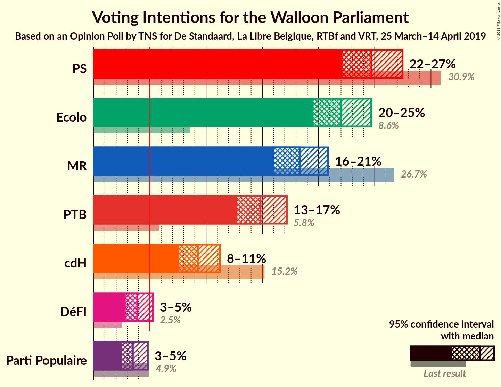

### Confidence Intervals

| Party | Last Result | Poll Result | 80% Confidence Interval | 90% Confidence Interval | 95% Confidence Interval | 99% Confidence Interval |
|:-----:|:-----------:|:-----------:|:-----------------------:|:-----------------------:|:-----------------------:|:-----------------------:|
| PS | 30.9% | 24.7% | 23.0–26.5% |22.5–27.0% |22.1–27.5% |21.3–28.3% |
| Ecolo | 8.6% | 22.0% | 20.4–23.8% |19.9–24.2% |19.6–24.7% |18.8–25.5% |
| MR | 26.7% | 18.3% | 16.8–20.0% |16.4–20.4% |16.0–20.9% |15.4–21.7% |
| PTB | 5.8% | 14.8% | 13.5–16.4% |13.1–16.8% |12.8–17.2% |12.1–17.9% |
| cdH | 15.2% | 9.3% | 8.2–10.5% |7.9–10.9% |7.6–11.2% |7.1–11.9% |
| DéFI | 2.5% | 3.9% | 3.2–4.8% |3.0–5.0% |2.9–5.3% |2.6–5.7% |
| Parti Populaire | 4.9% | 3.5% | 2.9–4.4% |2.7–4.6% |2.5–4.8% |2.2–5.3% |

*Note:* The poll result column reflects the actual value used in the calculations. Published results may vary slightly, and in addition be rounded to fewer digits.

## Seats

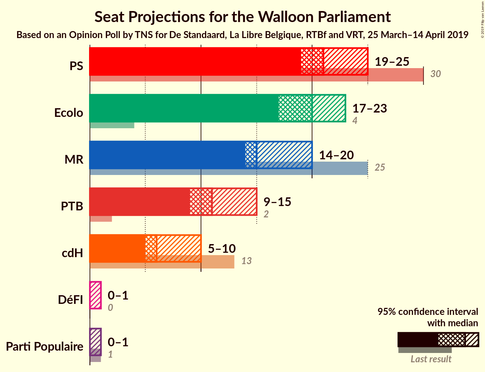

### Confidence Intervals

| Party | Last Result | Median | 80% Confidence Interval | 90% Confidence Interval | 95% Confidence Interval | 99% Confidence Interval |
|:-----:|:-----------:|:------:|:-----------------------:|:-----------------------:|:-----------------------:|:-----------------------:|
| <a href="#ps">PS</a> | 30 | 22 | 20–23 |20–24 |19–24 |18–26 |
| <a href="#ecolo">Ecolo</a> | 4 | 20 | 17–21 |17–22 |17–23 |17–24 |
| <a href="#mr">MR</a> | 25 | 15 | 14–18 |14–19 |14–20 |12–20 |
| <a href="#ptb">PTB</a> | 2 | 11 | 10–13 |10–14 |9–15 |9–15 |
| <a href="#cdh">cdH</a> | 13 | 6 | 5–9 |5–10 |5–10 |5–10 |
| <a href="#défi">DéFI</a> | 0 | 0 | 0–1 |0–1 |0–1 |0–2 |
| <a href="#parti-populaire">Parti Populaire</a> | 1 | 0 | 0 |0 |0–1 |0–2 |

### PS

*For a full overview of the results for this party, see the [PS](party-ps.html) page.*

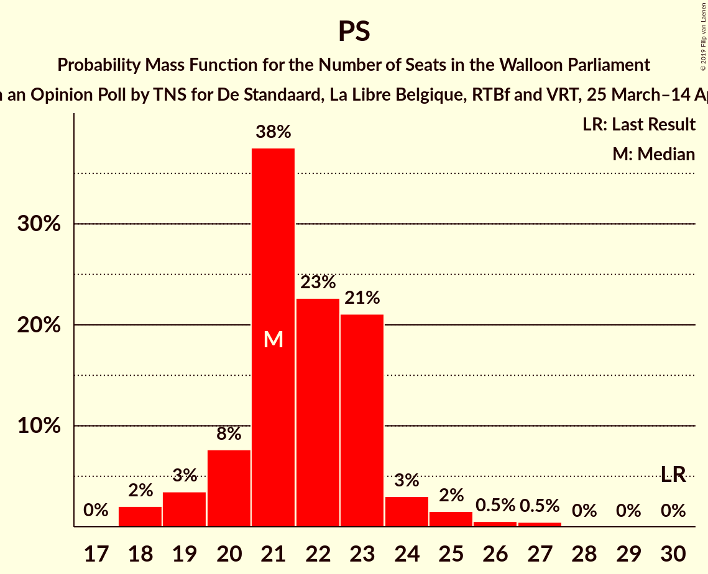

| Number of Seats | Probability | Accumulated | Special Marks |
|:---------------:|:-----------:|:-----------:|:-------------:|
| 18 | 2% | 100% |  |
| 19 | 3% | 98% |  |
| 20 | 7% | 95% |  |
| 21 | 38% | 88% |  |
| 22 | 22% | 51% | Median |
| 23 | 24% | 29% |  |
| 24 | 3% | 5% |  |
| 25 | 1.5% | 2% |  |
| 26 | 0.5% | 0.8% |  |
| 27 | 0.3% | 0.3% |  |
| 28 | 0% | 0% |  |
| 29 | 0% | 0% |  |
| 30 | 0% | 0% | Last Result |

### Ecolo

*For a full overview of the results for this party, see the [Ecolo](party-ecolo.html) page.*

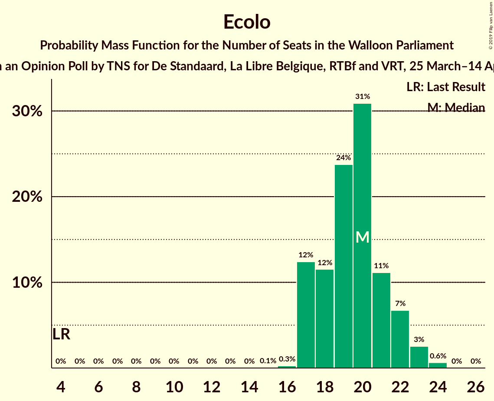

| Number of Seats | Probability | Accumulated | Special Marks |
|:---------------:|:-----------:|:-----------:|:-------------:|
| 4 | 0% | 100% | Last Result |
| 5 | 0% | 100% |  |
| 6 | 0% | 100% |  |
| 7 | 0% | 100% |  |
| 8 | 0% | 100% |  |
| 9 | 0% | 100% |  |
| 10 | 0% | 100% |  |
| 11 | 0% | 100% |  |
| 12 | 0% | 100% |  |
| 13 | 0% | 100% |  |
| 14 | 0% | 100% |  |
| 15 | 0.1% | 100% |  |
| 16 | 0.3% | 99.9% |  |
| 17 | 12% | 99.6% |  |
| 18 | 12% | 87% |  |
| 19 | 24% | 76% |  |
| 20 | 31% | 52% | Median |
| 21 | 11% | 21% |  |
| 22 | 7% | 10% |  |
| 23 | 3% | 3% |  |
| 24 | 0.6% | 0.6% |  |
| 25 | 0% | 0% |  |

### MR

*For a full overview of the results for this party, see the [MR](party-mr.html) page.*

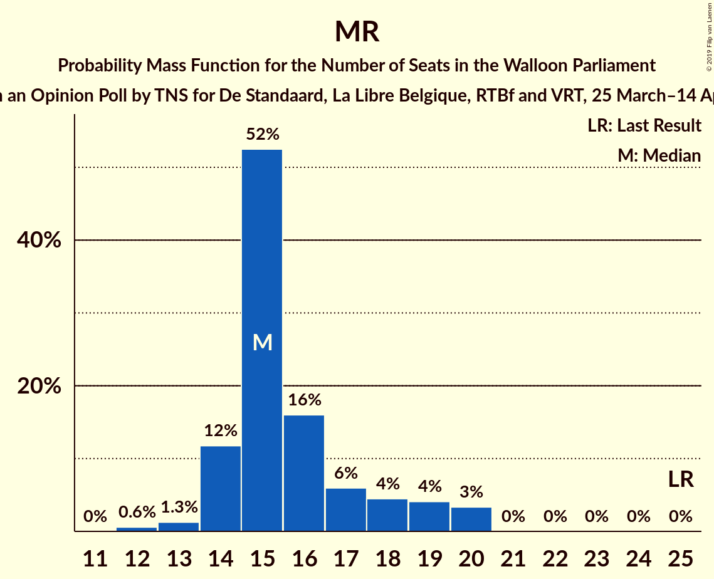

| Number of Seats | Probability | Accumulated | Special Marks |
|:---------------:|:-----------:|:-----------:|:-------------:|
| 12 | 0.6% | 100% |  |
| 13 | 1.3% | 99.4% |  |
| 14 | 12% | 98% |  |
| 15 | 52% | 86% | Median |
| 16 | 16% | 34% |  |
| 17 | 6% | 18% |  |
| 18 | 4% | 12% |  |
| 19 | 4% | 7% |  |
| 20 | 3% | 3% |  |
| 21 | 0% | 0% |  |
| 22 | 0% | 0% |  |
| 23 | 0% | 0% |  |
| 24 | 0% | 0% |  |
| 25 | 0% | 0% | Last Result |

### PTB

*For a full overview of the results for this party, see the [PTB](party-ptb.html) page.*

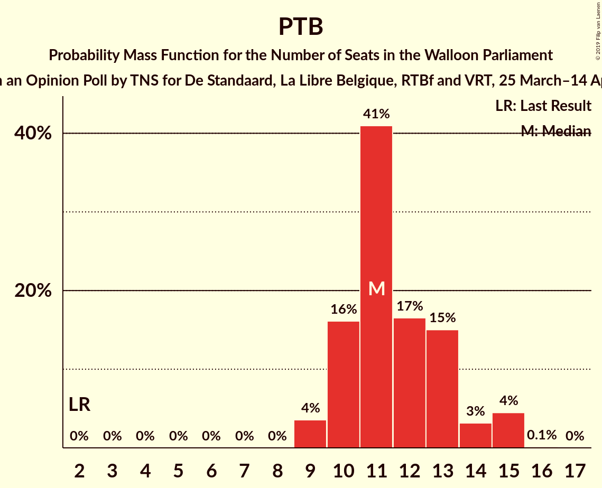

| Number of Seats | Probability | Accumulated | Special Marks |
|:---------------:|:-----------:|:-----------:|:-------------:|
| 2 | 0% | 100% | Last Result |
| 3 | 0% | 100% |  |
| 4 | 0% | 100% |  |
| 5 | 0% | 100% |  |
| 6 | 0% | 100% |  |
| 7 | 0% | 100% |  |
| 8 | 0% | 100% |  |
| 9 | 4% | 100% |  |
| 10 | 16% | 96% |  |
| 11 | 41% | 80% | Median |
| 12 | 17% | 39% |  |
| 13 | 15% | 23% |  |
| 14 | 3% | 8% |  |
| 15 | 4% | 5% |  |
| 16 | 0.1% | 0.2% |  |
| 17 | 0% | 0% |  |

### cdH

*For a full overview of the results for this party, see the [cdH](party-cdh.html) page.*

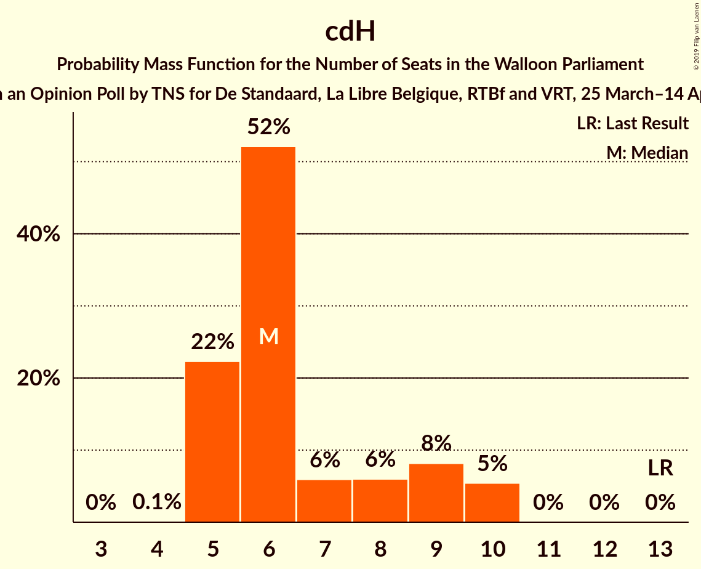

| Number of Seats | Probability | Accumulated | Special Marks |
|:---------------:|:-----------:|:-----------:|:-------------:|
| 4 | 0.1% | 100% |  |
| 5 | 22% | 99.9% |  |
| 6 | 52% | 78% | Median |
| 7 | 6% | 26% |  |
| 8 | 6% | 20% |  |
| 9 | 8% | 14% |  |
| 10 | 5% | 5% |  |
| 11 | 0% | 0% |  |
| 12 | 0% | 0% |  |
| 13 | 0% | 0% | Last Result |

### DéFI

*For a full overview of the results for this party, see the [DéFI](party-défi.html) page.*

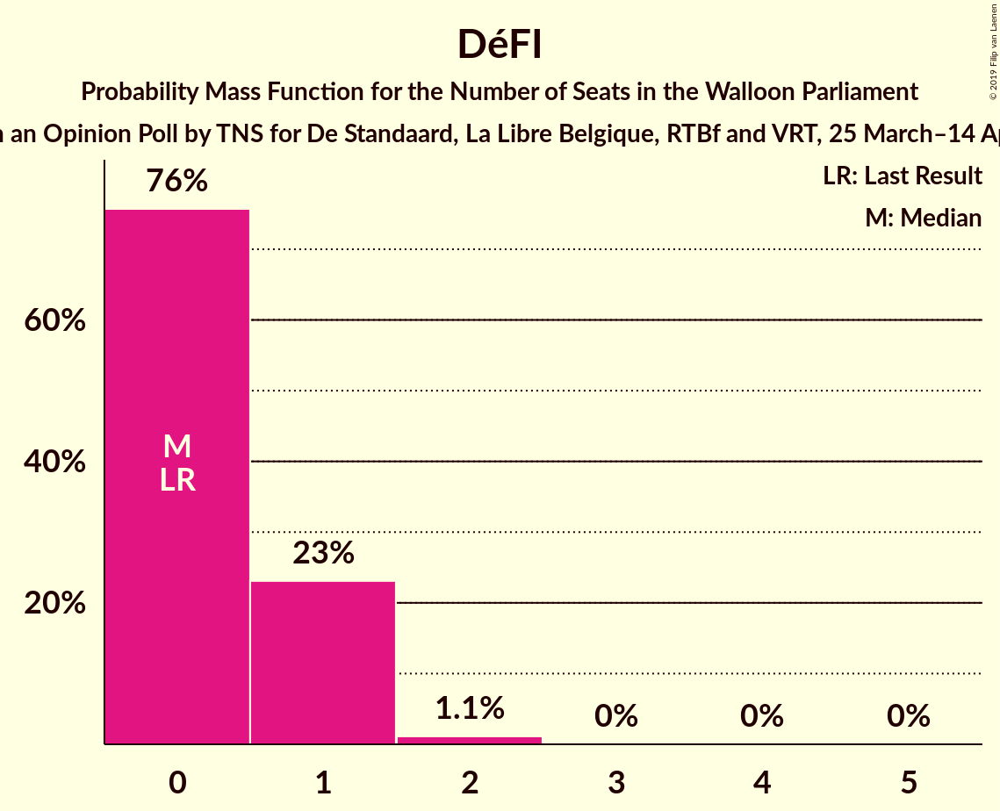

| Number of Seats | Probability | Accumulated | Special Marks |
|:---------------:|:-----------:|:-----------:|:-------------:|
| 0 | 76% | 100% | Last Result, Median |
| 1 | 23% | 24% |  |
| 2 | 1.1% | 1.2% |  |
| 3 | 0% | 0.1% |  |
| 4 | 0% | 0% |  |

### Parti Populaire

*For a full overview of the results for this party, see the [Parti Populaire](party-partipopulaire.html) page.*

| Number of Seats | Probability | Accumulated | Special Marks |
|:---------------:|:-----------:|:-----------:|:-------------:|
| 0 | 97% | 100% | Median |
| 1 | 2% | 3% | Last Result |
| 2 | 0.9% | 0.9% |  |
| 3 | 0% | 0% |  |

## Coalitions

### Confidence Intervals

| Coalition | Last Result | Median | Majority? | 80% Confidence Interval | 90% Confidence Interval | 95% Confidence Interval | 99% Confidence Interval |
|:---------:|:-----------:|:------:|:---------:|:-----------------------:|:-----------------------:|:-----------------------:|:-----------------------:|
| PS – Ecolo – MR | 59 | 57 | 100% | 54–59 | 54–59 | 53–60 | 52–60 |
| PS – Ecolo – PTB | 36 | 53 | 100% | 50–55 | 49–55 | 49–56 | 48–56 |
| PS – Ecolo – cdH | 47 | 48 | 100% | 45–50 | 44–50 | 44–51 | 43–52 |
| Ecolo – MR – cdH | 42 | 42 | 99.0% | 39–44 | 39–44 | 38–45 | 37–45 |
| PS – Ecolo | 34 | 41 | 98% | 39–43 | 38–44 | 38–45 | 36–45 |
| PS – PTB – cdH | 45 | 40 | 89% | 37–42 | 37–42 | 36–43 | 36–44 |
| PS – MR | 55 | 37 | 42% | 35–40 | 35–41 | 34–41 | 33–42 |
| Ecolo – MR | 29 | 35 | 8% | 33–37 | 32–38 | 32–38 | 31–39 |
| PS – PTB | 32 | 33 | 0.8% | 31–35 | 31–36 | 30–36 | 29–38 |
| Ecolo – PTB | 6 | 31 | 0% | 29–33 | 28–34 | 28–34 | 27–35 |
| PS – cdH | 43 | 28 | 0% | 26–30 | 26–31 | 25–32 | 24–33 |
| MR – cdH | 38 | 22 | 0% | 20–25 | 19–25 | 19–26 | 18–27 |

### PS – Ecolo – MR

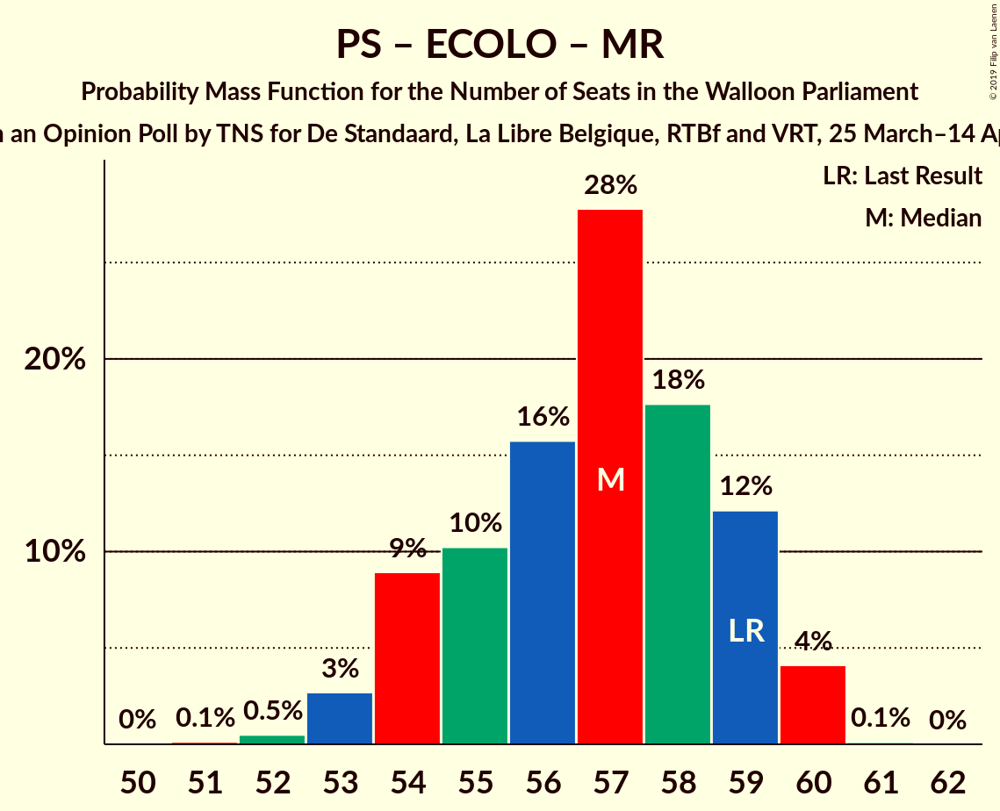

| Number of Seats | Probability | Accumulated | Special Marks |
|:---------------:|:-----------:|:-----------:|:-------------:|
| 51 | 0.1% | 100% |  |
| 52 | 0.5% | 99.8% |  |
| 53 | 3% | 99.4% |  |
| 54 | 9% | 97% |  |
| 55 | 10% | 88% |  |
| 56 | 16% | 78% |  |
| 57 | 28% | 62% | Median |
| 58 | 18% | 34% |  |
| 59 | 12% | 16% | Last Result |
| 60 | 4% | 4% |  |
| 61 | 0.1% | 0.1% |  |
| 62 | 0% | 0% |  |

### PS – Ecolo – PTB

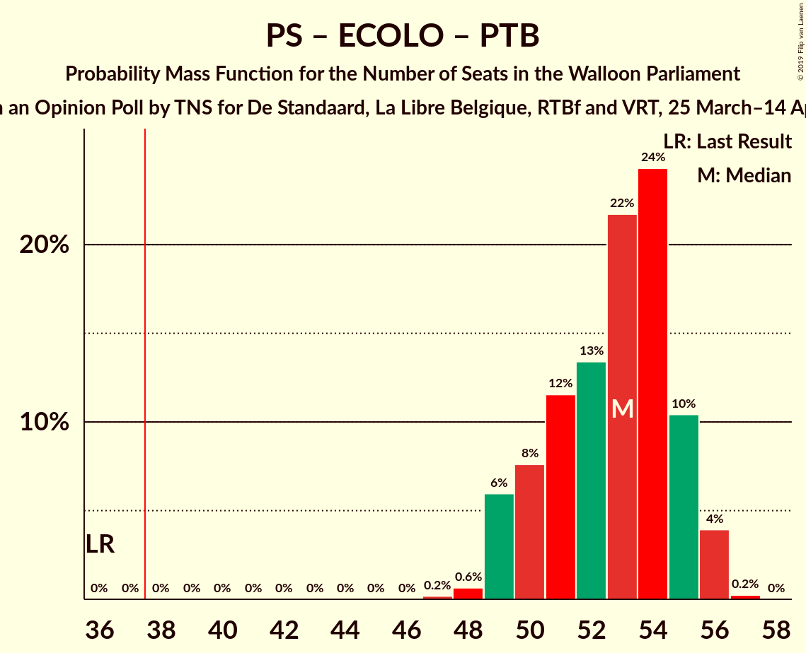

| Number of Seats | Probability | Accumulated | Special Marks |
|:---------------:|:-----------:|:-----------:|:-------------:|
| 36 | 0% | 100% | Last Result |
| 37 | 0% | 100% |  |
| 38 | 0% | 100% | Majority |
| 39 | 0% | 100% |  |
| 40 | 0% | 100% |  |
| 41 | 0% | 100% |  |
| 42 | 0% | 100% |  |
| 43 | 0% | 100% |  |
| 44 | 0% | 100% |  |
| 45 | 0% | 100% |  |
| 46 | 0% | 100% |  |
| 47 | 0.2% | 100% |  |
| 48 | 0.6% | 99.8% |  |
| 49 | 6% | 99.2% |  |
| 50 | 8% | 93% |  |
| 51 | 12% | 86% |  |
| 52 | 13% | 74% |  |
| 53 | 22% | 61% | Median |
| 54 | 24% | 39% |  |
| 55 | 10% | 15% |  |
| 56 | 4% | 4% |  |
| 57 | 0.2% | 0.3% |  |
| 58 | 0% | 0% |  |

### PS – Ecolo – cdH

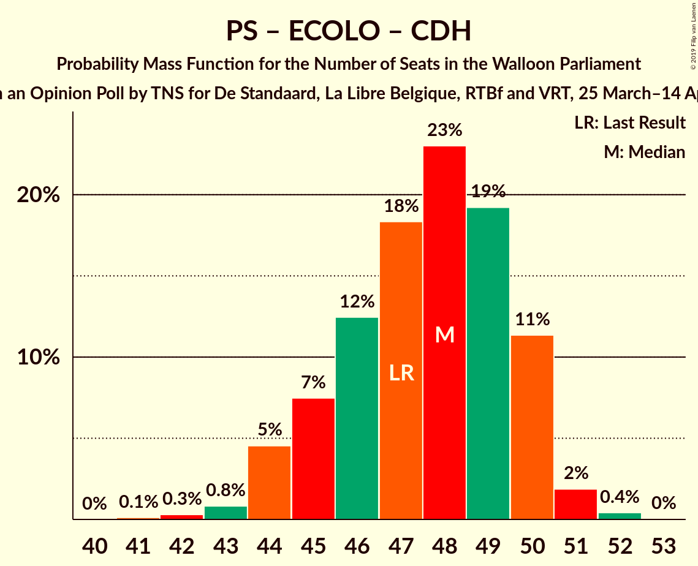

| Number of Seats | Probability | Accumulated | Special Marks |
|:---------------:|:-----------:|:-----------:|:-------------:|
| 41 | 0.1% | 100% |  |
| 42 | 0.3% | 99.9% |  |
| 43 | 0.7% | 99.6% |  |
| 44 | 6% | 98.9% |  |
| 45 | 7% | 93% |  |
| 46 | 11% | 87% |  |
| 47 | 19% | 76% | Last Result |
| 48 | 24% | 57% | Median |
| 49 | 19% | 33% |  |
| 50 | 11% | 14% |  |
| 51 | 2% | 3% |  |
| 52 | 0.5% | 0.5% |  |
| 53 | 0% | 0% |  |

### Ecolo – MR – cdH

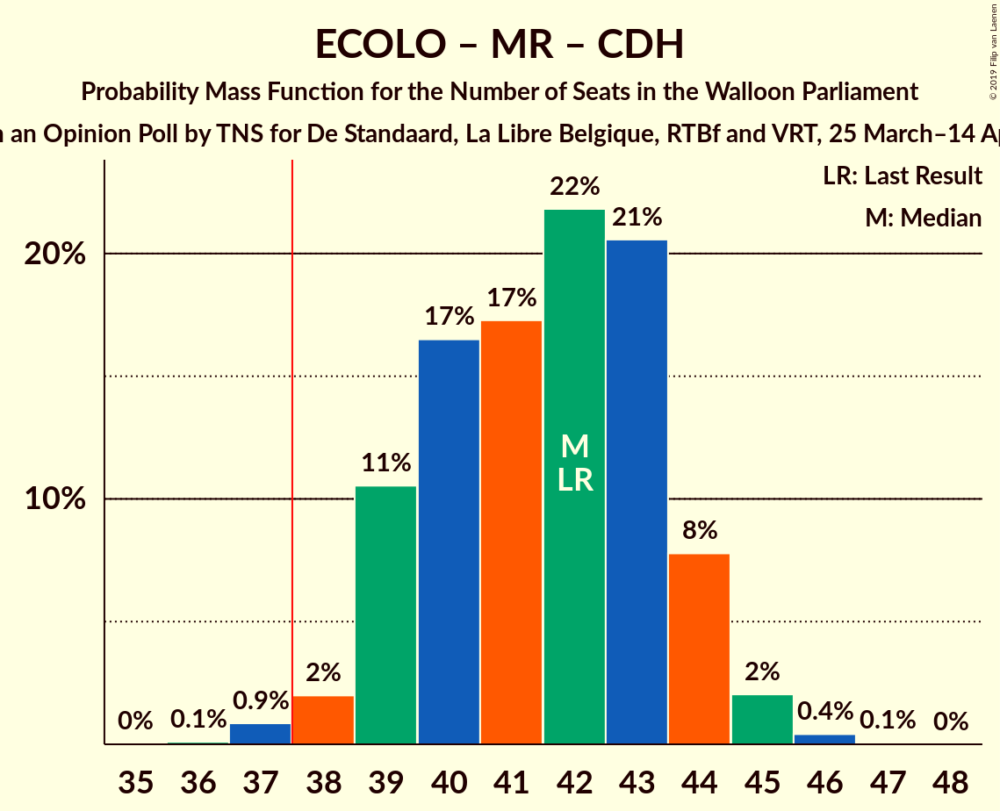

| Number of Seats | Probability | Accumulated | Special Marks |
|:---------------:|:-----------:|:-----------:|:-------------:|
| 36 | 0.1% | 100% |  |
| 37 | 0.9% | 99.9% |  |
| 38 | 2% | 99.0% | Majority |
| 39 | 11% | 97% |  |
| 40 | 17% | 86% |  |
| 41 | 17% | 70% | Median |
| 42 | 22% | 53% | Last Result |
| 43 | 21% | 31% |  |
| 44 | 8% | 10% |  |
| 45 | 2% | 3% |  |
| 46 | 0.4% | 0.5% |  |
| 47 | 0.1% | 0.1% |  |
| 48 | 0% | 0% |  |

### PS – Ecolo

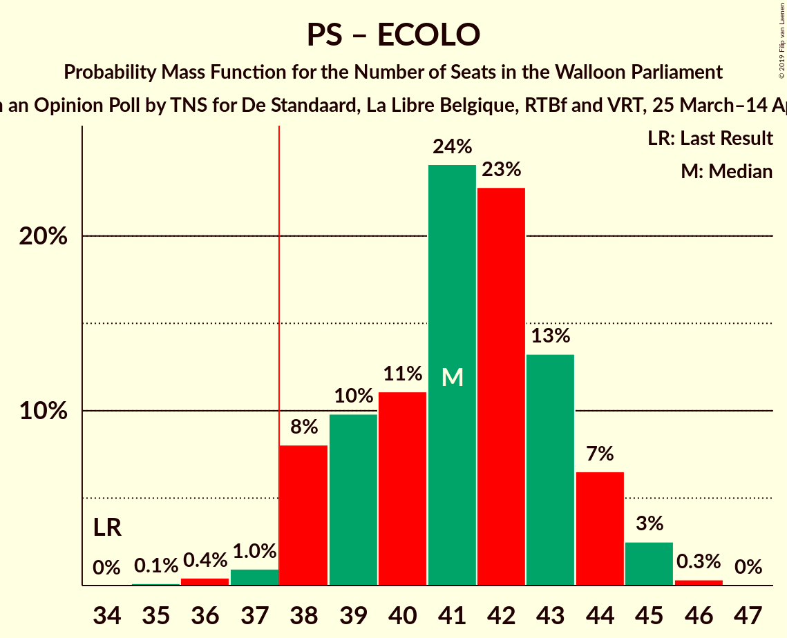

| Number of Seats | Probability | Accumulated | Special Marks |
|:---------------:|:-----------:|:-----------:|:-------------:|
| 34 | 0% | 100% | Last Result |
| 35 | 0.1% | 100% |  |
| 36 | 0.4% | 99.9% |  |
| 37 | 1.0% | 99.4% |  |
| 38 | 8% | 98% | Majority |
| 39 | 10% | 90% |  |
| 40 | 11% | 81% |  |
| 41 | 24% | 70% |  |
| 42 | 23% | 45% | Median |
| 43 | 13% | 23% |  |
| 44 | 7% | 9% |  |
| 45 | 3% | 3% |  |
| 46 | 0.3% | 0.4% |  |
| 47 | 0% | 0% |  |

### PS – PTB – cdH

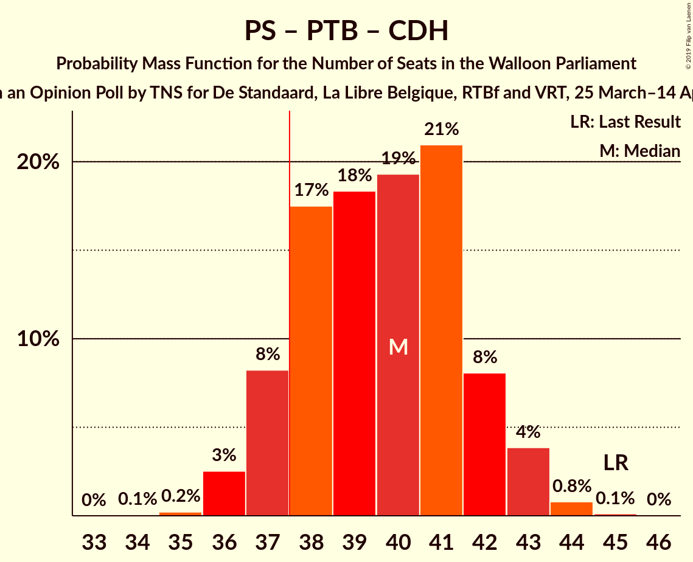

| Number of Seats | Probability | Accumulated | Special Marks |
|:---------------:|:-----------:|:-----------:|:-------------:|
| 34 | 0.1% | 100% |  |
| 35 | 0.2% | 99.9% |  |
| 36 | 3% | 99.7% |  |
| 37 | 8% | 97% |  |
| 38 | 17% | 89% | Majority |
| 39 | 18% | 71% | Median |
| 40 | 19% | 53% |  |
| 41 | 21% | 34% |  |
| 42 | 8% | 13% |  |
| 43 | 4% | 5% |  |
| 44 | 0.8% | 0.9% |  |
| 45 | 0.1% | 0.1% | Last Result |
| 46 | 0% | 0% |  |

### PS – MR

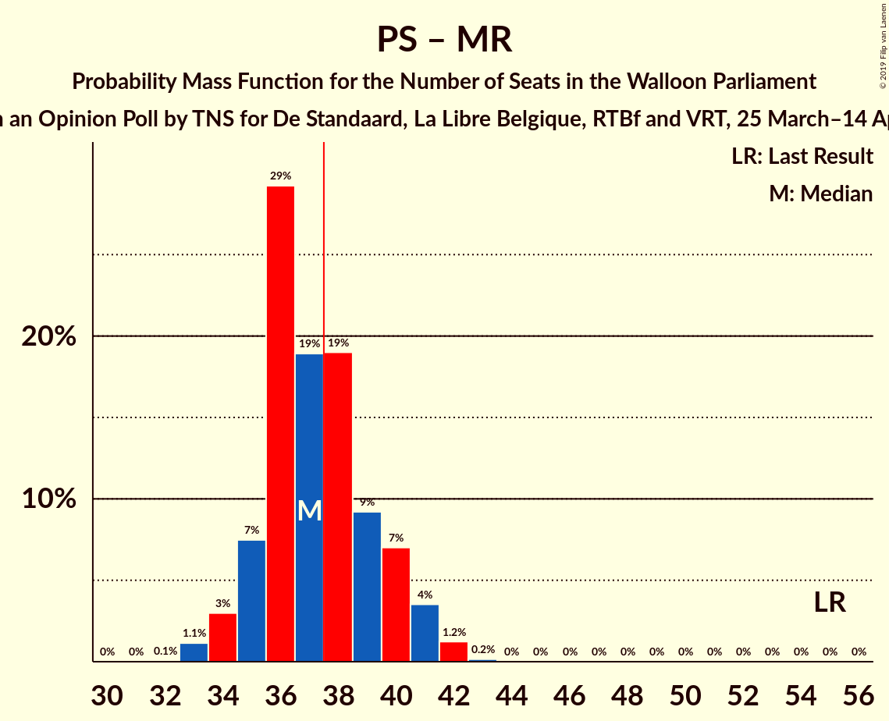

| Number of Seats | Probability | Accumulated | Special Marks |
|:---------------:|:-----------:|:-----------:|:-------------:|
| 32 | 0.1% | 100% |  |
| 33 | 1.1% | 99.9% |  |
| 34 | 3% | 98.8% |  |
| 35 | 6% | 96% |  |
| 36 | 27% | 90% |  |
| 37 | 21% | 62% | Median |
| 38 | 21% | 42% | Majority |
| 39 | 8% | 21% |  |
| 40 | 7% | 12% |  |
| 41 | 4% | 5% |  |
| 42 | 1.1% | 1.3% |  |
| 43 | 0.1% | 0.1% |  |
| 44 | 0% | 0% |  |
| 45 | 0% | 0% |  |
| 46 | 0% | 0% |  |
| 47 | 0% | 0% |  |
| 48 | 0% | 0% |  |
| 49 | 0% | 0% |  |
| 50 | 0% | 0% |  |
| 51 | 0% | 0% |  |
| 52 | 0% | 0% |  |
| 53 | 0% | 0% |  |
| 54 | 0% | 0% |  |
| 55 | 0% | 0% | Last Result |

### Ecolo – MR

| Number of Seats | Probability | Accumulated | Special Marks |
|:---------------:|:-----------:|:-----------:|:-------------:|
| 29 | 0% | 100% | Last Result |
| 30 | 0.2% | 100% |  |
| 31 | 0.9% | 99.8% |  |
| 32 | 5% | 98.9% |  |
| 33 | 11% | 94% |  |
| 34 | 23% | 84% |  |
| 35 | 22% | 61% | Median |
| 36 | 17% | 39% |  |
| 37 | 14% | 22% |  |
| 38 | 6% | 8% | Majority |
| 39 | 2% | 2% |  |
| 40 | 0.1% | 0.2% |  |
| 41 | 0% | 0% |  |

### PS – PTB

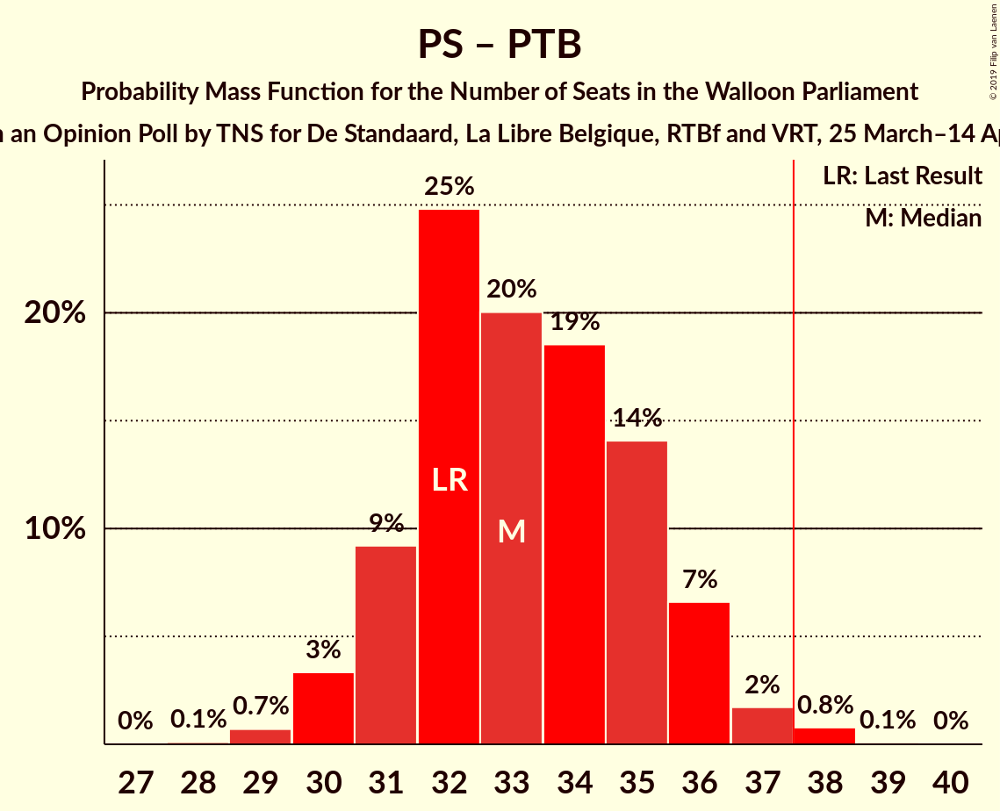

| Number of Seats | Probability | Accumulated | Special Marks |
|:---------------:|:-----------:|:-----------:|:-------------:|
| 28 | 0.1% | 100% |  |
| 29 | 0.6% | 99.9% |  |
| 30 | 3% | 99.3% |  |
| 31 | 9% | 96% |  |
| 32 | 28% | 88% | Last Result |
| 33 | 20% | 60% | Median |
| 34 | 15% | 40% |  |
| 35 | 16% | 25% |  |
| 36 | 7% | 9% |  |
| 37 | 2% | 2% |  |
| 38 | 0.7% | 0.8% | Majority |
| 39 | 0.1% | 0.1% |  |
| 40 | 0% | 0% |  |

### Ecolo – PTB

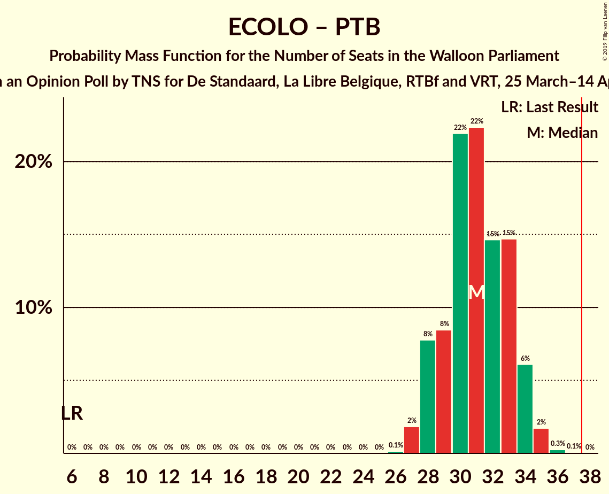

| Number of Seats | Probability | Accumulated | Special Marks |
|:---------------:|:-----------:|:-----------:|:-------------:|
| 6 | 0% | 100% | Last Result |
| 7 | 0% | 100% |  |
| 8 | 0% | 100% |  |
| 9 | 0% | 100% |  |
| 10 | 0% | 100% |  |
| 11 | 0% | 100% |  |
| 12 | 0% | 100% |  |
| 13 | 0% | 100% |  |
| 14 | 0% | 100% |  |
| 15 | 0% | 100% |  |
| 16 | 0% | 100% |  |
| 17 | 0% | 100% |  |
| 18 | 0% | 100% |  |
| 19 | 0% | 100% |  |
| 20 | 0% | 100% |  |
| 21 | 0% | 100% |  |
| 22 | 0% | 100% |  |
| 23 | 0% | 100% |  |
| 24 | 0% | 100% |  |
| 25 | 0% | 100% |  |
| 26 | 0.1% | 100% |  |
| 27 | 2% | 99.8% |  |
| 28 | 8% | 98% |  |
| 29 | 8% | 90% |  |
| 30 | 22% | 82% |  |
| 31 | 22% | 60% | Median |
| 32 | 15% | 37% |  |
| 33 | 15% | 23% |  |
| 34 | 6% | 8% |  |
| 35 | 2% | 2% |  |
| 36 | 0.3% | 0.3% |  |
| 37 | 0.1% | 0.1% |  |
| 38 | 0% | 0% | Majority |

### PS – cdH

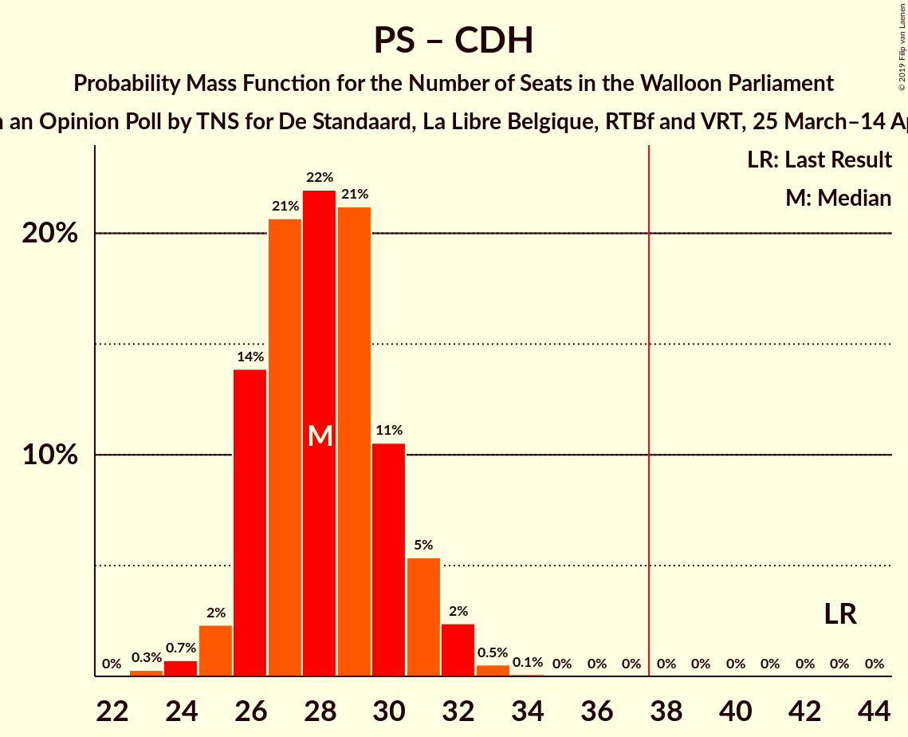

| Number of Seats | Probability | Accumulated | Special Marks |
|:---------------:|:-----------:|:-----------:|:-------------:|
| 23 | 0.3% | 100% |  |
| 24 | 0.7% | 99.7% |  |
| 25 | 2% | 99.0% |  |
| 26 | 14% | 97% |  |
| 27 | 21% | 83% |  |
| 28 | 22% | 62% | Median |
| 29 | 21% | 40% |  |
| 30 | 11% | 19% |  |
| 31 | 5% | 8% |  |
| 32 | 2% | 3% |  |
| 33 | 0.5% | 0.6% |  |
| 34 | 0.1% | 0.1% |  |
| 35 | 0% | 0% |  |
| 36 | 0% | 0% |  |
| 37 | 0% | 0% |  |
| 38 | 0% | 0% | Majority |
| 39 | 0% | 0% |  |
| 40 | 0% | 0% |  |
| 41 | 0% | 0% |  |
| 42 | 0% | 0% |  |
| 43 | 0% | 0% | Last Result |

### MR – cdH

| Number of Seats | Probability | Accumulated | Special Marks |
|:---------------:|:-----------:|:-----------:|:-------------:|
| 17 | 0% | 100% |  |
| 18 | 0.5% | 99.9% |  |
| 19 | 5% | 99.4% |  |
| 20 | 14% | 95% |  |
| 21 | 29% | 81% | Median |
| 22 | 19% | 52% |  |
| 23 | 10% | 33% |  |
| 24 | 11% | 23% |  |
| 25 | 8% | 12% |  |
| 26 | 4% | 4% |  |
| 27 | 0.5% | 0.6% |  |
| 28 | 0.1% | 0.1% |  |
| 29 | 0% | 0% |  |
| 30 | 0% | 0% |  |
| 31 | 0% | 0% |  |
| 32 | 0% | 0% |  |
| 33 | 0% | 0% |  |
| 34 | 0% | 0% |  |
| 35 | 0% | 0% |  |
| 36 | 0% | 0% |  |
| 37 | 0% | 0% |  |
| 38 | 0% | 0% | Last Result, Majority |

## Technical Information

### Opinion Poll

+ **Polling firm:** TNS
+ **Commissioner(s):** De Standaard, La Libre Belgique, RTBf and VRT
+ **Fieldwork period:** 25 March–14 April 2019

### Calculations

+ **Sample size:** 1004
+ **Simulations done:** 524,288
+ **Error estimate:** 0.99%

