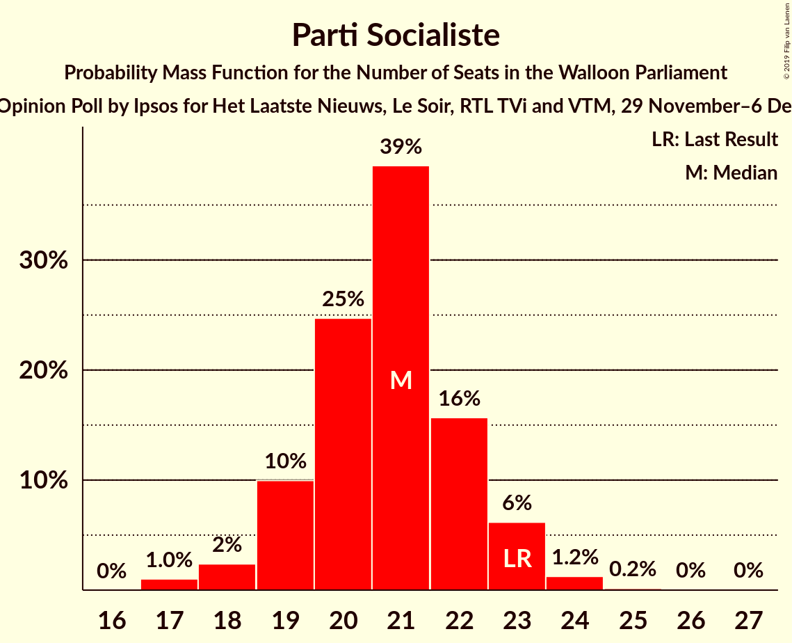
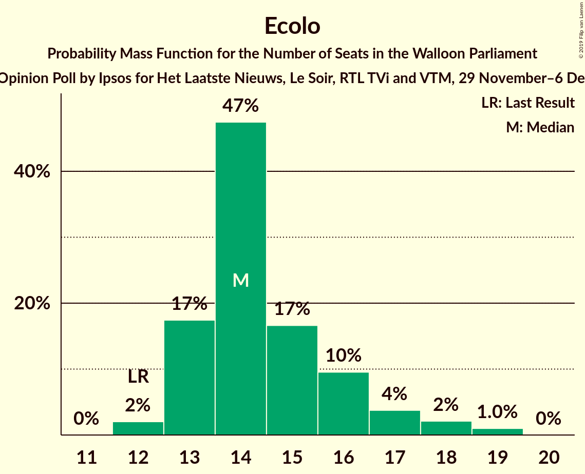
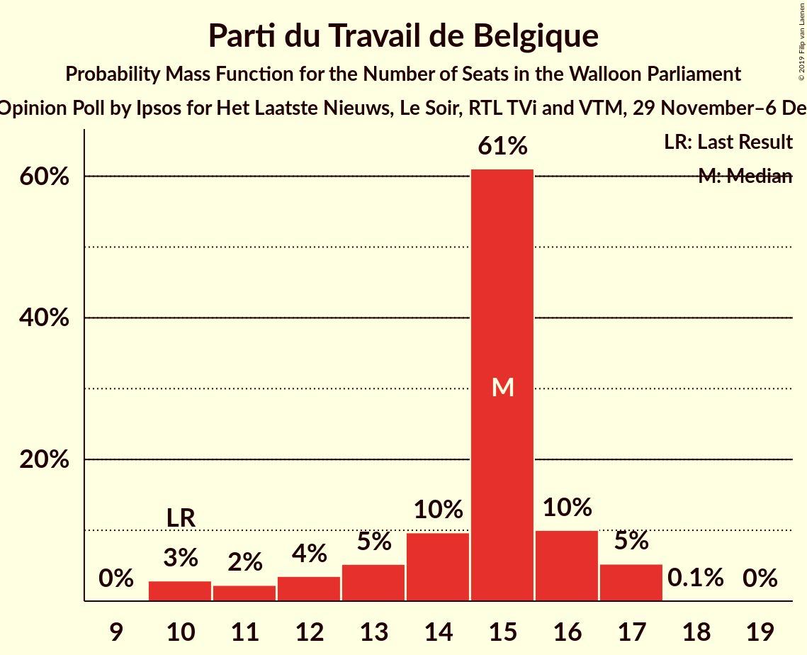
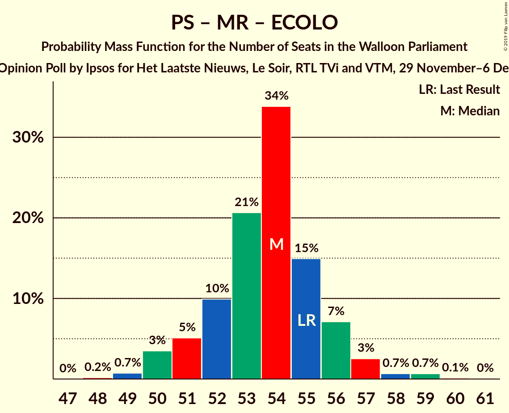
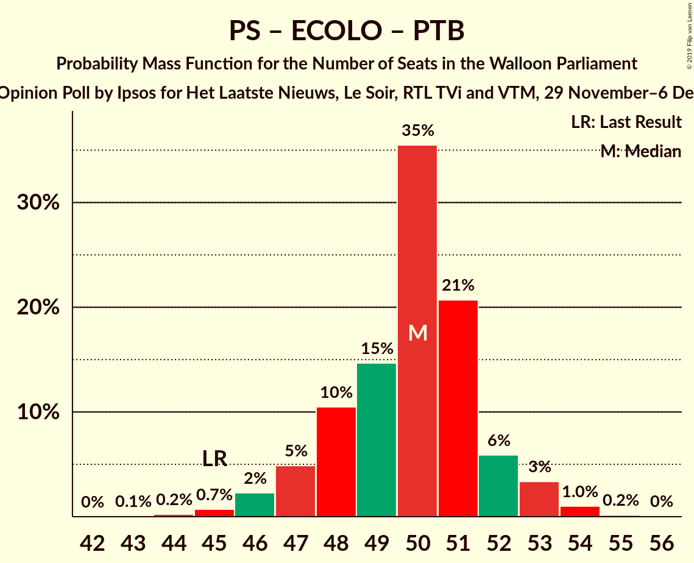
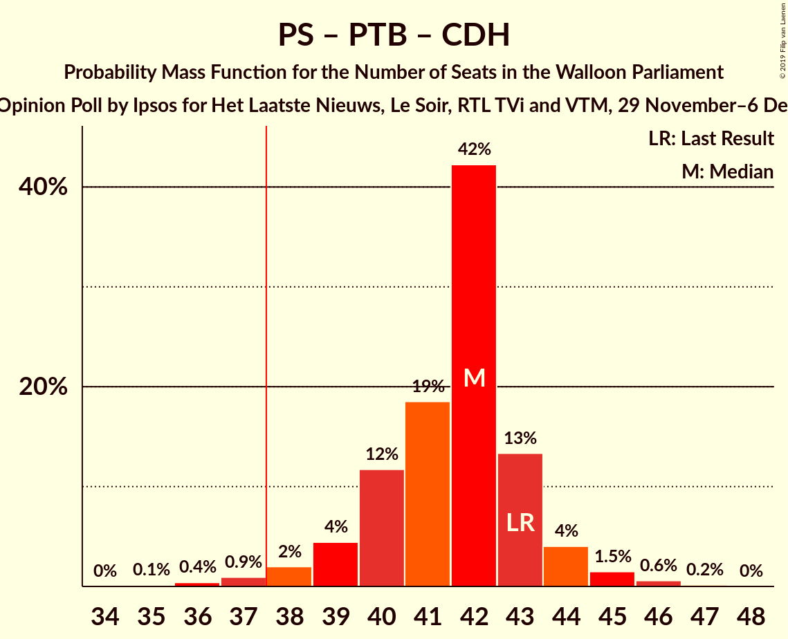
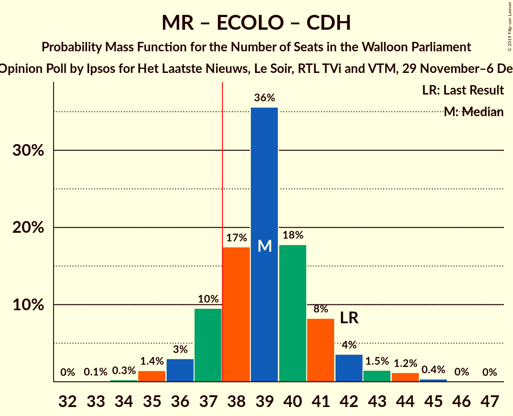

# Opinion Poll by Ipsos for Het Laatste Nieuws, Le Soir, RTL TVi and VTM, 29 November–6 December 2019

<a href="#voting-intentions">Voting Intentions</a> | <a href="#seats">Seats</a> | <a href="#coalitions">Coalitions</a> | <a href="#technical-information">Technical Information</a>

## Voting Intentions

### Confidence Intervals

| Party | Last Result | Poll Result | 80% Confidence Interval | 90% Confidence Interval | 95% Confidence Interval | 99% Confidence Interval |
|:-----:|:-----------:|:-----------:|:-----------------------:|:-----------------------:|:-----------------------:|:-----------------------:|
| Parti Socialiste | 26.2% | 23.8% | 22.1–25.6% |21.6–26.1% |21.2–26.6% |20.5–27.5% |
| Mouvement Réformateur | 21.4% | 20.5% | 19.0–22.3% |18.5–22.8% |18.1–23.2% |17.4–24.0% |
| Ecolo | 14.5% | 17.2% | 15.7–18.8% |15.3–19.3% |15.0–19.7% |14.3–20.5% |
| Parti du Travail de Belgique | 13.7% | 16.5% | 15.0–18.1% |14.6–18.5% |14.3–18.9% |13.6–19.7% |
| Centre démocrate humaniste | 11.0% | 8.9% | 7.8–10.1% |7.5–10.5% |7.2–10.8% |6.8–11.4% |
| DéFI | 4.1% | 4.7% | 3.9–5.7% |3.7–5.9% |3.5–6.2% |3.2–6.7% |

*Note:* The poll result column reflects the actual value used in the calculations. Published results may vary slightly, and in addition be rounded to fewer digits.

## Seats

### Confidence Intervals

| Party | Last Result | Median | 80% Confidence Interval | 90% Confidence Interval | 95% Confidence Interval | 99% Confidence Interval |
|:-----:|:-----------:|:------:|:-----------------------:|:-----------------------:|:-----------------------:|:-----------------------:|
| <a href="#parti-socialiste">Parti Socialiste</a> | 23 | 21 | 19–22 |19–23 |18–23 |17–24 |
| <a href="#mouvement-réformateur">Mouvement Réformateur</a> | 20 | 19 | 17–20 |16–21 |15–21 |15–21 |
| <a href="#ecolo">Ecolo</a> | 12 | 14 | 13–16 |13–17 |13–18 |12–19 |
| <a href="#parti-du-travail-de-belgique">Parti du Travail de Belgique</a> | 10 | 15 | 12–16 |11–16 |11–17 |10–17 |
| <a href="#centre-démocrate-humaniste">Centre démocrate humaniste</a> | 10 | 6 | 5–8 |5–8 |4–9 |4–10 |
| <a href="#défi">DéFI</a> | 0 | 0 | 0–3 |0–4 |0–4 |0–4 |

### Parti Socialiste

*For a full overview of the results for this party, see the [Parti Socialiste](party-partisocialiste.html) page.*

| Number of Seats | Probability | Accumulated | Special Marks |
|:---------------:|:-----------:|:-----------:|:-------------:|
| 17 | 1.0% | 100% |  |
| 18 | 3% | 99.0% |  |
| 19 | 13% | 96% |  |
| 20 | 23% | 83% |  |
| 21 | 33% | 60% | Median |
| 22 | 19% | 27% |  |
| 23 | 6% | 8% | Last Result |
| 24 | 1.4% | 2% |  |
| 25 | 0.1% | 0.2% |  |
| 26 | 0.1% | 0.1% |  |
| 27 | 0% | 0% |  |

### Mouvement Réformateur

*For a full overview of the results for this party, see the [Mouvement Réformateur](party-mouvementréformateur.html) page.*

| Number of Seats | Probability | Accumulated | Special Marks |
|:---------------:|:-----------:|:-----------:|:-------------:|
| 14 | 0.4% | 100% |  |
| 15 | 2% | 99.6% |  |
| 16 | 4% | 97% |  |
| 17 | 9% | 93% |  |
| 18 | 34% | 84% |  |
| 19 | 31% | 50% | Median |
| 20 | 11% | 20% | Last Result |
| 21 | 9% | 9% |  |
| 22 | 0.1% | 0.2% |  |
| 23 | 0% | 0% |  |

### Ecolo

*For a full overview of the results for this party, see the [Ecolo](party-ecolo.html) page.*

| Number of Seats | Probability | Accumulated | Special Marks |
|:---------------:|:-----------:|:-----------:|:-------------:|
| 12 | 2% | 100% | Last Result |
| 13 | 16% | 98% |  |
| 14 | 45% | 82% | Median |
| 15 | 20% | 37% |  |
| 16 | 10% | 16% |  |
| 17 | 4% | 6% |  |
| 18 | 2% | 3% |  |
| 19 | 0.8% | 0.8% |  |
| 20 | 0% | 0% |  |

### Parti du Travail de Belgique

*For a full overview of the results for this party, see the [Parti du Travail de Belgique](party-partidutravaildebelgique.html) page.*

| Number of Seats | Probability | Accumulated | Special Marks |
|:---------------:|:-----------:|:-----------:|:-------------:|
| 10 | 2% | 100% | Last Result |
| 11 | 4% | 98% |  |
| 12 | 5% | 94% |  |
| 13 | 6% | 89% |  |
| 14 | 10% | 82% |  |
| 15 | 51% | 72% | Median |
| 16 | 17% | 21% |  |
| 17 | 4% | 4% |  |
| 18 | 0.1% | 0.1% |  |
| 19 | 0% | 0% |  |

### Centre démocrate humaniste

*For a full overview of the results for this party, see the [Centre démocrate humaniste](party-centredémocratehumaniste.html) page.*

| Number of Seats | Probability | Accumulated | Special Marks |
|:---------------:|:-----------:|:-----------:|:-------------:|
| 3 | 0.1% | 100% |  |
| 4 | 4% | 99.9% |  |
| 5 | 15% | 96% |  |
| 6 | 55% | 80% | Median |
| 7 | 14% | 26% |  |
| 8 | 9% | 12% |  |
| 9 | 1.1% | 3% |  |
| 10 | 1.4% | 1.4% | Last Result |
| 11 | 0.1% | 0.1% |  |
| 12 | 0% | 0% |  |

### DéFI

*For a full overview of the results for this party, see the [DéFI](party-défi.html) page.*

| Number of Seats | Probability | Accumulated | Special Marks |
|:---------------:|:-----------:|:-----------:|:-------------:|
| 0 | 79% | 100% | Last Result, Median |
| 1 | 7% | 21% |  |
| 2 | 3% | 14% |  |
| 3 | 4% | 11% |  |
| 4 | 6% | 6% |  |
| 5 | 0.4% | 0.4% |  |
| 6 | 0% | 0% |  |

## Coalitions

### Confidence Intervals

| Coalition | Last Result | Median | Majority? | 80% Confidence Interval | 90% Confidence Interval | 95% Confidence Interval | 99% Confidence Interval |
|:---------:|:-----------:|:------:|:---------:|:-----------------------:|:-----------------------:|:-----------------------:|:-----------------------:|
| Parti Socialiste – Mouvement Réformateur – Ecolo | 55 | 54 | 100% | 52–56 | 51–57 | 50–57 | 49–59 |
| Parti Socialiste – Ecolo – Parti du Travail de Belgique | 45 | 50 | 100% | 48–51 | 47–52 | 46–53 | 45–54 |
| Parti Socialiste – Ecolo – Centre démocrate humaniste | 45 | 41 | 99.3% | 39–44 | 39–45 | 38–46 | 37–46 |
| Parti Socialiste – Parti du Travail de Belgique – Centre démocrate humaniste | 43 | 42 | 99.4% | 40–43 | 39–44 | 38–45 | 37–46 |
| Mouvement Réformateur – Ecolo – Centre démocrate humaniste | 42 | 39 | 87% | 37–41 | 37–42 | 36–42 | 35–44 |
| Parti Socialiste – Mouvement Réformateur | 43 | 39 | 84% | 37–41 | 37–42 | 36–42 | 35–43 |
| Parti Socialiste – Ecolo | 35 | 35 | 9% | 33–37 | 33–38 | 32–38 | 31–40 |
| Parti Socialiste – Parti du Travail de Belgique | 33 | 36 | 6% | 33–37 | 32–38 | 32–38 | 31–39 |
| Mouvement Réformateur – Ecolo | 32 | 33 | 0.3% | 31–35 | 30–35 | 30–36 | 29–37 |
| Ecolo – Parti du Travail de Belgique | 22 | 29 | 0% | 27–31 | 25–32 | 25–32 | 24–33 |
| Parti Socialiste – Centre démocrate humaniste | 33 | 27 | 0% | 25–29 | 25–30 | 24–31 | 23–32 |
| Mouvement Réformateur – Centre démocrate humaniste | 30 | 25 | 0% | 23–27 | 22–27 | 22–28 | 21–29 |

### Parti Socialiste – Mouvement Réformateur – Ecolo

| Number of Seats | Probability | Accumulated | Special Marks |
|:---------------:|:-----------:|:-----------:|:-------------:|
| 48 | 0.2% | 100% |  |
| 49 | 0.7% | 99.8% |  |
| 50 | 3% | 99.1% |  |
| 51 | 5% | 96% |  |
| 52 | 9% | 91% |  |
| 53 | 27% | 82% |  |
| 54 | 28% | 55% | Median |
| 55 | 14% | 27% | Last Result |
| 56 | 8% | 13% |  |
| 57 | 4% | 5% |  |
| 58 | 1.0% | 2% |  |
| 59 | 0.4% | 0.6% |  |
| 60 | 0.1% | 0.2% |  |
| 61 | 0% | 0% |  |

### Parti Socialiste – Ecolo – Parti du Travail de Belgique

| Number of Seats | Probability | Accumulated | Special Marks |
|:---------------:|:-----------:|:-----------:|:-------------:|
| 43 | 0.1% | 100% |  |
| 44 | 0.2% | 99.9% |  |
| 45 | 1.0% | 99.7% | Last Result |
| 46 | 3% | 98.7% |  |
| 47 | 5% | 95% |  |
| 48 | 12% | 90% |  |
| 49 | 12% | 78% |  |
| 50 | 32% | 66% | Median |
| 51 | 24% | 34% |  |
| 52 | 5% | 10% |  |
| 53 | 3% | 4% |  |
| 54 | 0.8% | 1.0% |  |
| 55 | 0.2% | 0.2% |  |
| 56 | 0% | 0% |  |

### Parti Socialiste – Ecolo – Centre démocrate humaniste

| Number of Seats | Probability | Accumulated | Special Marks |
|:---------------:|:-----------:|:-----------:|:-------------:|
| 36 | 0.1% | 100% |  |
| 37 | 0.5% | 99.9% |  |
| 38 | 2% | 99.3% | Majority |
| 39 | 10% | 97% |  |
| 40 | 17% | 87% |  |
| 41 | 32% | 70% | Median |
| 42 | 17% | 39% |  |
| 43 | 10% | 22% |  |
| 44 | 7% | 12% |  |
| 45 | 3% | 5% | Last Result |
| 46 | 2% | 3% |  |
| 47 | 0.2% | 0.3% |  |
| 48 | 0.1% | 0.1% |  |
| 49 | 0% | 0% |  |

### Parti Socialiste – Parti du Travail de Belgique – Centre démocrate humaniste

| Number of Seats | Probability | Accumulated | Special Marks |
|:---------------:|:-----------:|:-----------:|:-------------:|
| 35 | 0.1% | 100% |  |
| 36 | 0.2% | 99.9% |  |
| 37 | 0.4% | 99.8% |  |
| 38 | 2% | 99.4% | Majority |
| 39 | 6% | 97% |  |
| 40 | 15% | 91% |  |
| 41 | 17% | 76% |  |
| 42 | 39% | 59% | Median |
| 43 | 13% | 19% | Last Result |
| 44 | 4% | 7% |  |
| 45 | 2% | 3% |  |
| 46 | 0.7% | 0.9% |  |
| 47 | 0.2% | 0.2% |  |
| 48 | 0% | 0% |  |

### Mouvement Réformateur – Ecolo – Centre démocrate humaniste

| Number of Seats | Probability | Accumulated | Special Marks |
|:---------------:|:-----------:|:-----------:|:-------------:|
| 33 | 0% | 100% |  |
| 34 | 0.4% | 99.9% |  |
| 35 | 1.3% | 99.5% |  |
| 36 | 2% | 98% |  |
| 37 | 9% | 96% |  |
| 38 | 22% | 87% | Majority |
| 39 | 30% | 65% | Median |
| 40 | 13% | 35% |  |
| 41 | 14% | 22% |  |
| 42 | 6% | 8% | Last Result |
| 43 | 2% | 2% |  |
| 44 | 0.4% | 0.5% |  |
| 45 | 0.1% | 0.1% |  |
| 46 | 0.1% | 0.1% |  |
| 47 | 0% | 0% |  |

### Parti Socialiste – Mouvement Réformateur

| Number of Seats | Probability | Accumulated | Special Marks |
|:---------------:|:-----------:|:-----------:|:-------------:|
| 34 | 0.2% | 100% |  |
| 35 | 1.5% | 99.7% |  |
| 36 | 3% | 98% |  |
| 37 | 12% | 95% |  |
| 38 | 16% | 84% | Majority |
| 39 | 25% | 68% |  |
| 40 | 14% | 43% | Median |
| 41 | 19% | 29% |  |
| 42 | 7% | 9% |  |
| 43 | 2% | 2% | Last Result |
| 44 | 0.3% | 0.4% |  |
| 45 | 0.1% | 0.1% |  |
| 46 | 0% | 0% |  |

### Parti Socialiste – Ecolo

| Number of Seats | Probability | Accumulated | Special Marks |
|:---------------:|:-----------:|:-----------:|:-------------:|
| 30 | 0.2% | 100% |  |
| 31 | 0.4% | 99.8% |  |
| 32 | 4% | 99.4% |  |
| 33 | 9% | 96% |  |
| 34 | 16% | 87% |  |
| 35 | 34% | 70% | Last Result, Median |
| 36 | 20% | 36% |  |
| 37 | 8% | 16% |  |
| 38 | 6% | 9% | Majority |
| 39 | 1.3% | 2% |  |
| 40 | 0.7% | 1.1% |  |
| 41 | 0.4% | 0.4% |  |
| 42 | 0.1% | 0.1% |  |
| 43 | 0% | 0% |  |

### Parti Socialiste – Parti du Travail de Belgique

| Number of Seats | Probability | Accumulated | Special Marks |
|:---------------:|:-----------:|:-----------:|:-------------:|
| 28 | 0% | 100% |  |
| 29 | 0.1% | 99.9% |  |
| 30 | 0.1% | 99.8% |  |
| 31 | 0.7% | 99.7% |  |
| 32 | 4% | 99.0% |  |
| 33 | 8% | 95% | Last Result |
| 34 | 17% | 86% |  |
| 35 | 13% | 69% |  |
| 36 | 33% | 56% | Median |
| 37 | 17% | 23% |  |
| 38 | 5% | 6% | Majority |
| 39 | 0.6% | 0.7% |  |
| 40 | 0.1% | 0.1% |  |
| 41 | 0% | 0% |  |

### Mouvement Réformateur – Ecolo

| Number of Seats | Probability | Accumulated | Special Marks |
|:---------------:|:-----------:|:-----------:|:-------------:|
| 27 | 0% | 100% |  |
| 28 | 0.4% | 99.9% |  |
| 29 | 2% | 99.5% |  |
| 30 | 3% | 98% |  |
| 31 | 7% | 95% |  |
| 32 | 20% | 87% | Last Result |
| 33 | 37% | 67% | Median |
| 34 | 15% | 30% |  |
| 35 | 11% | 15% |  |
| 36 | 3% | 4% |  |
| 37 | 0.4% | 0.7% |  |
| 38 | 0.2% | 0.3% | Majority |
| 39 | 0.1% | 0.1% |  |
| 40 | 0% | 0% |  |

### Ecolo – Parti du Travail de Belgique

| Number of Seats | Probability | Accumulated | Special Marks |
|:---------------:|:-----------:|:-----------:|:-------------:|
| 22 | 0% | 100% | Last Result |
| 23 | 0.2% | 100% |  |
| 24 | 1.2% | 99.7% |  |
| 25 | 4% | 98.6% |  |
| 26 | 2% | 95% |  |
| 27 | 8% | 92% |  |
| 28 | 20% | 85% |  |
| 29 | 24% | 64% | Median |
| 30 | 23% | 41% |  |
| 31 | 12% | 18% |  |
| 32 | 4% | 6% |  |
| 33 | 2% | 2% |  |
| 34 | 0.4% | 0.4% |  |
| 35 | 0% | 0.1% |  |
| 36 | 0% | 0% |  |

### Parti Socialiste – Centre démocrate humaniste

| Number of Seats | Probability | Accumulated | Special Marks |
|:---------------:|:-----------:|:-----------:|:-------------:|
| 22 | 0.1% | 100% |  |
| 23 | 0.8% | 99.9% |  |
| 24 | 4% | 99.1% |  |
| 25 | 10% | 96% |  |
| 26 | 23% | 85% |  |
| 27 | 36% | 62% | Median |
| 28 | 12% | 26% |  |
| 29 | 7% | 14% |  |
| 30 | 4% | 7% |  |
| 31 | 2% | 3% |  |
| 32 | 0.6% | 0.6% |  |
| 33 | 0% | 0.1% | Last Result |
| 34 | 0% | 0% |  |

### Mouvement Réformateur – Centre démocrate humaniste

| Number of Seats | Probability | Accumulated | Special Marks |
|:---------------:|:-----------:|:-----------:|:-------------:|
| 19 | 0.1% | 100% |  |
| 20 | 0.3% | 99.9% |  |
| 21 | 2% | 99.7% |  |
| 22 | 6% | 98% |  |
| 23 | 8% | 92% |  |
| 24 | 31% | 84% |  |
| 25 | 29% | 53% | Median |
| 26 | 11% | 24% |  |
| 27 | 9% | 13% |  |
| 28 | 3% | 5% |  |
| 29 | 1.5% | 2% |  |
| 30 | 0.3% | 0.4% | Last Result |
| 31 | 0% | 0% |  |

## Technical Information

### Opinion Poll

+ **Polling firm:** Ipsos
+ **Commissioner(s):** Het Laatste Nieuws, Le Soir, RTL TVi and VTM
+ **Fieldwork period:** 29 November–6 December 2019

### Calculations

+ **Sample size:** 983
+ **Simulations done:** 262,144
+ **Error estimate:** 2.06%

