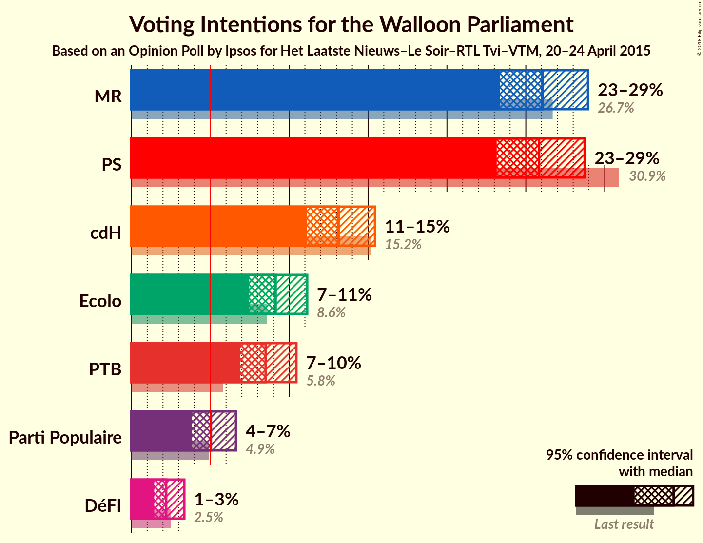
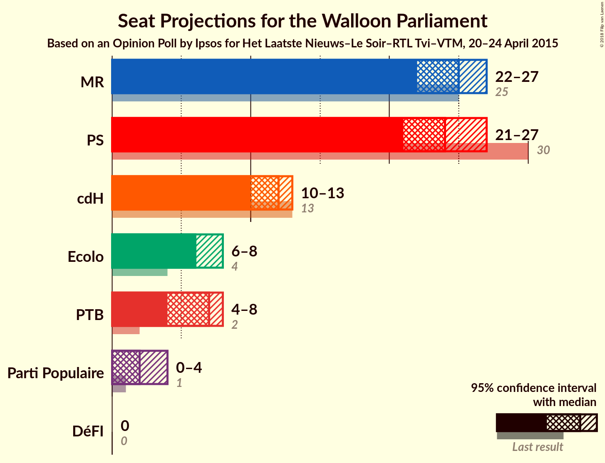
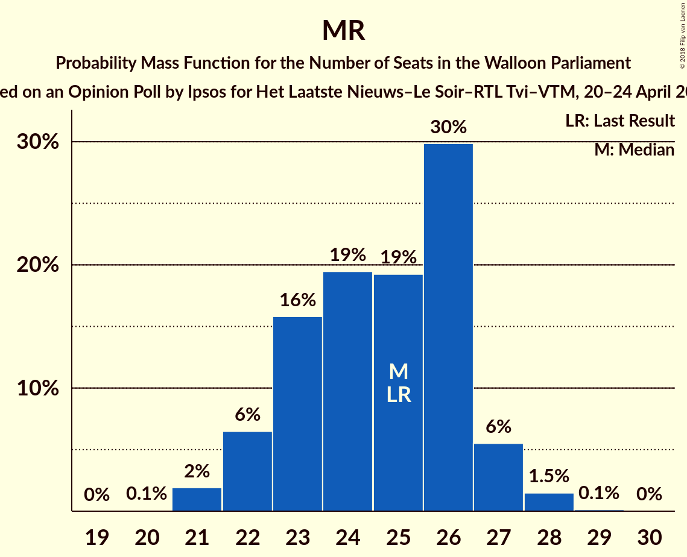
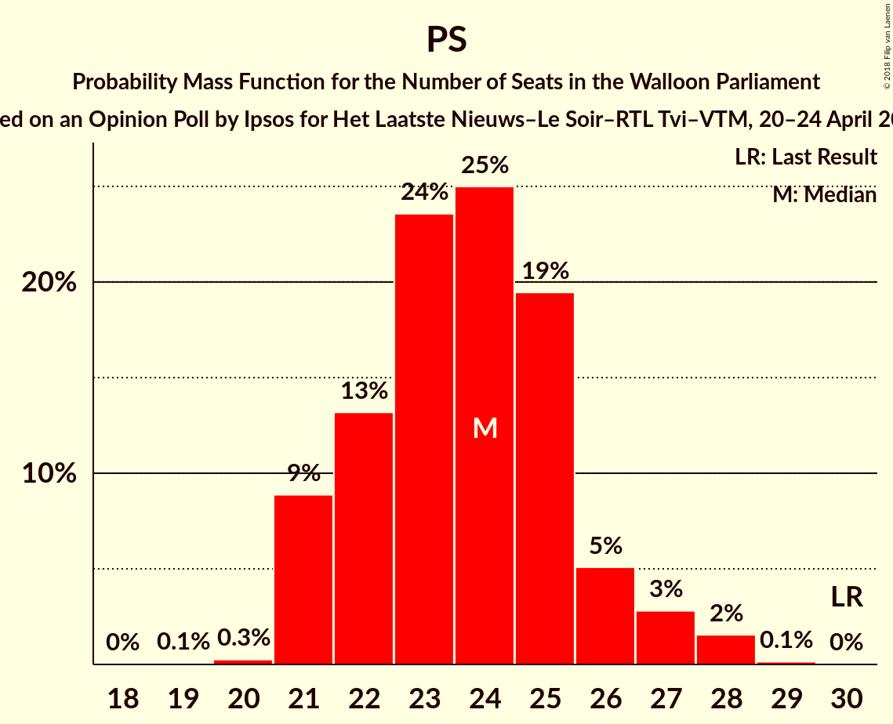
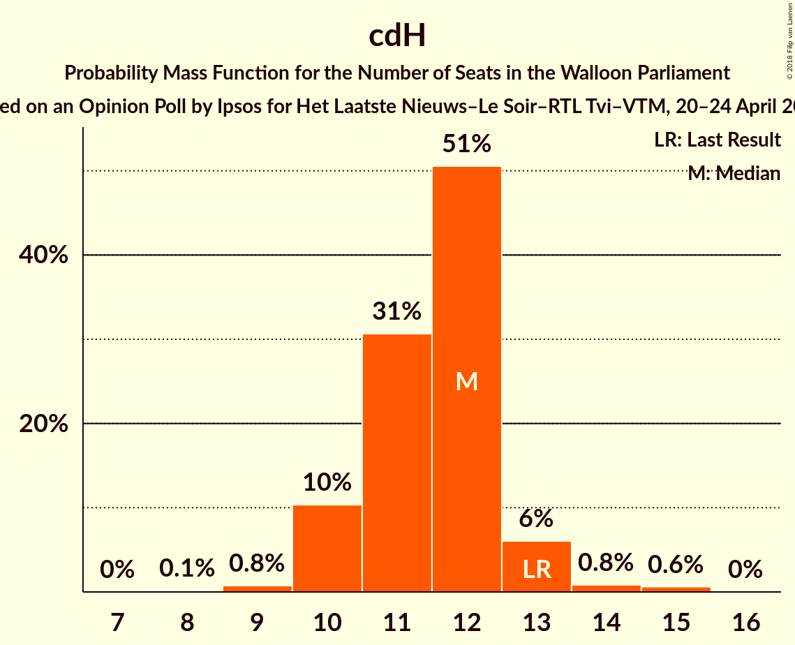
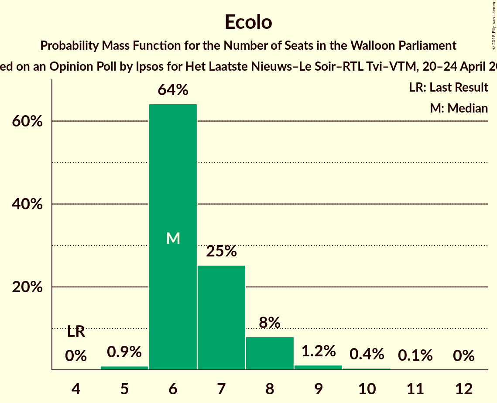
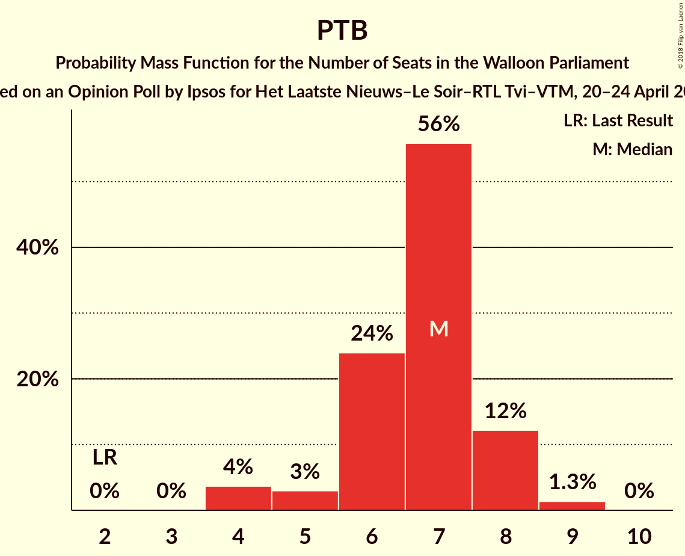
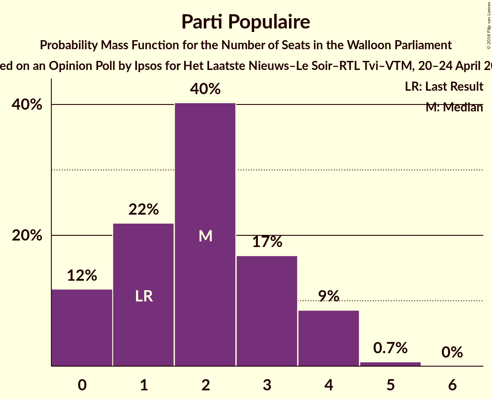

# Opinion Poll by Ipsos for Het Laatste Nieuws–Le Soir–RTL Tvi–VTM, 20–24 April 2015

<a href="#voting-intentions">Voting Intentions</a> | <a href="#seats">Seats</a> | <a href="#coalitions">Coalitions</a> | <a href="#technical-information">Technical Information</a>

## Voting Intentions

### Confidence Intervals

| Party | Last Result | Poll Result | 80% Confidence Interval | 90% Confidence Interval | 95% Confidence Interval | 99% Confidence Interval |
|:-----:|:-----------:|:-----------:|:-----------------------:|:-----------------------:|:-----------------------:|:-----------------------:|
| MR | 26.7% | 26.1% | 24.3–27.9% |23.8–28.5% |23.4–28.9% |22.5–29.9% |
| PS | 30.9% | 25.8% | 24.1–27.7% |23.6–28.3% |23.2–28.7% |22.3–29.6% |
| cdH | 15.2% | 13.1% | 11.8–14.6% |11.4–15.1% |11.1–15.4% |10.5–16.2% |
| Ecolo | 8.6% | 9.1% | 8.0–10.5% |7.7–10.8% |7.5–11.1% |7.0–11.8% |
| PTB | 5.8% | 8.5% | 7.4–9.8% |7.1–10.1% |6.9–10.5% |6.4–11.1% |
| Parti Populaire | 4.9% | 5.0% | 4.2–6.1% |4.0–6.4% |3.8–6.6% |3.5–7.2% |
| DéFI | 2.5% | 2.2% | 1.7–3.0% |1.6–3.2% |1.4–3.4% |1.2–3.7% |

*Note:* The poll result column reflects the actual value used in the calculations. Published results may vary slightly, and in addition be rounded to fewer digits.

## Seats

### Confidence Intervals

| Party | Last Result | Median | 80% Confidence Interval | 90% Confidence Interval | 95% Confidence Interval | 99% Confidence Interval |
|:-----:|:-----------:|:------:|:-----------------------:|:-----------------------:|:-----------------------:|:-----------------------:|
| <a href="#mr">MR</a> | 25 | 25 | 23–26 |22–27 |22–27 |21–28 |
| <a href="#ps">PS</a> | 30 | 24 | 22–25 |21–26 |21–27 |21–28 |
| <a href="#cdh">cdH</a> | 13 | 12 | 10–12 |10–13 |10–13 |9–15 |
| <a href="#ecolo">Ecolo</a> | 4 | 6 | 6–7 |6–8 |6–8 |5–10 |
| <a href="#ptb">PTB</a> | 2 | 7 | 6–8 |5–8 |4–8 |4–9 |
| <a href="#parti-populaire">Parti Populaire</a> | 1 | 2 | 0–3 |0–4 |0–4 |0–5 |
| <a href="#défi">DéFI</a> | 0 | 0 | 0 |0 |0 |0 |

### MR

*For a full overview of the results for this party, see the [MR](party-mr.html) page.*

| Number of Seats | Probability | Accumulated | Special Marks |
|:---------------:|:-----------:|:-----------:|:-------------:|
| 20 | 0.1% | 100% |  |
| 21 | 2% | 99.9% |  |
| 22 | 6% | 98% |  |
| 23 | 16% | 92% |  |
| 24 | 19% | 76% |  |
| 25 | 19% | 56% | Last Result, Median |
| 26 | 30% | 37% |  |
| 27 | 6% | 7% |  |
| 28 | 1.5% | 2% |  |
| 29 | 0.1% | 0.1% |  |
| 30 | 0% | 0% |  |

### PS

*For a full overview of the results for this party, see the [PS](party-ps.html) page.*

| Number of Seats | Probability | Accumulated | Special Marks |
|:---------------:|:-----------:|:-----------:|:-------------:|
| 19 | 0.1% | 100% |  |
| 20 | 0.3% | 99.9% |  |
| 21 | 9% | 99.7% |  |
| 22 | 13% | 91% |  |
| 23 | 24% | 78% |  |
| 24 | 25% | 54% | Median |
| 25 | 19% | 29% |  |
| 26 | 5% | 10% |  |
| 27 | 3% | 5% |  |
| 28 | 2% | 2% |  |
| 29 | 0.1% | 0.2% |  |
| 30 | 0% | 0% | Last Result |

### cdH

*For a full overview of the results for this party, see the [cdH](party-cdh.html) page.*

| Number of Seats | Probability | Accumulated | Special Marks |
|:---------------:|:-----------:|:-----------:|:-------------:|
| 7 | 0% | 100% |  |
| 8 | 0.1% | 99.9% |  |
| 9 | 0.8% | 99.8% |  |
| 10 | 10% | 99.1% |  |
| 11 | 31% | 89% |  |
| 12 | 51% | 58% | Median |
| 13 | 6% | 8% | Last Result |
| 14 | 0.8% | 1.5% |  |
| 15 | 0.6% | 0.6% |  |
| 16 | 0% | 0% |  |

### Ecolo

*For a full overview of the results for this party, see the [Ecolo](party-ecolo.html) page.*

| Number of Seats | Probability | Accumulated | Special Marks |
|:---------------:|:-----------:|:-----------:|:-------------:|
| 4 | 0% | 100% | Last Result |
| 5 | 0.9% | 100% |  |
| 6 | 64% | 99.1% | Median |
| 7 | 25% | 35% |  |
| 8 | 8% | 10% |  |
| 9 | 1.2% | 2% |  |
| 10 | 0.4% | 0.5% |  |
| 11 | 0.1% | 0.1% |  |
| 12 | 0% | 0% |  |

### PTB

*For a full overview of the results for this party, see the [PTB](party-ptb.html) page.*

| Number of Seats | Probability | Accumulated | Special Marks |
|:---------------:|:-----------:|:-----------:|:-------------:|
| 2 | 0% | 100% | Last Result |
| 3 | 0% | 100% |  |
| 4 | 4% | 100% |  |
| 5 | 3% | 96% |  |
| 6 | 24% | 93% |  |
| 7 | 56% | 69% | Median |
| 8 | 12% | 14% |  |
| 9 | 1.3% | 1.4% |  |
| 10 | 0% | 0% |  |

### Parti Populaire

*For a full overview of the results for this party, see the [Parti Populaire](party-partipopulaire.html) page.*

| Number of Seats | Probability | Accumulated | Special Marks |
|:---------------:|:-----------:|:-----------:|:-------------:|
| 0 | 12% | 100% |  |
| 1 | 22% | 88% | Last Result |
| 2 | 40% | 66% | Median |
| 3 | 17% | 26% |  |
| 4 | 9% | 9% |  |
| 5 | 0.7% | 0.7% |  |
| 6 | 0% | 0% |  |

### DéFI

*For a full overview of the results for this party, see the [DéFI](party-défi.html) page.*

| Number of Seats | Probability | Accumulated | Special Marks |
|:---------------:|:-----------:|:-----------:|:-------------:|
| 0 | 100% | 100% | Last Result, Median |

## Coalitions

### Confidence Intervals

| Coalition | Last Result | Median | Majority? | 80% Confidence Interval | 90% Confidence Interval | 95% Confidence Interval | 99% Confidence Interval |
|:---------:|:-----------:|:------:|:---------:|:-----------------------:|:-----------------------:|:-----------------------:|:-----------------------:|
| MR – PS – Ecolo | 59 | 55 | 100% | 53–57 | 53–57 | 52–58 | 51–59 |
| MR – PS | 55 | 48 | 100% | 47–50 | 46–51 | 46–51 | 44–52 |
| MR – cdH – Ecolo | 42 | 43 | 99.9% | 41–45 | 40–45 | 39–46 | 38–47 |
| PS – cdH – Ecolo | 47 | 42 | 99.9% | 40–44 | 39–45 | 39–45 | 38–46 |
| PS – cdH – PTB | 45 | 42 | 99.8% | 40–44 | 39–45 | 39–45 | 38–46 |
| PS – Ecolo – PTB | 36 | 37 | 34% | 35–39 | 34–40 | 34–40 | 33–42 |
| MR – cdH | 38 | 36 | 25% | 34–38 | 33–39 | 33–39 | 32–40 |
| PS – cdH | 43 | 35 | 8% | 33–37 | 33–38 | 32–39 | 31–40 |
| MR – Ecolo | 29 | 31 | 0% | 29–33 | 28–33 | 28–34 | 27–35 |
| PS – Ecolo | 34 | 30 | 0% | 28–32 | 28–33 | 27–34 | 27–35 |
| PS – PTB | 32 | 30 | 0% | 28–32 | 28–33 | 27–34 | 27–35 |
| Ecolo – PTB | 6 | 13 | 0% | 12–14 | 12–15 | 11–15 | 10–16 |

### MR – PS – Ecolo

| Number of Seats | Probability | Accumulated | Special Marks |
|:---------------:|:-----------:|:-----------:|:-------------:|
| 50 | 0.1% | 100% |  |
| 51 | 0.9% | 99.9% |  |
| 52 | 4% | 99.0% |  |
| 53 | 10% | 95% |  |
| 54 | 25% | 85% |  |
| 55 | 32% | 60% | Median |
| 56 | 17% | 27% |  |
| 57 | 8% | 11% |  |
| 58 | 2% | 3% |  |
| 59 | 0.5% | 0.7% | Last Result |
| 60 | 0.2% | 0.2% |  |
| 61 | 0% | 0% |  |

### MR – PS

| Number of Seats | Probability | Accumulated | Special Marks |
|:---------------:|:-----------:|:-----------:|:-------------:|
| 43 | 0.1% | 100% |  |
| 44 | 0.5% | 99.9% |  |
| 45 | 2% | 99.4% |  |
| 46 | 6% | 98% |  |
| 47 | 19% | 91% |  |
| 48 | 24% | 73% |  |
| 49 | 31% | 48% | Median |
| 50 | 11% | 18% |  |
| 51 | 5% | 6% |  |
| 52 | 1.0% | 1.3% |  |
| 53 | 0.2% | 0.3% |  |
| 54 | 0.1% | 0.1% |  |
| 55 | 0% | 0% | Last Result |

### MR – cdH – Ecolo

| Number of Seats | Probability | Accumulated | Special Marks |
|:---------------:|:-----------:|:-----------:|:-------------:|
| 37 | 0.1% | 100% |  |
| 38 | 0.5% | 99.9% | Majority |
| 39 | 2% | 99.4% |  |
| 40 | 6% | 97% |  |
| 41 | 14% | 91% |  |
| 42 | 23% | 77% | Last Result |
| 43 | 21% | 54% | Median |
| 44 | 20% | 33% |  |
| 45 | 11% | 13% |  |
| 46 | 2% | 3% |  |
| 47 | 0.6% | 0.8% |  |
| 48 | 0.1% | 0.1% |  |
| 49 | 0% | 0% |  |

### PS – cdH – Ecolo

| Number of Seats | Probability | Accumulated | Special Marks |
|:---------------:|:-----------:|:-----------:|:-------------:|
| 37 | 0.1% | 100% |  |
| 38 | 2% | 99.9% | Majority |
| 39 | 8% | 98% |  |
| 40 | 15% | 91% |  |
| 41 | 25% | 76% |  |
| 42 | 22% | 51% | Median |
| 43 | 13% | 29% |  |
| 44 | 9% | 16% |  |
| 45 | 5% | 6% |  |
| 46 | 1.3% | 2% |  |
| 47 | 0.2% | 0.3% | Last Result |
| 48 | 0% | 0% |  |

### PS – cdH – PTB

| Number of Seats | Probability | Accumulated | Special Marks |
|:---------------:|:-----------:|:-----------:|:-------------:|
| 37 | 0.2% | 100% |  |
| 38 | 1.0% | 99.8% | Majority |
| 39 | 5% | 98.8% |  |
| 40 | 12% | 94% |  |
| 41 | 20% | 81% |  |
| 42 | 24% | 61% |  |
| 43 | 20% | 36% | Median |
| 44 | 10% | 17% |  |
| 45 | 4% | 7% | Last Result |
| 46 | 2% | 2% |  |
| 47 | 0.2% | 0.2% |  |
| 48 | 0% | 0% |  |

### PS – Ecolo – PTB

| Number of Seats | Probability | Accumulated | Special Marks |
|:---------------:|:-----------:|:-----------:|:-------------:|
| 32 | 0.2% | 100% |  |
| 33 | 1.1% | 99.8% |  |
| 34 | 5% | 98.6% |  |
| 35 | 13% | 94% |  |
| 36 | 25% | 80% | Last Result |
| 37 | 21% | 55% | Median |
| 38 | 17% | 34% | Majority |
| 39 | 11% | 17% |  |
| 40 | 4% | 6% |  |
| 41 | 2% | 2% |  |
| 42 | 0.5% | 0.6% |  |
| 43 | 0.1% | 0.1% |  |
| 44 | 0% | 0% |  |

### MR – cdH

| Number of Seats | Probability | Accumulated | Special Marks |
|:---------------:|:-----------:|:-----------:|:-------------:|
| 31 | 0.2% | 100% |  |
| 32 | 1.0% | 99.8% |  |
| 33 | 4% | 98.8% |  |
| 34 | 9% | 95% |  |
| 35 | 20% | 86% |  |
| 36 | 20% | 66% |  |
| 37 | 21% | 46% | Median |
| 38 | 19% | 25% | Last Result, Majority |
| 39 | 4% | 6% |  |
| 40 | 0.9% | 1.2% |  |
| 41 | 0.2% | 0.3% |  |
| 42 | 0% | 0% |  |

### PS – cdH

| Number of Seats | Probability | Accumulated | Special Marks |
|:---------------:|:-----------:|:-----------:|:-------------:|
| 30 | 0.1% | 100% |  |
| 31 | 0.7% | 99.9% |  |
| 32 | 3% | 99.3% |  |
| 33 | 13% | 96% |  |
| 34 | 16% | 83% |  |
| 35 | 24% | 68% |  |
| 36 | 23% | 43% | Median |
| 37 | 13% | 21% |  |
| 38 | 5% | 8% | Majority |
| 39 | 3% | 3% |  |
| 40 | 0.7% | 0.8% |  |
| 41 | 0% | 0% |  |
| 42 | 0% | 0% |  |
| 43 | 0% | 0% | Last Result |

### MR – Ecolo

| Number of Seats | Probability | Accumulated | Special Marks |
|:---------------:|:-----------:|:-----------:|:-------------:|
| 27 | 1.4% | 100% |  |
| 28 | 4% | 98.6% |  |
| 29 | 9% | 95% | Last Result |
| 30 | 22% | 86% |  |
| 31 | 18% | 63% | Median |
| 32 | 25% | 45% |  |
| 33 | 15% | 20% |  |
| 34 | 4% | 5% |  |
| 35 | 0.7% | 0.9% |  |
| 36 | 0.2% | 0.2% |  |
| 37 | 0% | 0% |  |

### PS – Ecolo

| Number of Seats | Probability | Accumulated | Special Marks |
|:---------------:|:-----------:|:-----------:|:-------------:|
| 26 | 0.2% | 100% |  |
| 27 | 5% | 99.8% |  |
| 28 | 9% | 95% |  |
| 29 | 25% | 86% |  |
| 30 | 23% | 61% | Median |
| 31 | 19% | 39% |  |
| 32 | 12% | 20% |  |
| 33 | 5% | 8% |  |
| 34 | 2% | 3% | Last Result |
| 35 | 0.6% | 0.8% |  |
| 36 | 0.1% | 0.1% |  |
| 37 | 0% | 0% |  |

### PS – PTB

| Number of Seats | Probability | Accumulated | Special Marks |
|:---------------:|:-----------:|:-----------:|:-------------:|
| 25 | 0.1% | 100% |  |
| 26 | 0.4% | 99.9% |  |
| 27 | 2% | 99.5% |  |
| 28 | 10% | 97% |  |
| 29 | 15% | 87% |  |
| 30 | 25% | 72% |  |
| 31 | 22% | 47% | Median |
| 32 | 15% | 25% | Last Result |
| 33 | 7% | 10% |  |
| 34 | 2% | 3% |  |
| 35 | 1.0% | 1.2% |  |
| 36 | 0.2% | 0.2% |  |
| 37 | 0% | 0% |  |

### Ecolo – PTB

| Number of Seats | Probability | Accumulated | Special Marks |
|:---------------:|:-----------:|:-----------:|:-------------:|
| 6 | 0% | 100% | Last Result |
| 7 | 0% | 100% |  |
| 8 | 0% | 100% |  |
| 9 | 0% | 100% |  |
| 10 | 1.5% | 100% |  |
| 11 | 3% | 98% |  |
| 12 | 18% | 95% |  |
| 13 | 39% | 77% | Median |
| 14 | 29% | 38% |  |
| 15 | 7% | 9% |  |
| 16 | 1.5% | 2% |  |
| 17 | 0.3% | 0.5% |  |
| 18 | 0.1% | 0.1% |  |
| 19 | 0% | 0% |  |

## Technical Information

### Opinion Poll

+ **Polling firm:** Ipsos
+ **Commissioner(s):** Het Laatste Nieuws–Le Soir–RTL Tvi–VTM
+ **Fieldwork period:** 20–24 April 2015

### Calculations

+ **Sample size:** 952
+ **Simulations done:** 2,097,152
+ **Error estimate:** 0.46%

