# Opinion Poll by Dedicated for RTBf–La Libre Belgique, 2–6 September 2016

<a href="#voting-intentions">Voting Intentions</a> | <a href="#seats">Seats</a> | <a href="#coalitions">Coalitions</a> | <a href="#technical-information">Technical Information</a>

## Voting Intentions

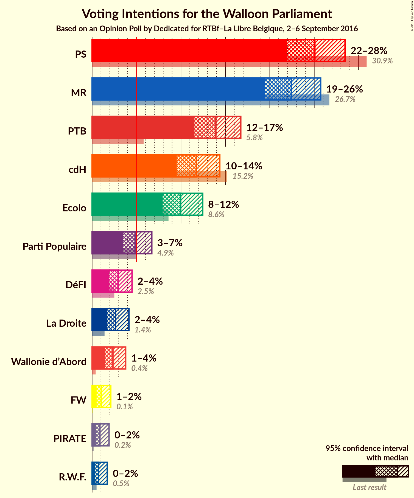

### Confidence Intervals

| Party | Last Result | Poll Result | 80% Confidence Interval | 90% Confidence Interval | 95% Confidence Interval | 99% Confidence Interval |
|:-----:|:-----------:|:-----------:|:-----------------------:|:-----------------------:|:-----------------------:|:-----------------------:|
| PS | 30.9% | 25.1% | 23.0–27.3% |22.5–27.9% |22.0–28.5% |21.0–29.6% |
| MR | 26.7% | 22.4% | 20.5–24.6% |19.9–25.2% |19.5–25.7% |18.5–26.8% |
| PTB | 5.8% | 13.9% | 12.3–15.8% |11.9–16.3% |11.5–16.7% |10.8–17.6% |
| cdH | 15.2% | 11.7% | 10.3–13.5% |9.9–13.9% |9.5–14.4% |8.9–15.2% |
| Ecolo | 8.6% | 10.0% | 8.6–11.6% |8.3–12.1% |7.9–12.5% |7.3–13.3% |
| Parti Populaire | 4.9% | 4.8% | 3.9–6.1% |3.7–6.4% |3.5–6.7% |3.1–7.4% |
| DéFI | 2.5% | 2.9% | 2.3–3.9% |2.1–4.2% |1.9–4.5% |1.6–5.0% |
| La Droite | 1.4% | 2.6% | 2.0–3.6% |1.8–3.9% |1.7–4.1% |1.4–4.7% |
| Wallonie d’Abord | 0.4% | 2.3% | 1.8–3.3% |1.6–3.6% |1.4–3.8% |1.2–4.3% |
| FW | 0.1% | 1.0% | 0.7–1.7% |0.6–1.9% |0.5–2.1% |0.4–2.5% |
| PIRATE | 0.2% | 0.9% | 0.6–1.5% |0.5–1.7% |0.4–1.9% |0.3–2.3% |
| R.W.F. | 0.5% | 0.7% | 0.5–1.4% |0.4–1.5% |0.3–1.7% |0.2–2.1% |

*Note:* The poll result column reflects the actual value used in the calculations. Published results may vary slightly, and in addition be rounded to fewer digits.

## Seats

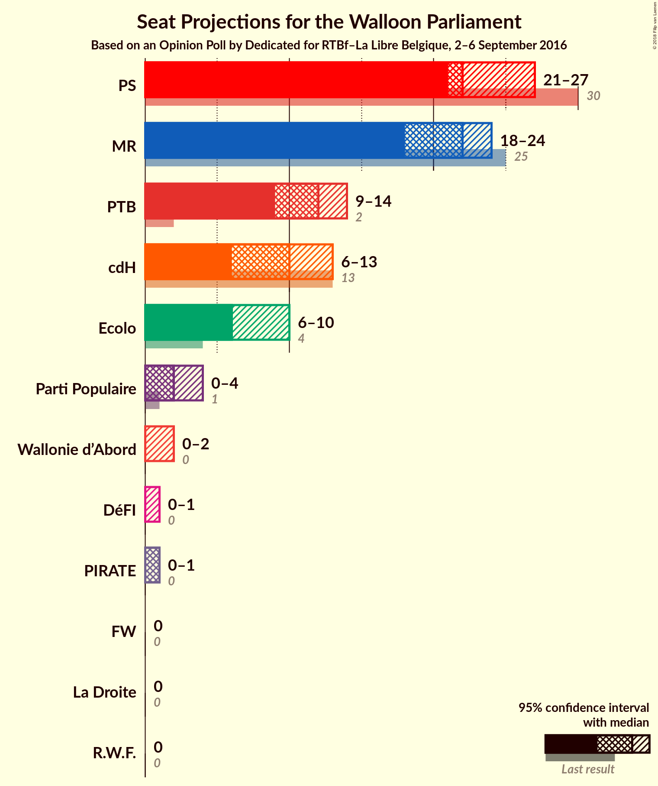

### Confidence Intervals

| Party | Last Result | Median | 80% Confidence Interval | 90% Confidence Interval | 95% Confidence Interval | 99% Confidence Interval |
|:-----:|:-----------:|:------:|:-----------------------:|:-----------------------:|:-----------------------:|:-----------------------:|
| <a href="#ps">PS</a> | 30 | 22 | 21–25 |21–27 |21–27 |19–27 |
| <a href="#mr">MR</a> | 25 | 22 | 18–23 |18–23 |18–24 |16–25 |
| <a href="#ptb">PTB</a> | 2 | 12 | 10–13 |9–13 |9–14 |9–15 |
| <a href="#cdh">cdH</a> | 13 | 10 | 9–12 |7–12 |6–13 |6–13 |
| <a href="#ecolo">Ecolo</a> | 4 | 6 | 6–9 |6–10 |6–10 |6–11 |
| <a href="#parti-populaire">Parti Populaire</a> | 1 | 2 | 0–3 |0–3 |0–4 |0–5 |
| <a href="#défi">DéFI</a> | 0 | 0 | 0 |0 |0–1 |0–1 |
| <a href="#la-droite">La Droite</a> | 0 | 0 | 0 |0 |0 |0–1 |
| <a href="#wallonie-d’abord">Wallonie d’Abord</a> | 0 | 0 | 0–1 |0–2 |0–2 |0–2 |
| <a href="#fw">FW</a> | 0 | 0 | 0 |0 |0 |0 |
| <a href="#pirate">PIRATE</a> | 0 | 1 | 0–1 |0–1 |0–1 |0–2 |
| <a href="#r.w.f.">R.W.F.</a> | 0 | 0 | 0 |0 |0 |0 |

### PS

*For a full overview of the results for this party, see the [PS](party-ps.html) page.*

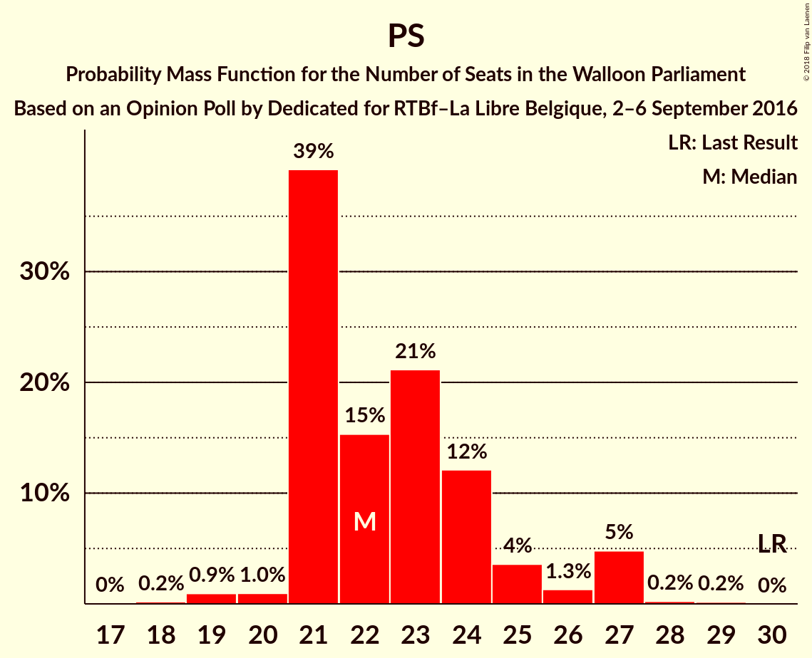

| Number of Seats | Probability | Accumulated | Special Marks |
|:---------------:|:-----------:|:-----------:|:-------------:|
| 18 | 0.2% | 100% |  |
| 19 | 0.9% | 99.8% |  |
| 20 | 1.0% | 98.8% |  |
| 21 | 39% | 98% |  |
| 22 | 15% | 59% | Median |
| 23 | 21% | 43% |  |
| 24 | 12% | 22% |  |
| 25 | 4% | 10% |  |
| 26 | 1.3% | 7% |  |
| 27 | 5% | 5% |  |
| 28 | 0.2% | 0.4% |  |
| 29 | 0.2% | 0.2% |  |
| 30 | 0% | 0% | Last Result |

### MR

*For a full overview of the results for this party, see the [MR](party-mr.html) page.*

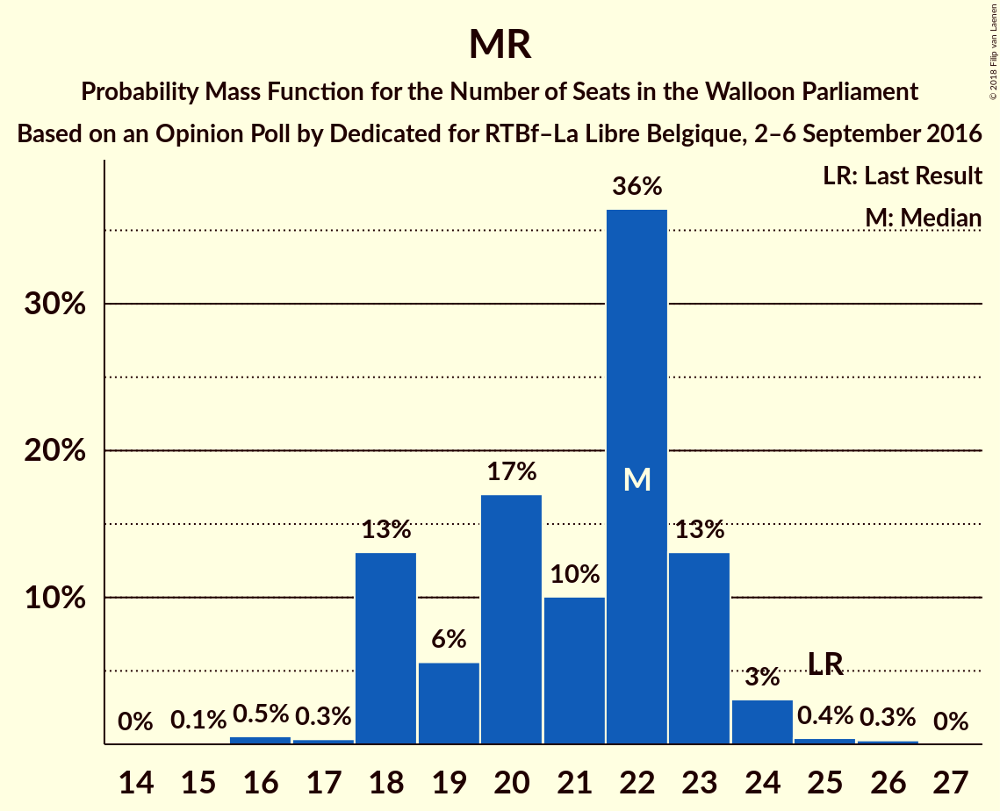

| Number of Seats | Probability | Accumulated | Special Marks |
|:---------------:|:-----------:|:-----------:|:-------------:|
| 15 | 0.1% | 100% |  |
| 16 | 0.5% | 99.9% |  |
| 17 | 0.3% | 99.4% |  |
| 18 | 13% | 99.0% |  |
| 19 | 6% | 86% |  |
| 20 | 17% | 80% |  |
| 21 | 10% | 63% |  |
| 22 | 36% | 53% | Median |
| 23 | 13% | 17% |  |
| 24 | 3% | 4% |  |
| 25 | 0.4% | 0.7% | Last Result |
| 26 | 0.3% | 0.3% |  |
| 27 | 0% | 0% |  |

### PTB

*For a full overview of the results for this party, see the [PTB](party-ptb.html) page.*

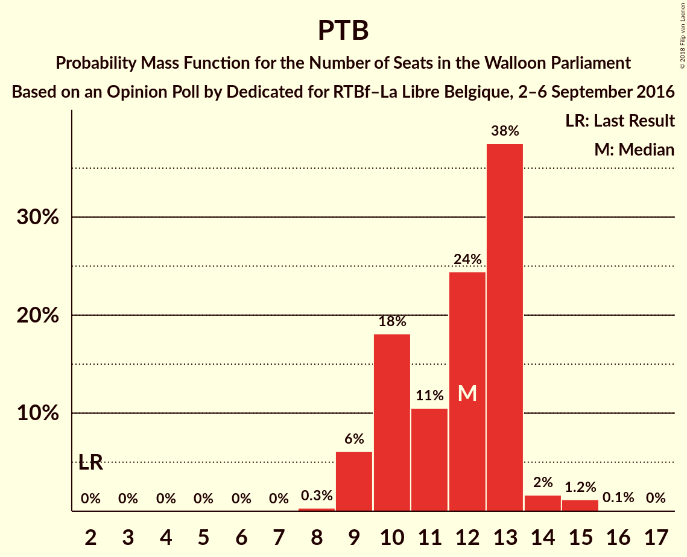

| Number of Seats | Probability | Accumulated | Special Marks |
|:---------------:|:-----------:|:-----------:|:-------------:|
| 2 | 0% | 100% | Last Result |
| 3 | 0% | 100% |  |
| 4 | 0% | 100% |  |
| 5 | 0% | 100% |  |
| 6 | 0% | 100% |  |
| 7 | 0% | 100% |  |
| 8 | 0.3% | 100% |  |
| 9 | 6% | 99.7% |  |
| 10 | 18% | 94% |  |
| 11 | 11% | 75% |  |
| 12 | 24% | 65% | Median |
| 13 | 38% | 40% |  |
| 14 | 2% | 3% |  |
| 15 | 1.2% | 1.3% |  |
| 16 | 0.1% | 0.1% |  |
| 17 | 0% | 0% |  |

### cdH

*For a full overview of the results for this party, see the [cdH](party-cdh.html) page.*

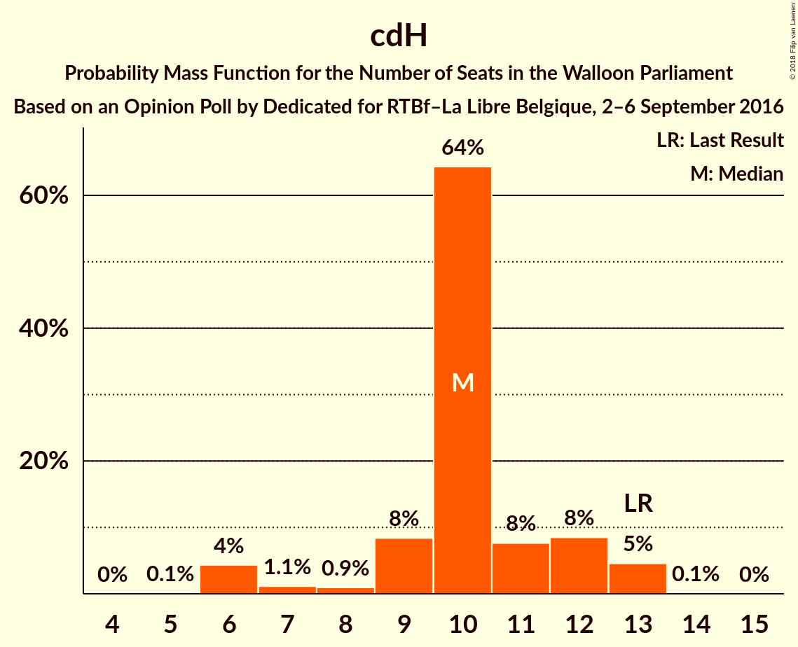

| Number of Seats | Probability | Accumulated | Special Marks |
|:---------------:|:-----------:|:-----------:|:-------------:|
| 5 | 0.1% | 100% |  |
| 6 | 4% | 99.9% |  |
| 7 | 1.1% | 96% |  |
| 8 | 0.9% | 94% |  |
| 9 | 8% | 93% |  |
| 10 | 64% | 85% | Median |
| 11 | 8% | 21% |  |
| 12 | 8% | 13% |  |
| 13 | 5% | 5% | Last Result |
| 14 | 0.1% | 0.1% |  |
| 15 | 0% | 0% |  |

### Ecolo

*For a full overview of the results for this party, see the [Ecolo](party-ecolo.html) page.*

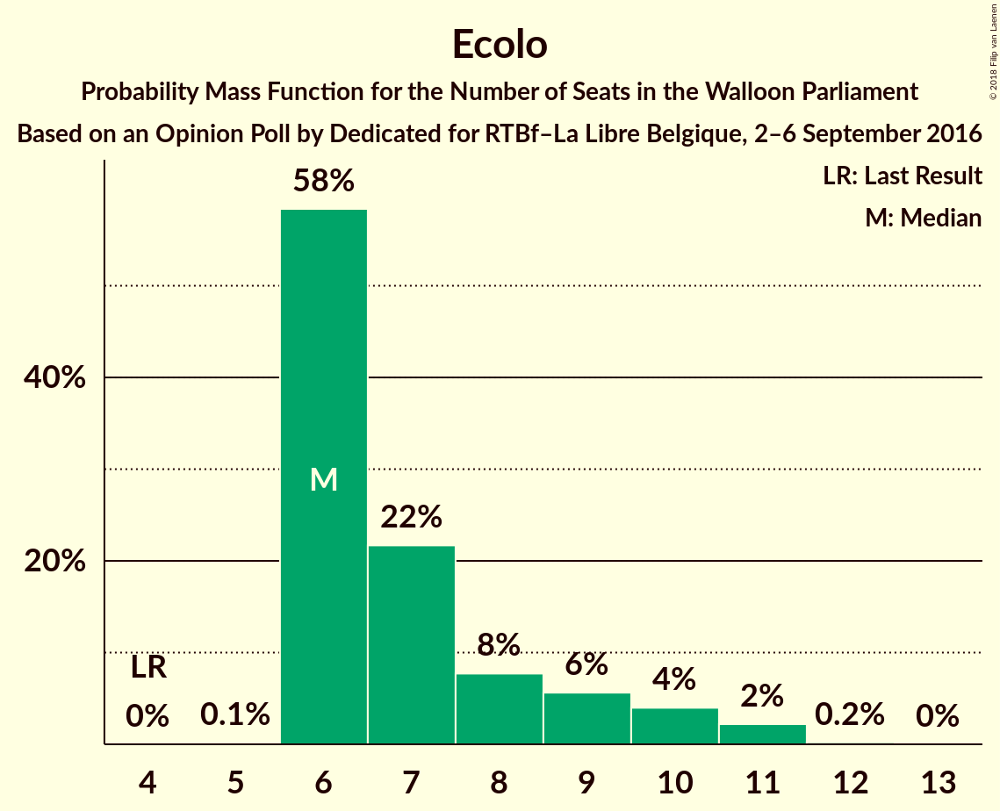

| Number of Seats | Probability | Accumulated | Special Marks |
|:---------------:|:-----------:|:-----------:|:-------------:|
| 4 | 0% | 100% | Last Result |
| 5 | 0.1% | 100% |  |
| 6 | 58% | 99.8% | Median |
| 7 | 22% | 41% |  |
| 8 | 8% | 20% |  |
| 9 | 6% | 12% |  |
| 10 | 4% | 6% |  |
| 11 | 2% | 2% |  |
| 12 | 0.2% | 0.2% |  |
| 13 | 0% | 0% |  |

### Parti Populaire

*For a full overview of the results for this party, see the [Parti Populaire](party-partipopulaire.html) page.*

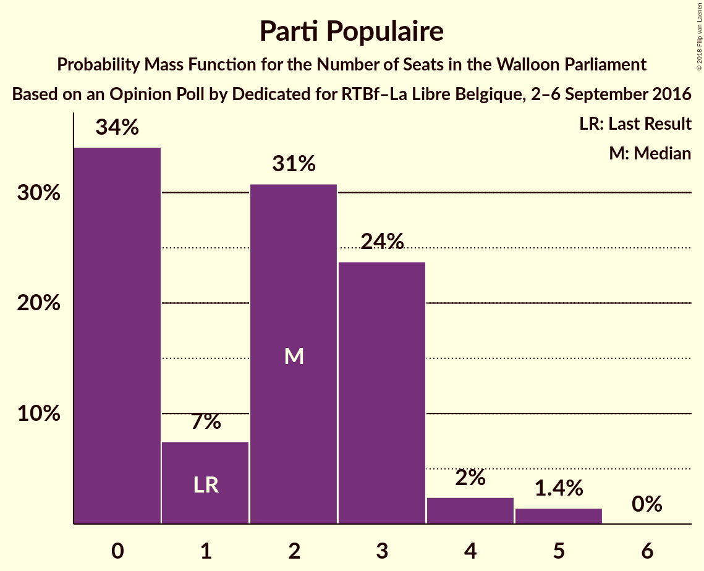

| Number of Seats | Probability | Accumulated | Special Marks |
|:---------------:|:-----------:|:-----------:|:-------------:|
| 0 | 34% | 100% |  |
| 1 | 7% | 66% | Last Result |
| 2 | 31% | 58% | Median |
| 3 | 24% | 28% |  |
| 4 | 2% | 4% |  |
| 5 | 1.4% | 1.4% |  |
| 6 | 0% | 0% |  |

### DéFI

*For a full overview of the results for this party, see the [DéFI](party-défi.html) page.*

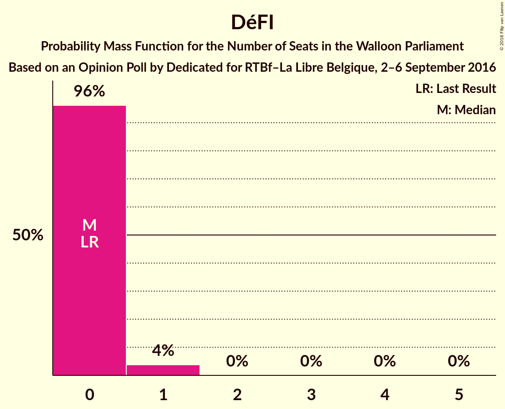

| Number of Seats | Probability | Accumulated | Special Marks |
|:---------------:|:-----------:|:-----------:|:-------------:|
| 0 | 96% | 100% | Last Result, Median |
| 1 | 4% | 4% |  |
| 2 | 0% | 0% |  |

### La Droite

*For a full overview of the results for this party, see the [La Droite](party-ladroite.html) page.*

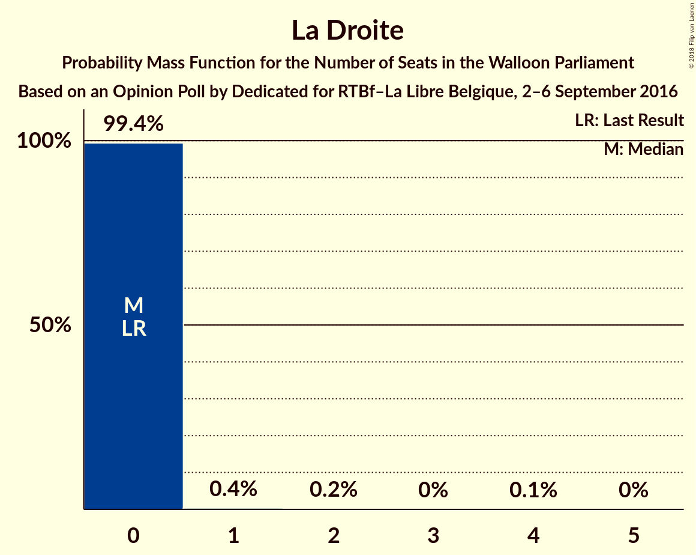

| Number of Seats | Probability | Accumulated | Special Marks |
|:---------------:|:-----------:|:-----------:|:-------------:|
| 0 | 99.4% | 100% | Last Result, Median |
| 1 | 0.4% | 0.6% |  |
| 2 | 0.2% | 0.3% |  |
| 3 | 0% | 0.1% |  |
| 4 | 0.1% | 0.1% |  |
| 5 | 0% | 0% |  |

### Wallonie d’Abord

*For a full overview of the results for this party, see the [Wallonie d’Abord](party-wallonied’abord.html) page.*

| Number of Seats | Probability | Accumulated | Special Marks |
|:---------------:|:-----------:|:-----------:|:-------------:|
| 0 | 64% | 100% | Last Result, Median |
| 1 | 28% | 36% |  |
| 2 | 8% | 8% |  |
| 3 | 0% | 0% |  |

### FW

*For a full overview of the results for this party, see the [FW](party-fw.html) page.*

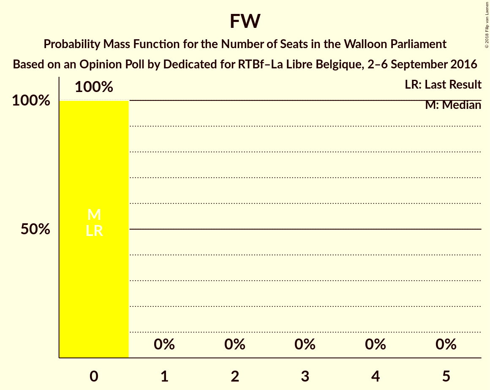

| Number of Seats | Probability | Accumulated | Special Marks |
|:---------------:|:-----------:|:-----------:|:-------------:|
| 0 | 100% | 100% | Last Result, Median |

### PIRATE

*For a full overview of the results for this party, see the [PIRATE](party-pirate.html) page.*

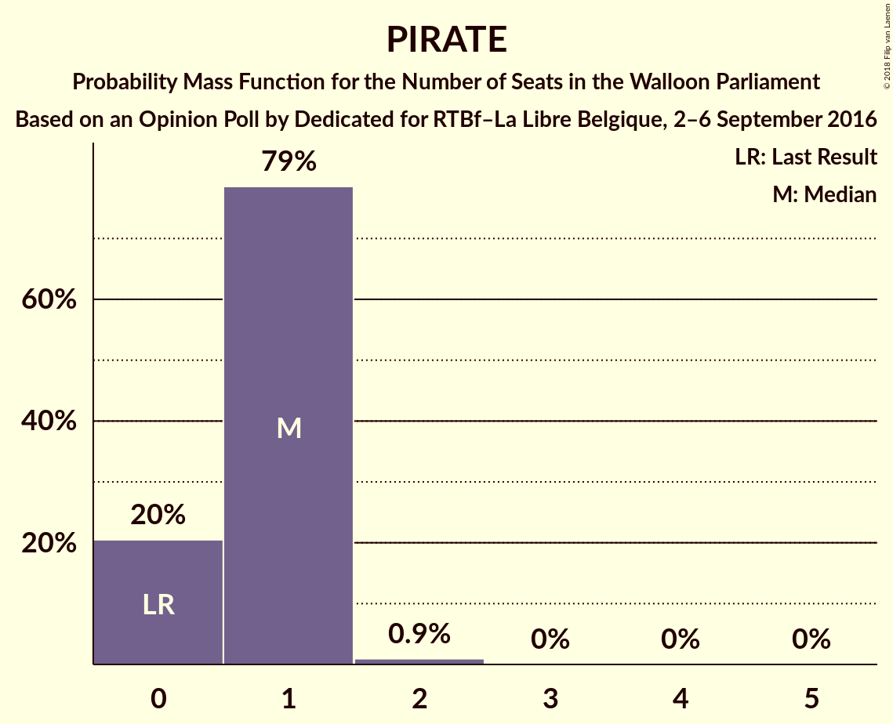

| Number of Seats | Probability | Accumulated | Special Marks |
|:---------------:|:-----------:|:-----------:|:-------------:|
| 0 | 20% | 100% | Last Result |
| 1 | 79% | 80% | Median |
| 2 | 0.9% | 1.0% |  |
| 3 | 0% | 0% |  |

### R.W.F.

*For a full overview of the results for this party, see the [R.W.F.](party-rwf.html) page.*

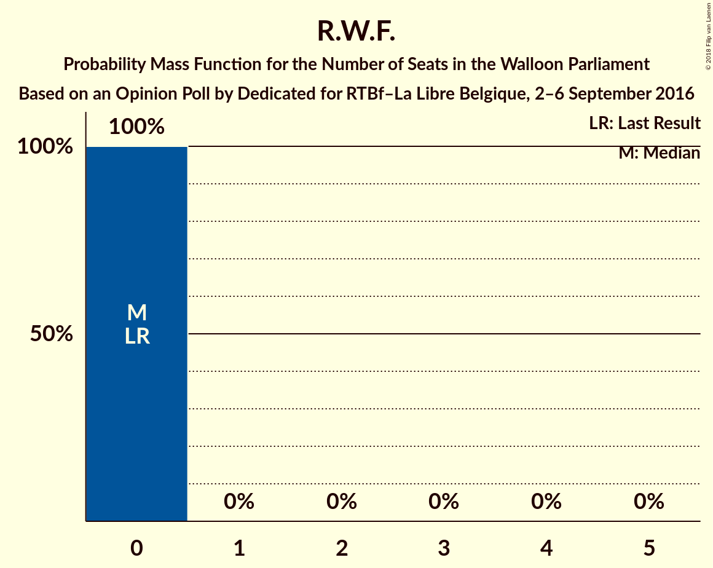

| Number of Seats | Probability | Accumulated | Special Marks |
|:---------------:|:-----------:|:-----------:|:-------------:|
| 0 | 100% | 100% | Last Result, Median |

## Coalitions

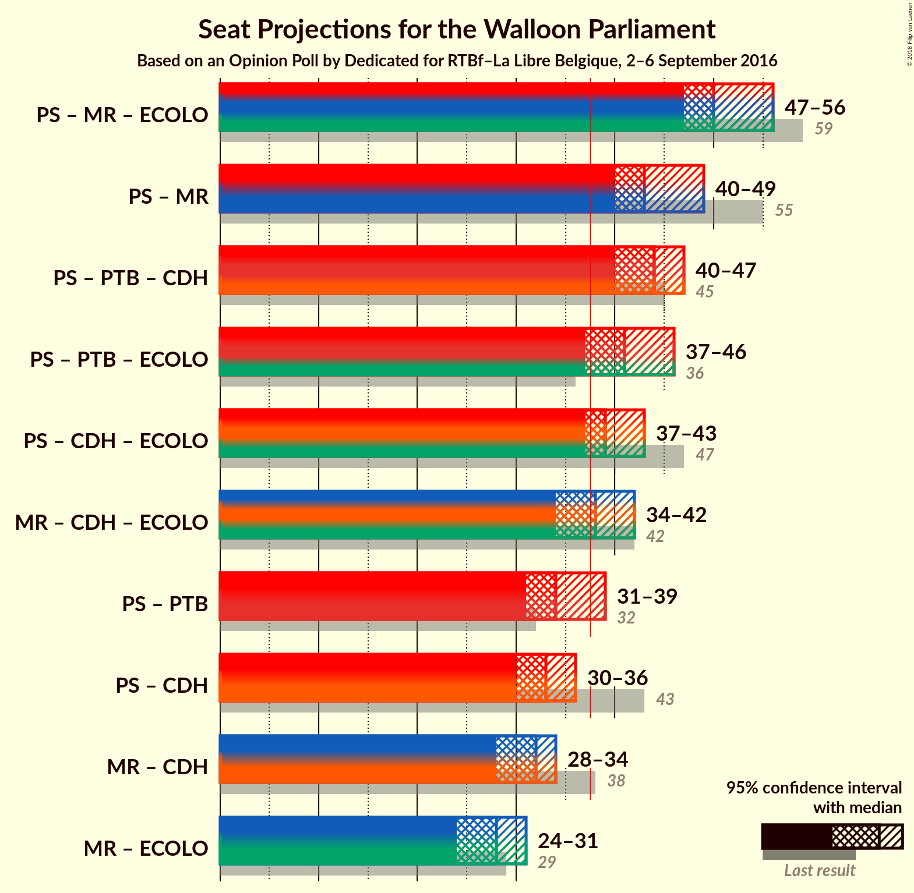

### Confidence Intervals

| Coalition | Last Result | Median | Majority? | 80% Confidence Interval | 90% Confidence Interval | 95% Confidence Interval | 99% Confidence Interval |
|:---------:|:-----------:|:------:|:---------:|:-----------------------:|:-----------------------:|:-----------------------:|:-----------------------:|
| PS – MR – Ecolo | 59 | 50 | 100% | 48–53 | 47–54 | 47–56 | 46–56 |
| PS – MR | 55 | 43 | 99.8% | 41–46 | 41–48 | 40–49 | 38–49 |
| PS – PTB – cdH | 45 | 44 | 99.9% | 42–46 | 41–47 | 40–47 | 39–48 |
| PS – PTB – Ecolo | 36 | 41 | 97% | 39–44 | 38–45 | 37–46 | 36–46 |
| PS – cdH – Ecolo | 47 | 39 | 81% | 37–41 | 37–43 | 37–43 | 34–45 |
| MR – cdH – Ecolo | 42 | 38 | 69% | 35–41 | 34–41 | 34–42 | 33–42 |
| PS – PTB | 32 | 34 | 5% | 31–36 | 31–38 | 31–39 | 30–40 |
| PS – cdH | 43 | 33 | 0.4% | 31–34 | 31–35 | 30–36 | 27–37 |
| MR – cdH | 38 | 32 | 0% | 28–33 | 28–34 | 28–34 | 26–35 |
| MR – Ecolo | 29 | 28 | 0% | 25–31 | 25–31 | 24–31 | 24–33 |

### PS – MR – Ecolo

| Number of Seats | Probability | Accumulated | Special Marks |
|:---------------:|:-----------:|:-----------:|:-------------:|
| 45 | 0.4% | 100% |  |
| 46 | 0.5% | 99.6% |  |
| 47 | 8% | 99.1% |  |
| 48 | 7% | 91% |  |
| 49 | 33% | 84% |  |
| 50 | 5% | 51% | Median |
| 51 | 20% | 46% |  |
| 52 | 13% | 26% |  |
| 53 | 3% | 13% |  |
| 54 | 5% | 10% |  |
| 55 | 1.2% | 4% |  |
| 56 | 3% | 3% |  |
| 57 | 0.1% | 0.1% |  |
| 58 | 0% | 0.1% |  |
| 59 | 0% | 0% | Last Result |

### PS – MR

| Number of Seats | Probability | Accumulated | Special Marks |
|:---------------:|:-----------:|:-----------:|:-------------:|
| 36 | 0.1% | 100% |  |
| 37 | 0.2% | 99.9% |  |
| 38 | 0.3% | 99.8% | Majority |
| 39 | 0.7% | 99.5% |  |
| 40 | 2% | 98.8% |  |
| 41 | 14% | 97% |  |
| 42 | 14% | 83% |  |
| 43 | 30% | 69% |  |
| 44 | 10% | 39% | Median |
| 45 | 18% | 29% |  |
| 46 | 2% | 11% |  |
| 47 | 3% | 9% |  |
| 48 | 3% | 7% |  |
| 49 | 3% | 4% |  |
| 50 | 0.2% | 0.2% |  |
| 51 | 0% | 0% |  |
| 52 | 0% | 0% |  |
| 53 | 0% | 0% |  |
| 54 | 0% | 0% |  |
| 55 | 0% | 0% | Last Result |

### PS – PTB – cdH

| Number of Seats | Probability | Accumulated | Special Marks |
|:---------------:|:-----------:|:-----------:|:-------------:|
| 37 | 0.1% | 100% |  |
| 38 | 0.3% | 99.9% | Majority |
| 39 | 0.6% | 99.6% |  |
| 40 | 2% | 98.9% |  |
| 41 | 6% | 97% |  |
| 42 | 8% | 91% |  |
| 43 | 6% | 83% |  |
| 44 | 32% | 77% | Median |
| 45 | 15% | 45% | Last Result |
| 46 | 24% | 30% |  |
| 47 | 4% | 5% |  |
| 48 | 2% | 2% |  |
| 49 | 0.1% | 0.2% |  |
| 50 | 0% | 0.1% |  |
| 51 | 0% | 0% |  |

### PS – PTB – Ecolo

| Number of Seats | Probability | Accumulated | Special Marks |
|:---------------:|:-----------:|:-----------:|:-------------:|
| 35 | 0.1% | 100% |  |
| 36 | 1.2% | 99.9% | Last Result |
| 37 | 2% | 98.7% |  |
| 38 | 4% | 97% | Majority |
| 39 | 18% | 93% |  |
| 40 | 21% | 75% | Median |
| 41 | 13% | 54% |  |
| 42 | 19% | 41% |  |
| 43 | 11% | 22% |  |
| 44 | 3% | 11% |  |
| 45 | 4% | 8% |  |
| 46 | 4% | 4% |  |
| 47 | 0.2% | 0.4% |  |
| 48 | 0.1% | 0.2% |  |
| 49 | 0.1% | 0.1% |  |
| 50 | 0% | 0% |  |

### PS – cdH – Ecolo

| Number of Seats | Probability | Accumulated | Special Marks |
|:---------------:|:-----------:|:-----------:|:-------------:|
| 34 | 0.5% | 100% |  |
| 35 | 0.2% | 99.5% |  |
| 36 | 1.3% | 99.3% |  |
| 37 | 17% | 98% |  |
| 38 | 14% | 81% | Median, Majority |
| 39 | 29% | 67% |  |
| 40 | 8% | 39% |  |
| 41 | 20% | 30% |  |
| 42 | 5% | 10% |  |
| 43 | 4% | 5% |  |
| 44 | 0.9% | 2% |  |
| 45 | 0.4% | 0.8% |  |
| 46 | 0.3% | 0.4% |  |
| 47 | 0% | 0.1% | Last Result |
| 48 | 0.1% | 0.1% |  |
| 49 | 0% | 0% |  |

### MR – cdH – Ecolo

| Number of Seats | Probability | Accumulated | Special Marks |
|:---------------:|:-----------:|:-----------:|:-------------:|
| 32 | 0.2% | 100% |  |
| 33 | 0.3% | 99.8% |  |
| 34 | 5% | 99.5% |  |
| 35 | 12% | 94% |  |
| 36 | 6% | 82% |  |
| 37 | 8% | 77% |  |
| 38 | 37% | 69% | Median, Majority |
| 39 | 9% | 32% |  |
| 40 | 11% | 23% |  |
| 41 | 9% | 12% |  |
| 42 | 3% | 3% | Last Result |
| 43 | 0.3% | 0.5% |  |
| 44 | 0.1% | 0.1% |  |
| 45 | 0% | 0% |  |

### PS – PTB

| Number of Seats | Probability | Accumulated | Special Marks |
|:---------------:|:-----------:|:-----------:|:-------------:|
| 28 | 0.1% | 100% |  |
| 29 | 0.2% | 99.9% |  |
| 30 | 2% | 99.7% |  |
| 31 | 8% | 98% |  |
| 32 | 10% | 90% | Last Result |
| 33 | 13% | 79% |  |
| 34 | 25% | 66% | Median |
| 35 | 11% | 41% |  |
| 36 | 24% | 31% |  |
| 37 | 2% | 7% |  |
| 38 | 1.3% | 5% | Majority |
| 39 | 3% | 4% |  |
| 40 | 0.8% | 1.0% |  |
| 41 | 0% | 0.1% |  |
| 42 | 0.1% | 0.1% |  |
| 43 | 0% | 0% |  |

### PS – cdH

| Number of Seats | Probability | Accumulated | Special Marks |
|:---------------:|:-----------:|:-----------:|:-------------:|
| 27 | 0.6% | 100% |  |
| 28 | 0.7% | 99.4% |  |
| 29 | 1.0% | 98.7% |  |
| 30 | 3% | 98% |  |
| 31 | 30% | 95% |  |
| 32 | 13% | 65% | Median |
| 33 | 26% | 52% |  |
| 34 | 16% | 26% |  |
| 35 | 6% | 10% |  |
| 36 | 3% | 4% |  |
| 37 | 1.0% | 1.4% |  |
| 38 | 0.3% | 0.4% | Majority |
| 39 | 0% | 0.1% |  |
| 40 | 0% | 0% |  |
| 41 | 0% | 0% |  |
| 42 | 0% | 0% |  |
| 43 | 0% | 0% | Last Result |

### MR – cdH

| Number of Seats | Probability | Accumulated | Special Marks |
|:---------------:|:-----------:|:-----------:|:-------------:|
| 24 | 0.1% | 100% |  |
| 25 | 0.1% | 99.9% |  |
| 26 | 0.7% | 99.8% |  |
| 27 | 0.6% | 99.1% |  |
| 28 | 19% | 98.6% |  |
| 29 | 3% | 79% |  |
| 30 | 11% | 76% |  |
| 31 | 7% | 65% |  |
| 32 | 35% | 58% | Median |
| 33 | 15% | 23% |  |
| 34 | 7% | 8% |  |
| 35 | 1.2% | 2% |  |
| 36 | 0.3% | 0.3% |  |
| 37 | 0% | 0.1% |  |
| 38 | 0% | 0% | Last Result, Majority |

### MR – Ecolo

| Number of Seats | Probability | Accumulated | Special Marks |
|:---------------:|:-----------:|:-----------:|:-------------:|
| 22 | 0.1% | 100% |  |
| 23 | 0.1% | 99.9% |  |
| 24 | 4% | 99.8% |  |
| 25 | 10% | 96% |  |
| 26 | 10% | 86% |  |
| 27 | 11% | 76% |  |
| 28 | 33% | 64% | Median |
| 29 | 12% | 31% | Last Result |
| 30 | 9% | 19% |  |
| 31 | 8% | 10% |  |
| 32 | 1.3% | 2% |  |
| 33 | 0.7% | 1.0% |  |
| 34 | 0.2% | 0.2% |  |
| 35 | 0% | 0% |  |

## Technical Information

### Opinion Poll

+ **Polling firm:** Dedicated
+ **Commissioner(s):** RTBf–La Libre Belgique
+ **Fieldwork period:** 2–6 September 2016

### Calculations

+ **Sample size:** 682
+ **Simulations done:** 8,388,608
+ **Error estimate:** 4.53%

