# Opinion Poll by Ipsos for RTL TVi–Le Soir–VTM–Het Laatste Nieuws, 25 August–3 September 2017

<a href="#voting-intentions">Voting Intentions</a> | <a href="#seats">Seats</a> | <a href="#coalitions">Coalitions</a> | <a href="#technical-information">Technical Information</a>

## Voting Intentions

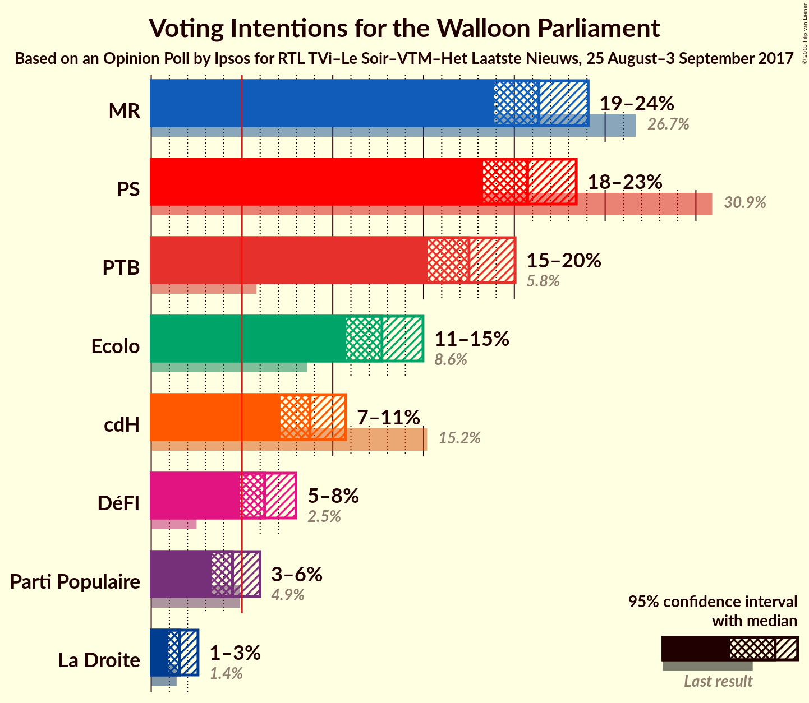

### Confidence Intervals

| Party | Last Result | Poll Result | 80% Confidence Interval | 90% Confidence Interval | 95% Confidence Interval | 99% Confidence Interval |
|:-----:|:-----------:|:-----------:|:-----------------------:|:-----------------------:|:-----------------------:|:-----------------------:|
| MR | 26.7% | 21.4% | 19.7–23.1% |19.3–23.6% |18.9–24.1% |18.1–24.9% |
| PS | 30.9% | 20.7% | 19.1–22.5% |18.7–23.0% |18.3–23.4% |17.5–24.3% |
| PTB | 5.8% | 17.5% | 16.0–19.2% |15.6–19.6% |15.2–20.0% |14.5–20.9% |
| Ecolo | 8.6% | 12.7% | 11.4–14.2% |11.1–14.6% |10.7–15.0% |10.2–15.7% |
| cdH | 15.2% | 8.8% | 7.7–10.0% |7.4–10.4% |7.1–10.7% |6.6–11.4% |
| DéFI | 2.5% | 6.2% | 5.3–7.4% |5.1–7.7% |4.9–8.0% |4.5–8.5% |
| Parti Populaire | 4.9% | 4.5% | 3.7–5.5% |3.5–5.7% |3.3–6.0% |3.0–6.5% |
| La Droite | 1.4% | 1.6% | 1.2–2.2% |1.0–2.4% |0.9–2.6% |0.8–2.9% |

*Note:* The poll result column reflects the actual value used in the calculations. Published results may vary slightly, and in addition be rounded to fewer digits.

## Seats

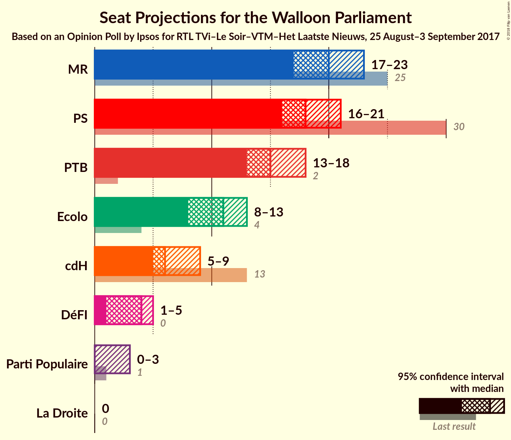

### Confidence Intervals

| Party | Last Result | Median | 80% Confidence Interval | 90% Confidence Interval | 95% Confidence Interval | 99% Confidence Interval |
|:-----:|:-----------:|:------:|:-----------------------:|:-----------------------:|:-----------------------:|:-----------------------:|
| <a href="#mr">MR</a> | 25 | 20 | 18–22 |17–22 |17–23 |16–23 |
| <a href="#ps">PS</a> | 30 | 18 | 17–21 |16–21 |16–21 |15–22 |
| <a href="#ptb">PTB</a> | 2 | 15 | 13–17 |13–17 |13–18 |11–18 |
| <a href="#ecolo">Ecolo</a> | 4 | 11 | 10–13 |9–13 |8–13 |7–13 |
| <a href="#cdh">cdH</a> | 13 | 6 | 5–8 |5–9 |5–9 |4–10 |
| <a href="#défi">DéFI</a> | 0 | 4 | 2–5 |1–5 |1–5 |0–6 |
| <a href="#parti-populaire">Parti Populaire</a> | 1 | 0 | 0–2 |0–3 |0–3 |0–4 |
| <a href="#la-droite">La Droite</a> | 0 | 0 | 0 |0 |0 |0 |

### MR

*For a full overview of the results for this party, see the [MR](party-mr.html) page.*

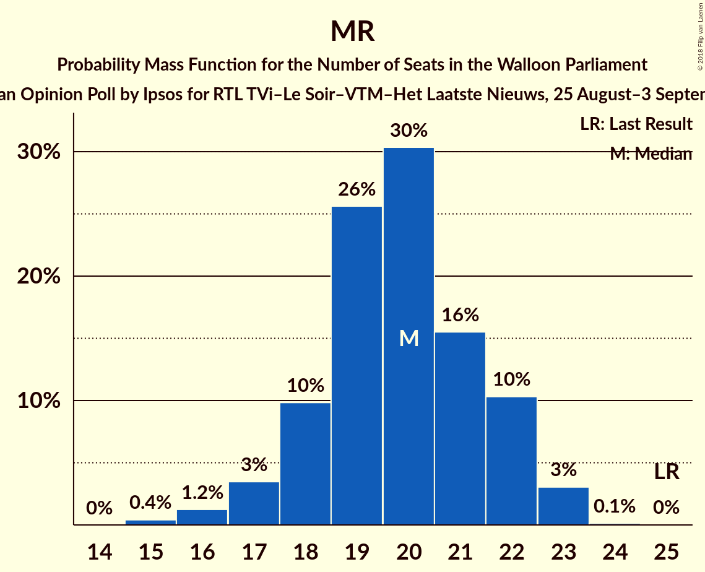

| Number of Seats | Probability | Accumulated | Special Marks |
|:---------------:|:-----------:|:-----------:|:-------------:|
| 15 | 0.4% | 100% |  |
| 16 | 1.2% | 99.6% |  |
| 17 | 3% | 98% |  |
| 18 | 10% | 95% |  |
| 19 | 26% | 85% |  |
| 20 | 30% | 59% | Median |
| 21 | 16% | 29% |  |
| 22 | 10% | 14% |  |
| 23 | 3% | 3% |  |
| 24 | 0.1% | 0.2% |  |
| 25 | 0% | 0% | Last Result |

### PS

*For a full overview of the results for this party, see the [PS](party-ps.html) page.*

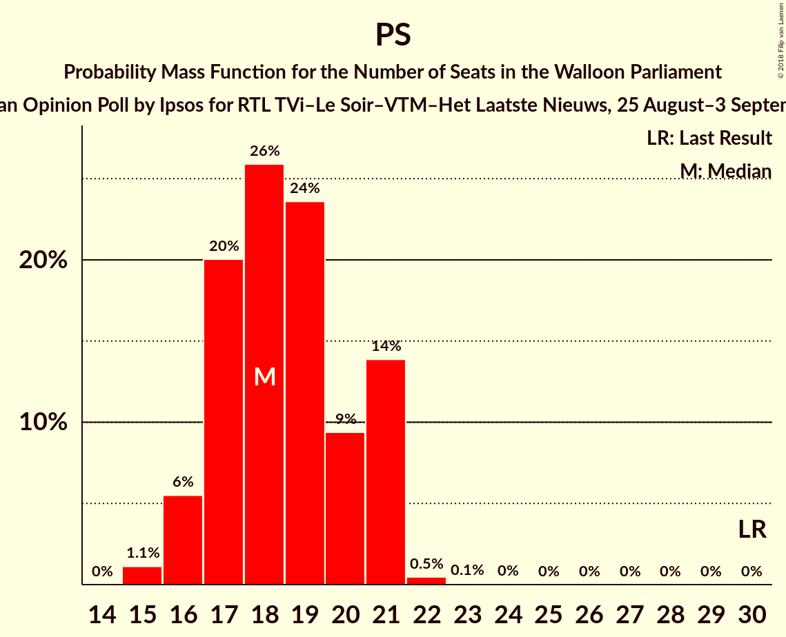

| Number of Seats | Probability | Accumulated | Special Marks |
|:---------------:|:-----------:|:-----------:|:-------------:|
| 15 | 1.1% | 100% |  |
| 16 | 6% | 98.9% |  |
| 17 | 20% | 93% |  |
| 18 | 26% | 73% | Median |
| 19 | 24% | 47% |  |
| 20 | 9% | 24% |  |
| 21 | 14% | 14% |  |
| 22 | 0.5% | 0.6% |  |
| 23 | 0.1% | 0.1% |  |
| 24 | 0% | 0% |  |
| 25 | 0% | 0% |  |
| 26 | 0% | 0% |  |
| 27 | 0% | 0% |  |
| 28 | 0% | 0% |  |
| 29 | 0% | 0% |  |
| 30 | 0% | 0% | Last Result |

### PTB

*For a full overview of the results for this party, see the [PTB](party-ptb.html) page.*

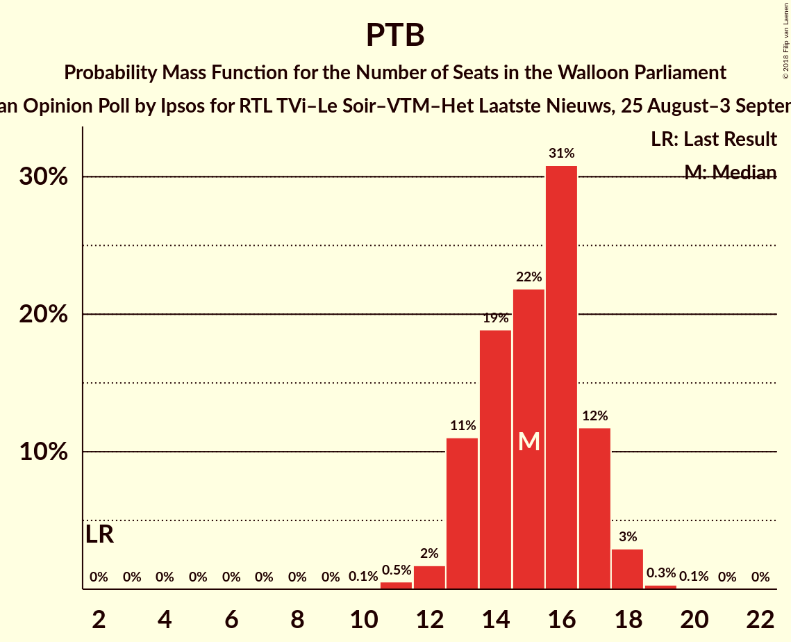

| Number of Seats | Probability | Accumulated | Special Marks |
|:---------------:|:-----------:|:-----------:|:-------------:|
| 2 | 0% | 100% | Last Result |
| 3 | 0% | 100% |  |
| 4 | 0% | 100% |  |
| 5 | 0% | 100% |  |
| 6 | 0% | 100% |  |
| 7 | 0% | 100% |  |
| 8 | 0% | 100% |  |
| 9 | 0% | 100% |  |
| 10 | 0.1% | 100% |  |
| 11 | 0.5% | 99.9% |  |
| 12 | 2% | 99.4% |  |
| 13 | 11% | 98% |  |
| 14 | 19% | 87% |  |
| 15 | 22% | 68% | Median |
| 16 | 31% | 46% |  |
| 17 | 12% | 15% |  |
| 18 | 3% | 3% |  |
| 19 | 0.3% | 0.4% |  |
| 20 | 0.1% | 0.1% |  |
| 21 | 0% | 0% |  |

### Ecolo

*For a full overview of the results for this party, see the [Ecolo](party-ecolo.html) page.*

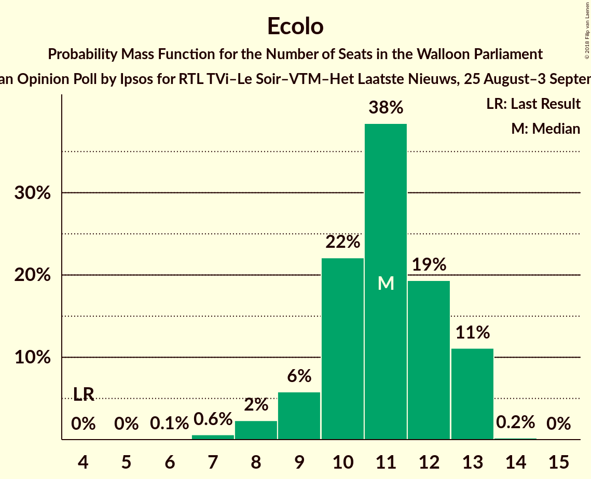

| Number of Seats | Probability | Accumulated | Special Marks |
|:---------------:|:-----------:|:-----------:|:-------------:|
| 4 | 0% | 100% | Last Result |
| 5 | 0% | 100% |  |
| 6 | 0.1% | 100% |  |
| 7 | 0.6% | 99.9% |  |
| 8 | 2% | 99.3% |  |
| 9 | 6% | 97% |  |
| 10 | 22% | 91% |  |
| 11 | 38% | 69% | Median |
| 12 | 19% | 31% |  |
| 13 | 11% | 11% |  |
| 14 | 0.2% | 0.2% |  |
| 15 | 0% | 0% |  |

### cdH

*For a full overview of the results for this party, see the [cdH](party-cdh.html) page.*

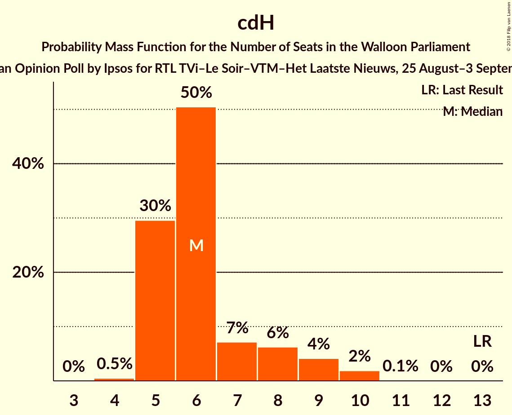

| Number of Seats | Probability | Accumulated | Special Marks |
|:---------------:|:-----------:|:-----------:|:-------------:|
| 4 | 0.5% | 100% |  |
| 5 | 30% | 99.5% |  |
| 6 | 50% | 70% | Median |
| 7 | 7% | 19% |  |
| 8 | 6% | 12% |  |
| 9 | 4% | 6% |  |
| 10 | 2% | 2% |  |
| 11 | 0.1% | 0.1% |  |
| 12 | 0% | 0% |  |
| 13 | 0% | 0% | Last Result |

### DéFI

*For a full overview of the results for this party, see the [DéFI](party-défi.html) page.*

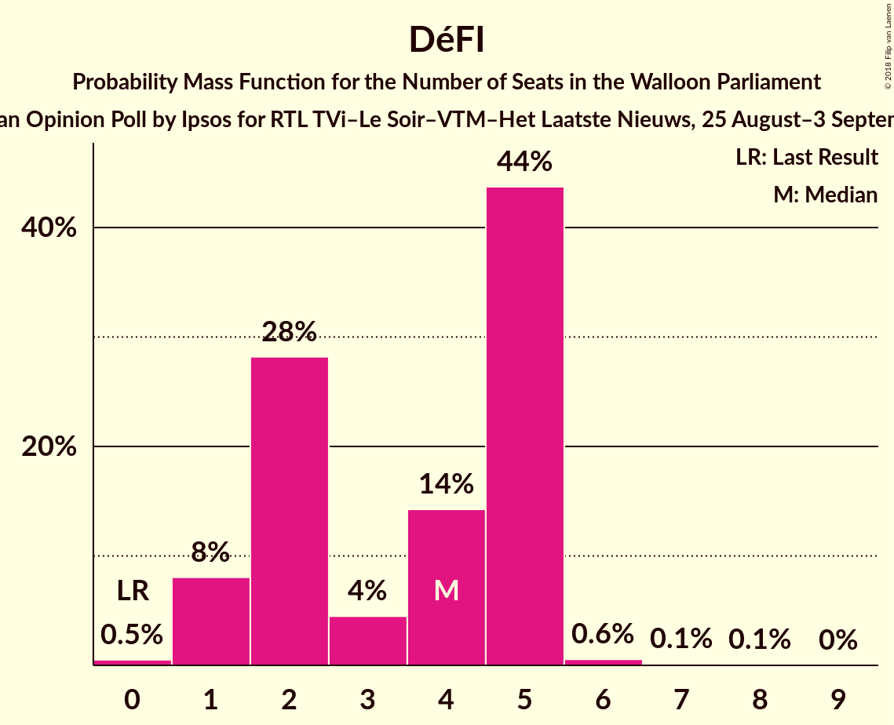

| Number of Seats | Probability | Accumulated | Special Marks |
|:---------------:|:-----------:|:-----------:|:-------------:|
| 0 | 0.5% | 100% | Last Result |
| 1 | 8% | 99.5% |  |
| 2 | 28% | 91% |  |
| 3 | 4% | 63% |  |
| 4 | 14% | 59% | Median |
| 5 | 44% | 44% |  |
| 6 | 0.6% | 0.8% |  |
| 7 | 0.1% | 0.2% |  |
| 8 | 0.1% | 0.1% |  |
| 9 | 0% | 0% |  |

### Parti Populaire

*For a full overview of the results for this party, see the [Parti Populaire](party-partipopulaire.html) page.*

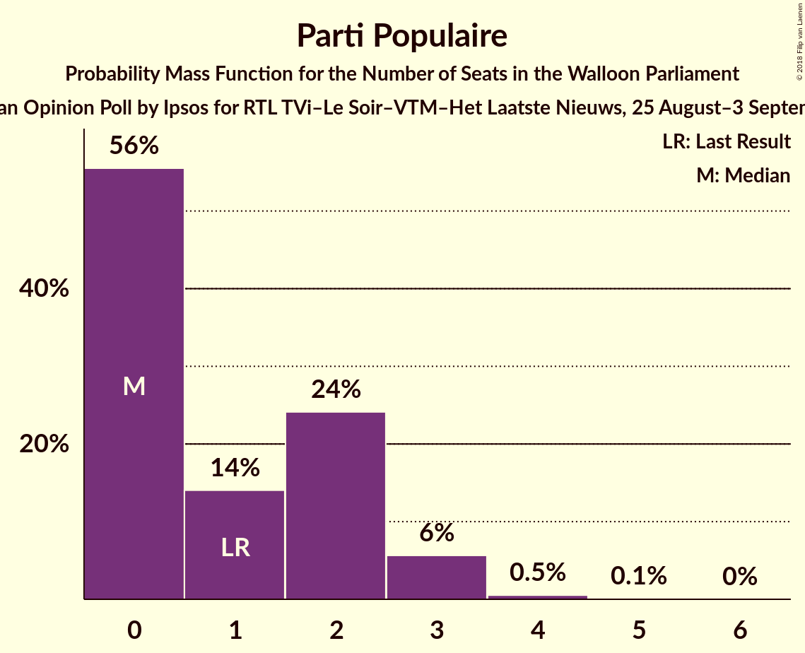

| Number of Seats | Probability | Accumulated | Special Marks |
|:---------------:|:-----------:|:-----------:|:-------------:|
| 0 | 56% | 100% | Median |
| 1 | 14% | 44% | Last Result |
| 2 | 24% | 30% |  |
| 3 | 6% | 6% |  |
| 4 | 0.5% | 0.7% |  |
| 5 | 0.1% | 0.1% |  |
| 6 | 0% | 0% |  |

### La Droite

*For a full overview of the results for this party, see the [La Droite](party-ladroite.html) page.*

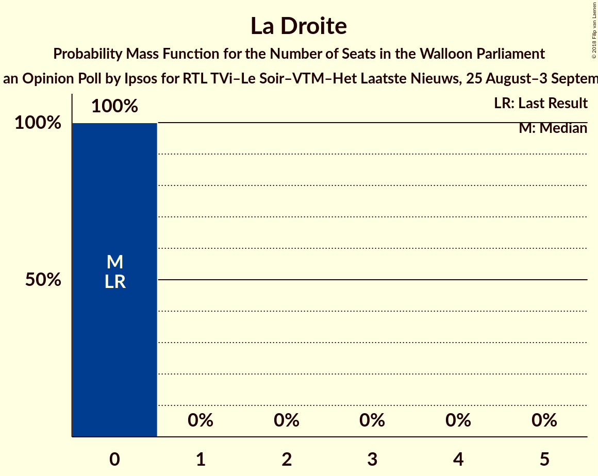

| Number of Seats | Probability | Accumulated | Special Marks |
|:---------------:|:-----------:|:-----------:|:-------------:|
| 0 | 100% | 100% | Last Result, Median |

## Coalitions

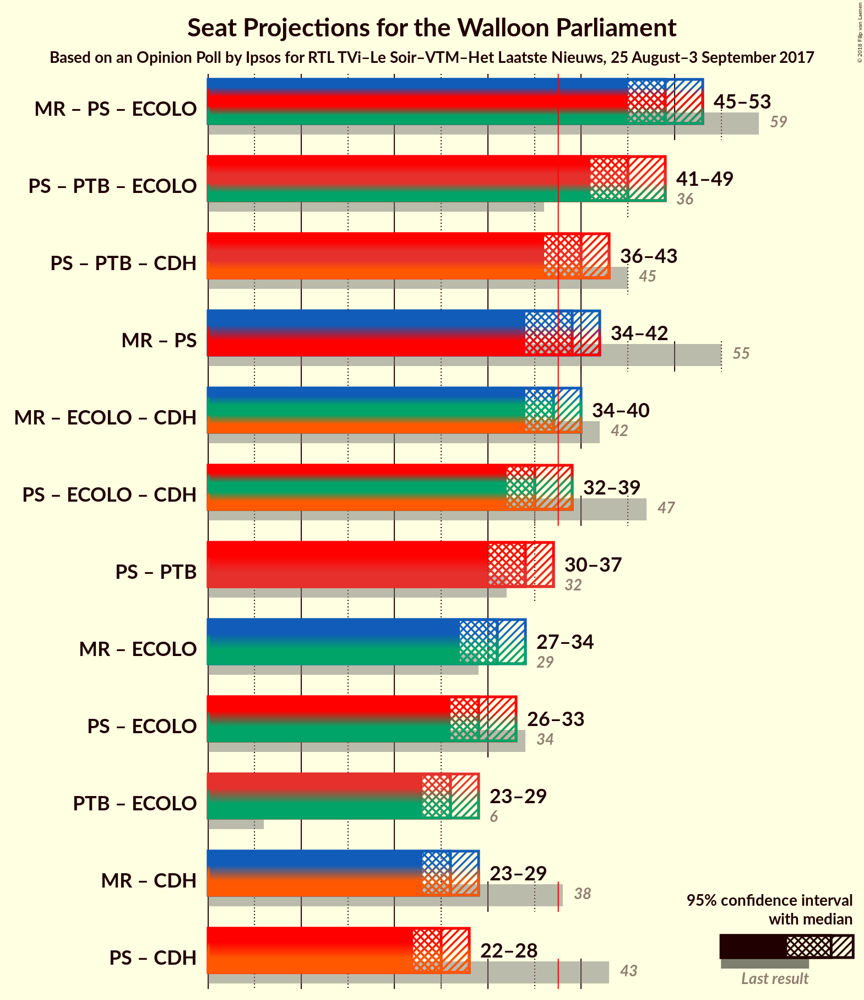

### Confidence Intervals

| Coalition | Last Result | Median | Majority? | 80% Confidence Interval | 90% Confidence Interval | 95% Confidence Interval | 99% Confidence Interval |
|:---------:|:-----------:|:------:|:---------:|:-----------------------:|:-----------------------:|:-----------------------:|:-----------------------:|
| MR – PS – Ecolo | 59 | 49 | 100% | 47–52 | 46–53 | 45–53 | 44–54 |
| PS – PTB – Ecolo | 36 | 45 | 100% | 42–48 | 42–48 | 41–49 | 40–49 |
| PS – PTB – cdH | 45 | 40 | 87% | 37–42 | 37–43 | 36–43 | 35–45 |
| MR – PS | 55 | 39 | 64% | 36–41 | 35–41 | 34–42 | 34–43 |
| MR – Ecolo – cdH | 42 | 37 | 35% | 35–39 | 34–40 | 34–40 | 33–42 |
| PS – Ecolo – cdH | 47 | 35 | 17% | 33–38 | 33–39 | 32–39 | 31–40 |
| PS – PTB | 32 | 34 | 1.4% | 31–36 | 31–37 | 30–37 | 29–38 |
| MR – Ecolo | 29 | 31 | 0% | 29–33 | 28–33 | 27–34 | 26–35 |
| PS – Ecolo | 34 | 29 | 0% | 27–32 | 27–33 | 26–33 | 25–34 |
| PTB – Ecolo | 6 | 26 | 0% | 24–28 | 24–29 | 23–29 | 22–30 |
| MR – cdH | 38 | 26 | 0% | 24–28 | 23–29 | 23–29 | 22–30 |
| PS – cdH | 43 | 25 | 0% | 22–27 | 22–27 | 22–28 | 21–30 |

### MR – PS – Ecolo

| Number of Seats | Probability | Accumulated | Special Marks |
|:---------------:|:-----------:|:-----------:|:-------------:|
| 43 | 0.3% | 100% |  |
| 44 | 0.6% | 99.7% |  |
| 45 | 2% | 99.1% |  |
| 46 | 5% | 97% |  |
| 47 | 13% | 92% |  |
| 48 | 14% | 80% |  |
| 49 | 19% | 66% | Median |
| 50 | 17% | 47% |  |
| 51 | 14% | 30% |  |
| 52 | 9% | 16% |  |
| 53 | 6% | 7% |  |
| 54 | 1.0% | 1.2% |  |
| 55 | 0.2% | 0.2% |  |
| 56 | 0% | 0% |  |
| 57 | 0% | 0% |  |
| 58 | 0% | 0% |  |
| 59 | 0% | 0% | Last Result |

### PS – PTB – Ecolo

| Number of Seats | Probability | Accumulated | Special Marks |
|:---------------:|:-----------:|:-----------:|:-------------:|
| 36 | 0% | 100% | Last Result |
| 37 | 0% | 100% |  |
| 38 | 0.1% | 100% | Majority |
| 39 | 0.3% | 99.9% |  |
| 40 | 1.1% | 99.7% |  |
| 41 | 3% | 98.5% |  |
| 42 | 11% | 95% |  |
| 43 | 15% | 84% |  |
| 44 | 17% | 69% | Median |
| 45 | 20% | 52% |  |
| 46 | 11% | 32% |  |
| 47 | 11% | 21% |  |
| 48 | 7% | 11% |  |
| 49 | 3% | 4% |  |
| 50 | 0.4% | 0.4% |  |
| 51 | 0% | 0% |  |

### PS – PTB – cdH

| Number of Seats | Probability | Accumulated | Special Marks |
|:---------------:|:-----------:|:-----------:|:-------------:|
| 34 | 0.1% | 100% |  |
| 35 | 1.2% | 99.9% |  |
| 36 | 3% | 98.7% |  |
| 37 | 8% | 95% |  |
| 38 | 16% | 87% | Majority |
| 39 | 16% | 71% | Median |
| 40 | 20% | 55% |  |
| 41 | 14% | 35% |  |
| 42 | 12% | 21% |  |
| 43 | 7% | 9% |  |
| 44 | 2% | 2% |  |
| 45 | 0.4% | 0.7% | Last Result |
| 46 | 0.2% | 0.3% |  |
| 47 | 0.1% | 0.1% |  |
| 48 | 0% | 0% |  |

### MR – PS

| Number of Seats | Probability | Accumulated | Special Marks |
|:---------------:|:-----------:|:-----------:|:-------------:|
| 32 | 0% | 100% |  |
| 33 | 0.2% | 99.9% |  |
| 34 | 2% | 99.7% |  |
| 35 | 5% | 97% |  |
| 36 | 12% | 92% |  |
| 37 | 16% | 80% |  |
| 38 | 14% | 64% | Median, Majority |
| 39 | 20% | 51% |  |
| 40 | 14% | 31% |  |
| 41 | 14% | 17% |  |
| 42 | 3% | 3% |  |
| 43 | 0.5% | 0.5% |  |
| 44 | 0.1% | 0.1% |  |
| 45 | 0% | 0% |  |
| 46 | 0% | 0% |  |
| 47 | 0% | 0% |  |
| 48 | 0% | 0% |  |
| 49 | 0% | 0% |  |
| 50 | 0% | 0% |  |
| 51 | 0% | 0% |  |
| 52 | 0% | 0% |  |
| 53 | 0% | 0% |  |
| 54 | 0% | 0% |  |
| 55 | 0% | 0% | Last Result |

### MR – Ecolo – cdH

| Number of Seats | Probability | Accumulated | Special Marks |
|:---------------:|:-----------:|:-----------:|:-------------:|
| 32 | 0.2% | 100% |  |
| 33 | 2% | 99.7% |  |
| 34 | 4% | 98% |  |
| 35 | 13% | 94% |  |
| 36 | 25% | 81% |  |
| 37 | 22% | 56% | Median |
| 38 | 17% | 35% | Majority |
| 39 | 11% | 17% |  |
| 40 | 4% | 6% |  |
| 41 | 1.4% | 2% |  |
| 42 | 0.8% | 0.8% | Last Result |
| 43 | 0.1% | 0.1% |  |
| 44 | 0% | 0% |  |

### PS – Ecolo – cdH

| Number of Seats | Probability | Accumulated | Special Marks |
|:---------------:|:-----------:|:-----------:|:-------------:|
| 30 | 0.2% | 100% |  |
| 31 | 0.5% | 99.8% |  |
| 32 | 4% | 99.3% |  |
| 33 | 8% | 96% |  |
| 34 | 15% | 88% |  |
| 35 | 24% | 72% | Median |
| 36 | 16% | 48% |  |
| 37 | 15% | 32% |  |
| 38 | 12% | 17% | Majority |
| 39 | 4% | 6% |  |
| 40 | 1.3% | 2% |  |
| 41 | 0.3% | 0.4% |  |
| 42 | 0.1% | 0.2% |  |
| 43 | 0% | 0% |  |
| 44 | 0% | 0% |  |
| 45 | 0% | 0% |  |
| 46 | 0% | 0% |  |
| 47 | 0% | 0% | Last Result |

### PS – PTB

| Number of Seats | Probability | Accumulated | Special Marks |
|:---------------:|:-----------:|:-----------:|:-------------:|
| 28 | 0.1% | 100% |  |
| 29 | 1.0% | 99.9% |  |
| 30 | 3% | 98.9% |  |
| 31 | 10% | 96% |  |
| 32 | 17% | 86% | Last Result |
| 33 | 15% | 69% | Median |
| 34 | 19% | 54% |  |
| 35 | 16% | 35% |  |
| 36 | 11% | 19% |  |
| 37 | 7% | 8% |  |
| 38 | 1.4% | 1.4% | Majority |
| 39 | 0.1% | 0.1% |  |
| 40 | 0% | 0% |  |

### MR – Ecolo

| Number of Seats | Probability | Accumulated | Special Marks |
|:---------------:|:-----------:|:-----------:|:-------------:|
| 25 | 0.1% | 100% |  |
| 26 | 0.7% | 99.8% |  |
| 27 | 2% | 99.1% |  |
| 28 | 4% | 97% |  |
| 29 | 10% | 93% | Last Result |
| 30 | 26% | 83% |  |
| 31 | 24% | 56% | Median |
| 32 | 17% | 32% |  |
| 33 | 11% | 15% |  |
| 34 | 3% | 5% |  |
| 35 | 1.2% | 2% |  |
| 36 | 0.4% | 0.4% |  |
| 37 | 0% | 0% |  |

### PS – Ecolo

| Number of Seats | Probability | Accumulated | Special Marks |
|:---------------:|:-----------:|:-----------:|:-------------:|
| 23 | 0% | 100% |  |
| 24 | 0.3% | 99.9% |  |
| 25 | 0.9% | 99.7% |  |
| 26 | 3% | 98.8% |  |
| 27 | 8% | 96% |  |
| 28 | 19% | 88% |  |
| 29 | 21% | 69% | Median |
| 30 | 18% | 48% |  |
| 31 | 13% | 29% |  |
| 32 | 10% | 16% |  |
| 33 | 5% | 6% |  |
| 34 | 0.9% | 1.0% | Last Result |
| 35 | 0% | 0.1% |  |
| 36 | 0% | 0% |  |

### PTB – Ecolo

| Number of Seats | Probability | Accumulated | Special Marks |
|:---------------:|:-----------:|:-----------:|:-------------:|
| 6 | 0% | 100% | Last Result |
| 7 | 0% | 100% |  |
| 8 | 0% | 100% |  |
| 9 | 0% | 100% |  |
| 10 | 0% | 100% |  |
| 11 | 0% | 100% |  |
| 12 | 0% | 100% |  |
| 13 | 0% | 100% |  |
| 14 | 0% | 100% |  |
| 15 | 0% | 100% |  |
| 16 | 0% | 100% |  |
| 17 | 0% | 100% |  |
| 18 | 0% | 100% |  |
| 19 | 0% | 100% |  |
| 20 | 0.1% | 100% |  |
| 21 | 0.3% | 99.9% |  |
| 22 | 1.0% | 99.7% |  |
| 23 | 4% | 98.7% |  |
| 24 | 10% | 95% |  |
| 25 | 20% | 85% |  |
| 26 | 27% | 65% | Median |
| 27 | 18% | 38% |  |
| 28 | 11% | 20% |  |
| 29 | 8% | 10% |  |
| 30 | 2% | 2% |  |
| 31 | 0.2% | 0.2% |  |
| 32 | 0% | 0% |  |

### MR – cdH

| Number of Seats | Probability | Accumulated | Special Marks |
|:---------------:|:-----------:|:-----------:|:-------------:|
| 21 | 0.2% | 100% |  |
| 22 | 1.0% | 99.8% |  |
| 23 | 5% | 98.8% |  |
| 24 | 12% | 94% |  |
| 25 | 23% | 82% |  |
| 26 | 26% | 59% | Median |
| 27 | 15% | 33% |  |
| 28 | 11% | 17% |  |
| 29 | 5% | 6% |  |
| 30 | 1.4% | 2% |  |
| 31 | 0.2% | 0.3% |  |
| 32 | 0% | 0% |  |
| 33 | 0% | 0% |  |
| 34 | 0% | 0% |  |
| 35 | 0% | 0% |  |
| 36 | 0% | 0% |  |
| 37 | 0% | 0% |  |
| 38 | 0% | 0% | Last Result, Majority |

### PS – cdH

| Number of Seats | Probability | Accumulated | Special Marks |
|:---------------:|:-----------:|:-----------:|:-------------:|
| 20 | 0.2% | 100% |  |
| 21 | 1.0% | 99.8% |  |
| 22 | 9% | 98.8% |  |
| 23 | 16% | 90% |  |
| 24 | 24% | 74% | Median |
| 25 | 23% | 50% |  |
| 26 | 13% | 28% |  |
| 27 | 11% | 15% |  |
| 28 | 2% | 4% |  |
| 29 | 0.7% | 1.3% |  |
| 30 | 0.4% | 0.6% |  |
| 31 | 0.2% | 0.2% |  |
| 32 | 0% | 0% |  |
| 33 | 0% | 0% |  |
| 34 | 0% | 0% |  |
| 35 | 0% | 0% |  |
| 36 | 0% | 0% |  |
| 37 | 0% | 0% |  |
| 38 | 0% | 0% | Majority |
| 39 | 0% | 0% |  |
| 40 | 0% | 0% |  |
| 41 | 0% | 0% |  |
| 42 | 0% | 0% |  |
| 43 | 0% | 0% | Last Result |

## Technical Information

### Opinion Poll

+ **Polling firm:** Ipsos
+ **Commissioner(s):** RTL TVi–Le Soir–VTM–Het Laatste Nieuws
+ **Fieldwork period:** 25 August–3 September 2017

### Calculations

+ **Sample size:** 960
+ **Simulations done:** 2,097,152
+ **Error estimate:** 0.76%

