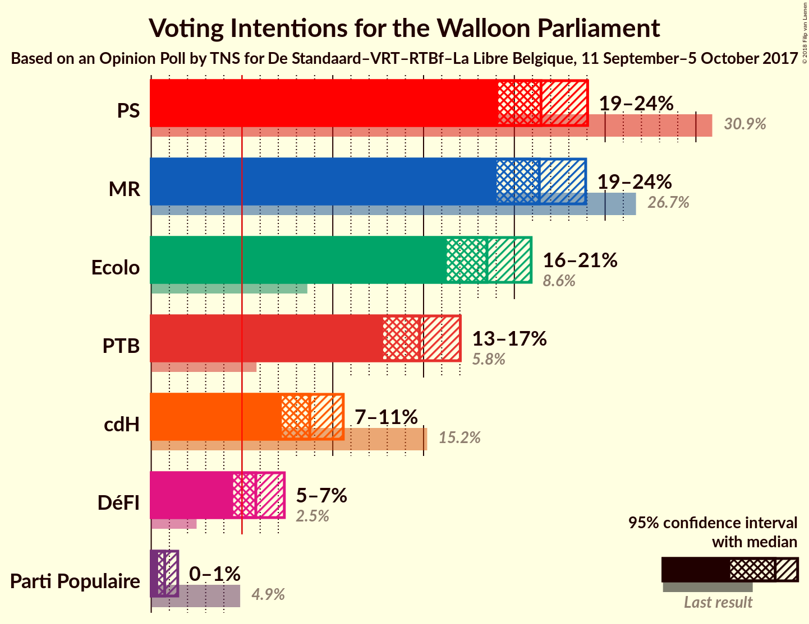
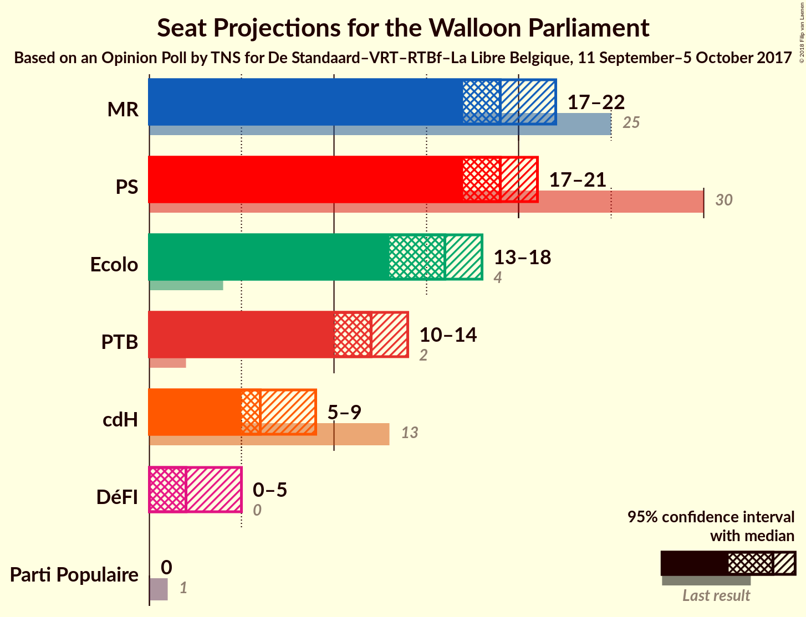
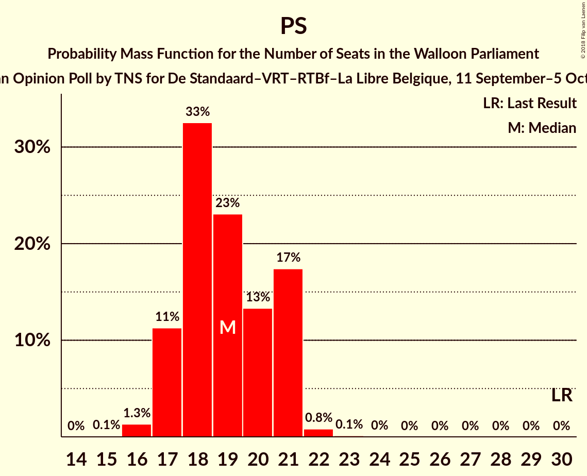
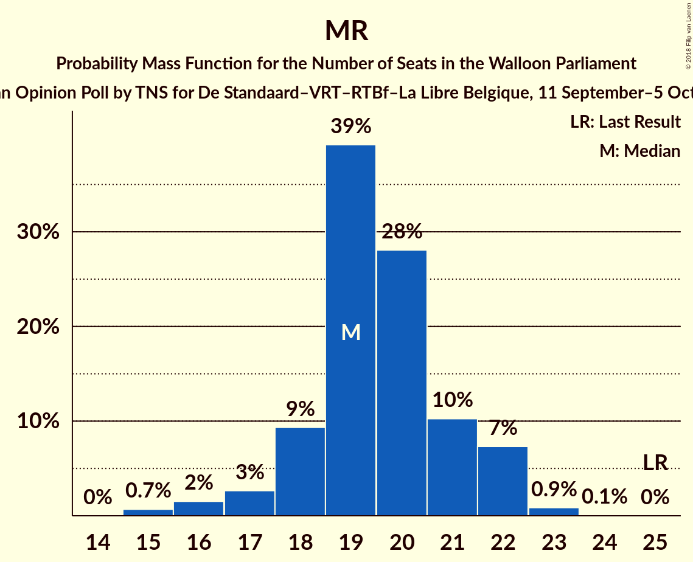
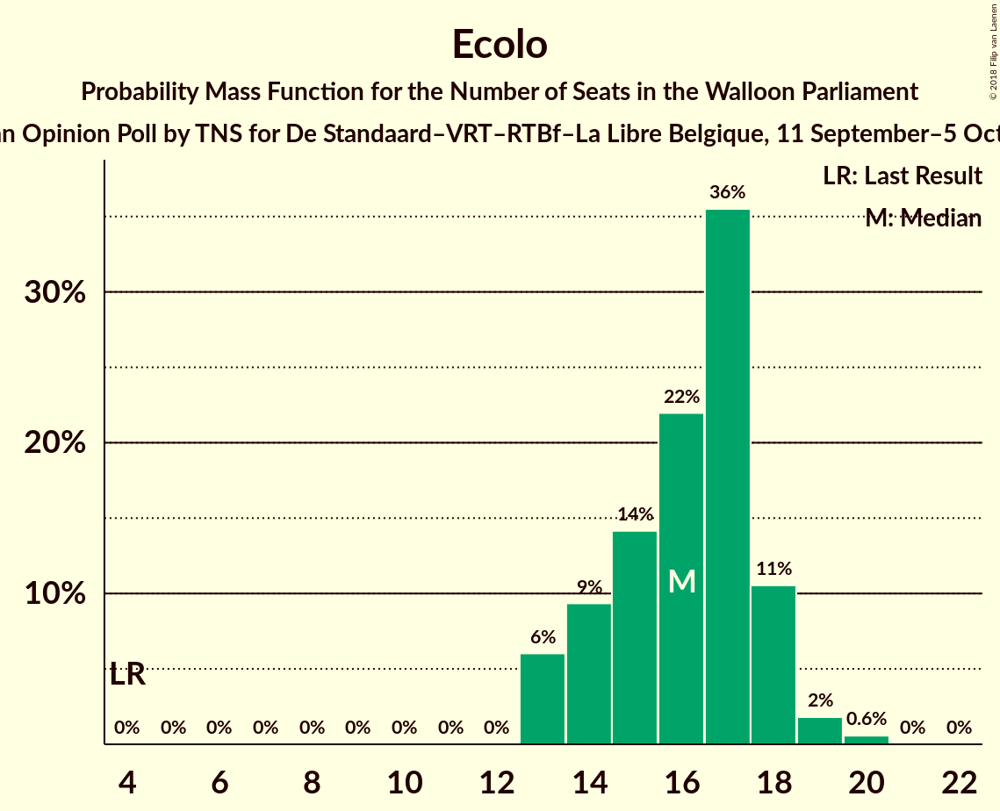
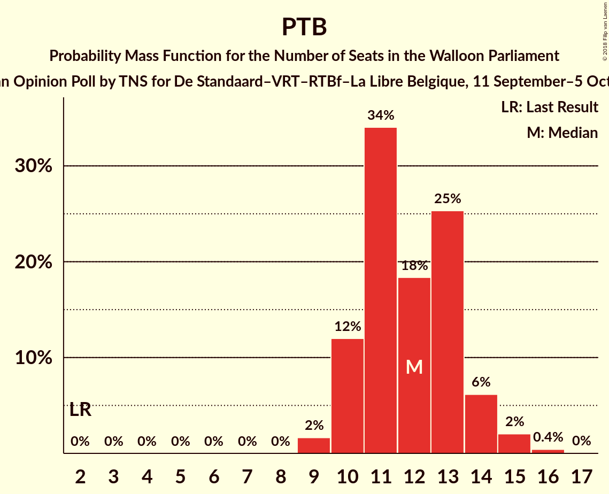
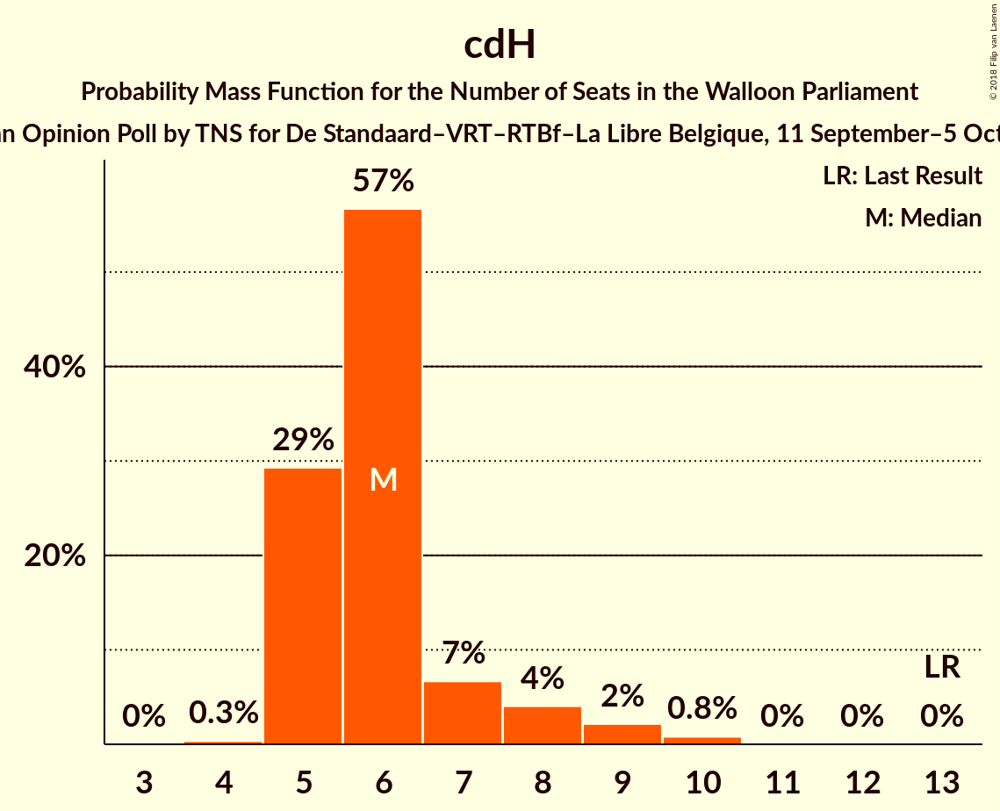
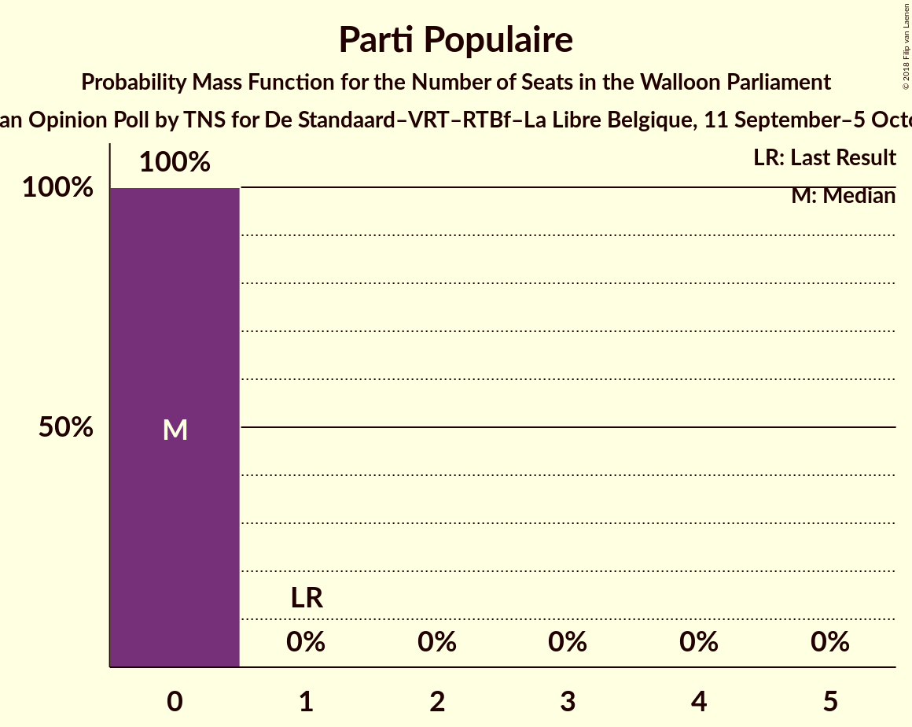
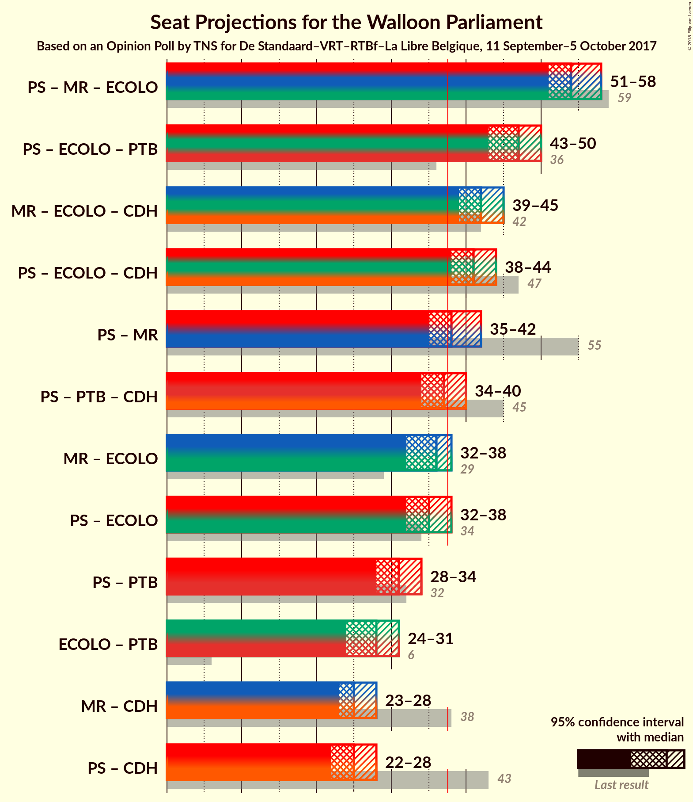

# Opinion Poll by TNS for De Standaard–VRT–RTBf–La Libre Belgique, 11 September–5 October 2017

<a href="#voting-intentions">Voting Intentions</a> | <a href="#seats">Seats</a> | <a href="#coalitions">Coalitions</a> | <a href="#technical-information">Technical Information</a>

## Voting Intentions

### Confidence Intervals

| Party | Last Result | Poll Result | 80% Confidence Interval | 90% Confidence Interval | 95% Confidence Interval | 99% Confidence Interval |
|:-----:|:-----------:|:-----------:|:-----------------------:|:-----------------------:|:-----------------------:|:-----------------------:|
| PS | 30.9% | 21.5% | 19.9–23.1% |19.5–23.6% |19.1–24.0% |18.4–24.8% |
| MR | 26.7% | 21.4% | 19.8–23.0% |19.4–23.5% |19.0–23.9% |18.3–24.8% |
| Ecolo | 8.6% | 18.5% | 17.0–20.1% |16.6–20.5% |16.3–20.9% |15.6–21.7% |
| PTB | 5.8% | 14.8% | 13.5–16.2% |13.1–16.7% |12.8–17.0% |12.2–17.8% |
| cdH | 15.2% | 8.7% | 7.7–9.9% |7.4–10.3% |7.2–10.6% |6.7–11.2% |
| DéFI | 2.5% | 5.8% | 4.9–6.8% |4.7–7.1% |4.5–7.3% |4.1–7.8% |
| Parti Populaire | 4.9% | 0.7% | 0.5–1.2% |0.4–1.3% |0.4–1.5% |0.3–1.7% |

*Note:* The poll result column reflects the actual value used in the calculations. Published results may vary slightly, and in addition be rounded to fewer digits.

## Seats

### Confidence Intervals

| Party | Last Result | Median | 80% Confidence Interval | 90% Confidence Interval | 95% Confidence Interval | 99% Confidence Interval |
|:-----:|:-----------:|:------:|:-----------------------:|:-----------------------:|:-----------------------:|:-----------------------:|
| <a href="#ps">PS</a> | 30 | 19 | 17–21 |17–21 |17–21 |16–22 |
| <a href="#mr">MR</a> | 25 | 19 | 18–21 |18–22 |17–22 |15–23 |
| <a href="#ecolo">Ecolo</a> | 4 | 16 | 14–18 |13–18 |13–18 |13–20 |
| <a href="#ptb">PTB</a> | 2 | 12 | 10–13 |10–14 |10–14 |9–15 |
| <a href="#cdh">cdH</a> | 13 | 6 | 5–7 |5–8 |5–9 |5–10 |
| <a href="#défi">DéFI</a> | 0 | 2 | 1–5 |1–5 |0–5 |0–5 |
| <a href="#parti-populaire">Parti Populaire</a> | 1 | 0 | 0 |0 |0 |0 |

### PS

*For a full overview of the results for this party, see the [PS](party-ps.html) page.*

| Number of Seats | Probability | Accumulated | Special Marks |
|:---------------:|:-----------:|:-----------:|:-------------:|
| 15 | 0.1% | 100% |  |
| 16 | 1.3% | 99.9% |  |
| 17 | 11% | 98.6% |  |
| 18 | 33% | 87% |  |
| 19 | 23% | 55% | Median |
| 20 | 13% | 32% |  |
| 21 | 17% | 18% |  |
| 22 | 0.8% | 1.0% |  |
| 23 | 0.1% | 0.2% |  |
| 24 | 0% | 0% |  |
| 25 | 0% | 0% |  |
| 26 | 0% | 0% |  |
| 27 | 0% | 0% |  |
| 28 | 0% | 0% |  |
| 29 | 0% | 0% |  |
| 30 | 0% | 0% | Last Result |

### MR

*For a full overview of the results for this party, see the [MR](party-mr.html) page.*

| Number of Seats | Probability | Accumulated | Special Marks |
|:---------------:|:-----------:|:-----------:|:-------------:|
| 15 | 0.7% | 100% |  |
| 16 | 2% | 99.3% |  |
| 17 | 3% | 98% |  |
| 18 | 9% | 95% |  |
| 19 | 39% | 86% | Median |
| 20 | 28% | 47% |  |
| 21 | 10% | 19% |  |
| 22 | 7% | 8% |  |
| 23 | 0.9% | 1.0% |  |
| 24 | 0.1% | 0.1% |  |
| 25 | 0% | 0% | Last Result |

### Ecolo

*For a full overview of the results for this party, see the [Ecolo](party-ecolo.html) page.*

| Number of Seats | Probability | Accumulated | Special Marks |
|:---------------:|:-----------:|:-----------:|:-------------:|
| 4 | 0% | 100% | Last Result |
| 5 | 0% | 100% |  |
| 6 | 0% | 100% |  |
| 7 | 0% | 100% |  |
| 8 | 0% | 100% |  |
| 9 | 0% | 100% |  |
| 10 | 0% | 100% |  |
| 11 | 0% | 100% |  |
| 12 | 0% | 100% |  |
| 13 | 6% | 100% |  |
| 14 | 9% | 94% |  |
| 15 | 14% | 85% |  |
| 16 | 22% | 70% | Median |
| 17 | 36% | 48% |  |
| 18 | 11% | 13% |  |
| 19 | 2% | 2% |  |
| 20 | 0.6% | 0.6% |  |
| 21 | 0% | 0% |  |

### PTB

*For a full overview of the results for this party, see the [PTB](party-ptb.html) page.*

| Number of Seats | Probability | Accumulated | Special Marks |
|:---------------:|:-----------:|:-----------:|:-------------:|
| 2 | 0% | 100% | Last Result |
| 3 | 0% | 100% |  |
| 4 | 0% | 100% |  |
| 5 | 0% | 100% |  |
| 6 | 0% | 100% |  |
| 7 | 0% | 100% |  |
| 8 | 0% | 100% |  |
| 9 | 2% | 100% |  |
| 10 | 12% | 98% |  |
| 11 | 34% | 86% |  |
| 12 | 18% | 52% | Median |
| 13 | 25% | 34% |  |
| 14 | 6% | 9% |  |
| 15 | 2% | 2% |  |
| 16 | 0.4% | 0.4% |  |
| 17 | 0% | 0% |  |

### cdH

*For a full overview of the results for this party, see the [cdH](party-cdh.html) page.*

| Number of Seats | Probability | Accumulated | Special Marks |
|:---------------:|:-----------:|:-----------:|:-------------:|
| 4 | 0.3% | 100% |  |
| 5 | 29% | 99.7% |  |
| 6 | 57% | 70% | Median |
| 7 | 7% | 14% |  |
| 8 | 4% | 7% |  |
| 9 | 2% | 3% |  |
| 10 | 0.8% | 0.8% |  |
| 11 | 0% | 0% |  |
| 12 | 0% | 0% |  |
| 13 | 0% | 0% | Last Result |

### DéFI

*For a full overview of the results for this party, see the [DéFI](party-défi.html) page.*

| Number of Seats | Probability | Accumulated | Special Marks |
|:---------------:|:-----------:|:-----------:|:-------------:|
| 0 | 3% | 100% | Last Result |
| 1 | 17% | 97% |  |
| 2 | 40% | 81% | Median |
| 3 | 7% | 40% |  |
| 4 | 19% | 33% |  |
| 5 | 14% | 14% |  |
| 6 | 0% | 0% |  |

### Parti Populaire

*For a full overview of the results for this party, see the [Parti Populaire](party-partipopulaire.html) page.*

| Number of Seats | Probability | Accumulated | Special Marks |
|:---------------:|:-----------:|:-----------:|:-------------:|
| 0 | 100% | 100% | Median |
| 1 | 0% | 0% | Last Result |

## Coalitions

### Confidence Intervals

| Coalition | Last Result | Median | Majority? | 80% Confidence Interval | 90% Confidence Interval | 95% Confidence Interval | 99% Confidence Interval |
|:---------:|:-----------:|:------:|:---------:|:-----------------------:|:-----------------------:|:-----------------------:|:-----------------------:|
| PS – MR – Ecolo | 59 | 54 | 100% | 53–57 | 52–57 | 51–58 | 50–58 |
| PS – Ecolo – PTB | 36 | 47 | 100% | 44–49 | 44–50 | 43–50 | 42–51 |
| MR – Ecolo – cdH | 42 | 42 | 99.3% | 40–43 | 39–44 | 39–45 | 37–45 |
| PS – Ecolo – cdH | 47 | 41 | 98% | 39–43 | 38–44 | 38–44 | 36–45 |
| PS – MR | 55 | 38 | 68% | 36–41 | 36–41 | 35–42 | 34–43 |
| PS – PTB – cdH | 45 | 37 | 29% | 35–39 | 34–40 | 34–40 | 33–41 |
| MR – Ecolo | 29 | 36 | 8% | 34–37 | 33–38 | 32–38 | 31–39 |
| PS – Ecolo | 34 | 35 | 10% | 33–38 | 32–38 | 32–38 | 30–39 |
| PS – PTB | 32 | 31 | 0% | 29–33 | 28–33 | 28–34 | 27–35 |
| Ecolo – PTB | 6 | 28 | 0% | 26–30 | 25–31 | 24–31 | 23–32 |
| MR – cdH | 38 | 25 | 0% | 24–28 | 23–28 | 23–28 | 21–29 |
| PS – cdH | 43 | 25 | 0% | 23–27 | 23–27 | 22–28 | 22–29 |

### PS – MR – Ecolo

| Number of Seats | Probability | Accumulated | Special Marks |
|:---------------:|:-----------:|:-----------:|:-------------:|
| 48 | 0.1% | 100% |  |
| 49 | 0.4% | 99.9% |  |
| 50 | 1.0% | 99.5% |  |
| 51 | 2% | 98.5% |  |
| 52 | 6% | 96% |  |
| 53 | 17% | 91% |  |
| 54 | 24% | 74% | Median |
| 55 | 19% | 50% |  |
| 56 | 17% | 31% |  |
| 57 | 10% | 14% |  |
| 58 | 3% | 4% |  |
| 59 | 0.4% | 0.4% | Last Result |
| 60 | 0.1% | 0.1% |  |
| 61 | 0% | 0% |  |

### PS – Ecolo – PTB

| Number of Seats | Probability | Accumulated | Special Marks |
|:---------------:|:-----------:|:-----------:|:-------------:|
| 36 | 0% | 100% | Last Result |
| 37 | 0% | 100% |  |
| 38 | 0% | 100% | Majority |
| 39 | 0% | 100% |  |
| 40 | 0% | 100% |  |
| 41 | 0.1% | 100% |  |
| 42 | 0.7% | 99.9% |  |
| 43 | 2% | 99.3% |  |
| 44 | 8% | 97% |  |
| 45 | 13% | 90% |  |
| 46 | 17% | 77% |  |
| 47 | 20% | 60% | Median |
| 48 | 23% | 40% |  |
| 49 | 12% | 17% |  |
| 50 | 4% | 5% |  |
| 51 | 0.8% | 1.2% |  |
| 52 | 0.3% | 0.4% |  |
| 53 | 0.1% | 0.1% |  |
| 54 | 0% | 0% |  |

### MR – Ecolo – cdH

| Number of Seats | Probability | Accumulated | Special Marks |
|:---------------:|:-----------:|:-----------:|:-------------:|
| 36 | 0.1% | 100% |  |
| 37 | 0.5% | 99.8% |  |
| 38 | 1.5% | 99.3% | Majority |
| 39 | 8% | 98% |  |
| 40 | 11% | 90% |  |
| 41 | 20% | 79% | Median |
| 42 | 35% | 59% | Last Result |
| 43 | 14% | 24% |  |
| 44 | 7% | 9% |  |
| 45 | 2% | 3% |  |
| 46 | 0.4% | 0.5% |  |
| 47 | 0.1% | 0.1% |  |
| 48 | 0% | 0% |  |

### PS – Ecolo – cdH

| Number of Seats | Probability | Accumulated | Special Marks |
|:---------------:|:-----------:|:-----------:|:-------------:|
| 35 | 0.1% | 100% |  |
| 36 | 0.5% | 99.9% |  |
| 37 | 2% | 99.5% |  |
| 38 | 7% | 98% | Majority |
| 39 | 11% | 91% |  |
| 40 | 18% | 79% |  |
| 41 | 25% | 62% | Median |
| 42 | 16% | 37% |  |
| 43 | 11% | 21% |  |
| 44 | 8% | 10% |  |
| 45 | 2% | 2% |  |
| 46 | 0.3% | 0.5% |  |
| 47 | 0.1% | 0.1% | Last Result |
| 48 | 0% | 0% |  |

### PS – MR

| Number of Seats | Probability | Accumulated | Special Marks |
|:---------------:|:-----------:|:-----------:|:-------------:|
| 32 | 0.1% | 100% |  |
| 33 | 0.3% | 99.9% |  |
| 34 | 0.7% | 99.7% |  |
| 35 | 2% | 99.0% |  |
| 36 | 10% | 97% |  |
| 37 | 19% | 87% |  |
| 38 | 21% | 68% | Median, Majority |
| 39 | 18% | 47% |  |
| 40 | 14% | 29% |  |
| 41 | 11% | 14% |  |
| 42 | 3% | 4% |  |
| 43 | 0.6% | 0.7% |  |
| 44 | 0.1% | 0.1% |  |
| 45 | 0% | 0% |  |
| 46 | 0% | 0% |  |
| 47 | 0% | 0% |  |
| 48 | 0% | 0% |  |
| 49 | 0% | 0% |  |
| 50 | 0% | 0% |  |
| 51 | 0% | 0% |  |
| 52 | 0% | 0% |  |
| 53 | 0% | 0% |  |
| 54 | 0% | 0% |  |
| 55 | 0% | 0% | Last Result |

### PS – PTB – cdH

| Number of Seats | Probability | Accumulated | Special Marks |
|:---------------:|:-----------:|:-----------:|:-------------:|
| 32 | 0.2% | 100% |  |
| 33 | 2% | 99.8% |  |
| 34 | 5% | 98% |  |
| 35 | 13% | 93% |  |
| 36 | 29% | 80% |  |
| 37 | 22% | 50% | Median |
| 38 | 17% | 29% | Majority |
| 39 | 7% | 12% |  |
| 40 | 3% | 5% |  |
| 41 | 1.3% | 2% |  |
| 42 | 0.4% | 0.4% |  |
| 43 | 0% | 0.1% |  |
| 44 | 0% | 0% |  |
| 45 | 0% | 0% | Last Result |

### MR – Ecolo

| Number of Seats | Probability | Accumulated | Special Marks |
|:---------------:|:-----------:|:-----------:|:-------------:|
| 29 | 0.1% | 100% | Last Result |
| 30 | 0.2% | 99.9% |  |
| 31 | 0.6% | 99.7% |  |
| 32 | 2% | 99.1% |  |
| 33 | 6% | 97% |  |
| 34 | 11% | 91% |  |
| 35 | 20% | 81% | Median |
| 36 | 34% | 61% |  |
| 37 | 19% | 27% |  |
| 38 | 6% | 8% | Majority |
| 39 | 2% | 2% |  |
| 40 | 0.2% | 0.2% |  |
| 41 | 0% | 0% |  |

### PS – Ecolo

| Number of Seats | Probability | Accumulated | Special Marks |
|:---------------:|:-----------:|:-----------:|:-------------:|
| 30 | 0.6% | 100% |  |
| 31 | 1.4% | 99.4% |  |
| 32 | 4% | 98% |  |
| 33 | 14% | 94% |  |
| 34 | 18% | 80% | Last Result |
| 35 | 24% | 62% | Median |
| 36 | 17% | 38% |  |
| 37 | 11% | 22% |  |
| 38 | 8% | 10% | Majority |
| 39 | 1.5% | 2% |  |
| 40 | 0.3% | 0.4% |  |
| 41 | 0.1% | 0.1% |  |
| 42 | 0% | 0% |  |

### PS – PTB

| Number of Seats | Probability | Accumulated | Special Marks |
|:---------------:|:-----------:|:-----------:|:-------------:|
| 26 | 0.2% | 100% |  |
| 27 | 1.0% | 99.8% |  |
| 28 | 6% | 98.9% |  |
| 29 | 13% | 93% |  |
| 30 | 22% | 80% |  |
| 31 | 30% | 58% | Median |
| 32 | 17% | 28% | Last Result |
| 33 | 7% | 11% |  |
| 34 | 3% | 5% |  |
| 35 | 1.0% | 1.4% |  |
| 36 | 0.3% | 0.4% |  |
| 37 | 0% | 0% |  |

### Ecolo – PTB

| Number of Seats | Probability | Accumulated | Special Marks |
|:---------------:|:-----------:|:-----------:|:-------------:|
| 6 | 0% | 100% | Last Result |
| 7 | 0% | 100% |  |
| 8 | 0% | 100% |  |
| 9 | 0% | 100% |  |
| 10 | 0% | 100% |  |
| 11 | 0% | 100% |  |
| 12 | 0% | 100% |  |
| 13 | 0% | 100% |  |
| 14 | 0% | 100% |  |
| 15 | 0% | 100% |  |
| 16 | 0% | 100% |  |
| 17 | 0% | 100% |  |
| 18 | 0% | 100% |  |
| 19 | 0% | 100% |  |
| 20 | 0% | 100% |  |
| 21 | 0% | 100% |  |
| 22 | 0% | 100% |  |
| 23 | 0.6% | 100% |  |
| 24 | 2% | 99.3% |  |
| 25 | 5% | 97% |  |
| 26 | 14% | 93% |  |
| 27 | 20% | 79% |  |
| 28 | 18% | 59% | Median |
| 29 | 20% | 41% |  |
| 30 | 15% | 21% |  |
| 31 | 4% | 6% |  |
| 32 | 1.1% | 1.4% |  |
| 33 | 0.3% | 0.3% |  |
| 34 | 0% | 0% |  |

### MR – cdH

| Number of Seats | Probability | Accumulated | Special Marks |
|:---------------:|:-----------:|:-----------:|:-------------:|
| 20 | 0.1% | 100% |  |
| 21 | 0.4% | 99.9% |  |
| 22 | 2% | 99.5% |  |
| 23 | 4% | 98% |  |
| 24 | 15% | 93% |  |
| 25 | 33% | 78% | Median |
| 26 | 25% | 46% |  |
| 27 | 10% | 20% |  |
| 28 | 8% | 10% |  |
| 29 | 2% | 2% |  |
| 30 | 0.4% | 0.5% |  |
| 31 | 0% | 0% |  |
| 32 | 0% | 0% |  |
| 33 | 0% | 0% |  |
| 34 | 0% | 0% |  |
| 35 | 0% | 0% |  |
| 36 | 0% | 0% |  |
| 37 | 0% | 0% |  |
| 38 | 0% | 0% | Last Result, Majority |

### PS – cdH

| Number of Seats | Probability | Accumulated | Special Marks |
|:---------------:|:-----------:|:-----------:|:-------------:|
| 21 | 0.2% | 100% |  |
| 22 | 5% | 99.8% |  |
| 23 | 14% | 95% |  |
| 24 | 25% | 82% |  |
| 25 | 24% | 57% | Median |
| 26 | 17% | 32% |  |
| 27 | 12% | 15% |  |
| 28 | 2% | 4% |  |
| 29 | 0.8% | 1.3% |  |
| 30 | 0.3% | 0.5% |  |
| 31 | 0.2% | 0.2% |  |
| 32 | 0% | 0% |  |
| 33 | 0% | 0% |  |
| 34 | 0% | 0% |  |
| 35 | 0% | 0% |  |
| 36 | 0% | 0% |  |
| 37 | 0% | 0% |  |
| 38 | 0% | 0% | Majority |
| 39 | 0% | 0% |  |
| 40 | 0% | 0% |  |
| 41 | 0% | 0% |  |
| 42 | 0% | 0% |  |
| 43 | 0% | 0% | Last Result |

## Technical Information

### Opinion Poll

+ **Polling firm:** TNS
+ **Commissioner(s):** De Standaard–VRT–RTBf–La Libre Belgique
+ **Fieldwork period:** 11 September–5 October 2017

### Calculations

+ **Sample size:** 1076
+ **Simulations done:** 2,097,152
+ **Error estimate:** 0.93%

