# Opinion Poll by Ipsos for Het Laatste Nieuws–Le Soir–RTL Tvi–VTM, 27 November–4 December 2017

<a href="#voting-intentions">Voting Intentions</a> | <a href="#seats">Seats</a> | <a href="#coalitions">Coalitions</a> | <a href="#technical-information">Technical Information</a>

## Voting Intentions

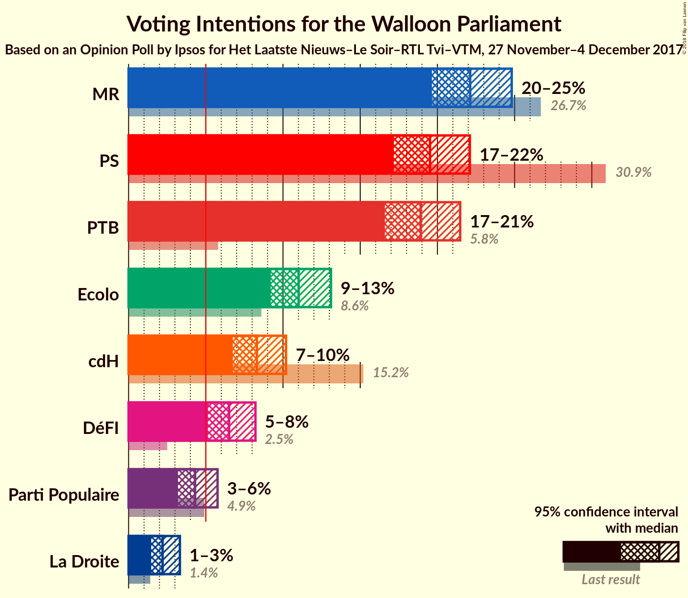

### Confidence Intervals

| Party | Last Result | Poll Result | 80% Confidence Interval | 90% Confidence Interval | 95% Confidence Interval | 99% Confidence Interval |
|:-----:|:-----------:|:-----------:|:-----------------------:|:-----------------------:|:-----------------------:|:-----------------------:|
| MR | 26.7% | 22.1% | 20.5–23.9% |20.0–24.4% |19.6–24.8% |18.9–25.7% |
| PS | 30.9% | 19.5% | 18.0–21.2% |17.5–21.7% |17.2–22.1% |16.5–22.9% |
| PTB | 5.8% | 18.9% | 17.4–20.6% |17.0–21.1% |16.6–21.5% |15.9–22.3% |
| Ecolo | 8.6% | 11.0% | 9.8–12.4% |9.5–12.8% |9.2–13.1% |8.7–13.8% |
| cdH | 15.2% | 8.3% | 7.3–9.5% |7.0–9.9% |6.8–10.2% |6.3–10.8% |
| DéFI | 2.5% | 6.5% | 5.6–7.6% |5.3–7.9% |5.1–8.2% |4.7–8.8% |
| Parti Populaire | 4.9% | 4.3% | 3.6–5.2% |3.4–5.5% |3.2–5.8% |2.9–6.2% |
| La Droite | 1.4% | 2.2% | 1.7–2.9% |1.6–3.1% |1.5–3.3% |1.2–3.7% |

*Note:* The poll result column reflects the actual value used in the calculations. Published results may vary slightly, and in addition be rounded to fewer digits.

## Seats

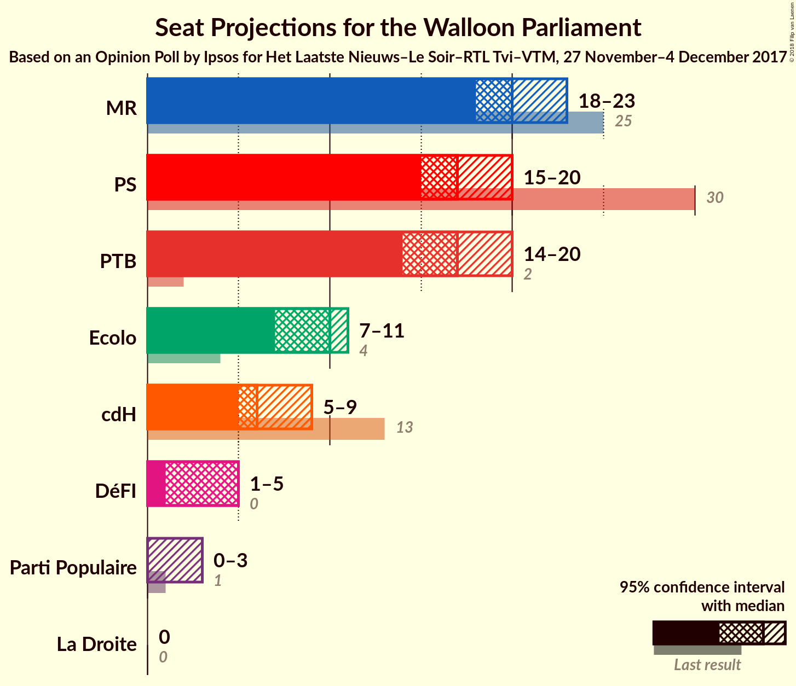

### Confidence Intervals

| Party | Last Result | Median | 80% Confidence Interval | 90% Confidence Interval | 95% Confidence Interval | 99% Confidence Interval |
|:-----:|:-----------:|:------:|:-----------------------:|:-----------------------:|:-----------------------:|:-----------------------:|
| <a href="#mr">MR</a> | 25 | 20 | 19–23 |19–23 |18–23 |17–24 |
| <a href="#ps">PS</a> | 30 | 17 | 16–19 |15–20 |15–20 |15–21 |
| <a href="#ptb">PTB</a> | 2 | 17 | 15–18 |15–19 |14–20 |13–20 |
| <a href="#ecolo">Ecolo</a> | 4 | 10 | 7–11 |7–11 |7–11 |6–12 |
| <a href="#cdh">cdH</a> | 13 | 6 | 5–7 |5–8 |5–9 |4–10 |
| <a href="#défi">DéFI</a> | 0 | 5 | 2–5 |2–5 |1–5 |1–6 |
| <a href="#parti-populaire">Parti Populaire</a> | 1 | 0 | 0–2 |0–2 |0–3 |0–3 |
| <a href="#la-droite">La Droite</a> | 0 | 0 | 0 |0 |0 |0 |

### MR

*For a full overview of the results for this party, see the [MR](party-mr.html) page.*

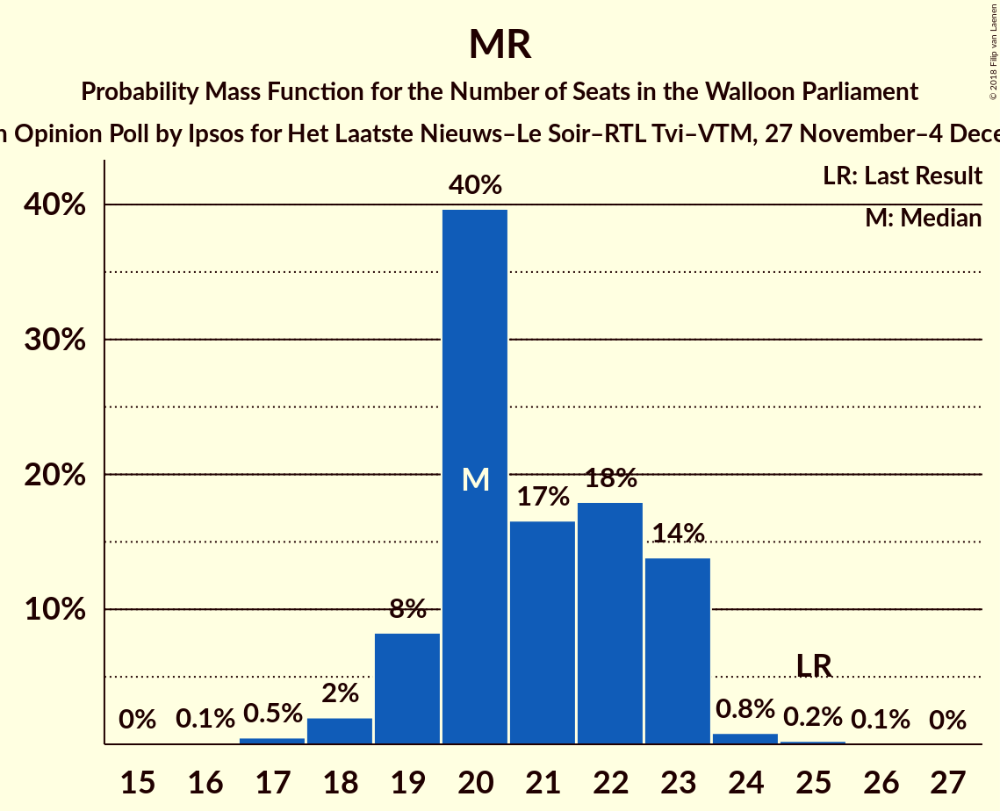

| Number of Seats | Probability | Accumulated | Special Marks |
|:---------------:|:-----------:|:-----------:|:-------------:|
| 16 | 0.1% | 100% |  |
| 17 | 0.5% | 99.9% |  |
| 18 | 2% | 99.4% |  |
| 19 | 8% | 97% |  |
| 20 | 40% | 89% | Median |
| 21 | 17% | 49% |  |
| 22 | 18% | 33% |  |
| 23 | 14% | 15% |  |
| 24 | 0.8% | 1.1% |  |
| 25 | 0.2% | 0.3% | Last Result |
| 26 | 0.1% | 0.1% |  |
| 27 | 0% | 0% |  |

### PS

*For a full overview of the results for this party, see the [PS](party-ps.html) page.*

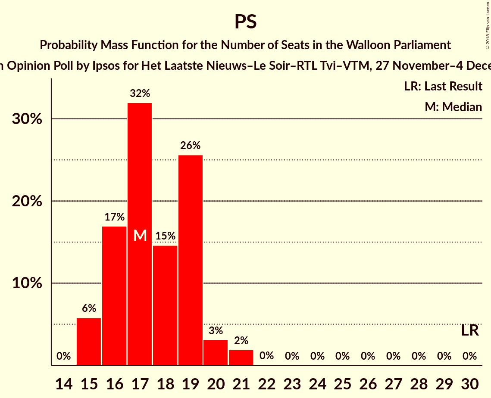

| Number of Seats | Probability | Accumulated | Special Marks |
|:---------------:|:-----------:|:-----------:|:-------------:|
| 15 | 6% | 100% |  |
| 16 | 17% | 94% |  |
| 17 | 32% | 77% | Median |
| 18 | 15% | 45% |  |
| 19 | 26% | 31% |  |
| 20 | 3% | 5% |  |
| 21 | 2% | 2% |  |
| 22 | 0% | 0.1% |  |
| 23 | 0% | 0% |  |
| 24 | 0% | 0% |  |
| 25 | 0% | 0% |  |
| 26 | 0% | 0% |  |
| 27 | 0% | 0% |  |
| 28 | 0% | 0% |  |
| 29 | 0% | 0% |  |
| 30 | 0% | 0% | Last Result |

### PTB

*For a full overview of the results for this party, see the [PTB](party-ptb.html) page.*

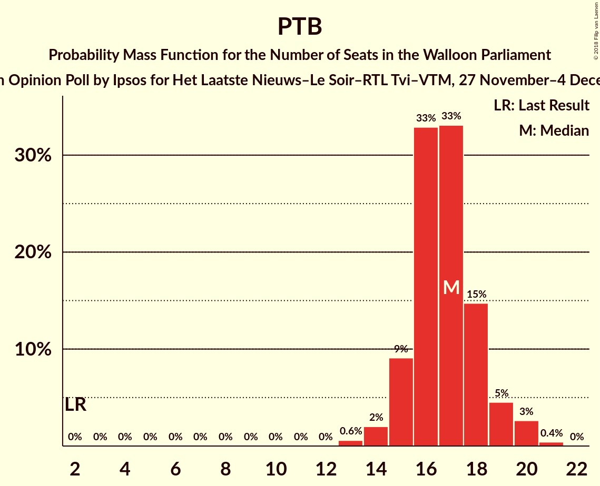

| Number of Seats | Probability | Accumulated | Special Marks |
|:---------------:|:-----------:|:-----------:|:-------------:|
| 2 | 0% | 100% | Last Result |
| 3 | 0% | 100% |  |
| 4 | 0% | 100% |  |
| 5 | 0% | 100% |  |
| 6 | 0% | 100% |  |
| 7 | 0% | 100% |  |
| 8 | 0% | 100% |  |
| 9 | 0% | 100% |  |
| 10 | 0% | 100% |  |
| 11 | 0% | 100% |  |
| 12 | 0% | 100% |  |
| 13 | 0.6% | 100% |  |
| 14 | 2% | 99.4% |  |
| 15 | 9% | 97% |  |
| 16 | 33% | 88% |  |
| 17 | 33% | 55% | Median |
| 18 | 15% | 22% |  |
| 19 | 5% | 8% |  |
| 20 | 3% | 3% |  |
| 21 | 0.4% | 0.4% |  |
| 22 | 0% | 0% |  |

### Ecolo

*For a full overview of the results for this party, see the [Ecolo](party-ecolo.html) page.*

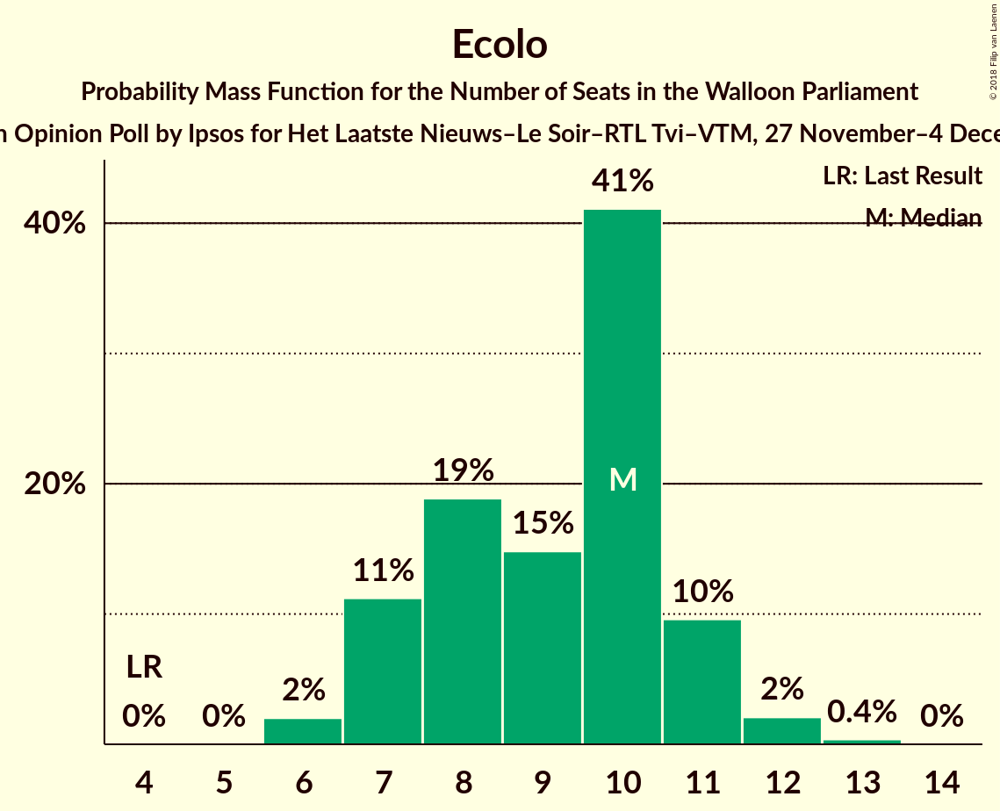

| Number of Seats | Probability | Accumulated | Special Marks |
|:---------------:|:-----------:|:-----------:|:-------------:|
| 4 | 0% | 100% | Last Result |
| 5 | 0% | 100% |  |
| 6 | 2% | 100% |  |
| 7 | 11% | 98% |  |
| 8 | 19% | 87% |  |
| 9 | 15% | 68% |  |
| 10 | 41% | 53% | Median |
| 11 | 10% | 12% |  |
| 12 | 2% | 2% |  |
| 13 | 0.4% | 0.4% |  |
| 14 | 0% | 0% |  |

### cdH

*For a full overview of the results for this party, see the [cdH](party-cdh.html) page.*

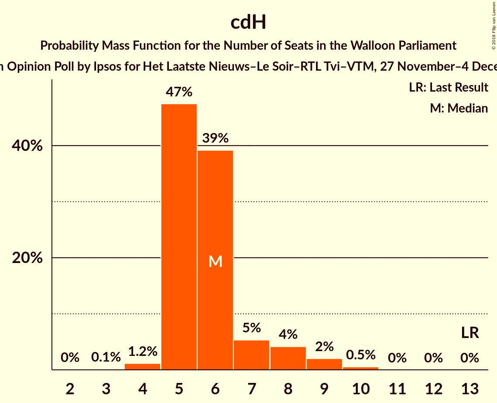

| Number of Seats | Probability | Accumulated | Special Marks |
|:---------------:|:-----------:|:-----------:|:-------------:|
| 3 | 0.1% | 100% |  |
| 4 | 1.2% | 99.8% |  |
| 5 | 47% | 98.7% |  |
| 6 | 39% | 51% | Median |
| 7 | 5% | 12% |  |
| 8 | 4% | 7% |  |
| 9 | 2% | 3% |  |
| 10 | 0.5% | 0.5% |  |
| 11 | 0% | 0% |  |
| 12 | 0% | 0% |  |
| 13 | 0% | 0% | Last Result |

### DéFI

*For a full overview of the results for this party, see the [DéFI](party-défi.html) page.*

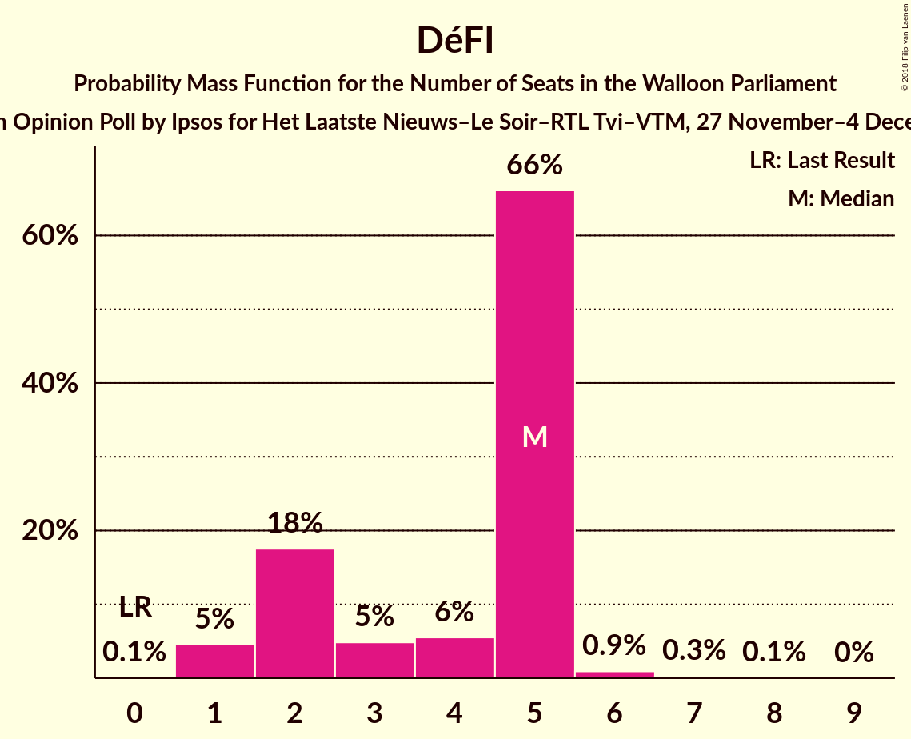

| Number of Seats | Probability | Accumulated | Special Marks |
|:---------------:|:-----------:|:-----------:|:-------------:|
| 0 | 0.1% | 100% | Last Result |
| 1 | 5% | 99.9% |  |
| 2 | 18% | 95% |  |
| 3 | 5% | 78% |  |
| 4 | 6% | 73% |  |
| 5 | 66% | 67% | Median |
| 6 | 0.9% | 1.3% |  |
| 7 | 0.3% | 0.4% |  |
| 8 | 0.1% | 0.1% |  |
| 9 | 0% | 0% |  |

### Parti Populaire

*For a full overview of the results for this party, see the [Parti Populaire](party-partipopulaire.html) page.*

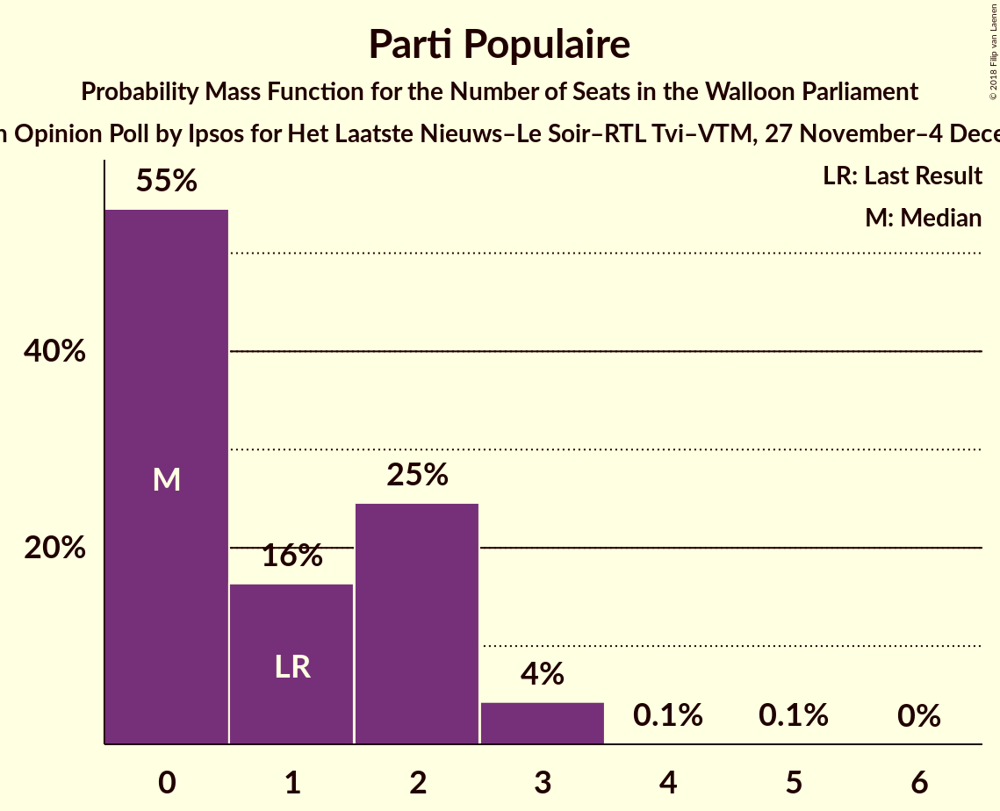

| Number of Seats | Probability | Accumulated | Special Marks |
|:---------------:|:-----------:|:-----------:|:-------------:|
| 0 | 55% | 100% | Median |
| 1 | 16% | 45% | Last Result |
| 2 | 25% | 29% |  |
| 3 | 4% | 5% |  |
| 4 | 0.1% | 0.2% |  |
| 5 | 0.1% | 0.1% |  |
| 6 | 0% | 0% |  |

### La Droite

*For a full overview of the results for this party, see the [La Droite](party-ladroite.html) page.*

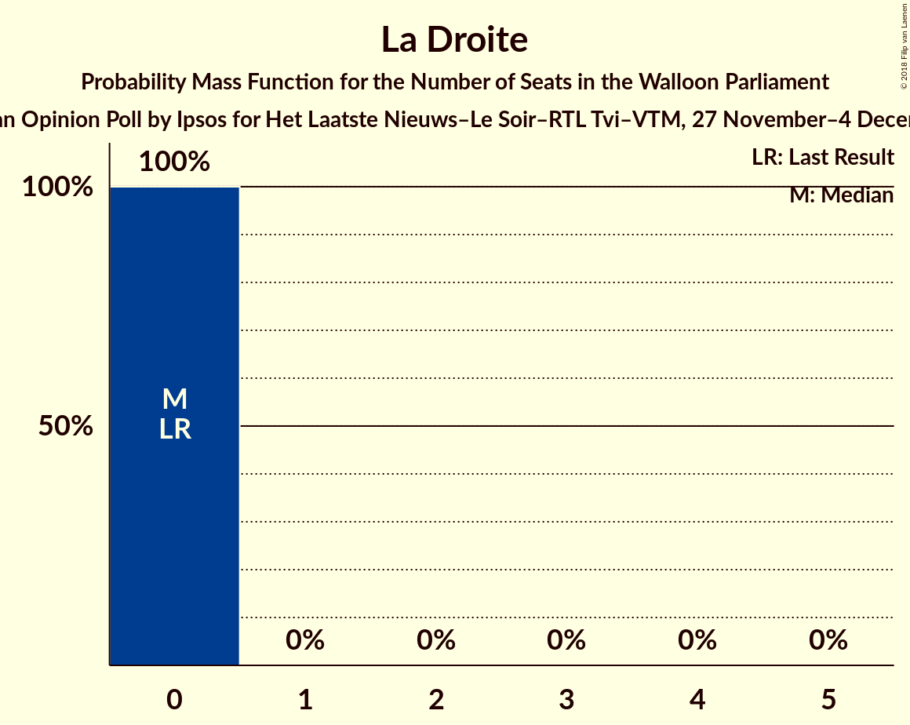

| Number of Seats | Probability | Accumulated | Special Marks |
|:---------------:|:-----------:|:-----------:|:-------------:|
| 0 | 100% | 100% | Last Result, Median |

## Coalitions

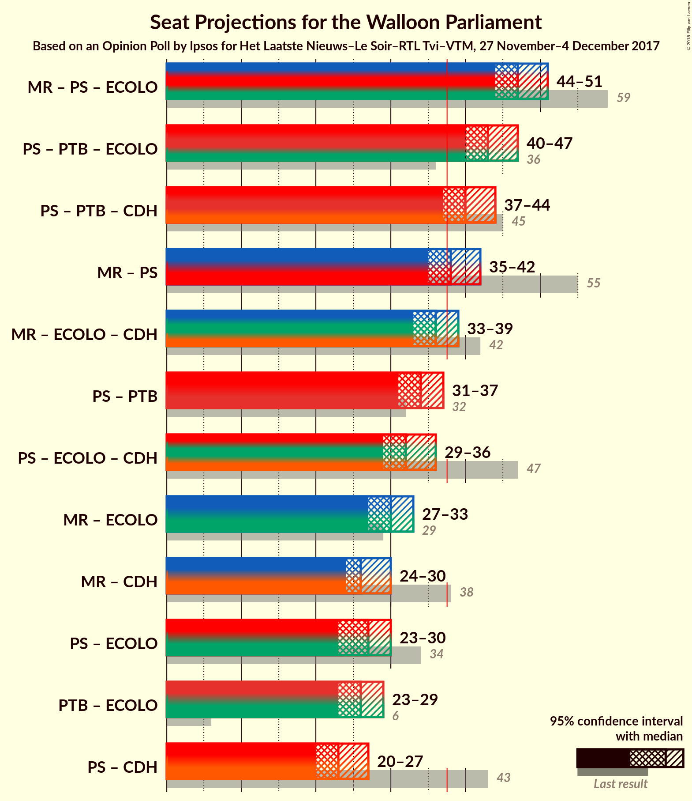

### Confidence Intervals

| Coalition | Last Result | Median | Majority? | 80% Confidence Interval | 90% Confidence Interval | 95% Confidence Interval | 99% Confidence Interval |
|:---------:|:-----------:|:------:|:---------:|:-----------------------:|:-----------------------:|:-----------------------:|:-----------------------:|
| MR – PS – Ecolo | 59 | 47 | 100% | 46–50 | 45–51 | 44–51 | 43–52 |
| PS – PTB – Ecolo | 36 | 43 | 99.9% | 41–46 | 40–47 | 40–47 | 39–49 |
| PS – PTB – cdH | 45 | 40 | 94% | 38–42 | 37–43 | 37–44 | 36–45 |
| MR – PS | 55 | 38 | 65% | 36–41 | 36–41 | 35–42 | 34–43 |
| MR – Ecolo – cdH | 42 | 36 | 16% | 33–38 | 33–39 | 33–39 | 32–40 |
| PS – PTB | 32 | 34 | 2% | 32–37 | 32–37 | 31–37 | 30–39 |
| PS – Ecolo – cdH | 47 | 32 | 0.3% | 30–35 | 30–35 | 29–36 | 28–37 |
| MR – Ecolo | 29 | 30 | 0% | 28–32 | 27–33 | 27–33 | 26–34 |
| MR – cdH | 38 | 26 | 0% | 25–29 | 24–29 | 24–30 | 23–31 |
| PS – Ecolo | 34 | 27 | 0% | 24–29 | 24–30 | 23–30 | 23–31 |
| PTB – Ecolo | 6 | 26 | 0% | 24–28 | 23–29 | 23–29 | 22–31 |
| PS – cdH | 43 | 23 | 0% | 21–25 | 21–26 | 20–27 | 20–28 |

### MR – PS – Ecolo

| Number of Seats | Probability | Accumulated | Special Marks |
|:---------------:|:-----------:|:-----------:|:-------------:|
| 41 | 0.1% | 100% |  |
| 42 | 0.2% | 99.9% |  |
| 43 | 0.7% | 99.7% |  |
| 44 | 3% | 99.0% |  |
| 45 | 5% | 96% |  |
| 46 | 16% | 91% |  |
| 47 | 31% | 76% | Median |
| 48 | 14% | 45% |  |
| 49 | 15% | 30% |  |
| 50 | 10% | 15% |  |
| 51 | 4% | 5% |  |
| 52 | 1.3% | 2% |  |
| 53 | 0.3% | 0.3% |  |
| 54 | 0% | 0.1% |  |
| 55 | 0% | 0% |  |
| 56 | 0% | 0% |  |
| 57 | 0% | 0% |  |
| 58 | 0% | 0% |  |
| 59 | 0% | 0% | Last Result |

### PS – PTB – Ecolo

| Number of Seats | Probability | Accumulated | Special Marks |
|:---------------:|:-----------:|:-----------:|:-------------:|
| 36 | 0% | 100% | Last Result |
| 37 | 0% | 100% |  |
| 38 | 0.3% | 99.9% | Majority |
| 39 | 1.1% | 99.6% |  |
| 40 | 4% | 98.5% |  |
| 41 | 9% | 95% |  |
| 42 | 15% | 86% |  |
| 43 | 21% | 71% |  |
| 44 | 23% | 50% | Median |
| 45 | 15% | 27% |  |
| 46 | 7% | 12% |  |
| 47 | 4% | 6% |  |
| 48 | 1.5% | 2% |  |
| 49 | 0.6% | 0.7% |  |
| 50 | 0.1% | 0.1% |  |
| 51 | 0% | 0% |  |

### PS – PTB – cdH

| Number of Seats | Probability | Accumulated | Special Marks |
|:---------------:|:-----------:|:-----------:|:-------------:|
| 35 | 0.3% | 100% |  |
| 36 | 1.5% | 99.7% |  |
| 37 | 4% | 98% |  |
| 38 | 18% | 94% | Majority |
| 39 | 17% | 76% |  |
| 40 | 22% | 59% | Median |
| 41 | 15% | 37% |  |
| 42 | 13% | 22% |  |
| 43 | 6% | 9% |  |
| 44 | 2% | 3% |  |
| 45 | 0.6% | 1.0% | Last Result |
| 46 | 0.3% | 0.4% |  |
| 47 | 0.1% | 0.1% |  |
| 48 | 0% | 0% |  |

### MR – PS

| Number of Seats | Probability | Accumulated | Special Marks |
|:---------------:|:-----------:|:-----------:|:-------------:|
| 33 | 0.1% | 100% |  |
| 34 | 0.6% | 99.9% |  |
| 35 | 3% | 99.3% |  |
| 36 | 9% | 96% |  |
| 37 | 22% | 87% | Median |
| 38 | 16% | 65% | Majority |
| 39 | 22% | 49% |  |
| 40 | 18% | 28% |  |
| 41 | 7% | 10% |  |
| 42 | 3% | 3% |  |
| 43 | 0.5% | 0.7% |  |
| 44 | 0.2% | 0.2% |  |
| 45 | 0% | 0% |  |
| 46 | 0% | 0% |  |
| 47 | 0% | 0% |  |
| 48 | 0% | 0% |  |
| 49 | 0% | 0% |  |
| 50 | 0% | 0% |  |
| 51 | 0% | 0% |  |
| 52 | 0% | 0% |  |
| 53 | 0% | 0% |  |
| 54 | 0% | 0% |  |
| 55 | 0% | 0% | Last Result |

### MR – Ecolo – cdH

| Number of Seats | Probability | Accumulated | Special Marks |
|:---------------:|:-----------:|:-----------:|:-------------:|
| 31 | 0.2% | 100% |  |
| 32 | 1.1% | 99.8% |  |
| 33 | 9% | 98.7% |  |
| 34 | 12% | 90% |  |
| 35 | 20% | 78% |  |
| 36 | 28% | 58% | Median |
| 37 | 14% | 30% |  |
| 38 | 10% | 16% | Majority |
| 39 | 4% | 6% |  |
| 40 | 1.0% | 1.3% |  |
| 41 | 0.3% | 0.3% |  |
| 42 | 0% | 0% | Last Result |

### PS – PTB

| Number of Seats | Probability | Accumulated | Special Marks |
|:---------------:|:-----------:|:-----------:|:-------------:|
| 29 | 0.1% | 100% |  |
| 30 | 0.6% | 99.9% |  |
| 31 | 3% | 99.3% |  |
| 32 | 12% | 97% | Last Result |
| 33 | 19% | 85% |  |
| 34 | 22% | 66% | Median |
| 35 | 21% | 44% |  |
| 36 | 12% | 23% |  |
| 37 | 9% | 12% |  |
| 38 | 2% | 2% | Majority |
| 39 | 0.5% | 0.7% |  |
| 40 | 0.1% | 0.1% |  |
| 41 | 0% | 0% |  |

### PS – Ecolo – cdH

| Number of Seats | Probability | Accumulated | Special Marks |
|:---------------:|:-----------:|:-----------:|:-------------:|
| 27 | 0.1% | 100% |  |
| 28 | 0.5% | 99.9% |  |
| 29 | 3% | 99.4% |  |
| 30 | 9% | 96% |  |
| 31 | 12% | 87% |  |
| 32 | 31% | 75% |  |
| 33 | 16% | 44% | Median |
| 34 | 15% | 27% |  |
| 35 | 8% | 12% |  |
| 36 | 3% | 5% |  |
| 37 | 1.1% | 1.4% |  |
| 38 | 0.3% | 0.3% | Majority |
| 39 | 0% | 0% |  |
| 40 | 0% | 0% |  |
| 41 | 0% | 0% |  |
| 42 | 0% | 0% |  |
| 43 | 0% | 0% |  |
| 44 | 0% | 0% |  |
| 45 | 0% | 0% |  |
| 46 | 0% | 0% |  |
| 47 | 0% | 0% | Last Result |

### MR – Ecolo

| Number of Seats | Probability | Accumulated | Special Marks |
|:---------------:|:-----------:|:-----------:|:-------------:|
| 24 | 0.1% | 100% |  |
| 25 | 0.2% | 99.9% |  |
| 26 | 1.4% | 99.8% |  |
| 27 | 4% | 98% |  |
| 28 | 13% | 94% |  |
| 29 | 13% | 81% | Last Result |
| 30 | 32% | 68% | Median |
| 31 | 14% | 36% |  |
| 32 | 16% | 22% |  |
| 33 | 5% | 6% |  |
| 34 | 0.8% | 1.1% |  |
| 35 | 0.2% | 0.3% |  |
| 36 | 0.1% | 0.1% |  |
| 37 | 0% | 0% |  |

### MR – cdH

| Number of Seats | Probability | Accumulated | Special Marks |
|:---------------:|:-----------:|:-----------:|:-------------:|
| 22 | 0.2% | 100% |  |
| 23 | 1.4% | 99.8% |  |
| 24 | 4% | 98% |  |
| 25 | 21% | 94% |  |
| 26 | 29% | 73% | Median |
| 27 | 14% | 44% |  |
| 28 | 17% | 30% |  |
| 29 | 10% | 13% |  |
| 30 | 2% | 3% |  |
| 31 | 0.7% | 1.0% |  |
| 32 | 0.3% | 0.3% |  |
| 33 | 0% | 0% |  |
| 34 | 0% | 0% |  |
| 35 | 0% | 0% |  |
| 36 | 0% | 0% |  |
| 37 | 0% | 0% |  |
| 38 | 0% | 0% | Last Result, Majority |

### PS – Ecolo

| Number of Seats | Probability | Accumulated | Special Marks |
|:---------------:|:-----------:|:-----------:|:-------------:|
| 21 | 0.1% | 100% |  |
| 22 | 0.4% | 99.9% |  |
| 23 | 2% | 99.5% |  |
| 24 | 8% | 97% |  |
| 25 | 10% | 89% |  |
| 26 | 19% | 79% |  |
| 27 | 30% | 60% | Median |
| 28 | 16% | 30% |  |
| 29 | 9% | 14% |  |
| 30 | 3% | 5% |  |
| 31 | 2% | 2% |  |
| 32 | 0.2% | 0.3% |  |
| 33 | 0% | 0% |  |
| 34 | 0% | 0% | Last Result |

### PTB – Ecolo

| Number of Seats | Probability | Accumulated | Special Marks |
|:---------------:|:-----------:|:-----------:|:-------------:|
| 6 | 0% | 100% | Last Result |
| 7 | 0% | 100% |  |
| 8 | 0% | 100% |  |
| 9 | 0% | 100% |  |
| 10 | 0% | 100% |  |
| 11 | 0% | 100% |  |
| 12 | 0% | 100% |  |
| 13 | 0% | 100% |  |
| 14 | 0% | 100% |  |
| 15 | 0% | 100% |  |
| 16 | 0% | 100% |  |
| 17 | 0% | 100% |  |
| 18 | 0% | 100% |  |
| 19 | 0% | 100% |  |
| 20 | 0% | 100% |  |
| 21 | 0.2% | 99.9% |  |
| 22 | 1.4% | 99.7% |  |
| 23 | 7% | 98% |  |
| 24 | 10% | 91% |  |
| 25 | 20% | 81% |  |
| 26 | 25% | 61% |  |
| 27 | 19% | 37% | Median |
| 28 | 12% | 18% |  |
| 29 | 4% | 6% |  |
| 30 | 1.0% | 2% |  |
| 31 | 0.5% | 0.5% |  |
| 32 | 0.1% | 0.1% |  |
| 33 | 0% | 0% |  |

### PS – cdH

| Number of Seats | Probability | Accumulated | Special Marks |
|:---------------:|:-----------:|:-----------:|:-------------:|
| 20 | 3% | 100% |  |
| 21 | 7% | 97% |  |
| 22 | 31% | 90% |  |
| 23 | 15% | 59% | Median |
| 24 | 21% | 45% |  |
| 25 | 17% | 24% |  |
| 26 | 5% | 7% |  |
| 27 | 2% | 3% |  |
| 28 | 0.7% | 0.9% |  |
| 29 | 0.1% | 0.2% |  |
| 30 | 0% | 0% |  |
| 31 | 0% | 0% |  |
| 32 | 0% | 0% |  |
| 33 | 0% | 0% |  |
| 34 | 0% | 0% |  |
| 35 | 0% | 0% |  |
| 36 | 0% | 0% |  |
| 37 | 0% | 0% |  |
| 38 | 0% | 0% | Majority |
| 39 | 0% | 0% |  |
| 40 | 0% | 0% |  |
| 41 | 0% | 0% |  |
| 42 | 0% | 0% |  |
| 43 | 0% | 0% | Last Result |

## Technical Information

### Opinion Poll

+ **Polling firm:** Ipsos
+ **Commissioner(s):** Het Laatste Nieuws–Le Soir–RTL Tvi–VTM
+ **Fieldwork period:** 27 November–4 December 2017

### Calculations

+ **Sample size:** 999
+ **Simulations done:** 2,097,152
+ **Error estimate:** 1.49%

