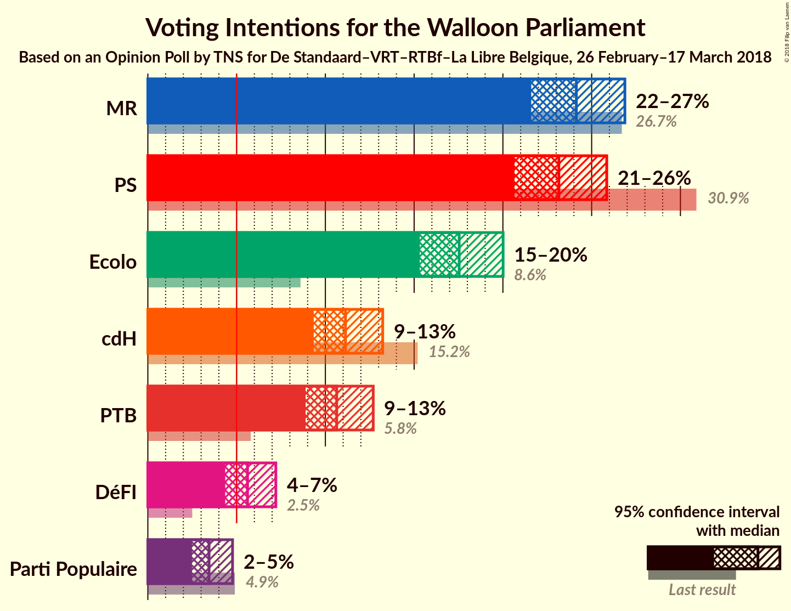
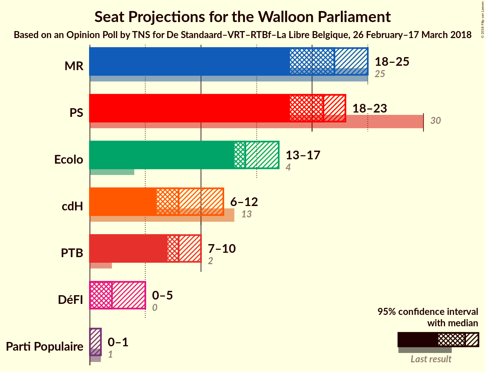
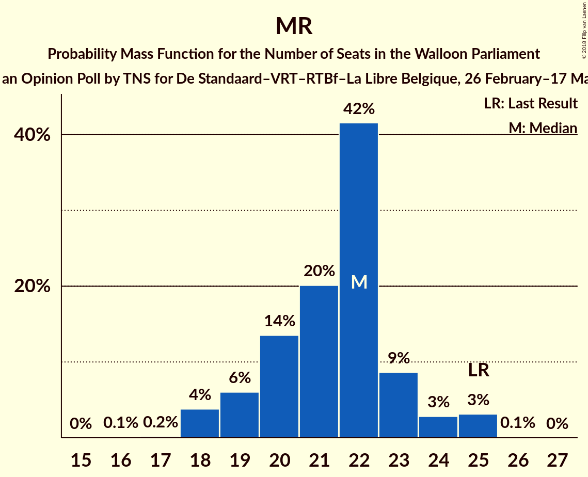
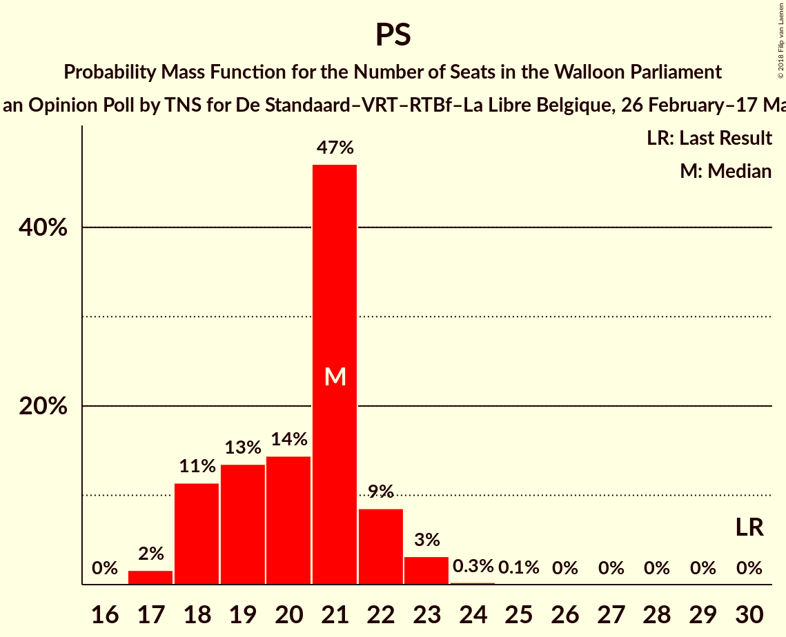
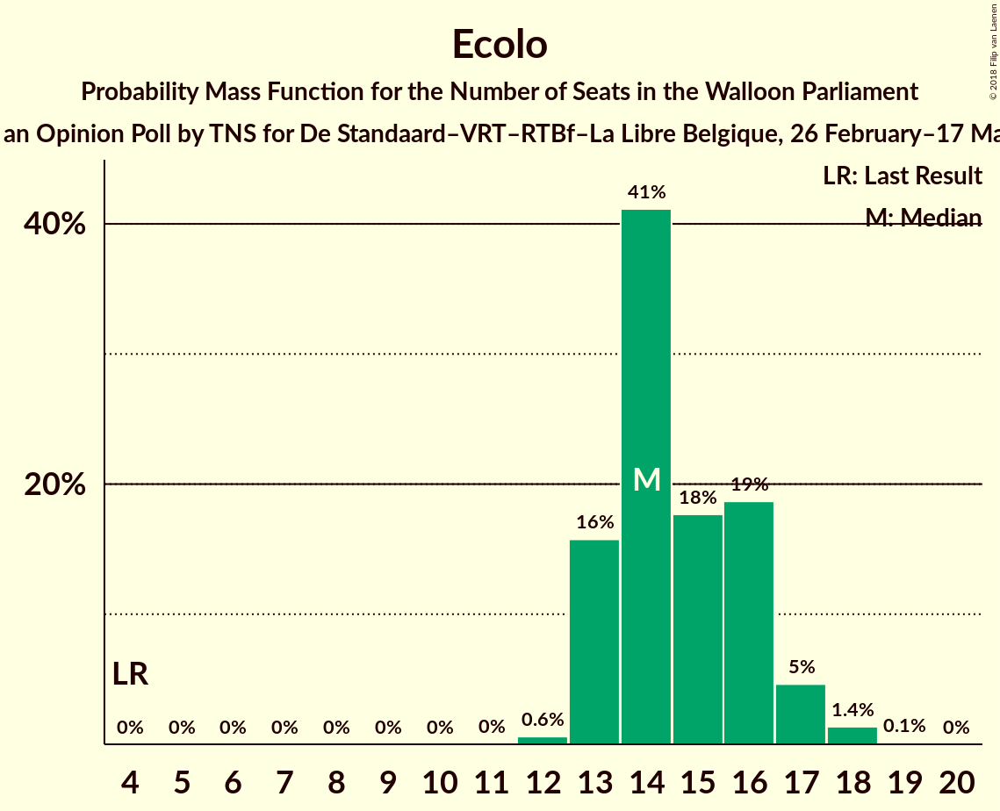
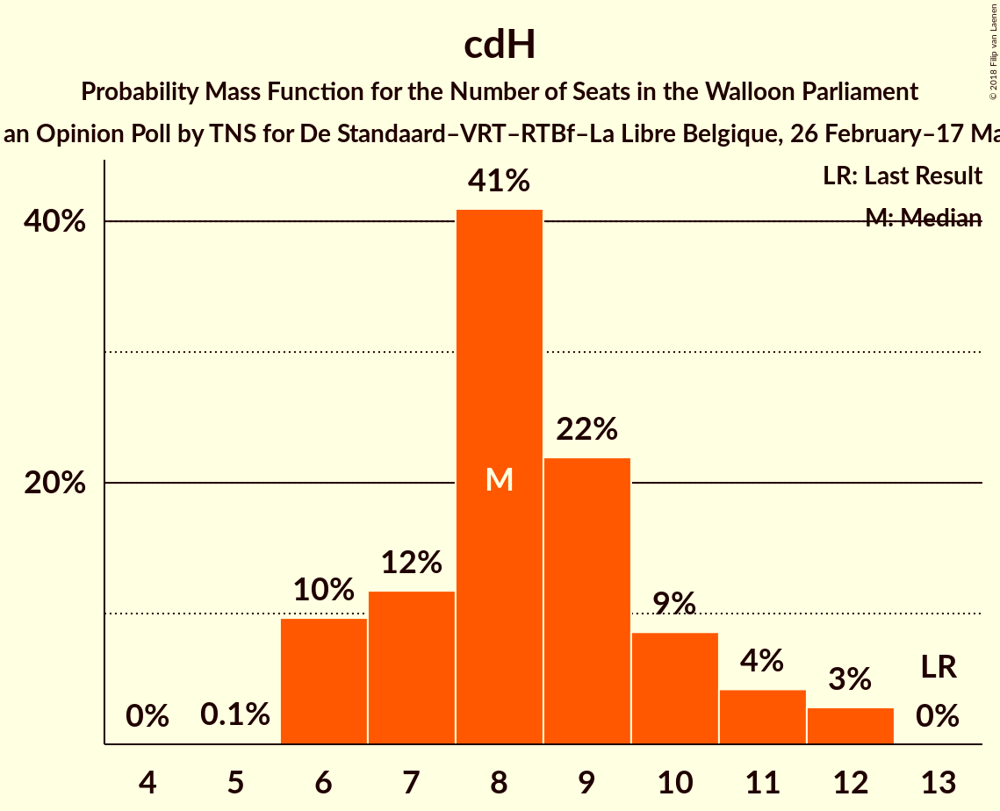
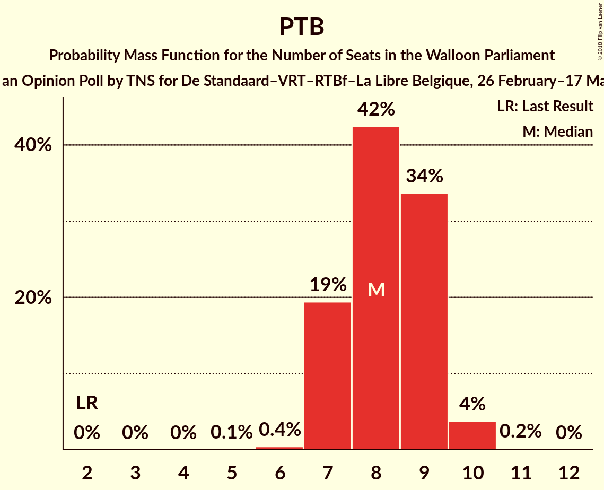
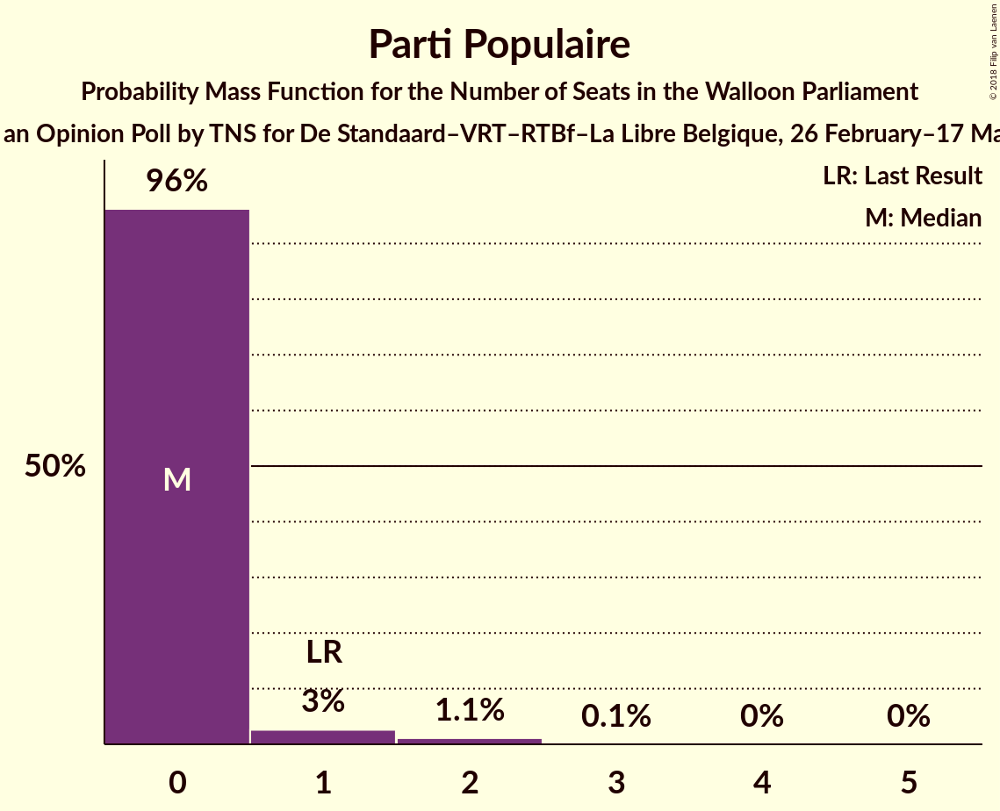
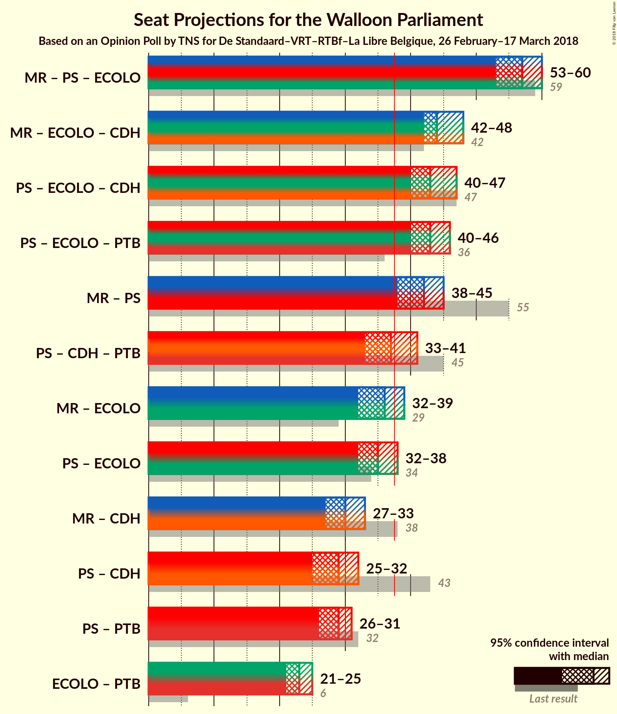

# Opinion Poll by TNS for De Standaard–VRT–RTBf–La Libre Belgique, 26 February–17 March 2018

<a href="#voting-intentions">Voting Intentions</a> | <a href="#seats">Seats</a> | <a href="#coalitions">Coalitions</a> | <a href="#technical-information">Technical Information</a>

## Voting Intentions

### Confidence Intervals

| Party | Last Result | Poll Result | 80% Confidence Interval | 90% Confidence Interval | 95% Confidence Interval | 99% Confidence Interval |
|:-----:|:-----------:|:-----------:|:-----------------------:|:-----------------------:|:-----------------------:|:-----------------------:|
| MR | 26.7% | 24.1% | 22.5–25.9% |22.0–26.4% |21.6–26.9% |20.8–27.7% |
| PS | 30.9% | 23.2% | 21.5–24.9% |21.0–25.4% |20.7–25.8% |19.9–26.7% |
| Ecolo | 8.6% | 17.5% | 16.1–19.2% |15.7–19.6% |15.3–20.0% |14.6–20.8% |
| cdH | 15.2% | 11.1% | 10.0–12.5% |9.6–12.9% |9.3–13.2% |8.8–13.9% |
| PTB | 5.8% | 10.6% | 9.5–12.0% |9.2–12.4% |8.9–12.7% |8.4–13.4% |
| DéFI | 2.5% | 5.6% | 4.8–6.7% |4.6–7.0% |4.4–7.2% |4.0–7.7% |
| Parti Populaire | 4.9% | 3.4% | 2.8–4.3% |2.6–4.5% |2.5–4.8% |2.2–5.2% |

*Note:* The poll result column reflects the actual value used in the calculations. Published results may vary slightly, and in addition be rounded to fewer digits.

## Seats

### Confidence Intervals

| Party | Last Result | Median | 80% Confidence Interval | 90% Confidence Interval | 95% Confidence Interval | 99% Confidence Interval |
|:-----:|:-----------:|:------:|:-----------------------:|:-----------------------:|:-----------------------:|:-----------------------:|
| <a href="#mr">MR</a> | 25 | 22 | 19–23 |19–24 |18–25 |18–25 |
| <a href="#ps">PS</a> | 30 | 21 | 18–22 |18–22 |18–23 |17–23 |
| <a href="#ecolo">Ecolo</a> | 4 | 14 | 13–16 |13–17 |13–17 |12–18 |
| <a href="#cdh">cdH</a> | 13 | 8 | 7–10 |6–11 |6–12 |6–12 |
| <a href="#ptb">PTB</a> | 2 | 8 | 7–9 |7–9 |7–10 |7–10 |
| <a href="#défi">DéFI</a> | 0 | 2 | 0–4 |0–5 |0–5 |0–5 |
| <a href="#parti-populaire">Parti Populaire</a> | 1 | 0 | 0 |0 |0–1 |0–2 |

### MR

*For a full overview of the results for this party, see the [MR](party-mr.html) page.*

| Number of Seats | Probability | Accumulated | Special Marks |
|:---------------:|:-----------:|:-----------:|:-------------:|
| 16 | 0.1% | 100% |  |
| 17 | 0.2% | 99.9% |  |
| 18 | 4% | 99.7% |  |
| 19 | 6% | 96% |  |
| 20 | 14% | 90% |  |
| 21 | 20% | 76% |  |
| 22 | 42% | 56% | Median |
| 23 | 9% | 15% |  |
| 24 | 3% | 6% |  |
| 25 | 3% | 3% | Last Result |
| 26 | 0.1% | 0.1% |  |
| 27 | 0% | 0% |  |

### PS

*For a full overview of the results for this party, see the [PS](party-ps.html) page.*

| Number of Seats | Probability | Accumulated | Special Marks |
|:---------------:|:-----------:|:-----------:|:-------------:|
| 17 | 2% | 100% |  |
| 18 | 11% | 98% |  |
| 19 | 13% | 87% |  |
| 20 | 14% | 73% |  |
| 21 | 47% | 59% | Median |
| 22 | 9% | 12% |  |
| 23 | 3% | 3% |  |
| 24 | 0.3% | 0.3% |  |
| 25 | 0.1% | 0.1% |  |
| 26 | 0% | 0% |  |
| 27 | 0% | 0% |  |
| 28 | 0% | 0% |  |
| 29 | 0% | 0% |  |
| 30 | 0% | 0% | Last Result |

### Ecolo

*For a full overview of the results for this party, see the [Ecolo](party-ecolo.html) page.*

| Number of Seats | Probability | Accumulated | Special Marks |
|:---------------:|:-----------:|:-----------:|:-------------:|
| 4 | 0% | 100% | Last Result |
| 5 | 0% | 100% |  |
| 6 | 0% | 100% |  |
| 7 | 0% | 100% |  |
| 8 | 0% | 100% |  |
| 9 | 0% | 100% |  |
| 10 | 0% | 100% |  |
| 11 | 0% | 100% |  |
| 12 | 0.6% | 100% |  |
| 13 | 16% | 99.4% |  |
| 14 | 41% | 84% | Median |
| 15 | 18% | 42% |  |
| 16 | 19% | 25% |  |
| 17 | 5% | 6% |  |
| 18 | 1.4% | 1.5% |  |
| 19 | 0.1% | 0.1% |  |
| 20 | 0% | 0% |  |

### cdH

*For a full overview of the results for this party, see the [cdH](party-cdh.html) page.*

| Number of Seats | Probability | Accumulated | Special Marks |
|:---------------:|:-----------:|:-----------:|:-------------:|
| 5 | 0.1% | 100% |  |
| 6 | 10% | 99.9% |  |
| 7 | 12% | 90% |  |
| 8 | 41% | 78% | Median |
| 9 | 22% | 38% |  |
| 10 | 9% | 16% |  |
| 11 | 4% | 7% |  |
| 12 | 3% | 3% |  |
| 13 | 0% | 0% | Last Result |

### PTB

*For a full overview of the results for this party, see the [PTB](party-ptb.html) page.*

| Number of Seats | Probability | Accumulated | Special Marks |
|:---------------:|:-----------:|:-----------:|:-------------:|
| 2 | 0% | 100% | Last Result |
| 3 | 0% | 100% |  |
| 4 | 0% | 100% |  |
| 5 | 0.1% | 100% |  |
| 6 | 0.4% | 99.9% |  |
| 7 | 19% | 99.5% |  |
| 8 | 42% | 80% | Median |
| 9 | 34% | 38% |  |
| 10 | 4% | 4% |  |
| 11 | 0.2% | 0.2% |  |
| 12 | 0% | 0% |  |

### DéFI

*For a full overview of the results for this party, see the [DéFI](party-défi.html) page.*

| Number of Seats | Probability | Accumulated | Special Marks |
|:---------------:|:-----------:|:-----------:|:-------------:|
| 0 | 12% | 100% | Last Result |
| 1 | 24% | 88% |  |
| 2 | 35% | 63% | Median |
| 3 | 6% | 29% |  |
| 4 | 16% | 22% |  |
| 5 | 6% | 6% |  |
| 6 | 0% | 0% |  |

### Parti Populaire

*For a full overview of the results for this party, see the [Parti Populaire](party-partipopulaire.html) page.*

| Number of Seats | Probability | Accumulated | Special Marks |
|:---------------:|:-----------:|:-----------:|:-------------:|
| 0 | 96% | 100% | Median |
| 1 | 3% | 4% | Last Result |
| 2 | 1.1% | 1.2% |  |
| 3 | 0.1% | 0.1% |  |
| 4 | 0% | 0% |  |

## Coalitions

### Confidence Intervals

| Coalition | Last Result | Median | Majority? | 80% Confidence Interval | 90% Confidence Interval | 95% Confidence Interval | 99% Confidence Interval |
|:---------:|:-----------:|:------:|:---------:|:-----------------------:|:-----------------------:|:-----------------------:|:-----------------------:|
| MR – PS – Ecolo | 59 | 57 | 100% | 54–58 | 53–59 | 53–60 | 51–60 |
| MR – Ecolo – cdH | 42 | 44 | 100% | 42–46 | 42–47 | 42–48 | 41–49 |
| PS – Ecolo – cdH | 47 | 43 | 100% | 41–45 | 40–46 | 40–47 | 39–48 |
| PS – Ecolo – PTB | 36 | 43 | 100% | 41–45 | 41–46 | 40–46 | 39–47 |
| MR – PS | 55 | 42 | 98.6% | 39–44 | 39–44 | 38–45 | 37–46 |
| PS – cdH – PTB | 45 | 37 | 36% | 34–39 | 34–40 | 33–41 | 32–42 |
| MR – Ecolo | 29 | 36 | 20% | 34–38 | 33–39 | 32–39 | 31–40 |
| PS – Ecolo | 34 | 35 | 4% | 33–37 | 32–37 | 32–38 | 31–39 |
| MR – cdH | 38 | 30 | 0% | 28–31 | 28–32 | 27–33 | 26–34 |
| PS – cdH | 43 | 29 | 0% | 26–31 | 26–32 | 25–32 | 24–33 |
| PS – PTB | 32 | 29 | 0% | 26–30 | 26–31 | 26–31 | 25–32 |
| Ecolo – PTB | 6 | 23 | 0% | 21–25 | 21–25 | 21–25 | 20–27 |

### MR – PS – Ecolo

| Number of Seats | Probability | Accumulated | Special Marks |
|:---------------:|:-----------:|:-----------:|:-------------:|
| 50 | 0.1% | 100% |  |
| 51 | 0.6% | 99.9% |  |
| 52 | 1.3% | 99.3% |  |
| 53 | 5% | 98% |  |
| 54 | 8% | 93% |  |
| 55 | 16% | 85% |  |
| 56 | 19% | 69% |  |
| 57 | 23% | 50% | Median |
| 58 | 17% | 27% |  |
| 59 | 7% | 10% | Last Result |
| 60 | 2% | 3% |  |
| 61 | 0.4% | 0.5% |  |
| 62 | 0.1% | 0.1% |  |
| 63 | 0% | 0% |  |

### MR – Ecolo – cdH

| Number of Seats | Probability | Accumulated | Special Marks |
|:---------------:|:-----------:|:-----------:|:-------------:|
| 40 | 0.4% | 100% |  |
| 41 | 2% | 99.6% |  |
| 42 | 9% | 98% | Last Result |
| 43 | 15% | 89% |  |
| 44 | 35% | 73% | Median |
| 45 | 17% | 38% |  |
| 46 | 12% | 22% |  |
| 47 | 7% | 10% |  |
| 48 | 2% | 3% |  |
| 49 | 0.4% | 0.5% |  |
| 50 | 0.1% | 0.1% |  |
| 51 | 0% | 0% |  |

### PS – Ecolo – cdH

| Number of Seats | Probability | Accumulated | Special Marks |
|:---------------:|:-----------:|:-----------:|:-------------:|
| 38 | 0.3% | 100% | Majority |
| 39 | 1.1% | 99.6% |  |
| 40 | 5% | 98.6% |  |
| 41 | 11% | 93% |  |
| 42 | 13% | 82% |  |
| 43 | 25% | 69% | Median |
| 44 | 21% | 44% |  |
| 45 | 14% | 23% |  |
| 46 | 5% | 9% |  |
| 47 | 3% | 4% | Last Result |
| 48 | 0.9% | 1.0% |  |
| 49 | 0.1% | 0.1% |  |
| 50 | 0% | 0% |  |

### PS – Ecolo – PTB

| Number of Seats | Probability | Accumulated | Special Marks |
|:---------------:|:-----------:|:-----------:|:-------------:|
| 36 | 0% | 100% | Last Result |
| 37 | 0% | 100% |  |
| 38 | 0.1% | 100% | Majority |
| 39 | 1.0% | 99.9% |  |
| 40 | 4% | 98.9% |  |
| 41 | 9% | 95% |  |
| 42 | 20% | 86% |  |
| 43 | 24% | 66% | Median |
| 44 | 27% | 43% |  |
| 45 | 11% | 16% |  |
| 46 | 4% | 5% |  |
| 47 | 1.0% | 1.5% |  |
| 48 | 0.4% | 0.4% |  |
| 49 | 0% | 0% |  |

### MR – PS

| Number of Seats | Probability | Accumulated | Special Marks |
|:---------------:|:-----------:|:-----------:|:-------------:|
| 35 | 0.1% | 100% |  |
| 36 | 0.2% | 99.9% |  |
| 37 | 1.1% | 99.7% |  |
| 38 | 3% | 98.6% | Majority |
| 39 | 7% | 96% |  |
| 40 | 11% | 89% |  |
| 41 | 19% | 78% |  |
| 42 | 20% | 58% |  |
| 43 | 26% | 38% | Median |
| 44 | 8% | 13% |  |
| 45 | 3% | 4% |  |
| 46 | 1.1% | 1.3% |  |
| 47 | 0.2% | 0.2% |  |
| 48 | 0% | 0% |  |
| 49 | 0% | 0% |  |
| 50 | 0% | 0% |  |
| 51 | 0% | 0% |  |
| 52 | 0% | 0% |  |
| 53 | 0% | 0% |  |
| 54 | 0% | 0% |  |
| 55 | 0% | 0% | Last Result |

### PS – cdH – PTB

| Number of Seats | Probability | Accumulated | Special Marks |
|:---------------:|:-----------:|:-----------:|:-------------:|
| 31 | 0.1% | 100% |  |
| 32 | 0.7% | 99.9% |  |
| 33 | 2% | 99.2% |  |
| 34 | 8% | 97% |  |
| 35 | 13% | 89% |  |
| 36 | 18% | 76% |  |
| 37 | 22% | 58% | Median |
| 38 | 17% | 36% | Majority |
| 39 | 11% | 19% |  |
| 40 | 5% | 8% |  |
| 41 | 3% | 3% |  |
| 42 | 0.5% | 0.6% |  |
| 43 | 0.1% | 0.1% |  |
| 44 | 0% | 0% |  |
| 45 | 0% | 0% | Last Result |

### MR – Ecolo

| Number of Seats | Probability | Accumulated | Special Marks |
|:---------------:|:-----------:|:-----------:|:-------------:|
| 29 | 0% | 100% | Last Result |
| 30 | 0% | 100% |  |
| 31 | 0.5% | 100% |  |
| 32 | 3% | 99.5% |  |
| 33 | 5% | 96% |  |
| 34 | 11% | 91% |  |
| 35 | 15% | 81% |  |
| 36 | 28% | 65% | Median |
| 37 | 18% | 38% |  |
| 38 | 12% | 20% | Majority |
| 39 | 6% | 8% |  |
| 40 | 1.2% | 2% |  |
| 41 | 0.3% | 0.4% |  |
| 42 | 0.1% | 0.1% |  |
| 43 | 0% | 0% |  |

### PS – Ecolo

| Number of Seats | Probability | Accumulated | Special Marks |
|:---------------:|:-----------:|:-----------:|:-------------:|
| 30 | 0.2% | 100% |  |
| 31 | 0.9% | 99.8% |  |
| 32 | 5% | 98.9% |  |
| 33 | 11% | 94% |  |
| 34 | 18% | 83% | Last Result |
| 35 | 32% | 65% | Median |
| 36 | 20% | 33% |  |
| 37 | 8% | 12% |  |
| 38 | 3% | 4% | Majority |
| 39 | 1.0% | 1.3% |  |
| 40 | 0.3% | 0.3% |  |
| 41 | 0% | 0% |  |

### MR – cdH

| Number of Seats | Probability | Accumulated | Special Marks |
|:---------------:|:-----------:|:-----------:|:-------------:|
| 25 | 0.3% | 100% |  |
| 26 | 1.4% | 99.6% |  |
| 27 | 3% | 98% |  |
| 28 | 12% | 95% |  |
| 29 | 24% | 83% |  |
| 30 | 33% | 59% | Median |
| 31 | 17% | 26% |  |
| 32 | 6% | 9% |  |
| 33 | 2% | 3% |  |
| 34 | 0.6% | 0.9% |  |
| 35 | 0.2% | 0.2% |  |
| 36 | 0% | 0% |  |
| 37 | 0% | 0% |  |
| 38 | 0% | 0% | Last Result, Majority |

### PS – cdH

| Number of Seats | Probability | Accumulated | Special Marks |
|:---------------:|:-----------:|:-----------:|:-------------:|
| 23 | 0.1% | 100% |  |
| 24 | 0.9% | 99.9% |  |
| 25 | 2% | 99.1% |  |
| 26 | 8% | 97% |  |
| 27 | 16% | 88% |  |
| 28 | 18% | 72% |  |
| 29 | 24% | 55% | Median |
| 30 | 17% | 31% |  |
| 31 | 7% | 14% |  |
| 32 | 4% | 7% |  |
| 33 | 2% | 2% |  |
| 34 | 0.2% | 0.3% |  |
| 35 | 0% | 0% |  |
| 36 | 0% | 0% |  |
| 37 | 0% | 0% |  |
| 38 | 0% | 0% | Majority |
| 39 | 0% | 0% |  |
| 40 | 0% | 0% |  |
| 41 | 0% | 0% |  |
| 42 | 0% | 0% |  |
| 43 | 0% | 0% | Last Result |

### PS – PTB

| Number of Seats | Probability | Accumulated | Special Marks |
|:---------------:|:-----------:|:-----------:|:-------------:|
| 24 | 0.2% | 100% |  |
| 25 | 2% | 99.8% |  |
| 26 | 9% | 98% |  |
| 27 | 13% | 89% |  |
| 28 | 18% | 76% |  |
| 29 | 31% | 58% | Median |
| 30 | 22% | 27% |  |
| 31 | 5% | 5% |  |
| 32 | 0.8% | 0.9% | Last Result |
| 33 | 0.1% | 0.1% |  |
| 34 | 0% | 0% |  |

### Ecolo – PTB

| Number of Seats | Probability | Accumulated | Special Marks |
|:---------------:|:-----------:|:-----------:|:-------------:|
| 6 | 0% | 100% | Last Result |
| 7 | 0% | 100% |  |
| 8 | 0% | 100% |  |
| 9 | 0% | 100% |  |
| 10 | 0% | 100% |  |
| 11 | 0% | 100% |  |
| 12 | 0% | 100% |  |
| 13 | 0% | 100% |  |
| 14 | 0% | 100% |  |
| 15 | 0% | 100% |  |
| 16 | 0% | 100% |  |
| 17 | 0% | 100% |  |
| 18 | 0% | 100% |  |
| 19 | 0.2% | 100% |  |
| 20 | 2% | 99.8% |  |
| 21 | 17% | 98% |  |
| 22 | 23% | 81% | Median |
| 23 | 31% | 58% |  |
| 24 | 15% | 27% |  |
| 25 | 10% | 12% |  |
| 26 | 2% | 2% |  |
| 27 | 0.6% | 0.7% |  |
| 28 | 0% | 0% |  |

## Technical Information

### Opinion Poll

+ **Polling firm:** TNS
+ **Commissioner(s):** De Standaard–VRT–RTBf–La Libre Belgique
+ **Fieldwork period:** 26 February–17 March 2018

### Calculations

+ **Sample size:** 1015
+ **Simulations done:** 1,048,576
+ **Error estimate:** 0.76%

