# Opinion Poll by Ipsos for Het Laatste Nieuws, Le Soir, RTL TVi and VTM, 29 May–6 June 2018

<a href="#voting-intentions">Voting Intentions</a> | <a href="#seats">Seats</a> | <a href="#coalitions">Coalitions</a> | <a href="#technical-information">Technical Information</a>

## Voting Intentions

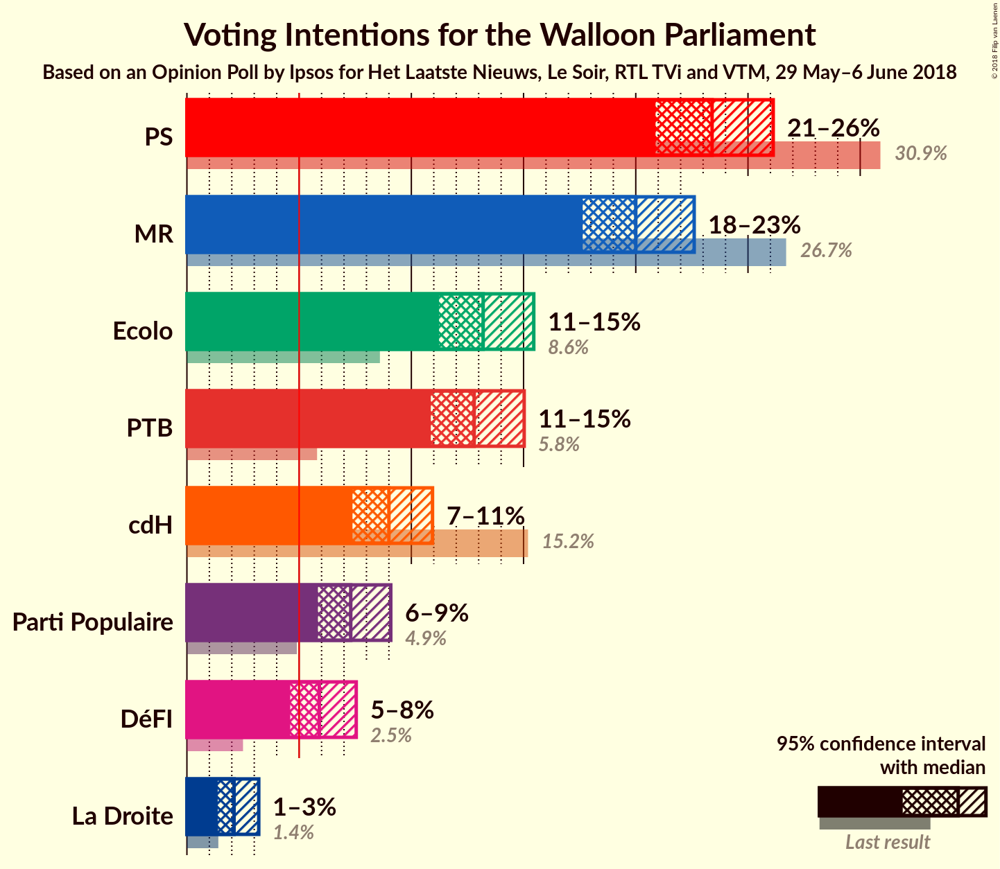

### Confidence Intervals

| Party | Last Result | Poll Result | 80% Confidence Interval | 90% Confidence Interval | 95% Confidence Interval | 99% Confidence Interval |
|:-----:|:-----------:|:-----------:|:-----------------------:|:-----------------------:|:-----------------------:|:-----------------------:|
| PS | 30.9% | 23.4% | 21.7–25.2% |21.3–25.7% |20.9–26.1% |20.1–27.0% |
| MR | 26.7% | 20.0% | 18.4–21.7% |18.0–22.2% |17.6–22.6% |16.9–23.4% |
| Ecolo | 8.6% | 13.2% | 11.9–14.7% |11.6–15.1% |11.2–15.5% |10.7–16.2% |
| PTB | 5.8% | 12.8% | 11.5–14.3% |11.2–14.7% |10.9–15.0% |10.3–15.7% |
| cdH | 15.2% | 9.0% | 7.9–10.3% |7.6–10.6% |7.4–10.9% |6.9–11.6% |
| Parti Populaire | 4.9% | 7.3% | 6.3–8.5% |6.1–8.8% |5.8–9.1% |5.4–9.7% |
| DéFI | 2.5% | 5.9% | 5.0–7.0% |4.8–7.3% |4.6–7.5% |4.2–8.1% |
| La Droite | 1.4% | 2.1% | 1.6–2.8% |1.5–3.0% |1.4–3.2% |1.2–3.6% |

*Note:* The poll result column reflects the actual value used in the calculations. Published results may vary slightly, and in addition be rounded to fewer digits.

## Seats

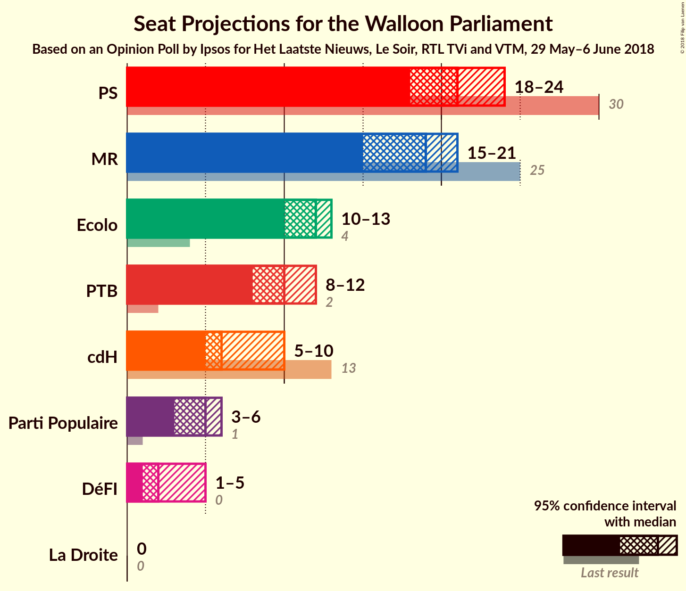

### Confidence Intervals

| Party | Last Result | Median | 80% Confidence Interval | 90% Confidence Interval | 95% Confidence Interval | 99% Confidence Interval |
|:-----:|:-----------:|:------:|:-----------------------:|:-----------------------:|:-----------------------:|:-----------------------:|
| <a href="#ps">PS</a> | 30 | 21 | 19–23 |19–24 |18–24 |17–25 |
| <a href="#mr">MR</a> | 25 | 19 | 16–20 |16–20 |15–21 |14–22 |
| <a href="#ecolo">Ecolo</a> | 4 | 12 | 11–13 |10–13 |10–13 |8–13 |
| <a href="#ptb">PTB</a> | 2 | 10 | 9–11 |9–12 |8–12 |8–14 |
| <a href="#cdh">cdH</a> | 13 | 6 | 5–9 |5–10 |5–10 |5–10 |
| <a href="#parti-populaire">Parti Populaire</a> | 1 | 5 | 3–5 |3–6 |3–6 |2–8 |
| <a href="#défi">DéFI</a> | 0 | 2 | 1–5 |1–5 |1–5 |0–5 |
| <a href="#la-droite">La Droite</a> | 0 | 0 | 0 |0 |0 |0 |

### PS

*For a full overview of the results for this party, see the [PS](party-ps.html) page.*

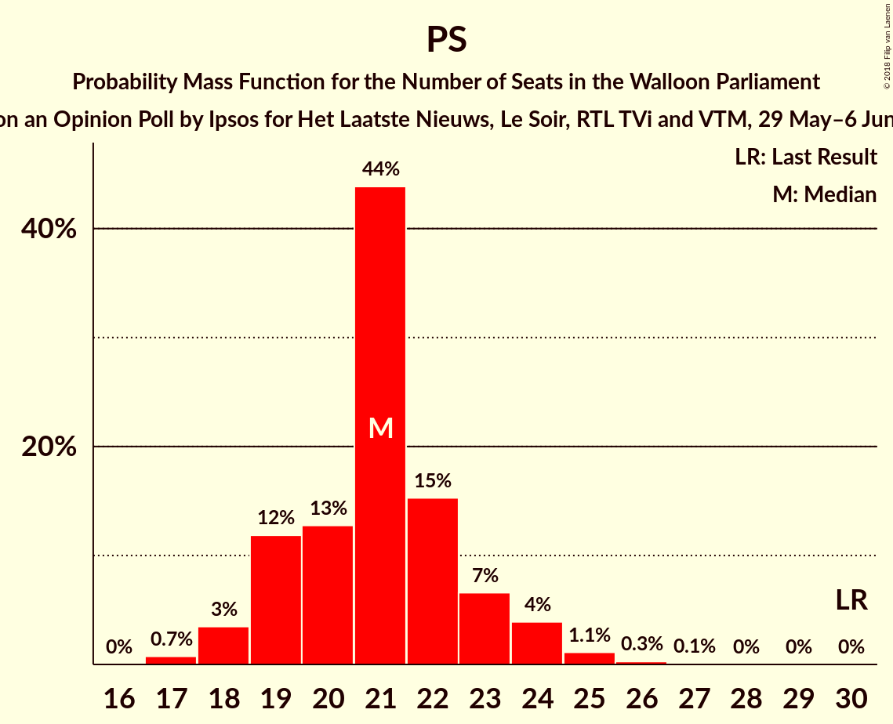

| Number of Seats | Probability | Accumulated | Special Marks |
|:---------------:|:-----------:|:-----------:|:-------------:|
| 17 | 0.7% | 100% |  |
| 18 | 3% | 99.2% |  |
| 19 | 12% | 96% |  |
| 20 | 13% | 84% |  |
| 21 | 44% | 71% | Median |
| 22 | 15% | 27% |  |
| 23 | 7% | 12% |  |
| 24 | 4% | 5% |  |
| 25 | 1.1% | 1.5% |  |
| 26 | 0.3% | 0.4% |  |
| 27 | 0.1% | 0.1% |  |
| 28 | 0% | 0% |  |
| 29 | 0% | 0% |  |
| 30 | 0% | 0% | Last Result |

### MR

*For a full overview of the results for this party, see the [MR](party-mr.html) page.*

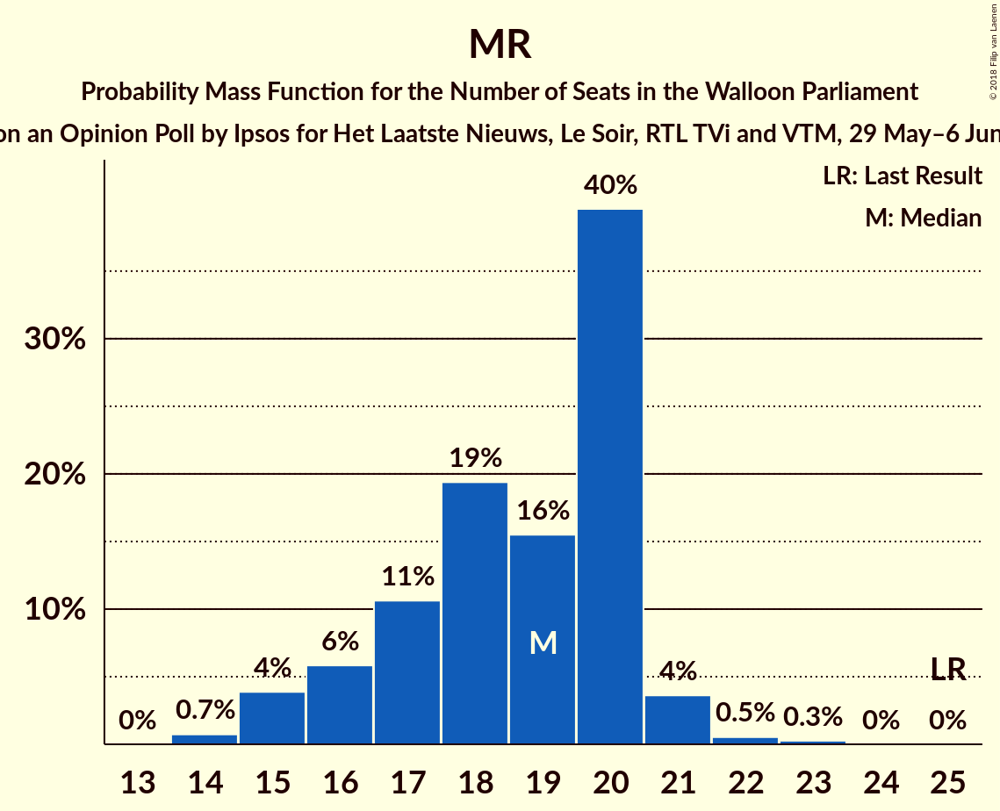

| Number of Seats | Probability | Accumulated | Special Marks |
|:---------------:|:-----------:|:-----------:|:-------------:|
| 14 | 0.7% | 100% |  |
| 15 | 4% | 99.3% |  |
| 16 | 6% | 95% |  |
| 17 | 11% | 90% |  |
| 18 | 19% | 79% |  |
| 19 | 16% | 60% | Median |
| 20 | 40% | 44% |  |
| 21 | 4% | 4% |  |
| 22 | 0.5% | 0.8% |  |
| 23 | 0.3% | 0.3% |  |
| 24 | 0% | 0% |  |
| 25 | 0% | 0% | Last Result |

### Ecolo

*For a full overview of the results for this party, see the [Ecolo](party-ecolo.html) page.*

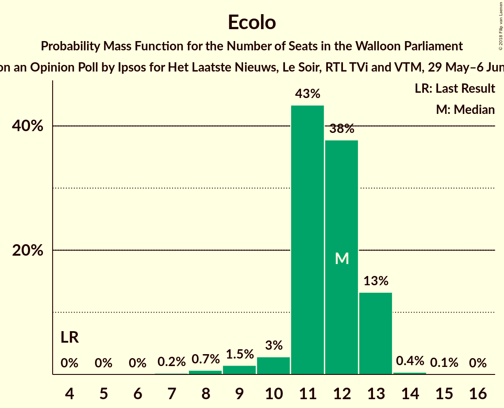

| Number of Seats | Probability | Accumulated | Special Marks |
|:---------------:|:-----------:|:-----------:|:-------------:|
| 4 | 0% | 100% | Last Result |
| 5 | 0% | 100% |  |
| 6 | 0% | 100% |  |
| 7 | 0.2% | 100% |  |
| 8 | 0.7% | 99.8% |  |
| 9 | 1.5% | 99.1% |  |
| 10 | 3% | 98% |  |
| 11 | 43% | 95% |  |
| 12 | 38% | 51% | Median |
| 13 | 13% | 14% |  |
| 14 | 0.4% | 0.5% |  |
| 15 | 0.1% | 0.1% |  |
| 16 | 0% | 0% |  |

### PTB

*For a full overview of the results for this party, see the [PTB](party-ptb.html) page.*

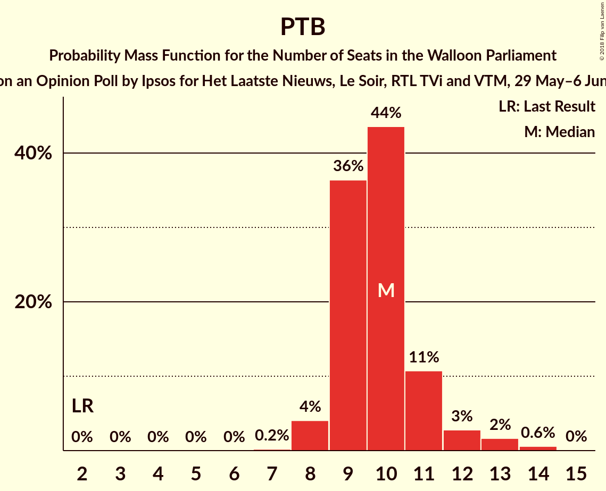

| Number of Seats | Probability | Accumulated | Special Marks |
|:---------------:|:-----------:|:-----------:|:-------------:|
| 2 | 0% | 100% | Last Result |
| 3 | 0% | 100% |  |
| 4 | 0% | 100% |  |
| 5 | 0% | 100% |  |
| 6 | 0% | 100% |  |
| 7 | 0.2% | 100% |  |
| 8 | 4% | 99.8% |  |
| 9 | 36% | 96% |  |
| 10 | 44% | 59% | Median |
| 11 | 11% | 16% |  |
| 12 | 3% | 5% |  |
| 13 | 2% | 2% |  |
| 14 | 0.6% | 0.6% |  |
| 15 | 0% | 0% |  |

### cdH

*For a full overview of the results for this party, see the [cdH](party-cdh.html) page.*

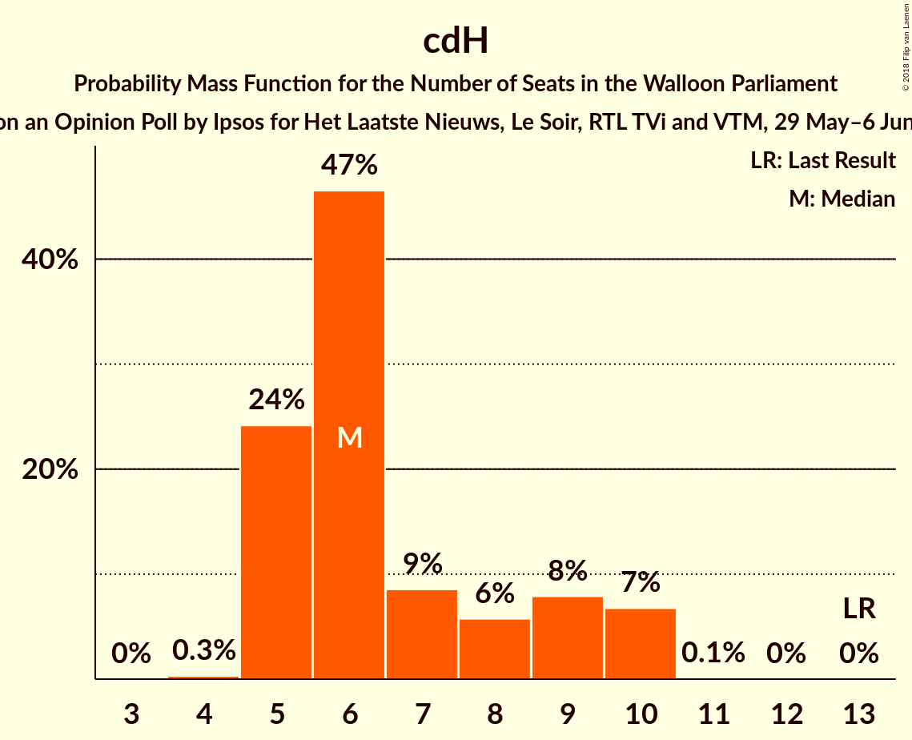

| Number of Seats | Probability | Accumulated | Special Marks |
|:---------------:|:-----------:|:-----------:|:-------------:|
| 4 | 0.3% | 100% |  |
| 5 | 24% | 99.7% |  |
| 6 | 47% | 76% | Median |
| 7 | 9% | 29% |  |
| 8 | 6% | 20% |  |
| 9 | 8% | 15% |  |
| 10 | 7% | 7% |  |
| 11 | 0.1% | 0.1% |  |
| 12 | 0% | 0% |  |
| 13 | 0% | 0% | Last Result |

### Parti Populaire

*For a full overview of the results for this party, see the [Parti Populaire](party-partipopulaire.html) page.*

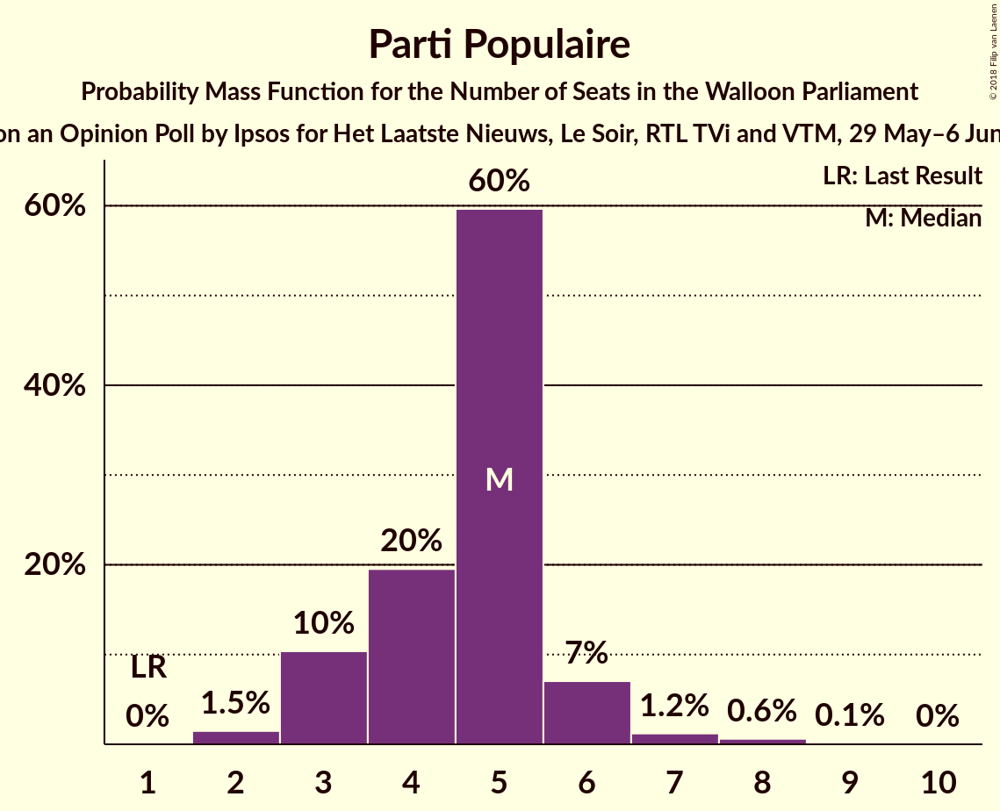

| Number of Seats | Probability | Accumulated | Special Marks |
|:---------------:|:-----------:|:-----------:|:-------------:|
| 1 | 0% | 100% | Last Result |
| 2 | 1.5% | 100% |  |
| 3 | 10% | 98% |  |
| 4 | 20% | 88% |  |
| 5 | 60% | 69% | Median |
| 6 | 7% | 9% |  |
| 7 | 1.2% | 2% |  |
| 8 | 0.6% | 0.7% |  |
| 9 | 0.1% | 0.1% |  |
| 10 | 0% | 0% |  |

### DéFI

*For a full overview of the results for this party, see the [DéFI](party-défi.html) page.*

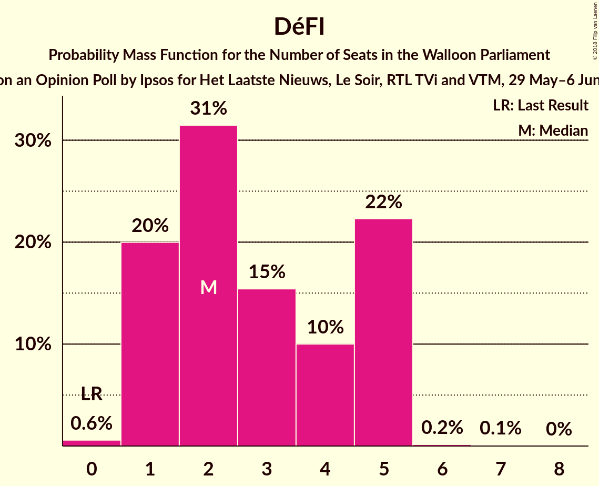

| Number of Seats | Probability | Accumulated | Special Marks |
|:---------------:|:-----------:|:-----------:|:-------------:|
| 0 | 0.6% | 100% | Last Result |
| 1 | 20% | 99.4% |  |
| 2 | 31% | 79% | Median |
| 3 | 15% | 48% |  |
| 4 | 10% | 33% |  |
| 5 | 22% | 23% |  |
| 6 | 0.2% | 0.2% |  |
| 7 | 0.1% | 0.1% |  |
| 8 | 0% | 0% |  |

### La Droite

*For a full overview of the results for this party, see the [La Droite](party-ladroite.html) page.*

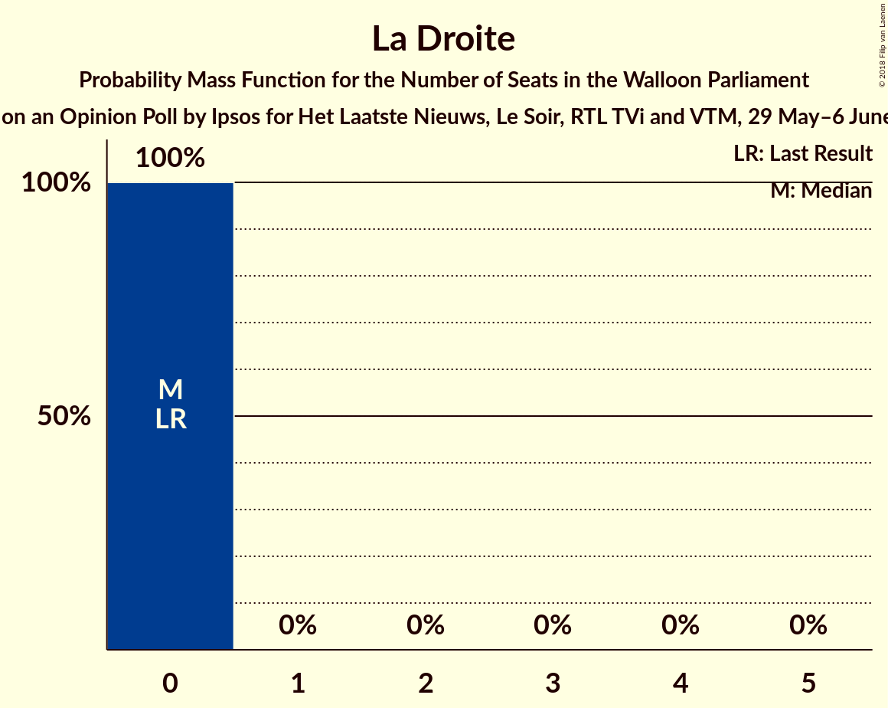

| Number of Seats | Probability | Accumulated | Special Marks |
|:---------------:|:-----------:|:-----------:|:-------------:|
| 0 | 100% | 100% | Last Result, Median |

## Coalitions

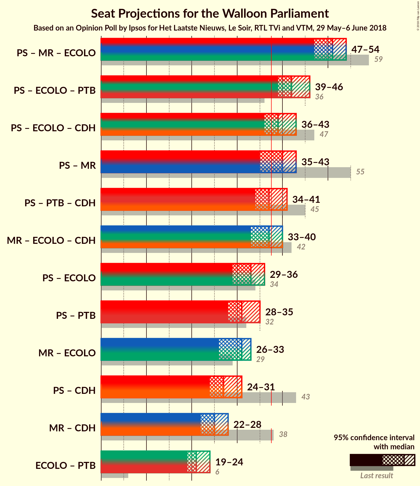

### Confidence Intervals

| Coalition | Last Result | Median | Majority? | 80% Confidence Interval | 90% Confidence Interval | 95% Confidence Interval | 99% Confidence Interval |
|:---------:|:-----------:|:------:|:---------:|:-----------------------:|:-----------------------:|:-----------------------:|:-----------------------:|
| PS – MR – Ecolo | 59 | 51 | 100% | 49–53 | 48–54 | 47–54 | 46–55 |
| PS – Ecolo – PTB | 36 | 42 | 99.7% | 40–45 | 40–45 | 39–46 | 38–47 |
| PS – Ecolo – cdH | 47 | 39 | 80% | 37–42 | 36–42 | 36–43 | 35–44 |
| PS – MR | 55 | 40 | 89% | 37–42 | 36–42 | 35–43 | 34–44 |
| PS – PTB – cdH | 45 | 37 | 42% | 35–40 | 34–41 | 34–41 | 33–42 |
| MR – Ecolo – cdH | 42 | 37 | 32% | 34–39 | 34–39 | 33–40 | 32–41 |
| PS – Ecolo | 34 | 33 | 0.2% | 30–35 | 30–35 | 29–36 | 28–37 |
| PS – PTB | 32 | 31 | 0% | 29–33 | 28–34 | 28–35 | 27–36 |
| MR – Ecolo | 29 | 31 | 0% | 28–32 | 27–33 | 26–33 | 25–34 |
| PS – cdH | 43 | 27 | 0% | 25–30 | 25–31 | 24–31 | 23–32 |
| MR – cdH | 38 | 25 | 0% | 23–27 | 22–28 | 22–28 | 21–29 |
| Ecolo – PTB | 6 | 21 | 0% | 20–23 | 19–24 | 19–24 | 17–25 |

### PS – MR – Ecolo

| Number of Seats | Probability | Accumulated | Special Marks |
|:---------------:|:-----------:|:-----------:|:-------------:|
| 44 | 0.1% | 100% |  |
| 45 | 0.4% | 99.9% |  |
| 46 | 0.8% | 99.5% |  |
| 47 | 3% | 98.7% |  |
| 48 | 4% | 95% |  |
| 49 | 6% | 91% |  |
| 50 | 16% | 85% |  |
| 51 | 20% | 69% |  |
| 52 | 20% | 49% | Median |
| 53 | 21% | 29% |  |
| 54 | 7% | 8% |  |
| 55 | 0.9% | 1.2% |  |
| 56 | 0.3% | 0.3% |  |
| 57 | 0% | 0% |  |
| 58 | 0% | 0% |  |
| 59 | 0% | 0% | Last Result |

### PS – Ecolo – PTB

| Number of Seats | Probability | Accumulated | Special Marks |
|:---------------:|:-----------:|:-----------:|:-------------:|
| 36 | 0% | 100% | Last Result |
| 37 | 0.2% | 100% |  |
| 38 | 0.7% | 99.7% | Majority |
| 39 | 4% | 99.0% |  |
| 40 | 9% | 96% |  |
| 41 | 14% | 86% |  |
| 42 | 32% | 73% |  |
| 43 | 18% | 40% | Median |
| 44 | 12% | 23% |  |
| 45 | 6% | 10% |  |
| 46 | 3% | 4% |  |
| 47 | 1.0% | 1.4% |  |
| 48 | 0.3% | 0.4% |  |
| 49 | 0.1% | 0.1% |  |
| 50 | 0% | 0% |  |

### PS – Ecolo – cdH

| Number of Seats | Probability | Accumulated | Special Marks |
|:---------------:|:-----------:|:-----------:|:-------------:|
| 33 | 0.1% | 100% |  |
| 34 | 0.4% | 99.9% |  |
| 35 | 2% | 99.5% |  |
| 36 | 7% | 98% |  |
| 37 | 10% | 90% |  |
| 38 | 25% | 80% | Majority |
| 39 | 18% | 55% | Median |
| 40 | 13% | 37% |  |
| 41 | 13% | 24% |  |
| 42 | 7% | 11% |  |
| 43 | 3% | 4% |  |
| 44 | 1.1% | 1.2% |  |
| 45 | 0.1% | 0.2% |  |
| 46 | 0% | 0% |  |
| 47 | 0% | 0% | Last Result |

### PS – MR

| Number of Seats | Probability | Accumulated | Special Marks |
|:---------------:|:-----------:|:-----------:|:-------------:|
| 33 | 0.1% | 100% |  |
| 34 | 0.4% | 99.9% |  |
| 35 | 2% | 99.4% |  |
| 36 | 3% | 97% |  |
| 37 | 5% | 94% |  |
| 38 | 9% | 89% | Majority |
| 39 | 23% | 80% |  |
| 40 | 18% | 56% | Median |
| 41 | 27% | 39% |  |
| 42 | 9% | 11% |  |
| 43 | 2% | 3% |  |
| 44 | 0.4% | 0.6% |  |
| 45 | 0.1% | 0.2% |  |
| 46 | 0% | 0% |  |
| 47 | 0% | 0% |  |
| 48 | 0% | 0% |  |
| 49 | 0% | 0% |  |
| 50 | 0% | 0% |  |
| 51 | 0% | 0% |  |
| 52 | 0% | 0% |  |
| 53 | 0% | 0% |  |
| 54 | 0% | 0% |  |
| 55 | 0% | 0% | Last Result |

### PS – PTB – cdH

| Number of Seats | Probability | Accumulated | Special Marks |
|:---------------:|:-----------:|:-----------:|:-------------:|
| 32 | 0.2% | 100% |  |
| 33 | 1.2% | 99.8% |  |
| 34 | 4% | 98.6% |  |
| 35 | 14% | 94% |  |
| 36 | 20% | 80% |  |
| 37 | 18% | 60% | Median |
| 38 | 15% | 42% | Majority |
| 39 | 14% | 27% |  |
| 40 | 6% | 12% |  |
| 41 | 5% | 7% |  |
| 42 | 1.2% | 2% |  |
| 43 | 0.3% | 0.4% |  |
| 44 | 0.1% | 0.1% |  |
| 45 | 0% | 0% | Last Result |

### MR – Ecolo – cdH

| Number of Seats | Probability | Accumulated | Special Marks |
|:---------------:|:-----------:|:-----------:|:-------------:|
| 31 | 0.2% | 100% |  |
| 32 | 0.7% | 99.8% |  |
| 33 | 3% | 99.0% |  |
| 34 | 7% | 96% |  |
| 35 | 11% | 89% |  |
| 36 | 17% | 79% |  |
| 37 | 29% | 61% | Median |
| 38 | 19% | 32% | Majority |
| 39 | 9% | 14% |  |
| 40 | 4% | 5% |  |
| 41 | 0.5% | 0.6% |  |
| 42 | 0.1% | 0.1% | Last Result |
| 43 | 0% | 0% |  |

### PS – Ecolo

| Number of Seats | Probability | Accumulated | Special Marks |
|:---------------:|:-----------:|:-----------:|:-------------:|
| 26 | 0.1% | 100% |  |
| 27 | 0.1% | 99.9% |  |
| 28 | 0.6% | 99.8% |  |
| 29 | 2% | 99.2% |  |
| 30 | 9% | 97% |  |
| 31 | 9% | 88% |  |
| 32 | 28% | 79% |  |
| 33 | 28% | 51% | Median |
| 34 | 13% | 24% | Last Result |
| 35 | 7% | 11% |  |
| 36 | 3% | 3% |  |
| 37 | 0.7% | 1.0% |  |
| 38 | 0.1% | 0.2% | Majority |
| 39 | 0.1% | 0.1% |  |
| 40 | 0% | 0% |  |

### PS – PTB

| Number of Seats | Probability | Accumulated | Special Marks |
|:---------------:|:-----------:|:-----------:|:-------------:|
| 26 | 0.3% | 100% |  |
| 27 | 0.9% | 99.7% |  |
| 28 | 5% | 98.9% |  |
| 29 | 13% | 93% |  |
| 30 | 28% | 80% |  |
| 31 | 25% | 53% | Median |
| 32 | 13% | 28% | Last Result |
| 33 | 9% | 15% |  |
| 34 | 3% | 5% |  |
| 35 | 2% | 3% |  |
| 36 | 0.4% | 0.5% |  |
| 37 | 0.1% | 0.2% |  |
| 38 | 0% | 0% | Majority |

### MR – Ecolo

| Number of Seats | Probability | Accumulated | Special Marks |
|:---------------:|:-----------:|:-----------:|:-------------:|
| 24 | 0.1% | 100% |  |
| 25 | 0.5% | 99.8% |  |
| 26 | 2% | 99.3% |  |
| 27 | 5% | 97% |  |
| 28 | 8% | 93% |  |
| 29 | 17% | 85% | Last Result |
| 30 | 17% | 68% |  |
| 31 | 22% | 51% | Median |
| 32 | 23% | 29% |  |
| 33 | 5% | 6% |  |
| 34 | 0.8% | 1.0% |  |
| 35 | 0.2% | 0.2% |  |
| 36 | 0% | 0% |  |

### PS – cdH

| Number of Seats | Probability | Accumulated | Special Marks |
|:---------------:|:-----------:|:-----------:|:-------------:|
| 22 | 0.1% | 100% |  |
| 23 | 1.1% | 99.9% |  |
| 24 | 2% | 98.8% |  |
| 25 | 12% | 97% |  |
| 26 | 18% | 85% |  |
| 27 | 21% | 66% | Median |
| 28 | 18% | 45% |  |
| 29 | 12% | 27% |  |
| 30 | 9% | 15% |  |
| 31 | 5% | 6% |  |
| 32 | 1.1% | 2% |  |
| 33 | 0.3% | 0.4% |  |
| 34 | 0.1% | 0.1% |  |
| 35 | 0% | 0% |  |
| 36 | 0% | 0% |  |
| 37 | 0% | 0% |  |
| 38 | 0% | 0% | Majority |
| 39 | 0% | 0% |  |
| 40 | 0% | 0% |  |
| 41 | 0% | 0% |  |
| 42 | 0% | 0% |  |
| 43 | 0% | 0% | Last Result |

### MR – cdH

| Number of Seats | Probability | Accumulated | Special Marks |
|:---------------:|:-----------:|:-----------:|:-------------:|
| 19 | 0.1% | 100% |  |
| 20 | 0.3% | 99.9% |  |
| 21 | 2% | 99.6% |  |
| 22 | 4% | 98% |  |
| 23 | 10% | 94% |  |
| 24 | 13% | 84% |  |
| 25 | 25% | 72% | Median |
| 26 | 30% | 46% |  |
| 27 | 10% | 17% |  |
| 28 | 5% | 7% |  |
| 29 | 1.2% | 1.5% |  |
| 30 | 0.3% | 0.3% |  |
| 31 | 0% | 0% |  |
| 32 | 0% | 0% |  |
| 33 | 0% | 0% |  |
| 34 | 0% | 0% |  |
| 35 | 0% | 0% |  |
| 36 | 0% | 0% |  |
| 37 | 0% | 0% |  |
| 38 | 0% | 0% | Last Result, Majority |

### Ecolo – PTB

| Number of Seats | Probability | Accumulated | Special Marks |
|:---------------:|:-----------:|:-----------:|:-------------:|
| 6 | 0% | 100% | Last Result |
| 7 | 0% | 100% |  |
| 8 | 0% | 100% |  |
| 9 | 0% | 100% |  |
| 10 | 0% | 100% |  |
| 11 | 0% | 100% |  |
| 12 | 0% | 100% |  |
| 13 | 0% | 100% |  |
| 14 | 0% | 100% |  |
| 15 | 0% | 100% |  |
| 16 | 0.1% | 100% |  |
| 17 | 0.5% | 99.9% |  |
| 18 | 0.6% | 99.4% |  |
| 19 | 4% | 98.8% |  |
| 20 | 11% | 95% |  |
| 21 | 46% | 84% |  |
| 22 | 24% | 38% | Median |
| 23 | 9% | 14% |  |
| 24 | 4% | 5% |  |
| 25 | 1.0% | 1.4% |  |
| 26 | 0.3% | 0.5% |  |
| 27 | 0.2% | 0.2% |  |
| 28 | 0% | 0% |  |

## Technical Information

### Opinion Poll

+ **Polling firm:** Ipsos
+ **Commissioner(s):** Het Laatste Nieuws, Le Soir, RTL TVi and VTM
+ **Fieldwork period:** 29 May–6 June 2018

### Calculations

+ **Sample size:** 1000
+ **Simulations done:** 1,048,576
+ **Error estimate:** 1.14%

