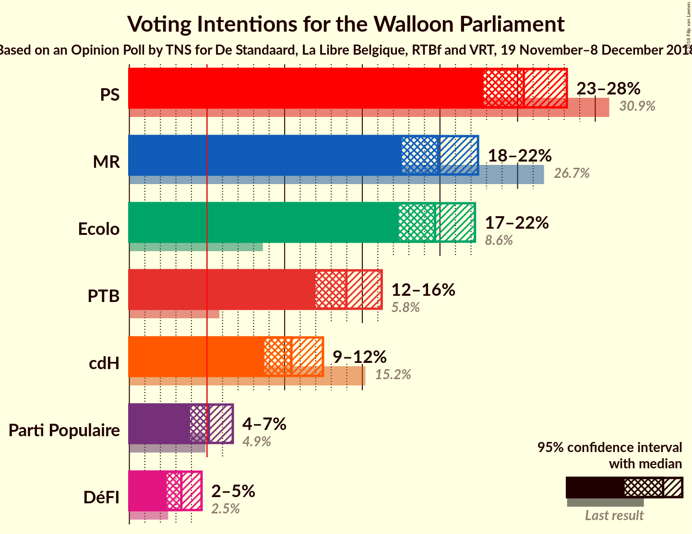
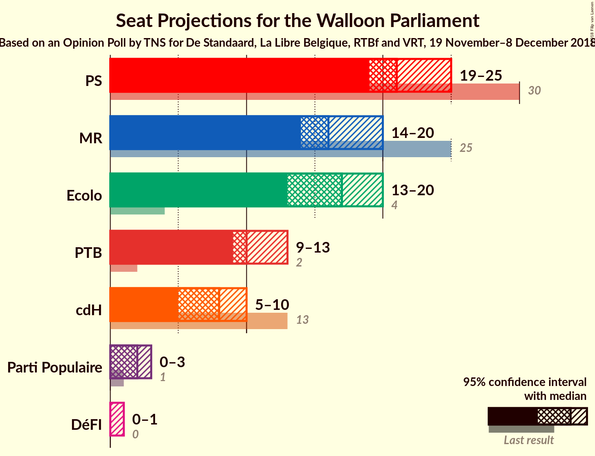
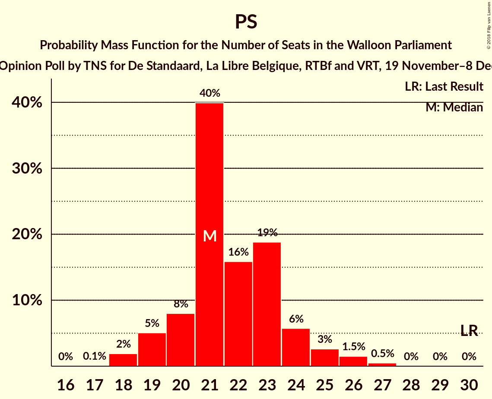
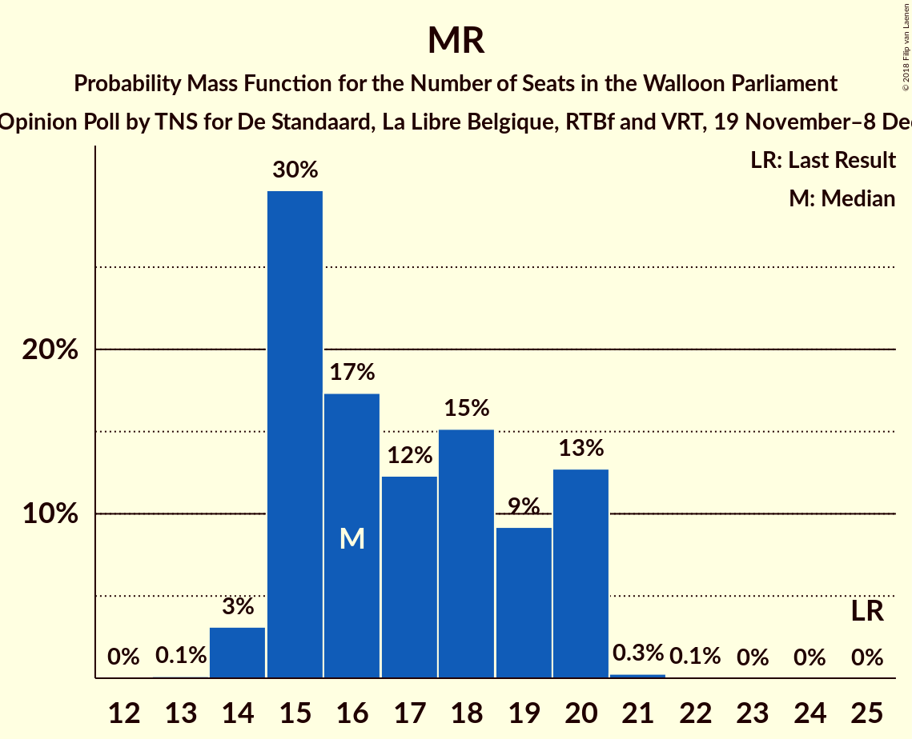
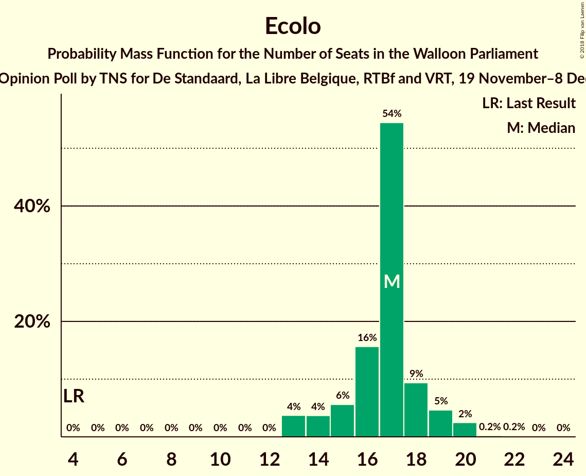
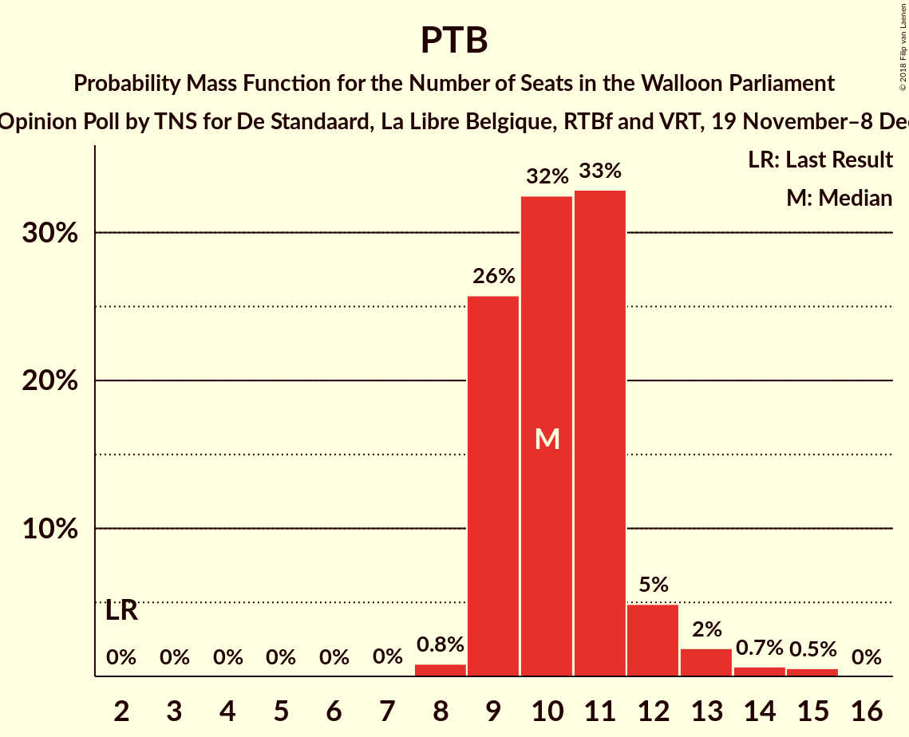
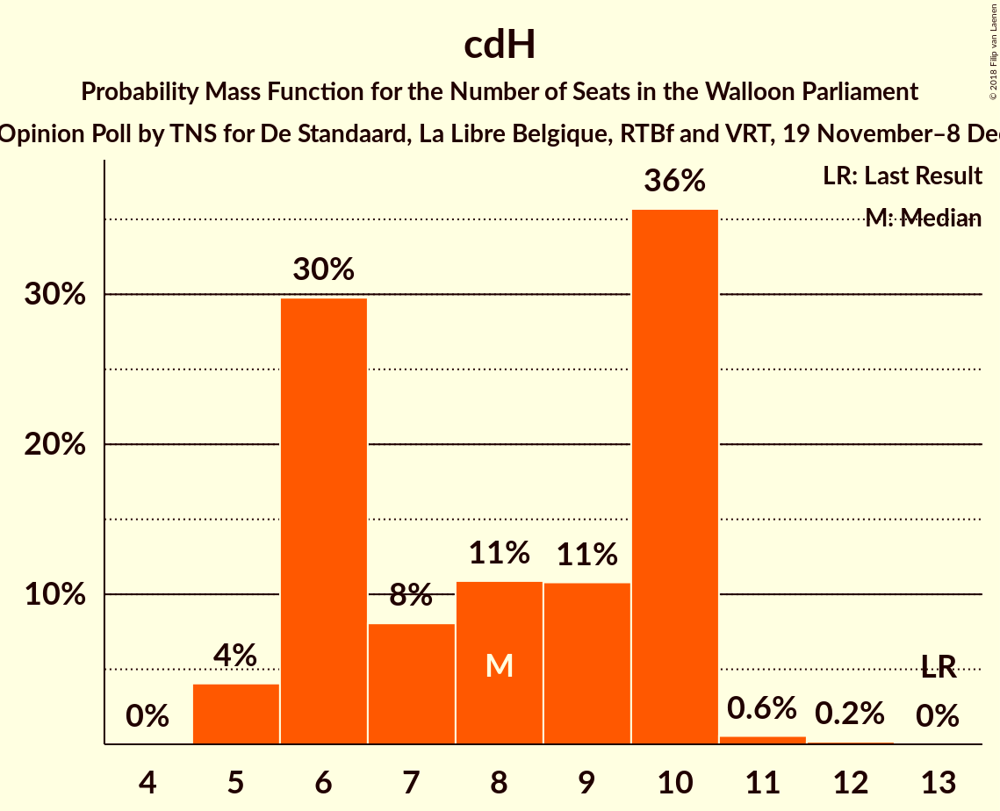
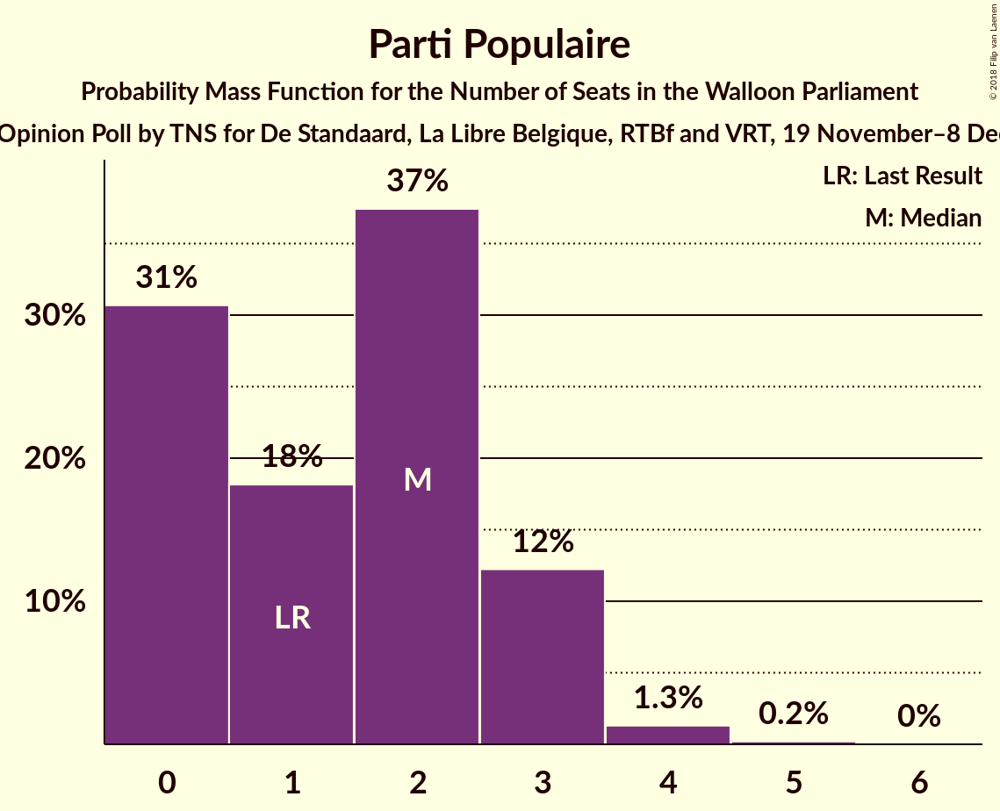
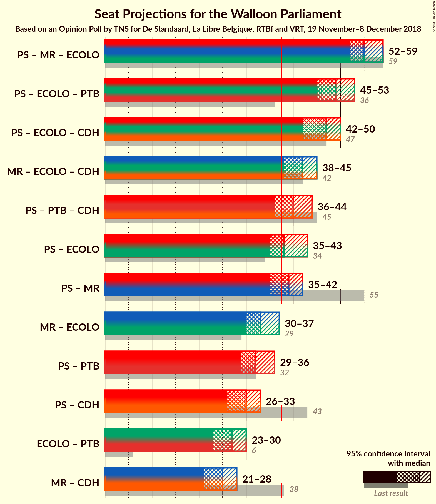

# Opinion Poll by TNS for De Standaard, La Libre Belgique, RTBf and VRT, 19 November–8 December 2018

<a href="#voting-intentions">Voting Intentions</a> | <a href="#seats">Seats</a> | <a href="#coalitions">Coalitions</a> | <a href="#technical-information">Technical Information</a>

## Voting Intentions

### Confidence Intervals

| Party | Last Result | Poll Result | 80% Confidence Interval | 90% Confidence Interval | 95% Confidence Interval | 99% Confidence Interval |
|:-----:|:-----------:|:-----------:|:-----------------------:|:-----------------------:|:-----------------------:|:-----------------------:|
| PS | 30.9% | 25.4% | 23.7–27.2% |23.2–27.7% |22.8–28.2% |22.0–29.1% |
| MR | 26.7% | 19.9% | 18.3–21.6% |17.9–22.0% |17.5–22.5% |16.8–23.3% |
| Ecolo | 8.6% | 19.7% | 18.2–21.4% |17.7–21.8% |17.3–22.3% |16.6–23.1% |
| PTB | 5.8% | 14.0% | 12.7–15.5% |12.3–15.9% |12.0–16.2% |11.4–17.0% |
| cdH | 15.2% | 10.4% | 9.3–11.8% |9.0–12.1% |8.7–12.5% |8.2–13.1% |
| Parti Populaire | 4.9% | 5.1% | 4.3–6.1% |4.1–6.4% |3.9–6.7% |3.6–7.2% |
| DéFI | 2.5% | 3.3% | 2.7–4.2% |2.5–4.4% |2.4–4.6% |2.1–5.1% |

*Note:* The poll result column reflects the actual value used in the calculations. Published results may vary slightly, and in addition be rounded to fewer digits.

## Seats

### Confidence Intervals

| Party | Last Result | Median | 80% Confidence Interval | 90% Confidence Interval | 95% Confidence Interval | 99% Confidence Interval |
|:-----:|:-----------:|:------:|:-----------------------:|:-----------------------:|:-----------------------:|:-----------------------:|
| <a href="#ps">PS</a> | 30 | 21 | 20–24 |19–24 |19–25 |18–27 |
| <a href="#mr">MR</a> | 25 | 16 | 15–20 |15–20 |14–20 |14–20 |
| <a href="#ecolo">Ecolo</a> | 4 | 17 | 15–18 |14–19 |13–20 |13–20 |
| <a href="#ptb">PTB</a> | 2 | 10 | 9–11 |9–12 |9–13 |8–15 |
| <a href="#cdh">cdH</a> | 13 | 8 | 6–10 |6–10 |5–10 |5–11 |
| <a href="#parti-populaire">Parti Populaire</a> | 1 | 2 | 0–3 |0–3 |0–3 |0–4 |
| <a href="#défi">DéFI</a> | 0 | 0 | 0 |0 |0–1 |0–1 |

### PS

*For a full overview of the results for this party, see the [PS](party-ps.html) page.*

| Number of Seats | Probability | Accumulated | Special Marks |
|:---------------:|:-----------:|:-----------:|:-------------:|
| 17 | 0.1% | 100% |  |
| 18 | 2% | 99.9% |  |
| 19 | 5% | 98% |  |
| 20 | 8% | 93% |  |
| 21 | 40% | 85% | Median |
| 22 | 16% | 45% |  |
| 23 | 19% | 29% |  |
| 24 | 6% | 10% |  |
| 25 | 3% | 5% |  |
| 26 | 1.5% | 2% |  |
| 27 | 0.5% | 0.5% |  |
| 28 | 0% | 0% |  |
| 29 | 0% | 0% |  |
| 30 | 0% | 0% | Last Result |

### MR

*For a full overview of the results for this party, see the [MR](party-mr.html) page.*

| Number of Seats | Probability | Accumulated | Special Marks |
|:---------------:|:-----------:|:-----------:|:-------------:|
| 13 | 0.1% | 100% |  |
| 14 | 3% | 99.9% |  |
| 15 | 30% | 97% |  |
| 16 | 17% | 67% | Median |
| 17 | 12% | 50% |  |
| 18 | 15% | 37% |  |
| 19 | 9% | 22% |  |
| 20 | 13% | 13% |  |
| 21 | 0.3% | 0.3% |  |
| 22 | 0.1% | 0.1% |  |
| 23 | 0% | 0% |  |
| 24 | 0% | 0% |  |
| 25 | 0% | 0% | Last Result |

### Ecolo

*For a full overview of the results for this party, see the [Ecolo](party-ecolo.html) page.*

| Number of Seats | Probability | Accumulated | Special Marks |
|:---------------:|:-----------:|:-----------:|:-------------:|
| 4 | 0% | 100% | Last Result |
| 5 | 0% | 100% |  |
| 6 | 0% | 100% |  |
| 7 | 0% | 100% |  |
| 8 | 0% | 100% |  |
| 9 | 0% | 100% |  |
| 10 | 0% | 100% |  |
| 11 | 0% | 100% |  |
| 12 | 0% | 100% |  |
| 13 | 4% | 100% |  |
| 14 | 4% | 96% |  |
| 15 | 6% | 93% |  |
| 16 | 16% | 87% |  |
| 17 | 54% | 71% | Median |
| 18 | 9% | 17% |  |
| 19 | 5% | 8% |  |
| 20 | 2% | 3% |  |
| 21 | 0.2% | 0.4% |  |
| 22 | 0.2% | 0.2% |  |
| 23 | 0% | 0% |  |

### PTB

*For a full overview of the results for this party, see the [PTB](party-ptb.html) page.*

| Number of Seats | Probability | Accumulated | Special Marks |
|:---------------:|:-----------:|:-----------:|:-------------:|
| 2 | 0% | 100% | Last Result |
| 3 | 0% | 100% |  |
| 4 | 0% | 100% |  |
| 5 | 0% | 100% |  |
| 6 | 0% | 100% |  |
| 7 | 0% | 100% |  |
| 8 | 0.8% | 100% |  |
| 9 | 26% | 99.1% |  |
| 10 | 32% | 73% | Median |
| 11 | 33% | 41% |  |
| 12 | 5% | 8% |  |
| 13 | 2% | 3% |  |
| 14 | 0.7% | 1.2% |  |
| 15 | 0.5% | 0.5% |  |
| 16 | 0% | 0% |  |

### cdH

*For a full overview of the results for this party, see the [cdH](party-cdh.html) page.*

| Number of Seats | Probability | Accumulated | Special Marks |
|:---------------:|:-----------:|:-----------:|:-------------:|
| 5 | 4% | 100% |  |
| 6 | 30% | 96% |  |
| 7 | 8% | 66% |  |
| 8 | 11% | 58% | Median |
| 9 | 11% | 47% |  |
| 10 | 36% | 36% |  |
| 11 | 0.6% | 0.7% |  |
| 12 | 0.2% | 0.2% |  |
| 13 | 0% | 0% | Last Result |

### Parti Populaire

*For a full overview of the results for this party, see the [Parti Populaire](party-partipopulaire.html) page.*

| Number of Seats | Probability | Accumulated | Special Marks |
|:---------------:|:-----------:|:-----------:|:-------------:|
| 0 | 31% | 100% |  |
| 1 | 18% | 69% | Last Result |
| 2 | 37% | 51% | Median |
| 3 | 12% | 14% |  |
| 4 | 1.3% | 2% |  |
| 5 | 0.2% | 0.2% |  |
| 6 | 0% | 0% |  |

### DéFI

*For a full overview of the results for this party, see the [DéFI](party-défi.html) page.*

| Number of Seats | Probability | Accumulated | Special Marks |
|:---------------:|:-----------:|:-----------:|:-------------:|
| 0 | 96% | 100% | Last Result, Median |
| 1 | 4% | 4% |  |
| 2 | 0.1% | 0.1% |  |
| 3 | 0% | 0% |  |

## Coalitions

### Confidence Intervals

| Coalition | Last Result | Median | Majority? | 80% Confidence Interval | 90% Confidence Interval | 95% Confidence Interval | 99% Confidence Interval |
|:---------:|:-----------:|:------:|:---------:|:-----------------------:|:-----------------------:|:-----------------------:|:-----------------------:|
| PS – MR – Ecolo | 59 | 55 | 100% | 52–58 | 52–59 | 52–59 | 51–60 |
| PS – Ecolo – PTB | 36 | 49 | 100% | 46–51 | 46–52 | 45–53 | 44–54 |
| PS – Ecolo – cdH | 47 | 47 | 100% | 44–49 | 43–50 | 42–50 | 41–50 |
| MR – Ecolo – cdH | 42 | 42 | 98.8% | 39–44 | 39–44 | 38–45 | 37–45 |
| PS – PTB – cdH | 45 | 40 | 87% | 37–42 | 36–43 | 36–44 | 35–45 |
| PS – Ecolo | 34 | 38 | 70% | 36–41 | 35–42 | 35–43 | 34–44 |
| PS – MR | 55 | 39 | 64% | 36–41 | 35–42 | 35–42 | 34–43 |
| MR – Ecolo | 29 | 33 | 2% | 31–37 | 31–37 | 30–37 | 29–38 |
| PS – PTB | 32 | 32 | 0.2% | 30–34 | 30–35 | 29–36 | 28–37 |
| PS – cdH | 43 | 30 | 0% | 27–32 | 26–33 | 26–33 | 25–34 |
| Ecolo – PTB | 6 | 27 | 0% | 25–29 | 24–30 | 23–30 | 23–32 |
| MR – cdH | 38 | 25 | 0% | 22–27 | 22–28 | 21–28 | 20–29 |

### PS – MR – Ecolo

| Number of Seats | Probability | Accumulated | Special Marks |
|:---------------:|:-----------:|:-----------:|:-------------:|
| 49 | 0.1% | 100% |  |
| 50 | 0.3% | 99.9% |  |
| 51 | 1.4% | 99.6% |  |
| 52 | 9% | 98% |  |
| 53 | 15% | 90% |  |
| 54 | 15% | 75% | Median |
| 55 | 14% | 59% |  |
| 56 | 14% | 45% |  |
| 57 | 11% | 32% |  |
| 58 | 12% | 20% |  |
| 59 | 7% | 9% | Last Result |
| 60 | 2% | 2% |  |
| 61 | 0% | 0% |  |

### PS – Ecolo – PTB

| Number of Seats | Probability | Accumulated | Special Marks |
|:---------------:|:-----------:|:-----------:|:-------------:|
| 36 | 0% | 100% | Last Result |
| 37 | 0% | 100% |  |
| 38 | 0% | 100% | Majority |
| 39 | 0% | 100% |  |
| 40 | 0% | 100% |  |
| 41 | 0% | 100% |  |
| 42 | 0% | 100% |  |
| 43 | 0.2% | 100% |  |
| 44 | 1.1% | 99.7% |  |
| 45 | 3% | 98.6% |  |
| 46 | 6% | 95% |  |
| 47 | 16% | 89% |  |
| 48 | 20% | 73% | Median |
| 49 | 23% | 53% |  |
| 50 | 15% | 30% |  |
| 51 | 7% | 15% |  |
| 52 | 4% | 8% |  |
| 53 | 3% | 4% |  |
| 54 | 0.8% | 0.9% |  |
| 55 | 0.1% | 0.1% |  |
| 56 | 0% | 0% |  |

### PS – Ecolo – cdH

| Number of Seats | Probability | Accumulated | Special Marks |
|:---------------:|:-----------:|:-----------:|:-------------:|
| 40 | 0.1% | 100% |  |
| 41 | 0.6% | 99.8% |  |
| 42 | 2% | 99.2% |  |
| 43 | 5% | 97% |  |
| 44 | 10% | 92% |  |
| 45 | 13% | 82% |  |
| 46 | 17% | 69% | Median |
| 47 | 18% | 52% | Last Result |
| 48 | 18% | 34% |  |
| 49 | 11% | 16% |  |
| 50 | 5% | 5% |  |
| 51 | 0.4% | 0.4% |  |
| 52 | 0% | 0% |  |

### MR – Ecolo – cdH

| Number of Seats | Probability | Accumulated | Special Marks |
|:---------------:|:-----------:|:-----------:|:-------------:|
| 35 | 0.1% | 100% |  |
| 36 | 0.3% | 99.9% |  |
| 37 | 0.8% | 99.6% |  |
| 38 | 2% | 98.8% | Majority |
| 39 | 7% | 96% |  |
| 40 | 14% | 90% |  |
| 41 | 18% | 75% | Median |
| 42 | 21% | 57% | Last Result |
| 43 | 26% | 36% |  |
| 44 | 7% | 10% |  |
| 45 | 2% | 3% |  |
| 46 | 0.4% | 0.4% |  |
| 47 | 0.1% | 0.1% |  |
| 48 | 0% | 0% |  |

### PS – PTB – cdH

| Number of Seats | Probability | Accumulated | Special Marks |
|:---------------:|:-----------:|:-----------:|:-------------:|
| 34 | 0.1% | 100% |  |
| 35 | 0.6% | 99.9% |  |
| 36 | 5% | 99.3% |  |
| 37 | 7% | 94% |  |
| 38 | 14% | 87% | Majority |
| 39 | 14% | 73% | Median |
| 40 | 14% | 59% |  |
| 41 | 18% | 45% |  |
| 42 | 16% | 26% |  |
| 43 | 6% | 10% |  |
| 44 | 3% | 4% |  |
| 45 | 0.8% | 1.1% | Last Result |
| 46 | 0.2% | 0.3% |  |
| 47 | 0% | 0% |  |

### PS – Ecolo

| Number of Seats | Probability | Accumulated | Special Marks |
|:---------------:|:-----------:|:-----------:|:-------------:|
| 33 | 0.3% | 100% |  |
| 34 | 2% | 99.7% | Last Result |
| 35 | 4% | 98% |  |
| 36 | 8% | 94% |  |
| 37 | 16% | 86% |  |
| 38 | 27% | 70% | Median, Majority |
| 39 | 16% | 43% |  |
| 40 | 14% | 28% |  |
| 41 | 7% | 14% |  |
| 42 | 4% | 6% |  |
| 43 | 2% | 3% |  |
| 44 | 0.5% | 0.5% |  |
| 45 | 0% | 0% |  |

### PS – MR

| Number of Seats | Probability | Accumulated | Special Marks |
|:---------------:|:-----------:|:-----------:|:-------------:|
| 33 | 0.1% | 100% |  |
| 34 | 1.3% | 99.9% |  |
| 35 | 5% | 98.5% |  |
| 36 | 17% | 94% |  |
| 37 | 13% | 77% | Median |
| 38 | 13% | 64% | Majority |
| 39 | 15% | 51% |  |
| 40 | 13% | 36% |  |
| 41 | 14% | 23% |  |
| 42 | 7% | 9% |  |
| 43 | 2% | 2% |  |
| 44 | 0.3% | 0.4% |  |
| 45 | 0.1% | 0.1% |  |
| 46 | 0% | 0% |  |
| 47 | 0% | 0% |  |
| 48 | 0% | 0% |  |
| 49 | 0% | 0% |  |
| 50 | 0% | 0% |  |
| 51 | 0% | 0% |  |
| 52 | 0% | 0% |  |
| 53 | 0% | 0% |  |
| 54 | 0% | 0% |  |
| 55 | 0% | 0% | Last Result |

### MR – Ecolo

| Number of Seats | Probability | Accumulated | Special Marks |
|:---------------:|:-----------:|:-----------:|:-------------:|
| 27 | 0.1% | 100% |  |
| 28 | 0.2% | 99.9% |  |
| 29 | 0.7% | 99.7% | Last Result |
| 30 | 4% | 99.0% |  |
| 31 | 9% | 95% |  |
| 32 | 19% | 86% |  |
| 33 | 19% | 67% | Median |
| 34 | 15% | 48% |  |
| 35 | 14% | 34% |  |
| 36 | 9% | 20% |  |
| 37 | 9% | 10% |  |
| 38 | 1.3% | 2% | Majority |
| 39 | 0.3% | 0.3% |  |
| 40 | 0% | 0% |  |

### PS – PTB

| Number of Seats | Probability | Accumulated | Special Marks |
|:---------------:|:-----------:|:-----------:|:-------------:|
| 27 | 0.1% | 100% |  |
| 28 | 1.2% | 99.9% |  |
| 29 | 3% | 98.6% |  |
| 30 | 17% | 95% |  |
| 31 | 17% | 79% | Median |
| 32 | 30% | 62% | Last Result |
| 33 | 15% | 32% |  |
| 34 | 9% | 16% |  |
| 35 | 4% | 7% |  |
| 36 | 2% | 3% |  |
| 37 | 0.7% | 0.9% |  |
| 38 | 0.2% | 0.2% | Majority |
| 39 | 0% | 0% |  |

### PS – cdH

| Number of Seats | Probability | Accumulated | Special Marks |
|:---------------:|:-----------:|:-----------:|:-------------:|
| 24 | 0.2% | 100% |  |
| 25 | 0.9% | 99.8% |  |
| 26 | 4% | 98.9% |  |
| 27 | 9% | 94% |  |
| 28 | 12% | 86% |  |
| 29 | 19% | 73% | Median |
| 30 | 14% | 54% |  |
| 31 | 23% | 40% |  |
| 32 | 9% | 17% |  |
| 33 | 6% | 8% |  |
| 34 | 1.5% | 2% |  |
| 35 | 0.3% | 0.4% |  |
| 36 | 0% | 0% |  |
| 37 | 0% | 0% |  |
| 38 | 0% | 0% | Majority |
| 39 | 0% | 0% |  |
| 40 | 0% | 0% |  |
| 41 | 0% | 0% |  |
| 42 | 0% | 0% |  |
| 43 | 0% | 0% | Last Result |

### Ecolo – PTB

| Number of Seats | Probability | Accumulated | Special Marks |
|:---------------:|:-----------:|:-----------:|:-------------:|
| 6 | 0% | 100% | Last Result |
| 7 | 0% | 100% |  |
| 8 | 0% | 100% |  |
| 9 | 0% | 100% |  |
| 10 | 0% | 100% |  |
| 11 | 0% | 100% |  |
| 12 | 0% | 100% |  |
| 13 | 0% | 100% |  |
| 14 | 0% | 100% |  |
| 15 | 0% | 100% |  |
| 16 | 0% | 100% |  |
| 17 | 0% | 100% |  |
| 18 | 0% | 100% |  |
| 19 | 0% | 100% |  |
| 20 | 0% | 100% |  |
| 21 | 0% | 100% |  |
| 22 | 0.2% | 100% |  |
| 23 | 3% | 99.7% |  |
| 24 | 3% | 97% |  |
| 25 | 6% | 94% |  |
| 26 | 21% | 87% |  |
| 27 | 32% | 67% | Median |
| 28 | 21% | 34% |  |
| 29 | 8% | 14% |  |
| 30 | 4% | 6% |  |
| 31 | 1.1% | 2% |  |
| 32 | 0.6% | 0.8% |  |
| 33 | 0.2% | 0.2% |  |
| 34 | 0% | 0% |  |

### MR – cdH

| Number of Seats | Probability | Accumulated | Special Marks |
|:---------------:|:-----------:|:-----------:|:-------------:|
| 19 | 0.1% | 100% |  |
| 20 | 0.7% | 99.9% |  |
| 21 | 2% | 99.2% |  |
| 22 | 8% | 97% |  |
| 23 | 11% | 88% |  |
| 24 | 11% | 77% | Median |
| 25 | 28% | 66% |  |
| 26 | 23% | 39% |  |
| 27 | 8% | 16% |  |
| 28 | 6% | 7% |  |
| 29 | 2% | 2% |  |
| 30 | 0.1% | 0.2% |  |
| 31 | 0% | 0% |  |
| 32 | 0% | 0% |  |
| 33 | 0% | 0% |  |
| 34 | 0% | 0% |  |
| 35 | 0% | 0% |  |
| 36 | 0% | 0% |  |
| 37 | 0% | 0% |  |
| 38 | 0% | 0% | Last Result, Majority |

## Technical Information

### Opinion Poll

+ **Polling firm:** TNS
+ **Commissioner(s):** De Standaard, La Libre Belgique, RTBf and VRT
+ **Fieldwork period:** 19 November–8 December 2018

### Calculations

+ **Sample size:** 1016
+ **Simulations done:** 1,048,576
+ **Error estimate:** 1.81%

