# Opinion Poll by TNS for De Standaard, La Libre Belgique, RTBf and VRT, 25 March–14 April 2019

<a href="#voting-intentions">Voting Intentions</a> | <a href="#seats">Seats</a> | <a href="#coalitions">Coalitions</a> | <a href="#technical-information">Technical Information</a>

## Voting Intentions

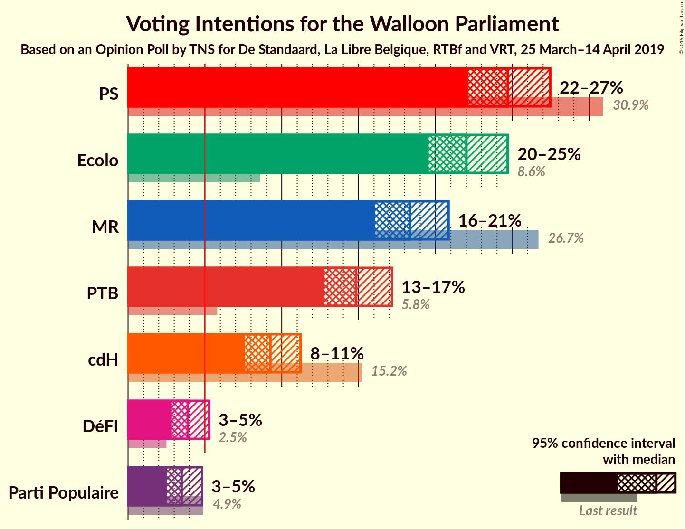

### Confidence Intervals

| Party | Last Result | Poll Result | 80% Confidence Interval | 90% Confidence Interval | 95% Confidence Interval | 99% Confidence Interval |
|:-----:|:-----------:|:-----------:|:-----------------------:|:-----------------------:|:-----------------------:|:-----------------------:|
| PS | 30.9% | 24.7% | 23.0–26.5% |22.5–27.0% |22.1–27.5% |21.3–28.3% |
| Ecolo | 8.6% | 22.0% | 20.4–23.8% |19.9–24.2% |19.6–24.7% |18.8–25.5% |
| MR | 26.7% | 18.3% | 16.8–20.0% |16.4–20.4% |16.0–20.9% |15.4–21.7% |
| PTB | 5.8% | 14.8% | 13.5–16.4% |13.1–16.8% |12.8–17.2% |12.1–17.9% |
| cdH | 15.2% | 9.3% | 8.2–10.5% |7.9–10.9% |7.6–11.2% |7.1–11.9% |
| DéFI | 2.5% | 3.9% | 3.2–4.8% |3.0–5.0% |2.9–5.3% |2.6–5.7% |
| Parti Populaire | 4.9% | 3.5% | 2.9–4.4% |2.7–4.6% |2.5–4.8% |2.2–5.3% |

*Note:* The poll result column reflects the actual value used in the calculations. Published results may vary slightly, and in addition be rounded to fewer digits.

## Seats

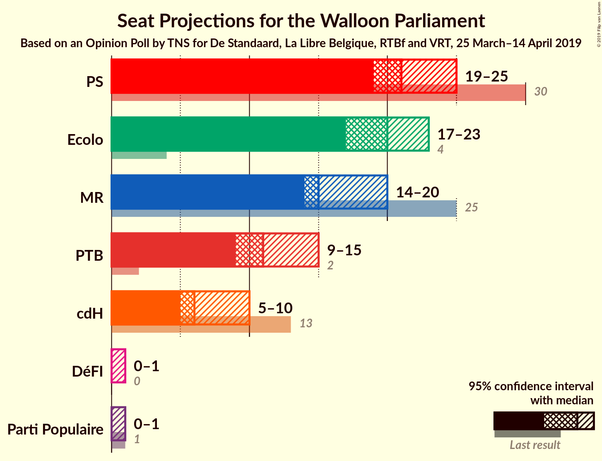

### Confidence Intervals

| Party | Last Result | Median | 80% Confidence Interval | 90% Confidence Interval | 95% Confidence Interval | 99% Confidence Interval |
|:-----:|:-----------:|:------:|:-----------------------:|:-----------------------:|:-----------------------:|:-----------------------:|
| <a href="#ps">PS</a> | 30 | 21 | 20–23 |19–24 |19–25 |18–26 |
| <a href="#ecolo">Ecolo</a> | 4 | 20 | 17–21 |17–22 |17–23 |17–24 |
| <a href="#mr">MR</a> | 25 | 15 | 14–18 |14–19 |14–20 |12–20 |
| <a href="#ptb">PTB</a> | 2 | 11 | 10–13 |10–15 |9–15 |9–15 |
| <a href="#cdh">cdH</a> | 13 | 6 | 5–9 |5–10 |5–10 |5–10 |
| <a href="#défi">DéFI</a> | 0 | 0 | 0–1 |0–1 |0–1 |0–2 |
| <a href="#parti-populaire">Parti Populaire</a> | 1 | 0 | 0 |0 |0–1 |0–2 |

### PS

*For a full overview of the results for this party, see the [PS](party-ps.html) page.*

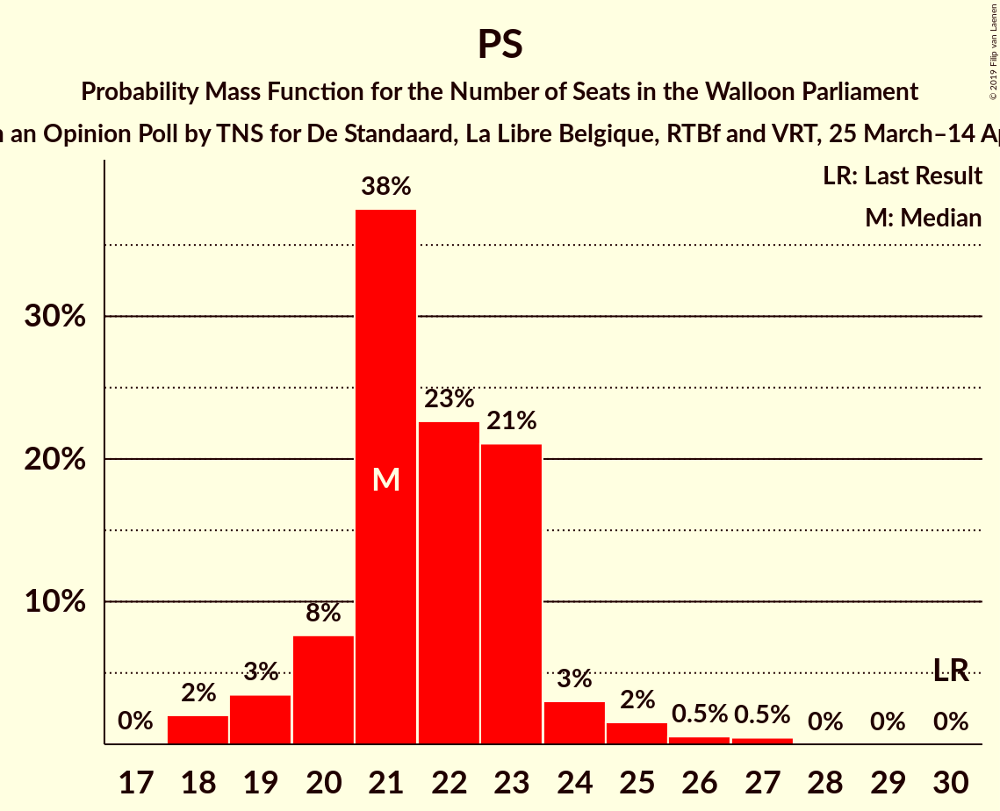

| Number of Seats | Probability | Accumulated | Special Marks |
|:---------------:|:-----------:|:-----------:|:-------------:|
| 18 | 2% | 100% |  |
| 19 | 3% | 98% |  |
| 20 | 8% | 94% |  |
| 21 | 38% | 87% | Median |
| 22 | 23% | 49% |  |
| 23 | 21% | 27% |  |
| 24 | 3% | 6% |  |
| 25 | 2% | 3% |  |
| 26 | 0.5% | 1.0% |  |
| 27 | 0.5% | 0.5% |  |
| 28 | 0% | 0% |  |
| 29 | 0% | 0% |  |
| 30 | 0% | 0% | Last Result |

### Ecolo

*For a full overview of the results for this party, see the [Ecolo](party-ecolo.html) page.*

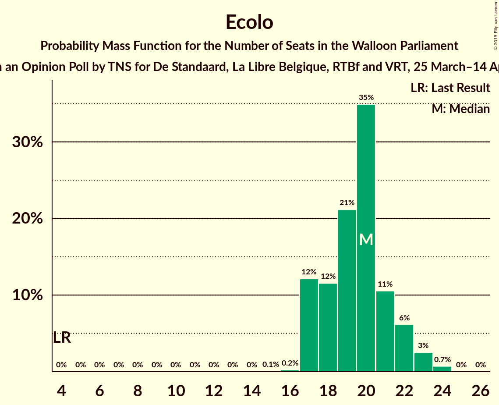

| Number of Seats | Probability | Accumulated | Special Marks |
|:---------------:|:-----------:|:-----------:|:-------------:|
| 4 | 0% | 100% | Last Result |
| 5 | 0% | 100% |  |
| 6 | 0% | 100% |  |
| 7 | 0% | 100% |  |
| 8 | 0% | 100% |  |
| 9 | 0% | 100% |  |
| 10 | 0% | 100% |  |
| 11 | 0% | 100% |  |
| 12 | 0% | 100% |  |
| 13 | 0% | 100% |  |
| 14 | 0% | 100% |  |
| 15 | 0.1% | 100% |  |
| 16 | 0.2% | 99.9% |  |
| 17 | 12% | 99.7% |  |
| 18 | 12% | 88% |  |
| 19 | 21% | 76% |  |
| 20 | 35% | 55% | Median |
| 21 | 11% | 20% |  |
| 22 | 6% | 9% |  |
| 23 | 3% | 3% |  |
| 24 | 0.7% | 0.7% |  |
| 25 | 0% | 0% |  |

### MR

*For a full overview of the results for this party, see the [MR](party-mr.html) page.*

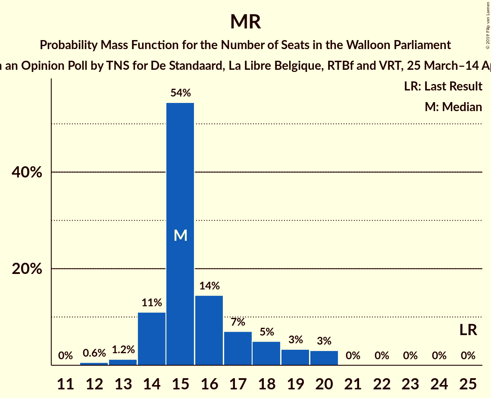

| Number of Seats | Probability | Accumulated | Special Marks |
|:---------------:|:-----------:|:-----------:|:-------------:|
| 12 | 0.6% | 100% |  |
| 13 | 1.2% | 99.4% |  |
| 14 | 11% | 98% |  |
| 15 | 54% | 87% | Median |
| 16 | 14% | 33% |  |
| 17 | 7% | 18% |  |
| 18 | 5% | 11% |  |
| 19 | 3% | 6% |  |
| 20 | 3% | 3% |  |
| 21 | 0% | 0% |  |
| 22 | 0% | 0% |  |
| 23 | 0% | 0% |  |
| 24 | 0% | 0% |  |
| 25 | 0% | 0% | Last Result |

### PTB

*For a full overview of the results for this party, see the [PTB](party-ptb.html) page.*

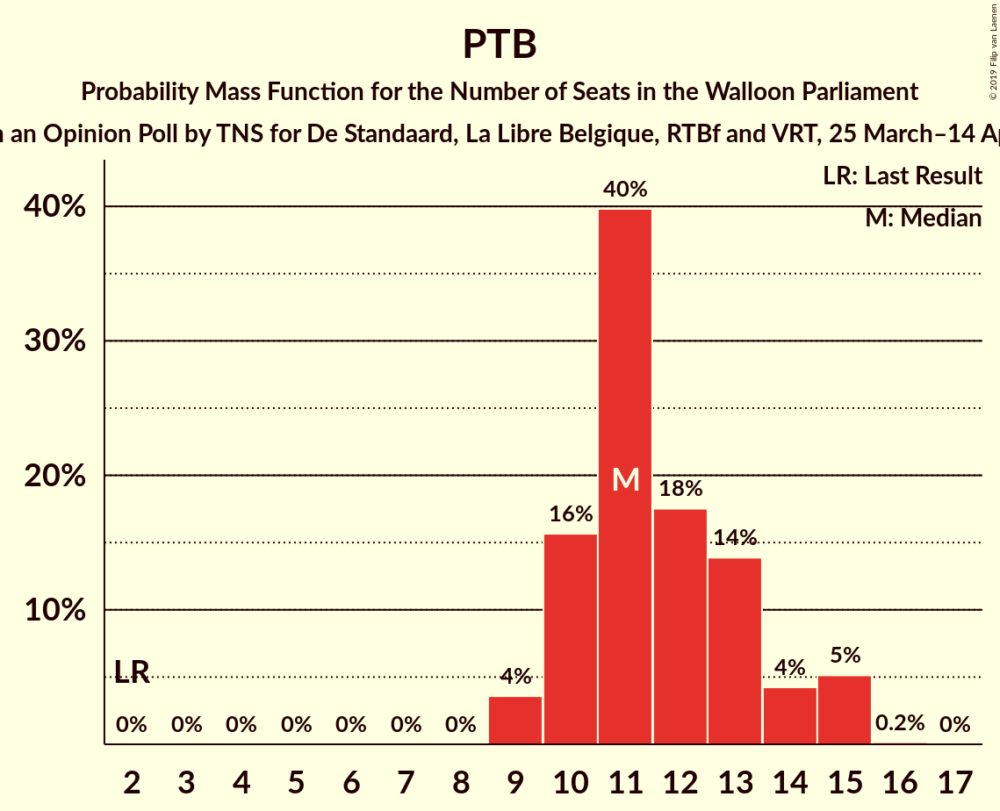

| Number of Seats | Probability | Accumulated | Special Marks |
|:---------------:|:-----------:|:-----------:|:-------------:|
| 2 | 0% | 100% | Last Result |
| 3 | 0% | 100% |  |
| 4 | 0% | 100% |  |
| 5 | 0% | 100% |  |
| 6 | 0% | 100% |  |
| 7 | 0% | 100% |  |
| 8 | 0% | 100% |  |
| 9 | 4% | 100% |  |
| 10 | 16% | 96% |  |
| 11 | 40% | 81% | Median |
| 12 | 18% | 41% |  |
| 13 | 14% | 23% |  |
| 14 | 4% | 10% |  |
| 15 | 5% | 5% |  |
| 16 | 0.2% | 0.2% |  |
| 17 | 0% | 0% |  |

### cdH

*For a full overview of the results for this party, see the [cdH](party-cdh.html) page.*

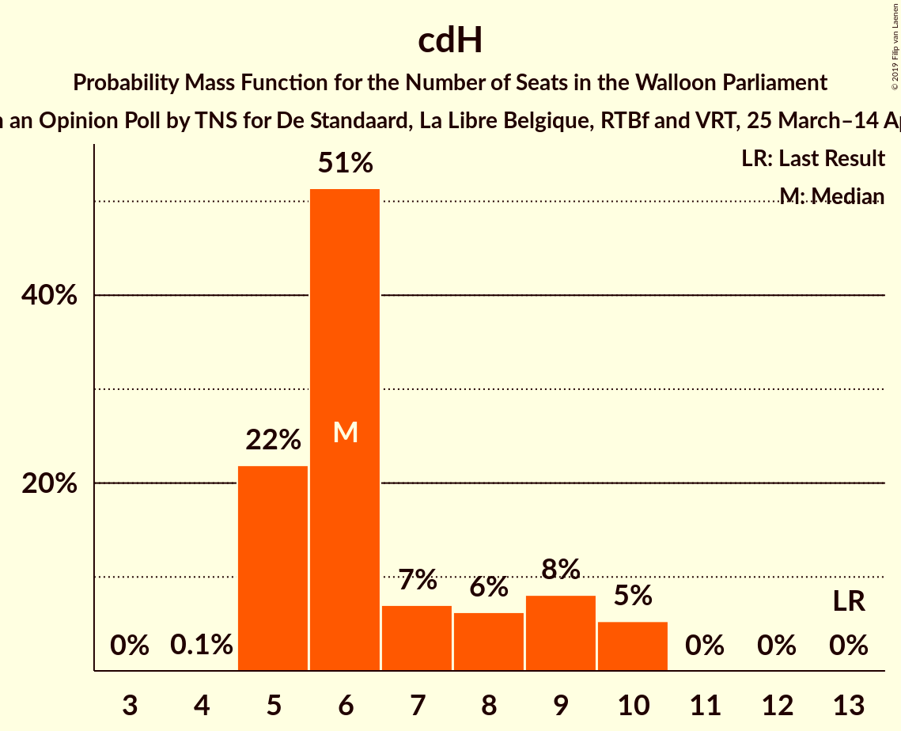

| Number of Seats | Probability | Accumulated | Special Marks |
|:---------------:|:-----------:|:-----------:|:-------------:|
| 4 | 0.1% | 100% |  |
| 5 | 22% | 99.9% |  |
| 6 | 51% | 78% | Median |
| 7 | 7% | 27% |  |
| 8 | 6% | 20% |  |
| 9 | 8% | 13% |  |
| 10 | 5% | 5% |  |
| 11 | 0% | 0% |  |
| 12 | 0% | 0% |  |
| 13 | 0% | 0% | Last Result |

### DéFI

*For a full overview of the results for this party, see the [DéFI](party-défi.html) page.*

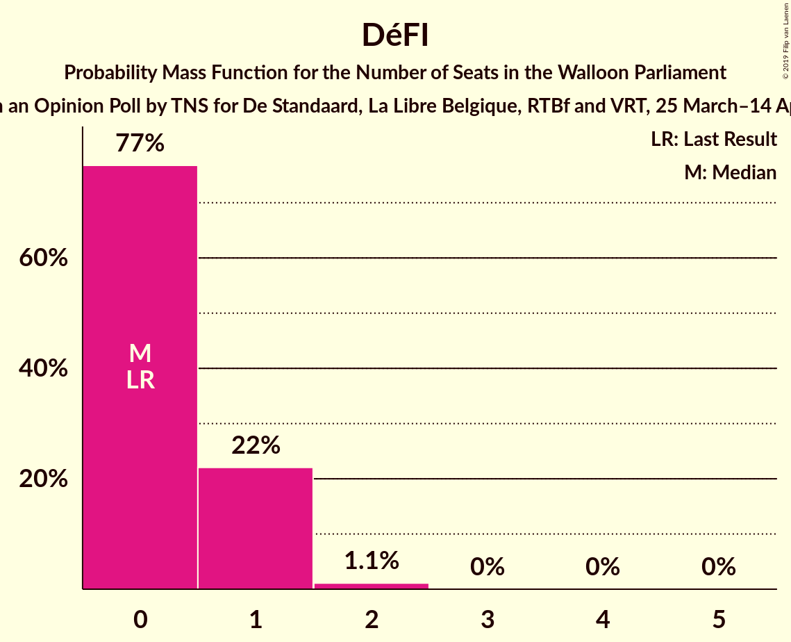

| Number of Seats | Probability | Accumulated | Special Marks |
|:---------------:|:-----------:|:-----------:|:-------------:|
| 0 | 77% | 100% | Last Result, Median |
| 1 | 22% | 23% |  |
| 2 | 1.1% | 1.2% |  |
| 3 | 0% | 0.1% |  |
| 4 | 0% | 0% |  |

### Parti Populaire

*For a full overview of the results for this party, see the [Parti Populaire](party-partipopulaire.html) page.*

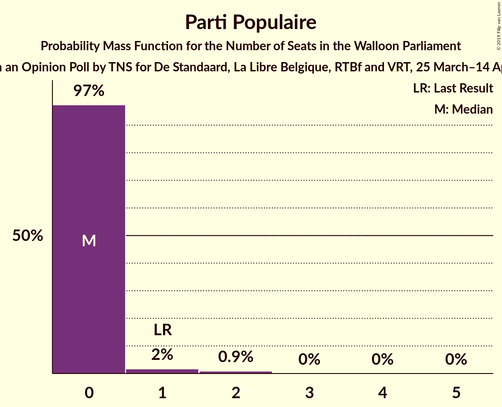

| Number of Seats | Probability | Accumulated | Special Marks |
|:---------------:|:-----------:|:-----------:|:-------------:|
| 0 | 97% | 100% | Median |
| 1 | 2% | 3% | Last Result |
| 2 | 0.9% | 0.9% |  |
| 3 | 0% | 0% |  |

## Coalitions

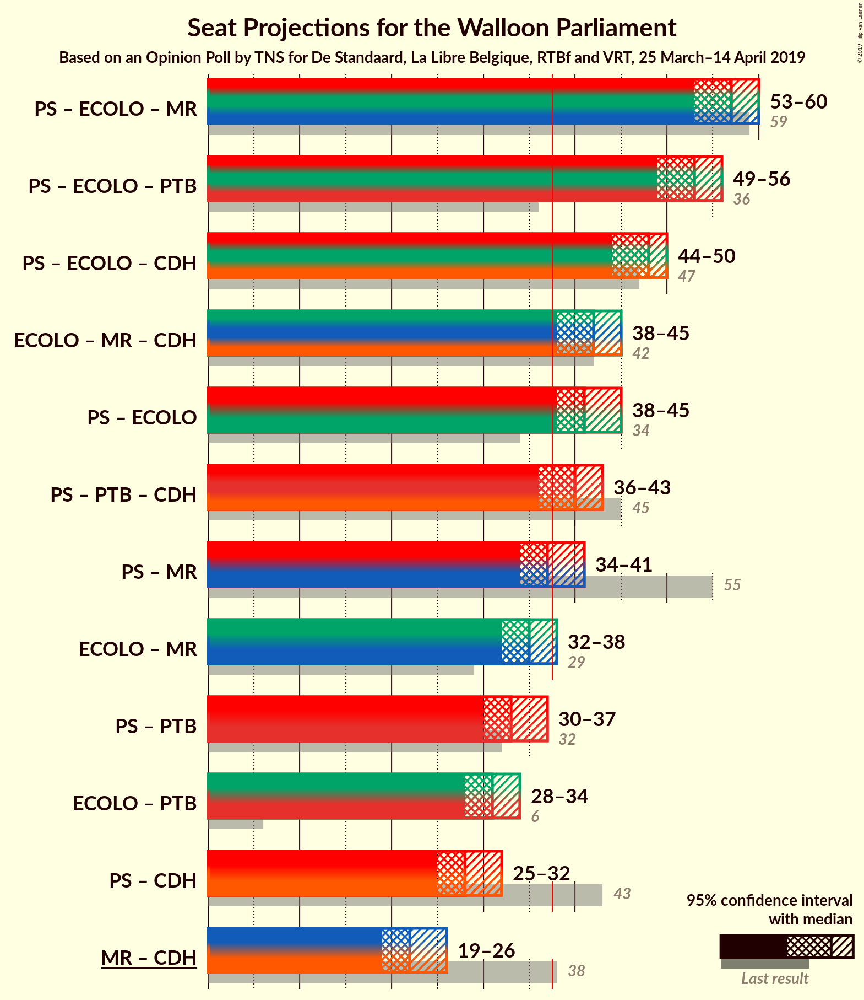

### Confidence Intervals

| Coalition | Last Result | Median | Majority? | 80% Confidence Interval | 90% Confidence Interval | 95% Confidence Interval | 99% Confidence Interval |
|:---------:|:-----------:|:------:|:---------:|:-----------------------:|:-----------------------:|:-----------------------:|:-----------------------:|
| PS – Ecolo – MR | 59 | 57 | 100% | 54–59 | 54–59 | 53–60 | 52–60 |
| PS – Ecolo – PTB | 36 | 53 | 100% | 50–55 | 49–55 | 49–56 | 48–56 |
| PS – Ecolo – cdH | 47 | 48 | 100% | 45–50 | 44–50 | 44–50 | 43–51 |
| Ecolo – MR – cdH | 42 | 42 | 98.9% | 39–44 | 39–44 | 38–45 | 37–46 |
| PS – Ecolo | 34 | 41 | 98% | 39–43 | 38–44 | 38–45 | 36–45 |
| PS – PTB – cdH | 45 | 40 | 89% | 37–42 | 37–42 | 36–43 | 36–44 |
| PS – MR | 55 | 37 | 40% | 35–40 | 35–40 | 34–41 | 33–42 |
| Ecolo – MR | 29 | 35 | 8% | 33–37 | 32–38 | 32–38 | 31–39 |
| PS – PTB | 32 | 33 | 0.9% | 31–35 | 31–36 | 30–37 | 29–38 |
| Ecolo – PTB | 6 | 31 | 0% | 29–33 | 28–34 | 28–34 | 27–35 |
| PS – cdH | 43 | 28 | 0% | 26–30 | 26–31 | 25–32 | 24–33 |
| MR – cdH | 38 | 22 | 0% | 20–25 | 20–25 | 19–26 | 18–27 |

### PS – Ecolo – MR

| Number of Seats | Probability | Accumulated | Special Marks |
|:---------------:|:-----------:|:-----------:|:-------------:|
| 51 | 0.1% | 100% |  |
| 52 | 0.4% | 99.8% |  |
| 53 | 3% | 99.4% |  |
| 54 | 10% | 97% |  |
| 55 | 11% | 87% |  |
| 56 | 17% | 76% | Median |
| 57 | 25% | 59% |  |
| 58 | 19% | 34% |  |
| 59 | 11% | 15% | Last Result |
| 60 | 4% | 5% |  |
| 61 | 0.2% | 0.2% |  |
| 62 | 0% | 0% |  |

### PS – Ecolo – PTB

| Number of Seats | Probability | Accumulated | Special Marks |
|:---------------:|:-----------:|:-----------:|:-------------:|
| 36 | 0% | 100% | Last Result |
| 37 | 0% | 100% |  |
| 38 | 0% | 100% | Majority |
| 39 | 0% | 100% |  |
| 40 | 0% | 100% |  |
| 41 | 0% | 100% |  |
| 42 | 0% | 100% |  |
| 43 | 0% | 100% |  |
| 44 | 0% | 100% |  |
| 45 | 0% | 100% |  |
| 46 | 0% | 100% |  |
| 47 | 0.2% | 100% |  |
| 48 | 0.6% | 99.8% |  |
| 49 | 6% | 99.3% |  |
| 50 | 8% | 94% |  |
| 51 | 11% | 86% |  |
| 52 | 12% | 75% | Median |
| 53 | 23% | 62% |  |
| 54 | 25% | 39% |  |
| 55 | 11% | 14% |  |
| 56 | 3% | 3% |  |
| 57 | 0.2% | 0.2% |  |
| 58 | 0% | 0% |  |

### PS – Ecolo – cdH

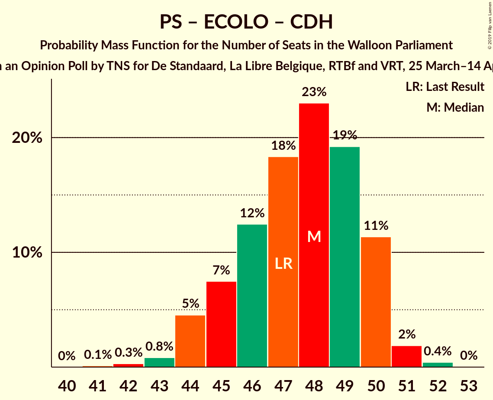

| Number of Seats | Probability | Accumulated | Special Marks |
|:---------------:|:-----------:|:-----------:|:-------------:|
| 41 | 0.1% | 100% |  |
| 42 | 0.3% | 99.9% |  |
| 43 | 0.8% | 99.6% |  |
| 44 | 5% | 98.7% |  |
| 45 | 7% | 94% |  |
| 46 | 12% | 87% |  |
| 47 | 18% | 74% | Last Result, Median |
| 48 | 23% | 56% |  |
| 49 | 19% | 33% |  |
| 50 | 11% | 14% |  |
| 51 | 2% | 2% |  |
| 52 | 0.4% | 0.5% |  |
| 53 | 0% | 0% |  |

### Ecolo – MR – cdH

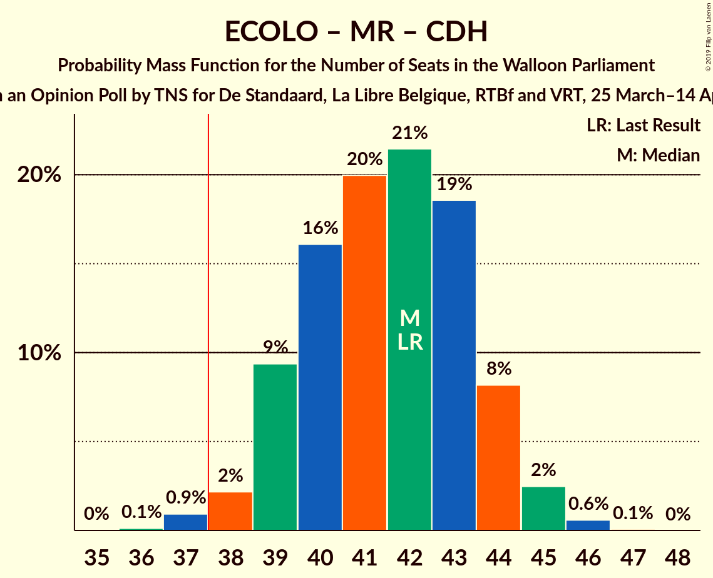

| Number of Seats | Probability | Accumulated | Special Marks |
|:---------------:|:-----------:|:-----------:|:-------------:|
| 36 | 0.1% | 100% |  |
| 37 | 0.9% | 99.9% |  |
| 38 | 2% | 98.9% | Majority |
| 39 | 9% | 97% |  |
| 40 | 16% | 87% |  |
| 41 | 20% | 71% | Median |
| 42 | 21% | 51% | Last Result |
| 43 | 19% | 30% |  |
| 44 | 8% | 11% |  |
| 45 | 2% | 3% |  |
| 46 | 0.6% | 0.7% |  |
| 47 | 0.1% | 0.1% |  |
| 48 | 0% | 0% |  |

### PS – Ecolo

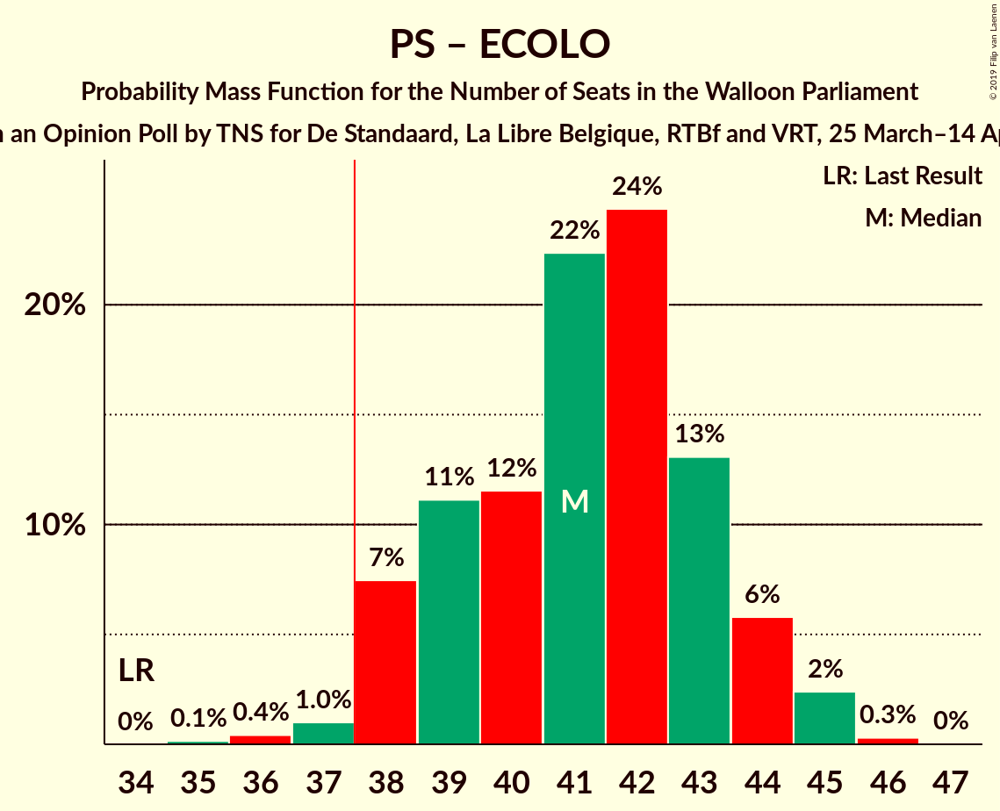

| Number of Seats | Probability | Accumulated | Special Marks |
|:---------------:|:-----------:|:-----------:|:-------------:|
| 34 | 0% | 100% | Last Result |
| 35 | 0.1% | 100% |  |
| 36 | 0.4% | 99.8% |  |
| 37 | 1.0% | 99.4% |  |
| 38 | 7% | 98% | Majority |
| 39 | 11% | 91% |  |
| 40 | 12% | 80% |  |
| 41 | 22% | 68% | Median |
| 42 | 24% | 46% |  |
| 43 | 13% | 22% |  |
| 44 | 6% | 9% |  |
| 45 | 2% | 3% |  |
| 46 | 0.3% | 0.3% |  |
| 47 | 0% | 0% |  |

### PS – PTB – cdH

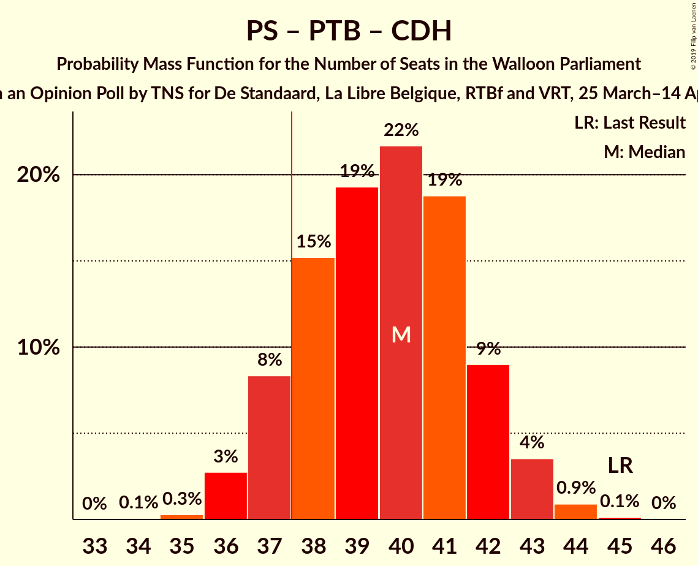

| Number of Seats | Probability | Accumulated | Special Marks |
|:---------------:|:-----------:|:-----------:|:-------------:|
| 34 | 0.1% | 100% |  |
| 35 | 0.3% | 99.9% |  |
| 36 | 3% | 99.6% |  |
| 37 | 8% | 97% |  |
| 38 | 15% | 89% | Median, Majority |
| 39 | 19% | 73% |  |
| 40 | 22% | 54% |  |
| 41 | 19% | 32% |  |
| 42 | 9% | 14% |  |
| 43 | 4% | 5% |  |
| 44 | 0.9% | 1.0% |  |
| 45 | 0.1% | 0.1% | Last Result |
| 46 | 0% | 0% |  |

### PS – MR

| Number of Seats | Probability | Accumulated | Special Marks |
|:---------------:|:-----------:|:-----------:|:-------------:|
| 32 | 0.1% | 100% |  |
| 33 | 1.1% | 99.9% |  |
| 34 | 3% | 98.8% |  |
| 35 | 7% | 96% |  |
| 36 | 29% | 88% | Median |
| 37 | 19% | 59% |  |
| 38 | 19% | 40% | Majority |
| 39 | 9% | 21% |  |
| 40 | 7% | 12% |  |
| 41 | 4% | 5% |  |
| 42 | 1.2% | 1.4% |  |
| 43 | 0.2% | 0.2% |  |
| 44 | 0% | 0% |  |
| 45 | 0% | 0% |  |
| 46 | 0% | 0% |  |
| 47 | 0% | 0% |  |
| 48 | 0% | 0% |  |
| 49 | 0% | 0% |  |
| 50 | 0% | 0% |  |
| 51 | 0% | 0% |  |
| 52 | 0% | 0% |  |
| 53 | 0% | 0% |  |
| 54 | 0% | 0% |  |
| 55 | 0% | 0% | Last Result |

### Ecolo – MR

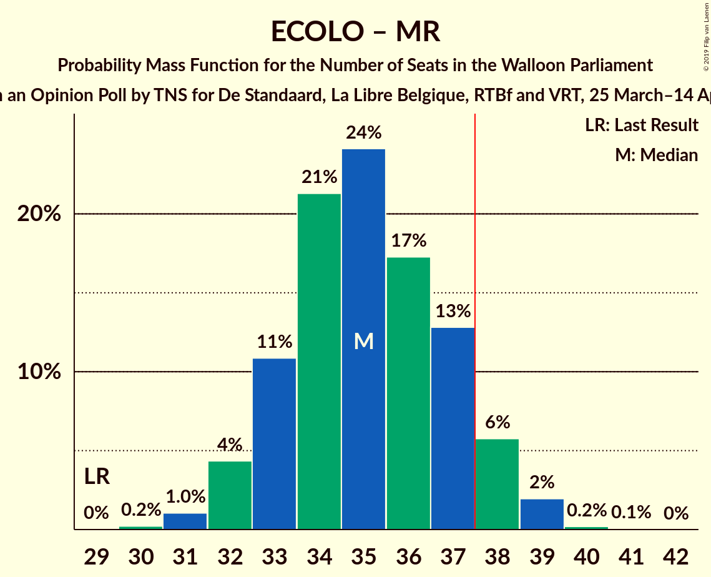

| Number of Seats | Probability | Accumulated | Special Marks |
|:---------------:|:-----------:|:-----------:|:-------------:|
| 29 | 0% | 100% | Last Result |
| 30 | 0.2% | 100% |  |
| 31 | 1.0% | 99.7% |  |
| 32 | 4% | 98.7% |  |
| 33 | 11% | 94% |  |
| 34 | 21% | 83% |  |
| 35 | 24% | 62% | Median |
| 36 | 17% | 38% |  |
| 37 | 13% | 21% |  |
| 38 | 6% | 8% | Majority |
| 39 | 2% | 2% |  |
| 40 | 0.2% | 0.3% |  |
| 41 | 0.1% | 0.1% |  |
| 42 | 0% | 0% |  |

### PS – PTB

| Number of Seats | Probability | Accumulated | Special Marks |
|:---------------:|:-----------:|:-----------:|:-------------:|
| 28 | 0.1% | 100% |  |
| 29 | 0.7% | 99.9% |  |
| 30 | 3% | 99.2% |  |
| 31 | 9% | 96% |  |
| 32 | 25% | 87% | Last Result, Median |
| 33 | 20% | 62% |  |
| 34 | 19% | 42% |  |
| 35 | 14% | 23% |  |
| 36 | 7% | 9% |  |
| 37 | 2% | 3% |  |
| 38 | 0.8% | 0.9% | Majority |
| 39 | 0.1% | 0.1% |  |
| 40 | 0% | 0% |  |

### Ecolo – PTB

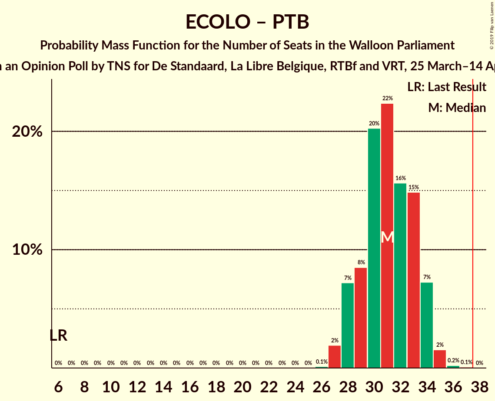

| Number of Seats | Probability | Accumulated | Special Marks |
|:---------------:|:-----------:|:-----------:|:-------------:|
| 6 | 0% | 100% | Last Result |
| 7 | 0% | 100% |  |
| 8 | 0% | 100% |  |
| 9 | 0% | 100% |  |
| 10 | 0% | 100% |  |
| 11 | 0% | 100% |  |
| 12 | 0% | 100% |  |
| 13 | 0% | 100% |  |
| 14 | 0% | 100% |  |
| 15 | 0% | 100% |  |
| 16 | 0% | 100% |  |
| 17 | 0% | 100% |  |
| 18 | 0% | 100% |  |
| 19 | 0% | 100% |  |
| 20 | 0% | 100% |  |
| 21 | 0% | 100% |  |
| 22 | 0% | 100% |  |
| 23 | 0% | 100% |  |
| 24 | 0% | 100% |  |
| 25 | 0% | 100% |  |
| 26 | 0.1% | 100% |  |
| 27 | 2% | 99.9% |  |
| 28 | 7% | 98% |  |
| 29 | 8% | 91% |  |
| 30 | 20% | 82% |  |
| 31 | 22% | 62% | Median |
| 32 | 16% | 40% |  |
| 33 | 15% | 24% |  |
| 34 | 7% | 9% |  |
| 35 | 2% | 2% |  |
| 36 | 0.2% | 0.3% |  |
| 37 | 0.1% | 0.1% |  |
| 38 | 0% | 0% | Majority |

### PS – cdH

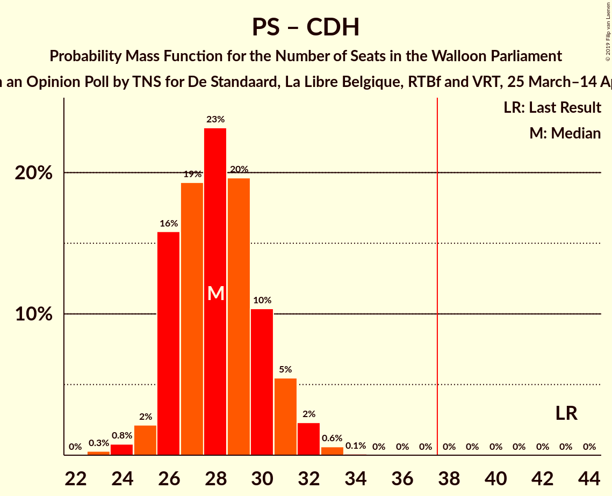

| Number of Seats | Probability | Accumulated | Special Marks |
|:---------------:|:-----------:|:-----------:|:-------------:|
| 23 | 0.3% | 100% |  |
| 24 | 0.8% | 99.7% |  |
| 25 | 2% | 98.9% |  |
| 26 | 16% | 97% |  |
| 27 | 19% | 81% | Median |
| 28 | 23% | 62% |  |
| 29 | 20% | 38% |  |
| 30 | 10% | 19% |  |
| 31 | 5% | 8% |  |
| 32 | 2% | 3% |  |
| 33 | 0.6% | 0.7% |  |
| 34 | 0.1% | 0.1% |  |
| 35 | 0% | 0% |  |
| 36 | 0% | 0% |  |
| 37 | 0% | 0% |  |
| 38 | 0% | 0% | Majority |
| 39 | 0% | 0% |  |
| 40 | 0% | 0% |  |
| 41 | 0% | 0% |  |
| 42 | 0% | 0% |  |
| 43 | 0% | 0% | Last Result |

### MR – cdH

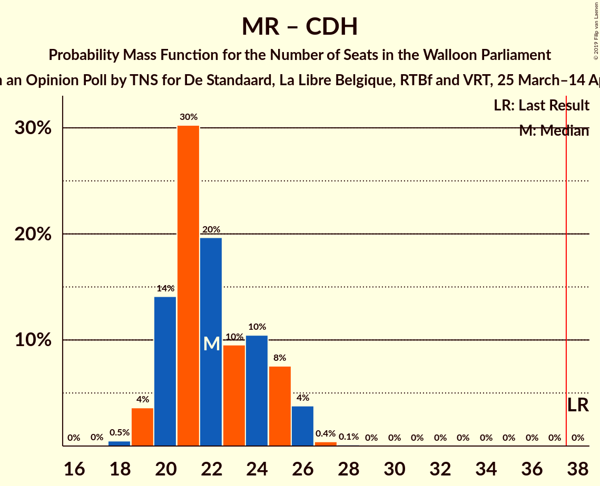

| Number of Seats | Probability | Accumulated | Special Marks |
|:---------------:|:-----------:|:-----------:|:-------------:|
| 18 | 0.5% | 100% |  |
| 19 | 4% | 99.5% |  |
| 20 | 14% | 96% |  |
| 21 | 30% | 82% | Median |
| 22 | 20% | 52% |  |
| 23 | 10% | 32% |  |
| 24 | 10% | 22% |  |
| 25 | 8% | 12% |  |
| 26 | 4% | 4% |  |
| 27 | 0.4% | 0.5% |  |
| 28 | 0.1% | 0.1% |  |
| 29 | 0% | 0% |  |
| 30 | 0% | 0% |  |
| 31 | 0% | 0% |  |
| 32 | 0% | 0% |  |
| 33 | 0% | 0% |  |
| 34 | 0% | 0% |  |
| 35 | 0% | 0% |  |
| 36 | 0% | 0% |  |
| 37 | 0% | 0% |  |
| 38 | 0% | 0% | Last Result, Majority |

## Technical Information

### Opinion Poll

+ **Polling firm:** TNS
+ **Commissioner(s):** De Standaard, La Libre Belgique, RTBf and VRT
+ **Fieldwork period:** 25 March–14 April 2019

### Calculations

+ **Sample size:** 1004
+ **Simulations done:** 1,048,576
+ **Error estimate:** 0.43%

