# Opinion Poll by Ipsos for Het Laatste Nieuws, Le Soir, RTL TVi and VTM, 6–14 May 2019

<a href="#voting-intentions">Voting Intentions</a> | <a href="#seats">Seats</a> | <a href="#coalitions">Coalitions</a> | <a href="#technical-information">Technical Information</a>

## Voting Intentions

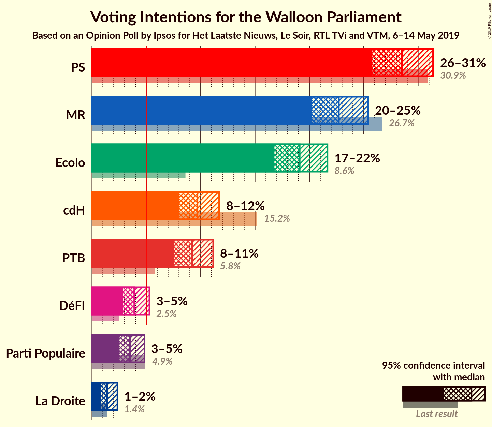

### Confidence Intervals

| Party | Last Result | Poll Result | 80% Confidence Interval | 90% Confidence Interval | 95% Confidence Interval | 99% Confidence Interval |
|:-----:|:-----------:|:-----------:|:-----------------------:|:-----------------------:|:-----------------------:|:-----------------------:|
| PS | 30.9% | 28.5% | 26.7–30.4% |26.2–30.9% |25.8–31.4% |25.0–32.3% |
| MR | 26.7% | 22.7% | 21.1–24.5% |20.6–25.0% |20.2–25.4% |19.4–26.3% |
| Ecolo | 8.6% | 19.1% | 17.6–20.8% |17.1–21.2% |16.8–21.7% |16.1–22.5% |
| cdH | 15.2% | 9.7% | 8.6–11.0% |8.3–11.4% |8.0–11.7% |7.5–12.3% |
| PTB | 5.8% | 9.2% | 8.1–10.5% |7.8–10.8% |7.6–11.2% |7.1–11.8% |
| DéFI | 2.5% | 3.9% | 3.2–4.8% |3.0–5.1% |2.9–5.3% |2.6–5.8% |
| Parti Populaire | 4.9% | 3.5% | 2.9–4.4% |2.7–4.6% |2.5–4.8% |2.2–5.3% |
| La Droite | 1.4% | 1.4% | 1.0–2.0% |0.9–2.2% |0.8–2.3% |0.7–2.7% |

*Note:* The poll result column reflects the actual value used in the calculations. Published results may vary slightly, and in addition be rounded to fewer digits.

## Seats

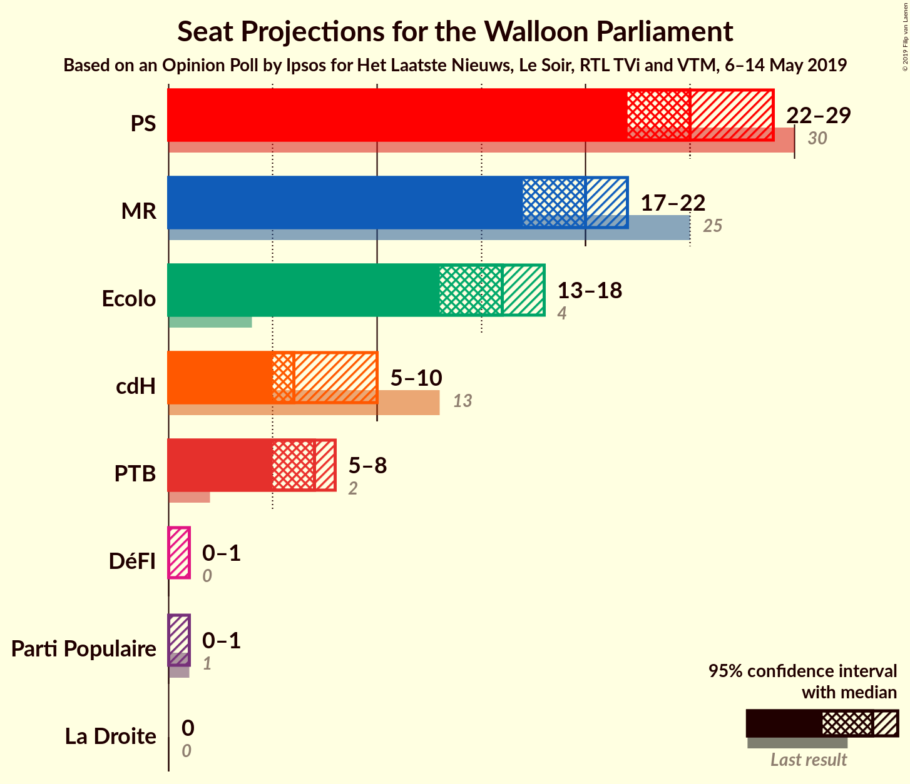

### Confidence Intervals

| Party | Last Result | Median | 80% Confidence Interval | 90% Confidence Interval | 95% Confidence Interval | 99% Confidence Interval |
|:-----:|:-----------:|:------:|:-----------------------:|:-----------------------:|:-----------------------:|:-----------------------:|
| <a href="#ps">PS</a> | 30 | 25 | 23–28 |23–28 |22–29 |21–29 |
| <a href="#mr">MR</a> | 25 | 20 | 18–22 |17–22 |17–22 |16–23 |
| <a href="#ecolo">Ecolo</a> | 4 | 16 | 14–18 |14–18 |13–18 |13–19 |
| <a href="#cdh">cdH</a> | 13 | 6 | 6–8 |5–9 |5–10 |5–10 |
| <a href="#ptb">PTB</a> | 2 | 7 | 6–8 |6–8 |5–8 |4–9 |
| <a href="#défi">DéFI</a> | 0 | 0 | 0–1 |0–1 |0–1 |0–2 |
| <a href="#parti-populaire">Parti Populaire</a> | 1 | 0 | 0 |0 |0–1 |0–2 |
| <a href="#la-droite">La Droite</a> | 0 | 0 | 0 |0 |0 |0 |

### PS

*For a full overview of the results for this party, see the [PS](party-ps.html) page.*

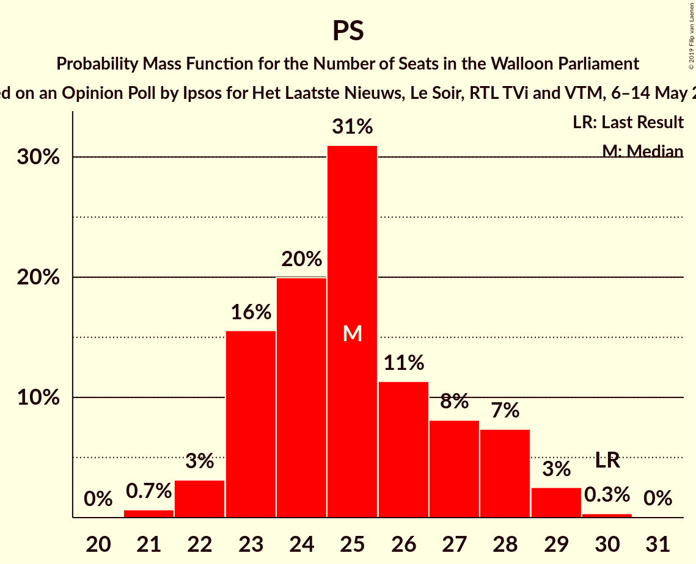

| Number of Seats | Probability | Accumulated | Special Marks |
|:---------------:|:-----------:|:-----------:|:-------------:|
| 21 | 0.7% | 100% |  |
| 22 | 3% | 99.3% |  |
| 23 | 16% | 96% |  |
| 24 | 20% | 81% |  |
| 25 | 31% | 61% | Median |
| 26 | 11% | 30% |  |
| 27 | 8% | 18% |  |
| 28 | 7% | 10% |  |
| 29 | 3% | 3% |  |
| 30 | 0.3% | 0.4% | Last Result |
| 31 | 0% | 0% |  |

### MR

*For a full overview of the results for this party, see the [MR](party-mr.html) page.*

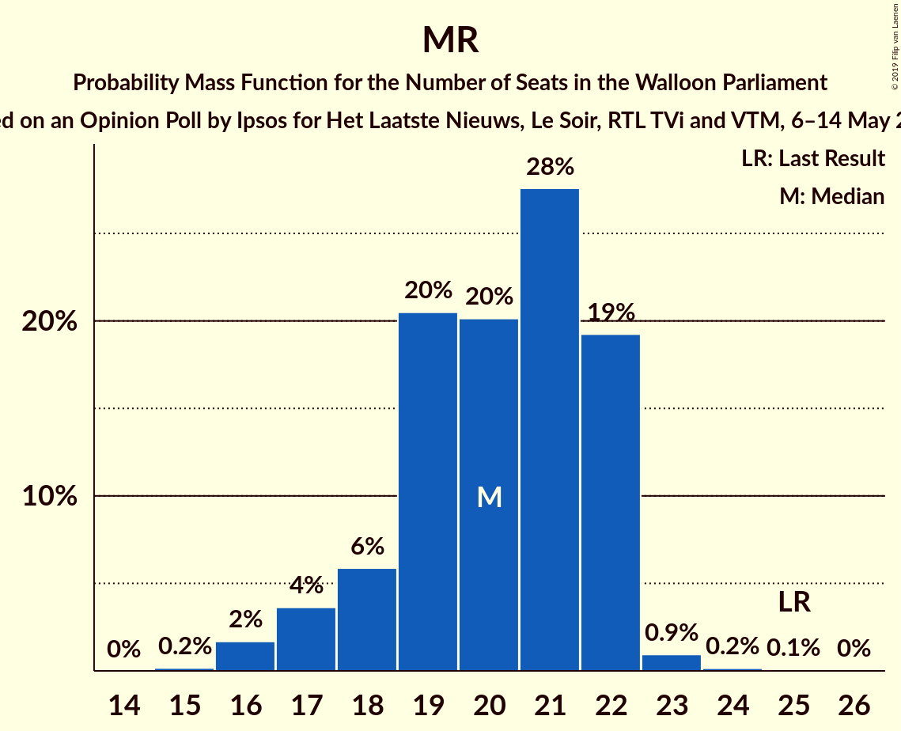

| Number of Seats | Probability | Accumulated | Special Marks |
|:---------------:|:-----------:|:-----------:|:-------------:|
| 15 | 0.2% | 100% |  |
| 16 | 2% | 99.8% |  |
| 17 | 4% | 98% |  |
| 18 | 6% | 95% |  |
| 19 | 20% | 89% |  |
| 20 | 20% | 68% | Median |
| 21 | 28% | 48% |  |
| 22 | 19% | 20% |  |
| 23 | 0.9% | 1.2% |  |
| 24 | 0.2% | 0.3% |  |
| 25 | 0.1% | 0.1% | Last Result |
| 26 | 0% | 0% |  |

### Ecolo

*For a full overview of the results for this party, see the [Ecolo](party-ecolo.html) page.*

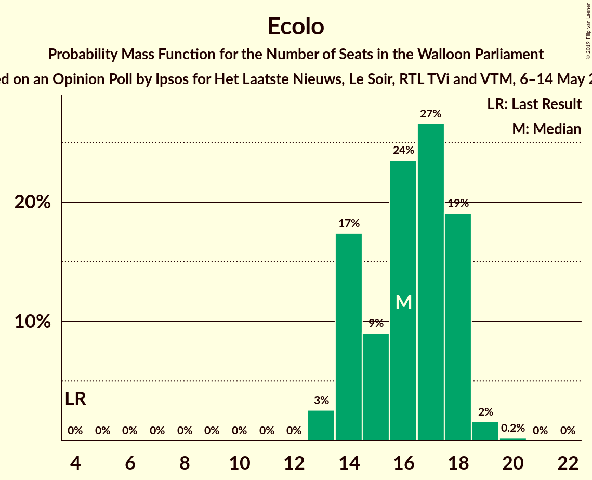

| Number of Seats | Probability | Accumulated | Special Marks |
|:---------------:|:-----------:|:-----------:|:-------------:|
| 4 | 0% | 100% | Last Result |
| 5 | 0% | 100% |  |
| 6 | 0% | 100% |  |
| 7 | 0% | 100% |  |
| 8 | 0% | 100% |  |
| 9 | 0% | 100% |  |
| 10 | 0% | 100% |  |
| 11 | 0% | 100% |  |
| 12 | 0% | 100% |  |
| 13 | 3% | 100% |  |
| 14 | 17% | 97% |  |
| 15 | 9% | 80% |  |
| 16 | 24% | 71% | Median |
| 17 | 27% | 47% |  |
| 18 | 19% | 21% |  |
| 19 | 2% | 2% |  |
| 20 | 0.2% | 0.2% |  |
| 21 | 0% | 0% |  |

### cdH

*For a full overview of the results for this party, see the [cdH](party-cdh.html) page.*

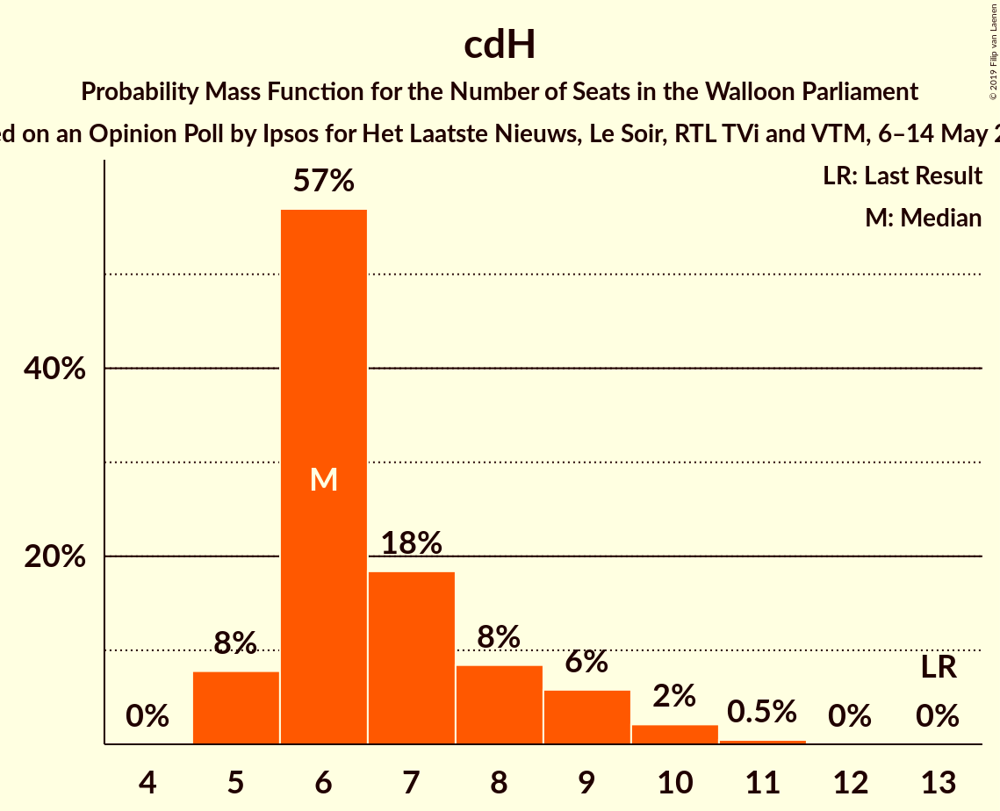

| Number of Seats | Probability | Accumulated | Special Marks |
|:---------------:|:-----------:|:-----------:|:-------------:|
| 5 | 8% | 100% |  |
| 6 | 57% | 92% | Median |
| 7 | 18% | 35% |  |
| 8 | 8% | 17% |  |
| 9 | 6% | 8% |  |
| 10 | 2% | 3% |  |
| 11 | 0.5% | 0.5% |  |
| 12 | 0% | 0% |  |
| 13 | 0% | 0% | Last Result |

### PTB

*For a full overview of the results for this party, see the [PTB](party-ptb.html) page.*

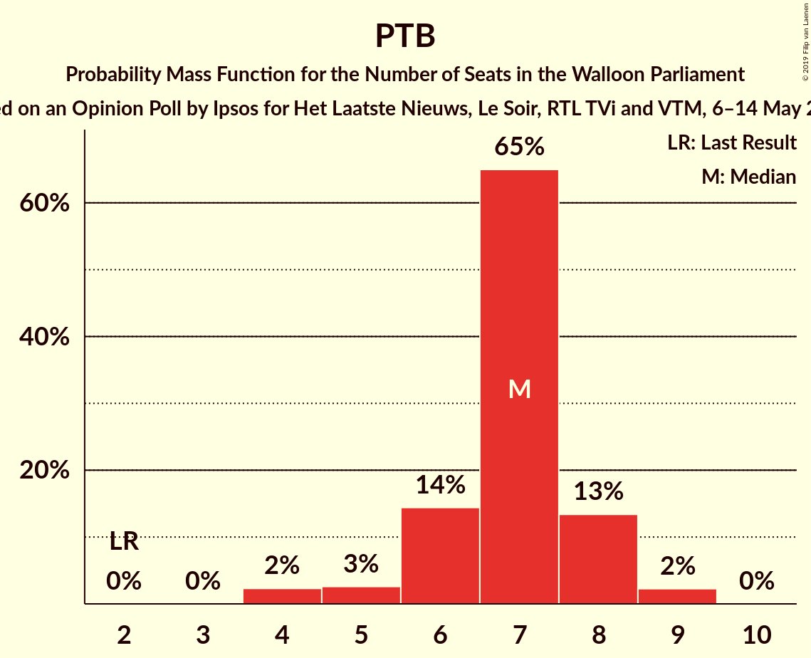

| Number of Seats | Probability | Accumulated | Special Marks |
|:---------------:|:-----------:|:-----------:|:-------------:|
| 2 | 0% | 100% | Last Result |
| 3 | 0% | 100% |  |
| 4 | 2% | 100% |  |
| 5 | 3% | 98% |  |
| 6 | 14% | 95% |  |
| 7 | 65% | 81% | Median |
| 8 | 13% | 16% |  |
| 9 | 2% | 2% |  |
| 10 | 0% | 0% |  |

### DéFI

*For a full overview of the results for this party, see the [DéFI](party-défi.html) page.*

| Number of Seats | Probability | Accumulated | Special Marks |
|:---------------:|:-----------:|:-----------:|:-------------:|
| 0 | 89% | 100% | Last Result, Median |
| 1 | 10% | 11% |  |
| 2 | 0.7% | 0.8% |  |
| 3 | 0% | 0.1% |  |
| 4 | 0% | 0% |  |

### Parti Populaire

*For a full overview of the results for this party, see the [Parti Populaire](party-partipopulaire.html) page.*

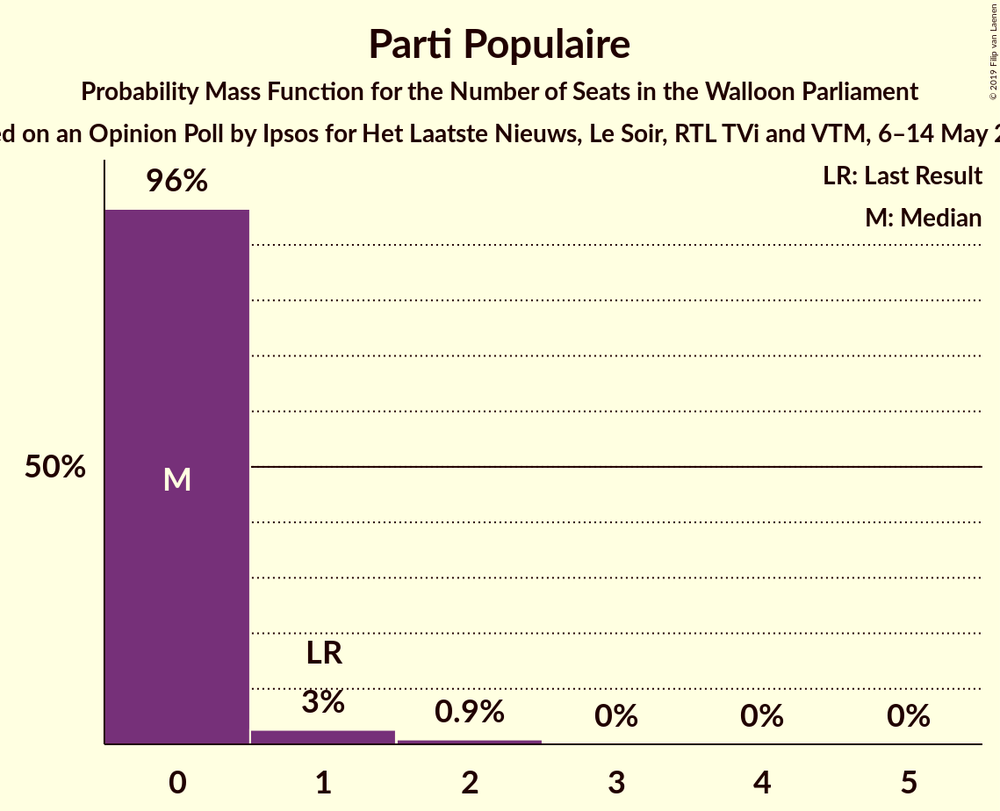

| Number of Seats | Probability | Accumulated | Special Marks |
|:---------------:|:-----------:|:-----------:|:-------------:|
| 0 | 96% | 100% | Median |
| 1 | 3% | 4% | Last Result |
| 2 | 0.9% | 0.9% |  |
| 3 | 0% | 0% |  |

### La Droite

*For a full overview of the results for this party, see the [La Droite](party-ladroite.html) page.*

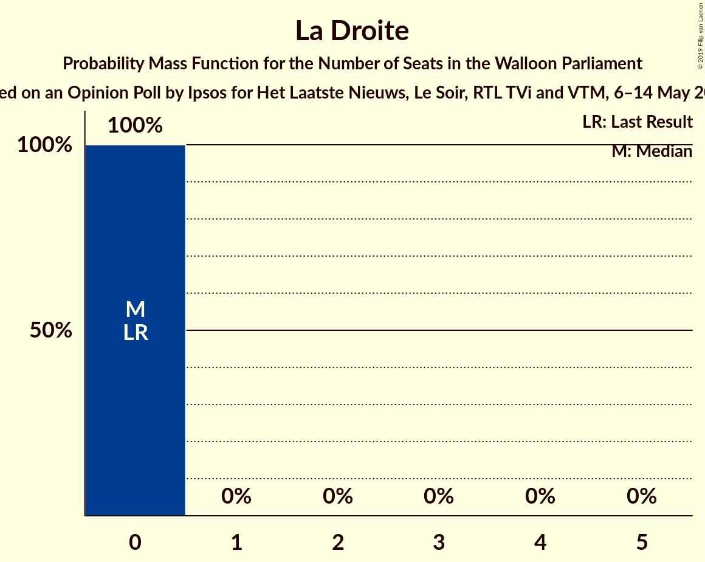

| Number of Seats | Probability | Accumulated | Special Marks |
|:---------------:|:-----------:|:-----------:|:-------------:|
| 0 | 100% | 100% | Last Result, Median |

## Coalitions

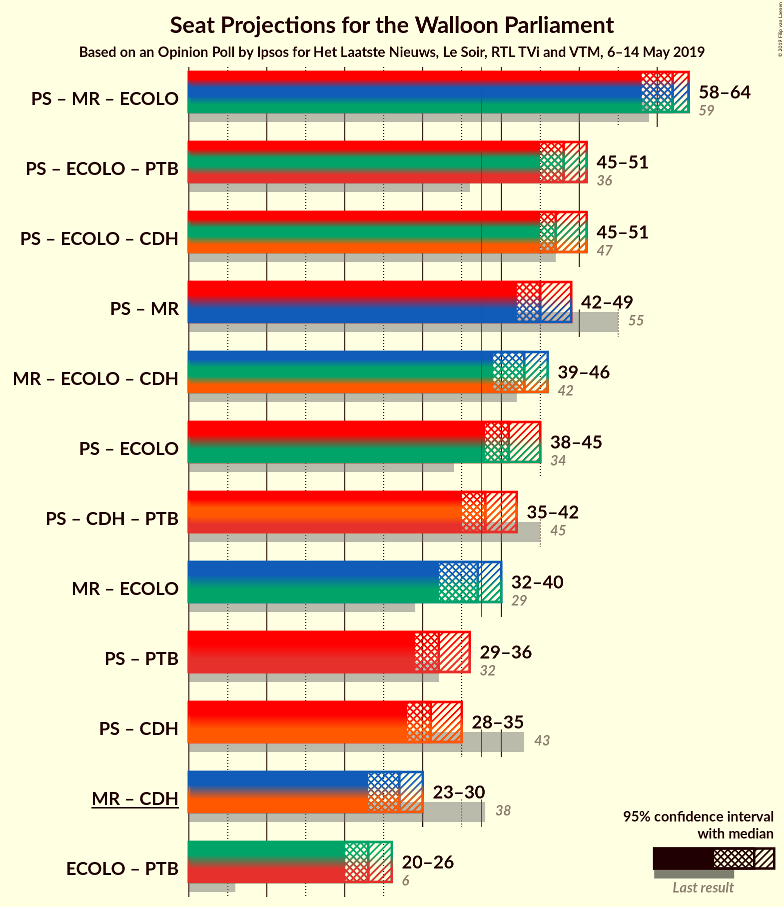

### Confidence Intervals

| Coalition | Last Result | Median | Majority? | 80% Confidence Interval | 90% Confidence Interval | 95% Confidence Interval | 99% Confidence Interval |
|:---------:|:-----------:|:------:|:---------:|:-----------------------:|:-----------------------:|:-----------------------:|:-----------------------:|
| PS – MR – Ecolo | 59 | 62 | 100% | 60–63 | 59–63 | 58–64 | 57–65 |
| PS – Ecolo – PTB | 36 | 48 | 100% | 46–50 | 46–51 | 45–51 | 44–53 |
| PS – Ecolo – cdH | 47 | 47 | 100% | 46–50 | 45–51 | 45–51 | 44–52 |
| PS – MR | 55 | 45 | 100% | 43–47 | 43–48 | 42–49 | 40–49 |
| MR – Ecolo – cdH | 42 | 43 | 99.9% | 41–45 | 40–45 | 39–46 | 38–47 |
| PS – Ecolo | 34 | 41 | 98.7% | 39–43 | 39–44 | 38–45 | 37–46 |
| PS – cdH – PTB | 45 | 38 | 71% | 36–41 | 36–42 | 35–42 | 35–44 |
| MR – Ecolo | 29 | 37 | 25% | 34–38 | 33–39 | 32–40 | 31–40 |
| PS – PTB | 32 | 32 | 0% | 30–34 | 30–35 | 29–36 | 28–36 |
| PS – cdH | 43 | 31 | 0.1% | 29–34 | 29–35 | 28–35 | 28–37 |
| MR – cdH | 38 | 27 | 0% | 25–29 | 24–29 | 23–30 | 22–31 |
| Ecolo – PTB | 6 | 23 | 0% | 21–25 | 21–25 | 20–26 | 19–26 |

### PS – MR – Ecolo

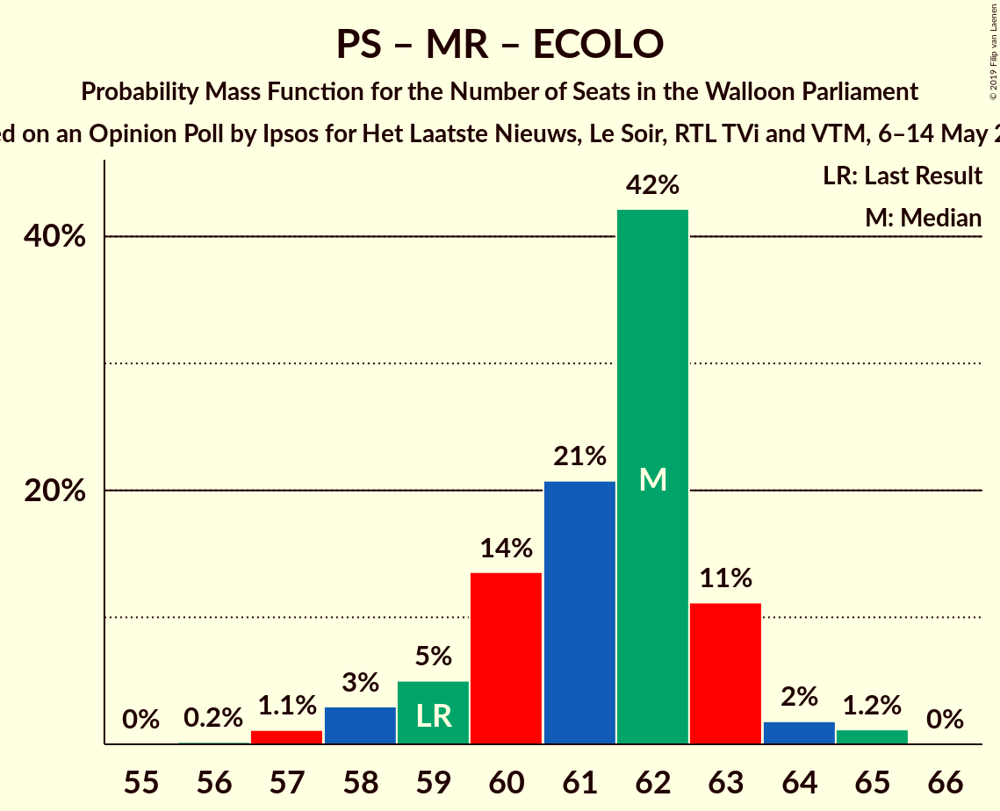

| Number of Seats | Probability | Accumulated | Special Marks |
|:---------------:|:-----------:|:-----------:|:-------------:|
| 56 | 0.2% | 100% |  |
| 57 | 1.1% | 99.8% |  |
| 58 | 3% | 98.7% |  |
| 59 | 5% | 96% | Last Result |
| 60 | 14% | 91% |  |
| 61 | 21% | 77% | Median |
| 62 | 42% | 56% |  |
| 63 | 11% | 14% |  |
| 64 | 2% | 3% |  |
| 65 | 1.2% | 1.2% |  |
| 66 | 0% | 0% |  |

### PS – Ecolo – PTB

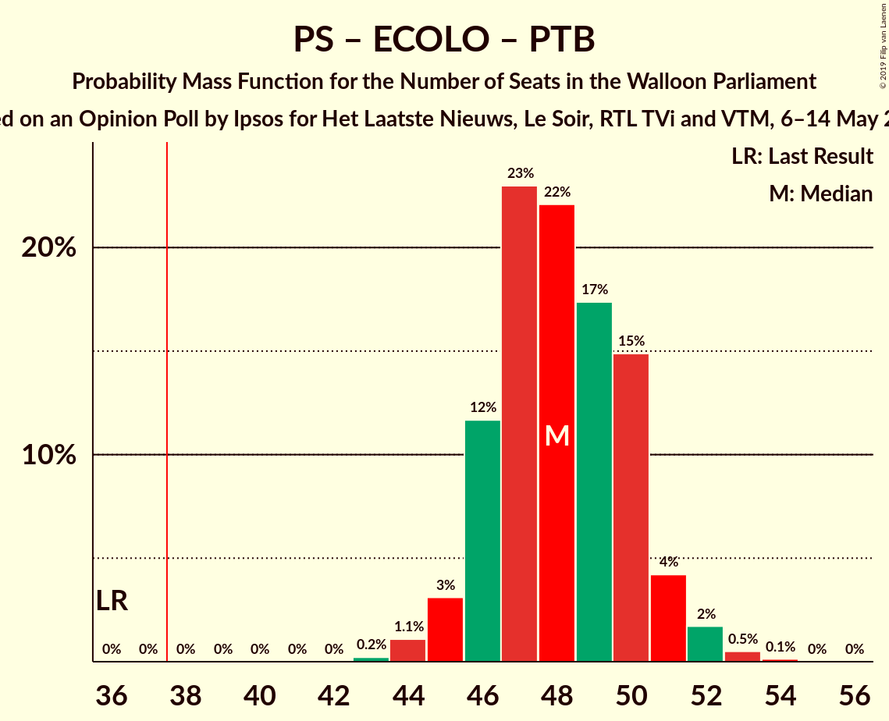

| Number of Seats | Probability | Accumulated | Special Marks |
|:---------------:|:-----------:|:-----------:|:-------------:|
| 36 | 0% | 100% | Last Result |
| 37 | 0% | 100% |  |
| 38 | 0% | 100% | Majority |
| 39 | 0% | 100% |  |
| 40 | 0% | 100% |  |
| 41 | 0% | 100% |  |
| 42 | 0% | 100% |  |
| 43 | 0.2% | 100% |  |
| 44 | 1.1% | 99.8% |  |
| 45 | 3% | 98.7% |  |
| 46 | 12% | 96% |  |
| 47 | 23% | 84% |  |
| 48 | 22% | 61% | Median |
| 49 | 17% | 39% |  |
| 50 | 15% | 21% |  |
| 51 | 4% | 7% |  |
| 52 | 2% | 2% |  |
| 53 | 0.5% | 0.6% |  |
| 54 | 0.1% | 0.1% |  |
| 55 | 0% | 0% |  |

### PS – Ecolo – cdH

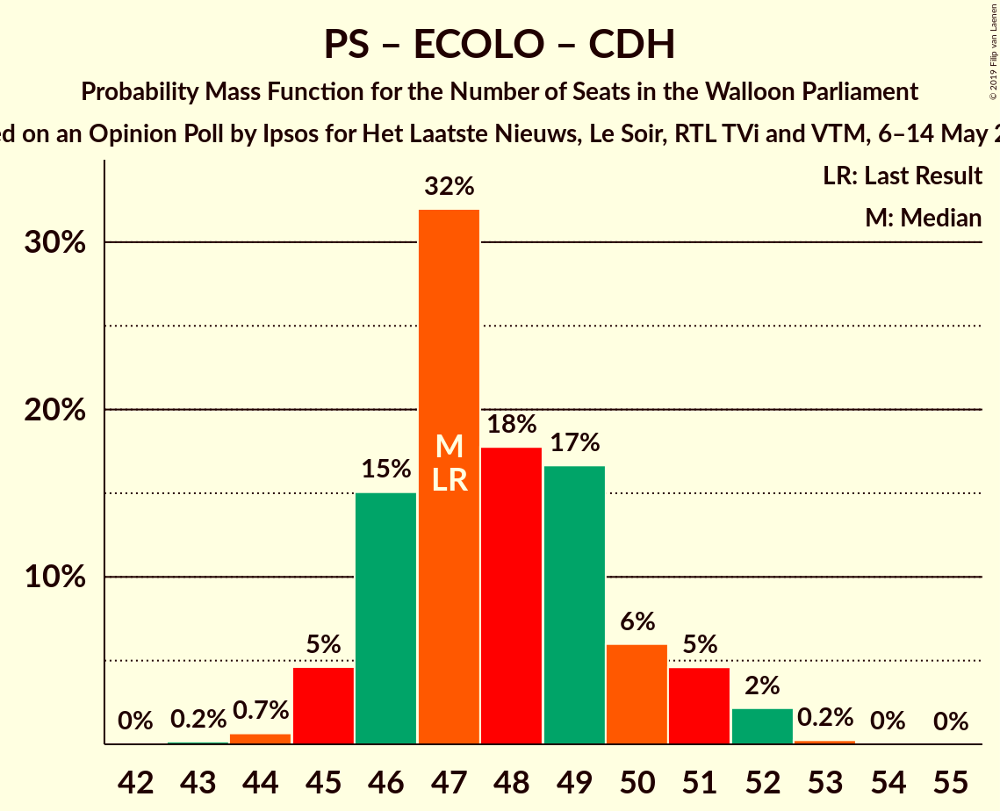

| Number of Seats | Probability | Accumulated | Special Marks |
|:---------------:|:-----------:|:-----------:|:-------------:|
| 43 | 0.2% | 100% |  |
| 44 | 0.7% | 99.8% |  |
| 45 | 5% | 99.1% |  |
| 46 | 15% | 95% |  |
| 47 | 32% | 79% | Last Result, Median |
| 48 | 18% | 47% |  |
| 49 | 17% | 30% |  |
| 50 | 6% | 13% |  |
| 51 | 5% | 7% |  |
| 52 | 2% | 2% |  |
| 53 | 0.2% | 0.3% |  |
| 54 | 0% | 0.1% |  |
| 55 | 0% | 0% |  |

### PS – MR

| Number of Seats | Probability | Accumulated | Special Marks |
|:---------------:|:-----------:|:-----------:|:-------------:|
| 39 | 0.1% | 100% |  |
| 40 | 1.1% | 99.9% |  |
| 41 | 0.7% | 98.8% |  |
| 42 | 3% | 98% |  |
| 43 | 10% | 95% |  |
| 44 | 17% | 85% |  |
| 45 | 28% | 68% | Median |
| 46 | 21% | 40% |  |
| 47 | 10% | 19% |  |
| 48 | 7% | 10% |  |
| 49 | 2% | 3% |  |
| 50 | 0.4% | 0.4% |  |
| 51 | 0% | 0% |  |
| 52 | 0% | 0% |  |
| 53 | 0% | 0% |  |
| 54 | 0% | 0% |  |
| 55 | 0% | 0% | Last Result |

### MR – Ecolo – cdH

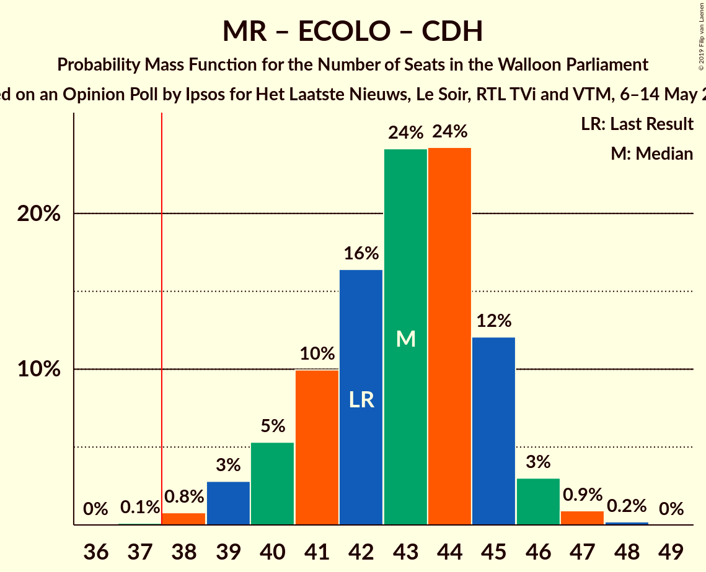

| Number of Seats | Probability | Accumulated | Special Marks |
|:---------------:|:-----------:|:-----------:|:-------------:|
| 37 | 0.1% | 100% |  |
| 38 | 0.8% | 99.9% | Majority |
| 39 | 3% | 99.1% |  |
| 40 | 5% | 96% |  |
| 41 | 10% | 91% |  |
| 42 | 16% | 81% | Last Result, Median |
| 43 | 24% | 65% |  |
| 44 | 24% | 40% |  |
| 45 | 12% | 16% |  |
| 46 | 3% | 4% |  |
| 47 | 0.9% | 1.1% |  |
| 48 | 0.2% | 0.2% |  |
| 49 | 0% | 0% |  |

### PS – Ecolo

| Number of Seats | Probability | Accumulated | Special Marks |
|:---------------:|:-----------:|:-----------:|:-------------:|
| 34 | 0% | 100% | Last Result |
| 35 | 0% | 100% |  |
| 36 | 0.3% | 100% |  |
| 37 | 0.9% | 99.7% |  |
| 38 | 3% | 98.7% | Majority |
| 39 | 10% | 96% |  |
| 40 | 22% | 85% |  |
| 41 | 26% | 64% | Median |
| 42 | 15% | 38% |  |
| 43 | 14% | 23% |  |
| 44 | 5% | 9% |  |
| 45 | 2% | 4% |  |
| 46 | 1.1% | 1.3% |  |
| 47 | 0.1% | 0.2% |  |
| 48 | 0% | 0% |  |

### PS – cdH – PTB

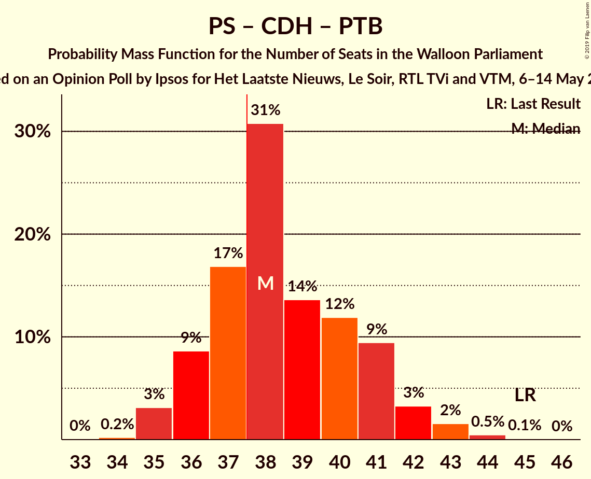

| Number of Seats | Probability | Accumulated | Special Marks |
|:---------------:|:-----------:|:-----------:|:-------------:|
| 34 | 0.2% | 100% |  |
| 35 | 3% | 99.7% |  |
| 36 | 9% | 97% |  |
| 37 | 17% | 88% |  |
| 38 | 31% | 71% | Median, Majority |
| 39 | 14% | 40% |  |
| 40 | 12% | 27% |  |
| 41 | 9% | 15% |  |
| 42 | 3% | 5% |  |
| 43 | 2% | 2% |  |
| 44 | 0.5% | 0.6% |  |
| 45 | 0.1% | 0.1% | Last Result |
| 46 | 0% | 0% |  |

### MR – Ecolo

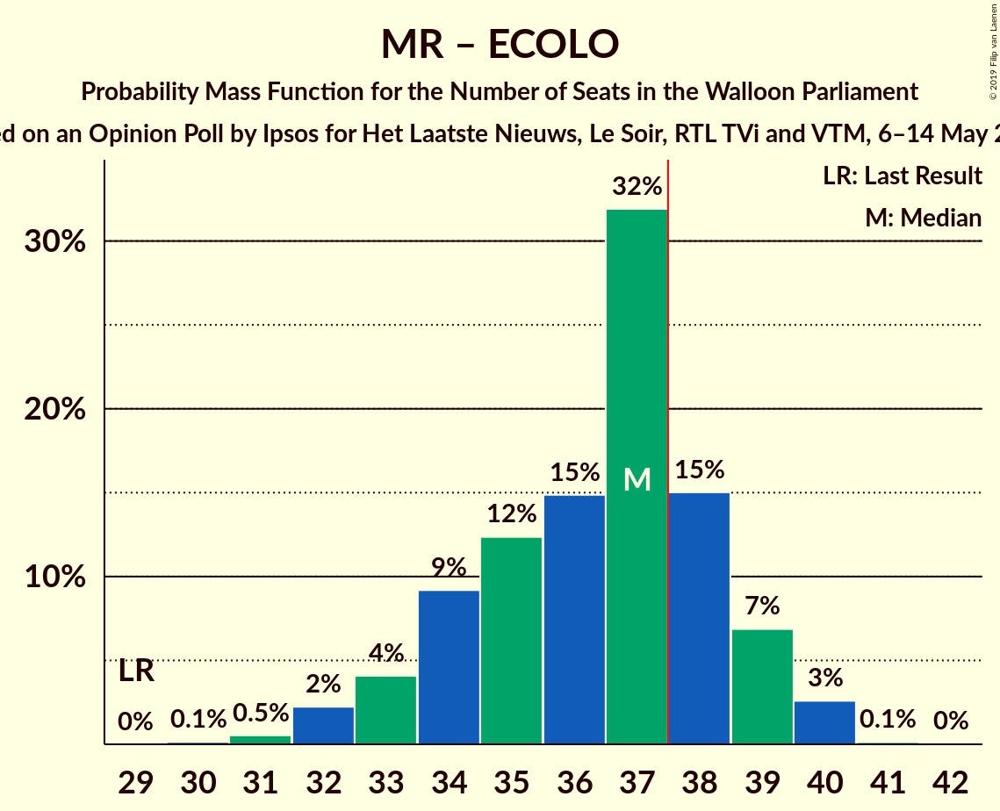

| Number of Seats | Probability | Accumulated | Special Marks |
|:---------------:|:-----------:|:-----------:|:-------------:|
| 29 | 0% | 100% | Last Result |
| 30 | 0.1% | 100% |  |
| 31 | 0.5% | 99.8% |  |
| 32 | 2% | 99.3% |  |
| 33 | 4% | 97% |  |
| 34 | 9% | 93% |  |
| 35 | 12% | 84% |  |
| 36 | 15% | 71% | Median |
| 37 | 32% | 57% |  |
| 38 | 15% | 25% | Majority |
| 39 | 7% | 10% |  |
| 40 | 3% | 3% |  |
| 41 | 0.1% | 0.2% |  |
| 42 | 0% | 0% |  |

### PS – PTB

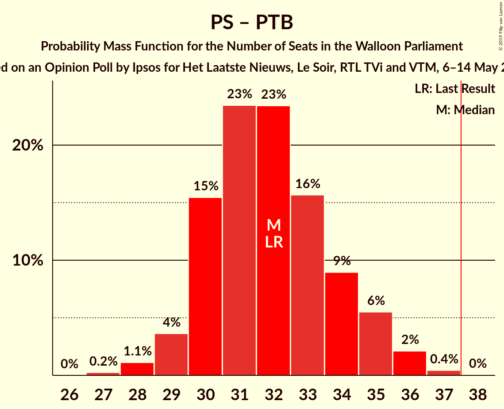

| Number of Seats | Probability | Accumulated | Special Marks |
|:---------------:|:-----------:|:-----------:|:-------------:|
| 27 | 0.2% | 100% |  |
| 28 | 1.1% | 99.7% |  |
| 29 | 4% | 98.6% |  |
| 30 | 15% | 95% |  |
| 31 | 23% | 80% |  |
| 32 | 23% | 56% | Last Result, Median |
| 33 | 16% | 33% |  |
| 34 | 9% | 17% |  |
| 35 | 6% | 8% |  |
| 36 | 2% | 3% |  |
| 37 | 0.4% | 0.5% |  |
| 38 | 0% | 0% | Majority |

### PS – cdH

| Number of Seats | Probability | Accumulated | Special Marks |
|:---------------:|:-----------:|:-----------:|:-------------:|
| 27 | 0.2% | 100% |  |
| 28 | 3% | 99.8% |  |
| 29 | 9% | 97% |  |
| 30 | 16% | 88% |  |
| 31 | 30% | 72% | Median |
| 32 | 13% | 42% |  |
| 33 | 14% | 30% |  |
| 34 | 9% | 16% |  |
| 35 | 5% | 7% |  |
| 36 | 1.2% | 2% |  |
| 37 | 0.7% | 0.8% |  |
| 38 | 0.1% | 0.1% | Majority |
| 39 | 0% | 0% |  |
| 40 | 0% | 0% |  |
| 41 | 0% | 0% |  |
| 42 | 0% | 0% |  |
| 43 | 0% | 0% | Last Result |

### MR – cdH

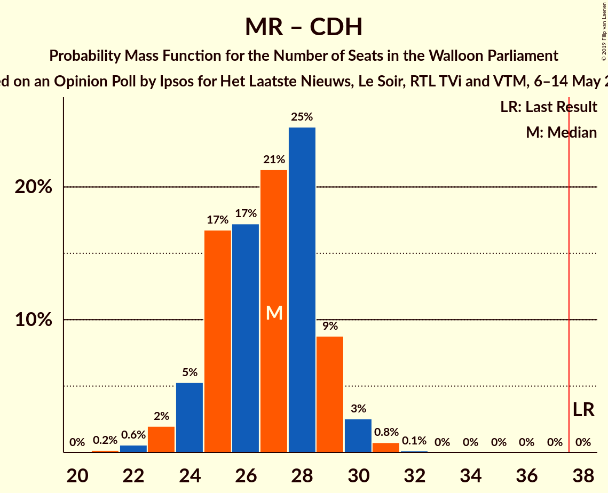

| Number of Seats | Probability | Accumulated | Special Marks |
|:---------------:|:-----------:|:-----------:|:-------------:|
| 21 | 0.2% | 100% |  |
| 22 | 0.6% | 99.8% |  |
| 23 | 2% | 99.3% |  |
| 24 | 5% | 97% |  |
| 25 | 17% | 92% |  |
| 26 | 17% | 75% | Median |
| 27 | 21% | 58% |  |
| 28 | 25% | 37% |  |
| 29 | 9% | 12% |  |
| 30 | 3% | 3% |  |
| 31 | 0.8% | 0.9% |  |
| 32 | 0.1% | 0.1% |  |
| 33 | 0% | 0% |  |
| 34 | 0% | 0% |  |
| 35 | 0% | 0% |  |
| 36 | 0% | 0% |  |
| 37 | 0% | 0% |  |
| 38 | 0% | 0% | Last Result, Majority |

### Ecolo – PTB

| Number of Seats | Probability | Accumulated | Special Marks |
|:---------------:|:-----------:|:-----------:|:-------------:|
| 6 | 0% | 100% | Last Result |
| 7 | 0% | 100% |  |
| 8 | 0% | 100% |  |
| 9 | 0% | 100% |  |
| 10 | 0% | 100% |  |
| 11 | 0% | 100% |  |
| 12 | 0% | 100% |  |
| 13 | 0% | 100% |  |
| 14 | 0% | 100% |  |
| 15 | 0% | 100% |  |
| 16 | 0% | 100% |  |
| 17 | 0% | 100% |  |
| 18 | 0.1% | 100% |  |
| 19 | 0.6% | 99.9% |  |
| 20 | 4% | 99.3% |  |
| 21 | 16% | 95% |  |
| 22 | 13% | 79% |  |
| 23 | 19% | 65% | Median |
| 24 | 24% | 46% |  |
| 25 | 19% | 22% |  |
| 26 | 3% | 3% |  |
| 27 | 0.4% | 0.4% |  |
| 28 | 0.1% | 0.1% |  |
| 29 | 0% | 0% |  |

## Technical Information

### Opinion Poll

+ **Polling firm:** Ipsos
+ **Commissioner(s):** Het Laatste Nieuws, Le Soir, RTL TVi and VTM
+ **Fieldwork period:** 6–14 May 2019

### Calculations

+ **Sample size:** 1000
+ **Simulations done:** 1,048,576
+ **Error estimate:** 1.11%

