# Poll Average

<a href="#voting-intentions">Voting Intentions</a> | <a href="#seats">Seats</a> | <a href="#coalitions">Coalitions</a> | <a href="#technical-information">Technical Information</a>

## Summary

The table below lists the polls on which the average is based. They are the most recent polls (less than 90 days old) registered and analyzed so far.

| Period     | Polling firm/Commissioner(s) | PS | MR | CDH | ECOLO | PTB | PP | DÉFI | DROITE | DLB | RWF | WDA | PIRATE | FW |
|:----------:|:----------------------------:|:--:|:--:|:--:|:--:|:--:|:--:|:--:|:--:|:--:|:--:|:--:|:--:|:--:|
| 25 May 2014 | General Election | 30.9%   30 | 26.7%   25 | 15.2%   13 | 8.6%   4 | 5.8%   2 | 4.9%   1 | 2.5%   0 | 1.4%   0 | 0.8%   0 | 0.5%   0 | 0.4%   0 | 0.2%   0 | 0.1%   0 |
| N/A | Poll Average | 22–31%   19–28 | 16–25%   14–22 | 8–12%   5–10 | 17–24%   14–22 | 8–17%   6–15 | 2–5%   0–1 | 3–5%   0–1 | 1–2%   0 | N/A   N/A | N/A   N/A | N/A   N/A | N/A   N/A | N/A   N/A |
| [6–14 May 2019](2019-05-14-Ipsos.html) | Ipsos   Het Laatste Nieuws, Le Soir, RTL TVi and VTM | 26–31%   22–29 | 20–25%   17–22 | 8–12%   5–10 | 17–22%   13–18 | 8–11%   5–8 | 3–5%   0–1 | 3–5%   0–1 | 1–2%   0 | N/A   N/A | N/A   N/A | N/A   N/A | N/A   N/A | N/A   N/A |
| [25 March–14 April 2019](2019-04-14-TNS.html) | TNS   De Standaard, La Libre Belgique, RTBf and VRT | 22–27%   19–25 | 16–21%   14–20 | 8–11%   5–10 | 20–25%   17–23 | 13–17%   9–15 | 3–5%   0–1 | 3–5%   0–1 | N/A   N/A | N/A   N/A | N/A   N/A | N/A   N/A | N/A   N/A | N/A   N/A |
| 25 May 2014 | General Election | 30.9%   30 | 26.7%   25 | 15.2%   13 | 8.6%   4 | 5.8%   2 | 4.9%   1 | 2.5%   0 | 1.4%   0 | 0.8%   0 | 0.5%   0 | 0.4%   0 | 0.2%   0 | 0.1%   0 |

Only polls for which at least the sample size has been published are included in the table above.

**Legend:**
+ **Top half of each row:** Voting intentions (95% confidence interval)
+ **Bottom half of each row:** Seat projections for the Walloon Parliament (95% confidence interval)
+ **PS:** PS
+ **MR:** MR
+ **CDH:** cdH
+ **ECOLO:** Ecolo
+ **PTB:** PTB
+ **PP:** Parti Populaire
+ **DÉFI:** DéFI
+ **DROITE:** La Droite
+ **DLB:** Debout les Belges
+ **RWF:** R.W.F.
+ **WDA:** Wallonie d’Abord
+ **PIRATE:** PIRATE
+ **FW:** FW
+ **N/A (single party):** Party not included the published results
+ **N/A (entire row):** Calculation for this opinion poll not started yet

## Voting Intentions

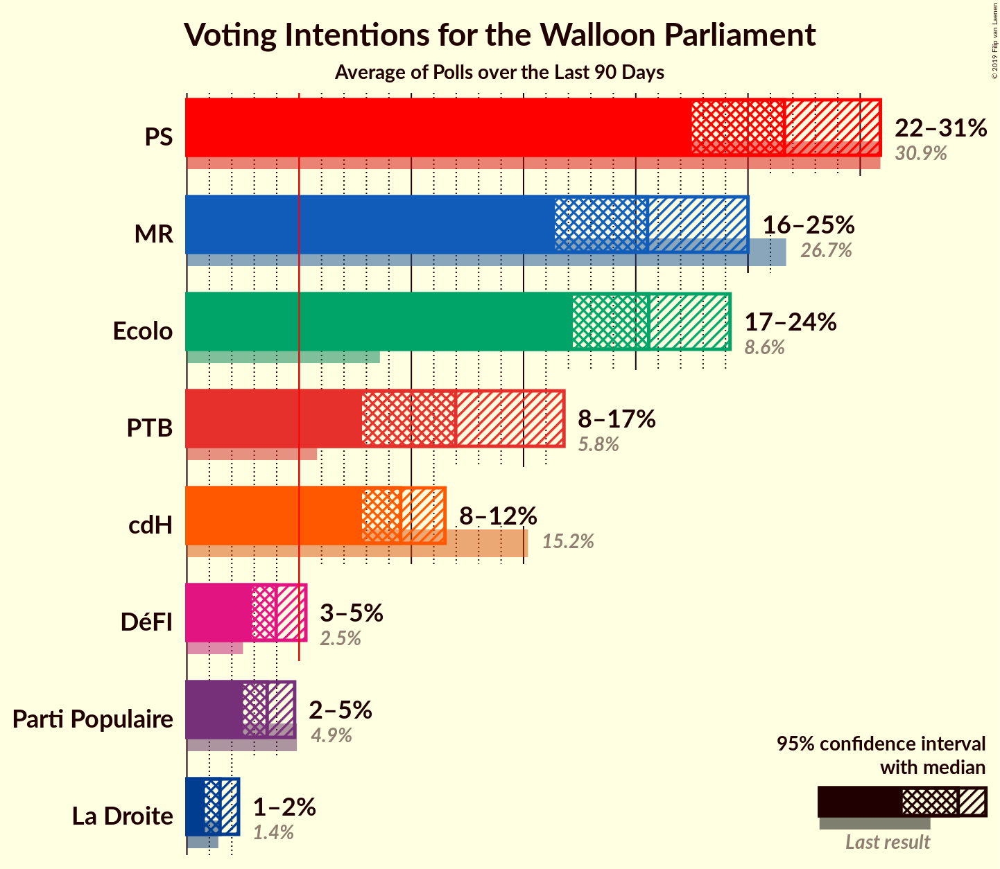

### Confidence Intervals

| Party | Last Result | Median | 80% Confidence Interval | 90% Confidence Interval | 95% Confidence Interval | 99% Confidence Interval |
|:-----:|:-----------:|:------:|:-----------------------:|:-----------------------:|:-----------------------:|:-----------------------:|
| <a href="#ps">PS</a> | 30.9% | 26.6% | 23.6–29.7% |23.0–30.4% | 22.5–30.9% | 21.7–31.9% |
| <a href="#mr">MR</a> | 26.7% | 20.5% | 17.4–23.9% |16.8–24.5% | 16.4–25.0% | 15.6–25.9% |
| <a href="#cdh">cdH</a> | 15.2% | 9.5% | 8.4–10.8% |8.0–11.2% | 7.8–11.5% | 7.3–12.2% |
| <a href="#ecolo">Ecolo</a> | 8.6% | 20.6% | 18.1–23.2% |17.6–23.8% | 17.2–24.2% | 16.4–25.2% |
| <a href="#ptb">PTB</a> | 5.8% | 12.0% | 8.5–15.8% |8.1–16.4% | 7.8–16.8% | 7.3–17.6% |
| <a href="#parti-populaire">Parti Populaire</a> | 4.9% | 3.6% | 2.9–4.4% |2.7–4.6% | 2.5–4.8% | 2.2–5.3% |
| <a href="#défi">DéFI</a> | 2.5% | 4.0% | 3.2–4.8% |3.0–5.1% | 2.9–5.3% | 2.6–5.7% |
| <a href="#la-droite">La Droite</a> | 1.4% | 1.5% | 1.0–2.0% |0.9–2.2% | 0.8–2.3% | 0.7–2.7% |
| <a href="#debout-les-belges">Debout les Belges</a> | 0.8% | N/A | N/A |N/A | N/A | N/A |
| <a href="#r.w.f.">R.W.F.</a> | 0.5% | N/A | N/A |N/A | N/A | N/A |
| <a href="#wallonie-d’abord">Wallonie d’Abord</a> | 0.4% | N/A | N/A |N/A | N/A | N/A |
| <a href="#pirate">PIRATE</a> | 0.2% | N/A | N/A |N/A | N/A | N/A |
| <a href="#fw">FW</a> | 0.1% | N/A | N/A |N/A | N/A | N/A |

### PS

*For a full overview of the results for this party, see the [PS](party-ps.html) page.*

| Voting Intentions | Probability | Accumulated | Special Marks |
|:-----------------:|:-----------:|:-----------:|:-------------:|
| 19.5–20.5% | 0% | 100% |  |
| 20.5–21.5% | 0.4% | 100% |  |
| 21.5–22.5% | 2% | 99.6% |  |
| 22.5–23.5% | 7% | 97% |  |
| 23.5–24.5% | 13% | 91% |  |
| 24.5–25.5% | 14% | 78% |  |
| 25.5–26.5% | 12% | 63% |  |
| 26.5–27.5% | 12% | 51% | Median |
| 27.5–28.5% | 14% | 39% |  |
| 28.5–29.5% | 13% | 25% |  |
| 29.5–30.5% | 8% | 12% |  |
| 30.5–31.5% | 3% | 4% | Last Result |
| 31.5–32.5% | 0.8% | 0.9% |  |
| 32.5–33.5% | 0.1% | 0.1% |  |
| 33.5–34.5% | 0% | 0% |  |

### MR

*For a full overview of the results for this party, see the [MR](party-mr.html) page.*

| Voting Intentions | Probability | Accumulated | Special Marks |
|:-----------------:|:-----------:|:-----------:|:-------------:|
| 13.5–14.5% | 0% | 100% |  |
| 14.5–15.5% | 0.4% | 100% |  |
| 15.5–16.5% | 3% | 99.6% |  |
| 16.5–17.5% | 9% | 97% |  |
| 17.5–18.5% | 16% | 88% |  |
| 18.5–19.5% | 14% | 72% |  |
| 19.5–20.5% | 8% | 58% |  |
| 20.5–21.5% | 9% | 50% | Median |
| 21.5–22.5% | 13% | 41% |  |
| 22.5–23.5% | 14% | 28% |  |
| 23.5–24.5% | 9% | 14% |  |
| 24.5–25.5% | 3% | 4% |  |
| 25.5–26.5% | 0.8% | 1.0% |  |
| 26.5–27.5% | 0.1% | 0.1% | Last Result |
| 27.5–28.5% | 0% | 0% |  |

### cdH

*For a full overview of the results for this party, see the [cdH](party-cdh.html) page.*

| Voting Intentions | Probability | Accumulated | Special Marks |
|:-----------------:|:-----------:|:-----------:|:-------------:|
| 5.5–6.5% | 0% | 100% |  |
| 6.5–7.5% | 1.2% | 100% |  |
| 7.5–8.5% | 13% | 98.7% |  |
| 8.5–9.5% | 37% | 86% |  |
| 9.5–10.5% | 34% | 49% | Median |
| 10.5–11.5% | 13% | 15% |  |
| 11.5–12.5% | 2% | 2% |  |
| 12.5–13.5% | 0.2% | 0.2% |  |
| 13.5–14.5% | 0% | 0% |  |
| 14.5–15.5% | 0% | 0% | Last Result |

### Ecolo

*For a full overview of the results for this party, see the [Ecolo](party-ecolo.html) page.*

| Voting Intentions | Probability | Accumulated | Special Marks |
|:-----------------:|:-----------:|:-----------:|:-------------:|
| 8.5–9.5% | 0% | 100% | Last Result |
| 9.5–10.5% | 0% | 100% |  |
| 10.5–11.5% | 0% | 100% |  |
| 11.5–12.5% | 0% | 100% |  |
| 12.5–13.5% | 0% | 100% |  |
| 13.5–14.5% | 0% | 100% |  |
| 14.5–15.5% | 0.1% | 100% |  |
| 15.5–16.5% | 0.7% | 99.9% |  |
| 16.5–17.5% | 4% | 99.2% |  |
| 17.5–18.5% | 11% | 95% |  |
| 18.5–19.5% | 17% | 84% |  |
| 19.5–20.5% | 17% | 67% |  |
| 20.5–21.5% | 17% | 51% | Median |
| 21.5–22.5% | 16% | 34% |  |
| 22.5–23.5% | 11% | 18% |  |
| 23.5–24.5% | 5% | 6% |  |
| 24.5–25.5% | 1.3% | 2% |  |
| 25.5–26.5% | 0.2% | 0.2% |  |
| 26.5–27.5% | 0% | 0% |  |

### PTB

*For a full overview of the results for this party, see the [PTB](party-ptb.html) page.*

| Voting Intentions | Probability | Accumulated | Special Marks |
|:-----------------:|:-----------:|:-----------:|:-------------:|
| 5.5–6.5% | 0% | 100% | Last Result |
| 6.5–7.5% | 1.2% | 100% |  |
| 7.5–8.5% | 10% | 98.8% |  |
| 8.5–9.5% | 21% | 89% |  |
| 9.5–10.5% | 14% | 69% |  |
| 10.5–11.5% | 4% | 54% |  |
| 11.5–12.5% | 1.1% | 50% | Median |
| 12.5–13.5% | 5% | 49% |  |
| 13.5–14.5% | 14% | 44% |  |
| 14.5–15.5% | 17% | 31% |  |
| 15.5–16.5% | 10% | 14% |  |
| 16.5–17.5% | 3% | 4% |  |
| 17.5–18.5% | 0.5% | 0.6% |  |
| 18.5–19.5% | 0.1% | 0.1% |  |
| 19.5–20.5% | 0% | 0% |  |

### Parti Populaire

*For a full overview of the results for this party, see the [Parti Populaire](party-partipopulaire.html) page.*

| Voting Intentions | Probability | Accumulated | Special Marks |
|:-----------------:|:-----------:|:-----------:|:-------------:|
| 0.5–1.5% | 0% | 100% |  |
| 1.5–2.5% | 3% | 100% |  |
| 2.5–3.5% | 47% | 97% |  |
| 3.5–4.5% | 45% | 50% | Median |
| 4.5–5.5% | 6% | 6% | Last Result |
| 5.5–6.5% | 0.2% | 0.2% |  |
| 6.5–7.5% | 0% | 0% |  |

### DéFI

*For a full overview of the results for this party, see the [DéFI](party-défi.html) page.*

| Voting Intentions | Probability | Accumulated | Special Marks |
|:-----------------:|:-----------:|:-----------:|:-------------:|
| 0.5–1.5% | 0% | 100% |  |
| 1.5–2.5% | 0.4% | 100% |  |
| 2.5–3.5% | 24% | 99.6% | Last Result |
| 3.5–4.5% | 58% | 75% | Median |
| 4.5–5.5% | 16% | 17% |  |
| 5.5–6.5% | 1.0% | 1.0% |  |
| 6.5–7.5% | 0% | 0% |  |

### La Droite

*For a full overview of the results for this party, see the [La Droite](party-ladroite.html) page.*

| Voting Intentions | Probability | Accumulated | Special Marks |
|:-----------------:|:-----------:|:-----------:|:-------------:|
| 0.0–0.5% | 0.1% | 100% |  |
| 0.5–1.5% | 59% | 99.9% | Last Result, Median |
| 1.5–2.5% | 40% | 41% |  |
| 2.5–3.5% | 0.9% | 0.9% |  |
| 3.5–4.5% | 0% | 0% |  |

## Seats

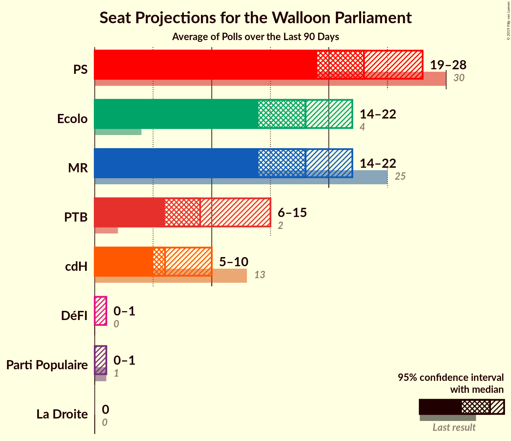

### Confidence Intervals

| Party | Last Result | Median | 80% Confidence Interval | 90% Confidence Interval | 95% Confidence Interval | 99% Confidence Interval |
|:-----:|:-----------:|:------:|:-----------------------:|:-----------------------:|:-----------------------:|:-----------------------:|
| <a href="#ps">PS</a> | 30 | 23 | 21–26 |20–28 | 19–28 | 18–29 |
| <a href="#mr">MR</a> | 25 | 18 | 15–22 |14–22 | 14–22 | 13–23 |
| <a href="#cdh">cdH</a> | 13 | 6 | 5–9 |5–9 | 5–10 | 5–10 |
| <a href="#ecolo">Ecolo</a> | 4 | 18 | 14–20 |14–21 | 14–22 | 13–23 |
| <a href="#ptb">PTB</a> | 2 | 9 | 7–13 |6–13 | 6–15 | 4–15 |
| <a href="#parti-populaire">Parti Populaire</a> | 1 | 0 | 0 |0 | 0–1 | 0–2 |
| <a href="#défi">DéFI</a> | 0 | 0 | 0–1 |0–1 | 0–1 | 0–2 |
| <a href="#la-droite">La Droite</a> | 0 | 0 | 0 |0 | 0 | 0 |
| <a href="#debout-les-belges">Debout les Belges</a> | 0 | N/A | N/A |N/A | N/A | N/A |
| <a href="#r.w.f.">R.W.F.</a> | 0 | N/A | N/A |N/A | N/A | N/A |
| <a href="#wallonie-d’abord">Wallonie d’Abord</a> | 0 | N/A | N/A |N/A | N/A | N/A |
| <a href="#pirate">PIRATE</a> | 0 | N/A | N/A |N/A | N/A | N/A |
| <a href="#fw">FW</a> | 0 | N/A | N/A |N/A | N/A | N/A |

### PS

*For a full overview of the results for this party, see the [PS](party-ps.html) page.*

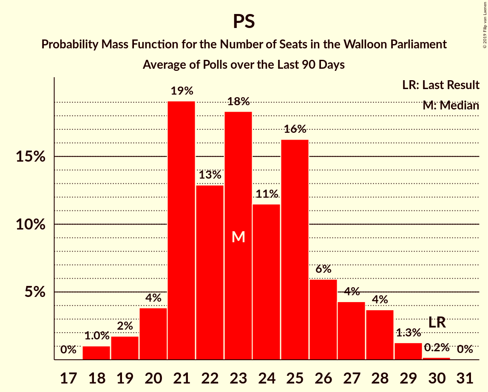

| Number of Seats | Probability | Accumulated | Special Marks |
|:---------------:|:-----------:|:-----------:|:-------------:|
| 18 | 1.0% | 100% |  |
| 19 | 2% | 99.0% |  |
| 20 | 4% | 97% |  |
| 21 | 19% | 93% |  |
| 22 | 13% | 74% |  |
| 23 | 18% | 61% | Median |
| 24 | 11% | 43% |  |
| 25 | 16% | 32% |  |
| 26 | 6% | 15% |  |
| 27 | 4% | 9% |  |
| 28 | 4% | 5% |  |
| 29 | 1.3% | 1.4% |  |
| 30 | 0.2% | 0.2% | Last Result |
| 31 | 0% | 0% |  |

### MR

*For a full overview of the results for this party, see the [MR](party-mr.html) page.*

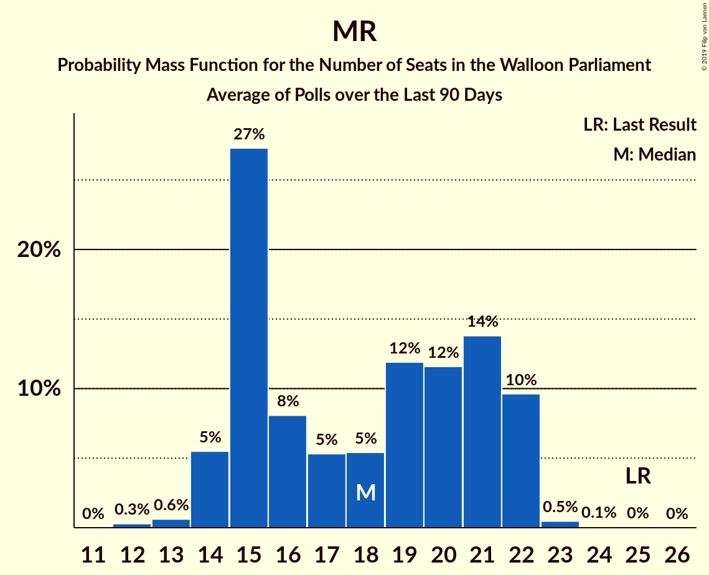

| Number of Seats | Probability | Accumulated | Special Marks |
|:---------------:|:-----------:|:-----------:|:-------------:|
| 12 | 0.3% | 100% |  |
| 13 | 0.6% | 99.7% |  |
| 14 | 5% | 99.1% |  |
| 15 | 27% | 94% |  |
| 16 | 8% | 66% |  |
| 17 | 5% | 58% |  |
| 18 | 5% | 53% | Median |
| 19 | 12% | 48% |  |
| 20 | 12% | 36% |  |
| 21 | 14% | 24% |  |
| 22 | 10% | 10% |  |
| 23 | 0.5% | 0.6% |  |
| 24 | 0.1% | 0.1% |  |
| 25 | 0% | 0.1% | Last Result |
| 26 | 0% | 0% |  |

### cdH

*For a full overview of the results for this party, see the [cdH](party-cdh.html) page.*

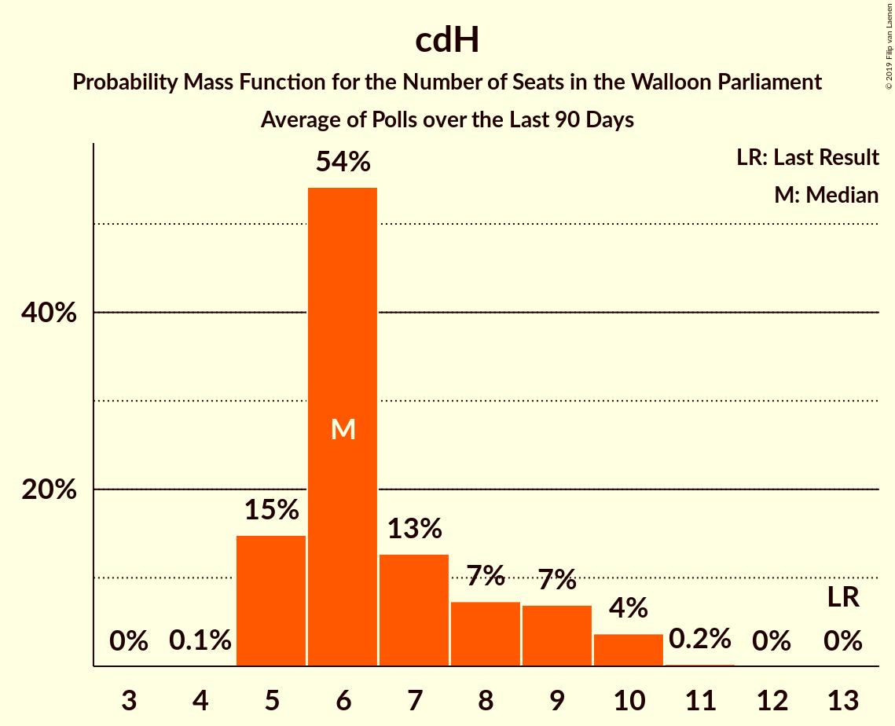

| Number of Seats | Probability | Accumulated | Special Marks |
|:---------------:|:-----------:|:-----------:|:-------------:|
| 4 | 0.1% | 100% |  |
| 5 | 15% | 99.9% |  |
| 6 | 54% | 85% | Median |
| 7 | 13% | 31% |  |
| 8 | 7% | 18% |  |
| 9 | 7% | 11% |  |
| 10 | 4% | 4% |  |
| 11 | 0.2% | 0.3% |  |
| 12 | 0% | 0% |  |
| 13 | 0% | 0% | Last Result |

### Ecolo

*For a full overview of the results for this party, see the [Ecolo](party-ecolo.html) page.*

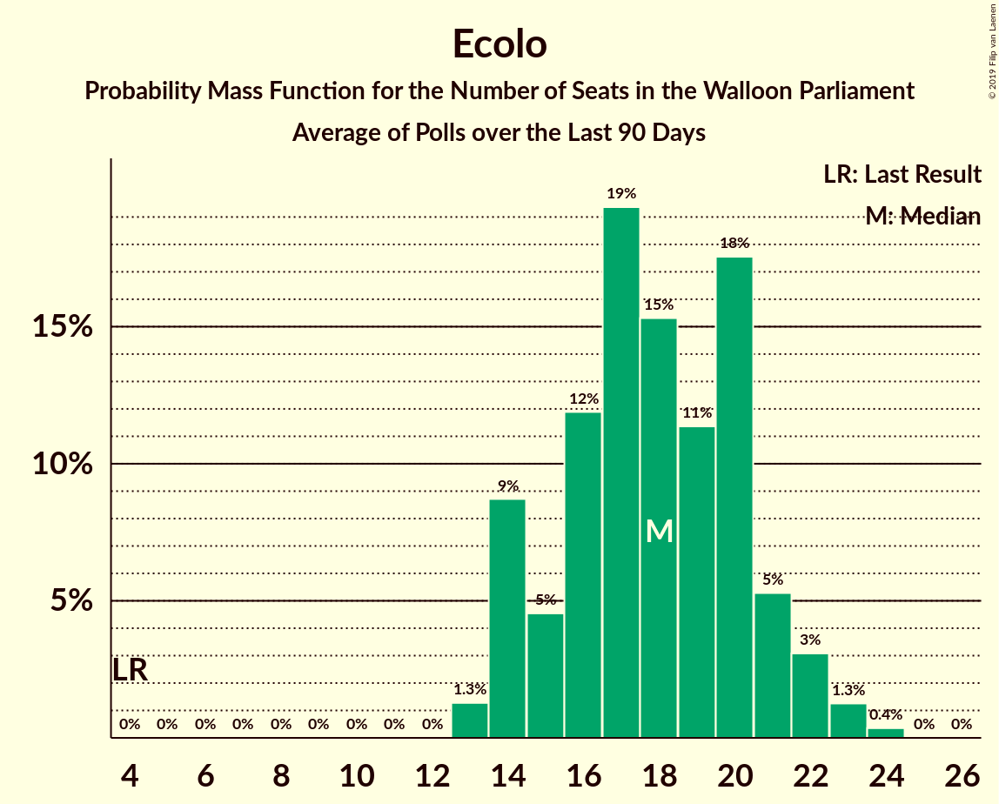

| Number of Seats | Probability | Accumulated | Special Marks |
|:---------------:|:-----------:|:-----------:|:-------------:|
| 4 | 0% | 100% | Last Result |
| 5 | 0% | 100% |  |
| 6 | 0% | 100% |  |
| 7 | 0% | 100% |  |
| 8 | 0% | 100% |  |
| 9 | 0% | 100% |  |
| 10 | 0% | 100% |  |
| 11 | 0% | 100% |  |
| 12 | 0% | 100% |  |
| 13 | 1.3% | 100% |  |
| 14 | 9% | 98.7% |  |
| 15 | 5% | 90% |  |
| 16 | 12% | 85% |  |
| 17 | 19% | 74% |  |
| 18 | 15% | 54% | Median |
| 19 | 11% | 39% |  |
| 20 | 18% | 28% |  |
| 21 | 5% | 10% |  |
| 22 | 3% | 5% |  |
| 23 | 1.3% | 2% |  |
| 24 | 0.4% | 0.4% |  |
| 25 | 0% | 0% |  |

### PTB

*For a full overview of the results for this party, see the [PTB](party-ptb.html) page.*

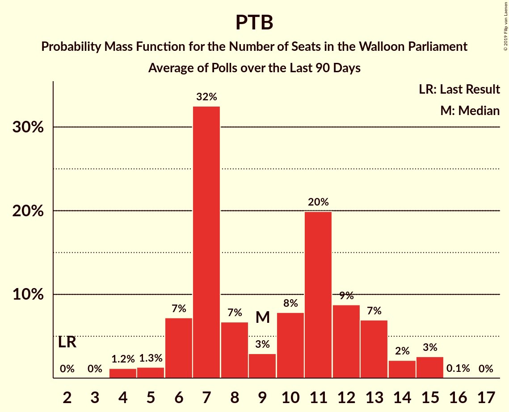

| Number of Seats | Probability | Accumulated | Special Marks |
|:---------------:|:-----------:|:-----------:|:-------------:|
| 2 | 0% | 100% | Last Result |
| 3 | 0% | 100% |  |
| 4 | 1.2% | 100% |  |
| 5 | 1.3% | 98.8% |  |
| 6 | 7% | 98% |  |
| 7 | 32% | 90% |  |
| 8 | 7% | 58% |  |
| 9 | 3% | 51% | Median |
| 10 | 8% | 48% |  |
| 11 | 20% | 40% |  |
| 12 | 9% | 20% |  |
| 13 | 7% | 12% |  |
| 14 | 2% | 5% |  |
| 15 | 3% | 3% |  |
| 16 | 0.1% | 0.1% |  |
| 17 | 0% | 0% |  |

### Parti Populaire

*For a full overview of the results for this party, see the [Parti Populaire](party-partipopulaire.html) page.*

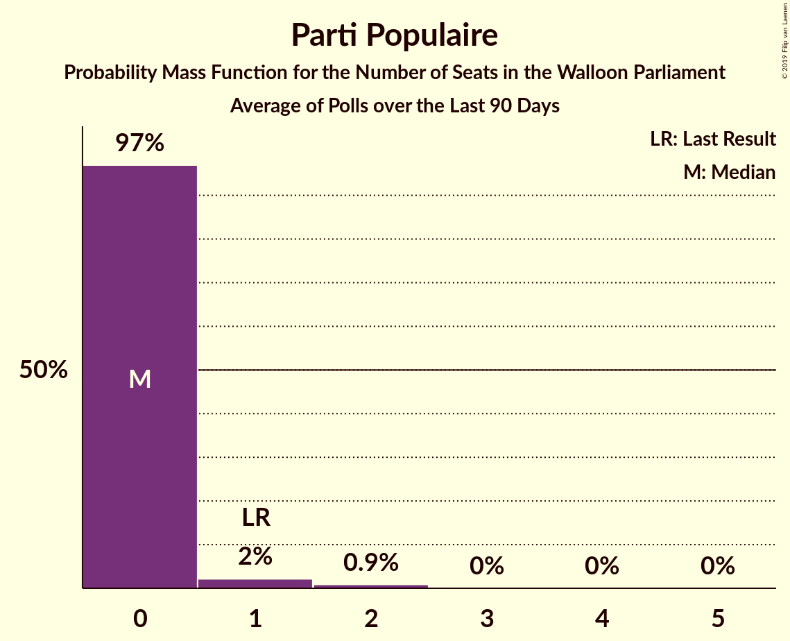

| Number of Seats | Probability | Accumulated | Special Marks |
|:---------------:|:-----------:|:-----------:|:-------------:|
| 0 | 97% | 100% | Median |
| 1 | 2% | 3% | Last Result |
| 2 | 0.9% | 0.9% |  |
| 3 | 0% | 0% |  |

### DéFI

*For a full overview of the results for this party, see the [DéFI](party-défi.html) page.*

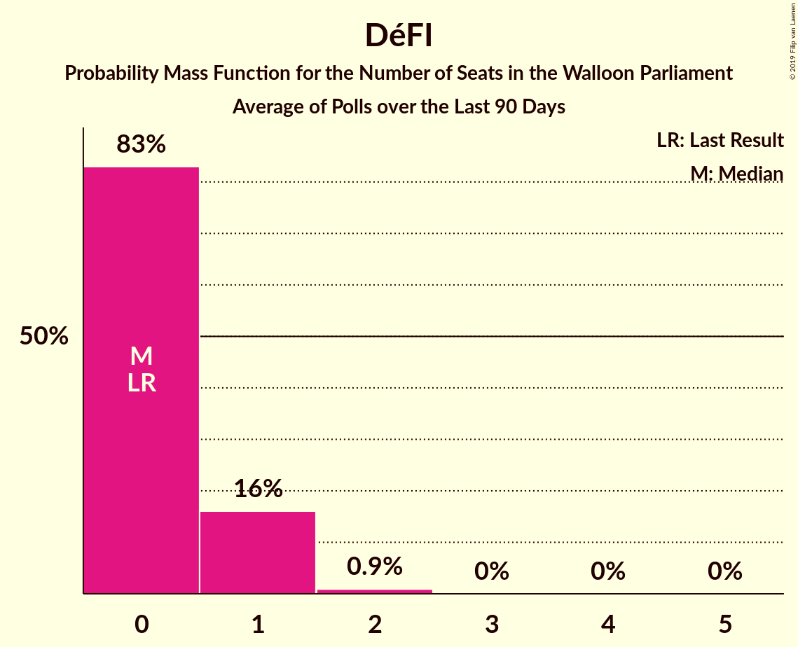

| Number of Seats | Probability | Accumulated | Special Marks |
|:---------------:|:-----------:|:-----------:|:-------------:|
| 0 | 83% | 100% | Last Result, Median |
| 1 | 16% | 17% |  |
| 2 | 0.9% | 1.0% |  |
| 3 | 0% | 0.1% |  |
| 4 | 0% | 0% |  |

### La Droite

*For a full overview of the results for this party, see the [La Droite](party-ladroite.html) page.*

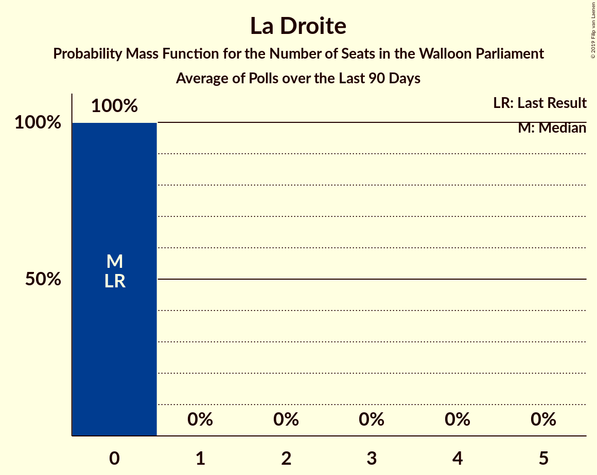

| Number of Seats | Probability | Accumulated | Special Marks |
|:---------------:|:-----------:|:-----------:|:-------------:|
| 0 | 100% | 100% | Last Result, Median |

## Coalitions

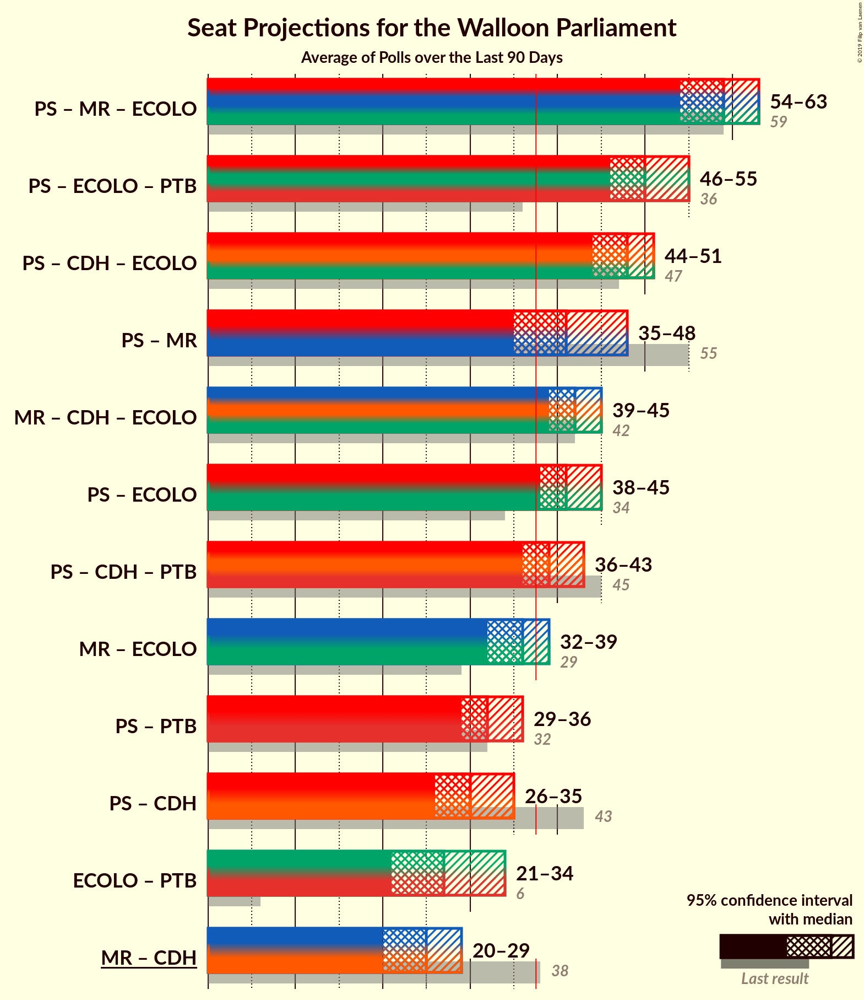

### Confidence Intervals

| Coalition | Last Result | Median | Majority? | 80% Confidence Interval | 90% Confidence Interval | 95% Confidence Interval | 99% Confidence Interval |
|:---------:|:-----------:|:------:|:---------:|:-----------------------:|:-----------------------:|:-----------------------:|:-----------------------:|
| PS – MR – Ecolo | 59 | 59 | 100% | 55–62 | 54–63 | 54–63 | 53–65 |
| PS – Ecolo – PTB | 36 | 50 | 100% | 47–54 | 46–55 | 46–55 | 44–56 |
| PS – cdH – Ecolo | 47 | 48 | 100% | 46–50 | 45–50 | 44–51 | 43–52 |
| PS – MR | 55 | 41 | 70% | 36–46 | 35–47 | 35–48 | 33–49 |
| MR – cdH – Ecolo | 42 | 42 | 99.4% | 40–44 | 39–45 | 39–45 | 37–47 |
| PS – Ecolo | 34 | 41 | 98.6% | 39–43 | 38–44 | 38–45 | 37–46 |
| PS – cdH – PTB | 45 | 39 | 80% | 37–41 | 36–42 | 36–43 | 35–44 |
| MR – Ecolo | 29 | 36 | 16% | 33–38 | 33–39 | 32–39 | 31–40 |
| PS – PTB | 32 | 32 | 0.5% | 30–35 | 30–36 | 29–36 | 28–37 |
| PS – cdH | 43 | 30 | 0.1% | 27–33 | 26–34 | 26–35 | 24–36 |
| Ecolo – PTB | 6 | 27 | 0% | 21–33 | 21–33 | 21–34 | 20–35 |
| MR – cdH | 38 | 25 | 0% | 21–28 | 20–29 | 20–29 | 19–30 |

### PS – MR – Ecolo

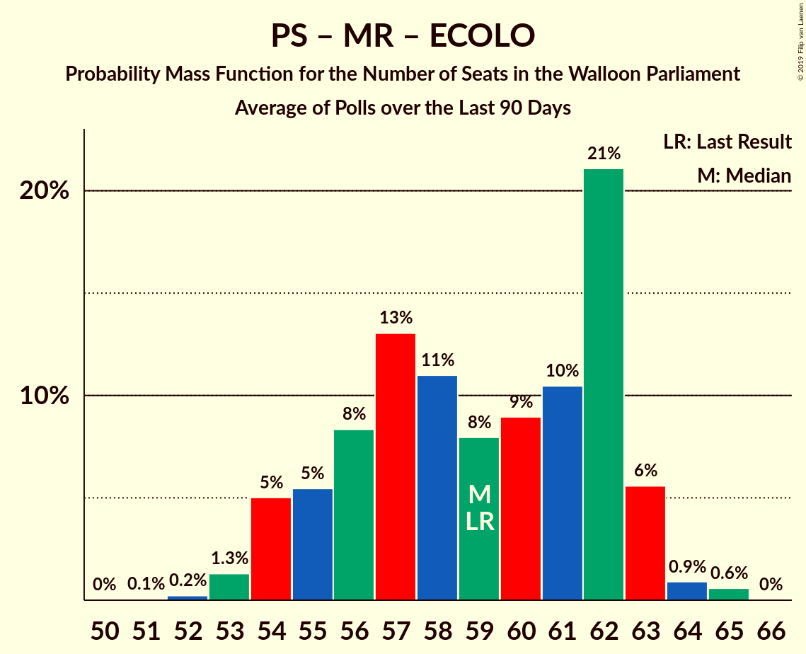

| Number of Seats | Probability | Accumulated | Special Marks |
|:---------------:|:-----------:|:-----------:|:-------------:|
| 51 | 0.1% | 100% |  |
| 52 | 0.2% | 99.9% |  |
| 53 | 1.3% | 99.7% |  |
| 54 | 5% | 98% |  |
| 55 | 5% | 93% |  |
| 56 | 8% | 88% |  |
| 57 | 13% | 80% |  |
| 58 | 11% | 67% |  |
| 59 | 8% | 56% | Last Result, Median |
| 60 | 9% | 48% |  |
| 61 | 10% | 39% |  |
| 62 | 21% | 28% |  |
| 63 | 6% | 7% |  |
| 64 | 0.9% | 2% |  |
| 65 | 0.6% | 0.6% |  |
| 66 | 0% | 0% |  |

### PS – Ecolo – PTB

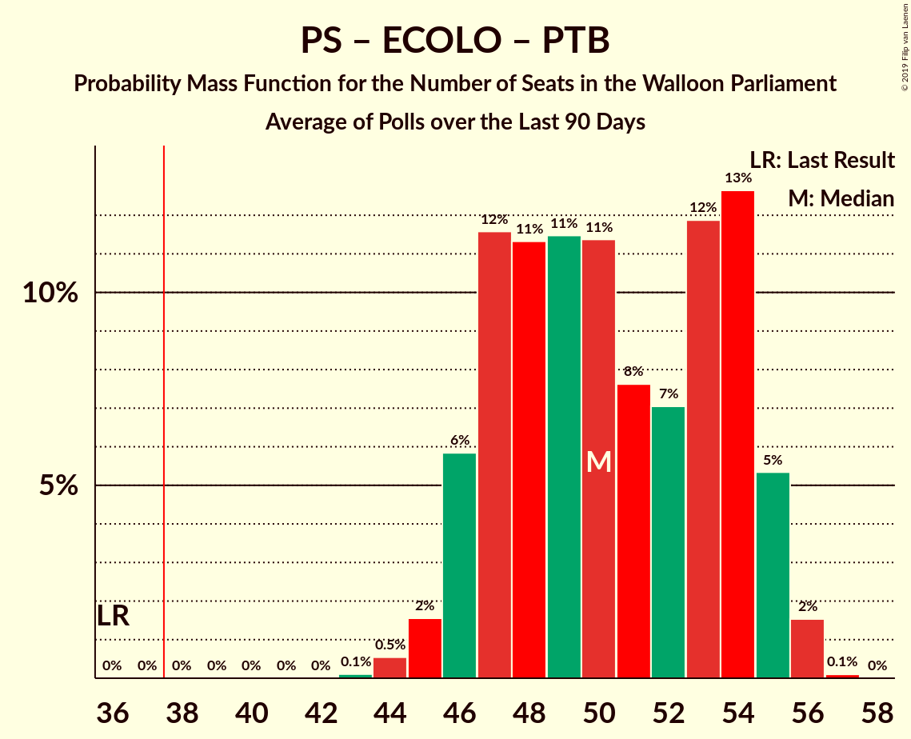

| Number of Seats | Probability | Accumulated | Special Marks |
|:---------------:|:-----------:|:-----------:|:-------------:|
| 36 | 0% | 100% | Last Result |
| 37 | 0% | 100% |  |
| 38 | 0% | 100% | Majority |
| 39 | 0% | 100% |  |
| 40 | 0% | 100% |  |
| 41 | 0% | 100% |  |
| 42 | 0% | 100% |  |
| 43 | 0.1% | 100% |  |
| 44 | 0.5% | 99.9% |  |
| 45 | 2% | 99.3% |  |
| 46 | 6% | 98% |  |
| 47 | 12% | 92% |  |
| 48 | 11% | 80% |  |
| 49 | 11% | 69% |  |
| 50 | 11% | 58% | Median |
| 51 | 8% | 46% |  |
| 52 | 7% | 39% |  |
| 53 | 12% | 32% |  |
| 54 | 13% | 20% |  |
| 55 | 5% | 7% |  |
| 56 | 2% | 2% |  |
| 57 | 0.1% | 0.1% |  |
| 58 | 0% | 0% |  |

### PS – cdH – Ecolo

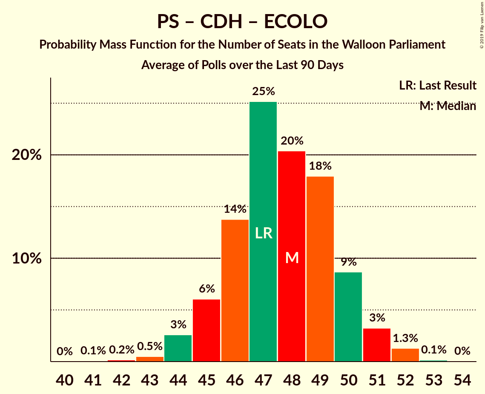

| Number of Seats | Probability | Accumulated | Special Marks |
|:---------------:|:-----------:|:-----------:|:-------------:|
| 41 | 0.1% | 100% |  |
| 42 | 0.2% | 99.9% |  |
| 43 | 0.5% | 99.8% |  |
| 44 | 3% | 99.3% |  |
| 45 | 6% | 97% |  |
| 46 | 14% | 91% |  |
| 47 | 25% | 77% | Last Result, Median |
| 48 | 20% | 52% |  |
| 49 | 18% | 31% |  |
| 50 | 9% | 13% |  |
| 51 | 3% | 5% |  |
| 52 | 1.3% | 1.5% |  |
| 53 | 0.1% | 0.2% |  |
| 54 | 0% | 0% |  |

### PS – MR

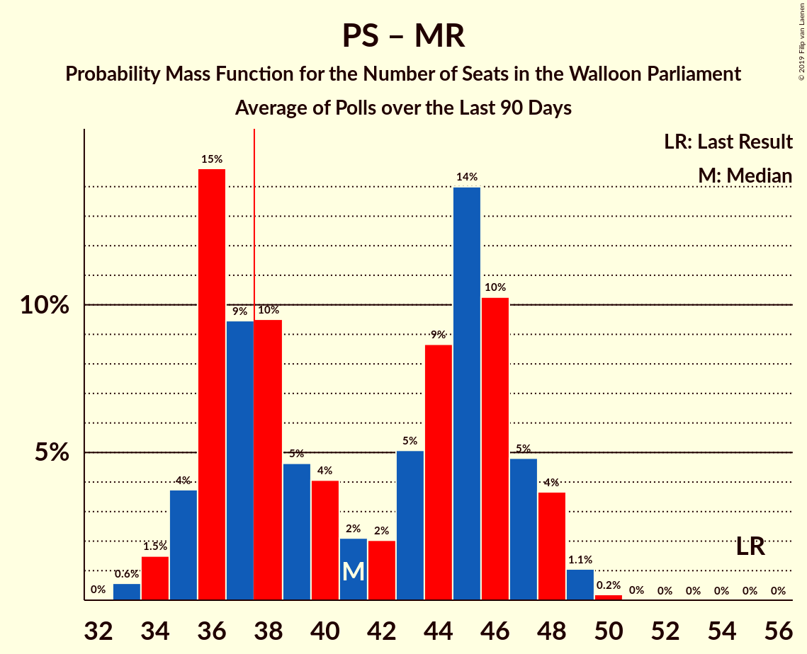

| Number of Seats | Probability | Accumulated | Special Marks |
|:---------------:|:-----------:|:-----------:|:-------------:|
| 33 | 0.6% | 100% |  |
| 34 | 1.5% | 99.4% |  |
| 35 | 4% | 98% |  |
| 36 | 15% | 94% |  |
| 37 | 9% | 80% |  |
| 38 | 10% | 70% | Majority |
| 39 | 5% | 61% |  |
| 40 | 4% | 56% |  |
| 41 | 2% | 52% | Median |
| 42 | 2% | 50% |  |
| 43 | 5% | 48% |  |
| 44 | 9% | 43% |  |
| 45 | 14% | 34% |  |
| 46 | 10% | 20% |  |
| 47 | 5% | 10% |  |
| 48 | 4% | 5% |  |
| 49 | 1.1% | 1.3% |  |
| 50 | 0.2% | 0.2% |  |
| 51 | 0% | 0% |  |
| 52 | 0% | 0% |  |
| 53 | 0% | 0% |  |
| 54 | 0% | 0% |  |
| 55 | 0% | 0% | Last Result |

### MR – cdH – Ecolo

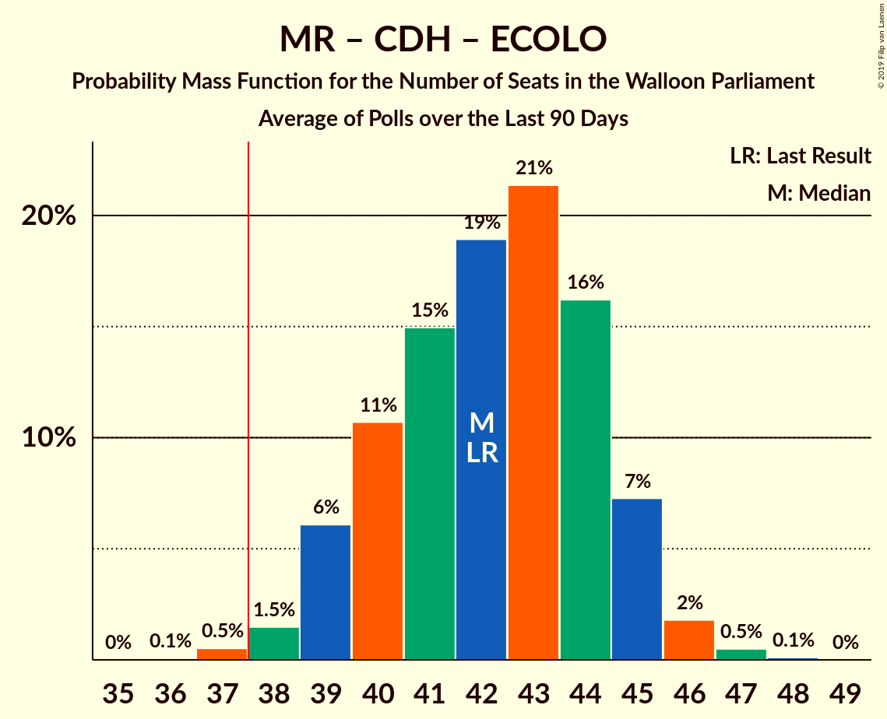

| Number of Seats | Probability | Accumulated | Special Marks |
|:---------------:|:-----------:|:-----------:|:-------------:|
| 36 | 0.1% | 100% |  |
| 37 | 0.5% | 99.9% |  |
| 38 | 1.5% | 99.4% | Majority |
| 39 | 6% | 98% |  |
| 40 | 11% | 92% |  |
| 41 | 15% | 81% |  |
| 42 | 19% | 66% | Last Result, Median |
| 43 | 21% | 47% |  |
| 44 | 16% | 26% |  |
| 45 | 7% | 10% |  |
| 46 | 2% | 2% |  |
| 47 | 0.5% | 0.6% |  |
| 48 | 0.1% | 0.1% |  |
| 49 | 0% | 0% |  |

### PS – Ecolo

| Number of Seats | Probability | Accumulated | Special Marks |
|:---------------:|:-----------:|:-----------:|:-------------:|
| 34 | 0% | 100% | Last Result |
| 35 | 0.1% | 100% |  |
| 36 | 0.4% | 99.9% |  |
| 37 | 1.0% | 99.5% |  |
| 38 | 5% | 98.6% | Majority |
| 39 | 11% | 93% |  |
| 40 | 17% | 83% |  |
| 41 | 24% | 66% | Median |
| 42 | 20% | 42% |  |
| 43 | 14% | 22% |  |
| 44 | 5% | 9% |  |
| 45 | 2% | 3% |  |
| 46 | 0.7% | 0.8% |  |
| 47 | 0.1% | 0.1% |  |
| 48 | 0% | 0% |  |

### PS – cdH – PTB

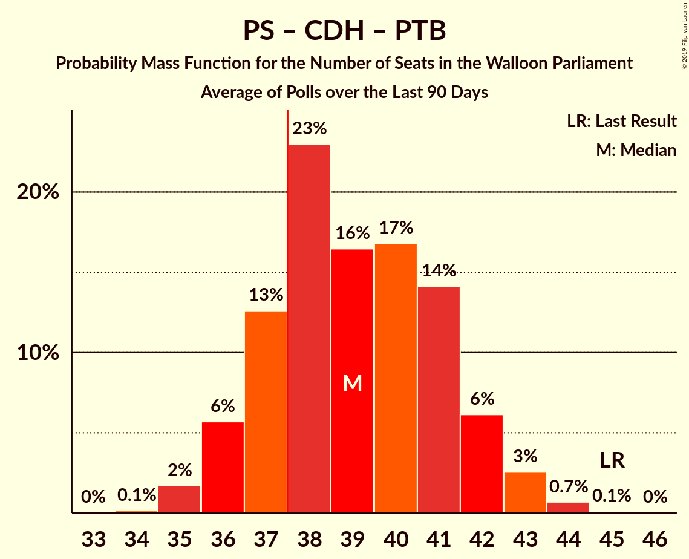

| Number of Seats | Probability | Accumulated | Special Marks |
|:---------------:|:-----------:|:-----------:|:-------------:|
| 34 | 0.1% | 100% |  |
| 35 | 2% | 99.8% |  |
| 36 | 6% | 98% |  |
| 37 | 13% | 92% |  |
| 38 | 23% | 80% | Median, Majority |
| 39 | 16% | 57% |  |
| 40 | 17% | 40% |  |
| 41 | 14% | 24% |  |
| 42 | 6% | 9% |  |
| 43 | 3% | 3% |  |
| 44 | 0.7% | 0.8% |  |
| 45 | 0.1% | 0.1% | Last Result |
| 46 | 0% | 0% |  |

### MR – Ecolo

| Number of Seats | Probability | Accumulated | Special Marks |
|:---------------:|:-----------:|:-----------:|:-------------:|
| 29 | 0% | 100% | Last Result |
| 30 | 0.2% | 100% |  |
| 31 | 0.8% | 99.8% |  |
| 32 | 3% | 99.0% |  |
| 33 | 7% | 96% |  |
| 34 | 15% | 88% |  |
| 35 | 18% | 73% |  |
| 36 | 16% | 55% | Median |
| 37 | 22% | 39% |  |
| 38 | 10% | 16% | Majority |
| 39 | 4% | 6% |  |
| 40 | 1.4% | 2% |  |
| 41 | 0.1% | 0.1% |  |
| 42 | 0% | 0% |  |

### PS – PTB

| Number of Seats | Probability | Accumulated | Special Marks |
|:---------------:|:-----------:|:-----------:|:-------------:|
| 27 | 0.1% | 100% |  |
| 28 | 0.6% | 99.9% |  |
| 29 | 2% | 99.3% |  |
| 30 | 9% | 97% |  |
| 31 | 16% | 88% |  |
| 32 | 24% | 71% | Last Result, Median |
| 33 | 18% | 47% |  |
| 34 | 14% | 29% |  |
| 35 | 10% | 16% |  |
| 36 | 4% | 6% |  |
| 37 | 1.1% | 2% |  |
| 38 | 0.4% | 0.5% | Majority |
| 39 | 0% | 0% |  |

### PS – cdH

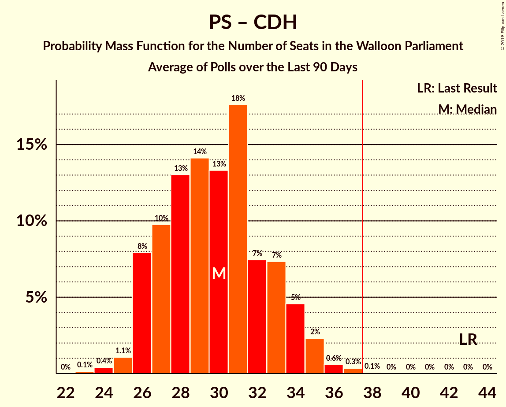

| Number of Seats | Probability | Accumulated | Special Marks |
|:---------------:|:-----------:|:-----------:|:-------------:|
| 23 | 0.1% | 100% |  |
| 24 | 0.4% | 99.9% |  |
| 25 | 1.1% | 99.5% |  |
| 26 | 8% | 98% |  |
| 27 | 10% | 90% |  |
| 28 | 13% | 81% |  |
| 29 | 14% | 68% | Median |
| 30 | 13% | 54% |  |
| 31 | 18% | 40% |  |
| 32 | 7% | 23% |  |
| 33 | 7% | 15% |  |
| 34 | 5% | 8% |  |
| 35 | 2% | 3% |  |
| 36 | 0.6% | 1.0% |  |
| 37 | 0.3% | 0.4% |  |
| 38 | 0.1% | 0.1% | Majority |
| 39 | 0% | 0% |  |
| 40 | 0% | 0% |  |
| 41 | 0% | 0% |  |
| 42 | 0% | 0% |  |
| 43 | 0% | 0% | Last Result |

### Ecolo – PTB

| Number of Seats | Probability | Accumulated | Special Marks |
|:---------------:|:-----------:|:-----------:|:-------------:|
| 6 | 0% | 100% | Last Result |
| 7 | 0% | 100% |  |
| 8 | 0% | 100% |  |
| 9 | 0% | 100% |  |
| 10 | 0% | 100% |  |
| 11 | 0% | 100% |  |
| 12 | 0% | 100% |  |
| 13 | 0% | 100% |  |
| 14 | 0% | 100% |  |
| 15 | 0% | 100% |  |
| 16 | 0% | 100% |  |
| 17 | 0% | 100% |  |
| 18 | 0.1% | 100% |  |
| 19 | 0.3% | 99.9% |  |
| 20 | 2% | 99.6% |  |
| 21 | 8% | 98% |  |
| 22 | 7% | 89% |  |
| 23 | 10% | 83% |  |
| 24 | 12% | 73% |  |
| 25 | 10% | 61% |  |
| 26 | 1.4% | 51% |  |
| 27 | 1.1% | 50% | Median |
| 28 | 4% | 49% |  |
| 29 | 4% | 45% |  |
| 30 | 10% | 41% |  |
| 31 | 11% | 31% |  |
| 32 | 8% | 20% |  |
| 33 | 7% | 12% |  |
| 34 | 4% | 5% |  |
| 35 | 0.8% | 0.9% |  |
| 36 | 0.1% | 0.2% |  |
| 37 | 0% | 0% |  |

### MR – cdH

| Number of Seats | Probability | Accumulated | Special Marks |
|:---------------:|:-----------:|:-----------:|:-------------:|
| 18 | 0.2% | 100% |  |
| 19 | 2% | 99.7% |  |
| 20 | 7% | 98% |  |
| 21 | 15% | 91% |  |
| 22 | 10% | 76% |  |
| 23 | 6% | 66% |  |
| 24 | 8% | 60% | Median |
| 25 | 12% | 52% |  |
| 26 | 11% | 40% |  |
| 27 | 11% | 29% |  |
| 28 | 12% | 18% |  |
| 29 | 4% | 6% |  |
| 30 | 1.3% | 2% |  |
| 31 | 0.4% | 0.4% |  |
| 32 | 0.1% | 0.1% |  |
| 33 | 0% | 0% |  |
| 34 | 0% | 0% |  |
| 35 | 0% | 0% |  |
| 36 | 0% | 0% |  |
| 37 | 0% | 0% |  |
| 38 | 0% | 0% | Last Result, Majority |

## Technical Information

+ **Number of polls included in this average:** 2
+ **Lowest number of simulations done in a poll included in this average:** 1,048,576
+ **Total number of simulations done in the polls included in this average:** 2,097,152
+ **Error estimate:** 1.11%
