# Opinion Poll by Dedicated for Soirmag, 28 August–1 September 2020

<a href="#voting-intentions">Voting Intentions</a> | <a href="#seats">Seats</a> | <a href="#coalitions">Coalitions</a> | <a href="#technical-information">Technical Information</a>

## Voting Intentions

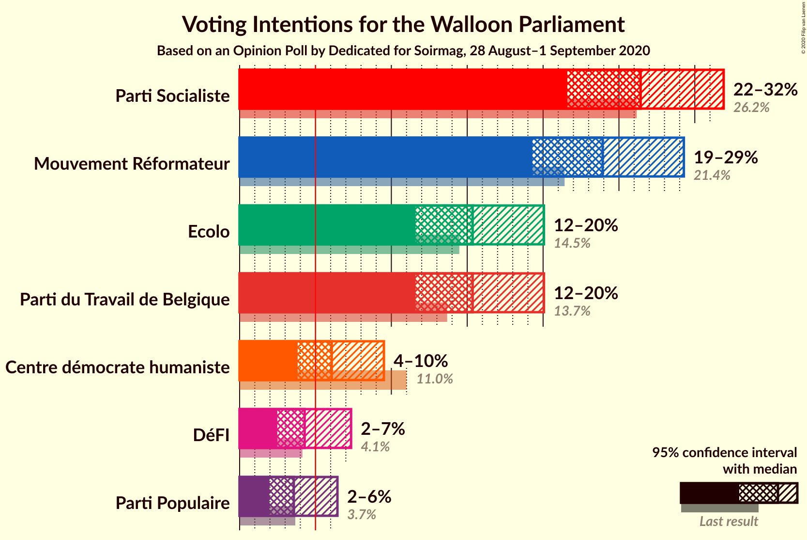

### Confidence Intervals

| Party | Last Result | Poll Result | 80% Confidence Interval | 90% Confidence Interval | 95% Confidence Interval | 99% Confidence Interval |
|:-----:|:-----------:|:-----------:|:-----------------------:|:-----------------------:|:-----------------------:|:-----------------------:|
| Parti Socialiste | 26.2% | 26.4% | 23.3–30.0% |22.4–31.0% |21.6–31.9% |20.1–33.7% |
| Mouvement Réformateur | 21.4% | 23.9% | 20.9–27.4% |20.0–28.4% |19.3–29.3% |17.9–31.0% |
| Ecolo | 14.5% | 15.4% | 12.9–18.4% |12.2–19.3% |11.6–20.1% |10.5–21.6% |
| Parti du Travail de Belgique | 13.7% | 15.4% | 12.9–18.4% |12.2–19.3% |11.6–20.1% |10.5–21.6% |
| Centre démocrate humaniste | 11.0% | 6.1% | 4.6–8.3% |4.2–8.9% |3.8–9.5% |3.2–10.7% |
| DéFI | 4.1% | 4.3% | 3.1–6.3% |2.7–6.8% |2.5–7.3% |2.0–8.4% |
| Parti Populaire | 3.7% | 3.6% | 2.5–5.4% |2.2–6.0% |2.0–6.4% |1.5–7.5% |

*Note:* The poll result column reflects the actual value used in the calculations. Published results may vary slightly, and in addition be rounded to fewer digits.

## Seats

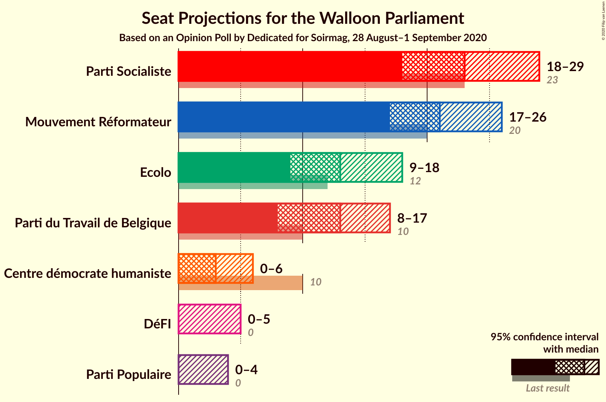

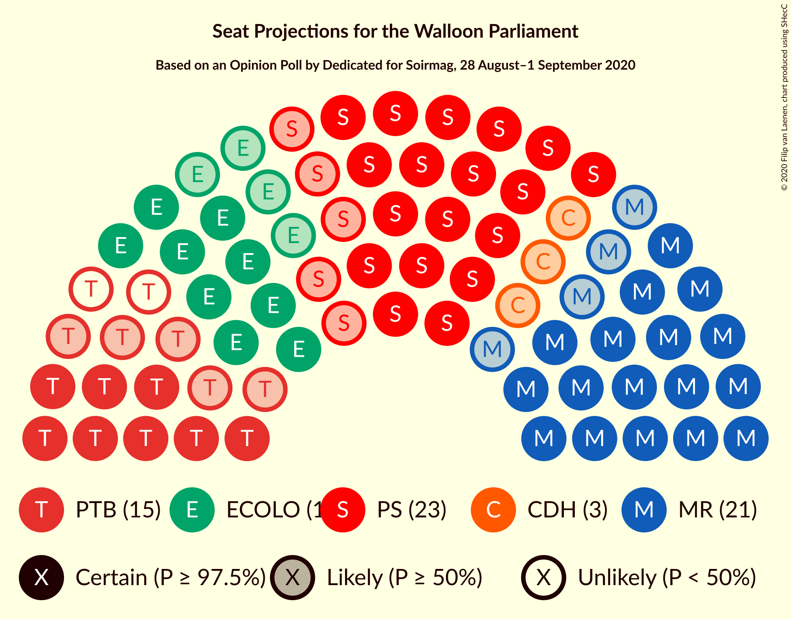

### Confidence Intervals

| Party | Last Result | Median | 80% Confidence Interval | 90% Confidence Interval | 95% Confidence Interval | 99% Confidence Interval |
|:-----:|:-----------:|:------:|:-----------------------:|:-----------------------:|:-----------------------:|:-----------------------:|
| <a href="#parti-socialiste">Parti Socialiste</a> | 23 | 23 | 20–28 |19–29 |18–29 |17–31 |
| <a href="#mouvement-réformateur">Mouvement Réformateur</a> | 20 | 21 | 18–25 |18–26 |17–26 |15–28 |
| <a href="#ecolo">Ecolo</a> | 12 | 13 | 11–15 |9–17 |9–18 |8–19 |
| <a href="#parti-du-travail-de-belgique">Parti du Travail de Belgique</a> | 10 | 13 | 10–16 |8–17 |8–17 |8–19 |
| <a href="#centre-démocrate-humaniste">Centre démocrate humaniste</a> | 10 | 3 | 0–5 |0–6 |0–6 |0–8 |
| <a href="#défi">DéFI</a> | 0 | 0 | 0–4 |0–5 |0–5 |0–6 |
| <a href="#parti-populaire">Parti Populaire</a> | 0 | 0 | 0–2 |0–3 |0–4 |0–5 |

### Parti Socialiste

*For a full overview of the results for this party, see the [Parti Socialiste](party-partisocialiste.html) page.*

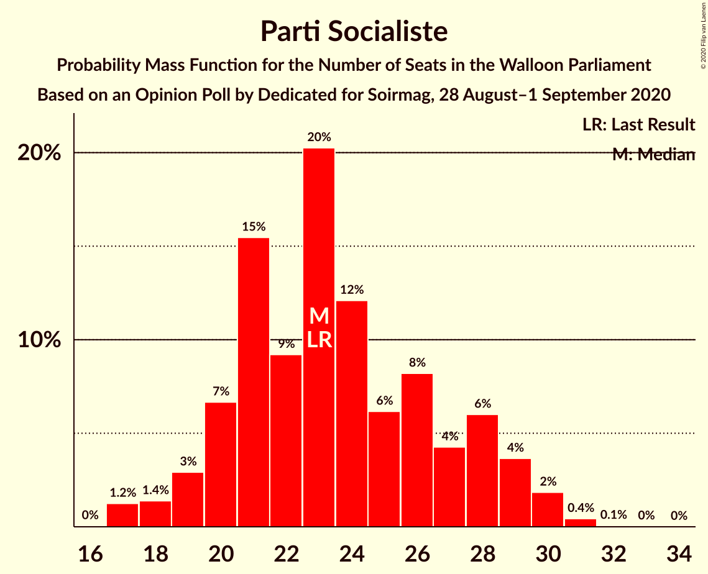

| Number of Seats | Probability | Accumulated | Special Marks |
|:---------------:|:-----------:|:-----------:|:-------------:|
| 16 | 0% | 100% |  |
| 17 | 1.2% | 99.9% |  |
| 18 | 1.4% | 98.7% |  |
| 19 | 3% | 97% |  |
| 20 | 7% | 94% |  |
| 21 | 15% | 88% |  |
| 22 | 9% | 72% |  |
| 23 | 20% | 63% | Last Result, Median |
| 24 | 12% | 43% |  |
| 25 | 6% | 31% |  |
| 26 | 8% | 25% |  |
| 27 | 4% | 16% |  |
| 28 | 6% | 12% |  |
| 29 | 4% | 6% |  |
| 30 | 2% | 2% |  |
| 31 | 0.4% | 0.6% |  |
| 32 | 0.1% | 0.1% |  |
| 33 | 0% | 0% |  |

### Mouvement Réformateur

*For a full overview of the results for this party, see the [Mouvement Réformateur](party-mouvementréformateur.html) page.*

| Number of Seats | Probability | Accumulated | Special Marks |
|:---------------:|:-----------:|:-----------:|:-------------:|
| 14 | 0.3% | 100% |  |
| 15 | 0.8% | 99.7% |  |
| 16 | 1.1% | 98.9% |  |
| 17 | 2% | 98% |  |
| 18 | 6% | 96% |  |
| 19 | 11% | 90% |  |
| 20 | 15% | 79% | Last Result |
| 21 | 25% | 64% | Median |
| 22 | 9% | 39% |  |
| 23 | 8% | 30% |  |
| 24 | 7% | 22% |  |
| 25 | 7% | 15% |  |
| 26 | 6% | 8% |  |
| 27 | 0.9% | 2% |  |
| 28 | 1.4% | 2% |  |
| 29 | 0.1% | 0.2% |  |
| 30 | 0% | 0.1% |  |
| 31 | 0% | 0.1% |  |
| 32 | 0% | 0% |  |

### Ecolo

*For a full overview of the results for this party, see the [Ecolo](party-ecolo.html) page.*

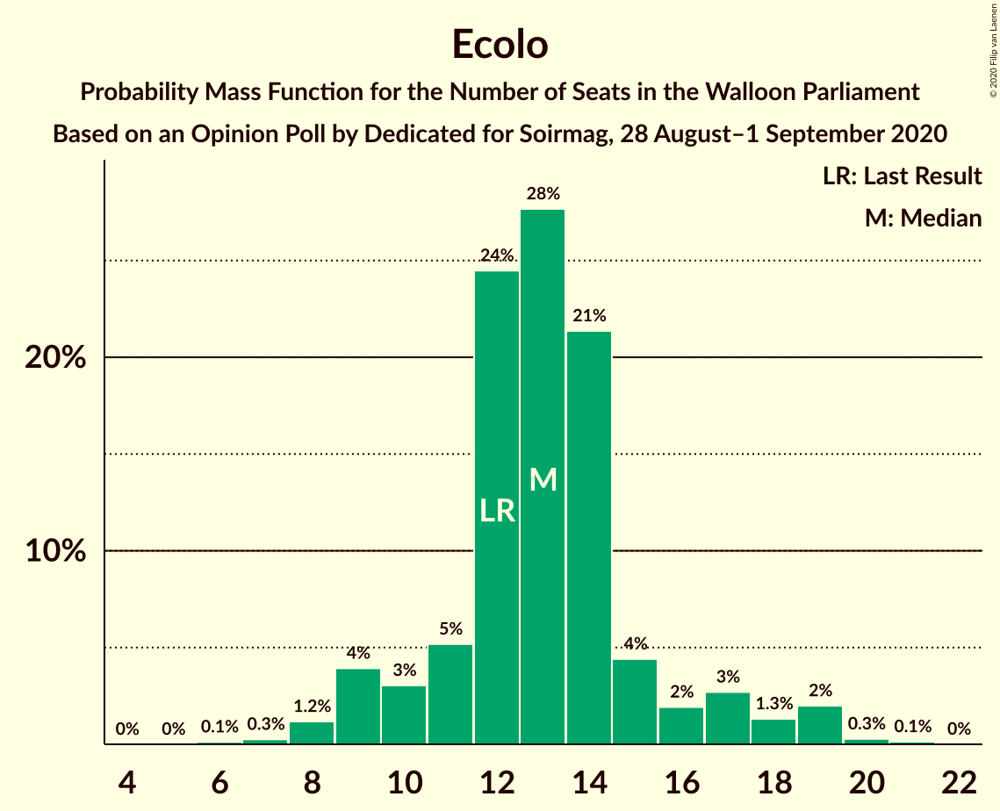

| Number of Seats | Probability | Accumulated | Special Marks |
|:---------------:|:-----------:|:-----------:|:-------------:|
| 6 | 0.1% | 100% |  |
| 7 | 0.3% | 99.9% |  |
| 8 | 1.2% | 99.6% |  |
| 9 | 4% | 98% |  |
| 10 | 3% | 95% |  |
| 11 | 5% | 91% |  |
| 12 | 24% | 86% | Last Result |
| 13 | 28% | 62% | Median |
| 14 | 21% | 34% |  |
| 15 | 4% | 13% |  |
| 16 | 2% | 8% |  |
| 17 | 3% | 6% |  |
| 18 | 1.3% | 4% |  |
| 19 | 2% | 2% |  |
| 20 | 0.3% | 0.4% |  |
| 21 | 0.1% | 0.1% |  |
| 22 | 0% | 0% |  |

### Parti du Travail de Belgique

*For a full overview of the results for this party, see the [Parti du Travail de Belgique](party-partidutravaildebelgique.html) page.*

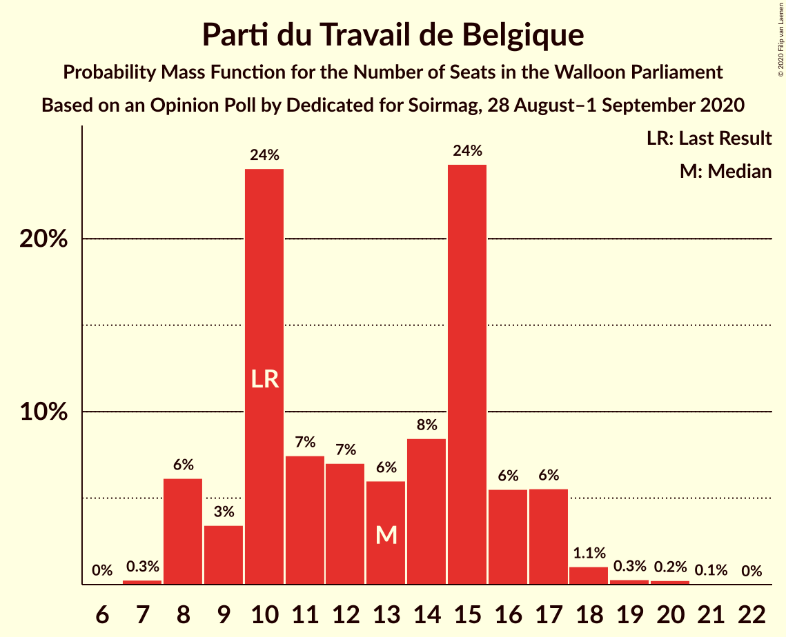

| Number of Seats | Probability | Accumulated | Special Marks |
|:---------------:|:-----------:|:-----------:|:-------------:|
| 7 | 0.3% | 100% |  |
| 8 | 6% | 99.7% |  |
| 9 | 3% | 94% |  |
| 10 | 24% | 90% | Last Result |
| 11 | 7% | 66% |  |
| 12 | 7% | 59% |  |
| 13 | 6% | 52% | Median |
| 14 | 8% | 46% |  |
| 15 | 24% | 37% |  |
| 16 | 6% | 13% |  |
| 17 | 6% | 7% |  |
| 18 | 1.1% | 2% |  |
| 19 | 0.3% | 0.6% |  |
| 20 | 0.2% | 0.3% |  |
| 21 | 0.1% | 0.1% |  |
| 22 | 0% | 0% |  |

### Centre démocrate humaniste

*For a full overview of the results for this party, see the [Centre démocrate humaniste](party-centredémocratehumaniste.html) page.*

| Number of Seats | Probability | Accumulated | Special Marks |
|:---------------:|:-----------:|:-----------:|:-------------:|
| 0 | 11% | 100% |  |
| 1 | 5% | 89% |  |
| 2 | 31% | 84% |  |
| 3 | 9% | 53% | Median |
| 4 | 23% | 44% |  |
| 5 | 12% | 21% |  |
| 6 | 7% | 10% |  |
| 7 | 1.3% | 2% |  |
| 8 | 0.6% | 1.0% |  |
| 9 | 0.2% | 0.4% |  |
| 10 | 0.1% | 0.2% | Last Result |
| 11 | 0% | 0% |  |

### DéFI

*For a full overview of the results for this party, see the [DéFI](party-défi.html) page.*

| Number of Seats | Probability | Accumulated | Special Marks |
|:---------------:|:-----------:|:-----------:|:-------------:|
| 0 | 77% | 100% | Last Result, Median |
| 1 | 4% | 23% |  |
| 2 | 2% | 19% |  |
| 3 | 3% | 17% |  |
| 4 | 9% | 14% |  |
| 5 | 4% | 5% |  |
| 6 | 1.4% | 1.4% |  |
| 7 | 0% | 0% |  |

### Parti Populaire

*For a full overview of the results for this party, see the [Parti Populaire](party-partipopulaire.html) page.*

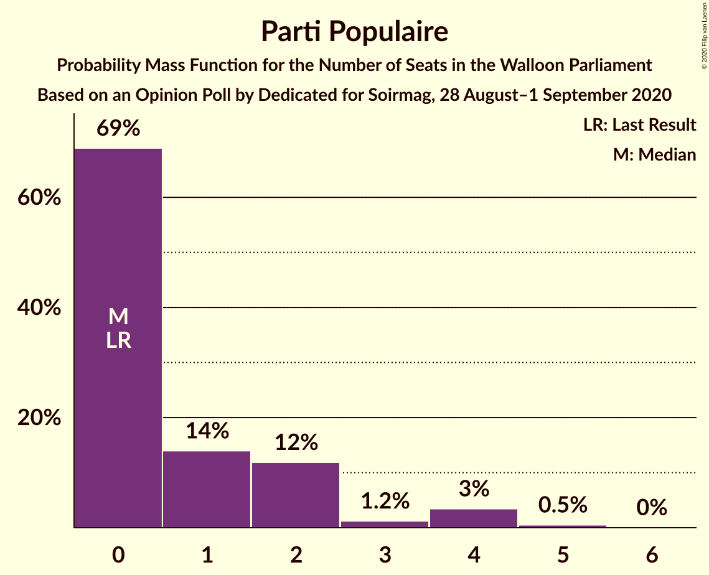

| Number of Seats | Probability | Accumulated | Special Marks |
|:---------------:|:-----------:|:-----------:|:-------------:|
| 0 | 69% | 100% | Last Result, Median |
| 1 | 14% | 31% |  |
| 2 | 12% | 17% |  |
| 3 | 1.2% | 5% |  |
| 4 | 3% | 4% |  |
| 5 | 0.5% | 0.6% |  |
| 6 | 0% | 0% |  |

## Coalitions

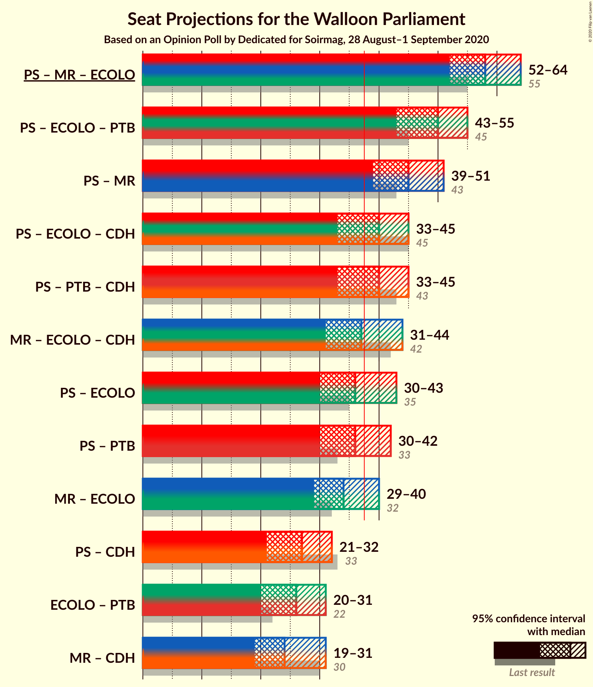

### Confidence Intervals

| Coalition | Last Result | Median | Majority? | 80% Confidence Interval | 90% Confidence Interval | 95% Confidence Interval | 99% Confidence Interval |
|:---------:|:-----------:|:------:|:---------:|:-----------------------:|:-----------------------:|:-----------------------:|:-----------------------:|
| Parti Socialiste – Mouvement Réformateur – Ecolo | 55 | 58 | 100% | 54–63 | 53–63 | 52–64 | 49–66 |
| Parti Socialiste – Ecolo – Parti du Travail de Belgique | 45 | 50 | 100% | 45–53 | 44–54 | 43–55 | 41–57 |
| Parti Socialiste – Mouvement Réformateur | 43 | 45 | 98.9% | 41–49 | 40–50 | 39–51 | 37–53 |
| Parti Socialiste – Ecolo – Centre démocrate humaniste | 45 | 40 | 73% | 35–44 | 34–45 | 33–45 | 31–47 |
| Parti Socialiste – Parti du Travail de Belgique – Centre démocrate humaniste | 43 | 40 | 71% | 35–43 | 34–44 | 33–45 | 31–47 |
| Mouvement Réformateur – Ecolo – Centre démocrate humaniste | 42 | 37 | 45% | 34–42 | 32–43 | 31–44 | 30–46 |
| Parti Socialiste – Ecolo | 35 | 36 | 36% | 33–41 | 31–42 | 30–43 | 29–44 |
| Parti Socialiste – Parti du Travail de Belgique | 33 | 36 | 38% | 32–40 | 31–41 | 30–42 | 28–44 |
| Mouvement Réformateur – Ecolo | 32 | 34 | 16% | 31–39 | 30–40 | 29–40 | 27–42 |
| Parti Socialiste – Centre démocrate humaniste | 33 | 27 | 0% | 23–31 | 22–32 | 21–32 | 19–34 |
| Ecolo – Parti du Travail de Belgique | 22 | 26 | 0% | 22–30 | 21–30 | 20–31 | 18–33 |
| Mouvement Réformateur – Centre démocrate humaniste | 30 | 24 | 0% | 21–29 | 20–30 | 19–31 | 17–32 |

### Parti Socialiste – Mouvement Réformateur – Ecolo

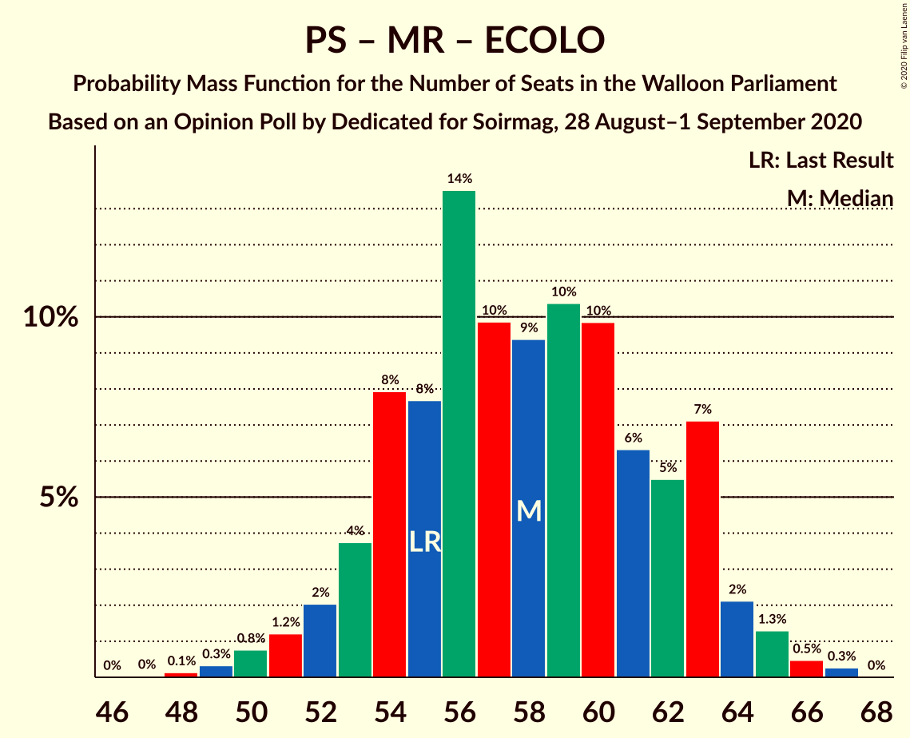

| Number of Seats | Probability | Accumulated | Special Marks |
|:---------------:|:-----------:|:-----------:|:-------------:|
| 47 | 0% | 100% |  |
| 48 | 0.1% | 99.9% |  |
| 49 | 0.3% | 99.8% |  |
| 50 | 0.8% | 99.5% |  |
| 51 | 1.2% | 98.7% |  |
| 52 | 2% | 98% |  |
| 53 | 4% | 95% |  |
| 54 | 8% | 92% |  |
| 55 | 8% | 84% | Last Result |
| 56 | 14% | 76% |  |
| 57 | 10% | 63% | Median |
| 58 | 9% | 53% |  |
| 59 | 10% | 43% |  |
| 60 | 10% | 33% |  |
| 61 | 6% | 23% |  |
| 62 | 5% | 17% |  |
| 63 | 7% | 11% |  |
| 64 | 2% | 4% |  |
| 65 | 1.3% | 2% |  |
| 66 | 0.5% | 0.8% |  |
| 67 | 0.3% | 0.3% |  |
| 68 | 0% | 0% |  |

### Parti Socialiste – Ecolo – Parti du Travail de Belgique

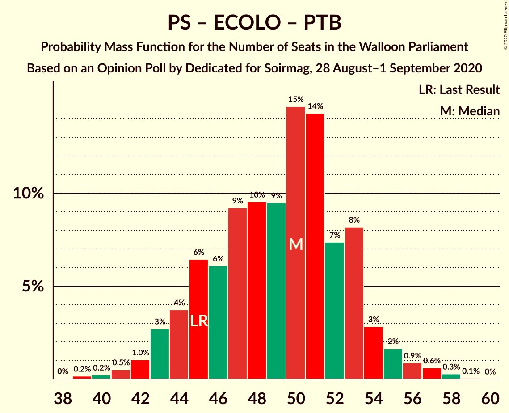

| Number of Seats | Probability | Accumulated | Special Marks |
|:---------------:|:-----------:|:-----------:|:-------------:|
| 38 | 0% | 100% | Majority |
| 39 | 0.2% | 99.9% |  |
| 40 | 0.2% | 99.8% |  |
| 41 | 0.5% | 99.6% |  |
| 42 | 1.0% | 99.1% |  |
| 43 | 3% | 98% |  |
| 44 | 4% | 95% |  |
| 45 | 6% | 92% | Last Result |
| 46 | 6% | 85% |  |
| 47 | 9% | 79% |  |
| 48 | 10% | 70% |  |
| 49 | 9% | 60% | Median |
| 50 | 15% | 51% |  |
| 51 | 14% | 36% |  |
| 52 | 7% | 22% |  |
| 53 | 8% | 14% |  |
| 54 | 3% | 6% |  |
| 55 | 2% | 3% |  |
| 56 | 0.9% | 2% |  |
| 57 | 0.6% | 0.9% |  |
| 58 | 0.3% | 0.3% |  |
| 59 | 0.1% | 0.1% |  |
| 60 | 0% | 0% |  |

### Parti Socialiste – Mouvement Réformateur

| Number of Seats | Probability | Accumulated | Special Marks |
|:---------------:|:-----------:|:-----------:|:-------------:|
| 35 | 0.1% | 100% |  |
| 36 | 0.2% | 99.8% |  |
| 37 | 0.7% | 99.6% |  |
| 38 | 1.3% | 98.9% | Majority |
| 39 | 2% | 98% |  |
| 40 | 3% | 95% |  |
| 41 | 7% | 92% |  |
| 42 | 10% | 85% |  |
| 43 | 11% | 75% | Last Result |
| 44 | 12% | 65% | Median |
| 45 | 10% | 53% |  |
| 46 | 10% | 42% |  |
| 47 | 9% | 32% |  |
| 48 | 7% | 24% |  |
| 49 | 7% | 17% |  |
| 50 | 5% | 10% |  |
| 51 | 3% | 4% |  |
| 52 | 1.1% | 2% |  |
| 53 | 0.4% | 0.7% |  |
| 54 | 0.2% | 0.3% |  |
| 55 | 0.1% | 0.1% |  |
| 56 | 0% | 0% |  |

### Parti Socialiste – Ecolo – Centre démocrate humaniste

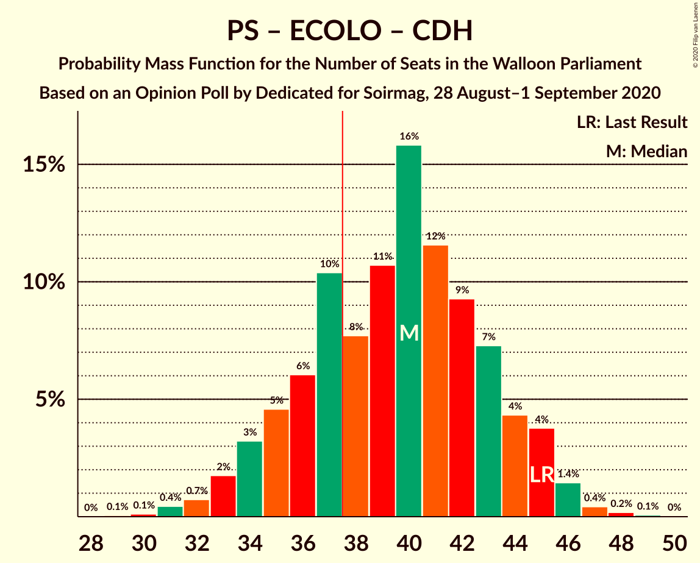

| Number of Seats | Probability | Accumulated | Special Marks |
|:---------------:|:-----------:|:-----------:|:-------------:|
| 29 | 0.1% | 100% |  |
| 30 | 0.1% | 99.9% |  |
| 31 | 0.4% | 99.8% |  |
| 32 | 0.7% | 99.4% |  |
| 33 | 2% | 98.6% |  |
| 34 | 3% | 97% |  |
| 35 | 5% | 94% |  |
| 36 | 6% | 89% |  |
| 37 | 10% | 83% |  |
| 38 | 8% | 73% | Majority |
| 39 | 11% | 65% | Median |
| 40 | 16% | 54% |  |
| 41 | 12% | 38% |  |
| 42 | 9% | 27% |  |
| 43 | 7% | 18% |  |
| 44 | 4% | 10% |  |
| 45 | 4% | 6% | Last Result |
| 46 | 1.4% | 2% |  |
| 47 | 0.4% | 0.7% |  |
| 48 | 0.2% | 0.3% |  |
| 49 | 0.1% | 0.1% |  |
| 50 | 0% | 0% |  |

### Parti Socialiste – Parti du Travail de Belgique – Centre démocrate humaniste

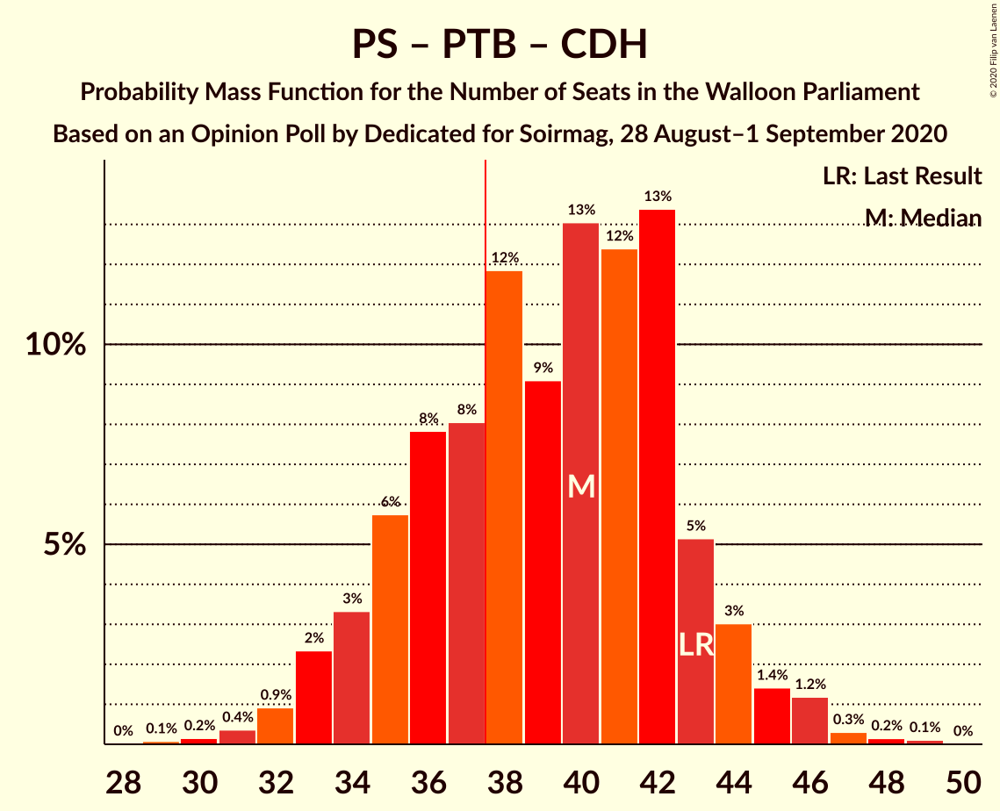

| Number of Seats | Probability | Accumulated | Special Marks |
|:---------------:|:-----------:|:-----------:|:-------------:|
| 29 | 0.1% | 100% |  |
| 30 | 0.2% | 99.9% |  |
| 31 | 0.4% | 99.7% |  |
| 32 | 0.9% | 99.4% |  |
| 33 | 2% | 98% |  |
| 34 | 3% | 96% |  |
| 35 | 6% | 93% |  |
| 36 | 8% | 87% |  |
| 37 | 8% | 79% |  |
| 38 | 12% | 71% | Majority |
| 39 | 9% | 59% | Median |
| 40 | 13% | 50% |  |
| 41 | 12% | 37% |  |
| 42 | 13% | 25% |  |
| 43 | 5% | 11% | Last Result |
| 44 | 3% | 6% |  |
| 45 | 1.4% | 3% |  |
| 46 | 1.2% | 2% |  |
| 47 | 0.3% | 0.6% |  |
| 48 | 0.2% | 0.3% |  |
| 49 | 0.1% | 0.1% |  |
| 50 | 0% | 0% |  |

### Mouvement Réformateur – Ecolo – Centre démocrate humaniste

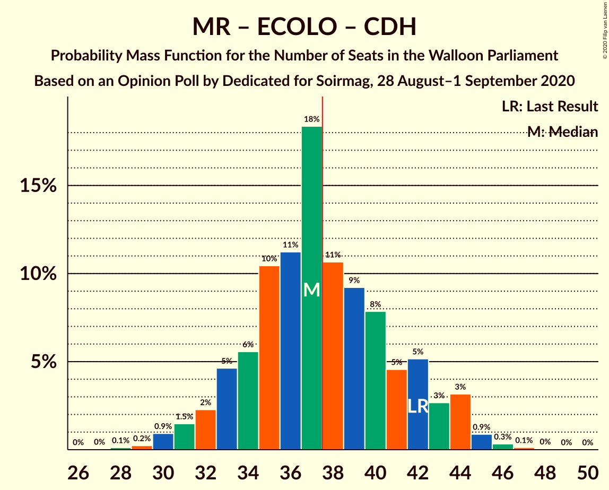

| Number of Seats | Probability | Accumulated | Special Marks |
|:---------------:|:-----------:|:-----------:|:-------------:|
| 27 | 0% | 100% |  |
| 28 | 0.1% | 99.9% |  |
| 29 | 0.2% | 99.8% |  |
| 30 | 0.9% | 99.6% |  |
| 31 | 1.5% | 98.7% |  |
| 32 | 2% | 97% |  |
| 33 | 5% | 95% |  |
| 34 | 6% | 90% |  |
| 35 | 10% | 85% |  |
| 36 | 11% | 74% |  |
| 37 | 18% | 63% | Median |
| 38 | 11% | 45% | Majority |
| 39 | 9% | 34% |  |
| 40 | 8% | 25% |  |
| 41 | 5% | 17% |  |
| 42 | 5% | 12% | Last Result |
| 43 | 3% | 7% |  |
| 44 | 3% | 5% |  |
| 45 | 0.9% | 1.4% |  |
| 46 | 0.3% | 0.5% |  |
| 47 | 0.1% | 0.2% |  |
| 48 | 0% | 0.1% |  |
| 49 | 0% | 0% |  |

### Parti Socialiste – Ecolo

| Number of Seats | Probability | Accumulated | Special Marks |
|:---------------:|:-----------:|:-----------:|:-------------:|
| 26 | 0% | 100% |  |
| 27 | 0.1% | 99.9% |  |
| 28 | 0.3% | 99.9% |  |
| 29 | 0.9% | 99.6% |  |
| 30 | 1.4% | 98.8% |  |
| 31 | 2% | 97% |  |
| 32 | 4% | 95% |  |
| 33 | 8% | 91% |  |
| 34 | 9% | 83% |  |
| 35 | 16% | 74% | Last Result |
| 36 | 13% | 58% | Median |
| 37 | 9% | 45% |  |
| 38 | 8% | 36% | Majority |
| 39 | 8% | 28% |  |
| 40 | 7% | 19% |  |
| 41 | 5% | 13% |  |
| 42 | 3% | 7% |  |
| 43 | 3% | 4% |  |
| 44 | 0.6% | 1.1% |  |
| 45 | 0.3% | 0.4% |  |
| 46 | 0.1% | 0.2% |  |
| 47 | 0.1% | 0.1% |  |
| 48 | 0% | 0% |  |

### Parti Socialiste – Parti du Travail de Belgique

| Number of Seats | Probability | Accumulated | Special Marks |
|:---------------:|:-----------:|:-----------:|:-------------:|
| 26 | 0% | 100% |  |
| 27 | 0.2% | 99.9% |  |
| 28 | 0.4% | 99.7% |  |
| 29 | 1.0% | 99.3% |  |
| 30 | 2% | 98% |  |
| 31 | 6% | 96% |  |
| 32 | 4% | 90% |  |
| 33 | 8% | 86% | Last Result |
| 34 | 8% | 78% |  |
| 35 | 10% | 70% |  |
| 36 | 12% | 61% | Median |
| 37 | 10% | 48% |  |
| 38 | 17% | 38% | Majority |
| 39 | 8% | 21% |  |
| 40 | 5% | 13% |  |
| 41 | 3% | 7% |  |
| 42 | 2% | 4% |  |
| 43 | 0.7% | 2% |  |
| 44 | 0.6% | 1.1% |  |
| 45 | 0.3% | 0.4% |  |
| 46 | 0.1% | 0.1% |  |
| 47 | 0% | 0% |  |

### Mouvement Réformateur – Ecolo

| Number of Seats | Probability | Accumulated | Special Marks |
|:---------------:|:-----------:|:-----------:|:-------------:|
| 25 | 0.1% | 100% |  |
| 26 | 0.3% | 99.9% |  |
| 27 | 0.5% | 99.6% |  |
| 28 | 1.1% | 99.2% |  |
| 29 | 2% | 98% |  |
| 30 | 4% | 96% |  |
| 31 | 6% | 92% |  |
| 32 | 9% | 86% | Last Result |
| 33 | 19% | 77% |  |
| 34 | 13% | 57% | Median |
| 35 | 11% | 44% |  |
| 36 | 9% | 33% |  |
| 37 | 8% | 24% |  |
| 38 | 5% | 16% | Majority |
| 39 | 5% | 11% |  |
| 40 | 3% | 6% |  |
| 41 | 1.3% | 2% |  |
| 42 | 0.7% | 1.1% |  |
| 43 | 0.2% | 0.4% |  |
| 44 | 0.1% | 0.2% |  |
| 45 | 0% | 0% |  |

### Parti Socialiste – Centre démocrate humaniste

| Number of Seats | Probability | Accumulated | Special Marks |
|:---------------:|:-----------:|:-----------:|:-------------:|
| 17 | 0.1% | 100% |  |
| 18 | 0.1% | 99.9% |  |
| 19 | 0.4% | 99.8% |  |
| 20 | 1.4% | 99.4% |  |
| 21 | 3% | 98% |  |
| 22 | 4% | 95% |  |
| 23 | 7% | 92% |  |
| 24 | 9% | 85% |  |
| 25 | 12% | 75% |  |
| 26 | 13% | 63% | Median |
| 27 | 13% | 50% |  |
| 28 | 12% | 37% |  |
| 29 | 8% | 25% |  |
| 30 | 6% | 17% |  |
| 31 | 4% | 10% |  |
| 32 | 4% | 6% |  |
| 33 | 1.4% | 2% | Last Result |
| 34 | 0.5% | 0.8% |  |
| 35 | 0.2% | 0.2% |  |
| 36 | 0.1% | 0.1% |  |
| 37 | 0% | 0% |  |

### Ecolo – Parti du Travail de Belgique

| Number of Seats | Probability | Accumulated | Special Marks |
|:---------------:|:-----------:|:-----------:|:-------------:|
| 16 | 0.1% | 100% |  |
| 17 | 0.1% | 99.9% |  |
| 18 | 0.4% | 99.8% |  |
| 19 | 0.7% | 99.4% |  |
| 20 | 2% | 98.7% |  |
| 21 | 4% | 96% |  |
| 22 | 10% | 93% | Last Result |
| 23 | 11% | 82% |  |
| 24 | 9% | 71% |  |
| 25 | 11% | 62% |  |
| 26 | 8% | 51% | Median |
| 27 | 12% | 42% |  |
| 28 | 10% | 30% |  |
| 29 | 9% | 20% |  |
| 30 | 6% | 11% |  |
| 31 | 2% | 5% |  |
| 32 | 1.3% | 2% |  |
| 33 | 0.7% | 1.1% |  |
| 34 | 0.3% | 0.4% |  |
| 35 | 0.1% | 0.1% |  |
| 36 | 0% | 0% |  |

### Mouvement Réformateur – Centre démocrate humaniste

| Number of Seats | Probability | Accumulated | Special Marks |
|:---------------:|:-----------:|:-----------:|:-------------:|
| 16 | 0.2% | 100% |  |
| 17 | 0.4% | 99.8% |  |
| 18 | 2% | 99.4% |  |
| 19 | 2% | 98% |  |
| 20 | 3% | 96% |  |
| 21 | 6% | 93% |  |
| 22 | 11% | 86% |  |
| 23 | 16% | 75% |  |
| 24 | 13% | 59% | Median |
| 25 | 13% | 46% |  |
| 26 | 9% | 33% |  |
| 27 | 7% | 24% |  |
| 28 | 6% | 17% |  |
| 29 | 3% | 11% |  |
| 30 | 4% | 7% | Last Result |
| 31 | 1.4% | 3% |  |
| 32 | 0.9% | 1.3% |  |
| 33 | 0.2% | 0.3% |  |
| 34 | 0.1% | 0.1% |  |
| 35 | 0% | 0% |  |

## Technical Information

### Opinion Poll

+ **Polling firm:** Dedicated
+ **Commissioner(s):** Soirmag
+ **Fieldwork period:** 28 August–1 September 2020

### Calculations

+ **Sample size:** 280
+ **Simulations done:** 1,048,576
+ **Error estimate:** 2.13%

