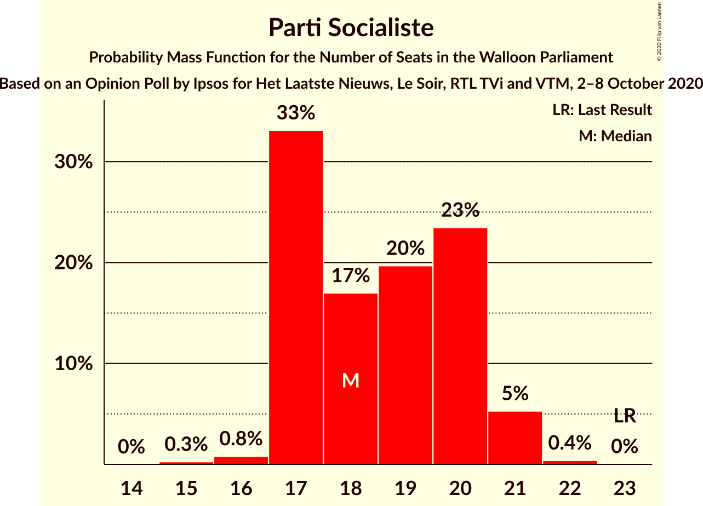
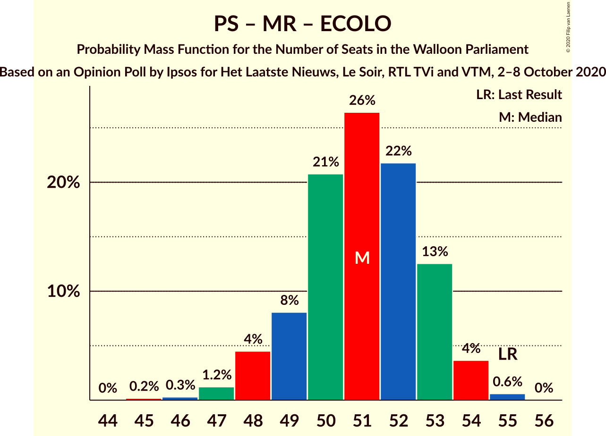
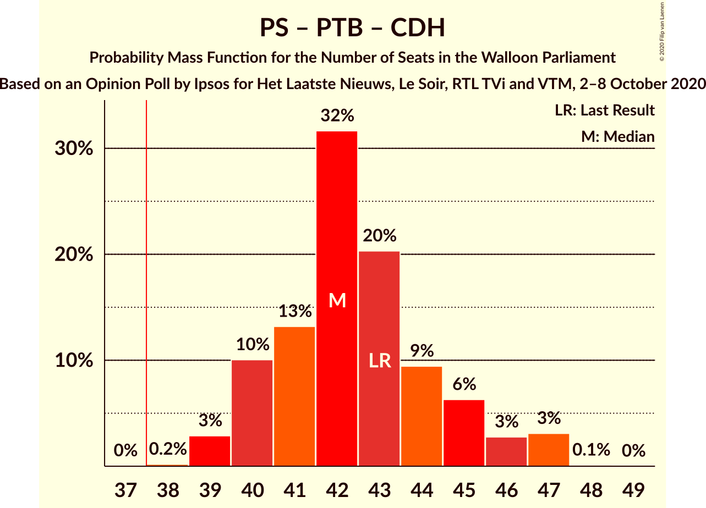
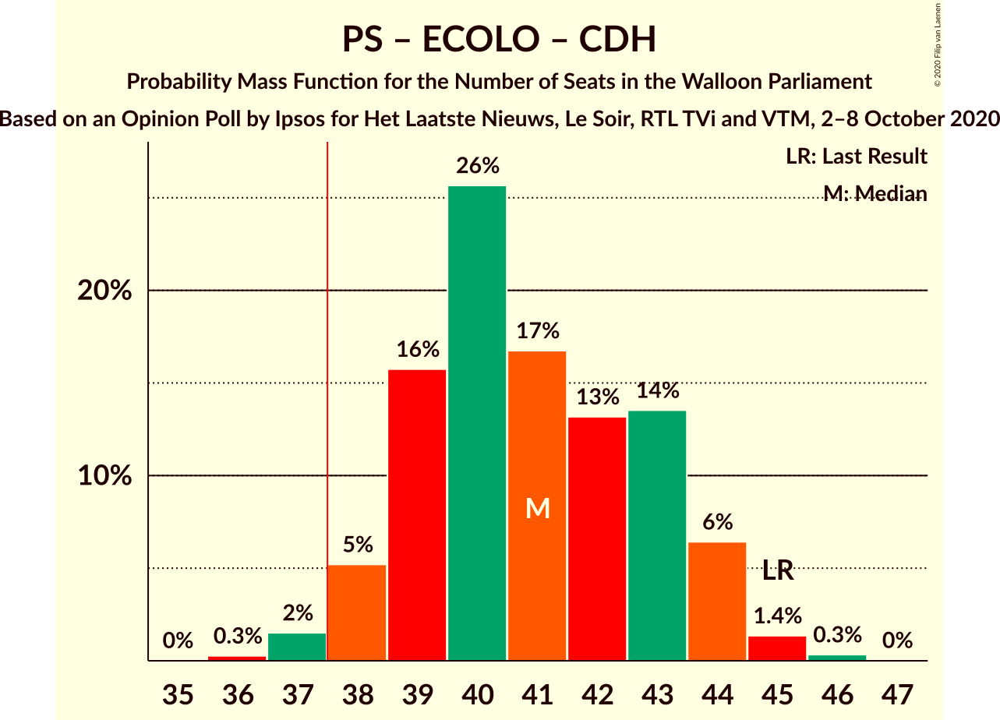

# Opinion Poll by Ipsos for Het Laatste Nieuws, Le Soir, RTL TVi and VTM, 2–8 October 2020

<a href="#voting-intentions">Voting Intentions</a> | <a href="#seats">Seats</a> | <a href="#coalitions">Coalitions</a> | <a href="#technical-information">Technical Information</a>

## Voting Intentions

### Confidence Intervals

| Party | Last Result | Poll Result | 80% Confidence Interval | 90% Confidence Interval | 95% Confidence Interval | 99% Confidence Interval |
|:-----:|:-----------:|:-----------:|:-----------------------:|:-----------------------:|:-----------------------:|:-----------------------:|
| Parti Socialiste | 26.2% | 21.1% | 19.5–22.8% |19.0–23.3% |18.7–23.7% |17.9–24.6% |
| Mouvement Réformateur | 21.4% | 19.2% | 17.6–20.9% |17.2–21.3% |16.9–21.7% |16.2–22.6% |
| Parti du Travail de Belgique | 13.7% | 18.9% | 17.4–20.5% |16.9–21.0% |16.6–21.4% |15.9–22.3% |
| Ecolo | 14.5% | 17.8% | 16.3–19.4% |15.9–19.9% |15.5–20.3% |14.8–21.1% |
| Centre démocrate humaniste | 11.0% | 9.7% | 8.6–11.0% |8.3–11.4% |8.0–11.7% |7.5–12.3% |
| DéFI | 4.1% | 3.8% | 3.1–4.7% |2.9–5.0% |2.8–5.2% |2.5–5.6% |

*Note:* The poll result column reflects the actual value used in the calculations. Published results may vary slightly, and in addition be rounded to fewer digits.

## Seats

### Confidence Intervals

| Party | Last Result | Median | 80% Confidence Interval | 90% Confidence Interval | 95% Confidence Interval | 99% Confidence Interval |
|:-----:|:-----------:|:------:|:-----------------------:|:-----------------------:|:-----------------------:|:-----------------------:|
| <a href="#parti-socialiste">Parti Socialiste</a> | 23 | 18 | 17–20 |17–21 |17–21 |16–21 |
| <a href="#mouvement-réformateur">Mouvement Réformateur</a> | 20 | 18 | 15–19 |14–19 |14–20 |14–21 |
| <a href="#parti-du-travail-de-belgique">Parti du Travail de Belgique</a> | 10 | 17 | 15–18 |15–19 |15–19 |14–20 |
| <a href="#ecolo">Ecolo</a> | 12 | 15 | 14–18 |13–18 |13–18 |13–19 |
| <a href="#centre-démocrate-humaniste">Centre démocrate humaniste</a> | 10 | 7 | 6–9 |6–9 |5–10 |5–11 |
| <a href="#défi">DéFI</a> | 0 | 0 | 0 |0 |0 |0–3 |

### Parti Socialiste

*For a full overview of the results for this party, see the [Parti Socialiste](party-partisocialiste.html) page.*

| Number of Seats | Probability | Accumulated | Special Marks |
|:---------------:|:-----------:|:-----------:|:-------------:|
| 15 | 0.2% | 100% |  |
| 16 | 1.0% | 99.8% |  |
| 17 | 34% | 98.8% |  |
| 18 | 18% | 65% | Median |
| 19 | 16% | 47% |  |
| 20 | 25% | 31% |  |
| 21 | 5% | 6% |  |
| 22 | 0.4% | 0.5% |  |
| 23 | 0.1% | 0.1% | Last Result |
| 24 | 0% | 0% |  |

### Mouvement Réformateur

*For a full overview of the results for this party, see the [Mouvement Réformateur](party-mouvementréformateur.html) page.*

| Number of Seats | Probability | Accumulated | Special Marks |
|:---------------:|:-----------:|:-----------:|:-------------:|
| 13 | 0.1% | 100% |  |
| 14 | 8% | 99.9% |  |
| 15 | 16% | 91% |  |
| 16 | 4% | 76% |  |
| 17 | 13% | 71% |  |
| 18 | 40% | 58% | Median |
| 19 | 15% | 18% |  |
| 20 | 2% | 3% | Last Result |
| 21 | 1.0% | 1.0% |  |
| 22 | 0% | 0% |  |

### Parti du Travail de Belgique

*For a full overview of the results for this party, see the [Parti du Travail de Belgique](party-partidutravaildebelgique.html) page.*

| Number of Seats | Probability | Accumulated | Special Marks |
|:---------------:|:-----------:|:-----------:|:-------------:|
| 10 | 0% | 100% | Last Result |
| 11 | 0% | 100% |  |
| 12 | 0% | 100% |  |
| 13 | 0.1% | 99.9% |  |
| 14 | 2% | 99.9% |  |
| 15 | 10% | 98% |  |
| 16 | 21% | 89% |  |
| 17 | 47% | 67% | Median |
| 18 | 15% | 20% |  |
| 19 | 4% | 6% |  |
| 20 | 1.2% | 1.4% |  |
| 21 | 0.2% | 0.2% |  |
| 22 | 0% | 0% |  |

### Ecolo

*For a full overview of the results for this party, see the [Ecolo](party-ecolo.html) page.*

| Number of Seats | Probability | Accumulated | Special Marks |
|:---------------:|:-----------:|:-----------:|:-------------:|
| 12 | 0.3% | 100% | Last Result |
| 13 | 7% | 99.7% |  |
| 14 | 35% | 93% |  |
| 15 | 20% | 57% | Median |
| 16 | 17% | 37% |  |
| 17 | 9% | 20% |  |
| 18 | 9% | 11% |  |
| 19 | 1.4% | 2% |  |
| 20 | 0.1% | 0.1% |  |
| 21 | 0% | 0% |  |

### Centre démocrate humaniste

*For a full overview of the results for this party, see the [Centre démocrate humaniste](party-centredémocratehumaniste.html) page.*

| Number of Seats | Probability | Accumulated | Special Marks |
|:---------------:|:-----------:|:-----------:|:-------------:|
| 4 | 0.3% | 100% |  |
| 5 | 4% | 99.7% |  |
| 6 | 19% | 96% |  |
| 7 | 43% | 77% | Median |
| 8 | 18% | 34% |  |
| 9 | 11% | 16% |  |
| 10 | 4% | 5% | Last Result |
| 11 | 1.3% | 1.3% |  |
| 12 | 0% | 0% |  |

### DéFI

*For a full overview of the results for this party, see the [DéFI](party-défi.html) page.*

| Number of Seats | Probability | Accumulated | Special Marks |
|:---------------:|:-----------:|:-----------:|:-------------:|
| 0 | 98% | 100% | Last Result, Median |
| 1 | 0.8% | 2% |  |
| 2 | 0.2% | 0.9% |  |
| 3 | 0.3% | 0.7% |  |
| 4 | 0.5% | 0.5% |  |
| 5 | 0% | 0% |  |

## Coalitions

### Confidence Intervals

| Coalition | Last Result | Median | Majority? | 80% Confidence Interval | 90% Confidence Interval | 95% Confidence Interval | 99% Confidence Interval |
|:---------:|:-----------:|:------:|:---------:|:-----------------------:|:-----------------------:|:-----------------------:|:-----------------------:|
| Parti Socialiste – Parti du Travail de Belgique – Ecolo | 45 | 50 | 100% | 49–53 | 48–53 | 47–54 | 47–55 |
| Parti Socialiste – Mouvement Réformateur – Ecolo | 55 | 51 | 100% | 49–53 | 48–53 | 48–53 | 47–55 |
| Parti Socialiste – Parti du Travail de Belgique – Centre démocrate humaniste | 43 | 42 | 100% | 40–45 | 40–46 | 39–47 | 39–47 |
| Parti Socialiste – Ecolo – Centre démocrate humaniste | 45 | 41 | 98% | 39–43 | 38–44 | 38–44 | 37–45 |
| Mouvement Réformateur – Ecolo – Centre démocrate humaniste | 42 | 40 | 90% | 38–41 | 37–42 | 37–42 | 36–44 |
| Parti Socialiste – Mouvement Réformateur | 43 | 35 | 17% | 34–38 | 33–39 | 32–39 | 31–40 |
| Parti Socialiste – Parti du Travail de Belgique | 33 | 35 | 9% | 34–37 | 33–38 | 33–38 | 31–39 |
| Parti Socialiste – Ecolo | 35 | 34 | 2% | 31–36 | 31–36 | 31–37 | 30–38 |
| Parti du Travail de Belgique – Ecolo | 22 | 32 | 0.1% | 30–34 | 30–35 | 29–36 | 28–37 |
| Mouvement Réformateur – Ecolo | 32 | 33 | 0% | 30–34 | 29–35 | 28–36 | 28–36 |
| Parti Socialiste – Centre démocrate humaniste | 33 | 26 | 0% | 24–28 | 23–29 | 23–30 | 22–30 |
| Mouvement Réformateur – Centre démocrate humaniste | 30 | 25 | 0% | 22–26 | 22–27 | 21–28 | 20–28 |

### Parti Socialiste – Parti du Travail de Belgique – Ecolo

| Number of Seats | Probability | Accumulated | Special Marks |
|:---------------:|:-----------:|:-----------:|:-------------:|
| 45 | 0% | 100% | Last Result |
| 46 | 0.3% | 100% |  |
| 47 | 3% | 99.6% |  |
| 48 | 6% | 97% |  |
| 49 | 21% | 91% |  |
| 50 | 24% | 70% | Median |
| 51 | 20% | 46% |  |
| 52 | 10% | 26% |  |
| 53 | 13% | 16% |  |
| 54 | 2% | 3% |  |
| 55 | 0.5% | 0.6% |  |
| 56 | 0.1% | 0.1% |  |
| 57 | 0% | 0% |  |

### Parti Socialiste – Mouvement Réformateur – Ecolo

| Number of Seats | Probability | Accumulated | Special Marks |
|:---------------:|:-----------:|:-----------:|:-------------:|
| 45 | 0.1% | 100% |  |
| 46 | 0.4% | 99.9% |  |
| 47 | 2% | 99.5% |  |
| 48 | 5% | 98% |  |
| 49 | 10% | 93% |  |
| 50 | 21% | 83% |  |
| 51 | 30% | 61% | Median |
| 52 | 15% | 32% |  |
| 53 | 14% | 16% |  |
| 54 | 2% | 2% |  |
| 55 | 0.7% | 0.7% | Last Result |
| 56 | 0% | 0% |  |

### Parti Socialiste – Parti du Travail de Belgique – Centre démocrate humaniste

| Number of Seats | Probability | Accumulated | Special Marks |
|:---------------:|:-----------:|:-----------:|:-------------:|
| 38 | 0.1% | 100% | Majority |
| 39 | 3% | 99.9% |  |
| 40 | 7% | 97% |  |
| 41 | 13% | 90% |  |
| 42 | 30% | 77% | Median |
| 43 | 26% | 47% | Last Result |
| 44 | 7% | 22% |  |
| 45 | 8% | 14% |  |
| 46 | 2% | 7% |  |
| 47 | 4% | 4% |  |
| 48 | 0.2% | 0.2% |  |
| 49 | 0% | 0% |  |

### Parti Socialiste – Ecolo – Centre démocrate humaniste

| Number of Seats | Probability | Accumulated | Special Marks |
|:---------------:|:-----------:|:-----------:|:-------------:|
| 36 | 0.2% | 100% |  |
| 37 | 1.4% | 99.8% |  |
| 38 | 5% | 98% | Majority |
| 39 | 13% | 93% |  |
| 40 | 26% | 80% | Median |
| 41 | 19% | 54% |  |
| 42 | 10% | 35% |  |
| 43 | 16% | 25% |  |
| 44 | 7% | 9% |  |
| 45 | 2% | 2% | Last Result |
| 46 | 0.5% | 0.5% |  |
| 47 | 0% | 0% |  |

### Mouvement Réformateur – Ecolo – Centre démocrate humaniste

| Number of Seats | Probability | Accumulated | Special Marks |
|:---------------:|:-----------:|:-----------:|:-------------:|
| 35 | 0.1% | 100% |  |
| 36 | 1.1% | 99.9% |  |
| 37 | 9% | 98.8% |  |
| 38 | 13% | 90% | Majority |
| 39 | 16% | 77% |  |
| 40 | 31% | 61% | Median |
| 41 | 21% | 30% |  |
| 42 | 7% | 9% | Last Result |
| 43 | 0.7% | 1.5% |  |
| 44 | 0.7% | 0.8% |  |
| 45 | 0% | 0% |  |

### Parti Socialiste – Mouvement Réformateur

| Number of Seats | Probability | Accumulated | Special Marks |
|:---------------:|:-----------:|:-----------:|:-------------:|
| 30 | 0.1% | 100% |  |
| 31 | 2% | 99.9% |  |
| 32 | 3% | 98% |  |
| 33 | 4% | 95% |  |
| 34 | 11% | 91% |  |
| 35 | 31% | 80% |  |
| 36 | 21% | 49% | Median |
| 37 | 11% | 28% |  |
| 38 | 10% | 17% | Majority |
| 39 | 5% | 7% |  |
| 40 | 1.1% | 1.3% |  |
| 41 | 0.2% | 0.2% |  |
| 42 | 0% | 0% |  |
| 43 | 0% | 0% | Last Result |

### Parti Socialiste – Parti du Travail de Belgique

| Number of Seats | Probability | Accumulated | Special Marks |
|:---------------:|:-----------:|:-----------:|:-------------:|
| 31 | 0.7% | 100% |  |
| 32 | 0.8% | 99.2% |  |
| 33 | 8% | 98% | Last Result |
| 34 | 21% | 91% |  |
| 35 | 31% | 70% | Median |
| 36 | 16% | 38% |  |
| 37 | 13% | 22% |  |
| 38 | 8% | 9% | Majority |
| 39 | 0.9% | 0.9% |  |
| 40 | 0% | 0.1% |  |
| 41 | 0% | 0% |  |

### Parti Socialiste – Ecolo

| Number of Seats | Probability | Accumulated | Special Marks |
|:---------------:|:-----------:|:-----------:|:-------------:|
| 29 | 0.1% | 100% |  |
| 30 | 1.2% | 99.9% |  |
| 31 | 11% | 98.7% |  |
| 32 | 14% | 88% |  |
| 33 | 21% | 74% | Median |
| 34 | 19% | 52% |  |
| 35 | 18% | 33% | Last Result |
| 36 | 11% | 15% |  |
| 37 | 3% | 4% |  |
| 38 | 1.4% | 2% | Majority |
| 39 | 0.2% | 0.3% |  |
| 40 | 0.1% | 0.1% |  |
| 41 | 0% | 0% |  |

### Parti du Travail de Belgique – Ecolo

| Number of Seats | Probability | Accumulated | Special Marks |
|:---------------:|:-----------:|:-----------:|:-------------:|
| 22 | 0% | 100% | Last Result |
| 23 | 0% | 100% |  |
| 24 | 0% | 100% |  |
| 25 | 0% | 100% |  |
| 26 | 0% | 100% |  |
| 27 | 0.1% | 100% |  |
| 28 | 1.2% | 99.9% |  |
| 29 | 3% | 98.7% |  |
| 30 | 17% | 96% |  |
| 31 | 21% | 79% |  |
| 32 | 18% | 58% | Median |
| 33 | 20% | 40% |  |
| 34 | 13% | 20% |  |
| 35 | 4% | 7% |  |
| 36 | 2% | 3% |  |
| 37 | 0.5% | 0.6% |  |
| 38 | 0% | 0.1% | Majority |
| 39 | 0% | 0% |  |

### Mouvement Réformateur – Ecolo

| Number of Seats | Probability | Accumulated | Special Marks |
|:---------------:|:-----------:|:-----------:|:-------------:|
| 27 | 0.2% | 100% |  |
| 28 | 4% | 99.8% |  |
| 29 | 3% | 96% |  |
| 30 | 7% | 93% |  |
| 31 | 8% | 85% |  |
| 32 | 26% | 78% | Last Result |
| 33 | 29% | 51% | Median |
| 34 | 13% | 22% |  |
| 35 | 7% | 10% |  |
| 36 | 3% | 3% |  |
| 37 | 0.1% | 0.1% |  |
| 38 | 0% | 0% | Majority |

### Parti Socialiste – Centre démocrate humaniste

| Number of Seats | Probability | Accumulated | Special Marks |
|:---------------:|:-----------:|:-----------:|:-------------:|
| 21 | 0.2% | 100% |  |
| 22 | 1.4% | 99.8% |  |
| 23 | 6% | 98% |  |
| 24 | 16% | 92% |  |
| 25 | 20% | 76% | Median |
| 26 | 29% | 56% |  |
| 27 | 12% | 27% |  |
| 28 | 6% | 15% |  |
| 29 | 5% | 8% |  |
| 30 | 2% | 3% |  |
| 31 | 0.4% | 0.5% |  |
| 32 | 0% | 0% |  |
| 33 | 0% | 0% | Last Result |

### Mouvement Réformateur – Centre démocrate humaniste

| Number of Seats | Probability | Accumulated | Special Marks |
|:---------------:|:-----------:|:-----------:|:-------------:|
| 19 | 0.1% | 100% |  |
| 20 | 0.5% | 99.9% |  |
| 21 | 3% | 99.4% |  |
| 22 | 13% | 97% |  |
| 23 | 10% | 84% |  |
| 24 | 21% | 74% |  |
| 25 | 24% | 53% | Median |
| 26 | 21% | 29% |  |
| 27 | 5% | 8% |  |
| 28 | 3% | 3% |  |
| 29 | 0.3% | 0.4% |  |
| 30 | 0% | 0% | Last Result |

## Technical Information

### Opinion Poll

+ **Polling firm:** Ipsos
+ **Commissioner(s):** Het Laatste Nieuws, Le Soir, RTL TVi and VTM
+ **Fieldwork period:** 2–8 October 2020

### Calculations

+ **Sample size:** 1001
+ **Simulations done:** 131,072
+ **Error estimate:** 0.82%

