# Opinion Poll by Ipsos for Het Laatste Nieuws, Le Soir, RTL TVi and VTM, 2–8 December 2020

<a href="#voting-intentions">Voting Intentions</a> | <a href="#seats">Seats</a> | <a href="#coalitions">Coalitions</a> | <a href="#technical-information">Technical Information</a>

## Voting Intentions

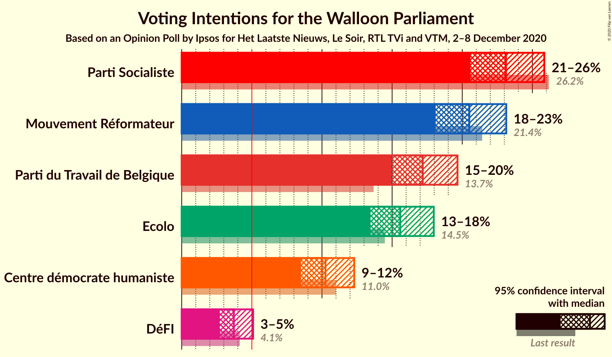

### Confidence Intervals

| Party | Last Result | Poll Result | 80% Confidence Interval | 90% Confidence Interval | 95% Confidence Interval | 99% Confidence Interval |
|:-----:|:-----------:|:-----------:|:-----------------------:|:-----------------------:|:-----------------------:|:-----------------------:|
| Parti Socialiste | 26.2% | 23.1% | 21.5–24.9% |21.0–25.4% |20.6–25.8% |19.8–26.7% |
| Mouvement Réformateur | 21.4% | 20.5% | 18.9–22.2% |18.5–22.7% |18.1–23.1% |17.4–24.0% |
| Parti du Travail de Belgique | 13.7% | 17.2% | 15.7–18.8% |15.3–19.3% |15.0–19.7% |14.3–20.5% |
| Ecolo | 14.5% | 15.6% | 14.2–17.1% |13.8–17.6% |13.5–18.0% |12.8–18.7% |
| Centre démocrate humaniste | 11.0% | 10.3% | 9.1–11.6% |8.8–12.0% |8.5–12.3% |8.0–13.0% |
| DéFI | 4.1% | 3.7% | 3.0–4.6% |2.9–4.9% |2.7–5.1% |2.4–5.5% |

*Note:* The poll result column reflects the actual value used in the calculations. Published results may vary slightly, and in addition be rounded to fewer digits.

## Seats

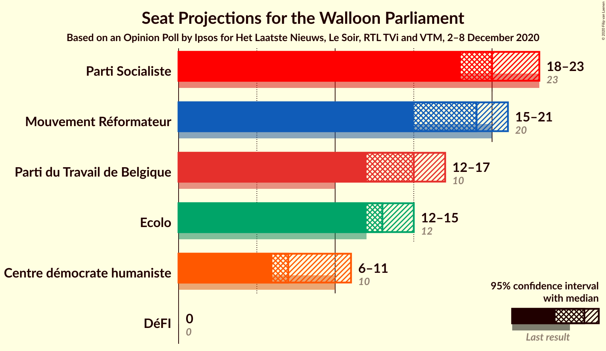

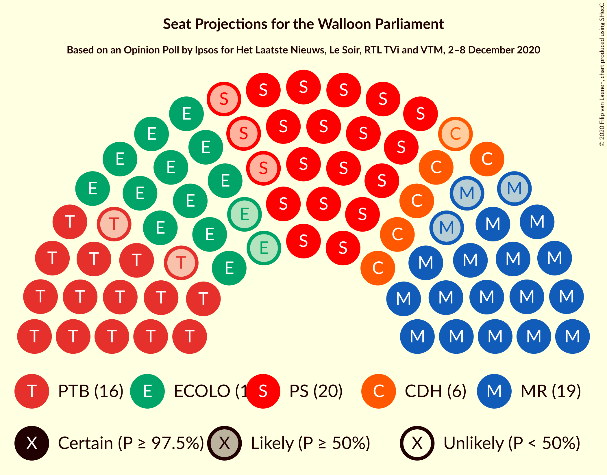

### Confidence Intervals

| Party | Last Result | Median | 80% Confidence Interval | 90% Confidence Interval | 95% Confidence Interval | 99% Confidence Interval |
|:-----:|:-----------:|:------:|:-----------------------:|:-----------------------:|:-----------------------:|:-----------------------:|
| <a href="#parti-socialiste">Parti Socialiste</a> | 23 | 20 | 18–22 |18–22 |17–22 |17–23 |
| <a href="#mouvement-réformateur">Mouvement Réformateur</a> | 20 | 19 | 17–19 |16–20 |16–20 |15–21 |
| <a href="#parti-du-travail-de-belgique">Parti du Travail de Belgique</a> | 10 | 16 | 14–17 |14–17 |14–18 |14–18 |
| <a href="#ecolo">Ecolo</a> | 12 | 14 | 12–14 |12–15 |12–16 |10–17 |
| <a href="#centre-démocrate-humaniste">Centre démocrate humaniste</a> | 10 | 6 | 6–10 |6–11 |5–11 |5–11 |
| <a href="#défi">DéFI</a> | 0 | 0 | 0 |0 |0 |0–2 |

### Parti Socialiste

*For a full overview of the results for this party, see the [Parti Socialiste](party-partisocialiste.html) page.*

| Number of Seats | Probability | Accumulated | Special Marks |
|:---------------:|:-----------:|:-----------:|:-------------:|
| 17 | 4% | 100% |  |
| 18 | 6% | 96% |  |
| 19 | 18% | 90% |  |
| 20 | 50% | 72% | Median |
| 21 | 9% | 22% |  |
| 22 | 11% | 12% |  |
| 23 | 1.2% | 1.3% | Last Result |
| 24 | 0% | 0.1% |  |
| 25 | 0% | 0.1% |  |
| 26 | 0% | 0% |  |

### Mouvement Réformateur

*For a full overview of the results for this party, see the [Mouvement Réformateur](party-mouvementréformateur.html) page.*

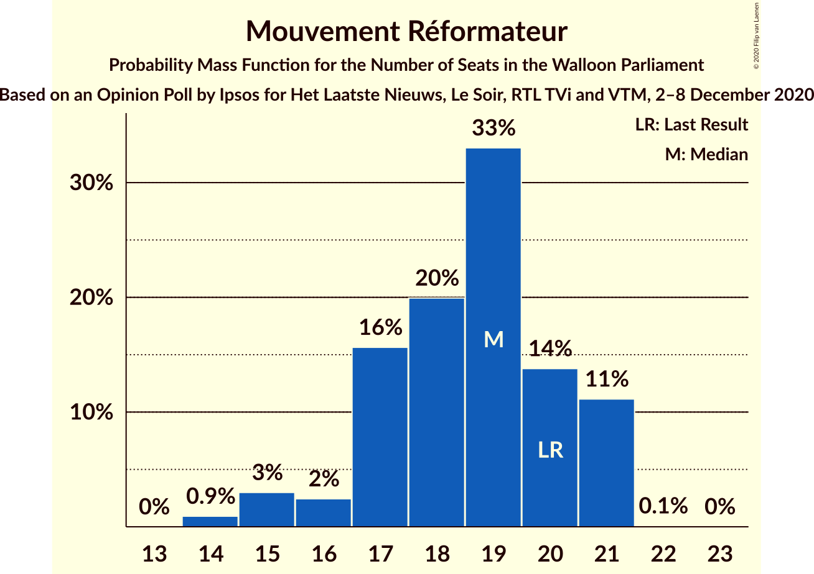

| Number of Seats | Probability | Accumulated | Special Marks |
|:---------------:|:-----------:|:-----------:|:-------------:|
| 14 | 0.4% | 100% |  |
| 15 | 0.6% | 99.6% |  |
| 16 | 5% | 99.1% |  |
| 17 | 13% | 94% |  |
| 18 | 7% | 81% |  |
| 19 | 66% | 74% | Median |
| 20 | 6% | 7% | Last Result |
| 21 | 0.9% | 0.9% |  |
| 22 | 0% | 0% |  |

### Parti du Travail de Belgique

*For a full overview of the results for this party, see the [Parti du Travail de Belgique](party-partidutravaildebelgique.html) page.*

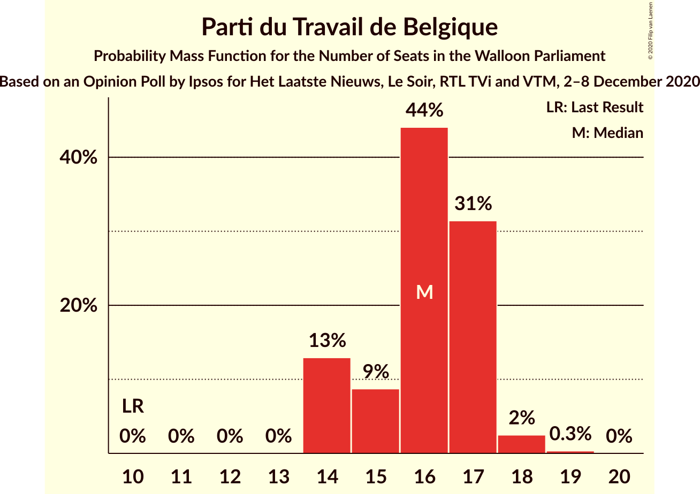

| Number of Seats | Probability | Accumulated | Special Marks |
|:---------------:|:-----------:|:-----------:|:-------------:|
| 10 | 0% | 100% | Last Result |
| 11 | 0% | 100% |  |
| 12 | 0% | 100% |  |
| 13 | 0% | 100% |  |
| 14 | 16% | 100% |  |
| 15 | 8% | 84% |  |
| 16 | 47% | 76% | Median |
| 17 | 26% | 29% |  |
| 18 | 3% | 3% |  |
| 19 | 0% | 0% |  |

### Ecolo

*For a full overview of the results for this party, see the [Ecolo](party-ecolo.html) page.*

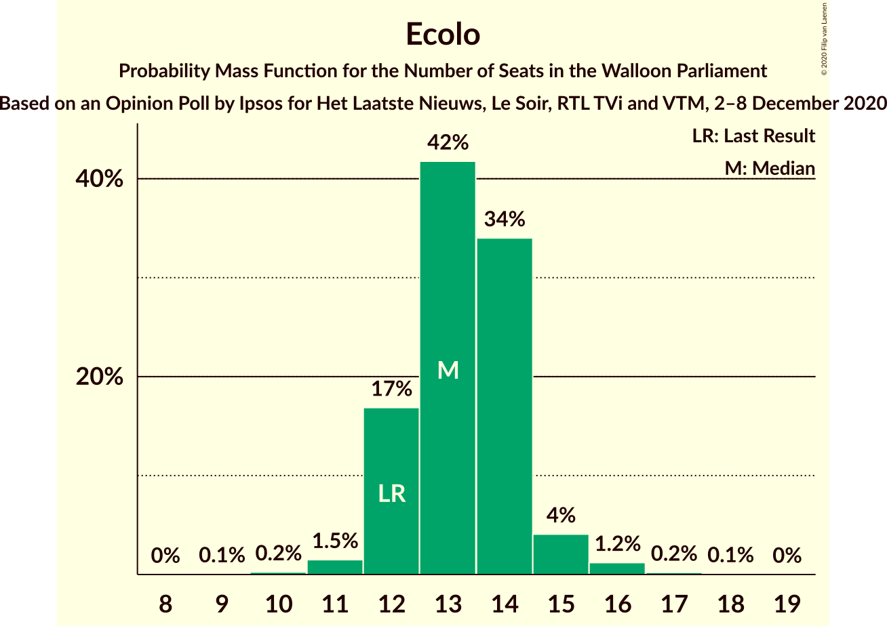

| Number of Seats | Probability | Accumulated | Special Marks |
|:---------------:|:-----------:|:-----------:|:-------------:|
| 9 | 0.2% | 100% |  |
| 10 | 0.7% | 99.8% |  |
| 11 | 0% | 99.1% |  |
| 12 | 13% | 99.0% | Last Result |
| 13 | 28% | 86% |  |
| 14 | 50% | 58% | Median |
| 15 | 4% | 8% |  |
| 16 | 3% | 4% |  |
| 17 | 1.3% | 1.3% |  |
| 18 | 0.1% | 0.1% |  |
| 19 | 0% | 0% |  |

### Centre démocrate humaniste

*For a full overview of the results for this party, see the [Centre démocrate humaniste](party-centredémocratehumaniste.html) page.*

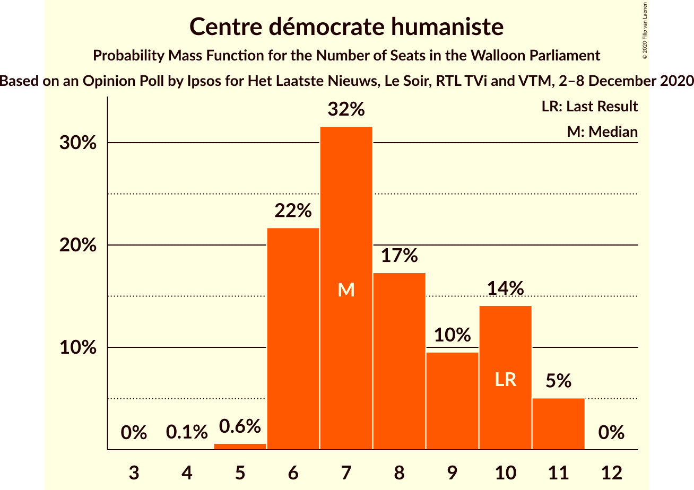

| Number of Seats | Probability | Accumulated | Special Marks |
|:---------------:|:-----------:|:-----------:|:-------------:|
| 4 | 0.2% | 100% |  |
| 5 | 4% | 99.8% |  |
| 6 | 50% | 96% | Median |
| 7 | 27% | 45% |  |
| 8 | 1.2% | 19% |  |
| 9 | 0.1% | 18% |  |
| 10 | 12% | 18% | Last Result |
| 11 | 6% | 6% |  |
| 12 | 0% | 0% |  |

### DéFI

*For a full overview of the results for this party, see the [DéFI](party-défi.html) page.*

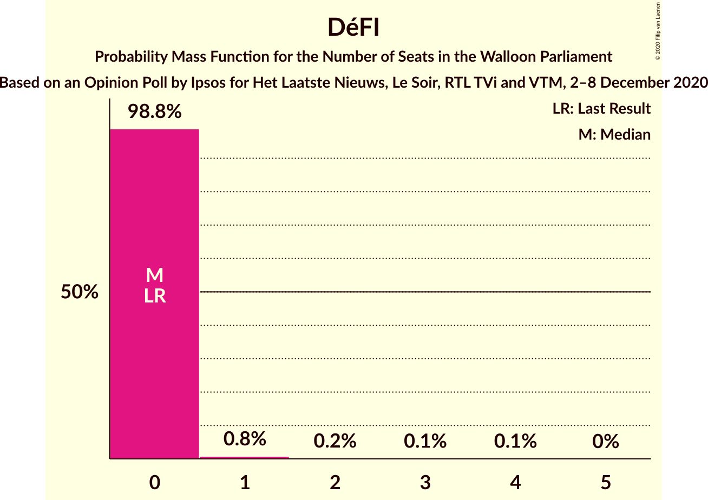

| Number of Seats | Probability | Accumulated | Special Marks |
|:---------------:|:-----------:|:-----------:|:-------------:|
| 0 | 98% | 100% | Last Result, Median |
| 1 | 1.1% | 2% |  |
| 2 | 0.9% | 1.3% |  |
| 3 | 0% | 0.4% |  |
| 4 | 0.3% | 0.4% |  |
| 5 | 0% | 0% |  |

## Coalitions

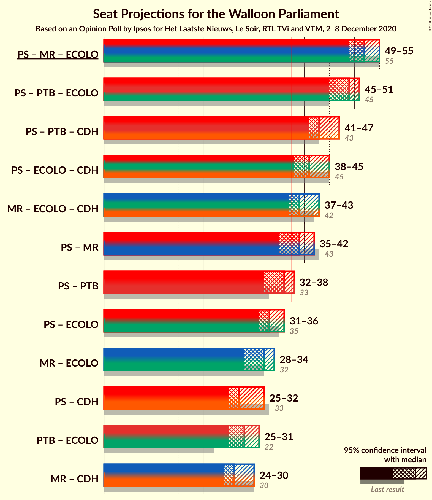

### Confidence Intervals

| Coalition | Last Result | Median | Majority? | 80% Confidence Interval | 90% Confidence Interval | 95% Confidence Interval | 99% Confidence Interval |
|:---------:|:-----------:|:------:|:---------:|:-----------------------:|:-----------------------:|:-----------------------:|:-----------------------:|
| Parti Socialiste – Mouvement Réformateur – Ecolo | 55 | 53 | 100% | 50–53 | 50–53 | 50–54 | 48–54 |
| Parti Socialiste – Parti du Travail de Belgique – Ecolo | 45 | 50 | 100% | 48–50 | 47–51 | 47–51 | 46–52 |
| Parti Socialiste – Parti du Travail de Belgique – Centre démocrate humaniste | 43 | 42 | 100% | 42–46 | 42–46 | 41–46 | 40–47 |
| Parti Socialiste – Ecolo – Centre démocrate humaniste | 45 | 40 | 97% | 39–44 | 38–44 | 37–45 | 37–45 |
| Mouvement Réformateur – Ecolo – Centre démocrate humaniste | 42 | 39 | 98% | 39–40 | 38–40 | 38–41 | 36–44 |
| Parti Socialiste – Mouvement Réformateur | 43 | 39 | 86% | 37–39 | 37–40 | 36–40 | 35–41 |
| Parti Socialiste – Parti du Travail de Belgique | 33 | 36 | 2% | 35–36 | 35–37 | 34–37 | 31–38 |
| Parti Socialiste – Ecolo | 35 | 34 | 0.1% | 32–35 | 32–36 | 30–36 | 30–37 |
| Mouvement Réformateur – Ecolo | 32 | 33 | 0% | 29–33 | 29–33 | 29–34 | 28–35 |
| Parti Socialiste – Centre démocrate humaniste | 33 | 26 | 0% | 25–32 | 25–32 | 24–32 | 24–33 |
| Parti du Travail de Belgique – Ecolo | 22 | 30 | 0% | 26–30 | 26–31 | 26–31 | 24–33 |
| Mouvement Réformateur – Centre démocrate humaniste | 30 | 25 | 0% | 25–27 | 24–28 | 24–28 | 23–29 |

### Parti Socialiste – Mouvement Réformateur – Ecolo

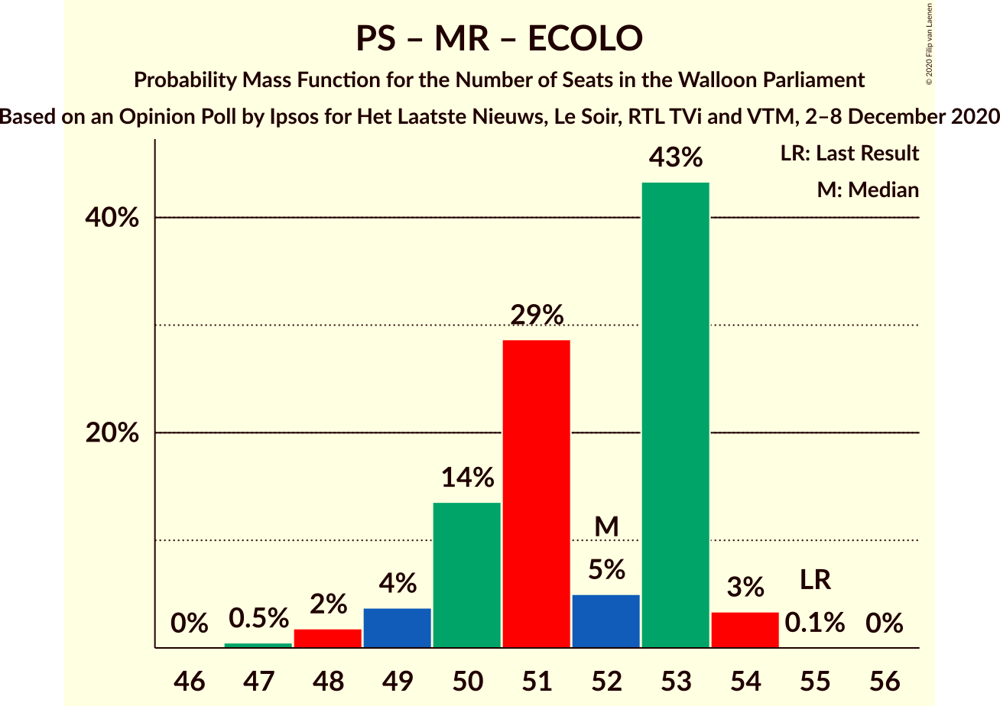

| Number of Seats | Probability | Accumulated | Special Marks |
|:---------------:|:-----------:|:-----------:|:-------------:|
| 47 | 0% | 100% |  |
| 48 | 1.0% | 99.9% |  |
| 49 | 1.1% | 98.9% |  |
| 50 | 8% | 98% |  |
| 51 | 32% | 90% |  |
| 52 | 1.2% | 57% |  |
| 53 | 52% | 56% | Median |
| 54 | 4% | 4% |  |
| 55 | 0.1% | 0.1% | Last Result |
| 56 | 0% | 0% |  |

### Parti Socialiste – Parti du Travail de Belgique – Ecolo

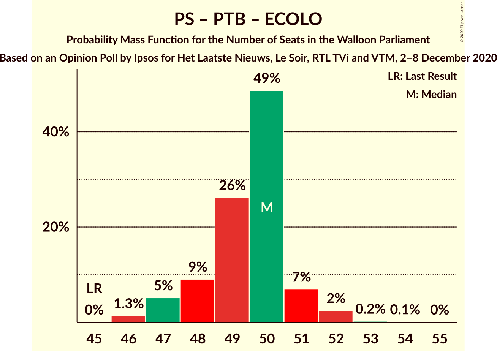

| Number of Seats | Probability | Accumulated | Special Marks |
|:---------------:|:-----------:|:-----------:|:-------------:|
| 45 | 0% | 100% | Last Result |
| 46 | 2% | 100% |  |
| 47 | 6% | 98% |  |
| 48 | 10% | 92% |  |
| 49 | 24% | 82% |  |
| 50 | 51% | 58% | Median |
| 51 | 5% | 7% |  |
| 52 | 2% | 2% |  |
| 53 | 0% | 0.1% |  |
| 54 | 0.1% | 0.1% |  |
| 55 | 0% | 0% |  |

### Parti Socialiste – Parti du Travail de Belgique – Centre démocrate humaniste

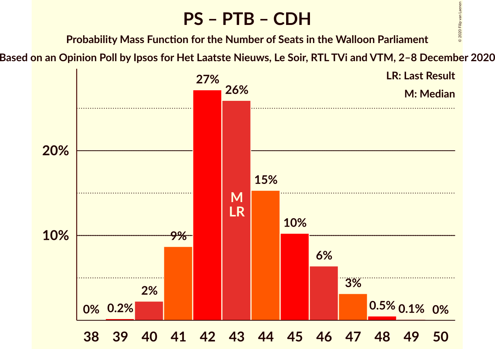

| Number of Seats | Probability | Accumulated | Special Marks |
|:---------------:|:-----------:|:-----------:|:-------------:|
| 40 | 1.3% | 100% |  |
| 41 | 2% | 98.7% |  |
| 42 | 60% | 97% | Median |
| 43 | 18% | 36% | Last Result |
| 44 | 1.3% | 18% |  |
| 45 | 1.4% | 17% |  |
| 46 | 14% | 16% |  |
| 47 | 1.2% | 2% |  |
| 48 | 0.3% | 0.3% |  |
| 49 | 0% | 0% |  |

### Parti Socialiste – Ecolo – Centre démocrate humaniste

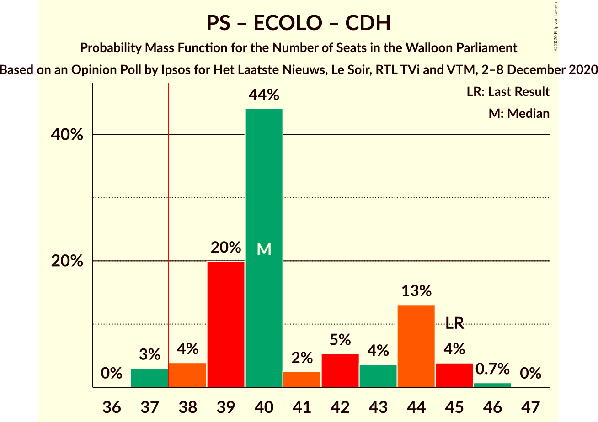

| Number of Seats | Probability | Accumulated | Special Marks |
|:---------------:|:-----------:|:-----------:|:-------------:|
| 37 | 3% | 100% |  |
| 38 | 4% | 97% | Majority |
| 39 | 21% | 92% |  |
| 40 | 46% | 72% | Median |
| 41 | 2% | 25% |  |
| 42 | 5% | 23% |  |
| 43 | 2% | 18% |  |
| 44 | 13% | 16% |  |
| 45 | 3% | 3% | Last Result |
| 46 | 0.4% | 0.4% |  |
| 47 | 0% | 0% |  |

### Mouvement Réformateur – Ecolo – Centre démocrate humaniste

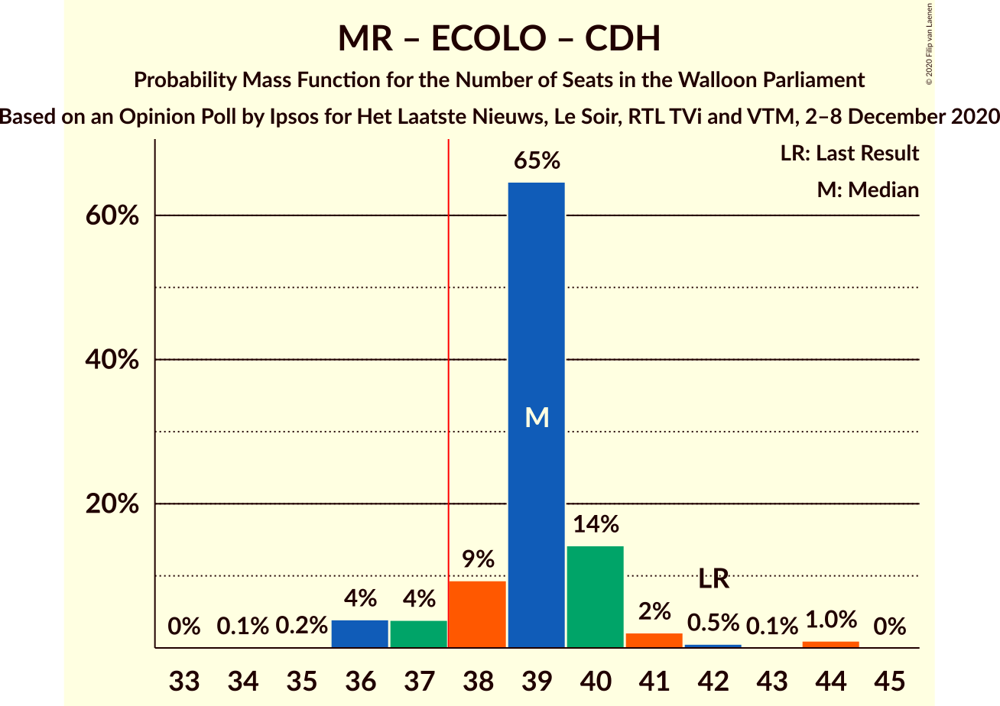

| Number of Seats | Probability | Accumulated | Special Marks |
|:---------------:|:-----------:|:-----------:|:-------------:|
| 35 | 0% | 100% |  |
| 36 | 1.3% | 99.9% |  |
| 37 | 0.3% | 98.6% |  |
| 38 | 5% | 98% | Majority |
| 39 | 79% | 93% | Median |
| 40 | 11% | 14% |  |
| 41 | 2% | 3% |  |
| 42 | 0% | 1.3% | Last Result |
| 43 | 0.1% | 1.3% |  |
| 44 | 1.2% | 1.2% |  |
| 45 | 0% | 0% |  |

### Parti Socialiste – Mouvement Réformateur

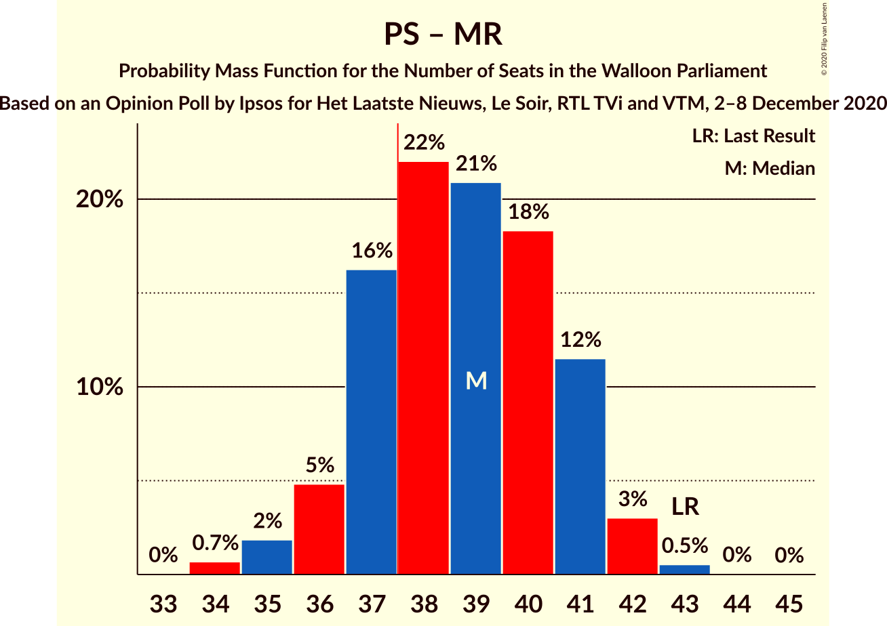

| Number of Seats | Probability | Accumulated | Special Marks |
|:---------------:|:-----------:|:-----------:|:-------------:|
| 34 | 0.1% | 100% |  |
| 35 | 2% | 99.9% |  |
| 36 | 3% | 98% |  |
| 37 | 9% | 95% |  |
| 38 | 24% | 86% | Majority |
| 39 | 57% | 63% | Median |
| 40 | 6% | 6% |  |
| 41 | 0.5% | 0.5% |  |
| 42 | 0.1% | 0.1% |  |
| 43 | 0% | 0% | Last Result |

### Parti Socialiste – Parti du Travail de Belgique

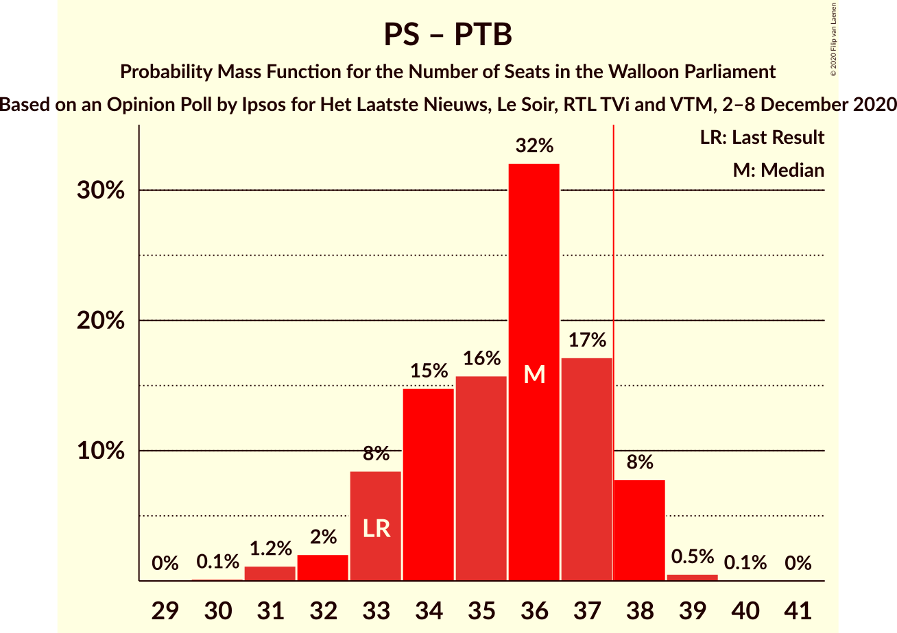

| Number of Seats | Probability | Accumulated | Special Marks |
|:---------------:|:-----------:|:-----------:|:-------------:|
| 31 | 1.2% | 100% |  |
| 32 | 0.1% | 98.8% |  |
| 33 | 0.2% | 98.7% | Last Result |
| 34 | 2% | 98% |  |
| 35 | 12% | 96% |  |
| 36 | 78% | 84% | Median |
| 37 | 4% | 6% |  |
| 38 | 1.3% | 2% | Majority |
| 39 | 0.2% | 0.2% |  |
| 40 | 0% | 0% |  |

### Parti Socialiste – Ecolo

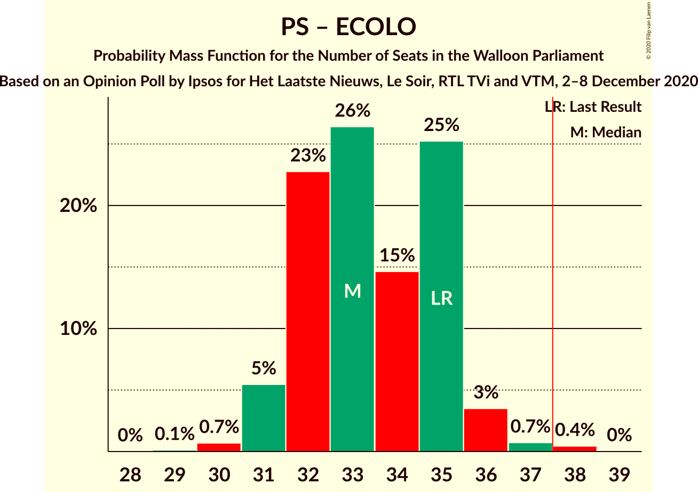

| Number of Seats | Probability | Accumulated | Special Marks |
|:---------------:|:-----------:|:-----------:|:-------------:|
| 29 | 0% | 100% |  |
| 30 | 3% | 99.9% |  |
| 31 | 1.2% | 97% |  |
| 32 | 22% | 95% |  |
| 33 | 10% | 74% |  |
| 34 | 53% | 64% | Median |
| 35 | 6% | 11% | Last Result |
| 36 | 4% | 5% |  |
| 37 | 2% | 2% |  |
| 38 | 0% | 0.1% | Majority |
| 39 | 0.1% | 0.1% |  |
| 40 | 0% | 0% |  |

### Mouvement Réformateur – Ecolo

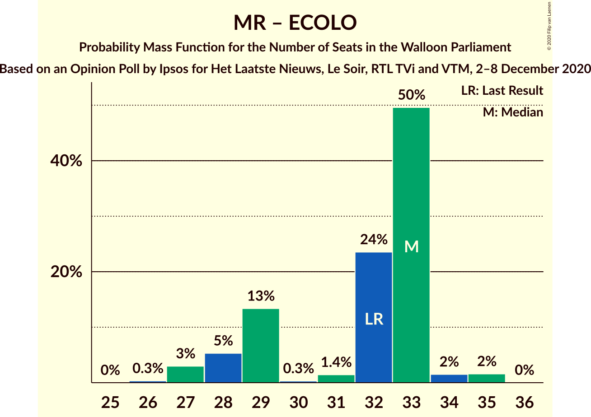

| Number of Seats | Probability | Accumulated | Special Marks |
|:---------------:|:-----------:|:-----------:|:-------------:|
| 27 | 0.3% | 100% |  |
| 28 | 2% | 99.6% |  |
| 29 | 16% | 98% |  |
| 30 | 0.2% | 82% |  |
| 31 | 0.7% | 82% |  |
| 32 | 18% | 81% | Last Result |
| 33 | 60% | 63% | Median |
| 34 | 2% | 3% |  |
| 35 | 1.3% | 1.3% |  |
| 36 | 0% | 0% |  |

### Parti Socialiste – Centre démocrate humaniste

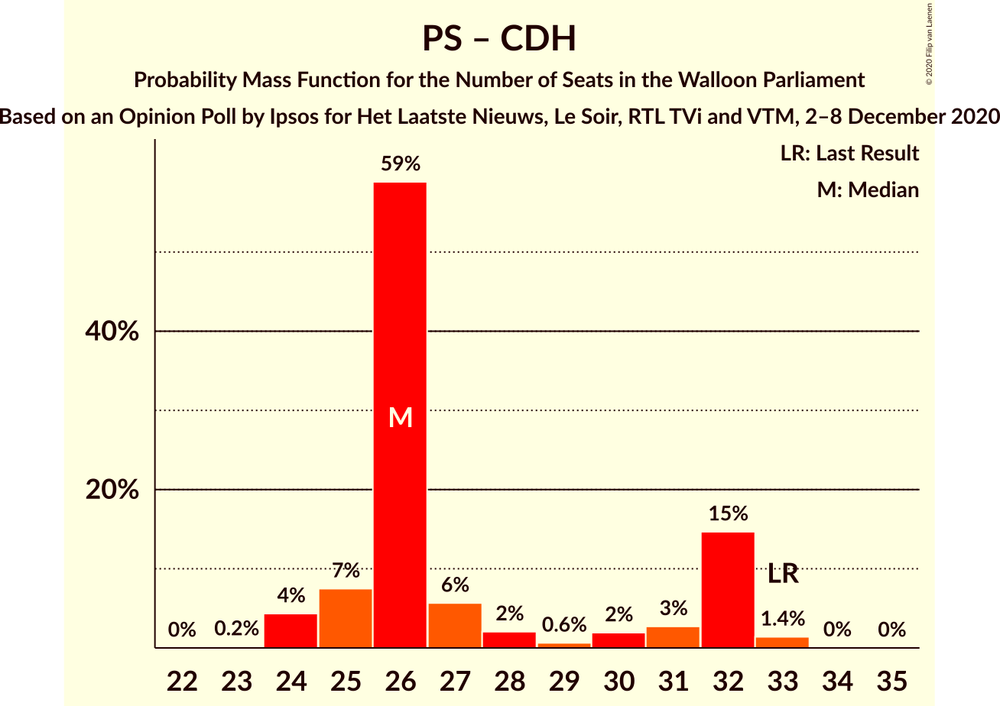

| Number of Seats | Probability | Accumulated | Special Marks |
|:---------------:|:-----------:|:-----------:|:-------------:|
| 24 | 4% | 100% |  |
| 25 | 8% | 96% |  |
| 26 | 62% | 87% | Median |
| 27 | 5% | 25% |  |
| 28 | 2% | 20% |  |
| 29 | 0.6% | 18% |  |
| 30 | 2% | 17% |  |
| 31 | 0.4% | 15% |  |
| 32 | 14% | 15% |  |
| 33 | 1.1% | 1.2% | Last Result |
| 34 | 0% | 0% |  |

### Parti du Travail de Belgique – Ecolo

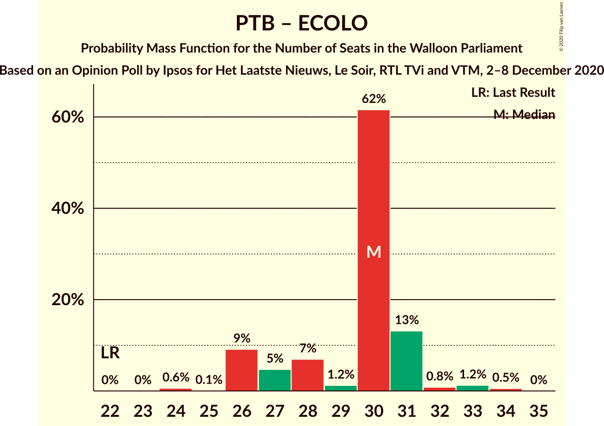

| Number of Seats | Probability | Accumulated | Special Marks |
|:---------------:|:-----------:|:-----------:|:-------------:|
| 22 | 0% | 100% | Last Result |
| 23 | 0% | 100% |  |
| 24 | 0.7% | 100% |  |
| 25 | 0% | 99.3% |  |
| 26 | 11% | 99.2% |  |
| 27 | 5% | 88% |  |
| 28 | 1.2% | 83% |  |
| 29 | 0.4% | 82% |  |
| 30 | 72% | 82% | Median |
| 31 | 8% | 10% |  |
| 32 | 0.3% | 2% |  |
| 33 | 1.3% | 1.3% |  |
| 34 | 0% | 0% |  |

### Mouvement Réformateur – Centre démocrate humaniste

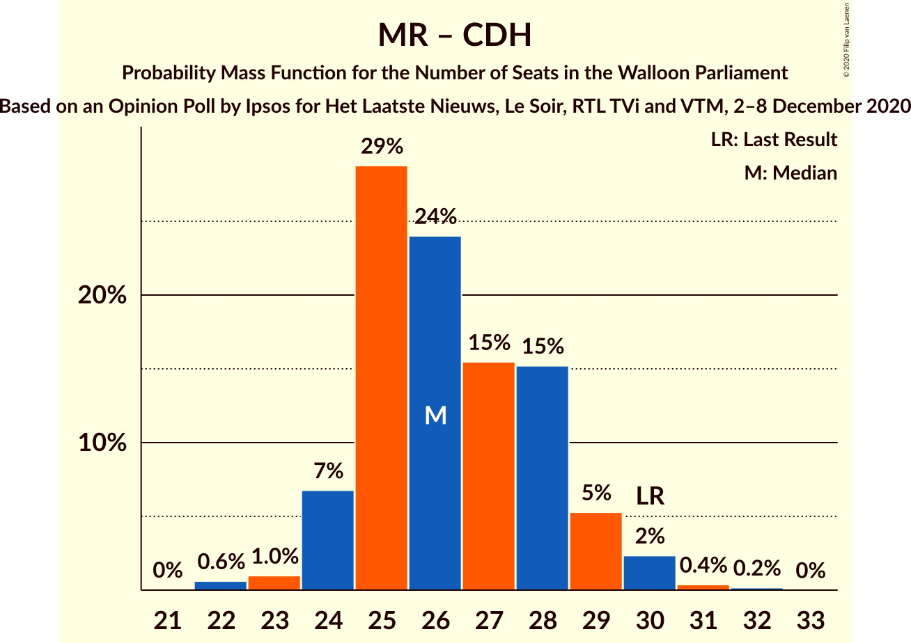

| Number of Seats | Probability | Accumulated | Special Marks |
|:---------------:|:-----------:|:-----------:|:-------------:|
| 21 | 0.1% | 100% |  |
| 22 | 0% | 99.9% |  |
| 23 | 2% | 99.9% |  |
| 24 | 6% | 98% |  |
| 25 | 51% | 92% | Median |
| 26 | 24% | 42% |  |
| 27 | 11% | 17% |  |
| 28 | 6% | 7% |  |
| 29 | 0.8% | 0.8% |  |
| 30 | 0% | 0% | Last Result |

## Technical Information

### Opinion Poll

+ **Polling firm:** Ipsos
+ **Commissioner(s):** Het Laatste Nieuws, Le Soir, RTL TVi and VTM
+ **Fieldwork period:** 2–8 December 2020

### Calculations

+ **Sample size:** 995
+ **Simulations done:** 2,048
+ **Error estimate:** 1.28%

