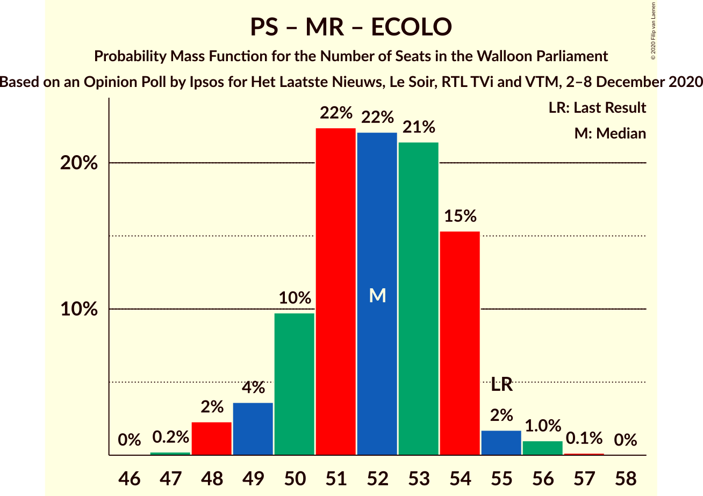
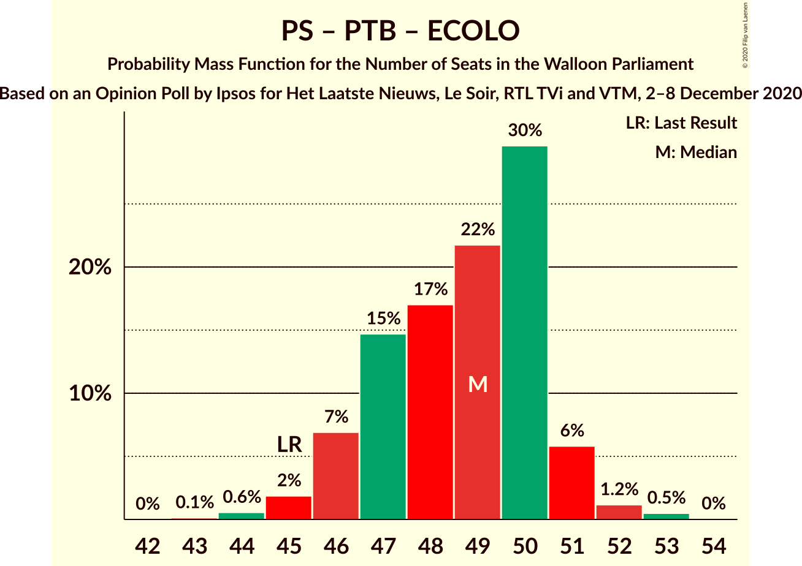
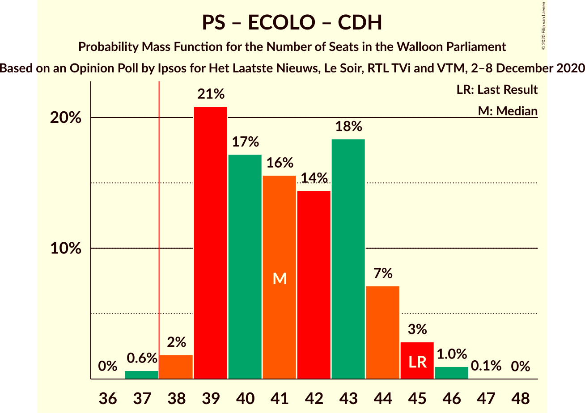
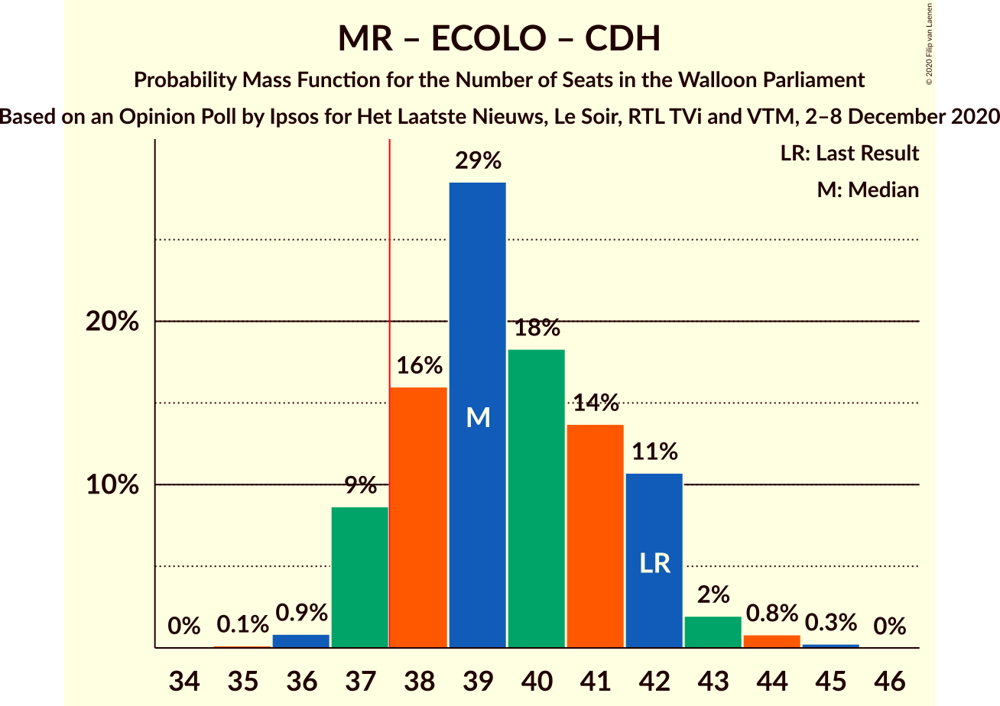

# Opinion Poll by Ipsos for Het Laatste Nieuws, Le Soir, RTL TVi and VTM, 2–8 December 2020

<a href="#voting-intentions">Voting Intentions</a> | <a href="#seats">Seats</a> | <a href="#coalitions">Coalitions</a> | <a href="#technical-information">Technical Information</a>

## Voting Intentions

### Confidence Intervals

| Party | Last Result | Poll Result | 80% Confidence Interval | 90% Confidence Interval | 95% Confidence Interval | 99% Confidence Interval |
|:-----:|:-----------:|:-----------:|:-----------------------:|:-----------------------:|:-----------------------:|:-----------------------:|
| Parti Socialiste | 26.2% | 23.1% | 21.5–24.9% |21.0–25.4% |20.6–25.8% |19.8–26.7% |
| Mouvement Réformateur | 21.4% | 20.5% | 18.9–22.2% |18.5–22.7% |18.1–23.1% |17.4–24.0% |
| Parti du Travail de Belgique | 13.7% | 17.2% | 15.7–18.8% |15.3–19.3% |15.0–19.7% |14.3–20.5% |
| Ecolo | 14.5% | 15.6% | 14.2–17.1% |13.8–17.6% |13.5–18.0% |12.8–18.7% |
| Centre démocrate humaniste | 11.0% | 10.3% | 9.1–11.6% |8.8–12.0% |8.5–12.3% |8.0–13.0% |
| DéFI | 4.1% | 3.7% | 3.0–4.6% |2.9–4.9% |2.7–5.1% |2.4–5.5% |

*Note:* The poll result column reflects the actual value used in the calculations. Published results may vary slightly, and in addition be rounded to fewer digits.

## Seats

### Confidence Intervals

| Party | Last Result | Median | 80% Confidence Interval | 90% Confidence Interval | 95% Confidence Interval | 99% Confidence Interval |
|:-----:|:-----------:|:------:|:-----------------------:|:-----------------------:|:-----------------------:|:-----------------------:|
| <a href="#parti-socialiste">Parti Socialiste</a> | 23 | 20 | 19–22 |18–22 |18–23 |17–23 |
| <a href="#mouvement-réformateur">Mouvement Réformateur</a> | 20 | 19 | 17–21 |16–21 |15–21 |14–21 |
| <a href="#parti-du-travail-de-belgique">Parti du Travail de Belgique</a> | 10 | 15 | 14–17 |13–17 |12–17 |10–18 |
| <a href="#ecolo">Ecolo</a> | 12 | 13 | 12–14 |12–15 |12–15 |11–16 |
| <a href="#centre-démocrate-humaniste">Centre démocrate humaniste</a> | 10 | 7 | 6–10 |6–11 |6–11 |5–11 |
| <a href="#défi">DéFI</a> | 0 | 0 | 0 |0 |0 |0–3 |

### Parti Socialiste

*For a full overview of the results for this party, see the [Parti Socialiste](party-partisocialiste.html) page.*

| Number of Seats | Probability | Accumulated | Special Marks |
|:---------------:|:-----------:|:-----------:|:-------------:|
| 17 | 2% | 100% |  |
| 18 | 3% | 98% |  |
| 19 | 31% | 95% |  |
| 20 | 21% | 64% | Median |
| 21 | 25% | 42% |  |
| 22 | 14% | 18% |  |
| 23 | 3% | 3% | Last Result |
| 24 | 0.3% | 0.4% |  |
| 25 | 0% | 0% |  |

### Mouvement Réformateur

*For a full overview of the results for this party, see the [Mouvement Réformateur](party-mouvementréformateur.html) page.*

| Number of Seats | Probability | Accumulated | Special Marks |
|:---------------:|:-----------:|:-----------:|:-------------:|
| 14 | 1.0% | 100% |  |
| 15 | 3% | 99.0% |  |
| 16 | 5% | 96% |  |
| 17 | 16% | 91% |  |
| 18 | 20% | 76% |  |
| 19 | 31% | 55% | Median |
| 20 | 13% | 24% | Last Result |
| 21 | 11% | 11% |  |
| 22 | 0.1% | 0.1% |  |
| 23 | 0% | 0% |  |

### Parti du Travail de Belgique

*For a full overview of the results for this party, see the [Parti du Travail de Belgique](party-partidutravaildebelgique.html) page.*

| Number of Seats | Probability | Accumulated | Special Marks |
|:---------------:|:-----------:|:-----------:|:-------------:|
| 10 | 0.9% | 100% | Last Result |
| 11 | 1.0% | 99.1% |  |
| 12 | 1.2% | 98% |  |
| 13 | 3% | 97% |  |
| 14 | 19% | 94% |  |
| 15 | 37% | 75% | Median |
| 16 | 18% | 38% |  |
| 17 | 19% | 20% |  |
| 18 | 0.8% | 0.8% |  |
| 19 | 0.1% | 0.1% |  |
| 20 | 0% | 0% |  |

### Ecolo

*For a full overview of the results for this party, see the [Ecolo](party-ecolo.html) page.*

| Number of Seats | Probability | Accumulated | Special Marks |
|:---------------:|:-----------:|:-----------:|:-------------:|
| 9 | 0.1% | 100% |  |
| 10 | 0.2% | 99.9% |  |
| 11 | 1.5% | 99.7% |  |
| 12 | 17% | 98% | Last Result |
| 13 | 42% | 81% | Median |
| 14 | 34% | 40% |  |
| 15 | 4% | 6% |  |
| 16 | 1.2% | 1.5% |  |
| 17 | 0.2% | 0.3% |  |
| 18 | 0.1% | 0.1% |  |
| 19 | 0% | 0% |  |

### Centre démocrate humaniste

*For a full overview of the results for this party, see the [Centre démocrate humaniste](party-centredémocratehumaniste.html) page.*

| Number of Seats | Probability | Accumulated | Special Marks |
|:---------------:|:-----------:|:-----------:|:-------------:|
| 4 | 0.1% | 100% |  |
| 5 | 0.6% | 99.9% |  |
| 6 | 22% | 99.3% |  |
| 7 | 32% | 78% | Median |
| 8 | 17% | 46% |  |
| 9 | 10% | 29% |  |
| 10 | 14% | 19% | Last Result |
| 11 | 5% | 5% |  |
| 12 | 0% | 0% |  |

### DéFI

*For a full overview of the results for this party, see the [DéFI](party-défi.html) page.*

| Number of Seats | Probability | Accumulated | Special Marks |
|:---------------:|:-----------:|:-----------:|:-------------:|
| 0 | 98.7% | 100% | Last Result, Median |
| 1 | 0.6% | 1.3% |  |
| 2 | 0.2% | 0.7% |  |
| 3 | 0.4% | 0.5% |  |
| 4 | 0.1% | 0.1% |  |
| 5 | 0% | 0% |  |

## Coalitions

### Confidence Intervals

| Coalition | Last Result | Median | Majority? | 80% Confidence Interval | 90% Confidence Interval | 95% Confidence Interval | 99% Confidence Interval |
|:---------:|:-----------:|:------:|:---------:|:-----------------------:|:-----------------------:|:-----------------------:|:-----------------------:|
| Parti Socialiste – Mouvement Réformateur – Ecolo | 55 | 52 | 100% | 50–54 | 49–54 | 48–55 | 48–56 |
| Parti Socialiste – Parti du Travail de Belgique – Ecolo | 45 | 49 | 100% | 47–50 | 46–51 | 45–51 | 44–53 |
| Parti Socialiste – Parti du Travail de Belgique – Centre démocrate humaniste | 43 | 43 | 100% | 41–46 | 41–46 | 41–47 | 40–48 |
| Parti Socialiste – Ecolo – Centre démocrate humaniste | 45 | 41 | 99.3% | 39–44 | 39–44 | 38–45 | 37–46 |
| Mouvement Réformateur – Ecolo – Centre démocrate humaniste | 42 | 39 | 90% | 38–42 | 37–42 | 37–43 | 36–44 |
| Parti Socialiste – Mouvement Réformateur | 43 | 39 | 76% | 37–41 | 36–41 | 35–42 | 34–43 |
| Parti Socialiste – Parti du Travail de Belgique | 33 | 36 | 9% | 33–37 | 33–38 | 32–38 | 31–39 |
| Parti Socialiste – Ecolo | 35 | 33 | 0.4% | 32–35 | 31–36 | 31–36 | 30–37 |
| Mouvement Réformateur – Ecolo | 32 | 32 | 0% | 29–34 | 29–34 | 28–34 | 27–35 |
| Parti Socialiste – Centre démocrate humaniste | 33 | 28 | 0% | 26–31 | 26–31 | 25–32 | 24–32 |
| Parti du Travail de Belgique – Ecolo | 22 | 29 | 0% | 27–30 | 26–30 | 25–31 | 24–32 |
| Mouvement Réformateur – Centre démocrate humaniste | 30 | 26 | 0% | 25–28 | 24–29 | 24–29 | 22–31 |

### Parti Socialiste – Mouvement Réformateur – Ecolo

| Number of Seats | Probability | Accumulated | Special Marks |
|:---------------:|:-----------:|:-----------:|:-------------:|
| 47 | 0.2% | 100% |  |
| 48 | 2% | 99.8% |  |
| 49 | 4% | 97% |  |
| 50 | 10% | 94% |  |
| 51 | 22% | 84% |  |
| 52 | 22% | 62% | Median |
| 53 | 21% | 40% |  |
| 54 | 15% | 18% |  |
| 55 | 2% | 3% | Last Result |
| 56 | 1.0% | 1.2% |  |
| 57 | 0.1% | 0.2% |  |
| 58 | 0% | 0% |  |

### Parti Socialiste – Parti du Travail de Belgique – Ecolo

| Number of Seats | Probability | Accumulated | Special Marks |
|:---------------:|:-----------:|:-----------:|:-------------:|
| 43 | 0.1% | 100% |  |
| 44 | 0.6% | 99.9% |  |
| 45 | 2% | 99.3% | Last Result |
| 46 | 7% | 97% |  |
| 47 | 15% | 91% |  |
| 48 | 17% | 76% | Median |
| 49 | 22% | 59% |  |
| 50 | 30% | 37% |  |
| 51 | 6% | 7% |  |
| 52 | 1.2% | 2% |  |
| 53 | 0.5% | 0.5% |  |
| 54 | 0% | 0% |  |

### Parti Socialiste – Parti du Travail de Belgique – Centre démocrate humaniste

| Number of Seats | Probability | Accumulated | Special Marks |
|:---------------:|:-----------:|:-----------:|:-------------:|
| 38 | 0% | 100% | Majority |
| 39 | 0.2% | 99.9% |  |
| 40 | 2% | 99.8% |  |
| 41 | 9% | 98% |  |
| 42 | 27% | 89% | Median |
| 43 | 26% | 62% | Last Result |
| 44 | 15% | 36% |  |
| 45 | 10% | 20% |  |
| 46 | 6% | 10% |  |
| 47 | 3% | 4% |  |
| 48 | 0.5% | 0.6% |  |
| 49 | 0.1% | 0.1% |  |
| 50 | 0% | 0% |  |

### Parti Socialiste – Ecolo – Centre démocrate humaniste

| Number of Seats | Probability | Accumulated | Special Marks |
|:---------------:|:-----------:|:-----------:|:-------------:|
| 37 | 0.6% | 100% |  |
| 38 | 2% | 99.3% | Majority |
| 39 | 21% | 97% |  |
| 40 | 17% | 77% | Median |
| 41 | 16% | 59% |  |
| 42 | 14% | 44% |  |
| 43 | 18% | 29% |  |
| 44 | 7% | 11% |  |
| 45 | 3% | 4% | Last Result |
| 46 | 1.0% | 1.0% |  |
| 47 | 0.1% | 0.1% |  |
| 48 | 0% | 0% |  |

### Mouvement Réformateur – Ecolo – Centre démocrate humaniste

| Number of Seats | Probability | Accumulated | Special Marks |
|:---------------:|:-----------:|:-----------:|:-------------:|
| 35 | 0.1% | 100% |  |
| 36 | 0.9% | 99.8% |  |
| 37 | 9% | 99.0% |  |
| 38 | 16% | 90% | Majority |
| 39 | 29% | 74% | Median |
| 40 | 18% | 46% |  |
| 41 | 14% | 27% |  |
| 42 | 11% | 14% | Last Result |
| 43 | 2% | 3% |  |
| 44 | 0.8% | 1.1% |  |
| 45 | 0.3% | 0.3% |  |
| 46 | 0% | 0% |  |

### Parti Socialiste – Mouvement Réformateur

| Number of Seats | Probability | Accumulated | Special Marks |
|:---------------:|:-----------:|:-----------:|:-------------:|
| 34 | 0.7% | 100% |  |
| 35 | 2% | 99.3% |  |
| 36 | 5% | 97% |  |
| 37 | 16% | 93% |  |
| 38 | 22% | 76% | Majority |
| 39 | 21% | 54% | Median |
| 40 | 18% | 33% |  |
| 41 | 12% | 15% |  |
| 42 | 3% | 4% |  |
| 43 | 0.5% | 0.6% | Last Result |
| 44 | 0% | 0.1% |  |
| 45 | 0% | 0% |  |

### Parti Socialiste – Parti du Travail de Belgique

| Number of Seats | Probability | Accumulated | Special Marks |
|:---------------:|:-----------:|:-----------:|:-------------:|
| 30 | 0.3% | 100% |  |
| 31 | 0.8% | 99.7% |  |
| 32 | 2% | 98.9% |  |
| 33 | 11% | 97% | Last Result |
| 34 | 14% | 86% |  |
| 35 | 18% | 72% | Median |
| 36 | 29% | 54% |  |
| 37 | 16% | 25% |  |
| 38 | 8% | 9% | Majority |
| 39 | 0.6% | 0.8% |  |
| 40 | 0.1% | 0.1% |  |
| 41 | 0% | 0% |  |

### Parti Socialiste – Ecolo

| Number of Seats | Probability | Accumulated | Special Marks |
|:---------------:|:-----------:|:-----------:|:-------------:|
| 29 | 0.1% | 100% |  |
| 30 | 1.1% | 99.9% |  |
| 31 | 5% | 98.8% |  |
| 32 | 23% | 94% |  |
| 33 | 24% | 70% | Median |
| 34 | 16% | 46% |  |
| 35 | 25% | 30% | Last Result |
| 36 | 4% | 5% |  |
| 37 | 0.9% | 1.3% |  |
| 38 | 0.3% | 0.4% | Majority |
| 39 | 0% | 0% |  |

### Mouvement Réformateur – Ecolo

| Number of Seats | Probability | Accumulated | Special Marks |
|:---------------:|:-----------:|:-----------:|:-------------:|
| 26 | 0.1% | 100% |  |
| 27 | 0.5% | 99.9% |  |
| 28 | 3% | 99.4% |  |
| 29 | 7% | 96% |  |
| 30 | 11% | 90% |  |
| 31 | 16% | 79% |  |
| 32 | 26% | 64% | Last Result, Median |
| 33 | 27% | 38% |  |
| 34 | 9% | 11% |  |
| 35 | 2% | 2% |  |
| 36 | 0.2% | 0.2% |  |
| 37 | 0% | 0% |  |

### Parti Socialiste – Centre démocrate humaniste

| Number of Seats | Probability | Accumulated | Special Marks |
|:---------------:|:-----------:|:-----------:|:-------------:|
| 23 | 0.1% | 100% |  |
| 24 | 0.8% | 99.9% |  |
| 25 | 3% | 99.1% |  |
| 26 | 22% | 96% |  |
| 27 | 21% | 74% | Median |
| 28 | 15% | 53% |  |
| 29 | 18% | 38% |  |
| 30 | 10% | 20% |  |
| 31 | 6% | 10% |  |
| 32 | 4% | 4% |  |
| 33 | 0.3% | 0.3% | Last Result |
| 34 | 0% | 0% |  |

### Parti du Travail de Belgique – Ecolo

| Number of Seats | Probability | Accumulated | Special Marks |
|:---------------:|:-----------:|:-----------:|:-------------:|
| 22 | 0.1% | 100% | Last Result |
| 23 | 0.3% | 99.9% |  |
| 24 | 1.0% | 99.6% |  |
| 25 | 2% | 98.6% |  |
| 26 | 5% | 97% |  |
| 27 | 12% | 91% |  |
| 28 | 28% | 79% | Median |
| 29 | 25% | 51% |  |
| 30 | 21% | 26% |  |
| 31 | 4% | 5% |  |
| 32 | 0.7% | 0.9% |  |
| 33 | 0.2% | 0.2% |  |
| 34 | 0% | 0% |  |

### Mouvement Réformateur – Centre démocrate humaniste

| Number of Seats | Probability | Accumulated | Special Marks |
|:---------------:|:-----------:|:-----------:|:-------------:|
| 22 | 0.5% | 100% |  |
| 23 | 1.3% | 99.4% |  |
| 24 | 6% | 98% |  |
| 25 | 30% | 92% |  |
| 26 | 22% | 62% | Median |
| 27 | 17% | 41% |  |
| 28 | 15% | 24% |  |
| 29 | 7% | 9% |  |
| 30 | 2% | 2% | Last Result |
| 31 | 0.5% | 0.6% |  |
| 32 | 0.1% | 0.1% |  |
| 33 | 0% | 0% |  |

## Technical Information

### Opinion Poll

+ **Polling firm:** Ipsos
+ **Commissioner(s):** Het Laatste Nieuws, Le Soir, RTL TVi and VTM
+ **Fieldwork period:** 2–8 December 2020

### Calculations

+ **Sample size:** 995
+ **Simulations done:** 1,048,576
+ **Error estimate:** 0.27%

