# Opinion Poll by Ipsos for Het Laatste Nieuws, Le Soir, RTL TVi and VTM, 25 May–1 June 2021

<a href="#voting-intentions">Voting Intentions</a> | <a href="#seats">Seats</a> | <a href="#coalitions">Coalitions</a> | <a href="#technical-information">Technical Information</a>

## Voting Intentions

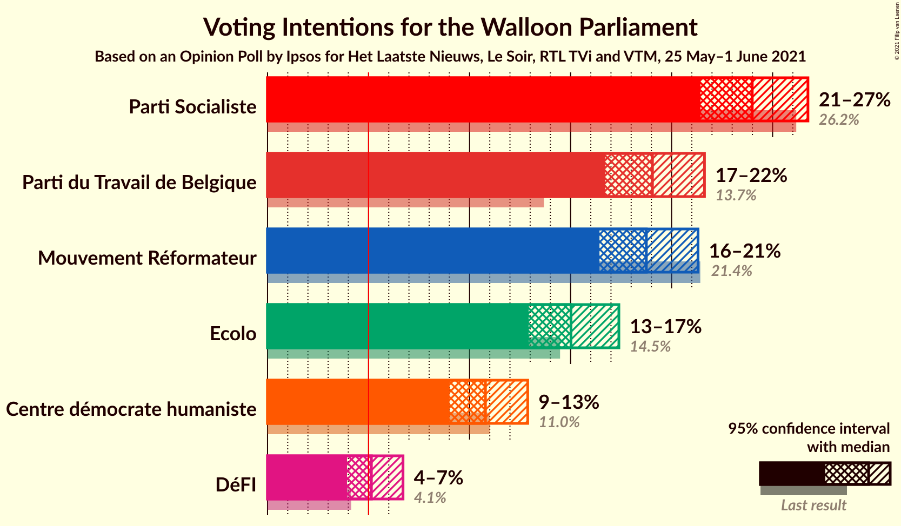

### Confidence Intervals

| Party | Last Result | Poll Result | 80% Confidence Interval | 90% Confidence Interval | 95% Confidence Interval | 99% Confidence Interval |
|:-----:|:-----------:|:-----------:|:-----------------------:|:-----------------------:|:-----------------------:|:-----------------------:|
| Parti Socialiste | 26.2% | 24.0% | 22.3–25.8% |21.8–26.3% |21.4–26.7% |20.7–27.6% |
| Parti du Travail de Belgique | 13.7% | 19.1% | 17.5–20.7% |17.1–21.2% |16.7–21.6% |16.0–22.5% |
| Mouvement Réformateur | 21.4% | 18.8% | 17.2–20.4% |16.8–20.9% |16.4–21.3% |15.7–22.1% |
| Ecolo | 14.5% | 15.0% | 13.6–16.6% |13.3–17.0% |12.9–17.4% |12.3–18.2% |
| Centre démocrate humaniste | 11.0% | 10.8% | 9.6–12.1% |9.3–12.5% |9.0–12.9% |8.5–13.6% |
| DéFI | 4.1% | 5.1% | 4.3–6.2% |4.1–6.4% |3.9–6.7% |3.6–7.2% |

*Note:* The poll result column reflects the actual value used in the calculations. Published results may vary slightly, and in addition be rounded to fewer digits.

## Seats

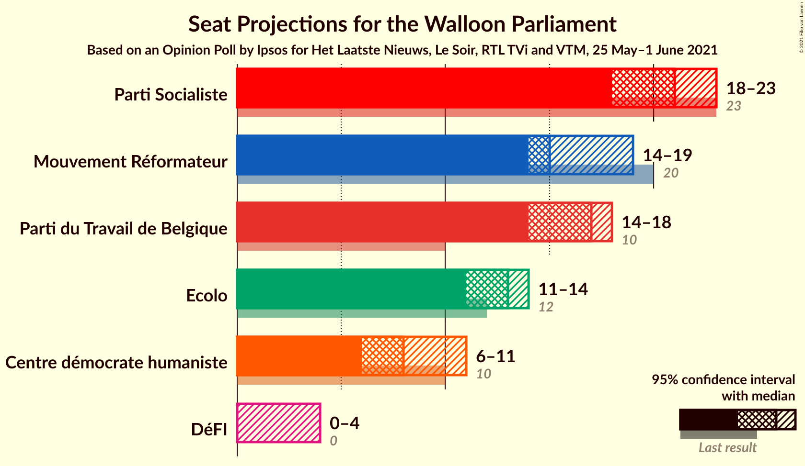

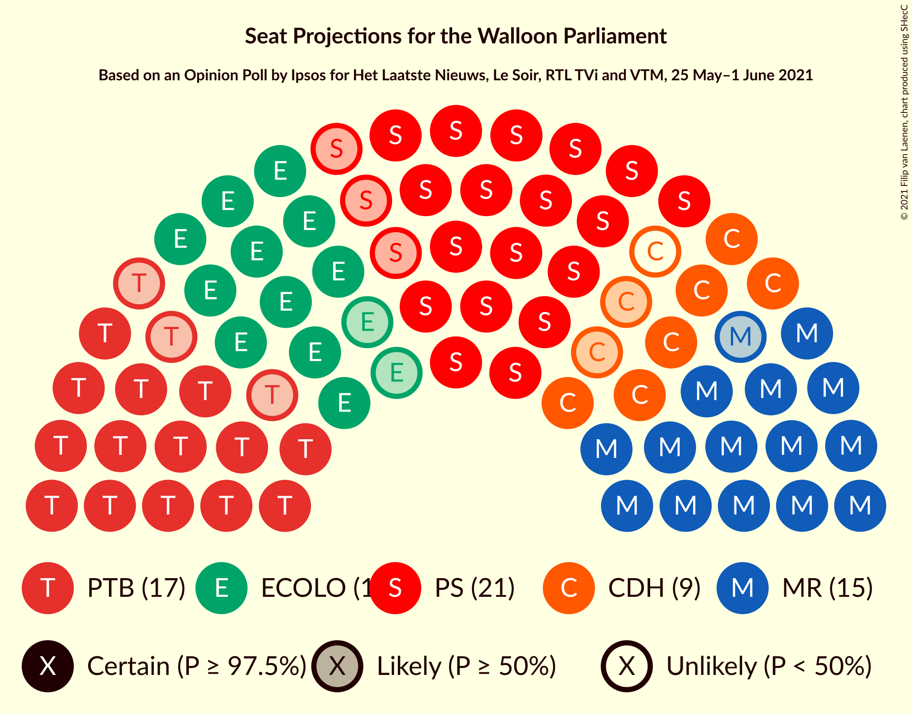

### Confidence Intervals

| Party | Last Result | Median | 80% Confidence Interval | 90% Confidence Interval | 95% Confidence Interval | 99% Confidence Interval |
|:-----:|:-----------:|:------:|:-----------------------:|:-----------------------:|:-----------------------:|:-----------------------:|
| <a href="#parti-socialiste">Parti Socialiste</a> | 23 | 21 | 19–22 |19–23 |18–23 |17–24 |
| <a href="#parti-du-travail-de-belgique">Parti du Travail de Belgique</a> | 10 | 17 | 15–17 |15–18 |14–18 |14–20 |
| <a href="#mouvement-réformateur">Mouvement Réformateur</a> | 20 | 15 | 14–18 |14–19 |14–19 |13–20 |
| <a href="#ecolo">Ecolo</a> | 12 | 13 | 12–14 |11–14 |11–14 |9–15 |
| <a href="#centre-démocrate-humaniste">Centre démocrate humaniste</a> | 10 | 8 | 7–10 |6–11 |6–11 |6–11 |
| <a href="#défi">DéFI</a> | 0 | 0 | 0–4 |0–4 |0–4 |0–5 |

### Parti Socialiste

*For a full overview of the results for this party, see the [Parti Socialiste](party-partisocialiste.html) page.*

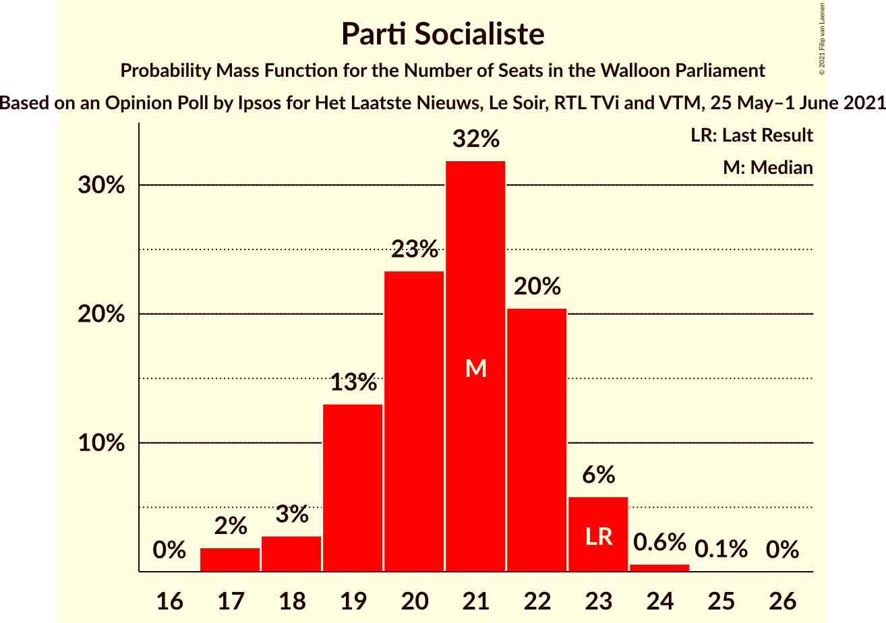

| Number of Seats | Probability | Accumulated | Special Marks |
|:---------------:|:-----------:|:-----------:|:-------------:|
| 17 | 2% | 100% |  |
| 18 | 3% | 98% |  |
| 19 | 13% | 95% |  |
| 20 | 23% | 82% |  |
| 21 | 32% | 59% | Median |
| 22 | 20% | 27% |  |
| 23 | 6% | 7% | Last Result |
| 24 | 0.6% | 0.7% |  |
| 25 | 0.1% | 0.1% |  |
| 26 | 0% | 0% |  |

### Parti du Travail de Belgique

*For a full overview of the results for this party, see the [Parti du Travail de Belgique](party-partidutravaildebelgique.html) page.*

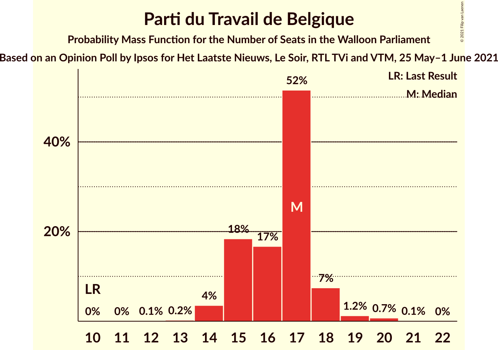

| Number of Seats | Probability | Accumulated | Special Marks |
|:---------------:|:-----------:|:-----------:|:-------------:|
| 10 | 0% | 100% | Last Result |
| 11 | 0% | 100% |  |
| 12 | 0.1% | 99.9% |  |
| 13 | 0.2% | 99.9% |  |
| 14 | 4% | 99.6% |  |
| 15 | 18% | 96% |  |
| 16 | 17% | 78% |  |
| 17 | 52% | 61% | Median |
| 18 | 7% | 9% |  |
| 19 | 1.2% | 2% |  |
| 20 | 0.7% | 0.8% |  |
| 21 | 0.1% | 0.1% |  |
| 22 | 0% | 0% |  |

### Mouvement Réformateur

*For a full overview of the results for this party, see the [Mouvement Réformateur](party-mouvementréformateur.html) page.*

| Number of Seats | Probability | Accumulated | Special Marks |
|:---------------:|:-----------:|:-----------:|:-------------:|
| 12 | 0.1% | 100% |  |
| 13 | 1.2% | 99.9% |  |
| 14 | 26% | 98.6% |  |
| 15 | 24% | 73% | Median |
| 16 | 15% | 49% |  |
| 17 | 16% | 34% |  |
| 18 | 11% | 18% |  |
| 19 | 6% | 7% |  |
| 20 | 0.6% | 0.8% | Last Result |
| 21 | 0.2% | 0.2% |  |
| 22 | 0% | 0% |  |

### Ecolo

*For a full overview of the results for this party, see the [Ecolo](party-ecolo.html) page.*

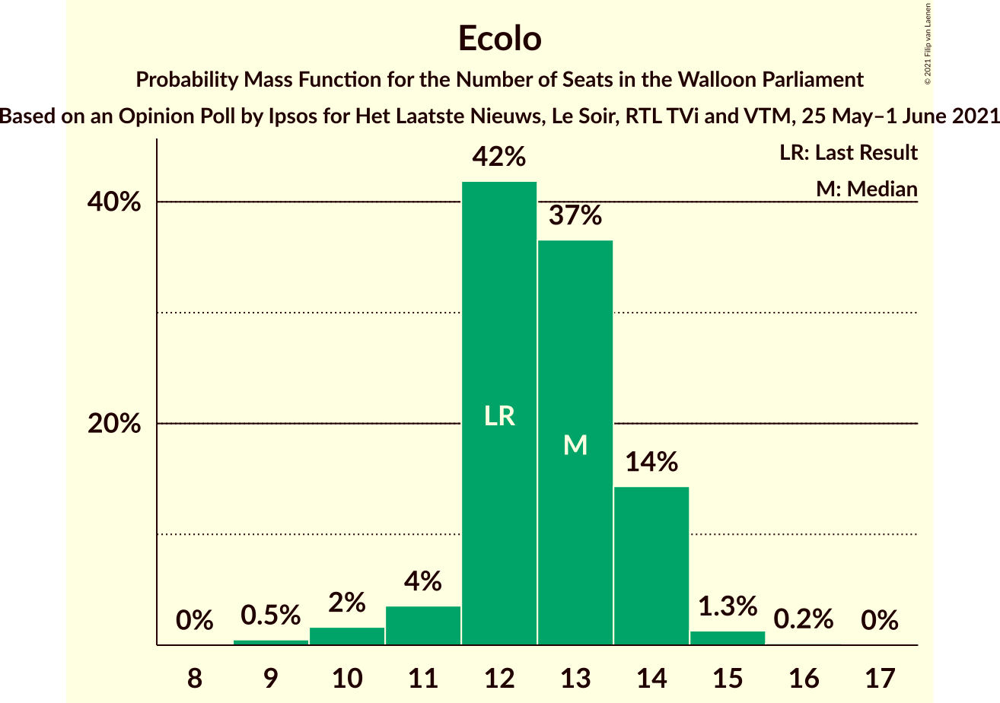

| Number of Seats | Probability | Accumulated | Special Marks |
|:---------------:|:-----------:|:-----------:|:-------------:|
| 9 | 0.5% | 100% |  |
| 10 | 2% | 99.5% |  |
| 11 | 4% | 98% |  |
| 12 | 42% | 94% | Last Result |
| 13 | 37% | 52% | Median |
| 14 | 14% | 16% |  |
| 15 | 1.3% | 1.5% |  |
| 16 | 0.2% | 0.2% |  |
| 17 | 0% | 0% |  |

### Centre démocrate humaniste

*For a full overview of the results for this party, see the [Centre démocrate humaniste](party-centredémocratehumaniste.html) page.*

| Number of Seats | Probability | Accumulated | Special Marks |
|:---------------:|:-----------:|:-----------:|:-------------:|
| 5 | 0.3% | 100% |  |
| 6 | 9% | 99.7% |  |
| 7 | 23% | 91% |  |
| 8 | 22% | 68% | Median |
| 9 | 17% | 46% |  |
| 10 | 20% | 28% | Last Result |
| 11 | 9% | 9% |  |
| 12 | 0.1% | 0.1% |  |
| 13 | 0% | 0% |  |

### DéFI

*For a full overview of the results for this party, see the [DéFI](party-défi.html) page.*

| Number of Seats | Probability | Accumulated | Special Marks |
|:---------------:|:-----------:|:-----------:|:-------------:|
| 0 | 60% | 100% | Last Result, Median |
| 1 | 12% | 40% |  |
| 2 | 5% | 27% |  |
| 3 | 10% | 22% |  |
| 4 | 10% | 12% |  |
| 5 | 2% | 2% |  |
| 6 | 0.1% | 0.1% |  |
| 7 | 0% | 0% |  |

## Coalitions

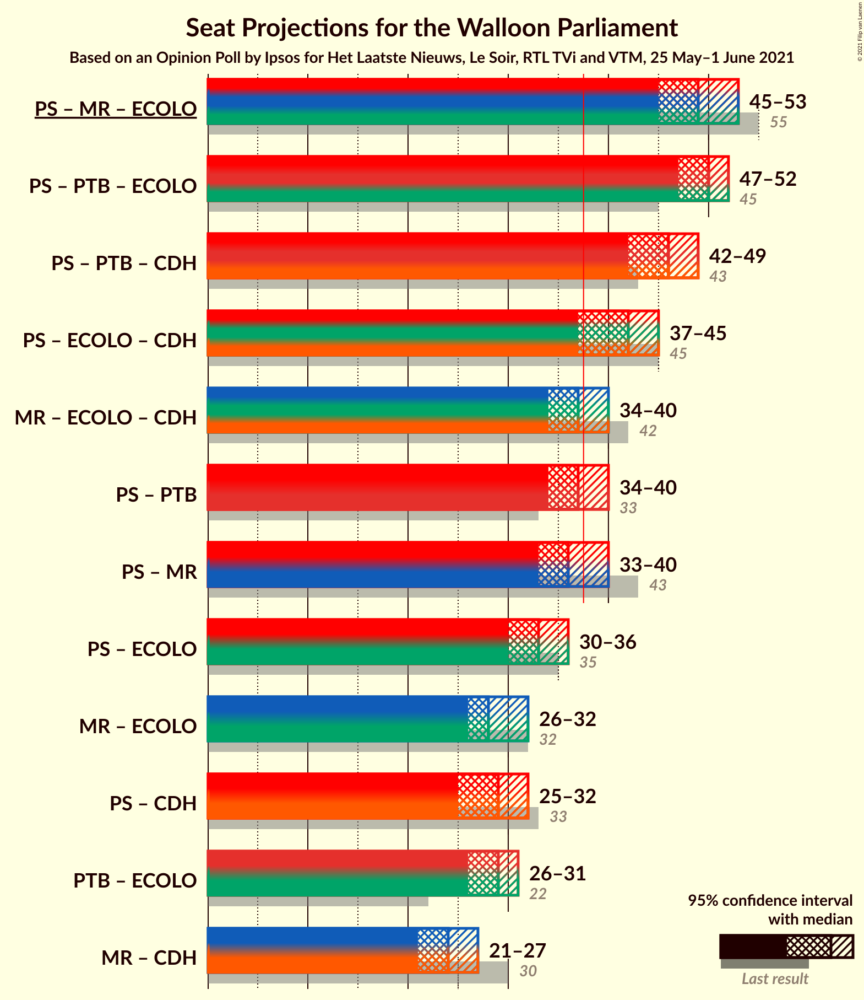

### Confidence Intervals

| Coalition | Last Result | Median | Majority? | 80% Confidence Interval | 90% Confidence Interval | 95% Confidence Interval | 99% Confidence Interval |
|:---------:|:-----------:|:------:|:---------:|:-----------------------:|:-----------------------:|:-----------------------:|:-----------------------:|
| Parti Socialiste – Mouvement Réformateur – Ecolo | 55 | 49 | 100% | 47–51 | 46–52 | 45–53 | 44–54 |
| Parti Socialiste – Parti du Travail de Belgique – Ecolo | 45 | 50 | 100% | 48–52 | 47–52 | 47–52 | 45–53 |
| Parti Socialiste – Parti du Travail de Belgique – Centre démocrate humaniste | 43 | 46 | 100% | 43–48 | 42–49 | 42–49 | 41–49 |
| Parti Socialiste – Ecolo – Centre démocrate humaniste | 45 | 42 | 97% | 39–44 | 38–44 | 37–45 | 37–46 |
| Mouvement Réformateur – Ecolo – Centre démocrate humaniste | 42 | 37 | 33% | 35–39 | 34–39 | 34–40 | 33–42 |
| Parti Socialiste – Parti du Travail de Belgique | 33 | 37 | 45% | 35–39 | 35–39 | 34–40 | 33–41 |
| Parti Socialiste – Mouvement Réformateur | 43 | 36 | 27% | 34–39 | 34–40 | 33–40 | 32–41 |
| Parti Socialiste – Ecolo | 35 | 33 | 0.1% | 31–35 | 31–35 | 30–36 | 29–37 |
| Mouvement Réformateur – Ecolo | 32 | 28 | 0% | 26–31 | 26–32 | 26–32 | 24–33 |
| Parti Socialiste – Centre démocrate humaniste | 33 | 29 | 0% | 26–32 | 26–32 | 25–32 | 24–33 |
| Parti du Travail de Belgique – Ecolo | 22 | 29 | 0% | 27–31 | 27–31 | 26–31 | 25–33 |
| Mouvement Réformateur – Centre démocrate humaniste | 30 | 24 | 0% | 22–26 | 22–27 | 21–27 | 21–29 |

### Parti Socialiste – Mouvement Réformateur – Ecolo

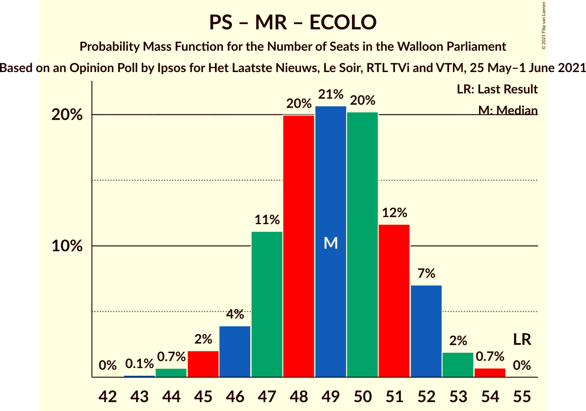

| Number of Seats | Probability | Accumulated | Special Marks |
|:---------------:|:-----------:|:-----------:|:-------------:|
| 43 | 0.1% | 100% |  |
| 44 | 0.7% | 99.8% |  |
| 45 | 2% | 99.2% |  |
| 46 | 4% | 97% |  |
| 47 | 11% | 93% |  |
| 48 | 20% | 82% |  |
| 49 | 21% | 62% | Median |
| 50 | 20% | 41% |  |
| 51 | 12% | 21% |  |
| 52 | 7% | 10% |  |
| 53 | 2% | 3% |  |
| 54 | 0.7% | 0.7% |  |
| 55 | 0% | 0% | Last Result |

### Parti Socialiste – Parti du Travail de Belgique – Ecolo

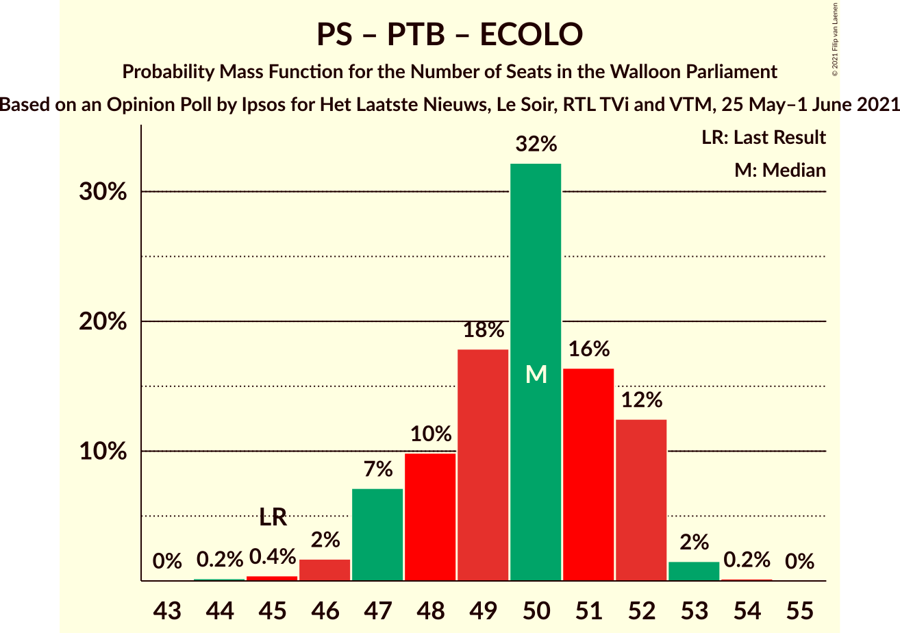

| Number of Seats | Probability | Accumulated | Special Marks |
|:---------------:|:-----------:|:-----------:|:-------------:|
| 43 | 0% | 100% |  |
| 44 | 0.2% | 99.9% |  |
| 45 | 0.4% | 99.8% | Last Result |
| 46 | 2% | 99.4% |  |
| 47 | 7% | 98% |  |
| 48 | 10% | 91% |  |
| 49 | 18% | 81% |  |
| 50 | 32% | 63% |  |
| 51 | 16% | 31% | Median |
| 52 | 12% | 14% |  |
| 53 | 2% | 2% |  |
| 54 | 0.2% | 0.2% |  |
| 55 | 0% | 0% |  |

### Parti Socialiste – Parti du Travail de Belgique – Centre démocrate humaniste

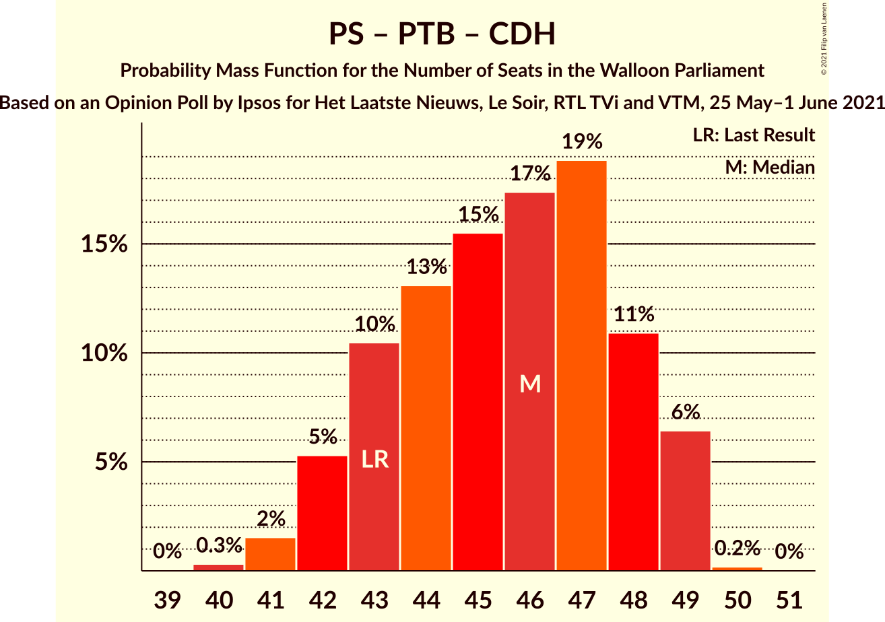

| Number of Seats | Probability | Accumulated | Special Marks |
|:---------------:|:-----------:|:-----------:|:-------------:|
| 40 | 0.3% | 100% |  |
| 41 | 2% | 99.6% |  |
| 42 | 5% | 98% |  |
| 43 | 10% | 93% | Last Result |
| 44 | 13% | 82% |  |
| 45 | 15% | 69% |  |
| 46 | 17% | 54% | Median |
| 47 | 19% | 36% |  |
| 48 | 11% | 18% |  |
| 49 | 6% | 7% |  |
| 50 | 0.2% | 0.2% |  |
| 51 | 0% | 0% |  |

### Parti Socialiste – Ecolo – Centre démocrate humaniste

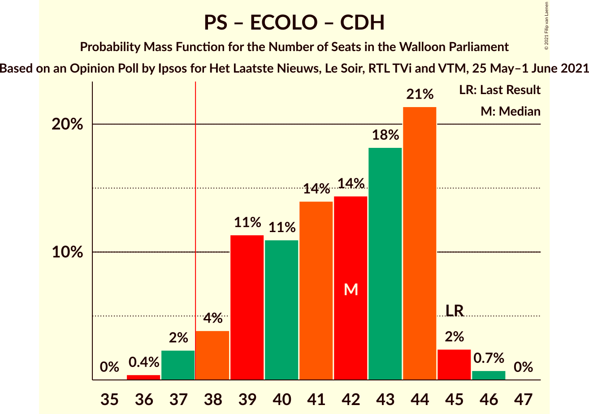

| Number of Seats | Probability | Accumulated | Special Marks |
|:---------------:|:-----------:|:-----------:|:-------------:|
| 36 | 0.4% | 100% |  |
| 37 | 2% | 99.5% |  |
| 38 | 4% | 97% | Majority |
| 39 | 11% | 93% |  |
| 40 | 11% | 82% |  |
| 41 | 14% | 71% |  |
| 42 | 14% | 57% | Median |
| 43 | 18% | 43% |  |
| 44 | 21% | 25% |  |
| 45 | 2% | 3% | Last Result |
| 46 | 0.7% | 0.8% |  |
| 47 | 0% | 0% |  |

### Mouvement Réformateur – Ecolo – Centre démocrate humaniste

| Number of Seats | Probability | Accumulated | Special Marks |
|:---------------:|:-----------:|:-----------:|:-------------:|
| 32 | 0.3% | 100% |  |
| 33 | 2% | 99.7% |  |
| 34 | 7% | 98% |  |
| 35 | 11% | 91% |  |
| 36 | 20% | 79% | Median |
| 37 | 25% | 59% |  |
| 38 | 18% | 33% | Majority |
| 39 | 11% | 15% |  |
| 40 | 3% | 5% |  |
| 41 | 1.0% | 2% |  |
| 42 | 0.5% | 0.5% | Last Result |
| 43 | 0% | 0% |  |

### Parti Socialiste – Parti du Travail de Belgique

| Number of Seats | Probability | Accumulated | Special Marks |
|:---------------:|:-----------:|:-----------:|:-------------:|
| 31 | 0% | 100% |  |
| 32 | 0.2% | 99.9% |  |
| 33 | 1.0% | 99.7% | Last Result |
| 34 | 4% | 98.8% |  |
| 35 | 8% | 95% |  |
| 36 | 18% | 87% |  |
| 37 | 23% | 69% |  |
| 38 | 30% | 45% | Median, Majority |
| 39 | 11% | 15% |  |
| 40 | 4% | 4% |  |
| 41 | 0.5% | 0.6% |  |
| 42 | 0.1% | 0.1% |  |
| 43 | 0% | 0% |  |

### Parti Socialiste – Mouvement Réformateur

| Number of Seats | Probability | Accumulated | Special Marks |
|:---------------:|:-----------:|:-----------:|:-------------:|
| 31 | 0.2% | 100% |  |
| 32 | 0.9% | 99.8% |  |
| 33 | 3% | 98.8% |  |
| 34 | 9% | 96% |  |
| 35 | 15% | 87% |  |
| 36 | 25% | 72% | Median |
| 37 | 20% | 48% |  |
| 38 | 14% | 27% | Majority |
| 39 | 8% | 13% |  |
| 40 | 4% | 5% |  |
| 41 | 1.1% | 1.3% |  |
| 42 | 0.2% | 0.2% |  |
| 43 | 0% | 0% | Last Result |

### Parti Socialiste – Ecolo

| Number of Seats | Probability | Accumulated | Special Marks |
|:---------------:|:-----------:|:-----------:|:-------------:|
| 28 | 0.1% | 100% |  |
| 29 | 0.7% | 99.9% |  |
| 30 | 3% | 99.1% |  |
| 31 | 8% | 96% |  |
| 32 | 15% | 88% |  |
| 33 | 28% | 73% |  |
| 34 | 20% | 46% | Median |
| 35 | 23% | 26% | Last Result |
| 36 | 3% | 3% |  |
| 37 | 0.4% | 0.6% |  |
| 38 | 0.1% | 0.1% | Majority |
| 39 | 0% | 0% |  |

### Mouvement Réformateur – Ecolo

| Number of Seats | Probability | Accumulated | Special Marks |
|:---------------:|:-----------:|:-----------:|:-------------:|
| 23 | 0.1% | 100% |  |
| 24 | 0.4% | 99.9% |  |
| 25 | 2% | 99.4% |  |
| 26 | 12% | 98% |  |
| 27 | 18% | 86% |  |
| 28 | 23% | 68% | Median |
| 29 | 19% | 45% |  |
| 30 | 12% | 25% |  |
| 31 | 8% | 13% |  |
| 32 | 4% | 5% | Last Result |
| 33 | 1.0% | 1.1% |  |
| 34 | 0.1% | 0.1% |  |
| 35 | 0% | 0% |  |

### Parti Socialiste – Centre démocrate humaniste

| Number of Seats | Probability | Accumulated | Special Marks |
|:---------------:|:-----------:|:-----------:|:-------------:|
| 23 | 0.1% | 100% |  |
| 24 | 0.7% | 99.9% |  |
| 25 | 2% | 99.2% |  |
| 26 | 8% | 97% |  |
| 27 | 12% | 89% |  |
| 28 | 15% | 77% |  |
| 29 | 16% | 62% | Median |
| 30 | 21% | 47% |  |
| 31 | 14% | 26% |  |
| 32 | 11% | 12% |  |
| 33 | 0.7% | 0.9% | Last Result |
| 34 | 0.2% | 0.2% |  |
| 35 | 0% | 0% |  |

### Parti du Travail de Belgique – Ecolo

| Number of Seats | Probability | Accumulated | Special Marks |
|:---------------:|:-----------:|:-----------:|:-------------:|
| 22 | 0% | 100% | Last Result |
| 23 | 0.1% | 100% |  |
| 24 | 0.2% | 99.9% |  |
| 25 | 0.6% | 99.7% |  |
| 26 | 2% | 99.1% |  |
| 27 | 8% | 97% |  |
| 28 | 19% | 89% |  |
| 29 | 29% | 70% |  |
| 30 | 30% | 40% | Median |
| 31 | 8% | 10% |  |
| 32 | 2% | 2% |  |
| 33 | 0.6% | 0.7% |  |
| 34 | 0.1% | 0.1% |  |
| 35 | 0% | 0% |  |

### Mouvement Réformateur – Centre démocrate humaniste

| Number of Seats | Probability | Accumulated | Special Marks |
|:---------------:|:-----------:|:-----------:|:-------------:|
| 20 | 0.1% | 100% |  |
| 21 | 3% | 99.9% |  |
| 22 | 14% | 97% |  |
| 23 | 17% | 84% | Median |
| 24 | 22% | 66% |  |
| 25 | 26% | 44% |  |
| 26 | 11% | 18% |  |
| 27 | 5% | 7% |  |
| 28 | 2% | 2% |  |
| 29 | 0.5% | 0.5% |  |
| 30 | 0% | 0.1% | Last Result |
| 31 | 0% | 0% |  |

## Technical Information

### Opinion Poll

+ **Polling firm:** Ipsos
+ **Commissioner(s):** Het Laatste Nieuws, Le Soir, RTL TVi and VTM
+ **Fieldwork period:** 25 May–1 June 2021

### Calculations

+ **Sample size:** 992
+ **Simulations done:** 1,048,576
+ **Error estimate:** 0.55%

