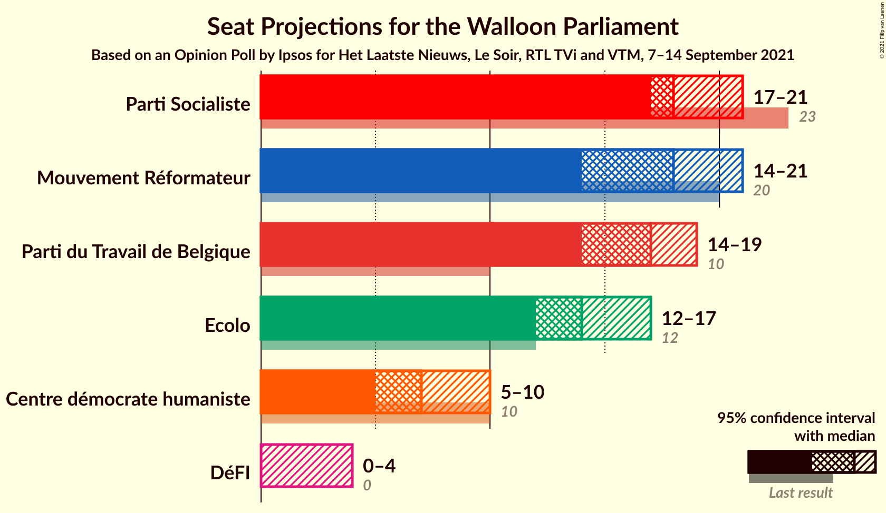
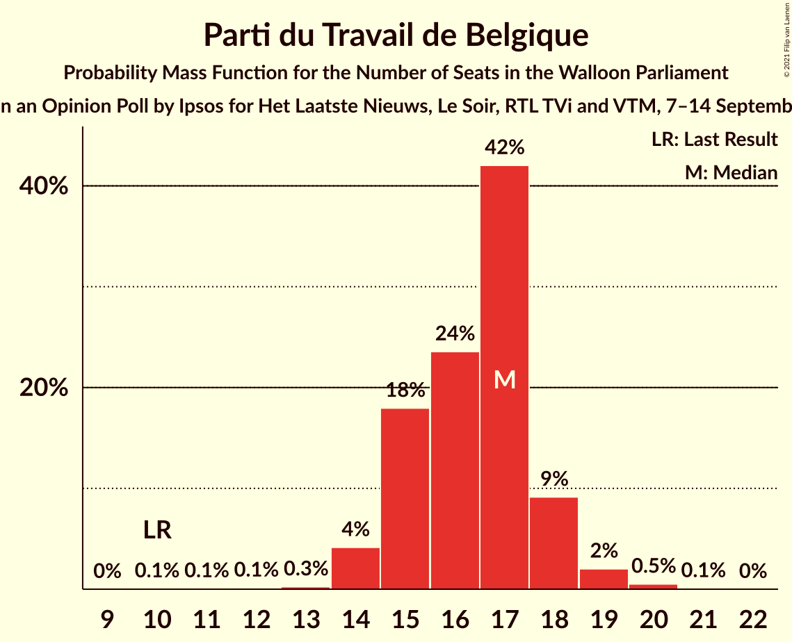
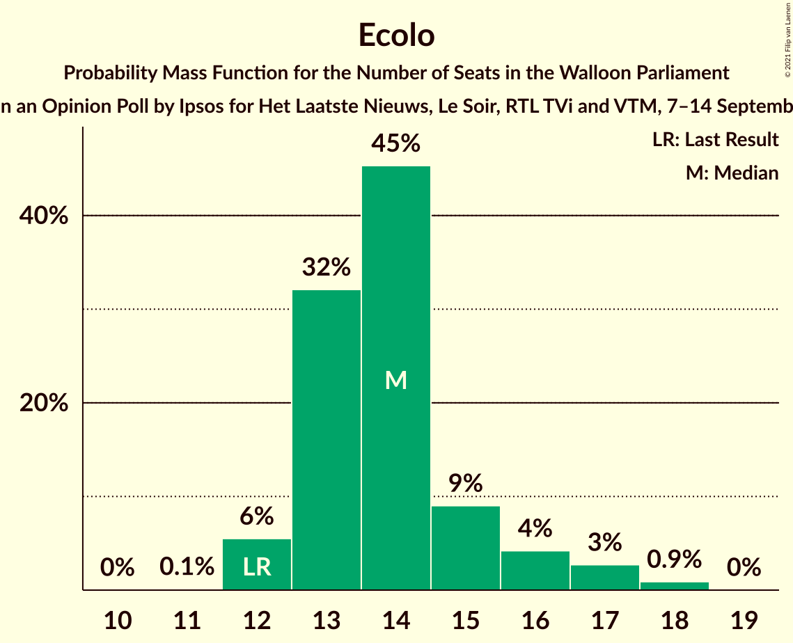
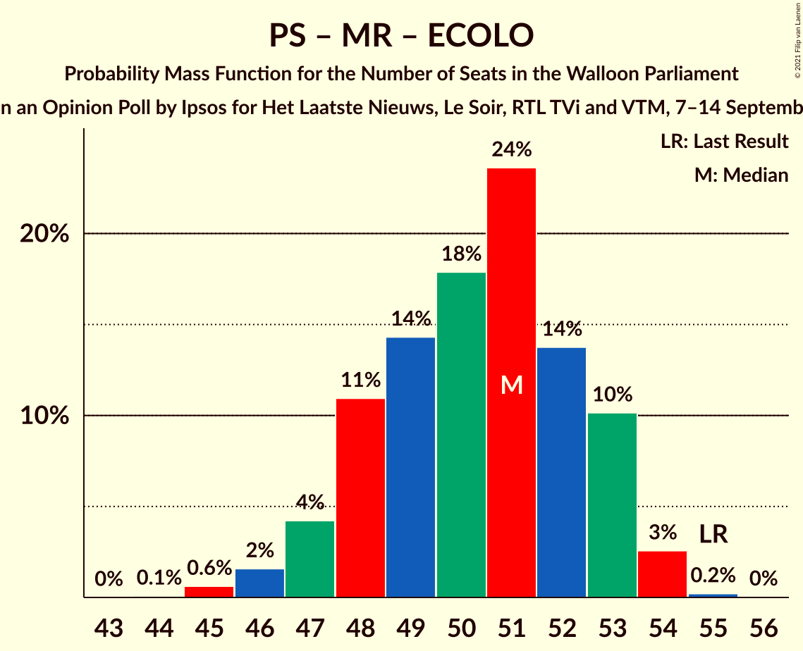
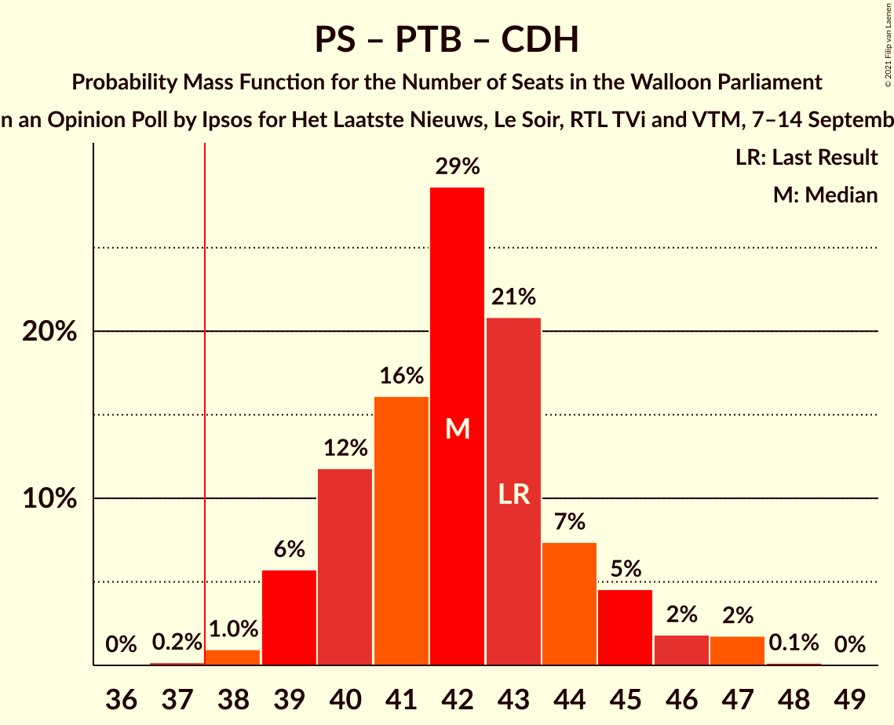
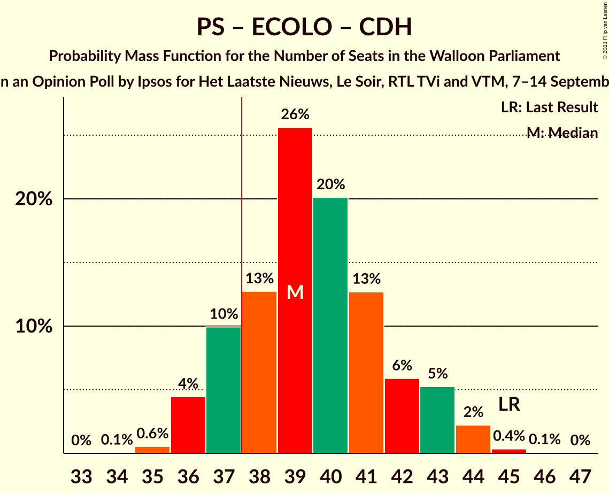
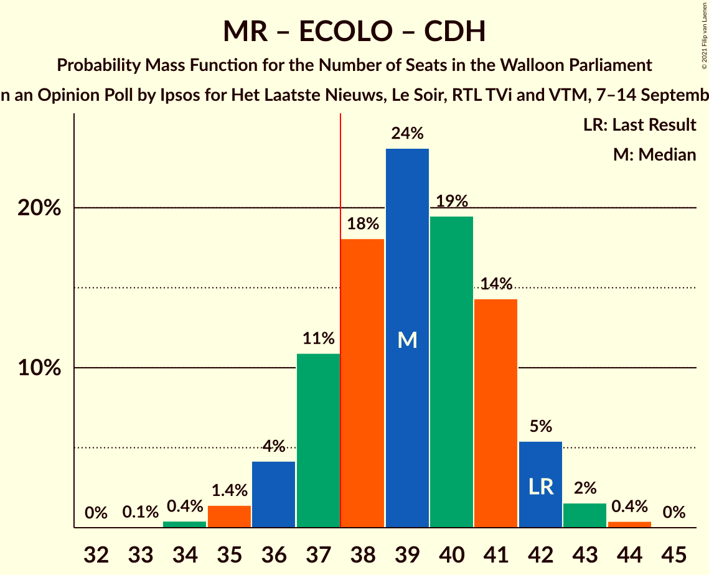

# Opinion Poll by Ipsos for Het Laatste Nieuws, Le Soir, RTL TVi and VTM, 7–14 September 2021

<a href="#voting-intentions">Voting Intentions</a> | <a href="#seats">Seats</a> | <a href="#coalitions">Coalitions</a> | <a href="#technical-information">Technical Information</a>

## Voting Intentions

### Confidence Intervals

| Party | Last Result | Poll Result | 80% Confidence Interval | 90% Confidence Interval | 95% Confidence Interval | 99% Confidence Interval |
|:-----:|:-----------:|:-----------:|:-----------------------:|:-----------------------:|:-----------------------:|:-----------------------:|
| Parti Socialiste | 26.2% | 21.4% | 19.7–23.2% |19.3–23.7% |18.9–24.2% |18.1–25.0% |
| Mouvement Réformateur | 21.4% | 20.3% | 18.7–22.1% |18.2–22.6% |17.8–23.0% |17.1–23.9% |
| Parti du Travail de Belgique | 13.7% | 18.7% | 17.1–20.4% |16.7–20.9% |16.3–21.4% |15.6–22.2% |
| Ecolo | 14.5% | 16.7% | 15.2–18.3% |14.8–18.8% |14.4–19.2% |13.7–20.0% |
| Centre démocrate humaniste | 11.0% | 10.0% | 8.8–11.4% |8.5–11.8% |8.2–12.1% |7.7–12.8% |
| DéFI | 4.1% | 5.1% | 4.2–6.1% |4.0–6.4% |3.8–6.7% |3.5–7.2% |

*Note:* The poll result column reflects the actual value used in the calculations. Published results may vary slightly, and in addition be rounded to fewer digits.

## Seats

### Confidence Intervals

| Party | Last Result | Median | 80% Confidence Interval | 90% Confidence Interval | 95% Confidence Interval | 99% Confidence Interval |
|:-----:|:-----------:|:------:|:-----------------------:|:-----------------------:|:-----------------------:|:-----------------------:|
| <a href="#parti-socialiste">Parti Socialiste</a> | 23 | 19 | 17–20 |17–21 |17–21 |15–22 |
| <a href="#mouvement-réformateur">Mouvement Réformateur</a> | 20 | 18 | 17–20 |15–21 |15–21 |14–21 |
| <a href="#parti-du-travail-de-belgique">Parti du Travail de Belgique</a> | 10 | 16 | 15–18 |15–18 |14–19 |13–20 |
| <a href="#ecolo">Ecolo</a> | 12 | 14 | 13–15 |13–16 |12–17 |12–18 |
| <a href="#centre-démocrate-humaniste">Centre démocrate humaniste</a> | 10 | 7 | 6–9 |6–9 |6–11 |5–11 |
| <a href="#défi">DéFI</a> | 0 | 0 | 0–4 |0–4 |0–5 |0–5 |

### Parti Socialiste

*For a full overview of the results for this party, see the [Parti Socialiste](party-partisocialiste.html) page.*

| Number of Seats | Probability | Accumulated | Special Marks |
|:---------------:|:-----------:|:-----------:|:-------------:|
| 15 | 0.5% | 100% |  |
| 16 | 0.8% | 99.5% |  |
| 17 | 31% | 98.6% |  |
| 18 | 18% | 68% |  |
| 19 | 24% | 50% | Median |
| 20 | 18% | 26% |  |
| 21 | 6% | 8% |  |
| 22 | 2% | 2% |  |
| 23 | 0% | 0% | Last Result |

### Mouvement Réformateur

*For a full overview of the results for this party, see the [Mouvement Réformateur](party-mouvementréformateur.html) page.*

| Number of Seats | Probability | Accumulated | Special Marks |
|:---------------:|:-----------:|:-----------:|:-------------:|
| 14 | 2% | 100% |  |
| 15 | 5% | 98% |  |
| 16 | 2% | 93% |  |
| 17 | 10% | 91% |  |
| 18 | 59% | 81% | Median |
| 19 | 10% | 22% |  |
| 20 | 5% | 11% | Last Result |
| 21 | 6% | 6% |  |
| 22 | 0% | 0% |  |

### Parti du Travail de Belgique

*For a full overview of the results for this party, see the [Parti du Travail de Belgique](party-partidutravaildebelgique.html) page.*

| Number of Seats | Probability | Accumulated | Special Marks |
|:---------------:|:-----------:|:-----------:|:-------------:|
| 10 | 0% | 100% | Last Result |
| 11 | 0.1% | 100% |  |
| 12 | 0.1% | 99.9% |  |
| 13 | 0.3% | 99.8% |  |
| 14 | 3% | 99.5% |  |
| 15 | 19% | 96% |  |
| 16 | 28% | 77% | Median |
| 17 | 39% | 50% |  |
| 18 | 8% | 11% |  |
| 19 | 2% | 3% |  |
| 20 | 0.7% | 0.8% |  |
| 21 | 0.1% | 0.1% |  |
| 22 | 0% | 0% |  |

### Ecolo

*For a full overview of the results for this party, see the [Ecolo](party-ecolo.html) page.*

| Number of Seats | Probability | Accumulated | Special Marks |
|:---------------:|:-----------:|:-----------:|:-------------:|
| 11 | 0.2% | 100% |  |
| 12 | 4% | 99.8% | Last Result |
| 13 | 32% | 96% |  |
| 14 | 47% | 64% | Median |
| 15 | 12% | 17% |  |
| 16 | 2% | 5% |  |
| 17 | 2% | 3% |  |
| 18 | 0.8% | 0.8% |  |
| 19 | 0% | 0% |  |

### Centre démocrate humaniste

*For a full overview of the results for this party, see the [Centre démocrate humaniste](party-centredémocratehumaniste.html) page.*

| Number of Seats | Probability | Accumulated | Special Marks |
|:---------------:|:-----------:|:-----------:|:-------------:|
| 4 | 0.4% | 100% |  |
| 5 | 0.6% | 99.6% |  |
| 6 | 31% | 99.0% |  |
| 7 | 34% | 68% | Median |
| 8 | 22% | 34% |  |
| 9 | 7% | 12% |  |
| 10 | 1.4% | 5% | Last Result |
| 11 | 3% | 3% |  |
| 12 | 0% | 0% |  |

### DéFI

*For a full overview of the results for this party, see the [DéFI](party-défi.html) page.*

| Number of Seats | Probability | Accumulated | Special Marks |
|:---------------:|:-----------:|:-----------:|:-------------:|
| 0 | 62% | 100% | Last Result, Median |
| 1 | 13% | 38% |  |
| 2 | 3% | 25% |  |
| 3 | 6% | 23% |  |
| 4 | 14% | 17% |  |
| 5 | 3% | 3% |  |
| 6 | 0.1% | 0.1% |  |
| 7 | 0% | 0% |  |

## Coalitions

### Confidence Intervals

| Coalition | Last Result | Median | Majority? | 80% Confidence Interval | 90% Confidence Interval | 95% Confidence Interval | 99% Confidence Interval |
|:---------:|:-----------:|:------:|:---------:|:-----------------------:|:-----------------------:|:-----------------------:|:-----------------------:|
| Parti Socialiste – Mouvement Réformateur – Ecolo | 55 | 50 | 100% | 48–53 | 47–53 | 47–54 | 46–54 |
| Parti Socialiste – Parti du Travail de Belgique – Ecolo | 45 | 49 | 100% | 47–51 | 47–51 | 46–52 | 45–53 |
| Parti Socialiste – Parti du Travail de Belgique – Centre démocrate humaniste | 43 | 42 | 99.8% | 40–44 | 39–45 | 39–47 | 38–47 |
| Parti Socialiste – Ecolo – Centre démocrate humaniste | 45 | 39 | 86% | 37–42 | 37–43 | 36–43 | 35–44 |
| Mouvement Réformateur – Ecolo – Centre démocrate humaniste | 42 | 39 | 81% | 37–41 | 37–42 | 36–42 | 34–43 |
| Parti Socialiste – Mouvement Réformateur | 43 | 37 | 28% | 35–39 | 34–39 | 33–40 | 32–41 |
| Parti Socialiste – Parti du Travail de Belgique | 33 | 35 | 6% | 33–37 | 33–38 | 32–38 | 31–39 |
| Parti Socialiste – Ecolo | 35 | 32 | 0.1% | 30–35 | 30–35 | 30–36 | 29–36 |
| Mouvement Réformateur – Ecolo | 32 | 32 | 0% | 30–34 | 29–35 | 28–35 | 27–36 |
| Parti du Travail de Belgique – Ecolo | 22 | 30 | 0% | 28–32 | 28–32 | 28–33 | 27–34 |
| Parti Socialiste – Centre démocrate humaniste | 33 | 26 | 0% | 23–28 | 23–29 | 23–30 | 22–31 |
| Mouvement Réformateur – Centre démocrate humaniste | 30 | 25 | 0% | 24–27 | 23–28 | 22–28 | 21–30 |

### Parti Socialiste – Mouvement Réformateur – Ecolo

| Number of Seats | Probability | Accumulated | Special Marks |
|:---------------:|:-----------:|:-----------:|:-------------:|
| 44 | 0% | 100% |  |
| 45 | 0.4% | 99.9% |  |
| 46 | 1.1% | 99.6% |  |
| 47 | 4% | 98% |  |
| 48 | 9% | 94% |  |
| 49 | 18% | 86% |  |
| 50 | 23% | 68% |  |
| 51 | 16% | 45% | Median |
| 52 | 15% | 29% |  |
| 53 | 11% | 14% |  |
| 54 | 3% | 3% |  |
| 55 | 0.1% | 0.2% | Last Result |
| 56 | 0.1% | 0.1% |  |
| 57 | 0% | 0% |  |

### Parti Socialiste – Parti du Travail de Belgique – Ecolo

| Number of Seats | Probability | Accumulated | Special Marks |
|:---------------:|:-----------:|:-----------:|:-------------:|
| 43 | 0.1% | 100% |  |
| 44 | 0.3% | 99.9% |  |
| 45 | 1.0% | 99.6% | Last Result |
| 46 | 3% | 98.5% |  |
| 47 | 24% | 96% |  |
| 48 | 12% | 71% |  |
| 49 | 30% | 60% | Median |
| 50 | 15% | 30% |  |
| 51 | 12% | 15% |  |
| 52 | 2% | 3% |  |
| 53 | 1.2% | 1.3% |  |
| 54 | 0.1% | 0.1% |  |
| 55 | 0% | 0% |  |

### Parti Socialiste – Parti du Travail de Belgique – Centre démocrate humaniste

| Number of Seats | Probability | Accumulated | Special Marks |
|:---------------:|:-----------:|:-----------:|:-------------:|
| 36 | 0.1% | 100% |  |
| 37 | 0.1% | 99.9% |  |
| 38 | 0.9% | 99.8% | Majority |
| 39 | 8% | 98.9% |  |
| 40 | 12% | 91% |  |
| 41 | 14% | 79% |  |
| 42 | 19% | 65% | Median |
| 43 | 33% | 46% | Last Result |
| 44 | 6% | 13% |  |
| 45 | 2% | 7% |  |
| 46 | 2% | 5% |  |
| 47 | 3% | 3% |  |
| 48 | 0.3% | 0.3% |  |
| 49 | 0% | 0% |  |

### Parti Socialiste – Ecolo – Centre démocrate humaniste

| Number of Seats | Probability | Accumulated | Special Marks |
|:---------------:|:-----------:|:-----------:|:-------------:|
| 35 | 0.6% | 100% |  |
| 36 | 4% | 99.4% |  |
| 37 | 9% | 95% |  |
| 38 | 12% | 86% | Majority |
| 39 | 26% | 74% |  |
| 40 | 17% | 49% | Median |
| 41 | 19% | 32% |  |
| 42 | 6% | 13% |  |
| 43 | 6% | 7% |  |
| 44 | 1.0% | 1.4% |  |
| 45 | 0.4% | 0.4% | Last Result |
| 46 | 0.1% | 0.1% |  |
| 47 | 0% | 0% |  |

### Mouvement Réformateur – Ecolo – Centre démocrate humaniste

| Number of Seats | Probability | Accumulated | Special Marks |
|:---------------:|:-----------:|:-----------:|:-------------:|
| 33 | 0.1% | 100% |  |
| 34 | 0.5% | 99.9% |  |
| 35 | 0.5% | 99.4% |  |
| 36 | 3% | 98.9% |  |
| 37 | 15% | 96% |  |
| 38 | 17% | 81% | Majority |
| 39 | 24% | 64% | Median |
| 40 | 22% | 40% |  |
| 41 | 11% | 18% |  |
| 42 | 4% | 7% | Last Result |
| 43 | 2% | 2% |  |
| 44 | 0.4% | 0.5% |  |
| 45 | 0.1% | 0.1% |  |
| 46 | 0% | 0% |  |

### Parti Socialiste – Mouvement Réformateur

| Number of Seats | Probability | Accumulated | Special Marks |
|:---------------:|:-----------:|:-----------:|:-------------:|
| 31 | 0.4% | 100% |  |
| 32 | 1.4% | 99.6% |  |
| 33 | 2% | 98% |  |
| 34 | 5% | 96% |  |
| 35 | 21% | 91% |  |
| 36 | 20% | 71% |  |
| 37 | 23% | 51% | Median |
| 38 | 17% | 28% | Majority |
| 39 | 6% | 11% |  |
| 40 | 4% | 5% |  |
| 41 | 0.8% | 0.9% |  |
| 42 | 0.1% | 0.1% |  |
| 43 | 0% | 0% | Last Result |

### Parti Socialiste – Parti du Travail de Belgique

| Number of Seats | Probability | Accumulated | Special Marks |
|:---------------:|:-----------:|:-----------:|:-------------:|
| 29 | 0.1% | 100% |  |
| 30 | 0.2% | 99.9% |  |
| 31 | 0.7% | 99.7% |  |
| 32 | 3% | 99.0% |  |
| 33 | 15% | 96% | Last Result |
| 34 | 21% | 81% |  |
| 35 | 25% | 60% | Median |
| 36 | 23% | 34% |  |
| 37 | 6% | 12% |  |
| 38 | 5% | 6% | Majority |
| 39 | 0.2% | 0.5% |  |
| 40 | 0.4% | 0.4% |  |
| 41 | 0% | 0% |  |

### Parti Socialiste – Ecolo

| Number of Seats | Probability | Accumulated | Special Marks |
|:---------------:|:-----------:|:-----------:|:-------------:|
| 28 | 0.1% | 100% |  |
| 29 | 2% | 99.9% |  |
| 30 | 10% | 98% |  |
| 31 | 20% | 89% |  |
| 32 | 27% | 69% |  |
| 33 | 20% | 42% | Median |
| 34 | 9% | 23% |  |
| 35 | 11% | 13% | Last Result |
| 36 | 2% | 3% |  |
| 37 | 0.3% | 0.3% |  |
| 38 | 0% | 0.1% | Majority |
| 39 | 0% | 0% |  |

### Mouvement Réformateur – Ecolo

| Number of Seats | Probability | Accumulated | Special Marks |
|:---------------:|:-----------:|:-----------:|:-------------:|
| 26 | 0.2% | 100% |  |
| 27 | 0.4% | 99.8% |  |
| 28 | 4% | 99.4% |  |
| 29 | 3% | 96% |  |
| 30 | 8% | 93% |  |
| 31 | 18% | 85% |  |
| 32 | 40% | 67% | Last Result, Median |
| 33 | 15% | 27% |  |
| 34 | 7% | 12% |  |
| 35 | 3% | 5% |  |
| 36 | 1.4% | 2% |  |
| 37 | 0.4% | 0.4% |  |
| 38 | 0% | 0% | Majority |

### Parti du Travail de Belgique – Ecolo

| Number of Seats | Probability | Accumulated | Special Marks |
|:---------------:|:-----------:|:-----------:|:-------------:|
| 22 | 0% | 100% | Last Result |
| 23 | 0% | 100% |  |
| 24 | 0.1% | 100% |  |
| 25 | 0.1% | 99.9% |  |
| 26 | 0.3% | 99.8% |  |
| 27 | 1.3% | 99.6% |  |
| 28 | 10% | 98% |  |
| 29 | 13% | 89% |  |
| 30 | 39% | 76% | Median |
| 31 | 21% | 37% |  |
| 32 | 11% | 16% |  |
| 33 | 4% | 5% |  |
| 34 | 0.9% | 1.3% |  |
| 35 | 0.2% | 0.4% |  |
| 36 | 0.1% | 0.1% |  |
| 37 | 0% | 0% |  |

### Parti Socialiste – Centre démocrate humaniste

| Number of Seats | Probability | Accumulated | Special Marks |
|:---------------:|:-----------:|:-----------:|:-------------:|
| 21 | 0.2% | 100% |  |
| 22 | 0.7% | 99.8% |  |
| 23 | 9% | 99.1% |  |
| 24 | 16% | 90% |  |
| 25 | 13% | 73% |  |
| 26 | 34% | 61% | Median |
| 27 | 14% | 26% |  |
| 28 | 4% | 12% |  |
| 29 | 5% | 8% |  |
| 30 | 2% | 3% |  |
| 31 | 0.3% | 0.5% |  |
| 32 | 0.2% | 0.2% |  |
| 33 | 0% | 0% | Last Result |

### Mouvement Réformateur – Centre démocrate humaniste

| Number of Seats | Probability | Accumulated | Special Marks |
|:---------------:|:-----------:|:-----------:|:-------------:|
| 21 | 0.8% | 100% |  |
| 22 | 3% | 99.1% |  |
| 23 | 3% | 96% |  |
| 24 | 28% | 93% |  |
| 25 | 24% | 65% | Median |
| 26 | 23% | 40% |  |
| 27 | 9% | 17% |  |
| 28 | 6% | 8% |  |
| 29 | 1.4% | 2% |  |
| 30 | 0.6% | 0.7% | Last Result |
| 31 | 0% | 0% |  |

## Technical Information

### Opinion Poll

+ **Polling firm:** Ipsos
+ **Commissioner(s):** Het Laatste Nieuws, Le Soir, RTL TVi and VTM
+ **Fieldwork period:** 7–14 September 2021

### Calculations

+ **Sample size:** 930
+ **Simulations done:** 131,072
+ **Error estimate:** 1.46%

