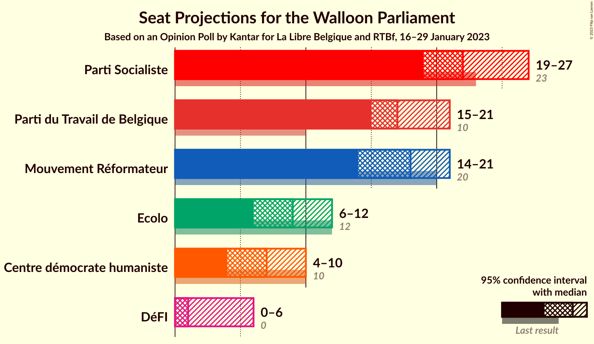
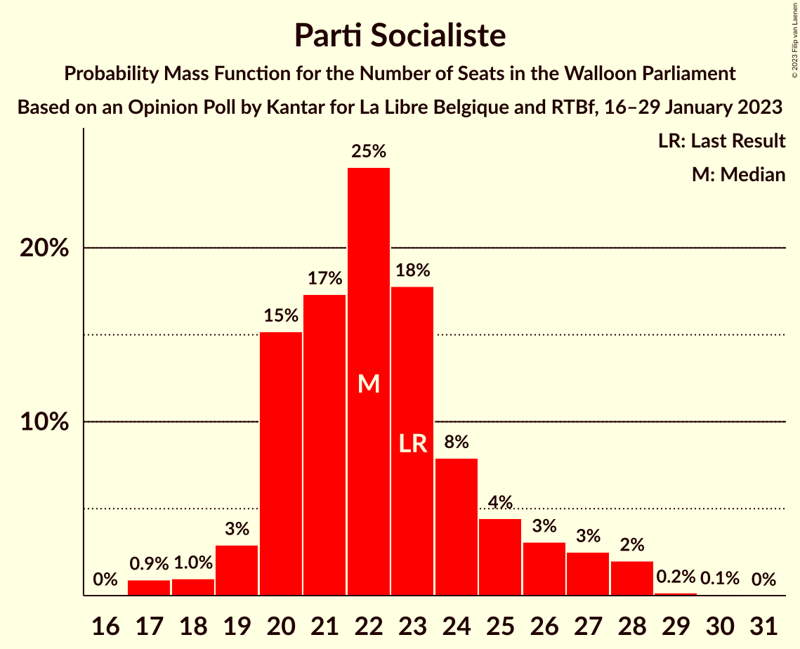
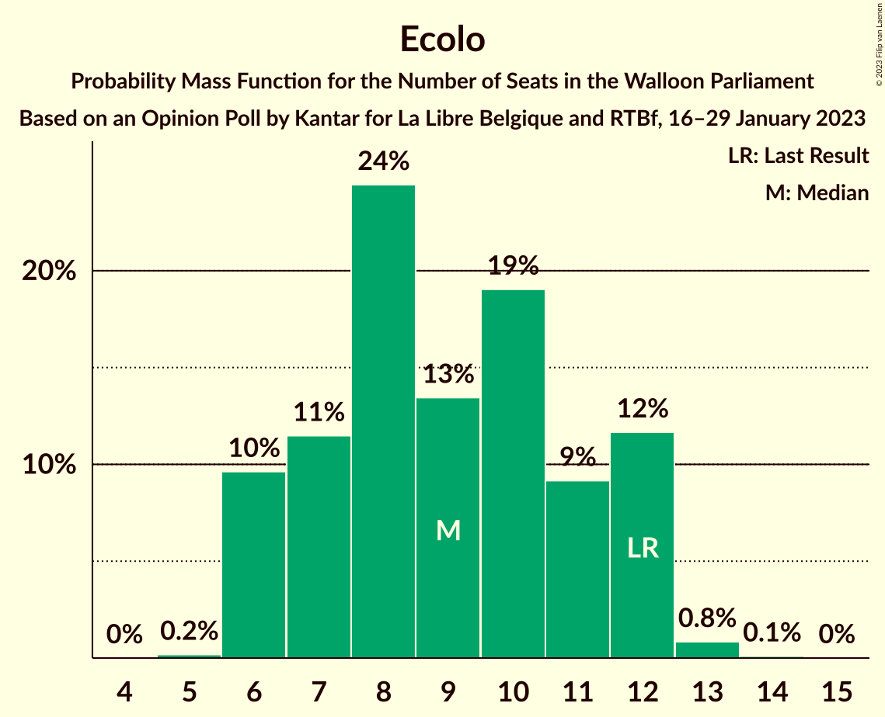
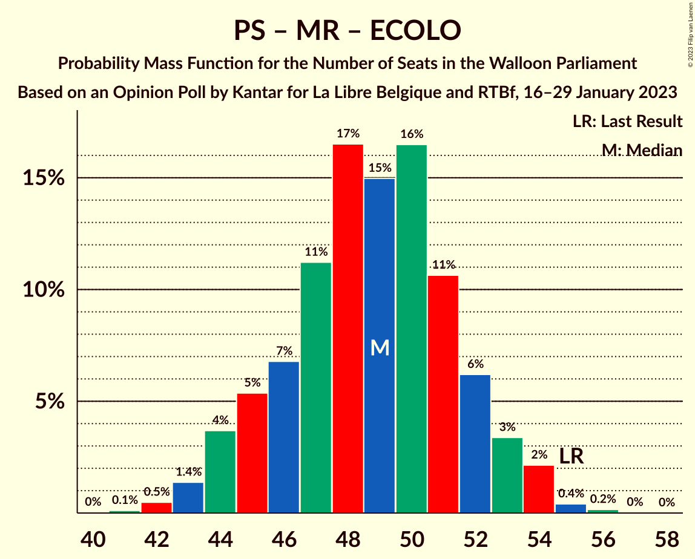
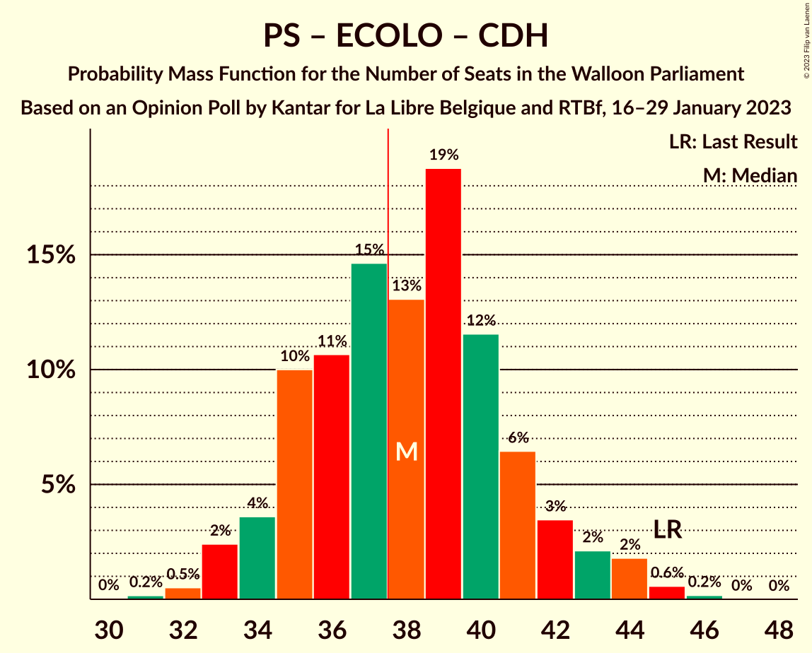

# Opinion Poll by Kantar for La Libre Belgique, 16–29 January 2023

<a href="#voting-intentions">Voting Intentions</a> | <a href="#seats">Seats</a> | <a href="#coalitions">Coalitions</a> | <a href="#technical-information">Technical Information</a>

## Voting Intentions

### Confidence Intervals

| Party | Last Result | Poll Result | 80% Confidence Interval | 90% Confidence Interval | 95% Confidence Interval | 99% Confidence Interval |
|:-----:|:-----------:|:-----------:|:-----------------------:|:-----------------------:|:-----------------------:|:-----------------------:|
| Parti Socialiste | 26.2% | 25.7% | 23.3–28.3% |22.6–29.1% |22.1–29.7% |21.0–31.0% |
| Parti du Travail de Belgique | 13.7% | 20.1% | 18.0–22.6% |17.4–23.3% |16.8–23.9% |15.9–25.1% |
| Mouvement Réformateur | 21.4% | 19.7% | 17.6–22.1% |17.0–22.8% |16.5–23.4% |15.5–24.6% |
| Ecolo | 14.5% | 11.4% | 9.7–13.4% |9.3–13.9% |8.9–14.4% |8.1–15.5% |
| Centre démocrate humaniste | 11.0% | 9.4% | 7.9–11.2% |7.5–11.8% |7.1–12.2% |6.5–13.2% |
| DéFI | 4.1% | 5.4% | 4.3–6.9% |4.0–7.3% |3.7–7.7% |3.3–8.5% |

*Note:* The poll result column reflects the actual value used in the calculations. Published results may vary slightly, and in addition be rounded to fewer digits.

## Seats

### Confidence Intervals

| Party | Last Result | Median | 80% Confidence Interval | 90% Confidence Interval | 95% Confidence Interval | 99% Confidence Interval |
|:-----:|:-----------:|:------:|:-----------------------:|:-----------------------:|:-----------------------:|:-----------------------:|
| <a href="#parti-socialiste">Parti Socialiste</a> | 23 | 22 | 20–26 |19–27 |18–28 |17–28 |
| <a href="#parti-du-travail-de-belgique">Parti du Travail de Belgique</a> | 10 | 17 | 15–20 |15–20 |15–20 |15–23 |
| <a href="#mouvement-réformateur">Mouvement Réformateur</a> | 20 | 18 | 15–19 |14–20 |14–21 |13–21 |
| <a href="#ecolo">Ecolo</a> | 12 | 8 | 7–12 |6–12 |6–12 |6–13 |
| <a href="#centre-démocrate-humaniste">Centre démocrate humaniste</a> | 10 | 7 | 5–10 |4–10 |4–10 |3–11 |
| <a href="#défi">DéFI</a> | 0 | 3 | 0–5 |0–5 |0–5 |0–6 |

### Parti Socialiste

*For a full overview of the results for this party, see the [Parti Socialiste](party-partisocialiste.html) page.*

| Number of Seats | Probability | Accumulated | Special Marks |
|:---------------:|:-----------:|:-----------:|:-------------:|
| 17 | 2% | 100% |  |
| 18 | 2% | 98% |  |
| 19 | 2% | 96% |  |
| 20 | 17% | 94% |  |
| 21 | 20% | 76% |  |
| 22 | 19% | 56% | Median |
| 23 | 12% | 37% | Last Result |
| 24 | 9% | 25% |  |
| 25 | 2% | 16% |  |
| 26 | 6% | 14% |  |
| 27 | 6% | 8% |  |
| 28 | 2% | 3% |  |
| 29 | 0.2% | 0.3% |  |
| 30 | 0.1% | 0.1% |  |
| 31 | 0% | 0% |  |

### Parti du Travail de Belgique

*For a full overview of the results for this party, see the [Parti du Travail de Belgique](party-partidutravaildebelgique.html) page.*

| Number of Seats | Probability | Accumulated | Special Marks |
|:---------------:|:-----------:|:-----------:|:-------------:|
| 10 | 0.1% | 100% | Last Result |
| 11 | 0% | 99.9% |  |
| 12 | 0.2% | 99.9% |  |
| 13 | 0% | 99.7% |  |
| 14 | 0.2% | 99.7% |  |
| 15 | 13% | 99.5% |  |
| 16 | 12% | 86% |  |
| 17 | 35% | 74% | Median |
| 18 | 13% | 39% |  |
| 19 | 16% | 27% |  |
| 20 | 8% | 11% |  |
| 21 | 1.3% | 2% |  |
| 22 | 0.5% | 1.0% |  |
| 23 | 0.5% | 0.5% |  |
| 24 | 0% | 0% |  |

### Mouvement Réformateur

*For a full overview of the results for this party, see the [Mouvement Réformateur](party-mouvementréformateur.html) page.*

| Number of Seats | Probability | Accumulated | Special Marks |
|:---------------:|:-----------:|:-----------:|:-------------:|
| 11 | 0.1% | 100% |  |
| 12 | 0.1% | 99.9% |  |
| 13 | 0.6% | 99.9% |  |
| 14 | 7% | 99.3% |  |
| 15 | 13% | 92% |  |
| 16 | 3% | 79% |  |
| 17 | 20% | 76% |  |
| 18 | 21% | 56% | Median |
| 19 | 27% | 35% |  |
| 20 | 3% | 8% | Last Result |
| 21 | 4% | 4% |  |
| 22 | 0.4% | 0.4% |  |
| 23 | 0% | 0.1% |  |
| 24 | 0% | 0% |  |

### Ecolo

*For a full overview of the results for this party, see the [Ecolo](party-ecolo.html) page.*

| Number of Seats | Probability | Accumulated | Special Marks |
|:---------------:|:-----------:|:-----------:|:-------------:|
| 5 | 0.2% | 100% |  |
| 6 | 9% | 99.8% |  |
| 7 | 23% | 90% |  |
| 8 | 29% | 68% | Median |
| 9 | 0.3% | 39% |  |
| 10 | 11% | 39% |  |
| 11 | 14% | 28% |  |
| 12 | 13% | 14% | Last Result |
| 13 | 0.5% | 0.6% |  |
| 14 | 0.2% | 0.2% |  |
| 15 | 0% | 0% |  |

### Centre démocrate humaniste

*For a full overview of the results for this party, see the [Centre démocrate humaniste](party-centredémocratehumaniste.html) page.*

| Number of Seats | Probability | Accumulated | Special Marks |
|:---------------:|:-----------:|:-----------:|:-------------:|
| 2 | 0.1% | 100% |  |
| 3 | 0.5% | 99.9% |  |
| 4 | 8% | 99.4% |  |
| 5 | 4% | 91% |  |
| 6 | 27% | 88% |  |
| 7 | 31% | 61% | Median |
| 8 | 15% | 29% |  |
| 9 | 4% | 14% |  |
| 10 | 8% | 10% | Last Result |
| 11 | 2% | 2% |  |
| 12 | 0% | 0.1% |  |
| 13 | 0% | 0% |  |

### DéFI

*For a full overview of the results for this party, see the [DéFI](party-défi.html) page.*

| Number of Seats | Probability | Accumulated | Special Marks |
|:---------------:|:-----------:|:-----------:|:-------------:|
| 0 | 43% | 100% | Last Result |
| 1 | 5% | 57% |  |
| 2 | 0.3% | 52% |  |
| 3 | 13% | 51% | Median |
| 4 | 24% | 39% |  |
| 5 | 14% | 15% |  |
| 6 | 1.2% | 1.3% |  |
| 7 | 0% | 0% |  |

## Coalitions

### Confidence Intervals

| Coalition | Last Result | Median | Majority? | 80% Confidence Interval | 90% Confidence Interval | 95% Confidence Interval | 99% Confidence Interval |
|:---------:|:-----------:|:------:|:---------:|:-----------------------:|:-----------------------:|:-----------------------:|:-----------------------:|
| Parti Socialiste – Mouvement Réformateur – Ecolo | 55 | 49 | 100% | 45–52 | 44–52 | 43–53 | 42–54 |
| Parti Socialiste – Parti du Travail de Belgique – Ecolo | 45 | 49 | 100% | 46–50 | 44–51 | 43–53 | 42–57 |
| Parti Socialiste – Parti du Travail de Belgique – Centre démocrate humaniste | 43 | 46 | 100% | 42–51 | 42–52 | 42–52 | 41–54 |
| Parti Socialiste – Mouvement Réformateur | 43 | 40 | 79% | 36–43 | 35–45 | 34–46 | 33–46 |
| Parti Socialiste – Parti du Travail de Belgique | 33 | 39 | 81% | 36–43 | 36–44 | 35–45 | 35–46 |
| Parti Socialiste – Ecolo – Centre démocrate humaniste | 45 | 38 | 60% | 35–41 | 33–42 | 33–44 | 32–45 |
| Mouvement Réformateur – Ecolo – Centre démocrate humaniste | 42 | 33 | 1.1% | 31–36 | 30–36 | 30–36 | 27–39 |
| Parti Socialiste – Ecolo | 35 | 32 | 2% | 28–33 | 28–35 | 26–36 | 25–39 |
| Parti Socialiste – Centre démocrate humaniste | 33 | 30 | 0% | 26–33 | 25–34 | 24–34 | 22–37 |
| Mouvement Réformateur – Ecolo | 32 | 26 | 0% | 23–30 | 22–30 | 22–30 | 21–32 |
| Parti du Travail de Belgique – Ecolo | 22 | 26 | 0% | 23–28 | 23–30 | 22–30 | 22–33 |
| Mouvement Réformateur – Centre démocrate humaniste | 30 | 24 | 0% | 22–26 | 22–28 | 20–29 | 18–30 |

### Parti Socialiste – Mouvement Réformateur – Ecolo

| Number of Seats | Probability | Accumulated | Special Marks |
|:---------------:|:-----------:|:-----------:|:-------------:|
| 41 | 0.2% | 100% |  |
| 42 | 2% | 99.8% |  |
| 43 | 1.0% | 98% |  |
| 44 | 5% | 97% |  |
| 45 | 6% | 92% |  |
| 46 | 7% | 86% |  |
| 47 | 15% | 79% |  |
| 48 | 7% | 64% | Median |
| 49 | 14% | 57% |  |
| 50 | 27% | 43% |  |
| 51 | 2% | 15% |  |
| 52 | 10% | 14% |  |
| 53 | 2% | 3% |  |
| 54 | 0.6% | 1.0% |  |
| 55 | 0.2% | 0.4% | Last Result |
| 56 | 0.2% | 0.2% |  |
| 57 | 0% | 0% |  |

### Parti Socialiste – Parti du Travail de Belgique – Ecolo

| Number of Seats | Probability | Accumulated | Special Marks |
|:---------------:|:-----------:|:-----------:|:-------------:|
| 42 | 1.3% | 100% |  |
| 43 | 3% | 98.7% |  |
| 44 | 3% | 96% |  |
| 45 | 1.0% | 93% | Last Result |
| 46 | 5% | 92% |  |
| 47 | 17% | 87% | Median |
| 48 | 17% | 70% |  |
| 49 | 25% | 53% |  |
| 50 | 21% | 28% |  |
| 51 | 3% | 7% |  |
| 52 | 0.9% | 4% |  |
| 53 | 0.8% | 3% |  |
| 54 | 0.1% | 2% |  |
| 55 | 1.2% | 2% |  |
| 56 | 0.2% | 1.2% |  |
| 57 | 1.0% | 1.0% |  |
| 58 | 0% | 0% |  |

### Parti Socialiste – Parti du Travail de Belgique – Centre démocrate humaniste

| Number of Seats | Probability | Accumulated | Special Marks |
|:---------------:|:-----------:|:-----------:|:-------------:|
| 40 | 0.1% | 100% |  |
| 41 | 2% | 99.9% |  |
| 42 | 10% | 98% |  |
| 43 | 4% | 88% | Last Result |
| 44 | 6% | 84% |  |
| 45 | 20% | 78% |  |
| 46 | 10% | 57% | Median |
| 47 | 13% | 48% |  |
| 48 | 4% | 35% |  |
| 49 | 10% | 31% |  |
| 50 | 9% | 20% |  |
| 51 | 6% | 11% |  |
| 52 | 4% | 6% |  |
| 53 | 1.1% | 2% |  |
| 54 | 0.7% | 0.7% |  |
| 55 | 0% | 0% |  |

### Parti Socialiste – Mouvement Réformateur

| Number of Seats | Probability | Accumulated | Special Marks |
|:---------------:|:-----------:|:-----------:|:-------------:|
| 31 | 0.1% | 100% |  |
| 32 | 0.3% | 99.9% |  |
| 33 | 0.9% | 99.7% |  |
| 34 | 2% | 98.7% |  |
| 35 | 3% | 97% |  |
| 36 | 7% | 94% |  |
| 37 | 7% | 86% |  |
| 38 | 18% | 79% | Majority |
| 39 | 6% | 61% |  |
| 40 | 15% | 55% | Median |
| 41 | 12% | 40% |  |
| 42 | 14% | 28% |  |
| 43 | 8% | 15% | Last Result |
| 44 | 1.2% | 6% |  |
| 45 | 0.4% | 5% |  |
| 46 | 4% | 5% |  |
| 47 | 0.1% | 0.4% |  |
| 48 | 0.2% | 0.2% |  |
| 49 | 0% | 0% |  |

### Parti Socialiste – Parti du Travail de Belgique

| Number of Seats | Probability | Accumulated | Special Marks |
|:---------------:|:-----------:|:-----------:|:-------------:|
| 33 | 0.2% | 100% | Last Result |
| 34 | 0.3% | 99.8% |  |
| 35 | 3% | 99.5% |  |
| 36 | 13% | 97% |  |
| 37 | 2% | 83% |  |
| 38 | 13% | 81% | Majority |
| 39 | 27% | 69% | Median |
| 40 | 10% | 41% |  |
| 41 | 2% | 31% |  |
| 42 | 12% | 29% |  |
| 43 | 8% | 17% |  |
| 44 | 6% | 9% |  |
| 45 | 1.5% | 3% |  |
| 46 | 1.3% | 2% |  |
| 47 | 0.1% | 0.2% |  |
| 48 | 0% | 0.1% |  |
| 49 | 0.1% | 0.1% |  |
| 50 | 0% | 0% |  |

### Parti Socialiste – Ecolo – Centre démocrate humaniste

| Number of Seats | Probability | Accumulated | Special Marks |
|:---------------:|:-----------:|:-----------:|:-------------:|
| 31 | 0.4% | 100% |  |
| 32 | 0.2% | 99.6% |  |
| 33 | 6% | 99.4% |  |
| 34 | 0.9% | 93% |  |
| 35 | 9% | 92% |  |
| 36 | 10% | 84% |  |
| 37 | 14% | 74% | Median |
| 38 | 17% | 60% | Majority |
| 39 | 20% | 43% |  |
| 40 | 10% | 23% |  |
| 41 | 6% | 13% |  |
| 42 | 2% | 7% |  |
| 43 | 1.2% | 4% |  |
| 44 | 3% | 3% |  |
| 45 | 0.5% | 0.6% | Last Result |
| 46 | 0.1% | 0.1% |  |
| 47 | 0% | 0% |  |

### Mouvement Réformateur – Ecolo – Centre démocrate humaniste

| Number of Seats | Probability | Accumulated | Special Marks |
|:---------------:|:-----------:|:-----------:|:-------------:|
| 25 | 0.2% | 100% |  |
| 26 | 0.3% | 99.8% |  |
| 27 | 0.1% | 99.5% |  |
| 28 | 0.4% | 99.4% |  |
| 29 | 1.3% | 99.0% |  |
| 30 | 5% | 98% |  |
| 31 | 17% | 93% |  |
| 32 | 24% | 76% |  |
| 33 | 14% | 52% | Median |
| 34 | 3% | 38% |  |
| 35 | 5% | 35% |  |
| 36 | 28% | 30% |  |
| 37 | 0.9% | 2% |  |
| 38 | 0.5% | 1.1% | Majority |
| 39 | 0.1% | 0.5% |  |
| 40 | 0.1% | 0.4% |  |
| 41 | 0.3% | 0.3% |  |
| 42 | 0% | 0% | Last Result |

### Parti Socialiste – Ecolo

| Number of Seats | Probability | Accumulated | Special Marks |
|:---------------:|:-----------:|:-----------:|:-------------:|
| 25 | 2% | 100% |  |
| 26 | 1.0% | 98% |  |
| 27 | 0.4% | 97% |  |
| 28 | 11% | 97% |  |
| 29 | 18% | 86% |  |
| 30 | 12% | 67% | Median |
| 31 | 3% | 56% |  |
| 32 | 29% | 53% |  |
| 33 | 16% | 24% |  |
| 34 | 2% | 8% |  |
| 35 | 2% | 6% | Last Result |
| 36 | 1.1% | 3% |  |
| 37 | 0.1% | 2% |  |
| 38 | 0.8% | 2% | Majority |
| 39 | 1.1% | 1.2% |  |
| 40 | 0% | 0.1% |  |
| 41 | 0% | 0% |  |

### Parti Socialiste – Centre démocrate humaniste

| Number of Seats | Probability | Accumulated | Special Marks |
|:---------------:|:-----------:|:-----------:|:-------------:|
| 22 | 0.6% | 100% |  |
| 23 | 2% | 99.4% |  |
| 24 | 0.3% | 98% |  |
| 25 | 6% | 97% |  |
| 26 | 11% | 91% |  |
| 27 | 6% | 80% |  |
| 28 | 21% | 74% |  |
| 29 | 3% | 53% | Median |
| 30 | 22% | 50% |  |
| 31 | 7% | 28% |  |
| 32 | 7% | 21% |  |
| 33 | 7% | 14% | Last Result |
| 34 | 5% | 7% |  |
| 35 | 0.2% | 2% |  |
| 36 | 0.9% | 2% |  |
| 37 | 0.6% | 0.7% |  |
| 38 | 0% | 0% | Majority |

### Mouvement Réformateur – Ecolo

| Number of Seats | Probability | Accumulated | Special Marks |
|:---------------:|:-----------:|:-----------:|:-------------:|
| 20 | 0.1% | 100% |  |
| 21 | 2% | 99.8% |  |
| 22 | 7% | 98% |  |
| 23 | 4% | 92% |  |
| 24 | 6% | 88% |  |
| 25 | 23% | 82% |  |
| 26 | 19% | 59% | Median |
| 27 | 8% | 39% |  |
| 28 | 10% | 31% |  |
| 29 | 5% | 21% |  |
| 30 | 15% | 16% |  |
| 31 | 0.5% | 1.2% |  |
| 32 | 0.4% | 0.7% | Last Result |
| 33 | 0.3% | 0.3% |  |
| 34 | 0% | 0% |  |

### Parti du Travail de Belgique – Ecolo

| Number of Seats | Probability | Accumulated | Special Marks |
|:---------------:|:-----------:|:-----------:|:-------------:|
| 19 | 0.1% | 100% |  |
| 20 | 0.1% | 99.9% |  |
| 21 | 0.3% | 99.8% |  |
| 22 | 2% | 99.6% | Last Result |
| 23 | 15% | 97% |  |
| 24 | 10% | 83% |  |
| 25 | 3% | 72% | Median |
| 26 | 21% | 70% |  |
| 27 | 20% | 49% |  |
| 28 | 20% | 29% |  |
| 29 | 3% | 9% |  |
| 30 | 4% | 6% |  |
| 31 | 2% | 2% |  |
| 32 | 0.2% | 0.8% |  |
| 33 | 0.5% | 0.5% |  |
| 34 | 0% | 0% |  |

### Mouvement Réformateur – Centre démocrate humaniste

| Number of Seats | Probability | Accumulated | Special Marks |
|:---------------:|:-----------:|:-----------:|:-------------:|
| 17 | 0.2% | 100% |  |
| 18 | 1.3% | 99.8% |  |
| 19 | 0.8% | 98.6% |  |
| 20 | 1.1% | 98% |  |
| 21 | 0.6% | 97% |  |
| 22 | 11% | 96% |  |
| 23 | 13% | 85% |  |
| 24 | 24% | 73% |  |
| 25 | 22% | 49% | Median |
| 26 | 18% | 27% |  |
| 27 | 0.4% | 9% |  |
| 28 | 4% | 8% |  |
| 29 | 3% | 4% |  |
| 30 | 0.8% | 0.9% | Last Result |
| 31 | 0.1% | 0.1% |  |
| 32 | 0% | 0% |  |

## Technical Information

### Opinion Poll

+ **Polling firm:** Kantar
+ **Commissioner(s):** La Libre Belgique
+ **Fieldwork period:** 16–29 January 2023

### Calculations

+ **Sample size:** 502
+ **Simulations done:** 16,384
+ **Error estimate:** 3.14%

