# Opinion Poll by Ipsos for Het Laatste Nieuws, Le Soir, RTL TVi and VTM, 20–27 March 2023

<a href="#voting-intentions">Voting Intentions</a> | <a href="#seats">Seats</a> | <a href="#coalitions">Coalitions</a> | <a href="#technical-information">Technical Information</a>

## Voting Intentions

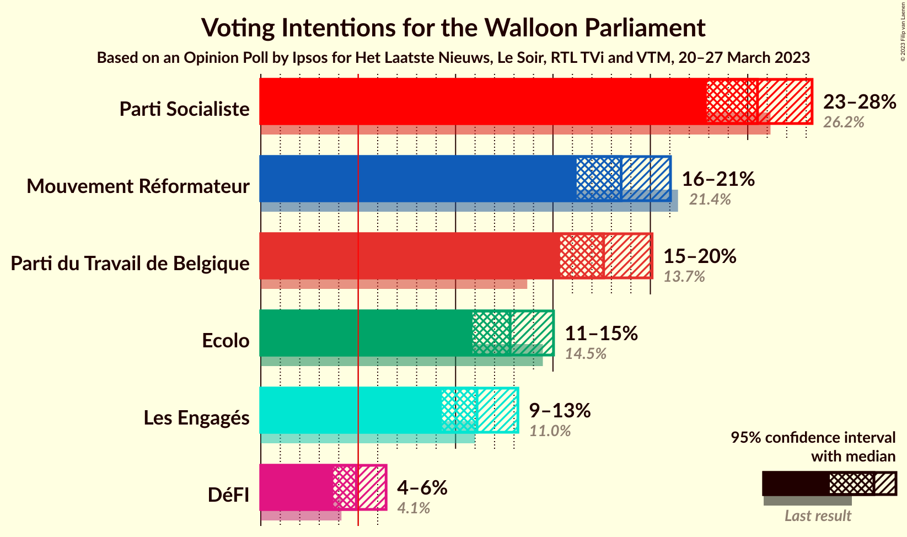

### Confidence Intervals

| Party | Last Result | Poll Result | 80% Confidence Interval | 90% Confidence Interval | 95% Confidence Interval | 99% Confidence Interval |
|:-----:|:-----------:|:-----------:|:-----------------------:|:-----------------------:|:-----------------------:|:-----------------------:|
| Parti Socialiste | 26.2% | 25.5% | 23.8–27.3% |23.3–27.8% |22.9–28.3% |22.1–29.2% |
| Mouvement Réformateur | 21.4% | 18.5% | 17.0–20.1% |16.6–20.6% |16.2–21.0% |15.5–21.8% |
| Parti du Travail de Belgique | 13.7% | 17.6% | 16.1–19.2% |15.7–19.7% |15.4–20.1% |14.7–20.9% |
| Ecolo | 14.5% | 12.8% | 11.5–14.3% |11.2–14.7% |10.9–15.0% |10.3–15.7% |
| Les Engagés | 11.0% | 11.1% | 9.9–12.5% |9.6–12.9% |9.3–13.2% |8.7–13.9% |
| DéFI | 4.1% | 4.9% | 4.1–5.9% |3.9–6.2% |3.7–6.4% |3.4–6.9% |

*Note:* The poll result column reflects the actual value used in the calculations. Published results may vary slightly, and in addition be rounded to fewer digits.

## Seats

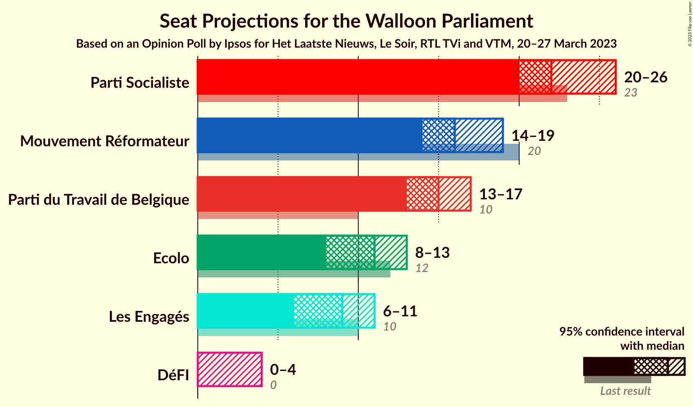

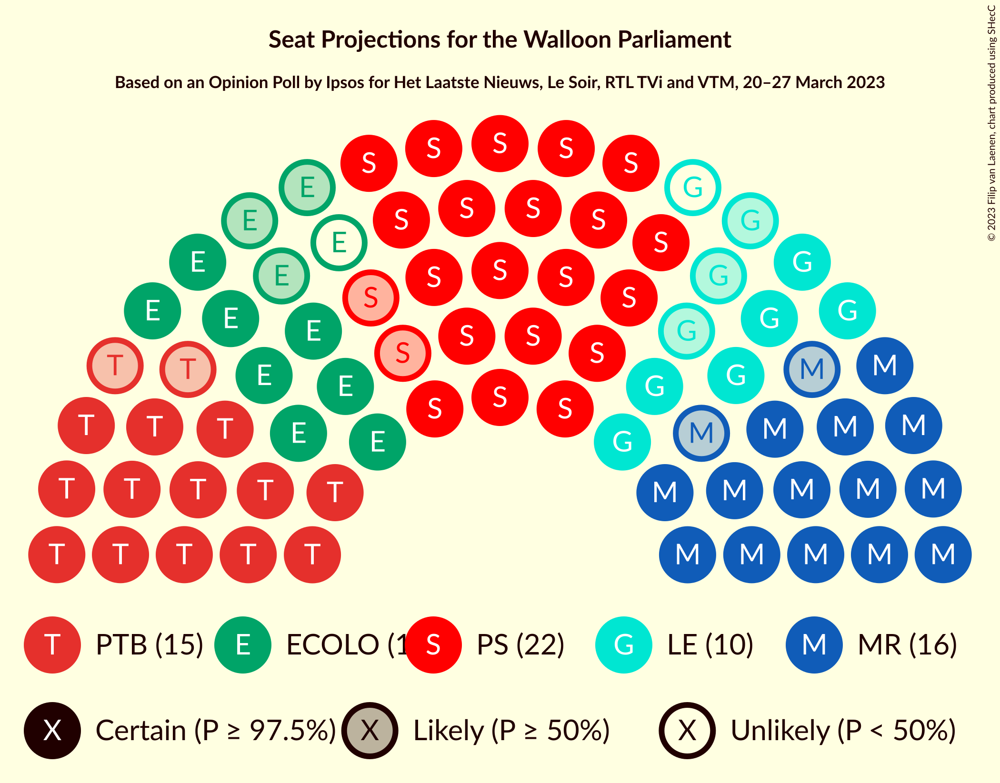

### Confidence Intervals

| Party | Last Result | Median | 80% Confidence Interval | 90% Confidence Interval | 95% Confidence Interval | 99% Confidence Interval |
|:-----:|:-----------:|:------:|:-----------------------:|:-----------------------:|:-----------------------:|:-----------------------:|
| <a href="#parti-socialiste">Parti Socialiste</a> | 23 | 22 | 21–24 |20–24 |20–26 |19–27 |
| <a href="#mouvement-réformateur">Mouvement Réformateur</a> | 20 | 16 | 14–18 |14–19 |14–19 |13–20 |
| <a href="#parti-du-travail-de-belgique">Parti du Travail de Belgique</a> | 10 | 15 | 14–17 |14–17 |13–17 |11–18 |
| <a href="#ecolo">Ecolo</a> | 12 | 11 | 9–12 |9–12 |8–13 |7–13 |
| <a href="#les-engagés">Les Engagés</a> | 10 | 9 | 7–11 |7–11 |6–11 |6–12 |
| <a href="#défi">DéFI</a> | 0 | 0 | 0–4 |0–4 |0–4 |0–5 |

### Parti Socialiste

*For a full overview of the results for this party, see the [Parti Socialiste](party-partisocialiste.html) page.*

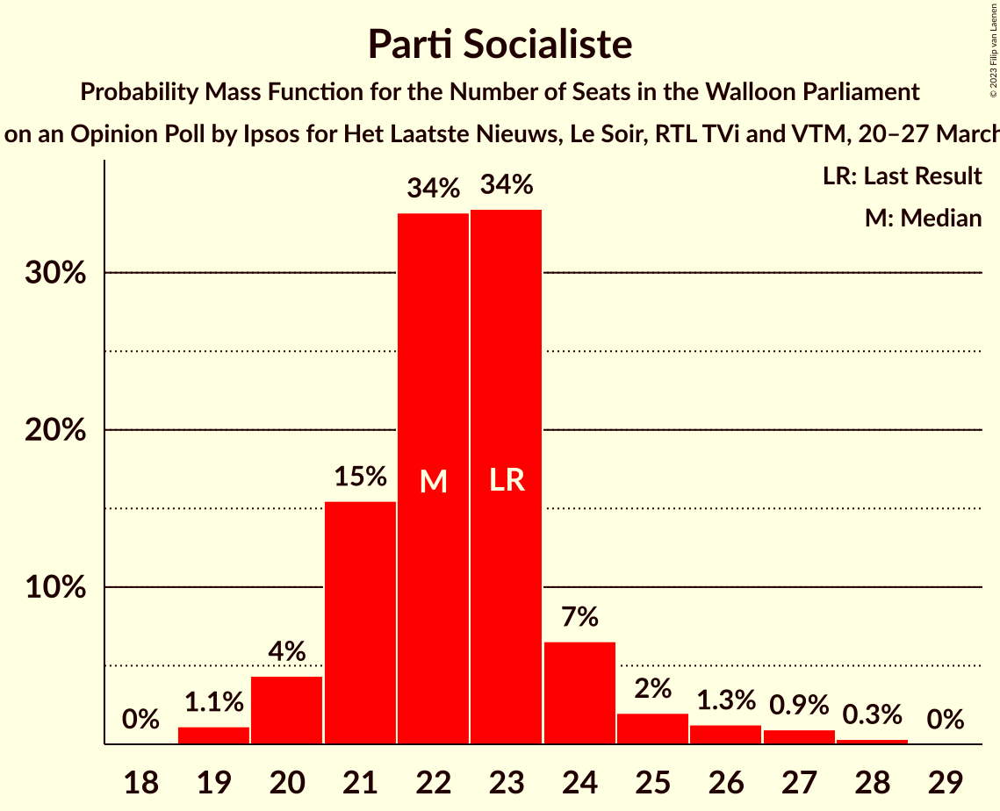

| Number of Seats | Probability | Accumulated | Special Marks |
|:---------------:|:-----------:|:-----------:|:-------------:|
| 18 | 0% | 100% |  |
| 19 | 1.1% | 99.9% |  |
| 20 | 4% | 98.8% |  |
| 21 | 15% | 94% |  |
| 22 | 34% | 79% | Median |
| 23 | 34% | 45% | Last Result |
| 24 | 7% | 11% |  |
| 25 | 2% | 5% |  |
| 26 | 1.3% | 3% |  |
| 27 | 0.9% | 1.3% |  |
| 28 | 0.3% | 0.4% |  |
| 29 | 0% | 0% |  |

### Mouvement Réformateur

*For a full overview of the results for this party, see the [Mouvement Réformateur](party-mouvementréformateur.html) page.*

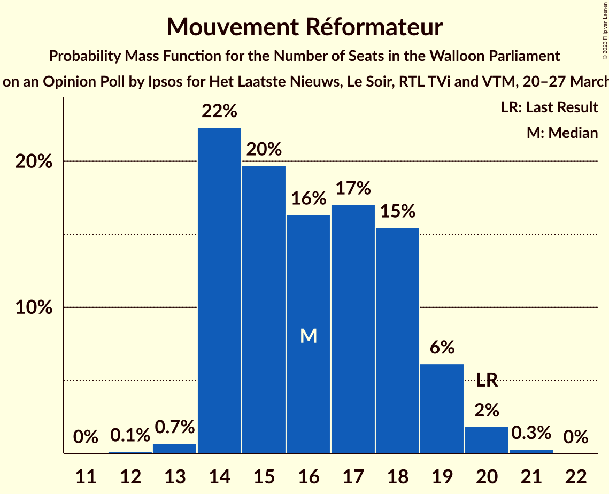

| Number of Seats | Probability | Accumulated | Special Marks |
|:---------------:|:-----------:|:-----------:|:-------------:|
| 12 | 0.1% | 100% |  |
| 13 | 0.7% | 99.9% |  |
| 14 | 22% | 99.2% |  |
| 15 | 20% | 77% |  |
| 16 | 16% | 57% | Median |
| 17 | 17% | 41% |  |
| 18 | 15% | 24% |  |
| 19 | 6% | 8% |  |
| 20 | 2% | 2% | Last Result |
| 21 | 0.3% | 0.3% |  |
| 22 | 0% | 0% |  |

### Parti du Travail de Belgique

*For a full overview of the results for this party, see the [Parti du Travail de Belgique](party-partidutravaildebelgique.html) page.*

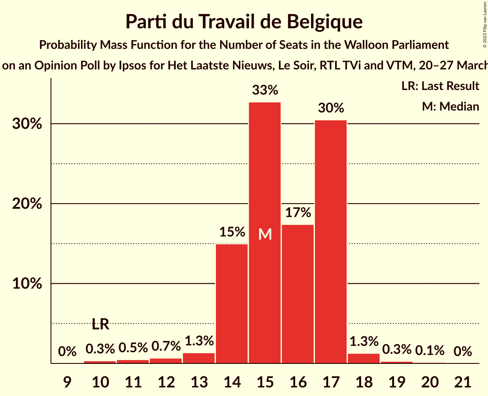

| Number of Seats | Probability | Accumulated | Special Marks |
|:---------------:|:-----------:|:-----------:|:-------------:|
| 10 | 0.3% | 100% | Last Result |
| 11 | 0.5% | 99.7% |  |
| 12 | 0.7% | 99.2% |  |
| 13 | 1.3% | 98.5% |  |
| 14 | 15% | 97% |  |
| 15 | 33% | 82% | Median |
| 16 | 17% | 50% |  |
| 17 | 30% | 32% |  |
| 18 | 1.3% | 2% |  |
| 19 | 0.3% | 0.4% |  |
| 20 | 0.1% | 0.1% |  |
| 21 | 0% | 0% |  |

### Ecolo

*For a full overview of the results for this party, see the [Ecolo](party-ecolo.html) page.*

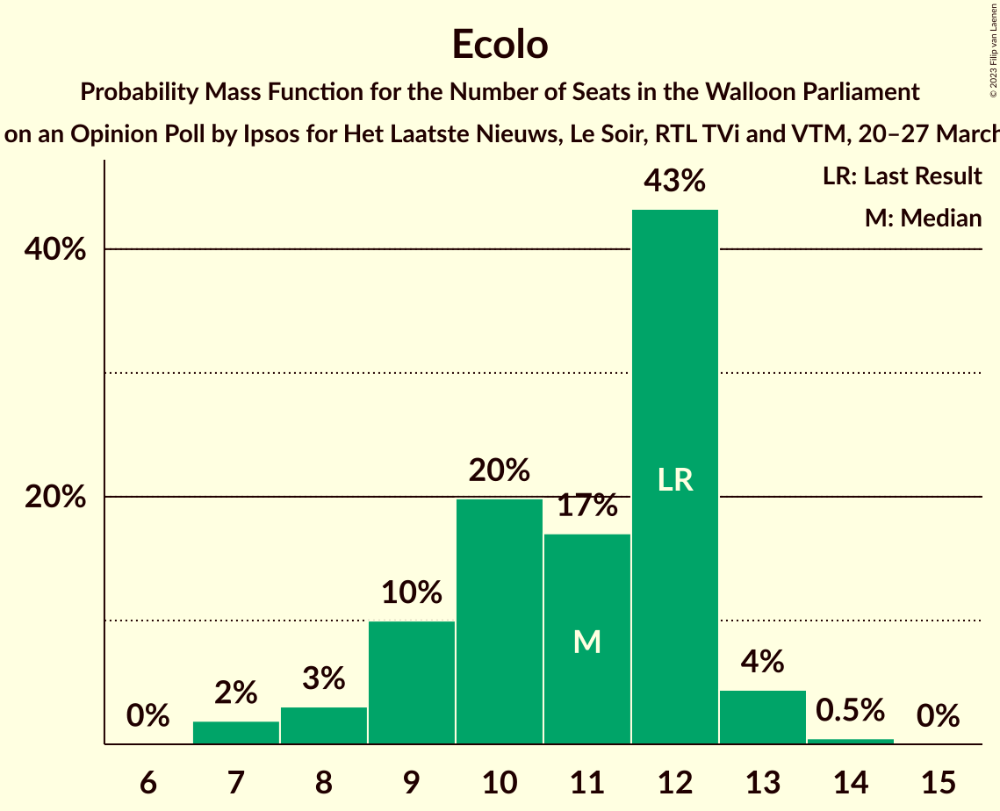

| Number of Seats | Probability | Accumulated | Special Marks |
|:---------------:|:-----------:|:-----------:|:-------------:|
| 7 | 2% | 100% |  |
| 8 | 3% | 98% |  |
| 9 | 10% | 95% |  |
| 10 | 20% | 85% |  |
| 11 | 17% | 65% | Median |
| 12 | 43% | 48% | Last Result |
| 13 | 4% | 5% |  |
| 14 | 0.5% | 0.5% |  |
| 15 | 0% | 0% |  |

### Les Engagés

*For a full overview of the results for this party, see the [Les Engagés](party-lesengagés.html) page.*

| Number of Seats | Probability | Accumulated | Special Marks |
|:---------------:|:-----------:|:-----------:|:-------------:|
| 6 | 3% | 100% |  |
| 7 | 17% | 97% |  |
| 8 | 18% | 80% |  |
| 9 | 15% | 62% | Median |
| 10 | 24% | 47% | Last Result |
| 11 | 22% | 23% |  |
| 12 | 0.5% | 0.6% |  |
| 13 | 0% | 0% |  |

### DéFI

*For a full overview of the results for this party, see the [DéFI](party-défi.html) page.*

| Number of Seats | Probability | Accumulated | Special Marks |
|:---------------:|:-----------:|:-----------:|:-------------:|
| 0 | 67% | 100% | Last Result, Median |
| 1 | 10% | 33% |  |
| 2 | 5% | 24% |  |
| 3 | 8% | 19% |  |
| 4 | 10% | 11% |  |
| 5 | 0.9% | 1.0% |  |
| 6 | 0.1% | 0.1% |  |
| 7 | 0% | 0% |  |

## Coalitions

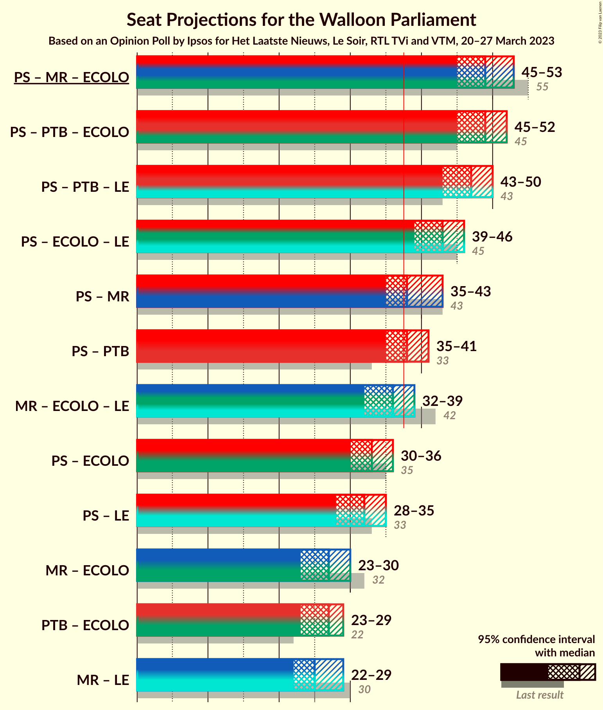

### Confidence Intervals

| Coalition | Last Result | Median | Majority? | 80% Confidence Interval | 90% Confidence Interval | 95% Confidence Interval | 99% Confidence Interval |
|:---------:|:-----------:|:------:|:---------:|:-----------------------:|:-----------------------:|:-----------------------:|:-----------------------:|
| Parti Socialiste – Mouvement Réformateur – Ecolo | 55 | 49 | 100% | 47–52 | 46–53 | 45–53 | 44–54 |
| Parti Socialiste – Parti du Travail de Belgique – Ecolo | 45 | 49 | 100% | 46–51 | 46–52 | 45–52 | 44–54 |
| Parti Socialiste – Parti du Travail de Belgique – Les Engagés | 43 | 47 | 100% | 45–49 | 44–50 | 43–50 | 42–52 |
| Parti Socialiste – Ecolo – Les Engagés | 45 | 43 | 99.3% | 40–45 | 39–46 | 39–46 | 37–47 |
| Parti Socialiste – Mouvement Réformateur | 43 | 38 | 63% | 36–41 | 36–42 | 35–43 | 34–43 |
| Parti Socialiste – Parti du Travail de Belgique | 33 | 38 | 69% | 36–40 | 35–40 | 35–41 | 33–43 |
| Mouvement Réformateur – Ecolo – Les Engagés | 42 | 36 | 19% | 34–39 | 33–39 | 32–39 | 31–41 |
| Parti Socialiste – Ecolo | 35 | 33 | 1.0% | 31–35 | 30–36 | 30–36 | 28–39 |
| Parti Socialiste – Les Engagés | 33 | 32 | 0.1% | 29–34 | 28–34 | 28–35 | 27–36 |
| Mouvement Réformateur – Ecolo | 32 | 27 | 0% | 25–29 | 24–30 | 23–30 | 22–31 |
| Parti du Travail de Belgique – Ecolo | 22 | 27 | 0% | 24–29 | 23–29 | 23–29 | 22–30 |
| Mouvement Réformateur – Les Engagés | 30 | 25 | 0% | 23–28 | 22–29 | 22–29 | 21–30 |

### Parti Socialiste – Mouvement Réformateur – Ecolo

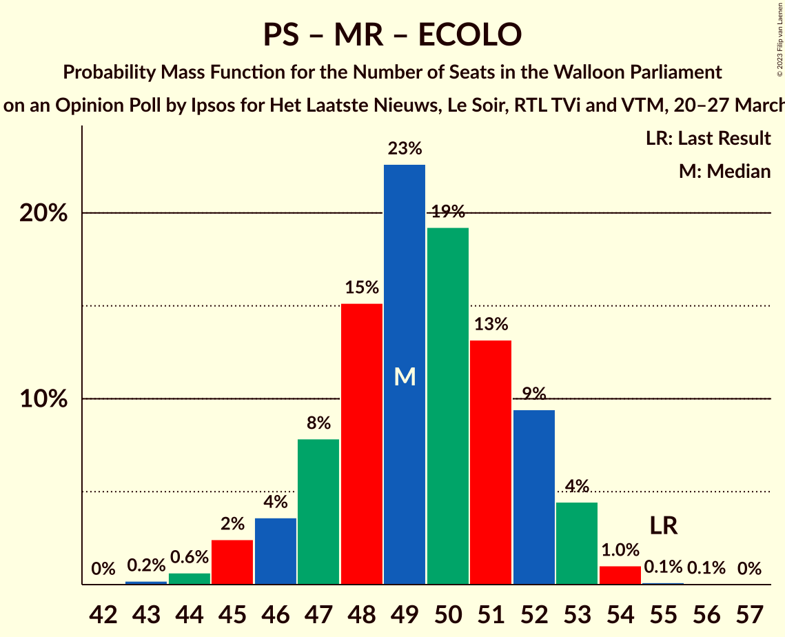

| Number of Seats | Probability | Accumulated | Special Marks |
|:---------------:|:-----------:|:-----------:|:-------------:|
| 43 | 0.2% | 100% |  |
| 44 | 0.6% | 99.8% |  |
| 45 | 2% | 99.2% |  |
| 46 | 4% | 97% |  |
| 47 | 8% | 93% |  |
| 48 | 15% | 85% |  |
| 49 | 23% | 70% | Median |
| 50 | 19% | 47% |  |
| 51 | 13% | 28% |  |
| 52 | 9% | 15% |  |
| 53 | 4% | 6% |  |
| 54 | 1.0% | 1.2% |  |
| 55 | 0.1% | 0.2% | Last Result |
| 56 | 0.1% | 0.1% |  |
| 57 | 0% | 0% |  |

### Parti Socialiste – Parti du Travail de Belgique – Ecolo

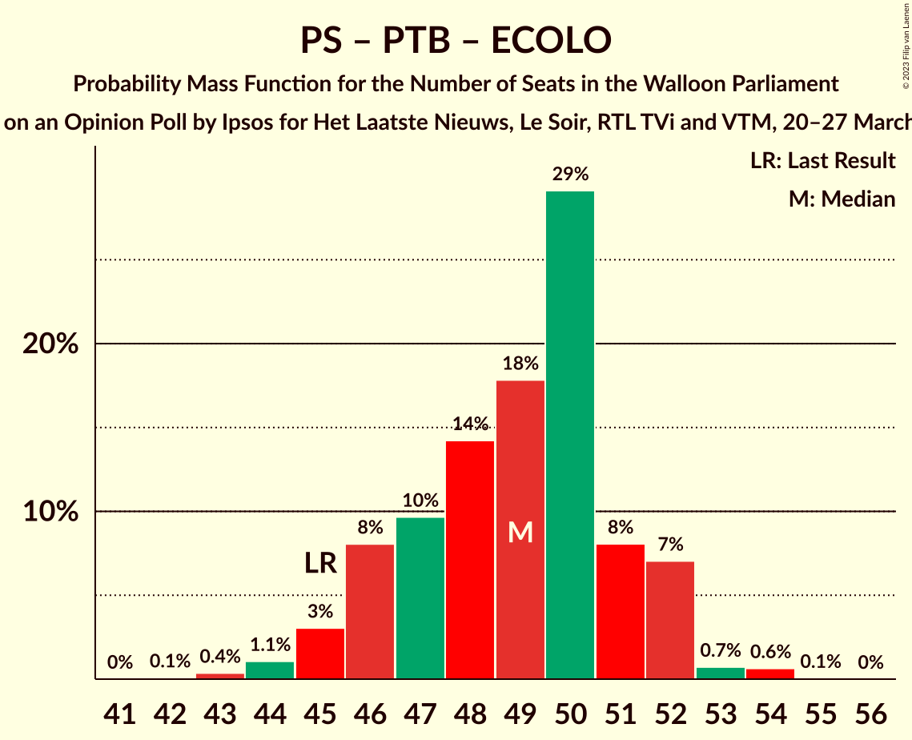

| Number of Seats | Probability | Accumulated | Special Marks |
|:---------------:|:-----------:|:-----------:|:-------------:|
| 42 | 0.1% | 100% |  |
| 43 | 0.4% | 99.9% |  |
| 44 | 1.1% | 99.5% |  |
| 45 | 3% | 98% | Last Result |
| 46 | 8% | 95% |  |
| 47 | 10% | 87% |  |
| 48 | 14% | 78% | Median |
| 49 | 18% | 63% |  |
| 50 | 29% | 46% |  |
| 51 | 8% | 17% |  |
| 52 | 7% | 8% |  |
| 53 | 0.7% | 1.4% |  |
| 54 | 0.6% | 0.7% |  |
| 55 | 0.1% | 0.1% |  |
| 56 | 0% | 0% |  |

### Parti Socialiste – Parti du Travail de Belgique – Les Engagés

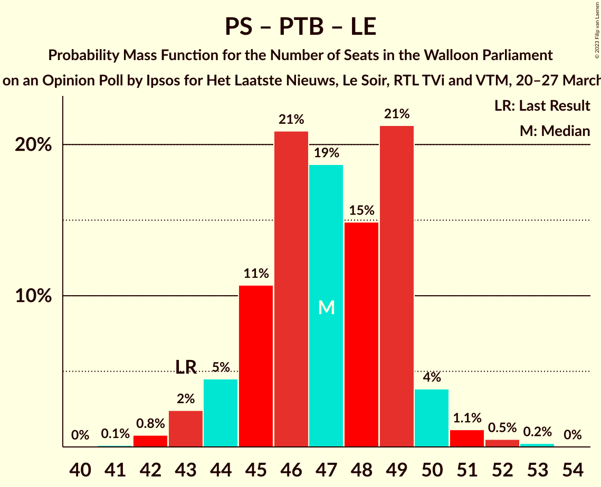

| Number of Seats | Probability | Accumulated | Special Marks |
|:---------------:|:-----------:|:-----------:|:-------------:|
| 41 | 0.1% | 100% |  |
| 42 | 0.8% | 99.9% |  |
| 43 | 2% | 99.1% | Last Result |
| 44 | 5% | 97% |  |
| 45 | 11% | 92% |  |
| 46 | 21% | 81% | Median |
| 47 | 19% | 61% |  |
| 48 | 15% | 42% |  |
| 49 | 21% | 27% |  |
| 50 | 4% | 6% |  |
| 51 | 1.1% | 2% |  |
| 52 | 0.5% | 0.8% |  |
| 53 | 0.2% | 0.3% |  |
| 54 | 0% | 0% |  |

### Parti Socialiste – Ecolo – Les Engagés

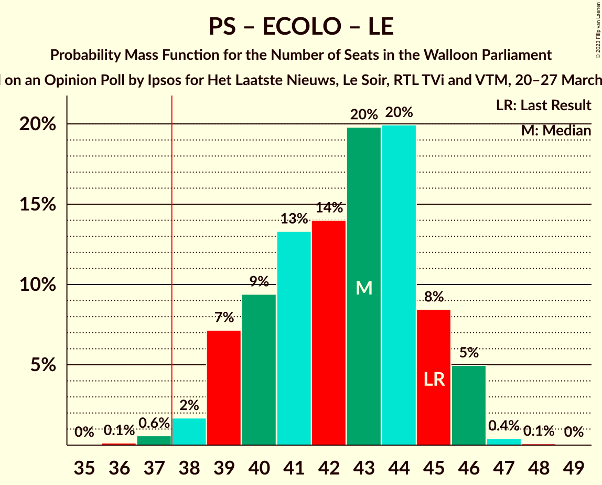

| Number of Seats | Probability | Accumulated | Special Marks |
|:---------------:|:-----------:|:-----------:|:-------------:|
| 36 | 0.1% | 100% |  |
| 37 | 0.6% | 99.8% |  |
| 38 | 2% | 99.3% | Majority |
| 39 | 7% | 98% |  |
| 40 | 9% | 90% |  |
| 41 | 13% | 81% |  |
| 42 | 14% | 68% | Median |
| 43 | 20% | 54% |  |
| 44 | 20% | 34% |  |
| 45 | 8% | 14% | Last Result |
| 46 | 5% | 6% |  |
| 47 | 0.4% | 0.6% |  |
| 48 | 0.1% | 0.1% |  |
| 49 | 0% | 0% |  |

### Parti Socialiste – Mouvement Réformateur

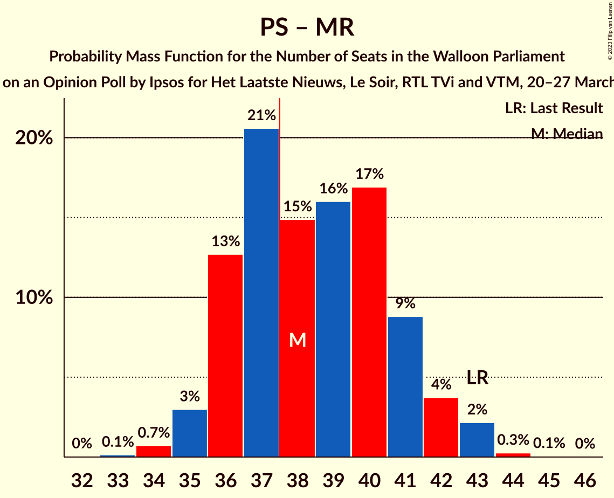

| Number of Seats | Probability | Accumulated | Special Marks |
|:---------------:|:-----------:|:-----------:|:-------------:|
| 33 | 0.1% | 100% |  |
| 34 | 0.7% | 99.8% |  |
| 35 | 3% | 99.1% |  |
| 36 | 13% | 96% |  |
| 37 | 21% | 83% |  |
| 38 | 15% | 63% | Median, Majority |
| 39 | 16% | 48% |  |
| 40 | 17% | 32% |  |
| 41 | 9% | 15% |  |
| 42 | 4% | 6% |  |
| 43 | 2% | 3% | Last Result |
| 44 | 0.3% | 0.3% |  |
| 45 | 0.1% | 0.1% |  |
| 46 | 0% | 0% |  |

### Parti Socialiste – Parti du Travail de Belgique

| Number of Seats | Probability | Accumulated | Special Marks |
|:---------------:|:-----------:|:-----------:|:-------------:|
| 32 | 0.2% | 100% |  |
| 33 | 0.6% | 99.8% | Last Result |
| 34 | 1.3% | 99.2% |  |
| 35 | 3% | 98% |  |
| 36 | 11% | 94% |  |
| 37 | 15% | 83% | Median |
| 38 | 36% | 69% | Majority |
| 39 | 19% | 33% |  |
| 40 | 10% | 14% |  |
| 41 | 3% | 4% |  |
| 42 | 1.2% | 2% |  |
| 43 | 0.4% | 0.6% |  |
| 44 | 0.2% | 0.2% |  |
| 45 | 0% | 0% |  |

### Mouvement Réformateur – Ecolo – Les Engagés

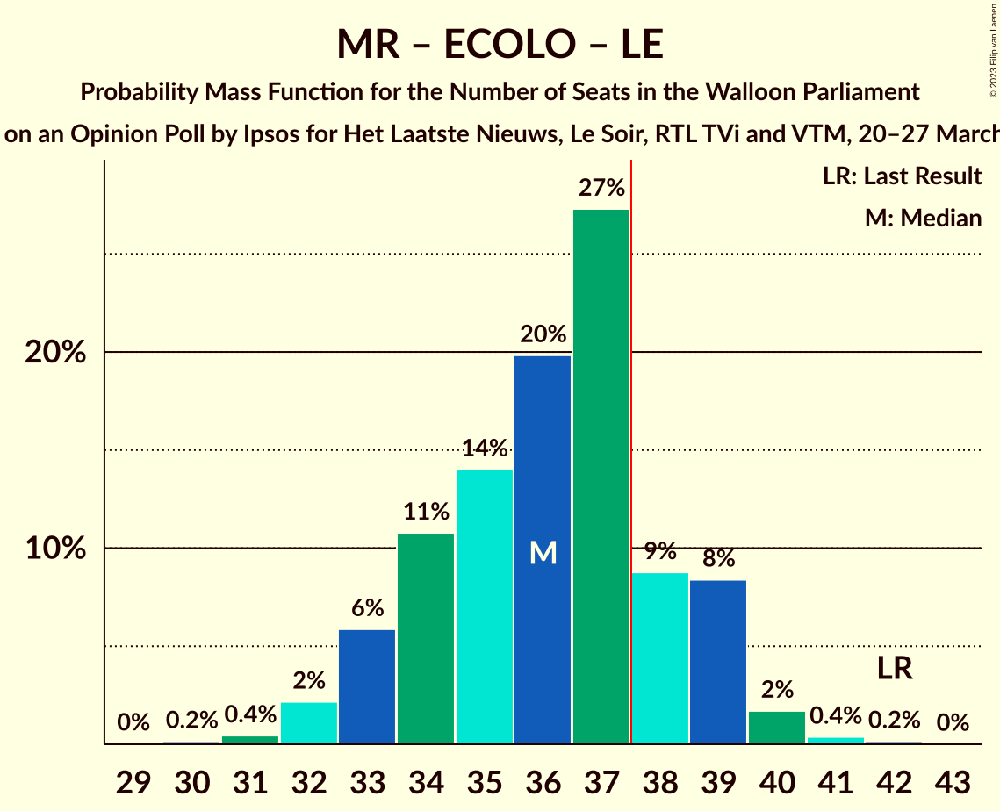

| Number of Seats | Probability | Accumulated | Special Marks |
|:---------------:|:-----------:|:-----------:|:-------------:|
| 30 | 0.2% | 100% |  |
| 31 | 0.4% | 99.8% |  |
| 32 | 2% | 99.4% |  |
| 33 | 6% | 97% |  |
| 34 | 11% | 91% |  |
| 35 | 14% | 81% |  |
| 36 | 20% | 67% | Median |
| 37 | 27% | 47% |  |
| 38 | 9% | 19% | Majority |
| 39 | 8% | 11% |  |
| 40 | 2% | 2% |  |
| 41 | 0.4% | 0.6% |  |
| 42 | 0.2% | 0.2% | Last Result |
| 43 | 0% | 0% |  |

### Parti Socialiste – Ecolo

| Number of Seats | Probability | Accumulated | Special Marks |
|:---------------:|:-----------:|:-----------:|:-------------:|
| 27 | 0.1% | 100% |  |
| 28 | 0.4% | 99.9% |  |
| 29 | 2% | 99.5% |  |
| 30 | 3% | 98% |  |
| 31 | 9% | 94% |  |
| 32 | 16% | 86% |  |
| 33 | 23% | 70% | Median |
| 34 | 18% | 47% |  |
| 35 | 23% | 29% | Last Result |
| 36 | 4% | 6% |  |
| 37 | 1.4% | 2% |  |
| 38 | 0.5% | 1.0% | Majority |
| 39 | 0.5% | 0.5% |  |
| 40 | 0.1% | 0.1% |  |
| 41 | 0% | 0% |  |

### Parti Socialiste – Les Engagés

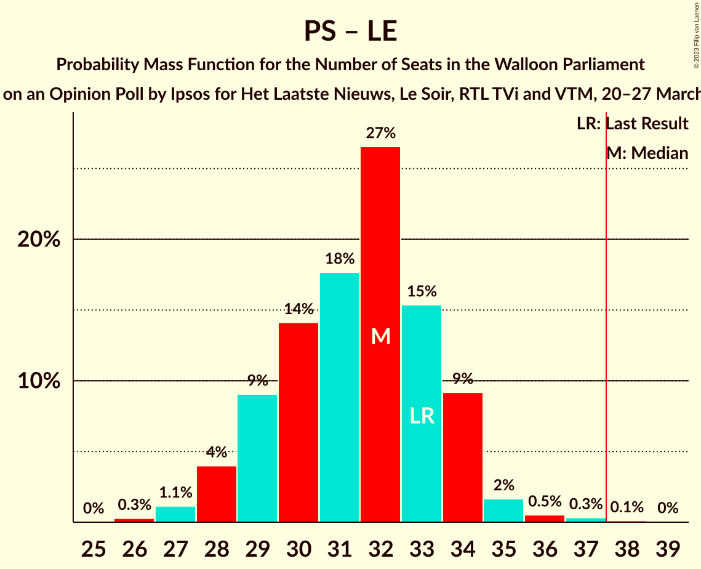

| Number of Seats | Probability | Accumulated | Special Marks |
|:---------------:|:-----------:|:-----------:|:-------------:|
| 26 | 0.3% | 100% |  |
| 27 | 1.1% | 99.7% |  |
| 28 | 4% | 98.6% |  |
| 29 | 9% | 95% |  |
| 30 | 14% | 86% |  |
| 31 | 18% | 71% | Median |
| 32 | 27% | 54% |  |
| 33 | 15% | 27% | Last Result |
| 34 | 9% | 12% |  |
| 35 | 2% | 3% |  |
| 36 | 0.5% | 1.0% |  |
| 37 | 0.3% | 0.5% |  |
| 38 | 0.1% | 0.1% | Majority |
| 39 | 0% | 0% |  |

### Mouvement Réformateur – Ecolo

| Number of Seats | Probability | Accumulated | Special Marks |
|:---------------:|:-----------:|:-----------:|:-------------:|
| 21 | 0.1% | 100% |  |
| 22 | 0.8% | 99.9% |  |
| 23 | 3% | 99.1% |  |
| 24 | 4% | 96% |  |
| 25 | 8% | 92% |  |
| 26 | 26% | 84% |  |
| 27 | 17% | 58% | Median |
| 28 | 18% | 42% |  |
| 29 | 18% | 24% |  |
| 30 | 4% | 6% |  |
| 31 | 2% | 2% |  |
| 32 | 0.4% | 0.5% | Last Result |
| 33 | 0.1% | 0.1% |  |
| 34 | 0% | 0% |  |

### Parti du Travail de Belgique – Ecolo

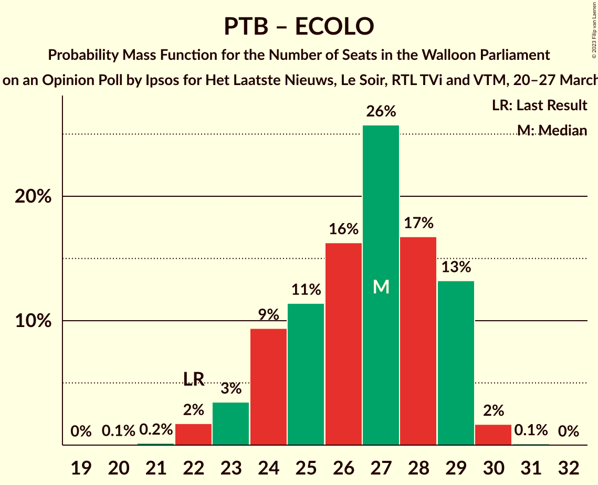

| Number of Seats | Probability | Accumulated | Special Marks |
|:---------------:|:-----------:|:-----------:|:-------------:|
| 20 | 0.1% | 100% |  |
| 21 | 0.2% | 99.9% |  |
| 22 | 2% | 99.8% | Last Result |
| 23 | 3% | 98% |  |
| 24 | 9% | 95% |  |
| 25 | 11% | 85% |  |
| 26 | 16% | 74% | Median |
| 27 | 26% | 58% |  |
| 28 | 17% | 32% |  |
| 29 | 13% | 15% |  |
| 30 | 2% | 2% |  |
| 31 | 0.1% | 0.1% |  |
| 32 | 0% | 0% |  |

### Mouvement Réformateur – Les Engagés

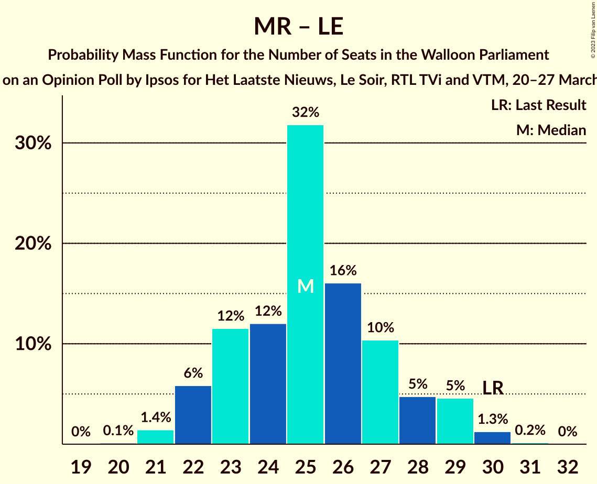

| Number of Seats | Probability | Accumulated | Special Marks |
|:---------------:|:-----------:|:-----------:|:-------------:|
| 20 | 0.1% | 100% |  |
| 21 | 1.4% | 99.9% |  |
| 22 | 6% | 98% |  |
| 23 | 12% | 93% |  |
| 24 | 12% | 81% |  |
| 25 | 32% | 69% | Median |
| 26 | 16% | 37% |  |
| 27 | 10% | 21% |  |
| 28 | 5% | 11% |  |
| 29 | 5% | 6% |  |
| 30 | 1.3% | 1.4% | Last Result |
| 31 | 0.2% | 0.2% |  |
| 32 | 0% | 0% |  |

## Technical Information

### Opinion Poll

+ **Polling firm:** Ipsos
+ **Commissioner(s):** Het Laatste Nieuws, Le Soir, RTL TVi and VTM
+ **Fieldwork period:** 20–27 March 2023

### Calculations

+ **Sample size:** 1000
+ **Simulations done:** 1,048,576
+ **Error estimate:** 1.07%

