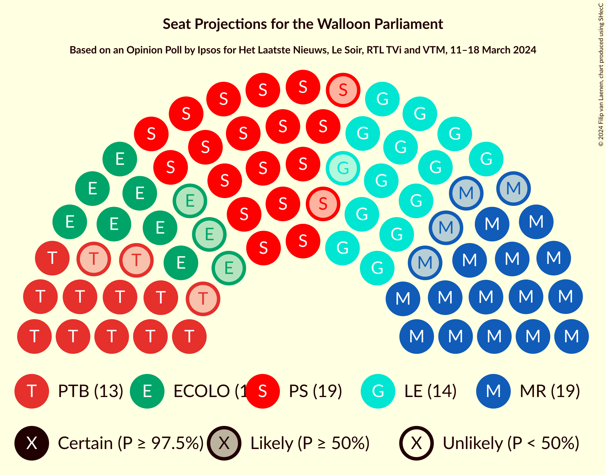
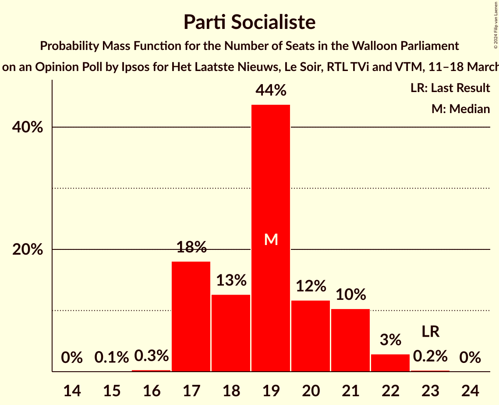
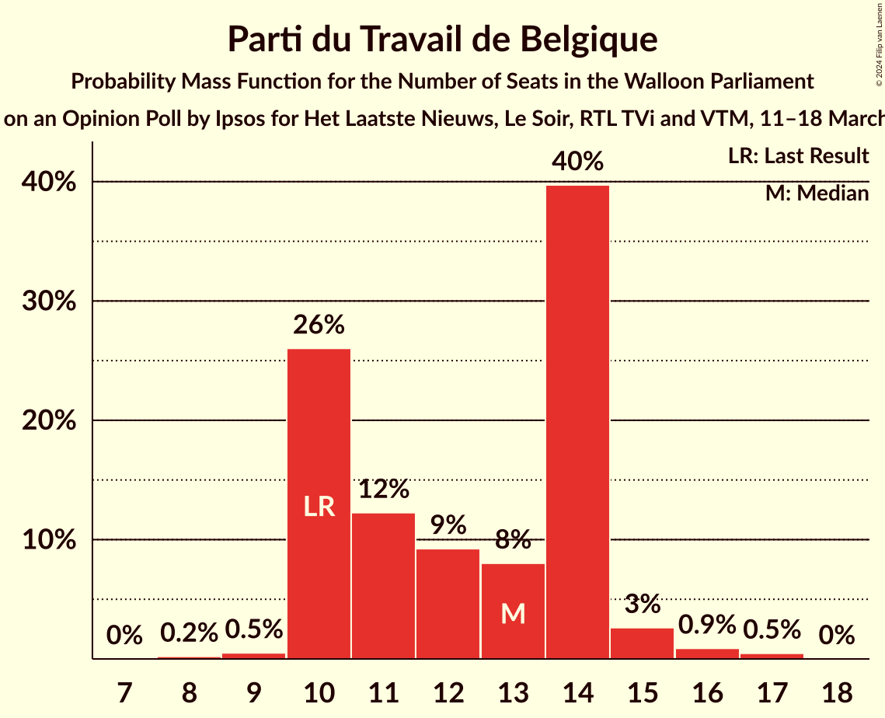
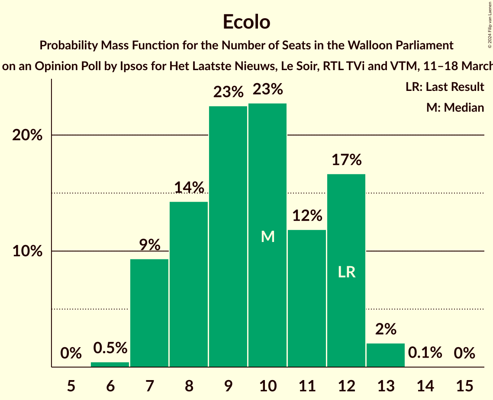
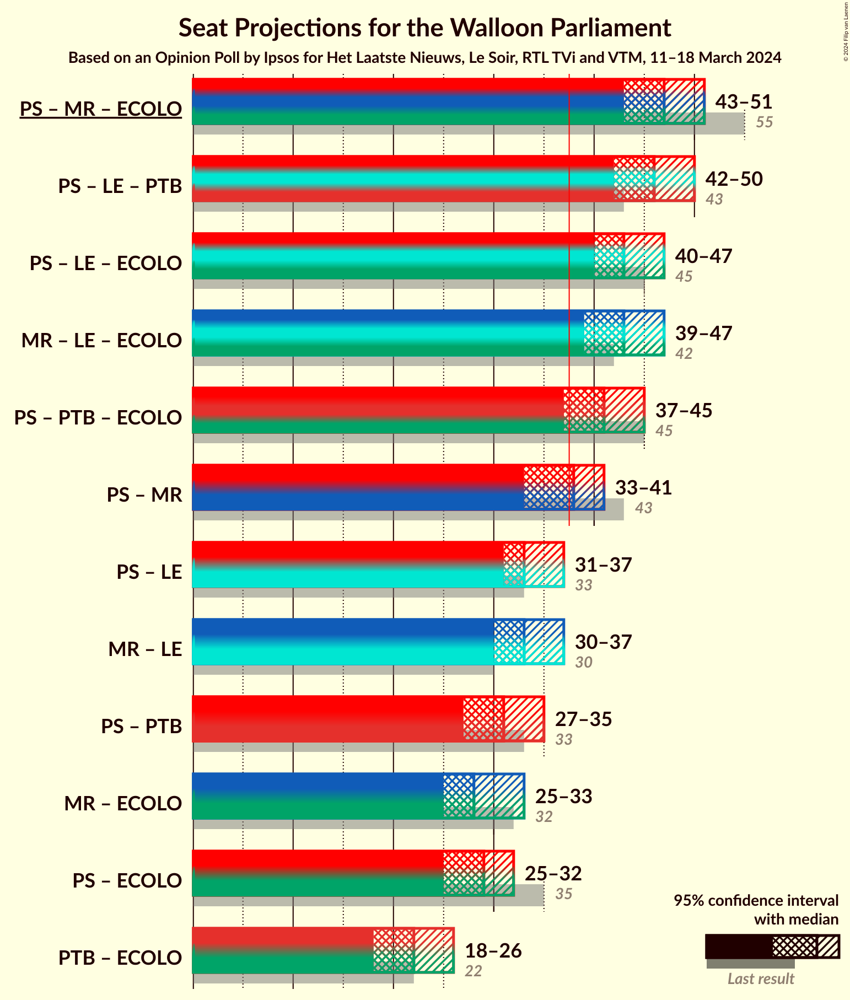
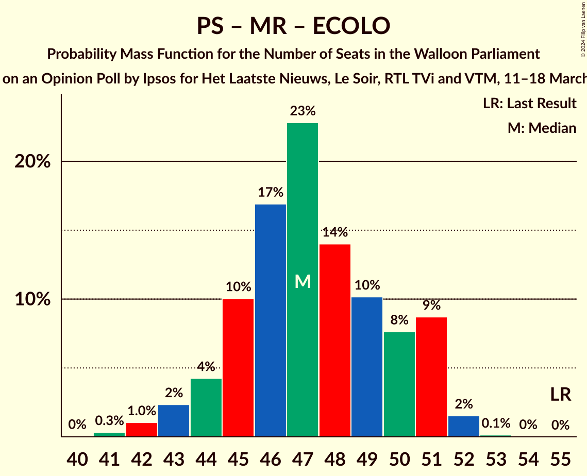
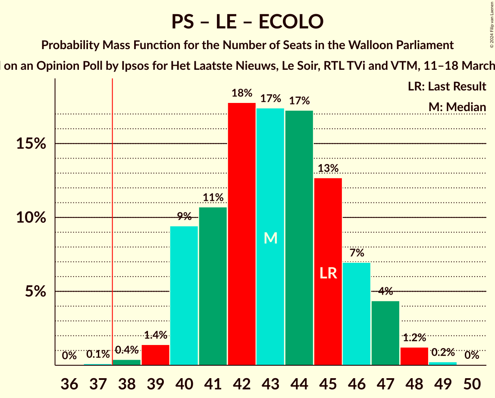
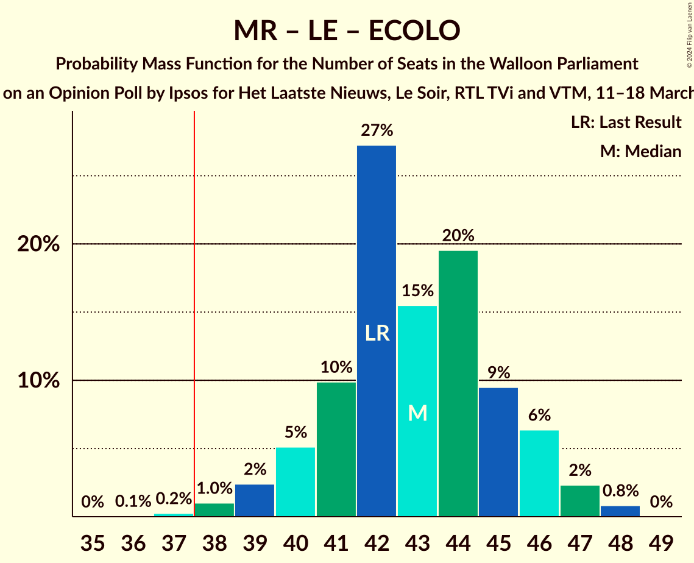
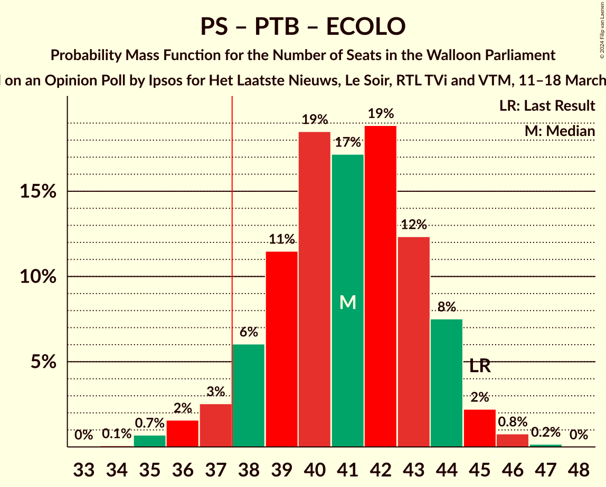

# Opinion Poll by Ipsos for Het Laatste Nieuws, Le Soir, RTL TVi and VTM, 11–18 March 2024

<a href="#voting-intentions">Voting Intentions</a> | <a href="#seats">Seats</a> | <a href="#coalitions">Coalitions</a> | <a href="#technical-information">Technical Information</a>

## Voting Intentions

### Confidence Intervals

| Party | Last Result | Poll Result | 80% Confidence Interval | 90% Confidence Interval | 95% Confidence Interval | 99% Confidence Interval |
|:-----:|:-----------:|:-----------:|:-----------------------:|:-----------------------:|:-----------------------:|:-----------------------:|
| Parti Socialiste | 26.2% | 21.3% | 19.7–23.0% |19.3–23.5% |18.9–24.0% |18.1–24.8% |
| Mouvement Réformateur | 21.4% | 20.5% | 18.9–22.2% |18.5–22.7% |18.1–23.1% |17.4–24.0% |
| Les Engagés | 11.0% | 16.8% | 15.4–18.4% |15.0–18.9% |14.6–19.3% |13.9–20.0% |
| Parti du Travail de Belgique | 13.7% | 14.9% | 13.5–16.4% |13.2–16.9% |12.8–17.3% |12.2–18.0% |
| Ecolo | 14.5% | 11.9% | 10.7–13.3% |10.3–13.7% |10.0–14.1% |9.5–14.8% |
| DéFI | 4.1% | 4.8% | 4.0–5.8% |3.8–6.1% |3.6–6.3% |3.3–6.8% |

*Note:* The poll result column reflects the actual value used in the calculations. Published results may vary slightly, and in addition be rounded to fewer digits.

## Seats

### Confidence Intervals

| Party | Last Result | Median | 80% Confidence Interval | 90% Confidence Interval | 95% Confidence Interval | 99% Confidence Interval |
|:-----:|:-----------:|:------:|:-----------------------:|:-----------------------:|:-----------------------:|:-----------------------:|
| <a href="#parti-socialiste">Parti Socialiste</a> | 23 | 19 | 17–21 |17–21 |17–22 |17–22 |
| <a href="#mouvement-réformateur">Mouvement Réformateur</a> | 20 | 19 | 16–21 |16–21 |15–21 |14–21 |
| <a href="#les-engagés">Les Engagés</a> | 10 | 14 | 13–16 |13–17 |12–17 |11–18 |
| <a href="#parti-du-travail-de-belgique">Parti du Travail de Belgique</a> | 10 | 13 | 10–14 |10–14 |10–15 |9–16 |
| <a href="#ecolo">Ecolo</a> | 12 | 10 | 8–12 |7–12 |7–12 |7–13 |
| <a href="#défi">DéFI</a> | 0 | 0 | 0–3 |0–4 |0–4 |0–5 |

### Parti Socialiste

*For a full overview of the results for this party, see the [Parti Socialiste](party-partisocialiste.html) page.*

| Number of Seats | Probability | Accumulated | Special Marks |
|:---------------:|:-----------:|:-----------:|:-------------:|
| 16 | 0.3% | 100% |  |
| 17 | 18% | 99.7% |  |
| 18 | 13% | 81% |  |
| 19 | 43% | 69% | Median |
| 20 | 13% | 26% |  |
| 21 | 10% | 13% |  |
| 22 | 3% | 3% |  |
| 23 | 0.3% | 0.3% | Last Result |
| 24 | 0% | 0% |  |

### Mouvement Réformateur

*For a full overview of the results for this party, see the [Mouvement Réformateur](party-mouvementréformateur.html) page.*

| Number of Seats | Probability | Accumulated | Special Marks |
|:---------------:|:-----------:|:-----------:|:-------------:|
| 14 | 1.1% | 100% |  |
| 15 | 3% | 98.9% |  |
| 16 | 7% | 96% |  |
| 17 | 12% | 89% |  |
| 18 | 22% | 77% |  |
| 19 | 17% | 54% | Median |
| 20 | 19% | 37% | Last Result |
| 21 | 18% | 19% |  |
| 22 | 0.2% | 0.3% |  |
| 23 | 0.1% | 0.1% |  |
| 24 | 0% | 0% |  |

### Les Engagés

*For a full overview of the results for this party, see the [Les Engagés](party-lesengagés.html) page.*

| Number of Seats | Probability | Accumulated | Special Marks |
|:---------------:|:-----------:|:-----------:|:-------------:|
| 10 | 0% | 100% | Last Result |
| 11 | 1.0% | 100% |  |
| 12 | 1.5% | 99.0% |  |
| 13 | 14% | 97% |  |
| 14 | 41% | 83% | Median |
| 15 | 24% | 43% |  |
| 16 | 12% | 18% |  |
| 17 | 4% | 7% |  |
| 18 | 2% | 2% |  |
| 19 | 0.2% | 0.3% |  |
| 20 | 0% | 0% |  |

### Parti du Travail de Belgique

*For a full overview of the results for this party, see the [Parti du Travail de Belgique](party-partidutravaildebelgique.html) page.*

| Number of Seats | Probability | Accumulated | Special Marks |
|:---------------:|:-----------:|:-----------:|:-------------:|
| 8 | 0.2% | 100% |  |
| 9 | 0.4% | 99.8% |  |
| 10 | 26% | 99.3% | Last Result |
| 11 | 12% | 73% |  |
| 12 | 9% | 62% |  |
| 13 | 9% | 52% | Median |
| 14 | 40% | 44% |  |
| 15 | 3% | 4% |  |
| 16 | 0.9% | 1.3% |  |
| 17 | 0.5% | 0.5% |  |
| 18 | 0% | 0% |  |

### Ecolo

*For a full overview of the results for this party, see the [Ecolo](party-ecolo.html) page.*

| Number of Seats | Probability | Accumulated | Special Marks |
|:---------------:|:-----------:|:-----------:|:-------------:|
| 6 | 0.5% | 100% |  |
| 7 | 9% | 99.5% |  |
| 8 | 14% | 90% |  |
| 9 | 22% | 76% |  |
| 10 | 23% | 54% | Median |
| 11 | 11% | 30% |  |
| 12 | 17% | 19% | Last Result |
| 13 | 2% | 2% |  |
| 14 | 0.1% | 0.1% |  |
| 15 | 0% | 0% |  |

### DéFI

*For a full overview of the results for this party, see the [DéFI](party-défi.html) page.*

| Number of Seats | Probability | Accumulated | Special Marks |
|:---------------:|:-----------:|:-----------:|:-------------:|
| 0 | 71% | 100% | Last Result, Median |
| 1 | 7% | 29% |  |
| 2 | 3% | 22% |  |
| 3 | 10% | 19% |  |
| 4 | 8% | 9% |  |
| 5 | 1.2% | 1.3% |  |
| 6 | 0.1% | 0.1% |  |
| 7 | 0% | 0% |  |

## Coalitions

### Confidence Intervals

| Coalition | Last Result | Median | Majority? | 80% Confidence Interval | 90% Confidence Interval | 95% Confidence Interval | 99% Confidence Interval |
|:---------:|:-----------:|:------:|:---------:|:-----------------------:|:-----------------------:|:-----------------------:|:-----------------------:|
| Parti Socialiste – Mouvement Réformateur – Ecolo | 55 | 47 | 100% | 45–50 | 44–51 | 43–51 | 42–52 |
| Parti Socialiste – Les Engagés – Parti du Travail de Belgique | 43 | 46 | 100% | 43–48 | 42–49 | 42–50 | 41–50 |
| Parti Socialiste – Les Engagés – Ecolo | 45 | 43 | 99.9% | 40–46 | 40–47 | 40–47 | 39–48 |
| Mouvement Réformateur – Les Engagés – Ecolo | 42 | 43 | 99.7% | 41–45 | 40–46 | 39–47 | 38–48 |
| Parti Socialiste – Parti du Travail de Belgique – Ecolo | 45 | 41 | 95% | 38–44 | 38–44 | 37–45 | 35–46 |
| Parti Socialiste – Mouvement Réformateur | 43 | 38 | 55% | 35–40 | 34–41 | 33–41 | 33–42 |
| Mouvement Réformateur – Les Engagés | 30 | 33 | 0.9% | 31–36 | 30–36 | 30–37 | 29–38 |
| Parti Socialiste – Les Engagés | 33 | 33 | 0.8% | 31–36 | 31–36 | 30–37 | 30–38 |
| Parti Socialiste – Parti du Travail de Belgique | 33 | 31 | 0% | 29–33 | 28–34 | 27–35 | 27–36 |
| Mouvement Réformateur – Ecolo | 32 | 28 | 0% | 26–31 | 25–32 | 25–33 | 23–33 |
| Parti Socialiste – Ecolo | 35 | 29 | 0% | 26–31 | 25–32 | 25–32 | 24–33 |
| Parti du Travail de Belgique – Ecolo | 22 | 22 | 0% | 19–25 | 18–25 | 18–26 | 17–27 |

### Parti Socialiste – Mouvement Réformateur – Ecolo

| Number of Seats | Probability | Accumulated | Special Marks |
|:---------------:|:-----------:|:-----------:|:-------------:|
| 40 | 0% | 100% |  |
| 41 | 0.3% | 99.9% |  |
| 42 | 1.0% | 99.6% |  |
| 43 | 2% | 98.6% |  |
| 44 | 4% | 96% |  |
| 45 | 10% | 92% |  |
| 46 | 17% | 82% |  |
| 47 | 21% | 65% |  |
| 48 | 15% | 43% | Median |
| 49 | 10% | 28% |  |
| 50 | 8% | 18% |  |
| 51 | 8% | 10% |  |
| 52 | 1.4% | 2% |  |
| 53 | 0.1% | 0.2% |  |
| 54 | 0% | 0% |  |
| 55 | 0% | 0% | Last Result |

### Parti Socialiste – Les Engagés – Parti du Travail de Belgique

| Number of Seats | Probability | Accumulated | Special Marks |
|:---------------:|:-----------:|:-----------:|:-------------:|
| 40 | 0.2% | 100% |  |
| 41 | 1.3% | 99.7% |  |
| 42 | 5% | 98% |  |
| 43 | 8% | 93% | Last Result |
| 44 | 11% | 86% |  |
| 45 | 17% | 74% |  |
| 46 | 19% | 57% | Median |
| 47 | 19% | 38% |  |
| 48 | 11% | 19% |  |
| 49 | 5% | 8% |  |
| 50 | 2% | 3% |  |
| 51 | 0.3% | 0.3% |  |
| 52 | 0% | 0.1% |  |
| 53 | 0% | 0% |  |

### Parti Socialiste – Les Engagés – Ecolo

| Number of Seats | Probability | Accumulated | Special Marks |
|:---------------:|:-----------:|:-----------:|:-------------:|
| 37 | 0.1% | 100% |  |
| 38 | 0.3% | 99.9% | Majority |
| 39 | 2% | 99.5% |  |
| 40 | 9% | 98% |  |
| 41 | 12% | 89% |  |
| 42 | 17% | 77% |  |
| 43 | 16% | 60% | Median |
| 44 | 19% | 44% |  |
| 45 | 13% | 25% | Last Result |
| 46 | 7% | 13% |  |
| 47 | 4% | 6% |  |
| 48 | 1.3% | 2% |  |
| 49 | 0.2% | 0.3% |  |
| 50 | 0% | 0.1% |  |
| 51 | 0% | 0% |  |

### Mouvement Réformateur – Les Engagés – Ecolo

| Number of Seats | Probability | Accumulated | Special Marks |
|:---------------:|:-----------:|:-----------:|:-------------:|
| 36 | 0.1% | 100% |  |
| 37 | 0.3% | 99.9% |  |
| 38 | 1.0% | 99.7% | Majority |
| 39 | 2% | 98.7% |  |
| 40 | 5% | 96% |  |
| 41 | 10% | 91% |  |
| 42 | 27% | 81% | Last Result |
| 43 | 15% | 54% | Median |
| 44 | 20% | 39% |  |
| 45 | 10% | 19% |  |
| 46 | 7% | 10% |  |
| 47 | 2% | 3% |  |
| 48 | 0.8% | 0.8% |  |
| 49 | 0% | 0% |  |

### Parti Socialiste – Parti du Travail de Belgique – Ecolo

| Number of Seats | Probability | Accumulated | Special Marks |
|:---------------:|:-----------:|:-----------:|:-------------:|
| 34 | 0.1% | 100% |  |
| 35 | 0.8% | 99.9% |  |
| 36 | 2% | 99.1% |  |
| 37 | 3% | 98% |  |
| 38 | 6% | 95% | Majority |
| 39 | 10% | 89% |  |
| 40 | 19% | 78% |  |
| 41 | 18% | 59% |  |
| 42 | 18% | 42% | Median |
| 43 | 12% | 23% |  |
| 44 | 9% | 12% |  |
| 45 | 2% | 3% | Last Result |
| 46 | 0.8% | 1.0% |  |
| 47 | 0.2% | 0.2% |  |
| 48 | 0% | 0% |  |

### Parti Socialiste – Mouvement Réformateur

| Number of Seats | Probability | Accumulated | Special Marks |
|:---------------:|:-----------:|:-----------:|:-------------:|
| 32 | 0.3% | 100% |  |
| 33 | 2% | 99.6% |  |
| 34 | 5% | 97% |  |
| 35 | 7% | 92% |  |
| 36 | 11% | 85% |  |
| 37 | 19% | 74% |  |
| 38 | 22% | 55% | Median, Majority |
| 39 | 15% | 32% |  |
| 40 | 9% | 17% |  |
| 41 | 8% | 9% |  |
| 42 | 1.0% | 1.2% |  |
| 43 | 0.2% | 0.2% | Last Result |
| 44 | 0% | 0% |  |

### Mouvement Réformateur – Les Engagés

| Number of Seats | Probability | Accumulated | Special Marks |
|:---------------:|:-----------:|:-----------:|:-------------:|
| 28 | 0.4% | 100% |  |
| 29 | 2% | 99.6% |  |
| 30 | 4% | 98% | Last Result |
| 31 | 12% | 94% |  |
| 32 | 20% | 82% |  |
| 33 | 20% | 62% | Median |
| 34 | 16% | 43% |  |
| 35 | 16% | 27% |  |
| 36 | 8% | 11% |  |
| 37 | 2% | 3% |  |
| 38 | 0.7% | 0.9% | Majority |
| 39 | 0.2% | 0.2% |  |
| 40 | 0% | 0% |  |

### Parti Socialiste – Les Engagés

| Number of Seats | Probability | Accumulated | Special Marks |
|:---------------:|:-----------:|:-----------:|:-------------:|
| 28 | 0.1% | 100% |  |
| 29 | 0.3% | 99.9% |  |
| 30 | 2% | 99.6% |  |
| 31 | 10% | 97% |  |
| 32 | 19% | 88% |  |
| 33 | 24% | 69% | Last Result, Median |
| 34 | 19% | 45% |  |
| 35 | 14% | 26% |  |
| 36 | 9% | 12% |  |
| 37 | 2% | 3% |  |
| 38 | 0.7% | 0.8% | Majority |
| 39 | 0.2% | 0.2% |  |
| 40 | 0% | 0% |  |

### Parti Socialiste – Parti du Travail de Belgique

| Number of Seats | Probability | Accumulated | Special Marks |
|:---------------:|:-----------:|:-----------:|:-------------:|
| 26 | 0.1% | 100% |  |
| 27 | 3% | 99.9% |  |
| 28 | 5% | 97% |  |
| 29 | 12% | 92% |  |
| 30 | 14% | 81% |  |
| 31 | 21% | 67% |  |
| 32 | 15% | 46% | Median |
| 33 | 22% | 31% | Last Result |
| 34 | 6% | 9% |  |
| 35 | 2% | 3% |  |
| 36 | 0.6% | 0.8% |  |
| 37 | 0.1% | 0.1% |  |
| 38 | 0% | 0% | Majority |

### Mouvement Réformateur – Ecolo

| Number of Seats | Probability | Accumulated | Special Marks |
|:---------------:|:-----------:|:-----------:|:-------------:|
| 22 | 0.1% | 100% |  |
| 23 | 0.4% | 99.9% |  |
| 24 | 2% | 99.5% |  |
| 25 | 4% | 98% |  |
| 26 | 9% | 93% |  |
| 27 | 15% | 85% |  |
| 28 | 23% | 70% |  |
| 29 | 19% | 47% | Median |
| 30 | 14% | 28% |  |
| 31 | 8% | 14% |  |
| 32 | 4% | 6% | Last Result |
| 33 | 3% | 3% |  |
| 34 | 0.2% | 0.2% |  |
| 35 | 0% | 0% |  |

### Parti Socialiste – Ecolo

| Number of Seats | Probability | Accumulated | Special Marks |
|:---------------:|:-----------:|:-----------:|:-------------:|
| 24 | 1.1% | 100% |  |
| 25 | 5% | 98.9% |  |
| 26 | 10% | 94% |  |
| 27 | 12% | 84% |  |
| 28 | 21% | 72% |  |
| 29 | 16% | 51% | Median |
| 30 | 16% | 35% |  |
| 31 | 12% | 19% |  |
| 32 | 6% | 7% |  |
| 33 | 1.1% | 1.3% |  |
| 34 | 0.2% | 0.2% |  |
| 35 | 0% | 0% | Last Result |

### Parti du Travail de Belgique – Ecolo

| Number of Seats | Probability | Accumulated | Special Marks |
|:---------------:|:-----------:|:-----------:|:-------------:|
| 16 | 0.1% | 100% |  |
| 17 | 1.4% | 99.9% |  |
| 18 | 4% | 98% |  |
| 19 | 7% | 95% |  |
| 20 | 12% | 88% |  |
| 21 | 14% | 76% |  |
| 22 | 17% | 63% | Last Result |
| 23 | 21% | 46% | Median |
| 24 | 13% | 25% |  |
| 25 | 7% | 11% |  |
| 26 | 4% | 5% |  |
| 27 | 0.8% | 0.9% |  |
| 28 | 0.1% | 0.2% |  |
| 29 | 0% | 0% |  |

## Technical Information

### Opinion Poll

+ **Polling firm:** Ipsos
+ **Commissioner(s):** Het Laatste Nieuws, Le Soir, RTL TVi and VTM
+ **Fieldwork period:** 11–18 March 2024

### Calculations

+ **Sample size:** 1000
+ **Simulations done:** 1,048,576
+ **Error estimate:** 1.01%

