# Opinion Poll by Kantar for La Libre Belgique and RTBf, 8–18 April 2024

<a href="#voting-intentions">Voting Intentions</a> | <a href="#seats">Seats</a> | <a href="#coalitions">Coalitions</a> | <a href="#technical-information">Technical Information</a>

## Voting Intentions

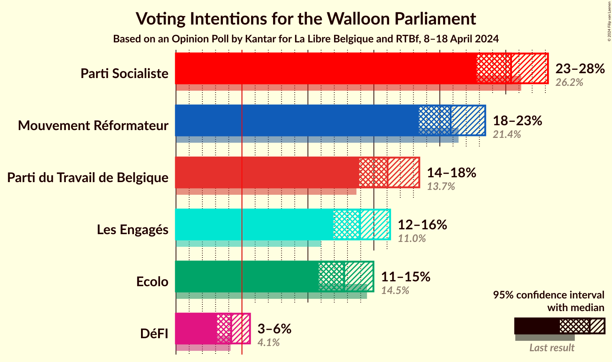

### Confidence Intervals

| Party | Last Result | Poll Result | 80% Confidence Interval | 90% Confidence Interval | 95% Confidence Interval | 99% Confidence Interval |
|:-----:|:-----------:|:-----------:|:-----------------------:|:-----------------------:|:-----------------------:|:-----------------------:|
| Parti Socialiste | 26.2% | 25.4% | 23.7–27.2% |23.2–27.7% |22.8–28.2% |22.0–29.1% |
| Mouvement Réformateur | 21.4% | 20.8% | 19.2–22.5% |18.8–23.0% |18.4–23.4% |17.7–24.3% |
| Parti du Travail de Belgique | 13.7% | 16.0% | 14.6–17.6% |14.2–18.0% |13.9–18.4% |13.2–19.2% |
| Les Engagés | 11.0% | 13.9% | 12.6–15.4% |12.3–15.9% |11.9–16.2% |11.3–17.0% |
| Ecolo | 14.5% | 12.7% | 11.5–14.2% |11.1–14.6% |10.8–15.0% |10.2–15.7% |
| DéFI | 4.1% | 4.2% | 3.5–5.1% |3.3–5.4% |3.1–5.6% |2.8–6.1% |

*Note:* The poll result column reflects the actual value used in the calculations. Published results may vary slightly, and in addition be rounded to fewer digits.

## Seats

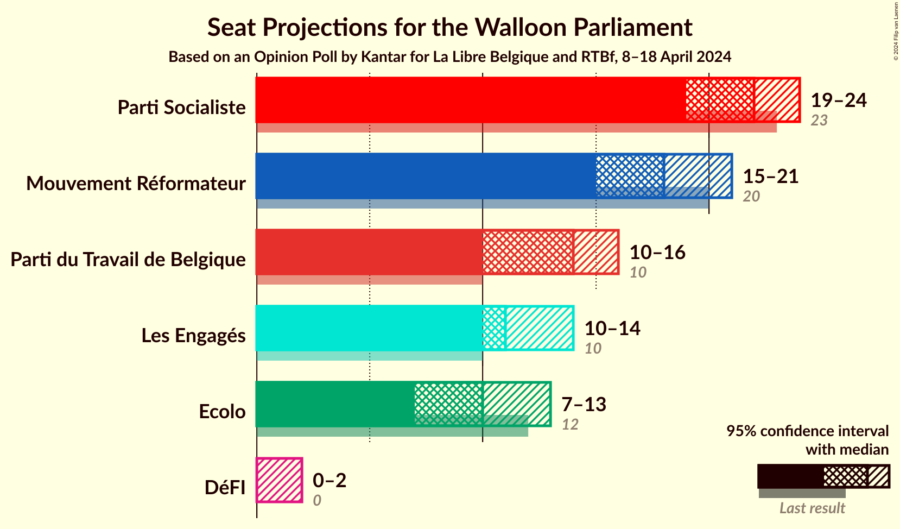

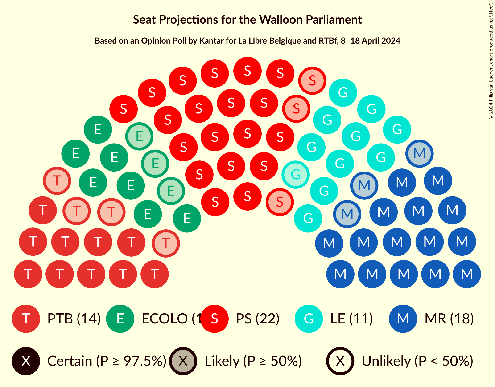

### Confidence Intervals

| Party | Last Result | Median | 80% Confidence Interval | 90% Confidence Interval | 95% Confidence Interval | 99% Confidence Interval |
|:-----:|:-----------:|:------:|:-----------------------:|:-----------------------:|:-----------------------:|:-----------------------:|
| <a href="#parti-socialiste">Parti Socialiste</a> | 23 | 22 | 20–23 |19–23 |19–24 |19–25 |
| <a href="#mouvement-réformateur">Mouvement Réformateur</a> | 20 | 18 | 16–20 |16–21 |15–21 |14–21 |
| <a href="#parti-du-travail-de-belgique">Parti du Travail de Belgique</a> | 10 | 14 | 10–15 |10–15 |10–16 |10–17 |
| <a href="#les-engagés">Les Engagés</a> | 10 | 11 | 11–13 |10–13 |10–14 |9–15 |
| <a href="#ecolo">Ecolo</a> | 12 | 10 | 9–12 |8–12 |7–13 |7–13 |
| <a href="#défi">DéFI</a> | 0 | 0 | 0 |0 |0–2 |0–4 |

### Parti Socialiste

*For a full overview of the results for this party, see the [Parti Socialiste](party-partisocialiste.html) page.*

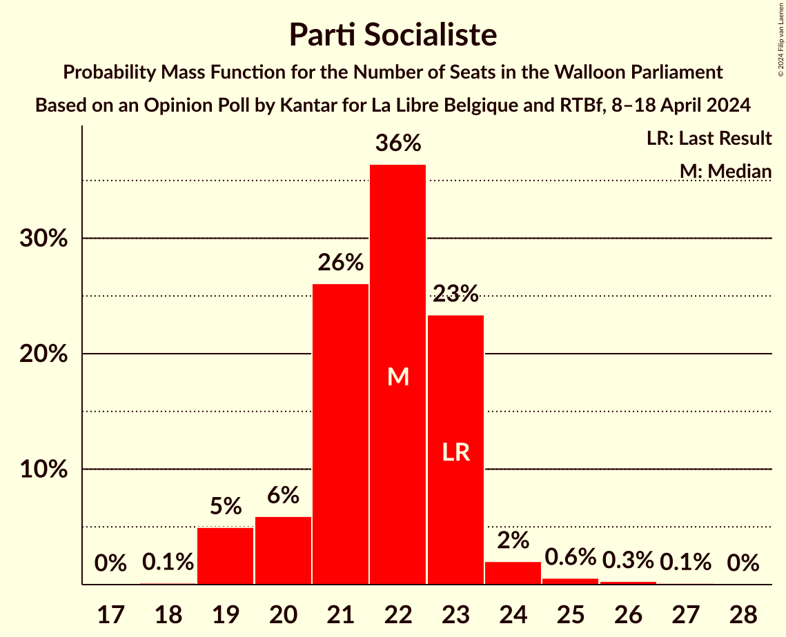

| Number of Seats | Probability | Accumulated | Special Marks |
|:---------------:|:-----------:|:-----------:|:-------------:|
| 18 | 0.1% | 100% |  |
| 19 | 5% | 99.8% |  |
| 20 | 6% | 95% |  |
| 21 | 26% | 89% |  |
| 22 | 36% | 63% | Median |
| 23 | 23% | 26% | Last Result |
| 24 | 2% | 3% |  |
| 25 | 0.6% | 1.0% |  |
| 26 | 0.3% | 0.5% |  |
| 27 | 0.1% | 0.2% |  |
| 28 | 0% | 0% |  |

### Mouvement Réformateur

*For a full overview of the results for this party, see the [Mouvement Réformateur](party-mouvementréformateur.html) page.*

| Number of Seats | Probability | Accumulated | Special Marks |
|:---------------:|:-----------:|:-----------:|:-------------:|
| 14 | 2% | 100% |  |
| 15 | 3% | 98% |  |
| 16 | 6% | 95% |  |
| 17 | 17% | 89% |  |
| 18 | 30% | 72% | Median |
| 19 | 20% | 42% |  |
| 20 | 14% | 22% | Last Result |
| 21 | 7% | 7% |  |
| 22 | 0.1% | 0.1% |  |
| 23 | 0% | 0% |  |

### Parti du Travail de Belgique

*For a full overview of the results for this party, see the [Parti du Travail de Belgique](party-partidutravaildebelgique.html) page.*

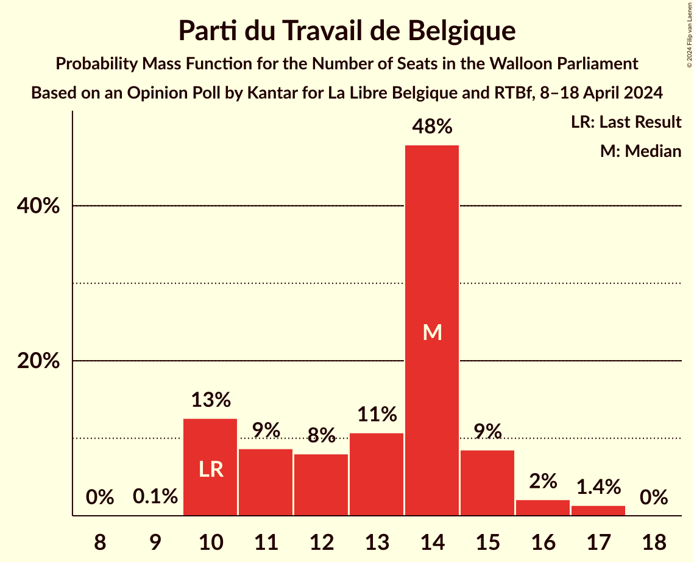

| Number of Seats | Probability | Accumulated | Special Marks |
|:---------------:|:-----------:|:-----------:|:-------------:|
| 9 | 0.1% | 100% |  |
| 10 | 13% | 99.8% | Last Result |
| 11 | 9% | 87% |  |
| 12 | 8% | 79% |  |
| 13 | 11% | 71% |  |
| 14 | 48% | 60% | Median |
| 15 | 9% | 12% |  |
| 16 | 2% | 3% |  |
| 17 | 1.4% | 1.4% |  |
| 18 | 0% | 0% |  |

### Les Engagés

*For a full overview of the results for this party, see the [Les Engagés](party-lesengagés.html) page.*

| Number of Seats | Probability | Accumulated | Special Marks |
|:---------------:|:-----------:|:-----------:|:-------------:|
| 7 | 0.1% | 100% |  |
| 8 | 0.3% | 99.9% |  |
| 9 | 0.7% | 99.7% |  |
| 10 | 5% | 99.0% | Last Result |
| 11 | 69% | 95% | Median |
| 12 | 12% | 26% |  |
| 13 | 11% | 14% |  |
| 14 | 2% | 3% |  |
| 15 | 0.7% | 0.7% |  |
| 16 | 0% | 0% |  |

### Ecolo

*For a full overview of the results for this party, see the [Ecolo](party-ecolo.html) page.*

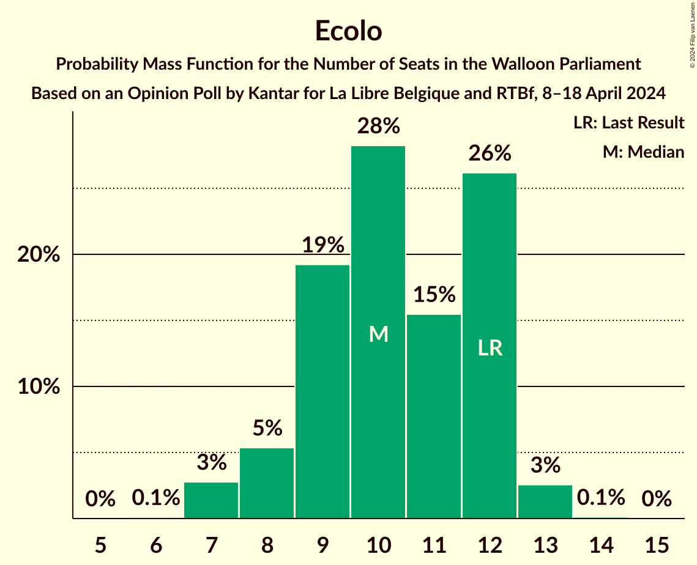

| Number of Seats | Probability | Accumulated | Special Marks |
|:---------------:|:-----------:|:-----------:|:-------------:|
| 6 | 0.1% | 100% |  |
| 7 | 3% | 99.9% |  |
| 8 | 5% | 97% |  |
| 9 | 19% | 92% |  |
| 10 | 28% | 73% | Median |
| 11 | 15% | 44% |  |
| 12 | 26% | 29% | Last Result |
| 13 | 3% | 3% |  |
| 14 | 0.1% | 0.1% |  |
| 15 | 0% | 0% |  |

### DéFI

*For a full overview of the results for this party, see the [DéFI](party-défi.html) page.*

| Number of Seats | Probability | Accumulated | Special Marks |
|:---------------:|:-----------:|:-----------:|:-------------:|
| 0 | 96% | 100% | Last Result, Median |
| 1 | 2% | 4% |  |
| 2 | 0.8% | 3% |  |
| 3 | 1.1% | 2% |  |
| 4 | 0.6% | 0.7% |  |
| 5 | 0% | 0% |  |

## Coalitions

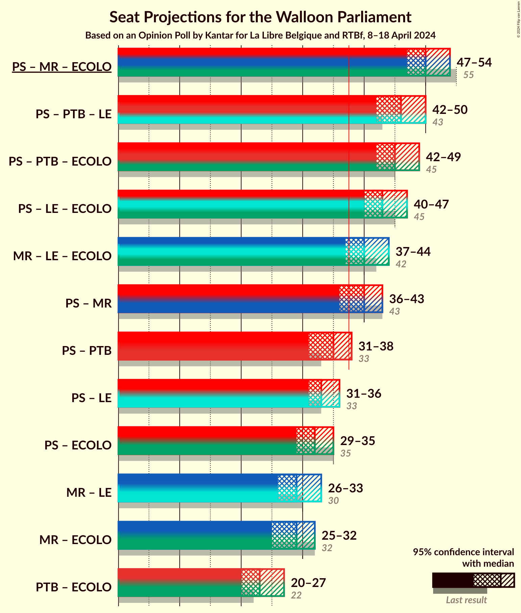

### Confidence Intervals

| Coalition | Last Result | Median | Majority? | 80% Confidence Interval | 90% Confidence Interval | 95% Confidence Interval | 99% Confidence Interval |
|:---------:|:-----------:|:------:|:---------:|:-----------------------:|:-----------------------:|:-----------------------:|:-----------------------:|
| Parti Socialiste – Mouvement Réformateur – Ecolo | 55 | 50 | 100% | 48–53 | 48–54 | 47–54 | 46–54 |
| Parti Socialiste – Parti du Travail de Belgique – Les Engagés | 43 | 46 | 100% | 44–48 | 43–49 | 42–50 | 42–51 |
| Parti Socialiste – Parti du Travail de Belgique – Ecolo | 45 | 45 | 100% | 43–47 | 42–48 | 42–49 | 41–50 |
| Parti Socialiste – Les Engagés – Ecolo | 45 | 43 | 100% | 41–46 | 41–46 | 40–47 | 39–48 |
| Mouvement Réformateur – Les Engagés – Ecolo | 42 | 40 | 94% | 38–42 | 37–43 | 37–44 | 36–44 |
| Parti Socialiste – Mouvement Réformateur | 43 | 40 | 91% | 38–42 | 37–43 | 36–43 | 36–44 |
| Parti Socialiste – Parti du Travail de Belgique | 33 | 35 | 5% | 33–37 | 32–38 | 31–38 | 30–39 |
| Parti Socialiste – Les Engagés | 33 | 33 | 0.5% | 32–35 | 31–35 | 31–36 | 30–38 |
| Parti Socialiste – Ecolo | 35 | 32 | 0.1% | 30–35 | 29–35 | 29–35 | 28–36 |
| Mouvement Réformateur – Les Engagés | 30 | 29 | 0% | 28–32 | 27–33 | 26–33 | 25–34 |
| Mouvement Réformateur – Ecolo | 32 | 29 | 0% | 27–31 | 26–31 | 25–32 | 24–33 |
| Parti du Travail de Belgique – Ecolo | 22 | 23 | 0% | 21–26 | 20–26 | 20–27 | 19–28 |

### Parti Socialiste – Mouvement Réformateur – Ecolo

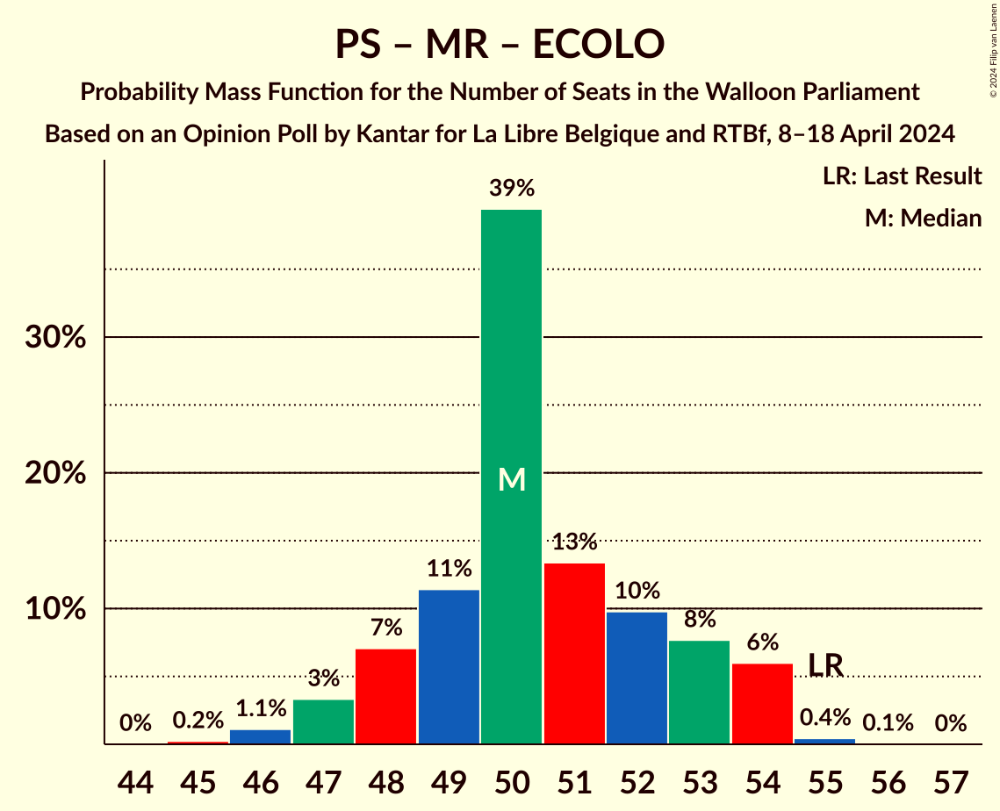

| Number of Seats | Probability | Accumulated | Special Marks |
|:---------------:|:-----------:|:-----------:|:-------------:|
| 45 | 0.2% | 100% |  |
| 46 | 1.1% | 99.7% |  |
| 47 | 3% | 98.6% |  |
| 48 | 7% | 95% |  |
| 49 | 11% | 88% |  |
| 50 | 39% | 77% | Median |
| 51 | 13% | 37% |  |
| 52 | 10% | 24% |  |
| 53 | 8% | 14% |  |
| 54 | 6% | 6% |  |
| 55 | 0.4% | 0.5% | Last Result |
| 56 | 0.1% | 0.1% |  |
| 57 | 0% | 0% |  |

### Parti Socialiste – Parti du Travail de Belgique – Les Engagés

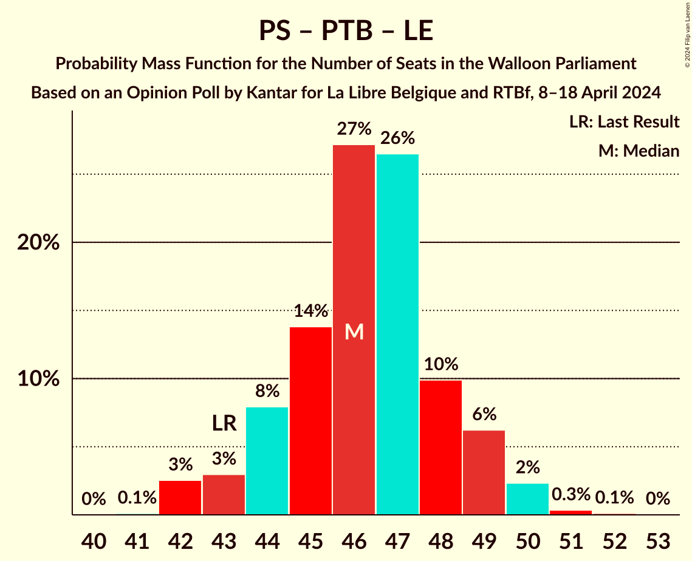

| Number of Seats | Probability | Accumulated | Special Marks |
|:---------------:|:-----------:|:-----------:|:-------------:|
| 41 | 0.1% | 100% |  |
| 42 | 3% | 99.9% |  |
| 43 | 3% | 97% | Last Result |
| 44 | 8% | 94% |  |
| 45 | 14% | 86% |  |
| 46 | 27% | 73% |  |
| 47 | 26% | 45% | Median |
| 48 | 10% | 19% |  |
| 49 | 6% | 9% |  |
| 50 | 2% | 3% |  |
| 51 | 0.3% | 0.5% |  |
| 52 | 0.1% | 0.2% |  |
| 53 | 0% | 0% |  |

### Parti Socialiste – Parti du Travail de Belgique – Ecolo

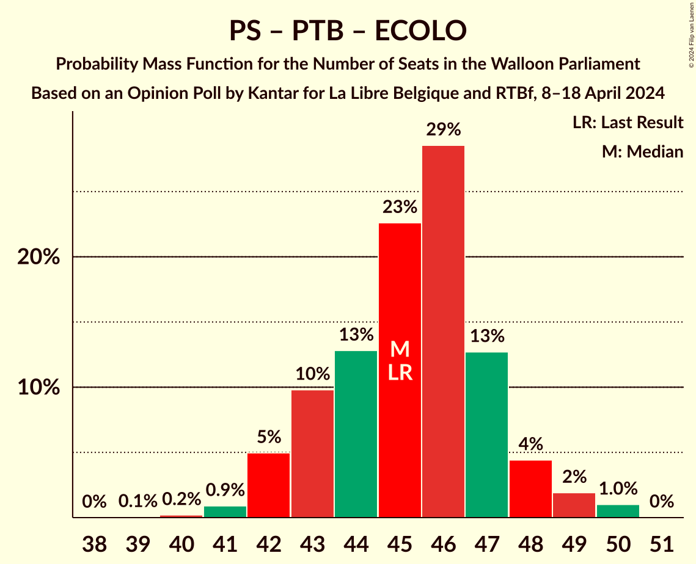

| Number of Seats | Probability | Accumulated | Special Marks |
|:---------------:|:-----------:|:-----------:|:-------------:|
| 39 | 0.1% | 100% |  |
| 40 | 0.2% | 99.9% |  |
| 41 | 0.9% | 99.7% |  |
| 42 | 5% | 98.8% |  |
| 43 | 10% | 94% |  |
| 44 | 13% | 84% |  |
| 45 | 23% | 71% | Last Result |
| 46 | 29% | 49% | Median |
| 47 | 13% | 20% |  |
| 48 | 4% | 7% |  |
| 49 | 2% | 3% |  |
| 50 | 1.0% | 1.0% |  |
| 51 | 0% | 0% |  |

### Parti Socialiste – Les Engagés – Ecolo

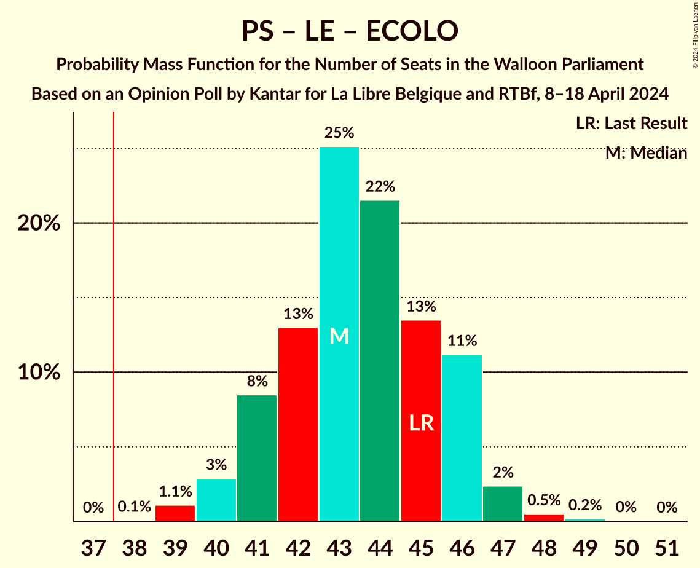

| Number of Seats | Probability | Accumulated | Special Marks |
|:---------------:|:-----------:|:-----------:|:-------------:|
| 38 | 0.1% | 100% | Majority |
| 39 | 1.1% | 99.9% |  |
| 40 | 3% | 98.8% |  |
| 41 | 8% | 96% |  |
| 42 | 13% | 87% |  |
| 43 | 25% | 74% | Median |
| 44 | 22% | 49% |  |
| 45 | 13% | 28% | Last Result |
| 46 | 11% | 14% |  |
| 47 | 2% | 3% |  |
| 48 | 0.5% | 0.7% |  |
| 49 | 0.2% | 0.2% |  |
| 50 | 0% | 0.1% |  |
| 51 | 0% | 0% |  |

### Mouvement Réformateur – Les Engagés – Ecolo

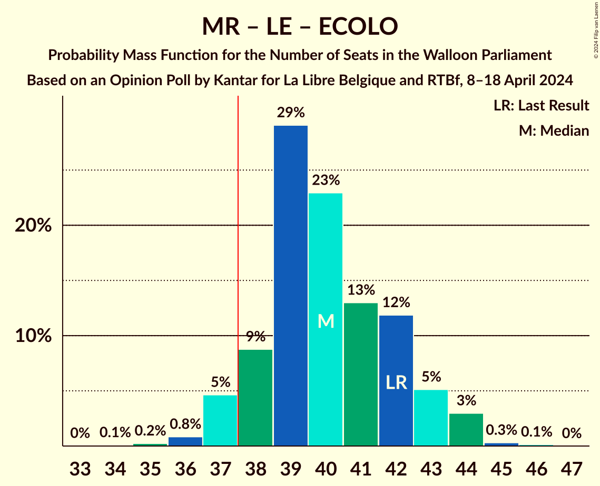

| Number of Seats | Probability | Accumulated | Special Marks |
|:---------------:|:-----------:|:-----------:|:-------------:|
| 34 | 0.1% | 100% |  |
| 35 | 0.2% | 99.9% |  |
| 36 | 0.8% | 99.7% |  |
| 37 | 5% | 98.8% |  |
| 38 | 9% | 94% | Majority |
| 39 | 29% | 85% | Median |
| 40 | 23% | 56% |  |
| 41 | 13% | 33% |  |
| 42 | 12% | 20% | Last Result |
| 43 | 5% | 9% |  |
| 44 | 3% | 3% |  |
| 45 | 0.3% | 0.4% |  |
| 46 | 0.1% | 0.1% |  |
| 47 | 0% | 0% |  |

### Parti Socialiste – Mouvement Réformateur

| Number of Seats | Probability | Accumulated | Special Marks |
|:---------------:|:-----------:|:-----------:|:-------------:|
| 34 | 0.1% | 100% |  |
| 35 | 0.3% | 99.9% |  |
| 36 | 2% | 99.6% |  |
| 37 | 6% | 97% |  |
| 38 | 11% | 91% | Majority |
| 39 | 17% | 80% |  |
| 40 | 19% | 63% | Median |
| 41 | 23% | 44% |  |
| 42 | 14% | 21% |  |
| 43 | 7% | 7% | Last Result |
| 44 | 0.5% | 0.7% |  |
| 45 | 0.1% | 0.2% |  |
| 46 | 0.1% | 0.1% |  |
| 47 | 0% | 0% |  |

### Parti Socialiste – Parti du Travail de Belgique

| Number of Seats | Probability | Accumulated | Special Marks |
|:---------------:|:-----------:|:-----------:|:-------------:|
| 29 | 0.2% | 100% |  |
| 30 | 0.4% | 99.8% |  |
| 31 | 3% | 99.4% |  |
| 32 | 6% | 96% |  |
| 33 | 12% | 91% | Last Result |
| 34 | 13% | 78% |  |
| 35 | 23% | 65% |  |
| 36 | 29% | 42% | Median |
| 37 | 8% | 13% |  |
| 38 | 4% | 5% | Majority |
| 39 | 0.6% | 0.8% |  |
| 40 | 0.1% | 0.2% |  |
| 41 | 0% | 0.1% |  |
| 42 | 0% | 0% |  |

### Parti Socialiste – Les Engagés

| Number of Seats | Probability | Accumulated | Special Marks |
|:---------------:|:-----------:|:-----------:|:-------------:|
| 28 | 0.1% | 100% |  |
| 29 | 0.3% | 99.9% |  |
| 30 | 2% | 99.6% |  |
| 31 | 5% | 98% |  |
| 32 | 27% | 92% |  |
| 33 | 27% | 66% | Last Result, Median |
| 34 | 22% | 38% |  |
| 35 | 12% | 16% |  |
| 36 | 2% | 4% |  |
| 37 | 0.8% | 1.3% |  |
| 38 | 0.4% | 0.5% | Majority |
| 39 | 0.1% | 0.1% |  |
| 40 | 0% | 0% |  |

### Parti Socialiste – Ecolo

| Number of Seats | Probability | Accumulated | Special Marks |
|:---------------:|:-----------:|:-----------:|:-------------:|
| 26 | 0.1% | 100% |  |
| 27 | 0.2% | 99.9% |  |
| 28 | 2% | 99.7% |  |
| 29 | 4% | 98% |  |
| 30 | 9% | 94% |  |
| 31 | 16% | 85% |  |
| 32 | 30% | 69% | Median |
| 33 | 20% | 39% |  |
| 34 | 9% | 19% |  |
| 35 | 9% | 10% | Last Result |
| 36 | 0.6% | 0.8% |  |
| 37 | 0.2% | 0.2% |  |
| 38 | 0% | 0.1% | Majority |
| 39 | 0% | 0% |  |

### Mouvement Réformateur – Les Engagés

| Number of Seats | Probability | Accumulated | Special Marks |
|:---------------:|:-----------:|:-----------:|:-------------:|
| 25 | 1.1% | 100% |  |
| 26 | 2% | 98.9% |  |
| 27 | 5% | 97% |  |
| 28 | 13% | 92% |  |
| 29 | 30% | 79% | Median |
| 30 | 22% | 49% | Last Result |
| 31 | 12% | 27% |  |
| 32 | 9% | 14% |  |
| 33 | 5% | 5% |  |
| 34 | 0.7% | 0.8% |  |
| 35 | 0.1% | 0.1% |  |
| 36 | 0% | 0% |  |

### Mouvement Réformateur – Ecolo

| Number of Seats | Probability | Accumulated | Special Marks |
|:---------------:|:-----------:|:-----------:|:-------------:|
| 22 | 0% | 100% |  |
| 23 | 0.2% | 99.9% |  |
| 24 | 0.5% | 99.8% |  |
| 25 | 3% | 99.3% |  |
| 26 | 7% | 97% |  |
| 27 | 11% | 90% |  |
| 28 | 27% | 80% | Median |
| 29 | 27% | 53% |  |
| 30 | 13% | 26% |  |
| 31 | 7% | 12% |  |
| 32 | 3% | 5% | Last Result |
| 33 | 2% | 2% |  |
| 34 | 0.1% | 0.1% |  |
| 35 | 0% | 0% |  |

### Parti du Travail de Belgique – Ecolo

| Number of Seats | Probability | Accumulated | Special Marks |
|:---------------:|:-----------:|:-----------:|:-------------:|
| 18 | 0.3% | 100% |  |
| 19 | 0.8% | 99.7% |  |
| 20 | 4% | 98.9% |  |
| 21 | 7% | 95% |  |
| 22 | 16% | 88% | Last Result |
| 23 | 23% | 71% |  |
| 24 | 20% | 48% | Median |
| 25 | 14% | 29% |  |
| 26 | 10% | 15% |  |
| 27 | 4% | 5% |  |
| 28 | 0.9% | 1.1% |  |
| 29 | 0.1% | 0.1% |  |
| 30 | 0% | 0% |  |

## Technical Information

### Opinion Poll

+ **Polling firm:** Kantar
+ **Commissioner(s):** La Libre Belgique and RTBf
+ **Fieldwork period:** 8–18 April 2024

### Calculations

+ **Sample size:** 1004
+ **Simulations done:** 2,097,152
+ **Error estimate:** 0.69%

