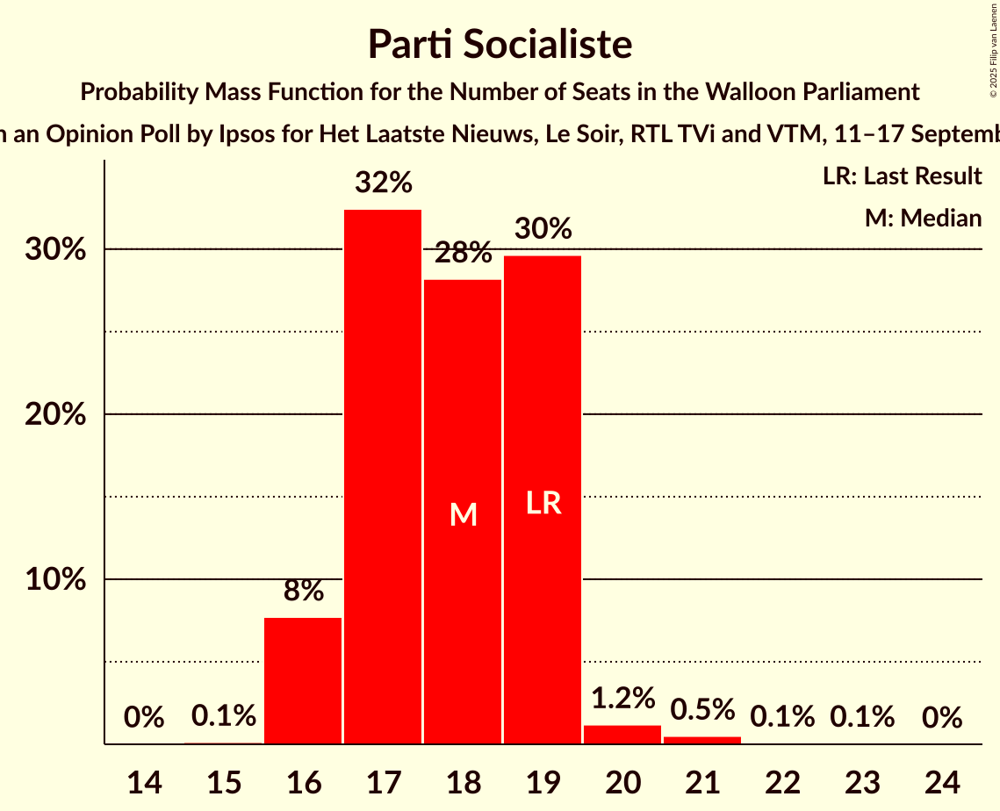

# Opinion Poll by Ipsos for Het Laatste Nieuws, Le Soir, RTL TVi and VTM, 11–17 September 2024

<a href="#voting-intentions">Voting Intentions</a> | <a href="#seats">Seats</a> | <a href="#coalitions">Coalitions</a> | <a href="#technical-information">Technical Information</a>

## Voting Intentions

### Confidence Intervals

| Party | Last Result | Poll Result | 80% Confidence Interval | 90% Confidence Interval | 95% Confidence Interval | 99% Confidence Interval |
|:-----:|:-----------:|:-----------:|:-----------------------:|:-----------------------:|:-----------------------:|:-----------------------:|
| Mouvement Réformateur | 29.6% | 26.6% | 24.9–28.5% |24.4–29.0% |23.9–29.4% |23.1–30.3% |
| Les Engagés | 20.6% | 22.6% | 21.0–24.4% |20.5–24.9% |20.1–25.3% |19.3–26.2% |
| Parti Socialiste | 23.2% | 21.7% | 20.1–23.4% |19.6–23.9% |19.3–24.4% |18.5–25.2% |
| Parti du Travail de Belgique | 12.1% | 13.1% | 11.8–14.6% |11.4–15.0% |11.1–15.3% |10.6–16.1% |
| Ecolo | 7.0% | 8.1% | 7.1–9.3% |6.8–9.7% |6.6–10.0% |6.1–10.6% |
| Chez Nous | 2.8% | 2.8% | 2.2–3.6% |2.1–3.8% |1.9–4.0% |1.7–4.4% |
| DéFI | 2.7% | 2.7% | 2.1–3.5% |2.0–3.7% |1.9–3.9% |1.6–4.3% |

*Note:* The poll result column reflects the actual value used in the calculations. Published results may vary slightly, and in addition be rounded to fewer digits.

## Seats

### Confidence Intervals

| Party | Last Result | Median | 80% Confidence Interval | 90% Confidence Interval | 95% Confidence Interval | 99% Confidence Interval |
|:-----:|:-----------:|:------:|:-----------------------:|:-----------------------:|:-----------------------:|:-----------------------:|
| <a href="#mouvement-réformateur">Mouvement Réformateur</a> | 26 | 22 | 21–24 |21–25 |20–25 |20–27 |
| <a href="#les-engagés">Les Engagés</a> | 17 | 19 | 18–21 |17–21 |16–22 |15–22 |
| <a href="#parti-socialiste">Parti Socialiste</a> | 19 | 18 | 17–19 |16–19 |16–19 |16–21 |
| <a href="#parti-du-travail-de-belgique">Parti du Travail de Belgique</a> | 8 | 11 | 8–11 |8–11 |8–12 |8–13 |
| <a href="#ecolo">Ecolo</a> | 5 | 5 | 5–6 |4–6 |3–7 |1–8 |
| <a href="#chez-nous">Chez Nous</a> | 0 | 0 | 0–2 |0–2 |0–2 |0–3 |
| <a href="#défi">DéFI</a> | 0 | 0 | 0 |0 |0 |0 |

### Mouvement Réformateur

*For a full overview of the results for this party, see the [Mouvement Réformateur](party-mouvementréformateur.html) page.*

| Number of Seats | Probability | Accumulated | Special Marks |
|:---------------:|:-----------:|:-----------:|:-------------:|
| 19 | 0.3% | 100% |  |
| 20 | 4% | 99.7% |  |
| 21 | 36% | 95% |  |
| 22 | 25% | 59% | Median |
| 23 | 19% | 34% |  |
| 24 | 9% | 15% |  |
| 25 | 4% | 5% |  |
| 26 | 1.0% | 2% | Last Result |
| 27 | 0.5% | 0.7% |  |
| 28 | 0.2% | 0.2% |  |
| 29 | 0% | 0% |  |

### Les Engagés

*For a full overview of the results for this party, see the [Les Engagés](party-lesengagés.html) page.*

| Number of Seats | Probability | Accumulated | Special Marks |
|:---------------:|:-----------:|:-----------:|:-------------:|
| 15 | 1.1% | 100% |  |
| 16 | 2% | 98.9% |  |
| 17 | 6% | 97% | Last Result |
| 18 | 13% | 90% |  |
| 19 | 49% | 78% | Median |
| 20 | 17% | 29% |  |
| 21 | 8% | 12% |  |
| 22 | 3% | 4% |  |
| 23 | 0.2% | 0.2% |  |
| 24 | 0% | 0% |  |

### Parti Socialiste

*For a full overview of the results for this party, see the [Parti Socialiste](party-partisocialiste.html) page.*

| Number of Seats | Probability | Accumulated | Special Marks |
|:---------------:|:-----------:|:-----------:|:-------------:|
| 15 | 0.1% | 100% |  |
| 16 | 8% | 99.8% |  |
| 17 | 32% | 92% |  |
| 18 | 28% | 60% | Median |
| 19 | 30% | 31% | Last Result |
| 20 | 1.2% | 2% |  |
| 21 | 0.5% | 0.6% |  |
| 22 | 0.1% | 0.1% |  |
| 23 | 0.1% | 0.1% |  |
| 24 | 0% | 0% |  |

### Parti du Travail de Belgique

*For a full overview of the results for this party, see the [Parti du Travail de Belgique](party-partidutravaildebelgique.html) page.*

| Number of Seats | Probability | Accumulated | Special Marks |
|:---------------:|:-----------:|:-----------:|:-------------:|
| 7 | 0.1% | 100% |  |
| 8 | 17% | 99.8% | Last Result |
| 9 | 11% | 83% |  |
| 10 | 10% | 71% |  |
| 11 | 57% | 61% | Median |
| 12 | 3% | 4% |  |
| 13 | 0.9% | 1.4% |  |
| 14 | 0.5% | 0.5% |  |
| 15 | 0% | 0% |  |

### Ecolo

*For a full overview of the results for this party, see the [Ecolo](party-ecolo.html) page.*

| Number of Seats | Probability | Accumulated | Special Marks |
|:---------------:|:-----------:|:-----------:|:-------------:|
| 1 | 0.9% | 100% |  |
| 2 | 1.5% | 99.1% |  |
| 3 | 1.4% | 98% |  |
| 4 | 1.3% | 96% |  |
| 5 | 63% | 95% | Last Result, Median |
| 6 | 28% | 32% |  |
| 7 | 3% | 4% |  |
| 8 | 2% | 2% |  |
| 9 | 0% | 0% |  |

### Chez Nous

*For a full overview of the results for this party, see the [Chez Nous](party-cheznous.html) page.*

| Number of Seats | Probability | Accumulated | Special Marks |
|:---------------:|:-----------:|:-----------:|:-------------:|
| 0 | 76% | 100% | Last Result, Median |
| 1 | 3% | 24% |  |
| 2 | 20% | 22% |  |
| 3 | 1.4% | 1.5% |  |
| 4 | 0.1% | 0.1% |  |
| 5 | 0% | 0% |  |

### DéFI

*For a full overview of the results for this party, see the [DéFI](party-défi.html) page.*

| Number of Seats | Probability | Accumulated | Special Marks |
|:---------------:|:-----------:|:-----------:|:-------------:|
| 0 | 100% | 100% | Last Result, Median |

## Coalitions

### Confidence Intervals

| Coalition | Last Result | Median | Majority? | 80% Confidence Interval | 90% Confidence Interval | 95% Confidence Interval | 99% Confidence Interval |
|:---------:|:-----------:|:------:|:---------:|:-----------------------:|:-----------------------:|:-----------------------:|:-----------------------:|
| Les Engagés – Parti Socialiste – Parti du Travail de Belgique | 44 | 47 | 100% | 45–49 | 44–49 | 44–50 | 42–51 |
| Mouvement Réformateur – Les Engagés – Ecolo | 48 | 46 | 100% | 45–48 | 45–49 | 44–49 | 43–50 |
| Mouvement Réformateur – Parti Socialiste – Ecolo | 50 | 45 | 100% | 43–47 | 43–48 | 42–49 | 41–50 |
| Les Engagés – Parti Socialiste – Ecolo | 41 | 42 | 99.5% | 40–44 | 40–45 | 39–45 | 37–46 |
| Mouvement Réformateur – Les Engagés | 43 | 41 | 99.4% | 40–43 | 39–44 | 39–44 | 37–45 |
| Mouvement Réformateur – Parti Socialiste | 45 | 40 | 96% | 38–42 | 38–43 | 37–43 | 37–45 |
| Les Engagés – Parti Socialiste | 36 | 37 | 39% | 35–39 | 35–39 | 34–40 | 33–41 |
| Parti Socialiste – Parti du Travail de Belgique – Ecolo | 32 | 33 | 0.2% | 31–35 | 31–35 | 30–36 | 29–37 |
| Mouvement Réformateur – Ecolo | 31 | 27 | 0% | 26–29 | 26–30 | 25–31 | 23–32 |
| Parti Socialiste – Parti du Travail de Belgique | 27 | 28 | 0% | 26–30 | 26–30 | 25–30 | 24–31 |
| Parti Socialiste – Ecolo | 24 | 23 | 0% | 22–24 | 21–25 | 21–25 | 19–27 |
| Parti du Travail de Belgique – Ecolo | 13 | 16 | 0% | 13–17 | 13–17 | 13–18 | 12–19 |

### Les Engagés – Parti Socialiste – Parti du Travail de Belgique

| Number of Seats | Probability | Accumulated | Special Marks |
|:---------------:|:-----------:|:-----------:|:-------------:|
| 41 | 0.1% | 100% |  |
| 42 | 0.5% | 99.9% |  |
| 43 | 2% | 99.4% |  |
| 44 | 3% | 98% | Last Result |
| 45 | 7% | 94% |  |
| 46 | 16% | 87% |  |
| 47 | 32% | 72% |  |
| 48 | 18% | 40% | Median |
| 49 | 19% | 21% |  |
| 50 | 2% | 3% |  |
| 51 | 0.8% | 1.1% |  |
| 52 | 0.2% | 0.3% |  |
| 53 | 0.1% | 0.1% |  |
| 54 | 0% | 0% |  |

### Mouvement Réformateur – Les Engagés – Ecolo

| Number of Seats | Probability | Accumulated | Special Marks |
|:---------------:|:-----------:|:-----------:|:-------------:|
| 41 | 0% | 100% |  |
| 42 | 0.3% | 99.9% |  |
| 43 | 1.4% | 99.7% |  |
| 44 | 3% | 98% |  |
| 45 | 25% | 95% |  |
| 46 | 20% | 70% | Median |
| 47 | 29% | 50% |  |
| 48 | 12% | 21% | Last Result |
| 49 | 6% | 8% |  |
| 50 | 2% | 2% |  |
| 51 | 0.2% | 0.2% |  |
| 52 | 0% | 0% |  |

### Mouvement Réformateur – Parti Socialiste – Ecolo

| Number of Seats | Probability | Accumulated | Special Marks |
|:---------------:|:-----------:|:-----------:|:-------------:|
| 40 | 0.1% | 100% |  |
| 41 | 0.4% | 99.8% |  |
| 42 | 2% | 99.5% |  |
| 43 | 8% | 97% |  |
| 44 | 19% | 89% |  |
| 45 | 35% | 70% | Median |
| 46 | 17% | 36% |  |
| 47 | 11% | 19% |  |
| 48 | 5% | 8% |  |
| 49 | 2% | 3% |  |
| 50 | 0.5% | 0.7% | Last Result |
| 51 | 0.2% | 0.2% |  |
| 52 | 0% | 0% |  |

### Les Engagés – Parti Socialiste – Ecolo

| Number of Seats | Probability | Accumulated | Special Marks |
|:---------------:|:-----------:|:-----------:|:-------------:|
| 36 | 0.1% | 100% |  |
| 37 | 0.4% | 99.9% |  |
| 38 | 1.1% | 99.5% | Majority |
| 39 | 3% | 98% |  |
| 40 | 8% | 96% |  |
| 41 | 21% | 88% | Last Result |
| 42 | 21% | 67% | Median |
| 43 | 30% | 46% |  |
| 44 | 9% | 16% |  |
| 45 | 5% | 7% |  |
| 46 | 2% | 2% |  |
| 47 | 0.2% | 0.2% |  |
| 48 | 0% | 0% |  |

### Mouvement Réformateur – Les Engagés

| Number of Seats | Probability | Accumulated | Special Marks |
|:---------------:|:-----------:|:-----------:|:-------------:|
| 36 | 0.1% | 100% |  |
| 37 | 0.4% | 99.9% |  |
| 38 | 2% | 99.4% | Majority |
| 39 | 5% | 98% |  |
| 40 | 31% | 93% |  |
| 41 | 20% | 62% | Median |
| 42 | 25% | 42% |  |
| 43 | 12% | 17% | Last Result |
| 44 | 3% | 5% |  |
| 45 | 1.3% | 2% |  |
| 46 | 0.2% | 0.3% |  |
| 47 | 0% | 0.1% |  |
| 48 | 0% | 0% |  |

### Mouvement Réformateur – Parti Socialiste

| Number of Seats | Probability | Accumulated | Special Marks |
|:---------------:|:-----------:|:-----------:|:-------------:|
| 36 | 0.2% | 100% |  |
| 37 | 4% | 99.8% |  |
| 38 | 8% | 96% | Majority |
| 39 | 31% | 88% |  |
| 40 | 27% | 57% | Median |
| 41 | 15% | 30% |  |
| 42 | 9% | 16% |  |
| 43 | 4% | 6% |  |
| 44 | 2% | 2% |  |
| 45 | 0.4% | 0.7% | Last Result |
| 46 | 0.2% | 0.2% |  |
| 47 | 0% | 0% |  |

### Les Engagés – Parti Socialiste

| Number of Seats | Probability | Accumulated | Special Marks |
|:---------------:|:-----------:|:-----------:|:-------------:|
| 32 | 0.4% | 100% |  |
| 33 | 1.2% | 99.5% |  |
| 34 | 3% | 98% |  |
| 35 | 11% | 95% |  |
| 36 | 26% | 84% | Last Result |
| 37 | 20% | 59% | Median |
| 38 | 25% | 39% | Majority |
| 39 | 9% | 13% |  |
| 40 | 3% | 5% |  |
| 41 | 1.1% | 1.3% |  |
| 42 | 0.1% | 0.2% |  |
| 43 | 0% | 0% |  |

### Parti Socialiste – Parti du Travail de Belgique – Ecolo

| Number of Seats | Probability | Accumulated | Special Marks |
|:---------------:|:-----------:|:-----------:|:-------------:|
| 28 | 0.1% | 100% |  |
| 29 | 0.6% | 99.9% |  |
| 30 | 3% | 99.3% |  |
| 31 | 6% | 96% |  |
| 32 | 16% | 90% | Last Result |
| 33 | 31% | 74% |  |
| 34 | 18% | 43% | Median |
| 35 | 21% | 25% |  |
| 36 | 3% | 4% |  |
| 37 | 0.7% | 0.9% |  |
| 38 | 0.2% | 0.2% | Majority |
| 39 | 0.1% | 0.1% |  |
| 40 | 0% | 0% |  |

### Mouvement Réformateur – Ecolo

| Number of Seats | Probability | Accumulated | Special Marks |
|:---------------:|:-----------:|:-----------:|:-------------:|
| 22 | 0.2% | 100% |  |
| 23 | 0.4% | 99.8% |  |
| 24 | 1.5% | 99.5% |  |
| 25 | 3% | 98% |  |
| 26 | 28% | 95% |  |
| 27 | 21% | 67% | Median |
| 28 | 27% | 46% |  |
| 29 | 12% | 19% |  |
| 30 | 5% | 7% |  |
| 31 | 2% | 3% | Last Result |
| 32 | 0.8% | 1.0% |  |
| 33 | 0.2% | 0.3% |  |
| 34 | 0% | 0% |  |

### Parti Socialiste – Parti du Travail de Belgique

| Number of Seats | Probability | Accumulated | Special Marks |
|:---------------:|:-----------:|:-----------:|:-------------:|
| 24 | 0.8% | 100% |  |
| 25 | 4% | 99.1% |  |
| 26 | 9% | 95% |  |
| 27 | 16% | 86% | Last Result |
| 28 | 33% | 70% |  |
| 29 | 17% | 36% | Median |
| 30 | 17% | 19% |  |
| 31 | 1.5% | 2% |  |
| 32 | 0.3% | 0.5% |  |
| 33 | 0.1% | 0.1% |  |
| 34 | 0% | 0% |  |

### Parti Socialiste – Ecolo

| Number of Seats | Probability | Accumulated | Special Marks |
|:---------------:|:-----------:|:-----------:|:-------------:|
| 18 | 0.2% | 100% |  |
| 19 | 0.5% | 99.7% |  |
| 20 | 1.2% | 99.3% |  |
| 21 | 4% | 98% |  |
| 22 | 27% | 94% |  |
| 23 | 23% | 67% | Median |
| 24 | 36% | 43% | Last Result |
| 25 | 6% | 8% |  |
| 26 | 2% | 2% |  |
| 27 | 0.5% | 0.6% |  |
| 28 | 0.1% | 0.1% |  |
| 29 | 0% | 0% |  |

### Parti du Travail de Belgique – Ecolo

| Number of Seats | Probability | Accumulated | Special Marks |
|:---------------:|:-----------:|:-----------:|:-------------:|
| 9 | 0.1% | 100% |  |
| 10 | 0.1% | 99.9% |  |
| 11 | 0.3% | 99.8% |  |
| 12 | 0.8% | 99.5% |  |
| 13 | 11% | 98.7% | Last Result |
| 14 | 14% | 88% |  |
| 15 | 12% | 74% |  |
| 16 | 40% | 61% | Median |
| 17 | 18% | 21% |  |
| 18 | 2% | 4% |  |
| 19 | 1.1% | 1.2% |  |
| 20 | 0.1% | 0.2% |  |
| 21 | 0% | 0% |  |

## Technical Information

### Opinion Poll

+ **Polling firm:** Ipsos
+ **Commissioner(s):** Het Laatste Nieuws, Le Soir, RTL TVi and VTM
+ **Fieldwork period:** 11–17 September 2024

### Calculations

+ **Sample size:** 1000
+ **Simulations done:** 2,097,152
+ **Error estimate:** 0.69%

