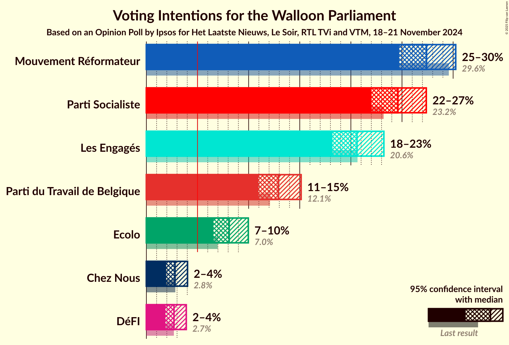
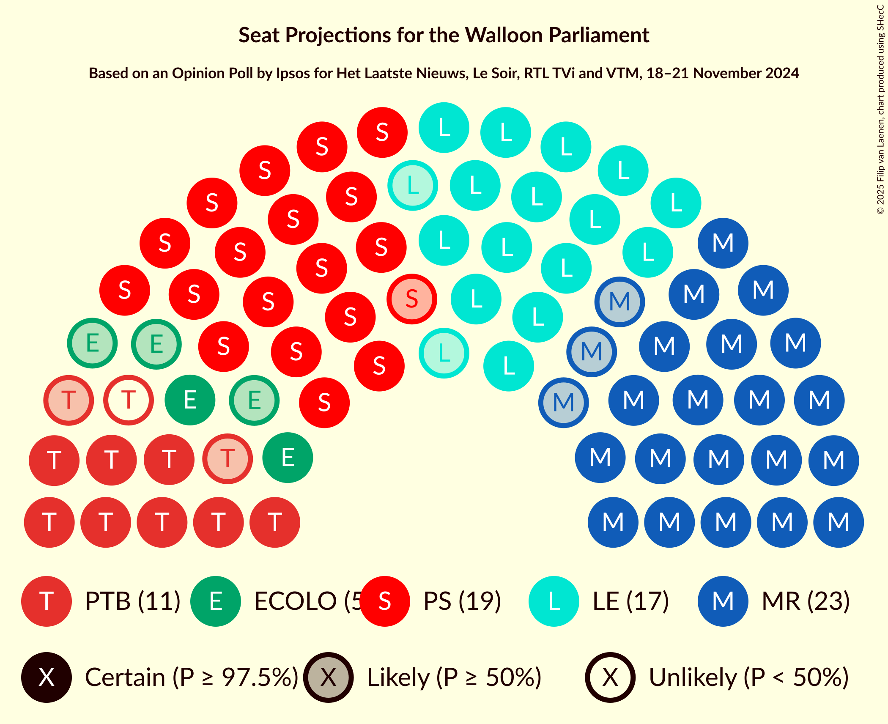
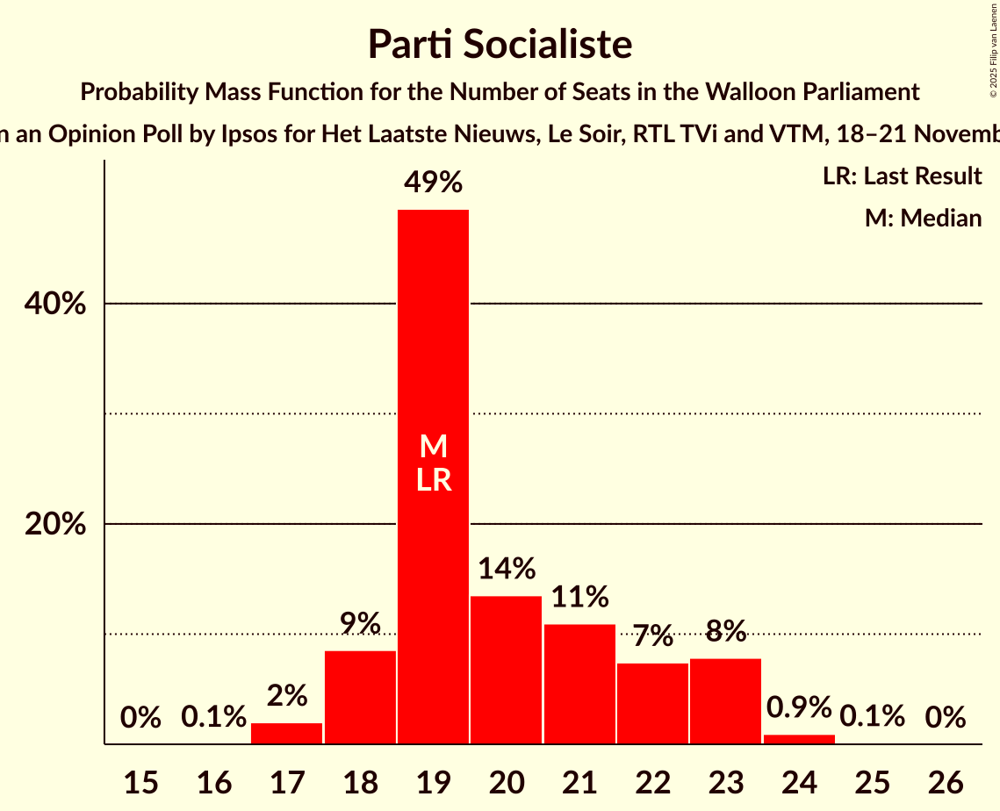
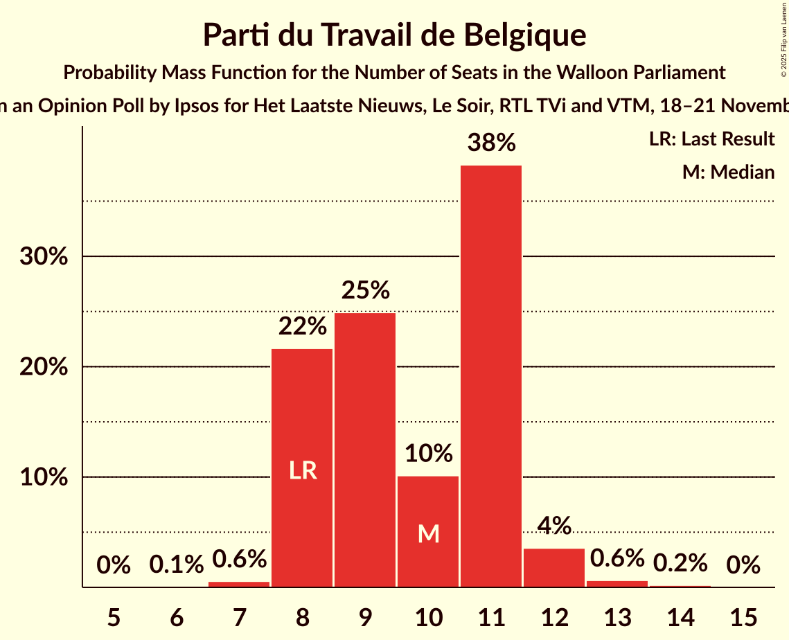
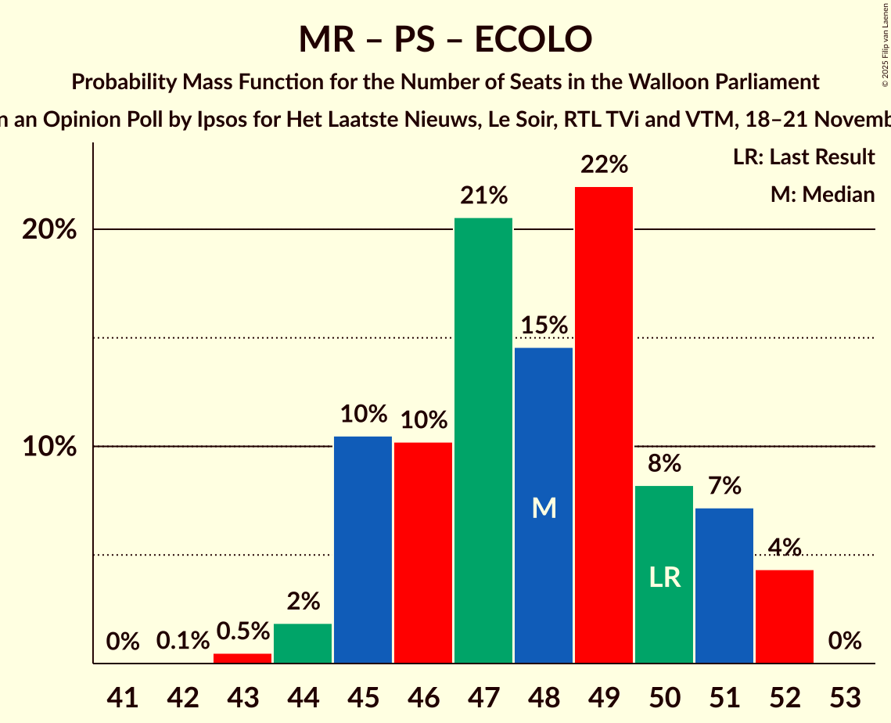
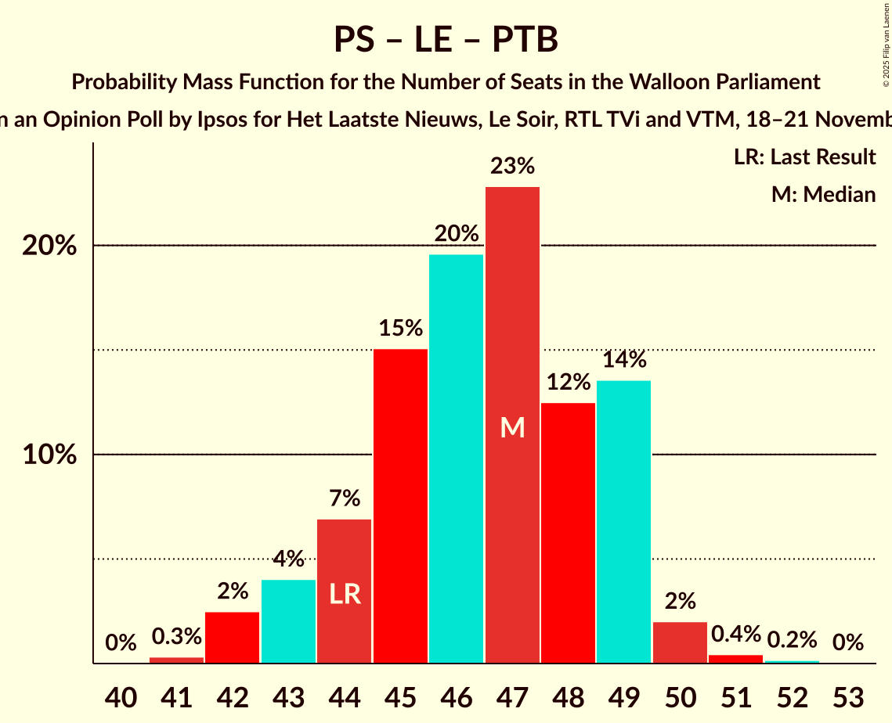
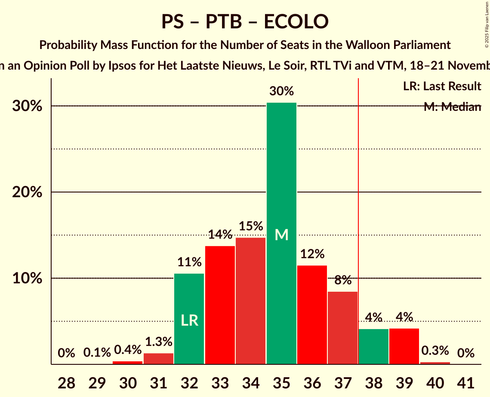

# Opinion Poll by Ipsos for Het Laatste Nieuws, Le Soir, RTL TVi and VTM, 18–21 November 2024

<a href="#voting-intentions">Voting Intentions</a> | <a href="#seats">Seats</a> | <a href="#coalitions">Coalitions</a> | <a href="#technical-information">Technical Information</a>

## Voting Intentions

### Confidence Intervals

| Party | Last Result | Poll Result | 80% Confidence Interval | 90% Confidence Interval | 95% Confidence Interval | 99% Confidence Interval |
|:-----:|:-----------:|:-----------:|:-----------------------:|:-----------------------:|:-----------------------:|:-----------------------:|
| Mouvement Réformateur | 29.6% | 27.4% | 25.6–29.3% |25.1–29.8% |24.7–30.3% |23.9–31.2% |
| Parti Socialiste | 23.2% | 24.6% | 22.9–26.4% |22.4–26.9% |22.0–27.4% |21.2–28.3% |
| Les Engagés | 20.6% | 20.6% | 19.0–22.3% |18.6–22.8% |18.2–23.2% |17.5–24.1% |
| Parti du Travail de Belgique | 12.1% | 12.9% | 11.6–14.4% |11.3–14.8% |11.0–15.1% |10.4–15.9% |
| Ecolo | 7.0% | 8.1% | 7.1–9.3% |6.8–9.7% |6.6–10.0% |6.1–10.6% |
| Chez Nous | 2.8% | 2.8% | 2.2–3.6% |2.1–3.8% |1.9–4.0% |1.7–4.4% |
| DéFI | 2.7% | 2.7% | 2.1–3.5% |2.0–3.7% |1.9–3.9% |1.6–4.3% |

*Note:* The poll result column reflects the actual value used in the calculations. Published results may vary slightly, and in addition be rounded to fewer digits.

## Seats

### Confidence Intervals

| Party | Last Result | Median | 80% Confidence Interval | 90% Confidence Interval | 95% Confidence Interval | 99% Confidence Interval |
|:-----:|:-----------:|:------:|:-----------------------:|:-----------------------:|:-----------------------:|:-----------------------:|
| <a href="#mouvement-réformateur">Mouvement Réformateur</a> | 26 | 23 | 21–25 |21–26 |20–27 |20–27 |
| <a href="#parti-socialiste">Parti Socialiste</a> | 19 | 19 | 18–22 |18–23 |18–23 |17–24 |
| <a href="#les-engagés">Les Engagés</a> | 17 | 17 | 15–19 |15–19 |15–19 |15–21 |
| <a href="#parti-du-travail-de-belgique">Parti du Travail de Belgique</a> | 8 | 10 | 8–11 |8–11 |8–12 |7–13 |
| <a href="#ecolo">Ecolo</a> | 5 | 5 | 5–6 |3–7 |2–7 |1–8 |
| <a href="#chez-nous">Chez Nous</a> | 0 | 0 | 0–2 |0–2 |0–2 |0–3 |
| <a href="#défi">DéFI</a> | 0 | 0 | 0 |0 |0 |0 |

### Mouvement Réformateur

*For a full overview of the results for this party, see the [Mouvement Réformateur](party-mouvementréformateur.html) page.*

| Number of Seats | Probability | Accumulated | Special Marks |
|:---------------:|:-----------:|:-----------:|:-------------:|
| 19 | 0.1% | 100% |  |
| 20 | 4% | 99.9% |  |
| 21 | 22% | 96% |  |
| 22 | 17% | 74% |  |
| 23 | 22% | 57% | Median |
| 24 | 14% | 35% |  |
| 25 | 13% | 21% |  |
| 26 | 5% | 8% | Last Result |
| 27 | 3% | 3% |  |
| 28 | 0.5% | 0.5% |  |
| 29 | 0% | 0% |  |

### Parti Socialiste

*For a full overview of the results for this party, see the [Parti Socialiste](party-partisocialiste.html) page.*

| Number of Seats | Probability | Accumulated | Special Marks |
|:---------------:|:-----------:|:-----------:|:-------------:|
| 16 | 0.1% | 100% |  |
| 17 | 2% | 99.9% |  |
| 18 | 9% | 98% |  |
| 19 | 49% | 89% | Last Result, Median |
| 20 | 14% | 41% |  |
| 21 | 11% | 27% |  |
| 22 | 7% | 16% |  |
| 23 | 8% | 9% |  |
| 24 | 0.9% | 1.1% |  |
| 25 | 0.1% | 0.1% |  |
| 26 | 0% | 0% |  |

### Les Engagés

*For a full overview of the results for this party, see the [Les Engagés](party-lesengagés.html) page.*

| Number of Seats | Probability | Accumulated | Special Marks |
|:---------------:|:-----------:|:-----------:|:-------------:|
| 14 | 0.3% | 100% |  |
| 15 | 30% | 99.6% |  |
| 16 | 14% | 69% |  |
| 17 | 18% | 55% | Last Result, Median |
| 18 | 14% | 37% |  |
| 19 | 21% | 23% |  |
| 20 | 2% | 2% |  |
| 21 | 0.6% | 0.6% |  |
| 22 | 0% | 0% |  |

### Parti du Travail de Belgique

*For a full overview of the results for this party, see the [Parti du Travail de Belgique](party-partidutravaildebelgique.html) page.*

| Number of Seats | Probability | Accumulated | Special Marks |
|:---------------:|:-----------:|:-----------:|:-------------:|
| 6 | 0.1% | 100% |  |
| 7 | 0.6% | 99.9% |  |
| 8 | 22% | 99.4% | Last Result |
| 9 | 25% | 78% |  |
| 10 | 10% | 53% | Median |
| 11 | 38% | 43% |  |
| 12 | 4% | 4% |  |
| 13 | 0.6% | 0.8% |  |
| 14 | 0.2% | 0.2% |  |
| 15 | 0% | 0% |  |

### Ecolo

*For a full overview of the results for this party, see the [Ecolo](party-ecolo.html) page.*

| Number of Seats | Probability | Accumulated | Special Marks |
|:---------------:|:-----------:|:-----------:|:-------------:|
| 1 | 1.0% | 100% |  |
| 2 | 2% | 99.0% |  |
| 3 | 2% | 97% |  |
| 4 | 2% | 95% |  |
| 5 | 67% | 93% | Last Result, Median |
| 6 | 20% | 26% |  |
| 7 | 5% | 6% |  |
| 8 | 2% | 2% |  |
| 9 | 0% | 0% |  |

### Chez Nous

*For a full overview of the results for this party, see the [Chez Nous](party-cheznous.html) page.*

| Number of Seats | Probability | Accumulated | Special Marks |
|:---------------:|:-----------:|:-----------:|:-------------:|
| 0 | 80% | 100% | Last Result, Median |
| 1 | 1.2% | 20% |  |
| 2 | 18% | 19% |  |
| 3 | 1.0% | 1.0% |  |
| 4 | 0% | 0% |  |

### DéFI

*For a full overview of the results for this party, see the [DéFI](party-défi.html) page.*

| Number of Seats | Probability | Accumulated | Special Marks |
|:---------------:|:-----------:|:-----------:|:-------------:|
| 0 | 100% | 100% | Last Result, Median |

## Coalitions

### Confidence Intervals

| Coalition | Last Result | Median | Majority? | 80% Confidence Interval | 90% Confidence Interval | 95% Confidence Interval | 99% Confidence Interval |
|:---------:|:-----------:|:------:|:---------:|:-----------------------:|:-----------------------:|:-----------------------:|:-----------------------:|
| Mouvement Réformateur – Parti Socialiste – Ecolo | 50 | 48 | 100% | 45–51 | 45–51 | 45–52 | 43–52 |
| Parti Socialiste – Les Engagés – Parti du Travail de Belgique | 44 | 47 | 100% | 44–49 | 43–49 | 42–50 | 42–51 |
| Mouvement Réformateur – Les Engagés – Ecolo | 48 | 45 | 100% | 42–47 | 41–48 | 41–48 | 41–49 |
| Mouvement Réformateur – Parti Socialiste | 45 | 43 | 100% | 40–46 | 40–46 | 39–47 | 39–47 |
| Parti Socialiste – Les Engagés – Ecolo | 41 | 42 | 99.2% | 39–44 | 39–45 | 39–45 | 37–46 |
| Mouvement Réformateur – Les Engagés | 43 | 40 | 88% | 37–42 | 36–43 | 36–43 | 35–44 |
| Parti Socialiste – Les Engagés | 36 | 37 | 36% | 34–39 | 34–39 | 34–40 | 33–41 |
| Parti Socialiste – Parti du Travail de Belgique – Ecolo | 32 | 35 | 9% | 32–37 | 32–38 | 32–39 | 31–39 |
| Parti Socialiste – Parti du Travail de Belgique | 27 | 30 | 0% | 27–32 | 27–33 | 27–34 | 26–34 |
| Mouvement Réformateur – Ecolo | 31 | 28 | 0% | 26–30 | 26–31 | 25–32 | 24–33 |
| Parti Socialiste – Ecolo | 24 | 25 | 0% | 23–28 | 23–28 | 22–29 | 21–29 |
| Parti du Travail de Belgique – Ecolo | 13 | 15 | 0% | 13–17 | 13–17 | 12–18 | 11–19 |

### Mouvement Réformateur – Parti Socialiste – Ecolo

| Number of Seats | Probability | Accumulated | Special Marks |
|:---------------:|:-----------:|:-----------:|:-------------:|
| 42 | 0.1% | 100% |  |
| 43 | 0.5% | 99.9% |  |
| 44 | 2% | 99.4% |  |
| 45 | 10% | 98% |  |
| 46 | 10% | 87% |  |
| 47 | 21% | 77% | Median |
| 48 | 15% | 56% |  |
| 49 | 22% | 42% |  |
| 50 | 8% | 20% | Last Result |
| 51 | 7% | 12% |  |
| 52 | 4% | 4% |  |
| 53 | 0% | 0% |  |

### Parti Socialiste – Les Engagés – Parti du Travail de Belgique

| Number of Seats | Probability | Accumulated | Special Marks |
|:---------------:|:-----------:|:-----------:|:-------------:|
| 41 | 0.3% | 100% |  |
| 42 | 2% | 99.7% |  |
| 43 | 4% | 97% |  |
| 44 | 7% | 93% | Last Result |
| 45 | 15% | 86% |  |
| 46 | 20% | 71% | Median |
| 47 | 23% | 52% |  |
| 48 | 12% | 29% |  |
| 49 | 14% | 16% |  |
| 50 | 2% | 3% |  |
| 51 | 0.4% | 0.6% |  |
| 52 | 0.2% | 0.2% |  |
| 53 | 0% | 0% |  |

### Mouvement Réformateur – Les Engagés – Ecolo

| Number of Seats | Probability | Accumulated | Special Marks |
|:---------------:|:-----------:|:-----------:|:-------------:|
| 39 | 0.1% | 100% |  |
| 40 | 0.3% | 99.9% |  |
| 41 | 5% | 99.5% |  |
| 42 | 5% | 95% |  |
| 43 | 9% | 90% |  |
| 44 | 13% | 81% |  |
| 45 | 31% | 68% | Median |
| 46 | 17% | 38% |  |
| 47 | 12% | 20% |  |
| 48 | 7% | 8% | Last Result |
| 49 | 0.9% | 1.0% |  |
| 50 | 0.1% | 0.1% |  |
| 51 | 0% | 0% |  |

### Mouvement Réformateur – Parti Socialiste

| Number of Seats | Probability | Accumulated | Special Marks |
|:---------------:|:-----------:|:-----------:|:-------------:|
| 38 | 0.3% | 100% | Majority |
| 39 | 4% | 99.6% |  |
| 40 | 10% | 96% |  |
| 41 | 13% | 85% |  |
| 42 | 20% | 72% | Median |
| 43 | 14% | 52% |  |
| 44 | 19% | 38% |  |
| 45 | 8% | 19% | Last Result |
| 46 | 8% | 11% |  |
| 47 | 3% | 3% |  |
| 48 | 0.2% | 0.3% |  |
| 49 | 0.1% | 0.1% |  |
| 50 | 0% | 0% |  |

### Parti Socialiste – Les Engagés – Ecolo

| Number of Seats | Probability | Accumulated | Special Marks |
|:---------------:|:-----------:|:-----------:|:-------------:|
| 36 | 0.2% | 100% |  |
| 37 | 0.6% | 99.8% |  |
| 38 | 1.5% | 99.2% | Majority |
| 39 | 10% | 98% |  |
| 40 | 10% | 88% |  |
| 41 | 18% | 78% | Last Result, Median |
| 42 | 19% | 59% |  |
| 43 | 23% | 41% |  |
| 44 | 12% | 18% |  |
| 45 | 5% | 6% |  |
| 46 | 0.9% | 1.0% |  |
| 47 | 0.1% | 0.1% |  |
| 48 | 0% | 0% |  |

### Mouvement Réformateur – Les Engagés

| Number of Seats | Probability | Accumulated | Special Marks |
|:---------------:|:-----------:|:-----------:|:-------------:|
| 35 | 0.6% | 100% |  |
| 36 | 6% | 99.3% |  |
| 37 | 6% | 94% |  |
| 38 | 10% | 88% | Majority |
| 39 | 13% | 78% |  |
| 40 | 33% | 65% | Median |
| 41 | 15% | 33% |  |
| 42 | 10% | 18% |  |
| 43 | 7% | 8% | Last Result |
| 44 | 0.5% | 0.7% |  |
| 45 | 0.1% | 0.2% |  |
| 46 | 0% | 0% |  |

### Parti Socialiste – Les Engagés

| Number of Seats | Probability | Accumulated | Special Marks |
|:---------------:|:-----------:|:-----------:|:-------------:|
| 32 | 0.4% | 100% |  |
| 33 | 2% | 99.6% |  |
| 34 | 12% | 98% |  |
| 35 | 13% | 86% |  |
| 36 | 17% | 74% | Last Result, Median |
| 37 | 20% | 56% |  |
| 38 | 23% | 36% | Majority |
| 39 | 8% | 13% |  |
| 40 | 4% | 5% |  |
| 41 | 0.8% | 1.0% |  |
| 42 | 0.1% | 0.2% |  |
| 43 | 0% | 0% |  |

### Parti Socialiste – Parti du Travail de Belgique – Ecolo

| Number of Seats | Probability | Accumulated | Special Marks |
|:---------------:|:-----------:|:-----------:|:-------------:|
| 29 | 0.1% | 100% |  |
| 30 | 0.4% | 99.9% |  |
| 31 | 1.3% | 99.5% |  |
| 32 | 11% | 98% | Last Result |
| 33 | 14% | 88% |  |
| 34 | 15% | 74% | Median |
| 35 | 30% | 59% |  |
| 36 | 12% | 29% |  |
| 37 | 8% | 17% |  |
| 38 | 4% | 9% | Majority |
| 39 | 4% | 5% |  |
| 40 | 0.3% | 0.3% |  |
| 41 | 0% | 0% |  |

### Parti Socialiste – Parti du Travail de Belgique

| Number of Seats | Probability | Accumulated | Special Marks |
|:---------------:|:-----------:|:-----------:|:-------------:|
| 25 | 0.3% | 100% |  |
| 26 | 2% | 99.7% |  |
| 27 | 11% | 98% | Last Result |
| 28 | 15% | 87% |  |
| 29 | 17% | 71% | Median |
| 30 | 28% | 54% |  |
| 31 | 11% | 26% |  |
| 32 | 7% | 14% |  |
| 33 | 3% | 7% |  |
| 34 | 4% | 4% |  |
| 35 | 0.1% | 0.2% |  |
| 36 | 0% | 0% |  |

### Mouvement Réformateur – Ecolo

| Number of Seats | Probability | Accumulated | Special Marks |
|:---------------:|:-----------:|:-----------:|:-------------:|
| 22 | 0.1% | 100% |  |
| 23 | 0.3% | 99.9% |  |
| 24 | 0.7% | 99.7% |  |
| 25 | 3% | 98.9% |  |
| 26 | 18% | 96% |  |
| 27 | 15% | 78% |  |
| 28 | 21% | 63% | Median |
| 29 | 19% | 41% |  |
| 30 | 13% | 23% |  |
| 31 | 5% | 9% | Last Result |
| 32 | 3% | 4% |  |
| 33 | 1.2% | 1.2% |  |
| 34 | 0% | 0% |  |

### Parti Socialiste – Ecolo

| Number of Seats | Probability | Accumulated | Special Marks |
|:---------------:|:-----------:|:-----------:|:-------------:|
| 20 | 0.4% | 100% |  |
| 21 | 0.9% | 99.6% |  |
| 22 | 3% | 98.6% |  |
| 23 | 6% | 96% |  |
| 24 | 39% | 90% | Last Result, Median |
| 25 | 18% | 51% |  |
| 26 | 14% | 33% |  |
| 27 | 8% | 19% |  |
| 28 | 7% | 10% |  |
| 29 | 3% | 3% |  |
| 30 | 0.3% | 0.3% |  |
| 31 | 0% | 0% |  |

### Parti du Travail de Belgique – Ecolo

| Number of Seats | Probability | Accumulated | Special Marks |
|:---------------:|:-----------:|:-----------:|:-------------:|
| 10 | 0.4% | 100% |  |
| 11 | 0.6% | 99.5% |  |
| 12 | 2% | 99.0% |  |
| 13 | 18% | 97% | Last Result |
| 14 | 22% | 80% |  |
| 15 | 13% | 58% | Median |
| 16 | 33% | 45% |  |
| 17 | 9% | 12% |  |
| 18 | 3% | 4% |  |
| 19 | 0.8% | 1.0% |  |
| 20 | 0.1% | 0.2% |  |
| 21 | 0% | 0% |  |

## Technical Information

### Opinion Poll

+ **Polling firm:** Ipsos
+ **Commissioner(s):** Het Laatste Nieuws, Le Soir, RTL TVi and VTM
+ **Fieldwork period:** 18–21 November 2024

### Calculations

+ **Sample size:** 1000
+ **Simulations done:** 2,097,152
+ **Error estimate:** 0.81%

